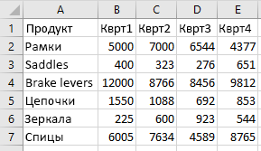

# <a name="work-with-tables-using-the-excel-javascript-api"></a><span data-ttu-id="6acd8-103">Работа с таблицами с использованием API JavaScript для Excel</span><span class="sxs-lookup"><span data-stu-id="6acd8-103">Work with tables using the Excel JavaScript API</span></span>

<span data-ttu-id="6acd8-104">В этой статье приведены примеры кода, в которых показано, как выполнять стандартные задачи для таблиц с использованием API JavaScript для Excel.</span><span class="sxs-lookup"><span data-stu-id="6acd8-104">This article provides code samples that show how to perform common tasks with tables using the Excel JavaScript API.</span></span> <span data-ttu-id="6acd8-105">Полный список свойств и методов, поддерживаемых объектами и объектами, см. в таблице Object `Table` `TableCollection` [(API JavaScript](/javascript/api/excel/excel.table) для Excel) и [TableCollection Object (API JavaScript](/javascript/api/excel/excel.tablecollection)для Excel).</span><span class="sxs-lookup"><span data-stu-id="6acd8-105">For the complete list of properties and methods that the `Table` and `TableCollection` objects support, see [Table Object (JavaScript API for Excel)](/javascript/api/excel/excel.table) and [TableCollection Object (JavaScript API for Excel)](/javascript/api/excel/excel.tablecollection).</span></span>

## <a name="create-a-table"></a><span data-ttu-id="6acd8-106">Создание таблицы</span><span class="sxs-lookup"><span data-stu-id="6acd8-106">Create a table</span></span>

<span data-ttu-id="6acd8-107">В примере кода ниже показано, как создать таблицу на листе **Sample** (Пример).</span><span class="sxs-lookup"><span data-stu-id="6acd8-107">The following code sample creates a table in the worksheet named **Sample**.</span></span> <span data-ttu-id="6acd8-108">В таблице имеются заголовки, а также четыре столбца и семь строк с данными.</span><span class="sxs-lookup"><span data-stu-id="6acd8-108">The table has headers and contains four columns and seven rows of data.</span></span> <span data-ttu-id="6acd8-109">Если Excel, в котором работает код, [](../reference/requirement-sets/excel-api-requirement-sets.md) поддерживает набор требований **ExcelApi 1.2,** то ширина столбцов и высота строк лучше всего соответствуют текущим данным в таблице.</span><span class="sxs-lookup"><span data-stu-id="6acd8-109">If the Excel application where the code is running supports [requirement set](../reference/requirement-sets/excel-api-requirement-sets.md) **ExcelApi 1.2**, the width of the columns and height of the rows are set to best fit the current data in the table.</span></span>

> [!NOTE]
> <span data-ttu-id="6acd8-110">Чтобы указать имя таблицы, сначала необходимо создать таблицу, а затем задать ее свойство, как показано `name` в следующем примере.</span><span class="sxs-lookup"><span data-stu-id="6acd8-110">To specify a name for a table, you must first create the table and then set its `name` property, as shown in the following example.</span></span>

```js
Excel.run(function (context) {
    var sheet = context.workbook.worksheets.getItem("Sample");
    var expensesTable = sheet.tables.add("A1:D1", true /*hasHeaders*/);
    expensesTable.name = "ExpensesTable";

    expensesTable.getHeaderRowRange().values = [["Date", "Merchant", "Category", "Amount"]];

    expensesTable.rows.add(null /*add rows to the end of the table*/, [
        ["1/1/2017", "The Phone Company", "Communications", "$120"],
        ["1/2/2017", "Northwind Electric Cars", "Transportation", "$142"],
        ["1/5/2017", "Best For You Organics Company", "Groceries", "$27"],
        ["1/10/2017", "Coho Vineyard", "Restaurant", "$33"],
        ["1/11/2017", "Bellows College", "Education", "$350"],
        ["1/15/2017", "Trey Research", "Other", "$135"],
        ["1/15/2017", "Best For You Organics Company", "Groceries", "$97"]
    ]);

    if (Office.context.requirements.isSetSupported("ExcelApi", "1.2")) {
        sheet.getUsedRange().format.autofitColumns();
        sheet.getUsedRange().format.autofitRows();
    }

    sheet.activate();

    return context.sync();
}).catch(errorHandlerFunction);
```

<span data-ttu-id="6acd8-111">**Новая таблица**</span><span class="sxs-lookup"><span data-stu-id="6acd8-111">**New table**</span></span>


## <a name="add-rows-to-a-table"></a><span data-ttu-id="6acd8-113">Добавление строк в таблицу</span><span class="sxs-lookup"><span data-stu-id="6acd8-113">Add rows to a table</span></span>

<span data-ttu-id="6acd8-114">В примере ниже показано, как добавить семь новых строк в таблицу **ExpensesTable** (Таблица расходов) на листе **Sample** (Пример).</span><span class="sxs-lookup"><span data-stu-id="6acd8-114">The following code sample adds seven new rows to the table named **ExpensesTable** within the worksheet named **Sample**.</span></span> <span data-ttu-id="6acd8-115">Новые строки будут добавлены в конец таблицы.</span><span class="sxs-lookup"><span data-stu-id="6acd8-115">The new rows are added to the end of the table.</span></span> <span data-ttu-id="6acd8-116">Если Excel, в котором работает код, [](../reference/requirement-sets/excel-api-requirement-sets.md) поддерживает набор требований **ExcelApi 1.2,** то ширина столбцов и высота строк лучше всего соответствуют текущим данным в таблице.</span><span class="sxs-lookup"><span data-stu-id="6acd8-116">If the Excel application where the code is running supports [requirement set](../reference/requirement-sets/excel-api-requirement-sets.md) **ExcelApi 1.2**, the width of the columns and height of the rows are set to best fit the current data in the table.</span></span>

> [!NOTE]
> <span data-ttu-id="6acd8-117">Свойство объекта TableRow указывает номер индекса строки в коллекции строк `index` таблицы. [](/javascript/api/excel/excel.tablerow)</span><span class="sxs-lookup"><span data-stu-id="6acd8-117">The `index` property of a [TableRow](/javascript/api/excel/excel.tablerow) object indicates the index number of the row within the rows collection of the table.</span></span> <span data-ttu-id="6acd8-118">Объект `TableRow` не содержит `id` свойства, которые можно использовать в качестве уникального ключа для идентификации строки.</span><span class="sxs-lookup"><span data-stu-id="6acd8-118">A `TableRow` object does not contain an `id` property that can be used as a unique key to identify the row.</span></span>

> [!WARNING]
> <span data-ttu-id="6acd8-119">Добавление строк в таблицу из надстройки контента приведет к утечке памяти.</span><span class="sxs-lookup"><span data-stu-id="6acd8-119">Adding rows to a table from a content add-in will result in a memory leak.</span></span> <span data-ttu-id="6acd8-120">См. [GitHub выпуск #1415](https://github.com/OfficeDev/office-js/issues/1415) текущего состояния и дополнительные сведения.</span><span class="sxs-lookup"><span data-stu-id="6acd8-120">See [GitHub Issue #1415](https://github.com/OfficeDev/office-js/issues/1415) for current status and additional information.</span></span> 

```js
Excel.run(function (context) {
    var sheet = context.workbook.worksheets.getItem("Sample");
    var expensesTable = sheet.tables.getItem("ExpensesTable");

    expensesTable.rows.add(null /*add rows to the end of the table*/, [
        ["1/16/2017", "THE PHONE COMPANY", "Communications", "$120"],
        ["1/20/2017", "NORTHWIND ELECTRIC CARS", "Transportation", "$142"],
        ["1/20/2017", "BEST FOR YOU ORGANICS COMPANY", "Groceries", "$27"],
        ["1/21/2017", "COHO VINEYARD", "Restaurant", "$33"],
        ["1/25/2017", "BELLOWS COLLEGE", "Education", "$350"],
        ["1/28/2017", "TREY RESEARCH", "Other", "$135"],
        ["1/31/2017", "BEST FOR YOU ORGANICS COMPANY", "Groceries", "$97"]
    ]);

    if (Office.context.requirements.isSetSupported("ExcelApi", "1.2")) {
        sheet.getUsedRange().format.autofitColumns();
        sheet.getUsedRange().format.autofitRows();
    }

    return context.sync();
}).catch(errorHandlerFunction);
```

<span data-ttu-id="6acd8-121">**Таблица с новыми строками**</span><span class="sxs-lookup"><span data-stu-id="6acd8-121">**Table with new rows**</span></span>


## <a name="add-a-column-to-a-table"></a><span data-ttu-id="6acd8-123">Добавление столбца в таблицу</span><span class="sxs-lookup"><span data-stu-id="6acd8-123">Add a column to a table</span></span>

<span data-ttu-id="6acd8-p106">В примерах ниже показано, как добавить столбец в таблицу. В первом примере показано, как заполнить новый столбец статическими значениями, во втором — как заполнить новый столбец формулами.</span><span class="sxs-lookup"><span data-stu-id="6acd8-p106">These examples show how to add a column to a table. The first example populates the new column with static values; the second example populates the new column with formulas.</span></span>

> [!NOTE]
> <span data-ttu-id="6acd8-p107">Свойство **index** объекта [TableColumn](/javascript/api/excel/excel.tablecolumn) указывает номер индекса столбца в коллекции столбцов таблицы. Свойство **id** объекта **TableColumn** содержит уникальный ключ, идентифицирующий столбец.</span><span class="sxs-lookup"><span data-stu-id="6acd8-p107">The **index** property of a [TableColumn](/javascript/api/excel/excel.tablecolumn) object indicates the index number of the column within the columns collection of the table. The **id** property of a **TableColumn** object contains a unique key that identifies the column.</span></span>

### <a name="add-a-column-that-contains-static-values"></a><span data-ttu-id="6acd8-128">Добавление столбца, содержащего статические значения</span><span class="sxs-lookup"><span data-stu-id="6acd8-128">Add a column that contains static values</span></span>

<span data-ttu-id="6acd8-129">В примере кода ниже показано, как добавить новый столбец в таблицу **ExpensesTable** (Таблица расходов) на листе **Sample** (Пример).</span><span class="sxs-lookup"><span data-stu-id="6acd8-129">The following code sample adds a new column to the table named **ExpensesTable** within the worksheet named **Sample**.</span></span> <span data-ttu-id="6acd8-130">Новый столбец будет добавлен после всех существующих столбцов в таблице. Он будет содержать заголовок Day of the Week (День недели), а также данные для заполнения ячеек в столбце.</span><span class="sxs-lookup"><span data-stu-id="6acd8-130">The new column is added after all existing columns in the table and contains a header ("Day of the Week") as well as data to populate the cells in the column.</span></span> <span data-ttu-id="6acd8-131">Если Excel, в котором работает код, [](../reference/requirement-sets/excel-api-requirement-sets.md) поддерживает набор требований **ExcelApi 1.2,** то ширина столбцов и высота строк лучше всего соответствуют текущим данным в таблице.</span><span class="sxs-lookup"><span data-stu-id="6acd8-131">If the Excel application where the code is running supports [requirement set](../reference/requirement-sets/excel-api-requirement-sets.md) **ExcelApi 1.2**, the width of the columns and height of the rows are set to best fit the current data in the table.</span></span>

```js
Excel.run(function (context) {
    var sheet = context.workbook.worksheets.getItem("Sample");
    var expensesTable = sheet.tables.getItem("ExpensesTable");

    expensesTable.columns.add(null /*add columns to the end of the table*/, [
        ["Day of the Week"],
        ["Saturday"],
        ["Friday"],
        ["Monday"],
        ["Thursday"],
        ["Sunday"],
        ["Saturday"],
        ["Monday"]
    ]);

    if (Office.context.requirements.isSetSupported("ExcelApi", "1.2")) {
        sheet.getUsedRange().format.autofitColumns();
        sheet.getUsedRange().format.autofitRows();
    }

    return context.sync();
}).catch(errorHandlerFunction);
```

<span data-ttu-id="6acd8-132">**Таблица с новым столбцом**</span><span class="sxs-lookup"><span data-stu-id="6acd8-132">**Table with new column**</span></span>


### <a name="add-a-column-that-contains-formulas"></a><span data-ttu-id="6acd8-134">Добавление столбца, содержащего формулы</span><span class="sxs-lookup"><span data-stu-id="6acd8-134">Add a column that contains formulas</span></span>

<span data-ttu-id="6acd8-135">В примере кода ниже показано, как добавить новый столбец в таблицу **ExpensesTable** (Таблица расходов) на листе **Sample** (Пример).</span><span class="sxs-lookup"><span data-stu-id="6acd8-135">The following code sample adds a new column to the table named **ExpensesTable** within the worksheet named **Sample**.</span></span> <span data-ttu-id="6acd8-136">Новый столбец будет добавлен в конец таблицы, будет содержать заголовок Type of the Day (Тип дня), и в нем будет использована формула для заполнения каждой ячейки столбца.</span><span class="sxs-lookup"><span data-stu-id="6acd8-136">The new column is added to the end of the table, contains a header ("Type of the Day"), and uses a formula to populate each data cell in the column.</span></span> <span data-ttu-id="6acd8-137">Если Excel, в котором работает код, [](../reference/requirement-sets/excel-api-requirement-sets.md) поддерживает набор требований **ExcelApi 1.2,** то ширина столбцов и высота строк лучше всего соответствуют текущим данным в таблице.</span><span class="sxs-lookup"><span data-stu-id="6acd8-137">If the Excel application where the code is running supports [requirement set](../reference/requirement-sets/excel-api-requirement-sets.md) **ExcelApi 1.2**, the width of the columns and height of the rows are set to best fit the current data in the table.</span></span>

```js
Excel.run(function (context) {
    var sheet = context.workbook.worksheets.getItem("Sample");
    var expensesTable = sheet.tables.getItem("ExpensesTable");

    expensesTable.columns.add(null /*add columns to the end of the table*/, [
        ["Type of the Day"],
        ['=IF(OR((TEXT([DATE], "dddd") = "Saturday"), (TEXT([DATE], "dddd") = "Sunday")), "Weekend", "Weekday")'],
        ['=IF(OR((TEXT([DATE], "dddd") = "Saturday"), (TEXT([DATE], "dddd") = "Sunday")), "Weekend", "Weekday")'],
        ['=IF(OR((TEXT([DATE], "dddd") = "Saturday"), (TEXT([DATE], "dddd") = "Sunday")), "Weekend", "Weekday")'],
        ['=IF(OR((TEXT([DATE], "dddd") = "Saturday"), (TEXT([DATE], "dddd") = "Sunday")), "Weekend", "Weekday")'],
        ['=IF(OR((TEXT([DATE], "dddd") = "Saturday"), (TEXT([DATE], "dddd") = "Sunday")), "Weekend", "Weekday")'],
        ['=IF(OR((TEXT([DATE], "dddd") = "Saturday"), (TEXT([DATE], "dddd") = "Sunday")), "Weekend", "Weekday")'],
        ['=IF(OR((TEXT([DATE], "dddd") = "Saturday"), (TEXT([DATE], "dddd") = "Sunday")), "Weekend", "Weekday")']
    ]);

    if (Office.context.requirements.isSetSupported("ExcelApi", "1.2")) {
        sheet.getUsedRange().format.autofitColumns();
        sheet.getUsedRange().format.autofitRows();
    }

    return context.sync();
}).catch(errorHandlerFunction);
```

<span data-ttu-id="6acd8-138">**Таблица с новым столбцом, содержащим вычисленные значения**</span><span class="sxs-lookup"><span data-stu-id="6acd8-138">**Table with new calculated column**</span></span>


## <a name="resize-a-table"></a><span data-ttu-id="6acd8-140">Resize a table</span><span class="sxs-lookup"><span data-stu-id="6acd8-140">Resize a table</span></span>

<span data-ttu-id="6acd8-141">Надстройка может изменять объем таблицы без добавления данных в таблицу или изменения значений ячейки.</span><span class="sxs-lookup"><span data-stu-id="6acd8-141">Your add-in can resize a table without adding data to the table or changing cell values.</span></span> <span data-ttu-id="6acd8-142">Чтобы повторно использовать таблицу, используйте [метод Table.resize.](/javascript/api/excel/excel.table#resize_newRange_)</span><span class="sxs-lookup"><span data-stu-id="6acd8-142">To resize a table, use the [Table.resize](/javascript/api/excel/excel.table#resize_newRange_) method.</span></span> <span data-ttu-id="6acd8-143">В следующем примере кода показано, как сделать таблицу повторной.</span><span class="sxs-lookup"><span data-stu-id="6acd8-143">The following code sample shows how to resize a table.</span></span> <span data-ttu-id="6acd8-144">В этом примере кода используется **Раздел ExpensesTable** из раздела [Создание](#create-a-table) таблицы ранее в этой статье и задает новый диапазон таблицы **A1:D20**.</span><span class="sxs-lookup"><span data-stu-id="6acd8-144">This code sample uses the **ExpensesTable** from the [Create a table](#create-a-table) section earlier in this article and sets the new range of the table to **A1:D20**.</span></span>

```js
Excel.run(function (context) {
    // Retrieve the worksheet and a table on that worksheet.
    var sheet = context.workbook.worksheets.getItem("Sample");
    var expensesTable = sheet.tables.getItem("ExpensesTable");

    // Resize the table.
    expensesTable.resize("A1:D20");

    return context.sync();
}).catch(errorHandlerFunction);
```

> [!IMPORTANT]
> <span data-ttu-id="6acd8-145">Новый диапазон таблицы должен совпадать с исходным диапазоном, а загонщики (или верхняя часть таблицы) должны быть в одной строке.</span><span class="sxs-lookup"><span data-stu-id="6acd8-145">The new range of the table must overlap with the original range, and the headers (or the top of the table) must be in the same row.</span></span>

<span data-ttu-id="6acd8-146">**Таблица после повторного**</span><span class="sxs-lookup"><span data-stu-id="6acd8-146">**Table after resize**</span></span> 


## <a name="update-column-name"></a><span data-ttu-id="6acd8-148">Изменение имени столбца</span><span class="sxs-lookup"><span data-stu-id="6acd8-148">Update column name</span></span>

<span data-ttu-id="6acd8-149">В примере кода ниже показано, как изменить имя первого столбца в таблице на **Purchase date**.</span><span class="sxs-lookup"><span data-stu-id="6acd8-149">The following code sample updates the name of the first column in the table to **Purchase date**.</span></span> <span data-ttu-id="6acd8-150">Если Excel, в котором работает код, [](../reference/requirement-sets/excel-api-requirement-sets.md) поддерживает набор требований **ExcelApi 1.2,** то ширина столбцов и высота строк лучше всего соответствуют текущим данным в таблице.</span><span class="sxs-lookup"><span data-stu-id="6acd8-150">If the Excel application where the code is running supports [requirement set](../reference/requirement-sets/excel-api-requirement-sets.md) **ExcelApi 1.2**, the width of the columns and height of the rows are set to best fit the current data in the table.</span></span>

```js
Excel.run(function (context) {
    var sheet = context.workbook.worksheets.getItem("Sample");

    var expensesTable = sheet.tables.getItem("ExpensesTable");
    expensesTable.columns.load("items");

    return context.sync()
        .then(function () {
            expensesTable.columns.items[0].name = "Purchase date";

            if (Office.context.requirements.isSetSupported("ExcelApi", "1.2")) {
                sheet.getUsedRange().format.autofitColumns();
                sheet.getUsedRange().format.autofitRows();
            }

            return context.sync();
        });
}).catch(errorHandlerFunction);
```

<span data-ttu-id="6acd8-151">**Таблица со столбцом с новым именем**</span><span class="sxs-lookup"><span data-stu-id="6acd8-151">**Table with new column name**</span></span>


## <a name="get-data-from-a-table"></a><span data-ttu-id="6acd8-153">Получение данных из таблицы</span><span class="sxs-lookup"><span data-stu-id="6acd8-153">Get data from a table</span></span>

<span data-ttu-id="6acd8-154">В примере кода ниже показано, как считать данные из таблицы **ExpensesTable** (Таблица расходов), размещенной на листе **Sample** (Пример), а затем отобразить эти данные под таблицей на том же листе.</span><span class="sxs-lookup"><span data-stu-id="6acd8-154">The following code sample reads data from a table named **ExpensesTable** in the worksheet named **Sample** and then outputs that data below the table in the same worksheet.</span></span>

```js
Excel.run(function (context) {
    var sheet = context.workbook.worksheets.getItem("Sample");
    var expensesTable = sheet.tables.getItem("ExpensesTable");

    // Get data from the header row
    var headerRange = expensesTable.getHeaderRowRange().load("values");

    // Get data from the table
    var bodyRange = expensesTable.getDataBodyRange().load("values");

    // Get data from a single column
    var columnRange = expensesTable.columns.getItem("Merchant").getDataBodyRange().load("values");

    // Get data from a single row
    var rowRange = expensesTable.rows.getItemAt(1).load("values");

    // Sync to populate proxy objects with data from Excel
    return context.sync()
        .then(function () {
            var headerValues = headerRange.values;
            var bodyValues = bodyRange.values;
            var merchantColumnValues = columnRange.values;
            var secondRowValues = rowRange.values;

            // Write data from table back to the sheet
            sheet.getRange("A11:A11").values = [["Results"]];
            sheet.getRange("A13:D13").values = headerValues;
            sheet.getRange("A14:D20").values = bodyValues;
            sheet.getRange("B23:B29").values = merchantColumnValues;
            sheet.getRange("A32:D32").values = secondRowValues;

            // Sync to update the sheet in Excel
            return context.sync();
        });
}).catch(errorHandlerFunction);
```

<span data-ttu-id="6acd8-155">**Таблица и выведенные данные**</span><span class="sxs-lookup"><span data-stu-id="6acd8-155">**Table and data output**</span></span>


## <a name="detect-data-changes"></a><span data-ttu-id="6acd8-157">Обнаружение изменений данных</span><span class="sxs-lookup"><span data-stu-id="6acd8-157">Detect data changes</span></span>

<span data-ttu-id="6acd8-158">Возможно, надстройке потребуется реагировать на изменения пользователями данных в таблице.</span><span class="sxs-lookup"><span data-stu-id="6acd8-158">Your add-in may need to react to users changing the data in a table.</span></span> <span data-ttu-id="6acd8-159">Чтобы обнаружить эти изменения, можно [зарегистрировать обработчик событий](excel-add-ins-events.md#register-an-event-handler) для события `onChanged` таблицы.</span><span class="sxs-lookup"><span data-stu-id="6acd8-159">To detect these changes, you can [register an event handler](excel-add-ins-events.md#register-an-event-handler) for the `onChanged` event of a table.</span></span> <span data-ttu-id="6acd8-160">Обработчики события `onChanged` получают объект [TableChangedEventArgs](/javascript/api/excel/excel.tablechangedeventargs) при возникновении события.</span><span class="sxs-lookup"><span data-stu-id="6acd8-160">Event handlers for the `onChanged` event receive a [TableChangedEventArgs](/javascript/api/excel/excel.tablechangedeventargs) object when the event fires.</span></span>

<span data-ttu-id="6acd8-161">Объект `TableChangedEventArgs` предоставляет сведения об изменениях и источнике.</span><span class="sxs-lookup"><span data-stu-id="6acd8-161">The `TableChangedEventArgs` object provides information about the changes and the source.</span></span> <span data-ttu-id="6acd8-162">Так как событие `onChanged` возникает при изменении формата или значения данных, может быть полезно, чтобы надстройка проверяла, действительно ли значения изменились.</span><span class="sxs-lookup"><span data-stu-id="6acd8-162">Since `onChanged` fires when either the format or value of the data changes, it can be useful to have your add-in check if the values have actually changed.</span></span> <span data-ttu-id="6acd8-163">Свойство `details` объединяет эти сведения в виде интерфейса [ChangedEventDetail](/javascript/api/excel/excel.changedeventdetail).</span><span class="sxs-lookup"><span data-stu-id="6acd8-163">The `details` property encapsulates this information as a [ChangedEventDetail](/javascript/api/excel/excel.changedeventdetail).</span></span> <span data-ttu-id="6acd8-164">В следующем примере кода показано, как отобразить значения и типы измененной ячейки до и после изменения.</span><span class="sxs-lookup"><span data-stu-id="6acd8-164">The following code sample shows how to display the before and after values and types of a cell that has been changed.</span></span>

```js
// This function would be used as an event handler for the Table.onChanged event.
function onTableChanged(eventArgs) {
    Excel.run(function (context) {
        var details = eventArgs.details;
        var address = eventArgs.address;

        // Print the before and after types and values to the console.
        console.log(`Change at ${address}: was ${details.valueBefore}(${details.valueTypeBefore}),`
            + ` now is ${details.valueAfter}(${details.valueTypeAfter})`);
        return context.sync();
    });
}
```

## <a name="sort-data-in-a-table"></a><span data-ttu-id="6acd8-165">Сортировка данных в таблице</span><span class="sxs-lookup"><span data-stu-id="6acd8-165">Sort data in a table</span></span>

<span data-ttu-id="6acd8-166">В примере кода ниже показано, как отсортировать данные по убыванию в четвертом столбце таблицы.</span><span class="sxs-lookup"><span data-stu-id="6acd8-166">The following code sample sorts table data in descending order according to the values in the fourth column of the table.</span></span>

```js
Excel.run(function (context) {
    var sheet = context.workbook.worksheets.getItem("Sample");
    var expensesTable = sheet.tables.getItem("ExpensesTable");

    // Queue a command to sort data by the fourth column of the table (descending)
    var sortRange = expensesTable.getDataBodyRange();
    sortRange.sort.apply([
        {
            key: 3,
            ascending: false,
        },
    ]);

    // Sync to run the queued command in Excel
    return context.sync();
}).catch(errorHandlerFunction);
```

<span data-ttu-id="6acd8-167">**Данные таблицы, отсортированные по столбцу Amount (Сумма) в порядке убывания**</span><span class="sxs-lookup"><span data-stu-id="6acd8-167">**Table data sorted by Amount (descending)**</span></span>


<span data-ttu-id="6acd8-169">При сортировке данных на листе создается уведомление о событии.</span><span class="sxs-lookup"><span data-stu-id="6acd8-169">When data is sorted in a worksheet, an event notification fires.</span></span> <span data-ttu-id="6acd8-170">Дополнительные сведения о событиях, связанных с сортировкой, и о регистрации обработчиков событий надстройкой в ответ на такие события см. в статье [Обработка событий сортировки](excel-add-ins-worksheets.md#handle-sorting-events).</span><span class="sxs-lookup"><span data-stu-id="6acd8-170">To learn more about sort-related events and how your add-in can register event handlers to respond to such events, see [Handle sorting events](excel-add-ins-worksheets.md#handle-sorting-events).</span></span>

## <a name="apply-filters-to-a-table"></a><span data-ttu-id="6acd8-171">Применение фильтров к таблице</span><span class="sxs-lookup"><span data-stu-id="6acd8-171">Apply filters to a table</span></span>

<span data-ttu-id="6acd8-p115">В примере кода ниже показано, как применить фильтры для столбцов **Amount** (Сумма) и **Category** (Категория) в таблице. В результате применения фильтров будут отображены только те строки, у которых в столбце **Category** (Категория) содержится одно из указанных значений, а значения в столбце **Amount** (Сумма) меньше среднего значения для всех строк.</span><span class="sxs-lookup"><span data-stu-id="6acd8-p115">The following code sample applies filters to the **Amount** column and the **Category** column within a table. As a result of the filters, only rows where **Category** is one of the specified values and **Amount** is below the average value for all rows is shown.</span></span>

```js
Excel.run(function (context) {
    var sheet = context.workbook.worksheets.getItem("Sample");
    var expensesTable = sheet.tables.getItem("ExpensesTable");

    // Queue a command to apply a filter on the Category column
    filter = expensesTable.columns.getItem("Category").filter;
    filter.apply({
        filterOn: Excel.FilterOn.values,
        values: ["Restaurant", "Groceries"]
    });

    // Queue a command to apply a filter on the Amount column
    var filter = expensesTable.columns.getItem("Amount").filter;
    filter.apply({
        filterOn: Excel.FilterOn.dynamic,
        dynamicCriteria: Excel.DynamicFilterCriteria.belowAverage
    });

    // Sync to run the queued commands in Excel
    return context.sync();
}).catch(errorHandlerFunction);
```

<span data-ttu-id="6acd8-174">**Таблица данных, в которой применены фильтры для столбцов Category (Категория) и Amount (Сумма)**</span><span class="sxs-lookup"><span data-stu-id="6acd8-174">**Table data with filters applied for Category and Amount**</span></span>


## <a name="clear-table-filters"></a><span data-ttu-id="6acd8-176">Удаление фильтров в таблице</span><span class="sxs-lookup"><span data-stu-id="6acd8-176">Clear table filters</span></span>

<span data-ttu-id="6acd8-177">В примере кода ниже показано, как удалить все фильтры, примененные к таблице.</span><span class="sxs-lookup"><span data-stu-id="6acd8-177">The following code sample clears any filters currently applied on the table.</span></span>

```js
Excel.run(function (context) {
    var sheet = context.workbook.worksheets.getItem("Sample");
    var expensesTable = sheet.tables.getItem("ExpensesTable");

    expensesTable.clearFilters();

    return context.sync();
}).catch(errorHandlerFunction);
```

<span data-ttu-id="6acd8-178">**Данные таблицы без фильтров**</span><span class="sxs-lookup"><span data-stu-id="6acd8-178">**Table data with no filters applied**</span></span>


## <a name="get-the-visible-range-from-a-filtered-table"></a><span data-ttu-id="6acd8-180">Получение отображаемого диапазона из отфильтрованной таблицы</span><span class="sxs-lookup"><span data-stu-id="6acd8-180">Get the visible range from a filtered table</span></span>

<span data-ttu-id="6acd8-181">В примере кода ниже показано, как получить диапазон, содержащий данные только из тех ячеек, которые в данный момент отображаются в указанной таблице, и записать значения из этого диапазона в консоль.</span><span class="sxs-lookup"><span data-stu-id="6acd8-181">The following code sample gets a range that contains data only for cells that are currently visible within the specified table, and then writes the values of that range to the console.</span></span> <span data-ttu-id="6acd8-182">Метод, как показано ниже, можно использовать для получения видимого содержимого таблицы при применении фильтров `getVisibleView()` столбцов.</span><span class="sxs-lookup"><span data-stu-id="6acd8-182">You can use the `getVisibleView()` method as shown below to get the visible contents of a table whenever column filters have been applied.</span></span>

```js
Excel.run(function (context) {
    var sheet = context.workbook.worksheets.getItem("Sample");
    var expensesTable = sheet.tables.getItem("ExpensesTable");

    var visibleRange = expensesTable.getDataBodyRange().getVisibleView();
    visibleRange.load("values");

    return context.sync()
        .then(function() {
            console.log(visibleRange.values);
        });
}).catch(errorHandlerFunction);
```

## <a name="autofilter"></a><span data-ttu-id="6acd8-183">Автофильтр</span><span class="sxs-lookup"><span data-stu-id="6acd8-183">AutoFilter</span></span>

<span data-ttu-id="6acd8-184">Надстройка может использовать объект [AutoFilter](/javascript/api/excel/excel.autofilter) таблицы для фильтрации данных.</span><span class="sxs-lookup"><span data-stu-id="6acd8-184">An add-in can use the table's [AutoFilter](/javascript/api/excel/excel.autofilter) object to filter data.</span></span> <span data-ttu-id="6acd8-185">Объект `AutoFilter` является целой структурой фильтра таблицы или диапазона.</span><span class="sxs-lookup"><span data-stu-id="6acd8-185">An `AutoFilter` object is the entire filter structure of a table or range.</span></span> <span data-ttu-id="6acd8-186">Все операции фильтрации, описанные выше в этой статье, совместимы с автофильтром.</span><span class="sxs-lookup"><span data-stu-id="6acd8-186">All of the filter operations discussed earlier in this article are compatible with the auto-filter.</span></span> <span data-ttu-id="6acd8-187">Единая точка доступа упрощает доступ к нескольким фильтрам и управление ими.</span><span class="sxs-lookup"><span data-stu-id="6acd8-187">The single access point does make it easier to access and manage multiple filters.</span></span>

<span data-ttu-id="6acd8-188">В следующем примере кода показана такая же [фильтрация данных, как в примере кода выше](#apply-filters-to-a-table), но выполненная полностью с помощью автофильтра.</span><span class="sxs-lookup"><span data-stu-id="6acd8-188">The following code sample shows the same [data filtering as the earlier code sample](#apply-filters-to-a-table), but done entirely through the auto-filter.</span></span>

```js
Excel.run(function (context) {
    var sheet = context.workbook.worksheets.getItem("Sample");
    var expensesTable = sheet.tables.getItem("ExpensesTable");

    expensesTable.autoFilter.apply(expensesTable.getRange(), 2, {
        filterOn: Excel.FilterOn.values,
        values: ["Restaurant", "Groceries"]
    });
    expensesTable.autoFilter.apply(expensesTable.getRange(), 3, {
        filterOn: Excel.FilterOn.dynamic,
        dynamicCriteria: Excel.DynamicFilterCriteria.belowAverage
    });

    return context.sync();
}).catch(errorHandlerFunction);
```

<span data-ttu-id="6acd8-189">Объект `AutoFilter` можно также применять к диапазону на уровне листа.</span><span class="sxs-lookup"><span data-stu-id="6acd8-189">An `AutoFilter` can also be applied to a range at the worksheet level.</span></span> <span data-ttu-id="6acd8-190">Дополнительные сведения см. в статье [Работа с листами с использованием API JavaScript для Excel](excel-add-ins-worksheets.md#filter-data).</span><span class="sxs-lookup"><span data-stu-id="6acd8-190">See [Work with worksheets using the Excel JavaScript API](excel-add-ins-worksheets.md#filter-data) for more information.</span></span>

## <a name="format-a-table"></a><span data-ttu-id="6acd8-191">Форматирование таблицы</span><span class="sxs-lookup"><span data-stu-id="6acd8-191">Format a table</span></span>

<span data-ttu-id="6acd8-p119">В примере кода ниже показано, как применить форматирование к таблице. В примере показано, как указать различные цвета заливки для строки заголовков, основной части, второй строки и первого столбца таблицы. Сведения о свойствах, которые вы можете использовать для задания формата, см. в статье [Объект RangeFormat (API JavaScript для Excel)](/javascript/api/excel/excel.rangeformat).</span><span class="sxs-lookup"><span data-stu-id="6acd8-p119">The following code sample applies formatting to a table. It specifies different fill colors for the header row of the table, the body of the table, the second row of the table, and the first column of the table. For information about the properties you can use to specify format, see [RangeFormat Object (JavaScript API for Excel)](/javascript/api/excel/excel.rangeformat).</span></span>

```js
Excel.run(function (context) {
    var sheet = context.workbook.worksheets.getItem("Sample");
    var expensesTable = sheet.tables.getItem("ExpensesTable");

    expensesTable.getHeaderRowRange().format.fill.color = "#C70039";
    expensesTable.getDataBodyRange().format.fill.color = "#DAF7A6";
    expensesTable.rows.getItemAt(1).getRange().format.fill.color = "#FFC300";
    expensesTable.columns.getItemAt(0).getDataBodyRange().format.fill.color = "#FFA07A";

    return context.sync();
}).catch(errorHandlerFunction);
```

<span data-ttu-id="6acd8-195">**Таблица после применения форматирования**</span><span class="sxs-lookup"><span data-stu-id="6acd8-195">**Table after formatting is applied**</span></span>


## <a name="convert-a-range-to-a-table"></a><span data-ttu-id="6acd8-197">Преобразование диапазона в таблицу</span><span class="sxs-lookup"><span data-stu-id="6acd8-197">Convert a range to a table</span></span>

<span data-ttu-id="6acd8-198">В примере кода ниже показано, как создать диапазон данных и преобразовывать его в таблицу.</span><span class="sxs-lookup"><span data-stu-id="6acd8-198">The following code sample creates a range of data and then converts that range to a table.</span></span>

```js
Excel.run(function (context) {
    var sheet = context.workbook.worksheets.getItem("Sample");

    // Define values for the range
    var values = [["Product", "Qtr1", "Qtr2", "Qtr3", "Qtr4"],
    ["Frames", 5000, 7000, 6544, 4377],
    ["Saddles", 400, 323, 276, 651],
    ["Brake levers", 12000, 8766, 8456, 9812],
    ["Chains", 1550, 1088, 692, 853],
    ["Mirrors", 225, 600, 923, 544],
    ["Spokes", 6005, 7634, 4589, 8765]];

    // Create the range
    var range = sheet.getRange("A1:E7");
    range.values = values;

    if (Office.context.requirements.isSetSupported("ExcelApi", "1.2")) {
        sheet.getUsedRange().format.autofitColumns();
        sheet.getUsedRange().format.autofitRows();
    }

    sheet.activate();

    // Convert the range to a table
    var expensesTable = sheet.tables.add('A1:E7', true);
    expensesTable.name = "ExpensesTable";

    return context.sync();
}).catch(errorHandlerFunction);
```

<span data-ttu-id="6acd8-199">**Данные в диапазоне (перед его преобразованием в таблицу)**</span><span class="sxs-lookup"><span data-stu-id="6acd8-199">**Data in the range (before the range is converted to a table)**</span></span>



<span data-ttu-id="6acd8-201">**Данные в таблице (после преобразования диапазона в таблицу)**</span><span class="sxs-lookup"><span data-stu-id="6acd8-201">**Data in the table (after the range is converted to a table)**</span></span>


## <a name="import-json-data-into-a-table"></a><span data-ttu-id="6acd8-203">Импорт данных JSON в таблицу</span><span class="sxs-lookup"><span data-stu-id="6acd8-203">Import JSON data into a table</span></span>

<span data-ttu-id="6acd8-204">В примере кода ниже показано, как создать таблицу на листе **Sample** (Пример), а затем заполнить ее с помощью объекта JSON, который определяет две строки данных.</span><span class="sxs-lookup"><span data-stu-id="6acd8-204">The following code sample creates a table in the worksheet named **Sample** and then populates the table by using a JSON object that defines two rows of data.</span></span> <span data-ttu-id="6acd8-205">Если Excel, в котором работает код, [](../reference/requirement-sets/excel-api-requirement-sets.md) поддерживает набор требований **ExcelApi 1.2,** то ширина столбцов и высота строк лучше всего соответствуют текущим данным в таблице.</span><span class="sxs-lookup"><span data-stu-id="6acd8-205">If the Excel application where the code is running supports [requirement set](../reference/requirement-sets/excel-api-requirement-sets.md) **ExcelApi 1.2**, the width of the columns and height of the rows are set to best fit the current data in the table.</span></span>

```js
Excel.run(function (context) {
    var sheet = context.workbook.worksheets.getItem("Sample");

    var expensesTable = sheet.tables.add("A1:D1", true /*hasHeaders*/);
    expensesTable.name = "ExpensesTable";
    expensesTable.getHeaderRowRange().values = [["Date", "Merchant", "Category", "Amount"]];

    var transactions = [
      {
        "DATE": "1/1/2017",
        "MERCHANT": "The Phone Company",
        "CATEGORY": "Communications",
        "AMOUNT": "$120"
      },
      {
        "DATE": "1/1/2017",
        "MERCHANT": "Southridge Video",
        "CATEGORY": "Entertainment",
        "AMOUNT": "$40"
      }
    ];

    var newData = transactions.map(item =>
        [item.DATE, item.MERCHANT, item.CATEGORY, item.AMOUNT]);

    expensesTable.rows.add(null, newData);

    if (Office.context.requirements.isSetSupported("ExcelApi", "1.2")) {
        sheet.getUsedRange().format.autofitColumns();
        sheet.getUsedRange().format.autofitRows();
    }

    sheet.activate();

    return context.sync();
}).catch(errorHandlerFunction);
```

<span data-ttu-id="6acd8-206">**Новая таблица**</span><span class="sxs-lookup"><span data-stu-id="6acd8-206">**New table**</span></span>


## <a name="see-also"></a><span data-ttu-id="6acd8-208">См. также</span><span class="sxs-lookup"><span data-stu-id="6acd8-208">See also</span></span>

- [<span data-ttu-id="6acd8-209">Объектная модель JavaScript для Excel в надстройках Office</span><span class="sxs-lookup"><span data-stu-id="6acd8-209">Excel JavaScript object model in Office Add-ins</span></span>](excel-add-ins-core-concepts.md)
