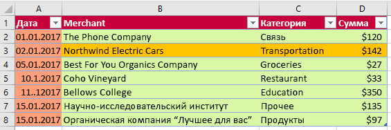

# <a name="work-with-tables-using-the-excel-javascript-api"></a><span data-ttu-id="ec719-102">Работа с таблицами с использованием API JavaScript для Excel</span><span class="sxs-lookup"><span data-stu-id="ec719-102">Work with tables using the Excel JavaScript API</span></span>

<span data-ttu-id="ec719-p101">В этой статье представлены примеры кода, которые показывают, как выполнять общие задачи с таблицами с помощью API JavaScript для Excel. Полный список свойств и методов, поддерживаемых объектами **Table** и **TableCollection**, см. [объект Table (JavaScript API для Excel)](https://docs.microsoft.com/javascript/api/excel/excel.table?view=office-js) и [объект TableCollection (JavaScript API для Excel)](https://docs.microsoft.com/javascript/api/excel/excel.tablecollection?view=office-js).</span><span class="sxs-lookup"><span data-stu-id="ec719-p101">This article provides code samples that show how to perform common tasks with tables using the Excel JavaScript API. For the complete list of properties and methods that the **Table** and **TableCollection** objects support, see [Table Object (JavaScript API for Excel)](https://docs.microsoft.com/javascript/api/excel/excel.table?view=office-js) and [TableCollection Object (JavaScript API for Excel)](https://docs.microsoft.com/javascript/api/excel/excel.tablecollection?view=office-js).</span></span>

## <a name="create-a-table"></a><span data-ttu-id="ec719-105">Создание таблицы</span><span class="sxs-lookup"><span data-stu-id="ec719-105">Create a table</span></span>

<span data-ttu-id="ec719-p102">Следующий пример кода создает таблицу на листе с именем **Sample**. Таблица имеет заголовки и содержит четыре столбца и семь строк данных. Если ведущее приложение Excel, в котором работает данный код, поддерживает **ExcelApi 1.2** [набора требований](https://docs.microsoft.com/office/dev/add-ins/reference/requirement-sets/excel-api-requirement-sets?view=office-js), то ширина столбцов и высота строк будет задана так, чтобы наилучшим образом разместить текущие данные в таблице.</span><span class="sxs-lookup"><span data-stu-id="ec719-p102">The following code sample creates a table in the worksheet named **Sample**. The table has headers and contains four columns and seven rows of data. If the Excel host application where the code is running supports [requirement set](https://docs.microsoft.com/office/dev/add-ins/reference/requirement-sets/excel-api-requirement-sets?view=office-js) **ExcelApi 1.2**, the width of the columns and height of the rows are set to best fit the current data in the table.</span></span>

> [!NOTE]
> <span data-ttu-id="ec719-109">Чтобы указать имя таблицы, необходимо сначала создать таблицу и задать для нее свойство **name**, как показано в примере ниже.</span><span class="sxs-lookup"><span data-stu-id="ec719-109">To specify a name for a table, you must first create the table and then set its **name** property, as shown in the example below.</span></span>

```js
Excel.run(function (context) {
    var sheet = context.workbook.worksheets.getItem("Sample");
    var expensesTable = sheet.tables.add("A1:D1", true /*hasHeaders*/);
    expensesTable.name = "ExpensesTable";

    expensesTable.getHeaderRowRange().values = [["Date", "Merchant", "Category", "Amount"]];

    expensesTable.rows.add(null /*add rows to the end of the table*/, [
        ["1/1/2017", "The Phone Company", "Communications", "$120"],
        ["1/2/2017", "Northwind Electric Cars", "Transportation", "$142"],
        ["1/5/2017", "Best For You Organics Company", "Groceries", "$27"],
        ["1/10/2017", "Coho Vineyard", "Restaurant", "$33"],
        ["1/11/2017", "Bellows College", "Education", "$350"],
        ["1/15/2017", "Trey Research", "Other", "$135"],
        ["1/15/2017", "Best For You Organics Company", "Groceries", "$97"]
    ]);

    if (Office.context.requirements.isSetSupported("ExcelApi", 1.2)) {
        sheet.getUsedRange().format.autofitColumns();
        sheet.getUsedRange().format.autofitRows();
    }

    sheet.activate();

    return context.sync();
}).catch(errorHandlerFunction);
```

<span data-ttu-id="ec719-110">**Новая таблица**</span><span class="sxs-lookup"><span data-stu-id="ec719-110">**New table**</span></span>


## <a name="add-rows-to-a-table"></a><span data-ttu-id="ec719-112">Добавление строк в таблицу</span><span class="sxs-lookup"><span data-stu-id="ec719-112">Add rows to a table</span></span>

<span data-ttu-id="ec719-p103">Следующий пример кода добавляет семь новых строк в таблицу с именем **ExpensesTable** в листе с именем **Sample**. Новые строки добавляются в конец таблицы. Если ведущее приложение Excel, в котором работает код, поддерживает **ExcelApi 1.2** [набора требований](https://docs.microsoft.com/office/dev/add-ins/reference/requirement-sets/excel-api-requirement-sets?view=office-js), ширина столбцов и высота строк подбираются так, чтобы наилучшим образом соответствовать текущим данным в таблице.</span><span class="sxs-lookup"><span data-stu-id="ec719-p103">The following code sample adds seven new rows to the table named **ExpensesTable** within the worksheet named **Sample**. The new rows are added to the end of the table. If the Excel host application where the code is running supports [requirement set](https://docs.microsoft.com/office/dev/add-ins/reference/requirement-sets/excel-api-requirement-sets?view=office-js) **ExcelApi 1.2**, the width of the columns and height of the rows are set to best fit the current data in the table.</span></span>

> [!NOTE]
> <span data-ttu-id="ec719-p104">Свойство **index** объекта [TableRow](https://docs.microsoft.com/javascript/api/excel/excel.tablerow?view=office-js) указывает номер индекса строки в коллекции строк таблицы. Объект **TableRow** не содержит свойство **id**, которое может использоваться как уникальный ключ для идентификации строки.</span><span class="sxs-lookup"><span data-stu-id="ec719-p104">The **index** property of a [TableRow](https://docs.microsoft.com/javascript/api/excel/excel.tablerow?view=office-js) object indicates the index number of the row within the rows collection of the table. A **TableRow** object does not contain an **id** property that can be used as a unique key to identify the row.</span></span>

```js
Excel.run(function (context) {
    var sheet = context.workbook.worksheets.getItem("Sample");       
    var expensesTable = sheet.tables.getItem("ExpensesTable");

    expensesTable.rows.add(null /*add rows to the end of the table*/, [
        ["1/16/2017", "THE PHONE COMPANY", "Communications", "$120"],
        ["1/20/2017", "NORTHWIND ELECTRIC CARS", "Transportation", "$142"],
        ["1/20/2017", "BEST FOR YOU ORGANICS COMPANY", "Groceries", "$27"],
        ["1/21/2017", "COHO VINEYARD", "Restaurant", "$33"],
        ["1/25/2017", "BELLOWS COLLEGE", "Education", "$350"],
        ["1/28/2017", "TREY RESEARCH", "Other", "$135"],
        ["1/31/2017", "BEST FOR YOU ORGANICS COMPANY", "Groceries", "$97"]
    ]);

    if (Office.context.requirements.isSetSupported("ExcelApi", 1.2)) {
        sheet.getUsedRange().format.autofitColumns();
        sheet.getUsedRange().format.autofitRows();
    }

    return context.sync();
}).catch(errorHandlerFunction);
```

<span data-ttu-id="ec719-118">**Таблица с новыми строками**</span><span class="sxs-lookup"><span data-stu-id="ec719-118">**Table with new rows**</span></span>


## <a name="add-a-column-to-a-table"></a><span data-ttu-id="ec719-120">Добавление столбца в таблицу</span><span class="sxs-lookup"><span data-stu-id="ec719-120">Add a column to a table</span></span>

<span data-ttu-id="ec719-p105">В этих примерах показано, как добавить столбец в таблицу. Первый пример заполняет новый столбец статическими значениями; второй пример заполняет новый столбец формулами.</span><span class="sxs-lookup"><span data-stu-id="ec719-p105">These examples show how to add a column to a table. The first example populates the new column with static values; the second example populates the new column with formulas.</span></span>

> [!NOTE]
> <span data-ttu-id="ec719-p106">Свойство **index** объекта [TableColumn](https://docs.microsoft.com/javascript/api/excel/excel.tablecolumn?view=office-js) указывает номер индекса столбца в коллекции колонок таблицы. Свойство **id** объекта **TableColumn** содержит уникальный ключ, который идентифицирует столбец.</span><span class="sxs-lookup"><span data-stu-id="ec719-p106">The **index** property of a [TableColumn](https://docs.microsoft.com/javascript/api/excel/excel.tablecolumn?view=office-js) object indicates the index number of the column within the columns collection of the table. The **id** property of a **TableColumn** object contains a unique key that identifies the column.</span></span>

### <a name="add-a-column-that-contains-static-values"></a><span data-ttu-id="ec719-125">Добавление столбца, содержащего статические значения</span><span class="sxs-lookup"><span data-stu-id="ec719-125">Add a column that contains static values</span></span>

<span data-ttu-id="ec719-p107">Следующий пример кода добавляет новый столбец в таблицу с именем **ExpensesTable** в листе с именем **Sample**. Новый столбец добавляется после всех существующих столбцов в таблице и содержит заголовок («День недели»), а также данные для заполнения ячеек в столбце. Если ведущее приложение Excel, в котором работает код, поддерживает **ExcelApi 1.2** [набора требований](https://docs.microsoft.com/office/dev/add-ins/reference/requirement-sets/excel-api-requirement-sets?view=office-js), ширина столбцов и высота строк подбираются для наилучшего соответствия текущим данным в таблице. </span><span class="sxs-lookup"><span data-stu-id="ec719-p107">The following code sample adds a new column to the table named **ExpensesTable** within the worksheet named **Sample**. The new column is added after all existing columns in the table and contains a header ("Day of the Week") as well as data to populate the cells in the column. If the Excel host application where the code is running supports [requirement set](https://docs.microsoft.com/office/dev/add-ins/reference/requirement-sets/excel-api-requirement-sets?view=office-js) **ExcelApi 1.2**, the width of the columns and height of the rows are set to best fit the current data in the table.</span></span>

```js
Excel.run(function (context) {
    var sheet = context.workbook.worksheets.getItem("Sample");       
    var expensesTable = sheet.tables.getItem("ExpensesTable");

    expensesTable.columns.add(null /*add columns to the end of the table*/, [
        ["Day of the Week"],
        ["Saturday"],
        ["Friday"],
        ["Monday"],
        ["Thursday"],
        ["Sunday"],
        ["Saturday"],
        ["Monday"]
    ]);

    if (Office.context.requirements.isSetSupported("ExcelApi", 1.2)) {
        sheet.getUsedRange().format.autofitColumns();
        sheet.getUsedRange().format.autofitRows();
    }

    return context.sync();
}).catch(errorHandlerFunction);
```

<span data-ttu-id="ec719-129">**Таблица с новым столбцом**</span><span class="sxs-lookup"><span data-stu-id="ec719-129">**Table with new column**</span></span>


### <a name="add-a-column-that-contains-formulas"></a><span data-ttu-id="ec719-131">Добавление столбца, содержащего формулы</span><span class="sxs-lookup"><span data-stu-id="ec719-131">Add a column that contains formulas</span></span>

<span data-ttu-id="ec719-p108">Следующий пример кода добавляет новый столбец в таблицу с именем **ExpensesTable** в листе с именем **Sample**. Новый столбец добавляется в конец таблицы, содержит заголовок («Тип дня») и использует формулу для заполнения каждой ячейки данных в столбце. Если ведущее приложение Excel, в котором работает код, поддерживает **ExcelApi 1.2** [набора требований](https://docs.microsoft.com/office/dev/add-ins/reference/requirement-sets/excel-api-requirement-sets?view=office-js), ширина столбцов и высота строк подбираются для наилучшего соответствия текущим данным в таблице. </span><span class="sxs-lookup"><span data-stu-id="ec719-p108">The following code sample adds a new column to the table named **ExpensesTable** within the worksheet named **Sample**. The new column is added to the end of the table, contains a header ("Type of the Day"), and uses a formula to populate each data cell in the column. If the Excel host application where the code is running supports [requirement set](https://docs.microsoft.com/office/dev/add-ins/reference/requirement-sets/excel-api-requirement-sets?view=office-js) **ExcelApi 1.2**, the width of the columns and height of the rows are set to best fit the current data in the table.</span></span>

```js
Excel.run(function (context) {
    var sheet = context.workbook.worksheets.getItem("Sample");
    var expensesTable = sheet.tables.getItem("ExpensesTable");

    expensesTable.columns.add(null /*add columns to the end of the table*/, [
        ["Type of the Day"],
        ['=IF(OR((TEXT([DATE], "dddd") = "Saturday"), (TEXT([DATE], "dddd") = "Sunday")), "Weekend", "Weekday")'],
        ['=IF(OR((TEXT([DATE], "dddd") = "Saturday"), (TEXT([DATE], "dddd") = "Sunday")), "Weekend", "Weekday")'],
        ['=IF(OR((TEXT([DATE], "dddd") = "Saturday"), (TEXT([DATE], "dddd") = "Sunday")), "Weekend", "Weekday")'],
        ['=IF(OR((TEXT([DATE], "dddd") = "Saturday"), (TEXT([DATE], "dddd") = "Sunday")), "Weekend", "Weekday")'],
        ['=IF(OR((TEXT([DATE], "dddd") = "Saturday"), (TEXT([DATE], "dddd") = "Sunday")), "Weekend", "Weekday")'],
        ['=IF(OR((TEXT([DATE], "dddd") = "Saturday"), (TEXT([DATE], "dddd") = "Sunday")), "Weekend", "Weekday")'],
        ['=IF(OR((TEXT([DATE], "dddd") = "Saturday"), (TEXT([DATE], "dddd") = "Sunday")), "Weekend", "Weekday")']
    ]);

    if (Office.context.requirements.isSetSupported("ExcelApi", 1.2)) {
        sheet.getUsedRange().format.autofitColumns();
        sheet.getUsedRange().format.autofitRows();
    }

    return context.sync();
}).catch(errorHandlerFunction);
```

<span data-ttu-id="ec719-135">**Таблица с новым столбцом, содержащим вычисленные значения**</span><span class="sxs-lookup"><span data-stu-id="ec719-135">**Table with new calculated column**</span></span>


## <a name="update-column-name"></a><span data-ttu-id="ec719-137">Изменение имени столбца</span><span class="sxs-lookup"><span data-stu-id="ec719-137">Update column name</span></span>

<span data-ttu-id="ec719-p109">В следующем примере кода показано, как изменить имя первого столбца в таблице на **Purchase date** (Дата покупки). Если ведущее приложение Excel, в котором выполняется этот код, поддерживает [набор требований](https://docs.microsoft.com/office/dev/add-ins/reference/requirement-sets/excel-api-requirement-sets?view=office-js) **ExcelApi 1.2**, то ширина столбцов и высота строк будет задана так, чтобы наилучшим образом разместить текущие данные в таблице.</span><span class="sxs-lookup"><span data-stu-id="ec719-p109">The following code sample updates the name of the first column in the table to **Purchase date**. If the Excel host application where the code is running supports [requirement set](https://docs.microsoft.com/office/dev/add-ins/reference/requirement-sets/excel-api-requirement-sets?view=office-js) **ExcelApi 1.2**, the width of the columns and height of the rows are set to best fit the current data in the table.</span></span>

```js
Excel.run(function (context) {
    var sheet = context.workbook.worksheets.getItem("Sample");

    var expensesTable = sheet.tables.getItem("ExpensesTable");
    expensesTable.columns.load("items");

    return context.sync()
        .then(function () {
            expensesTable.columns.items[0].name = "Purchase date";

            if (Office.context.requirements.isSetSupported("ExcelApi", 1.2)) {
                sheet.getUsedRange().format.autofitColumns();
                sheet.getUsedRange().format.autofitRows();
            }

            return context.sync();
        });
}).catch(errorHandlerFunction);
```

<span data-ttu-id="ec719-140">**Таблица со столбцом с новым именем**</span><span class="sxs-lookup"><span data-stu-id="ec719-140">**Table with new column name**</span></span>


## <a name="get-data-from-a-table"></a><span data-ttu-id="ec719-142">Получение данных из таблицы</span><span class="sxs-lookup"><span data-stu-id="ec719-142">Get data from a table</span></span>

<span data-ttu-id="ec719-143">В примере кода ниже показано, как считать данные из таблицы **ExpensesTable** (Таблица расходов), размещенной на листе **Sample** (Пример), а затем отобразить эти данные под таблицей на том же листе.</span><span class="sxs-lookup"><span data-stu-id="ec719-143">The following code sample reads data from a table named **ExpensesTable** in the worksheet named **Sample** and then outputs that data below the table in the same worksheet.</span></span>

```js
Excel.run(function (context) {
    var sheet = context.workbook.worksheets.getItem("Sample");
    var expensesTable = sheet.tables.getItem("ExpensesTable");

    // Get data from the header row
    var headerRange = expensesTable.getHeaderRowRange().load("values");

    // Get data from the table
    var bodyRange = expensesTable.getDataBodyRange().load("values");

    // Get data from a single column
    var columnRange = expensesTable.columns.getItem("Merchant").getDataBodyRange().load("values");

    // Get data from a single row
    var rowRange = expensesTable.rows.getItemAt(1).load("values");

    // Sync to populate proxy objects with data from Excel
    return context.sync()
        .then(function () {
            var headerValues = headerRange.values;
            var bodyValues = bodyRange.values;
            var merchantColumnValues = columnRange.values;
            var secondRowValues = rowRange.values;

            // Write data from table back to the sheet
            sheet.getRange("A11:A11").values = [["Results"]];
            sheet.getRange("A13:D13").values = headerValues;
            sheet.getRange("A14:D20").values = bodyValues;
            sheet.getRange("B23:B29").values = merchantColumnValues;
            sheet.getRange("A32:D32").values = secondRowValues;

            // Sync to update the sheet in Excel
            return context.sync();
        });
}).catch(errorHandlerFunction);
```

<span data-ttu-id="ec719-144">**Таблица и выведенные данные**</span><span class="sxs-lookup"><span data-stu-id="ec719-144">**Table and data output**</span></span>


## <a name="sort-data-in-a-table"></a><span data-ttu-id="ec719-146">Сортировка данных в таблице</span><span class="sxs-lookup"><span data-stu-id="ec719-146">Sort data in a table</span></span>

<span data-ttu-id="ec719-147">В следующем примере кода показано, как отсортировать данные по убыванию в четвертом столбце таблицы.</span><span class="sxs-lookup"><span data-stu-id="ec719-147">The following code sample sorts table data in descending order according to the values in the fourth column of the table.</span></span>

```js
Excel.run(function (context) {
    var sheet = context.workbook.worksheets.getItem("Sample");
    var expensesTable = sheet.tables.getItem("ExpensesTable");

    // Queue a command to sort data by the fourth column of the table (descending)
    var sortRange = expensesTable.getDataBodyRange();
    sortRange.sort.apply([
        {
            key: 3,
            ascending: false,
        },
    ]);

    // Sync to run the queued command in Excel
    return context.sync();
}).catch(errorHandlerFunction);
```

<span data-ttu-id="ec719-148">**Данные таблицы, отсортированные по столбцу Amount (Сумма) в порядке убывания**</span><span class="sxs-lookup"><span data-stu-id="ec719-148">**Table data sorted by Amount (descending)**</span></span>


## <a name="apply-filters-to-a-table"></a><span data-ttu-id="ec719-150">Применение фильтров к таблице</span><span class="sxs-lookup"><span data-stu-id="ec719-150">Apply filters to a table</span></span>

<span data-ttu-id="ec719-p110">Следующий пример кода применяет фильтры к столбцу **Amount** и столбцу **Category** в таблице. В результате действия фильтров отображаются только строки, где **Category** — одно из заданных значений, а **Amount** ниже среднего значения для всех строк.</span><span class="sxs-lookup"><span data-stu-id="ec719-p110">The following code sample applies filters to the **Amount** column and the **Category** column within a table. As a result of the filters, only rows where **Category** is one of the specified values and **Amount** is below the average value for all rows is shown.</span></span>

```js
Excel.run(function (context) {
    var sheet = context.workbook.worksheets.getItem("Sample");
    var expensesTable = sheet.tables.getItem("ExpensesTable");

    // Queue a command to apply a filter on the Category column
    filter = expensesTable.columns.getItem("Category").filter;
    filter.apply({
        filterOn: Excel.FilterOn.values,
        values: ["Restaurant", "Groceries"]
    });

    // Queue a command to apply a filter on the Amount column
    var filter = expensesTable.columns.getItem("Amount").filter;
    filter.apply({
        filterOn: Excel.FilterOn.dynamic,
        dynamicCriteria: Excel.DynamicFilterCriteria.belowAverage
    });

    // Sync to run the queued commands in Excel
    return context.sync();
}).catch(errorHandlerFunction);
```

<span data-ttu-id="ec719-153">**Таблица данных, в которой применены фильтры для столбцов Category (Категория) и Amount (Сумма)**</span><span class="sxs-lookup"><span data-stu-id="ec719-153">**Table data with filters applied for Category and Amount**</span></span>


## <a name="clear-table-filters"></a><span data-ttu-id="ec719-155">Удаление фильтров в таблице</span><span class="sxs-lookup"><span data-stu-id="ec719-155">Clear table filters</span></span>

<span data-ttu-id="ec719-156">В следующем примере кода показано, как удалить все фильтры, примененные к таблице.</span><span class="sxs-lookup"><span data-stu-id="ec719-156">The following code sample clears any filters currently applied on the table.</span></span>

```js
Excel.run(function (context) {
    var sheet = context.workbook.worksheets.getItem("Sample");
    var expensesTable = sheet.tables.getItem("ExpensesTable");

    expensesTable.clearFilters();

    return context.sync();
}).catch(errorHandlerFunction);
```

<span data-ttu-id="ec719-157">**Данные таблицы без фильтров**</span><span class="sxs-lookup"><span data-stu-id="ec719-157">**Table data with no filters applied**</span></span>


## <a name="get-the-visible-range-from-a-filtered-table"></a><span data-ttu-id="ec719-159">Получение отображаемого диапазона из отфильтрованной таблицы</span><span class="sxs-lookup"><span data-stu-id="ec719-159">Get the visible range from a filtered table</span></span>

<span data-ttu-id="ec719-p111">Следующий образец кода получает диапазон, содержащий данные только для ячеек, которые в настоящее время видны в указанной таблице, а затем записывает значения этого диапазона в консоль. Вы можете использовать метод **getVisibleView ()**, как показано ниже, чтобы получать отображаемое содержимое таблицы всякий раз, когда применяются фильтры столбцов.</span><span class="sxs-lookup"><span data-stu-id="ec719-p111">The following code sample gets a range that contains data only for cells that are currently visible within the specified table, and then writes the values of that range to the console. You can use the **getVisibleView()** method as shown below to get the visible contents of a table whenever column filters have been applied.</span></span>

```js
Excel.run(function (context) {
    var sheet = context.workbook.worksheets.getItem("Sample");
    var expensesTable = sheet.tables.getItem("ExpensesTable");

    var visibleRange = expensesTable.getDataBodyRange().getVisibleView();
    visibleRange.load("values");

    return context.sync()
        .then(function() {
            console.log(visibleRange.values);
        });
}).catch(errorHandlerFunction);
```

## <a name="format-a-table"></a><span data-ttu-id="ec719-162">Форматирование таблицы</span><span class="sxs-lookup"><span data-stu-id="ec719-162">Format a table</span></span>

<span data-ttu-id="ec719-p112">Следующий пример кода применяет форматирование к таблице. Он определяет различные цвета заливки для строки заголовка таблицы, тела таблицы, второй строки таблицы и первого столбца таблицы. Для получения информации о свойствах, которые вы можете использовать для задания формата, см. [Объект RangeFormat (API JavaScript для Excel)](https://docs.microsoft.com/javascript/api/excel/excel.rangeformat?view=office-js).</span><span class="sxs-lookup"><span data-stu-id="ec719-p112">The following code sample applies formatting to a table. It specifies different fill colors for the header row of the table, the body of the table, the second row of the table, and the first column of the table. For information about the properties you can use to specify format, see [RangeFormat Object (JavaScript API for Excel)](https://docs.microsoft.com/javascript/api/excel/excel.rangeformat?view=office-js).</span></span>

```js
Excel.run(function (context) {
    var sheet = context.workbook.worksheets.getItem("Sample");
    var expensesTable = sheet.tables.getItem("ExpensesTable");

    expensesTable.getHeaderRowRange().format.fill.color = "#C70039";
    expensesTable.getDataBodyRange().format.fill.color = "#DAF7A6";
    expensesTable.rows.getItemAt(1).getRange().format.fill.color = "#FFC300";
    expensesTable.columns.getItemAt(0).getDataBodyRange().format.fill.color = "#FFA07A";

    return context.sync();
}).catch(errorHandlerFunction);
```

<span data-ttu-id="ec719-166">**Таблица после применения форматирования**</span><span class="sxs-lookup"><span data-stu-id="ec719-166">**Table after formatting is applied**</span></span>



## <a name="convert-a-range-to-a-table"></a><span data-ttu-id="ec719-168">Преобразование диапазона в таблицу</span><span class="sxs-lookup"><span data-stu-id="ec719-168">Convert a range to a table</span></span>

<span data-ttu-id="ec719-169">В примере кода ниже показано, как создать диапазон данных и преобразовывать его в таблицу.</span><span class="sxs-lookup"><span data-stu-id="ec719-169">The following code sample creates a range of data and then converts that range to a table.</span></span>

```js
Excel.run(function (context) {
    var sheet = context.workbook.worksheets.getItem("Sample");

    // Define values for the range
    var values = [["Product", "Qtr1", "Qtr2", "Qtr3", "Qtr4"],
    ["Frames", 5000, 7000, 6544, 4377],
    ["Saddles", 400, 323, 276, 651],
    ["Brake levers", 12000, 8766, 8456, 9812],
    ["Chains", 1550, 1088, 692, 853],
    ["Mirrors", 225, 600, 923, 544],
    ["Spokes", 6005, 7634, 4589, 8765]];

    // Create the range
    var range = sheet.getRange("A1:E7");
    range.values = values;

    if (Office.context.requirements.isSetSupported("ExcelApi", 1.2)) {
        sheet.getUsedRange().format.autofitColumns();
        sheet.getUsedRange().format.autofitRows();
    }

    sheet.activate();

    // Convert the range to a table
    var expensesTable = sheet.tables.add('A1:E7', true);
    expensesTable.name = "ExpensesTable";

    return context.sync();
}).catch(errorHandlerFunction);
```

<span data-ttu-id="ec719-170">**Данные в диапазоне (перед его преобразованием в таблицу)**</span><span class="sxs-lookup"><span data-stu-id="ec719-170">**Data in the range (before the range is converted to a table)**</span></span>


<span data-ttu-id="ec719-172">**Данные в таблице (после преобразования диапазона в таблицу)**</span><span class="sxs-lookup"><span data-stu-id="ec719-172">**Data in the table (after the range is converted to a table)**</span></span>


## <a name="import-json-data-into-a-table"></a><span data-ttu-id="ec719-174">Импорт данных JSON в таблицу</span><span class="sxs-lookup"><span data-stu-id="ec719-174">Import JSON data into a table</span></span>

<span data-ttu-id="ec719-p113">Следующий образец кода создает таблицу в листе с именем **Sample**, а затем заполняет таблицу с помощью объекта JSON, который задает две строки данных. Если ведущее приложение Excel, в котором работает данный код, поддерживает **ExcelApi 1.2** [набора требований](https://docs.microsoft.com/office/dev/add-ins/reference/requirement-sets/excel-api-requirement-sets?view=office-js), ширина столбцов и высота строк подбираются для наилучшего соответствия текущим данным в таблице. </span><span class="sxs-lookup"><span data-stu-id="ec719-p113">The following code sample creates a table in the worksheet named **Sample** and then populates the table by using a JSON object that defines two rows of data. If the Excel host application where the code is running supports [requirement set](https://docs.microsoft.com/office/dev/add-ins/reference/requirement-sets/excel-api-requirement-sets?view=office-js) **ExcelApi 1.2**, the width of the columns and height of the rows are set to best fit the current data in the table.</span></span>

```js
Excel.run(function (context) {
    var sheet = context.workbook.worksheets.getItem("Sample");

    var expensesTable = sheet.tables.add("A1:D1", true /*hasHeaders*/);
    expensesTable.name = "ExpensesTable";
    expensesTable.getHeaderRowRange().values = [["Date", "Merchant", "Category", "Amount"]];

    var transactions = [
      {
        "DATE": "1/1/2017",
        "MERCHANT": "The Phone Company",
        "CATEGORY": "Communications",
        "AMOUNT": "$120"
      },
      {
        "DATE": "1/1/2017",
        "MERCHANT": "Southridge Video",
        "CATEGORY": "Entertainment",
        "AMOUNT": "$40"
      }
    ];

    var newData = transactions.map(item =>
        [item.DATE, item.MERCHANT, item.CATEGORY, item.AMOUNT]);

    expensesTable.rows.add(null, newData);

    if (Office.context.requirements.isSetSupported("ExcelApi", 1.2)) {
        sheet.getUsedRange().format.autofitColumns();
        sheet.getUsedRange().format.autofitRows();
    }

    sheet.activate();

    return context.sync();
}).catch(errorHandlerFunction);
```

<span data-ttu-id="ec719-177">**Новая таблица**</span><span class="sxs-lookup"><span data-stu-id="ec719-177">**New table**</span></span>


## <a name="see-also"></a><span data-ttu-id="ec719-179">См. также</span><span class="sxs-lookup"><span data-stu-id="ec719-179">See also</span></span>

- [<span data-ttu-id="ec719-180">Основные принципы программирования с помощью API JavaScript для Excel</span><span class="sxs-lookup"><span data-stu-id="ec719-180">Fundamental programming concepts with the Excel JavaScript API</span></span>](excel-add-ins-core-concepts.md)

