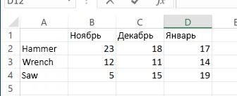

# <a name="call-built-in-excel-worksheet-functions"></a><span data-ttu-id="0ddad-103">Вызов встроенных функций листов Excel</span><span class="sxs-lookup"><span data-stu-id="0ddad-103">Call built-in Excel worksheet functions</span></span>

<span data-ttu-id="0ddad-p101">В этой статье рассказывается, как вызывать встроенные функции листов Excel, такие как `VLOOKUP` и `SUM`, с помощью API JavaScript для Excel. В ней также представлен полный список встроенных функций листов Excel, которые можно вызывать с помощью API JavaScript для Excel.</span><span class="sxs-lookup"><span data-stu-id="0ddad-p101">This article explains how to call built-in Excel worksheet functions such as `VLOOKUP` and `SUM` using the Excel JavaScript API. It also provides the full list of built-in Excel worksheet functions that can be called using the Excel JavaScript API.</span></span>

> [!NOTE]
> <span data-ttu-id="0ddad-106">Сведения о том, как создавать *пользовательские функции* в Excel с помощью API JavaScript для Excel, см. в статье [Создание пользовательских функций в Excel](custom-functions-overview.md).</span><span class="sxs-lookup"><span data-stu-id="0ddad-106">For information about how to create *custom functions* in Excel using the Excel JavaScript API, see [Create custom functions in Excel](custom-functions-overview.md).</span></span>

## <a name="calling-a-worksheet-function"></a><span data-ttu-id="0ddad-107">Вызов функции листа</span><span class="sxs-lookup"><span data-stu-id="0ddad-107">Calling a worksheet function</span></span>

<span data-ttu-id="0ddad-108">В приведенном ниже фрагменте кода показано, как вызвать функцию листа, где `sampleFunction()`— это заполнитель, который следует заменить на имя вызываемой функции и необходимые ей входные параметры.</span><span class="sxs-lookup"><span data-stu-id="0ddad-108">The following code snippet shows how to call a worksheet function, where `sampleFunction()` is a placeholder that should be replaced with the name of the function to call and the input parameters that the function requires.</span></span> <span data-ttu-id="0ddad-109">Свойство объекта, возвращаемого функцией таблицы, содержит `value` `FunctionResult` результат указанной функции.</span><span class="sxs-lookup"><span data-stu-id="0ddad-109">The `value` property of the `FunctionResult` object that's returned by a worksheet function contains the result of the specified function.</span></span> <span data-ttu-id="0ddad-110">Как показано в этом примере, перед чтением необходимо свойство `load` `value` `FunctionResult` объекта.</span><span class="sxs-lookup"><span data-stu-id="0ddad-110">As this example shows, you must `load` the `value` property of the `FunctionResult` object before you can read it.</span></span> <span data-ttu-id="0ddad-111">В этом примере результат выполнения функции просто записывается в консоль.</span><span class="sxs-lookup"><span data-stu-id="0ddad-111">In this example, the result of the function is simply being written to the console.</span></span>

```js
var functionResult = context.workbook.functions.sampleFunction();
functionResult.load('value');
return context.sync()
    .then(function () {
        console.log('Result of the function: ' + functionResult.value);
    });
```

> [!TIP]
> <span data-ttu-id="0ddad-112">В разделе [Поддерживаемые функции листов](#supported-worksheet-functions) в этой статье представлен список функций, которые можно вызывать с помощью API JavaScript для Excel.</span><span class="sxs-lookup"><span data-stu-id="0ddad-112">See the [Supported worksheet functions](#supported-worksheet-functions) section of this article for a list of functions that can be called using the Excel JavaScript API.</span></span>

## <a name="sample-data"></a><span data-ttu-id="0ddad-113">Образец данных</span><span class="sxs-lookup"><span data-stu-id="0ddad-113">Sample data</span></span>

<span data-ttu-id="0ddad-p103">На приведенном ниже изображении показана таблица на листе Excel, содержащая данные о продажах различных инструментов в течение трех месяцев. Каждое число в таблице представляет количество единиц того или иного инструмента, проданных за определенный месяц. В последующих примерах показано, как применить к этим данным встроенные функции листов.</span><span class="sxs-lookup"><span data-stu-id="0ddad-p103">The following image shows a table in an Excel worksheet that contains sales data for various types of tools over a three month period. Each number in the table represents the number of units sold for a specific tool in a specific month. The examples that follow will show how to apply built-in worksheet functions to this data.</span></span>



## <a name="example-1-single-function"></a><span data-ttu-id="0ddad-118">Пример 1. Одна функция</span><span class="sxs-lookup"><span data-stu-id="0ddad-118">Example 1: Single function</span></span>

<span data-ttu-id="0ddad-119">В приведенном ниже примере кода к вышеописанному примеру данных применяется функция `VLOOKUP`, чтобы определить количество гаечных ключей, проданных в ноябре.</span><span class="sxs-lookup"><span data-stu-id="0ddad-119">The following code sample applies the `VLOOKUP` function to the sample data described previously to identify the number of wrenches sold in November.</span></span>

```js
Excel.run(function (context) {
    var range = context.workbook.worksheets.getItem("Sheet1").getRange("A1:D4");
    var unitSoldInNov = context.workbook.functions.vlookup("Wrench", range, 2, false);
    unitSoldInNov.load('value');

    return context.sync()
        .then(function () {
            console.log(' Number of wrenches sold in November = ' + unitSoldInNov.value);
        });
}).catch(errorHandlerFunction);
```

## <a name="example-2-nested-functions"></a><span data-ttu-id="0ddad-120">Пример 2. Вложенные функции</span><span class="sxs-lookup"><span data-stu-id="0ddad-120">Example 2: Nested functions</span></span>

<span data-ttu-id="0ddad-121">В приведенном ниже примере кода к вышеописанному примеру данных применяется функция `VLOOKUP`, чтобы определить количество гаечных ключей, проданных в ноябре и декабре, а затем применяется функция `SUM`, чтобы вычислить общее число гаечных ключей, проданных за эти два месяца.</span><span class="sxs-lookup"><span data-stu-id="0ddad-121">The following code sample applies the `VLOOKUP` function to the sample data described previously to identify the number of wrenches sold in November and the number of wrenches sold in December, and then applies the `SUM` function to calculate the total number of wrenches sold during those two months.</span></span>

<span data-ttu-id="0ddad-p104">Как показано в этом примере, если один или несколько вызовов функций вложены в вызов другой функции, то выполнять операцию `load` нужно только с окончательным результатом, который впоследствии потребуется прочитать (в этом примере — `sumOfTwoLookups`). Все промежуточные результаты (в этом примере — результат выполнения каждой функции `VLOOKUP`) будут вычислены и использованы для вычисления окончательного результата.</span><span class="sxs-lookup"><span data-stu-id="0ddad-p104">As this example shows, when one or more function calls are nested within another function call, you only need to `load` the final result that you subsequently want to read (in this example, `sumOfTwoLookups`). Any intermediate results (in this example, the result of each `VLOOKUP` function) will be calculated and used to calculate the final result.</span></span>

```js
Excel.run(function (context) {
    var range = context.workbook.worksheets.getItem("Sheet1").getRange("A1:D4");
    var sumOfTwoLookups = context.workbook.functions.sum(
        context.workbook.functions.vlookup("Wrench", range, 2, false),
        context.workbook.functions.vlookup("Wrench", range, 3, false)
    );
    sumOfTwoLookups.load('value');

    return context.sync()
        .then(function () {
            console.log(' Number of wrenches sold in November and December = ' + sumOfTwoLookups.value);
        });
}).catch(errorHandlerFunction);
```

## <a name="supported-worksheet-functions"></a><span data-ttu-id="0ddad-124">Поддерживаемые функции листов</span><span class="sxs-lookup"><span data-stu-id="0ddad-124">Supported worksheet functions</span></span>

<span data-ttu-id="0ddad-125">Ниже перечислены встроенные функции листов Excel, которые можно вызывать с помощью API JavaScript для Excel</span><span class="sxs-lookup"><span data-stu-id="0ddad-125">The following built-in Excel worksheet functions can be called using the Excel JavaScript API.</span></span>

| <span data-ttu-id="0ddad-126">Функция</span><span class="sxs-lookup"><span data-stu-id="0ddad-126">Function</span></span> | <span data-ttu-id="0ddad-127">Описание</span><span class="sxs-lookup"><span data-stu-id="0ddad-127">Description</span></span> |
|:---------------|:-----------|
| <span data-ttu-id="0ddad-128"><a href="https://support.office.com/article/ABS-function-3420200f-5628-4e8c-99da-c99d7c87713c" target="_blank">Функция ABS</a></span><span class="sxs-lookup"><span data-stu-id="0ddad-128"><a href="https://support.office.com/article/ABS-function-3420200f-5628-4e8c-99da-c99d7c87713c" target="_blank">ABS function</a></span></span> | <span data-ttu-id="0ddad-129">Возвращает абсолютное значение числа</span><span class="sxs-lookup"><span data-stu-id="0ddad-129">Returns the absolute value of a number</span></span> |
| <span data-ttu-id="0ddad-130"><a href="https://support.microsoft.com/office/fe45d089-6722-4fb3-9379-e1f911d8dc74" target="_blank">Функция НАКОПДОХОД</a></span><span class="sxs-lookup"><span data-stu-id="0ddad-130"><a href="https://support.microsoft.com/office/fe45d089-6722-4fb3-9379-e1f911d8dc74" target="_blank">ACCRINT function</a></span></span> | <span data-ttu-id="0ddad-131">Возвращает накопленный процент по ценной бумаге с периодической выплатой процентов</span><span class="sxs-lookup"><span data-stu-id="0ddad-131">Returns the accrued interest for a security that pays periodic interest</span></span> |
| <span data-ttu-id="0ddad-132"><a href="https://support.office.com/article/ACCRINTM-function-f62f01f9-5754-4cc4-805b-0e70199328a7" target="_blank">Функция НАКОПДОХОДПОГАШ</a></span><span class="sxs-lookup"><span data-stu-id="0ddad-132"><a href="https://support.office.com/article/ACCRINTM-function-f62f01f9-5754-4cc4-805b-0e70199328a7" target="_blank">ACCRINTM function</a></span></span> | <span data-ttu-id="0ddad-133">Возвращает накопленный процент по ценной бумаге, процент по которой выплачивается в срок погашения</span><span class="sxs-lookup"><span data-stu-id="0ddad-133">Returns the accrued interest for a security that pays interest at maturity</span></span> |
| <span data-ttu-id="0ddad-134"><a href="https://support.microsoft.com/office/cb73173f-d089-4582-afa1-76e5524b5d5b" target="_blank">Функция ACOS</a></span><span class="sxs-lookup"><span data-stu-id="0ddad-134"><a href="https://support.microsoft.com/office/cb73173f-d089-4582-afa1-76e5524b5d5b" target="_blank">ACOS function</a></span></span> | <span data-ttu-id="0ddad-135">Возвращает арккосинус числа</span><span class="sxs-lookup"><span data-stu-id="0ddad-135">Returns the arccosine of a number</span></span> |
| <span data-ttu-id="0ddad-136"><a href="https://support.office.com/article/ACOSH-function-e3992cc1-103f-4e72-9f04-624b9ef5ebfe" target="_blank">Функция ACOSH</a></span><span class="sxs-lookup"><span data-stu-id="0ddad-136"><a href="https://support.office.com/article/ACOSH-function-e3992cc1-103f-4e72-9f04-624b9ef5ebfe" target="_blank">ACOSH function</a></span></span> | <span data-ttu-id="0ddad-137">Возвращает обратный гиперболический косинус числа (ареакосинус)</span><span class="sxs-lookup"><span data-stu-id="0ddad-137">Returns the inverse hyperbolic cosine of a number</span></span> |
| <span data-ttu-id="0ddad-138"><a href="https://support.office.com/article/ACOT-function-dc7e5008-fe6b-402e-bdd6-2eea8383d905" target="_blank">Функция ACOT</a></span><span class="sxs-lookup"><span data-stu-id="0ddad-138"><a href="https://support.office.com/article/ACOT-function-dc7e5008-fe6b-402e-bdd6-2eea8383d905" target="_blank">ACOT function</a></span></span> | <span data-ttu-id="0ddad-139">Возвращает арккотангенс числа</span><span class="sxs-lookup"><span data-stu-id="0ddad-139">Returns the arccotangent of a number</span></span> |
| <span data-ttu-id="0ddad-140"><a href="https://support.office.com/article/ACOTH-function-cc49480f-f684-4171-9fc5-73e4e852300f" target="_blank">Функция ACOTH</a></span><span class="sxs-lookup"><span data-stu-id="0ddad-140"><a href="https://support.office.com/article/ACOTH-function-cc49480f-f684-4171-9fc5-73e4e852300f" target="_blank">ACOTH function</a></span></span> | <span data-ttu-id="0ddad-141">Возвращает гиперболический арккотангенс числа</span><span class="sxs-lookup"><span data-stu-id="0ddad-141">Returns the hyperbolic arccotangent of a number</span></span> |
| <span data-ttu-id="0ddad-142"><a href="https://support.office.com/article/AMORDEGRC-function-a14d0ca1-64a4-42eb-9b3d-b0dededf9e51" target="_blank">Функция АМОРУМ</a></span><span class="sxs-lookup"><span data-stu-id="0ddad-142"><a href="https://support.office.com/article/AMORDEGRC-function-a14d0ca1-64a4-42eb-9b3d-b0dededf9e51" target="_blank">AMORDEGRC function</a></span></span> | <span data-ttu-id="0ddad-143">Возвращает величину амортизации для каждого учетного периода, используя коэффициент амортизации</span><span class="sxs-lookup"><span data-stu-id="0ddad-143">Returns the depreciation for each accounting period by using a depreciation coefficient</span></span> |
| <span data-ttu-id="0ddad-144"><a href="https://support.office.com/article/AMORLINC-function-7d417b45-f7f5-4dba-a0a5-3451a81079a8" target="_blank">Функция АМОРУВ</a></span><span class="sxs-lookup"><span data-stu-id="0ddad-144"><a href="https://support.office.com/article/AMORLINC-function-7d417b45-f7f5-4dba-a0a5-3451a81079a8" target="_blank">AMORLINC function</a></span></span> | <span data-ttu-id="0ddad-145">Возвращает величину амортизации для каждого учетного периода</span><span class="sxs-lookup"><span data-stu-id="0ddad-145">Returns the depreciation for each accounting period</span></span> |
| <span data-ttu-id="0ddad-146"><a href="https://support.office.com/article/AND-function-5f19b2e8-e1df-4408-897a-ce285a19e9d9" target="_blank">Функция И</a></span><span class="sxs-lookup"><span data-stu-id="0ddad-146"><a href="https://support.office.com/article/AND-function-5f19b2e8-e1df-4408-897a-ce285a19e9d9" target="_blank">AND function</a></span></span> | <span data-ttu-id="0ddad-147">Возвращает значение `TRUE`, если все аргументы имеют значение ИСТИНА</span><span class="sxs-lookup"><span data-stu-id="0ddad-147">Returns `TRUE` if all of its arguments are true</span></span> |
| <span data-ttu-id="0ddad-148"><a href="https://support.microsoft.com/office/9a8da418-c17b-4ef9-a657-9370a30a674f" target="_blank">Функция АРАБСКОЕ</a></span><span class="sxs-lookup"><span data-stu-id="0ddad-148"><a href="https://support.microsoft.com/office/9a8da418-c17b-4ef9-a657-9370a30a674f" target="_blank">ARABIC function</a></span></span> | <span data-ttu-id="0ddad-149">Преобразует римское число в арабское</span><span class="sxs-lookup"><span data-stu-id="0ddad-149">Converts a Roman number to Arabic, as a number</span></span> |
| <span data-ttu-id="0ddad-150"><a href="https://support.microsoft.com/office/8392ba32-7a41-43b3-96b0-3695d2ec6152" target="_blank">Функция ОБЛАСТИ</a></span><span class="sxs-lookup"><span data-stu-id="0ddad-150"><a href="https://support.microsoft.com/office/8392ba32-7a41-43b3-96b0-3695d2ec6152" target="_blank">AREAS function</a></span></span> | <span data-ttu-id="0ddad-151">Возвращает количество областей в ссылке</span><span class="sxs-lookup"><span data-stu-id="0ddad-151">Returns the number of areas in a reference</span></span> |
| <span data-ttu-id="0ddad-152"><a href="https://support.microsoft.com/office/0b6abf1c-c663-4004-a964-ebc00b723266" target="_blank">Функция ASC</a></span><span class="sxs-lookup"><span data-stu-id="0ddad-152"><a href="https://support.microsoft.com/office/0b6abf1c-c663-4004-a964-ebc00b723266" target="_blank">ASC function</a></span></span> | <span data-ttu-id="0ddad-153">Преобразует полноширинные (двухбайтовые) английские буквы или знаки катакана в строке символов в полуширинные (однобайтовые) символы</span><span class="sxs-lookup"><span data-stu-id="0ddad-153">Changes full-width (double-byte) English letters or katakana within a character string to half-width (single-byte) characters</span></span> |
| <span data-ttu-id="0ddad-154"><a href="https://support.microsoft.com/office/81fb95e5-6d6f-48c4-bc45-58f955c6d347" target="_blank">Функция ASIN</a></span><span class="sxs-lookup"><span data-stu-id="0ddad-154"><a href="https://support.microsoft.com/office/81fb95e5-6d6f-48c4-bc45-58f955c6d347" target="_blank">ASIN function</a></span></span> | <span data-ttu-id="0ddad-155">Возвращает арксинус числа</span><span class="sxs-lookup"><span data-stu-id="0ddad-155">Returns the arcsine of a number</span></span> |
| <span data-ttu-id="0ddad-156"><a href="https://support.office.com/article/ASINH-function-4e00475a-067a-43cf-926a-765b0249717c" target="_blank">Функция ASINH</a></span><span class="sxs-lookup"><span data-stu-id="0ddad-156"><a href="https://support.office.com/article/ASINH-function-4e00475a-067a-43cf-926a-765b0249717c" target="_blank">ASINH function</a></span></span> | <span data-ttu-id="0ddad-157">Возвращает обратный гиперболический синус числа (ареасинус)</span><span class="sxs-lookup"><span data-stu-id="0ddad-157">Returns the inverse hyperbolic sine of a number</span></span> |
| <span data-ttu-id="0ddad-158"><a href="https://support.office.com/article/ATAN-function-50746fa8-630a-406b-81d0-4a2aed395543" target="_blank">Функция ATAN</a></span><span class="sxs-lookup"><span data-stu-id="0ddad-158"><a href="https://support.office.com/article/ATAN-function-50746fa8-630a-406b-81d0-4a2aed395543" target="_blank">ATAN function</a></span></span> | <span data-ttu-id="0ddad-159">Возвращает арктангенс числа</span><span class="sxs-lookup"><span data-stu-id="0ddad-159">Returns the arctangent of a number</span></span> |
| <span data-ttu-id="0ddad-160"><a href="https://support.microsoft.com/office/c04592ab-b9e3-4908-b428-c96b3a565033" target="_blank">Функция ATAN2</a></span><span class="sxs-lookup"><span data-stu-id="0ddad-160"><a href="https://support.microsoft.com/office/c04592ab-b9e3-4908-b428-c96b3a565033" target="_blank">ATAN2 function</a></span></span> | <span data-ttu-id="0ddad-161">Возвращает арктангенс для заданных координат x и y</span><span class="sxs-lookup"><span data-stu-id="0ddad-161">Returns the arctangent from x- and y-coordinates</span></span> |
| <span data-ttu-id="0ddad-162"><a href="https://support.office.com/article/ATANH-function-3cd65768-0de7-4f1d-b312-d01c8c930d90" target="_blank">Функция ATANH</a></span><span class="sxs-lookup"><span data-stu-id="0ddad-162"><a href="https://support.office.com/article/ATANH-function-3cd65768-0de7-4f1d-b312-d01c8c930d90" target="_blank">ATANH function</a></span></span> | <span data-ttu-id="0ddad-163">Возвращает обратный гиперболический тангенс числа (ареатангенс)</span><span class="sxs-lookup"><span data-stu-id="0ddad-163">Returns the inverse hyperbolic tangent of a number</span></span> |
| <span data-ttu-id="0ddad-164"><a href="https://support.microsoft.com/office/58fe8d65-2a84-4dc7-8052-f3f87b5c6639" target="_blank">Функция СРОТКЛ</a></span><span class="sxs-lookup"><span data-stu-id="0ddad-164"><a href="https://support.microsoft.com/office/58fe8d65-2a84-4dc7-8052-f3f87b5c6639" target="_blank">AVEDEV function</a></span></span> | <span data-ttu-id="0ddad-165">Возвращает среднее арифметическое абсолютных отклонений значений от их среднего</span><span class="sxs-lookup"><span data-stu-id="0ddad-165">Returns the average of the absolute deviations of data points from their mean</span></span> |
| <span data-ttu-id="0ddad-166"><a href="https://support.office.com/article/AVERAGE-function-047bac88-d466-426c-a32b-8f33eb960cf6" target="_blank">Функция СРЗНАЧ</a></span><span class="sxs-lookup"><span data-stu-id="0ddad-166"><a href="https://support.office.com/article/AVERAGE-function-047bac88-d466-426c-a32b-8f33eb960cf6" target="_blank">AVERAGE function</a></span></span> | <span data-ttu-id="0ddad-167">Возвращает среднее арифметическое аргументов</span><span class="sxs-lookup"><span data-stu-id="0ddad-167">Returns the average of its arguments</span></span> |
| <span data-ttu-id="0ddad-168"><a href="https://support.microsoft.com/office/f5f84098-d453-4f4c-bbba-3d2c66356091" target="_blank">Функция СРЗНАЧА</a></span><span class="sxs-lookup"><span data-stu-id="0ddad-168"><a href="https://support.microsoft.com/office/f5f84098-d453-4f4c-bbba-3d2c66356091" target="_blank">AVERAGEA function</a></span></span> | <span data-ttu-id="0ddad-169">Возвращает среднее значение аргументов (включая числовые, текстовые и логические)</span><span class="sxs-lookup"><span data-stu-id="0ddad-169">Returns the average of its arguments, including numbers, text, and logical values</span></span> |
| <span data-ttu-id="0ddad-170"><a href="https://support.office.com/article/AVERAGEIF-function-faec8e2e-0dec-4308-af69-f5576d8ac642" target="_blank">Функция СРЗНАЧЕСЛИ</a></span><span class="sxs-lookup"><span data-stu-id="0ddad-170"><a href="https://support.office.com/article/AVERAGEIF-function-faec8e2e-0dec-4308-af69-f5576d8ac642" target="_blank">AVERAGEIF function</a></span></span> | <span data-ttu-id="0ddad-171">Возвращает среднее арифметическое всех ячеек в диапазоне, соответствующих определенному условию</span><span class="sxs-lookup"><span data-stu-id="0ddad-171">Returns the average (arithmetic mean) of all the cells in a range that meet a given criteria</span></span> |
| <span data-ttu-id="0ddad-172"><a href="https://support.office.com/article/AVERAGEIFS-function-48910c45-1fc0-4389-a028-f7c5c3001690" target="_blank">Функция СРЗНАЧЕСЛИМН</a></span><span class="sxs-lookup"><span data-stu-id="0ddad-172"><a href="https://support.office.com/article/AVERAGEIFS-function-48910c45-1fc0-4389-a028-f7c5c3001690" target="_blank">AVERAGEIFS function</a></span></span> | <span data-ttu-id="0ddad-173">Возвращает среднее арифметическое всех ячеек, соответствующих нескольким условиям</span><span class="sxs-lookup"><span data-stu-id="0ddad-173">Returns the average (arithmetic mean) of all cells that meet multiple criteria</span></span> |
| <span data-ttu-id="0ddad-174"><a href="https://support.office.com/article/BAHTTEXT-function-5ba4d0b4-abd3-4325-8d22-7a92d59aab9c" target="_blank">Функция БАТТЕКСТ</a></span><span class="sxs-lookup"><span data-stu-id="0ddad-174"><a href="https://support.office.com/article/BAHTTEXT-function-5ba4d0b4-abd3-4325-8d22-7a92d59aab9c" target="_blank">BAHTTEXT function</a></span></span> | <span data-ttu-id="0ddad-175">Преобразует число в текст, используя денежный формат ß (бат)</span><span class="sxs-lookup"><span data-stu-id="0ddad-175">Converts a number to text, using the ß (baht) currency format</span></span> |
| <span data-ttu-id="0ddad-176"><a href="https://support.microsoft.com/office/2ef61411-aee9-4f29-a811-1c42456c6342" target="_blank">Функция ОСНОВАНИЕ</a></span><span class="sxs-lookup"><span data-stu-id="0ddad-176"><a href="https://support.microsoft.com/office/2ef61411-aee9-4f29-a811-1c42456c6342" target="_blank">BASE function</a></span></span> | <span data-ttu-id="0ddad-177">Преобразует число в текстовое представление с указанным основанием системы счисления</span><span class="sxs-lookup"><span data-stu-id="0ddad-177">Converts a number into a text representation with the given radix (base)</span></span> |
| <span data-ttu-id="0ddad-178"><a href="https://support.office.com/article/BESSELI-function-8d33855c-9a8d-444b-98e0-852267b1c0df" target="_blank">Функция БЕССЕЛЬ.I</a></span><span class="sxs-lookup"><span data-stu-id="0ddad-178"><a href="https://support.office.com/article/BESSELI-function-8d33855c-9a8d-444b-98e0-852267b1c0df" target="_blank">BESSELI function</a></span></span> | <span data-ttu-id="0ddad-179">Возвращает модифицированную функцию Бесселя In(x)</span><span class="sxs-lookup"><span data-stu-id="0ddad-179">Returns the modified Bessel function In(x)</span></span> |
| <span data-ttu-id="0ddad-180"><a href="https://support.office.com/article/BESSELJ-function-839cb181-48de-408b-9d80-bd02982d94f7" target="_blank">Функция БЕССЕЛЬ.J</a></span><span class="sxs-lookup"><span data-stu-id="0ddad-180"><a href="https://support.office.com/article/BESSELJ-function-839cb181-48de-408b-9d80-bd02982d94f7" target="_blank">BESSELJ function</a></span></span> | <span data-ttu-id="0ddad-181">Возвращает функцию Бесселя Jn(x)</span><span class="sxs-lookup"><span data-stu-id="0ddad-181">Returns the Bessel function Jn(x)</span></span> |
| <span data-ttu-id="0ddad-182"><a href="https://support.office.com/article/BESSELK-function-606d11bc-06d3-4d53-9ecb-2803e2b90b70" target="_blank">Функция БЕССЕЛЬ.K</a></span><span class="sxs-lookup"><span data-stu-id="0ddad-182"><a href="https://support.office.com/article/BESSELK-function-606d11bc-06d3-4d53-9ecb-2803e2b90b70" target="_blank">BESSELK function</a></span></span> | <span data-ttu-id="0ddad-183">Возвращает модифицированную функцию Бесселя Kn(x)</span><span class="sxs-lookup"><span data-stu-id="0ddad-183">Returns the modified Bessel function Kn(x)</span></span> |
| <span data-ttu-id="0ddad-184"><a href="https://support.office.com/article/BESSELY-function-f3a356b3-da89-42c3-8974-2da54d6353a2" target="_blank">Функция БЕССЕЛЬ.Y</a></span><span class="sxs-lookup"><span data-stu-id="0ddad-184"><a href="https://support.office.com/article/BESSELY-function-f3a356b3-da89-42c3-8974-2da54d6353a2" target="_blank">BESSELY function</a></span></span> | <span data-ttu-id="0ddad-185">Возвращает функцию Бесселя Yn(x)</span><span class="sxs-lookup"><span data-stu-id="0ddad-185">Returns the Bessel function Yn(x)</span></span> |
| <span data-ttu-id="0ddad-186"><a href="https://support.office.com/article/BETADIST-function-11188c9c-780a-42c7-ba43-9ecb5a878d31" target="_blank">Функция БЕТА.РАСП</a></span><span class="sxs-lookup"><span data-stu-id="0ddad-186"><a href="https://support.office.com/article/BETADIST-function-11188c9c-780a-42c7-ba43-9ecb5a878d31" target="_blank">BETA.DIST function</a></span></span> | <span data-ttu-id="0ddad-187">Возвращает функцию интегрального бета-распределения</span><span class="sxs-lookup"><span data-stu-id="0ddad-187">Returns the beta cumulative distribution function</span></span> |
| <span data-ttu-id="0ddad-188"><a href="https://support.office.com/article/BETAINV-function-e84cb8aa-8df0-4cf6-9892-83a341d252eb" target="_blank">Функция БЕТА.ОБР</a></span><span class="sxs-lookup"><span data-stu-id="0ddad-188"><a href="https://support.office.com/article/BETAINV-function-e84cb8aa-8df0-4cf6-9892-83a341d252eb" target="_blank">BETA.INV function</a></span></span> | <span data-ttu-id="0ddad-189">Возвращает обратную функцию к интегральной функции указанного бета-распределения</span><span class="sxs-lookup"><span data-stu-id="0ddad-189">Returns the inverse of the cumulative distribution function for a specified beta distribution</span></span> |
| <span data-ttu-id="0ddad-190"><a href="https://support.office.com/article/BIN2DEC-function-63905b57-b3a0-453d-99f4-647bb519cd6c" target="_blank">Функция ДВ.В.ДЕС</a></span><span class="sxs-lookup"><span data-stu-id="0ddad-190"><a href="https://support.office.com/article/BIN2DEC-function-63905b57-b3a0-453d-99f4-647bb519cd6c" target="_blank">BIN2DEC function</a></span></span> | <span data-ttu-id="0ddad-191">Преобразует двоичное число в десятичное</span><span class="sxs-lookup"><span data-stu-id="0ddad-191">Converts a binary number to decimal</span></span> |
| <span data-ttu-id="0ddad-192"><a href="https://support.office.com/article/BIN2HEX-function-0375e507-f5e5-4077-9af8-28d84f9f41cc" target="_blank">Функция ДВ.В.ШЕСТН</a></span><span class="sxs-lookup"><span data-stu-id="0ddad-192"><a href="https://support.office.com/article/BIN2HEX-function-0375e507-f5e5-4077-9af8-28d84f9f41cc" target="_blank">BIN2HEX function</a></span></span> | <span data-ttu-id="0ddad-193">Преобразует двоичное число в шестнадцатеричное</span><span class="sxs-lookup"><span data-stu-id="0ddad-193">Converts a binary number to hexadecimal</span></span> |
| <span data-ttu-id="0ddad-194"><a href="https://support.office.com/article/BIN2OCT-function-0a4e01ba-ac8d-4158-9b29-16c25c4c23fd" target="_blank">Функция ДВ.В.ВОСЬМ</a></span><span class="sxs-lookup"><span data-stu-id="0ddad-194"><a href="https://support.office.com/article/BIN2OCT-function-0a4e01ba-ac8d-4158-9b29-16c25c4c23fd" target="_blank">BIN2OCT function</a></span></span> | <span data-ttu-id="0ddad-195">Преобразует двоичное число в восьмеричное</span><span class="sxs-lookup"><span data-stu-id="0ddad-195">Converts a binary number to octal</span></span> |
| <span data-ttu-id="0ddad-196"><a href="https://support.microsoft.com/office/c5ae37b6-f39c-4be2-94c2-509a1480770c" target="_blank">Функция БИНОМ.РАСП</a></span><span class="sxs-lookup"><span data-stu-id="0ddad-196"><a href="https://support.microsoft.com/office/c5ae37b6-f39c-4be2-94c2-509a1480770c" target="_blank">BINOM.DIST function</a></span></span> | <span data-ttu-id="0ddad-197">Возвращает вероятность биномиального распределения отдельного условия</span><span class="sxs-lookup"><span data-stu-id="0ddad-197">Returns the individual term binomial distribution probability</span></span> |
| <span data-ttu-id="0ddad-198"><a href="https://support.office.com/article/BINOMDISTRANGE-function-17331329-74c7-4053-bb4c-6653a7421595" target="_blank">Функция БИНОМ.РАСП.ДИАП</a></span><span class="sxs-lookup"><span data-stu-id="0ddad-198"><a href="https://support.office.com/article/BINOMDISTRANGE-function-17331329-74c7-4053-bb4c-6653a7421595" target="_blank">BINOM.DIST.RANGE function</a></span></span> | <span data-ttu-id="0ddad-199">Возвращает вероятность получения определенного результата испытания с помощью биномиального распределения</span><span class="sxs-lookup"><span data-stu-id="0ddad-199">Returns the probability of a trial result using a binomial distribution</span></span> |
| <span data-ttu-id="0ddad-200"><a href="https://support.office.com/article/BINOMINV-function-80a0370c-ada6-49b4-83e7-05a91ba77ac9" target="_blank">Функция БИНОМ.ОБР</a></span><span class="sxs-lookup"><span data-stu-id="0ddad-200"><a href="https://support.office.com/article/BINOMINV-function-80a0370c-ada6-49b4-83e7-05a91ba77ac9" target="_blank">BINOM.INV function</a></span></span> | <span data-ttu-id="0ddad-201">Возвращает наименьшее значение, при котором интегральное биномиальное распределение будет меньше заданного критерия или равно ему</span><span class="sxs-lookup"><span data-stu-id="0ddad-201">Returns the smallest value for which the cumulative binomial distribution is less than or equal to a criterion value</span></span> |
| <span data-ttu-id="0ddad-202"><a href="https://support.microsoft.com/office/8a2be3d7-91c3-4b48-9517-64548008563a" target="_blank">Функция БИТ.И</a></span><span class="sxs-lookup"><span data-stu-id="0ddad-202"><a href="https://support.microsoft.com/office/8a2be3d7-91c3-4b48-9517-64548008563a" target="_blank">BITAND function</a></span></span> | <span data-ttu-id="0ddad-203">Возвращает результат операции поразрядного И для двух чисел</span><span class="sxs-lookup"><span data-stu-id="0ddad-203">Returns a 'Bitwise And' of two numbers</span></span> |
| <span data-ttu-id="0ddad-204"><a href="https://support.office.com/article/BITLSHIFT-function-c55bb27e-cacd-4c7c-b258-d80861a03c9c" target="_blank">Функция БИТ.СДВИГЛ</a></span><span class="sxs-lookup"><span data-stu-id="0ddad-204"><a href="https://support.office.com/article/BITLSHIFT-function-c55bb27e-cacd-4c7c-b258-d80861a03c9c" target="_blank">BITLSHIFT function</a></span></span> | <span data-ttu-id="0ddad-205">Возвращает число со сдвигом влево на указанное число бит</span><span class="sxs-lookup"><span data-stu-id="0ddad-205">Returns a value number shifted left by shift_amount bits</span></span> |
| <span data-ttu-id="0ddad-206"><a href="https://support.office.com/article/BITOR-function-f6ead5c8-5b98-4c9e-9053-8ad5234919b2" target="_blank">Функция БИТ.ИЛИ</a></span><span class="sxs-lookup"><span data-stu-id="0ddad-206"><a href="https://support.office.com/article/BITOR-function-f6ead5c8-5b98-4c9e-9053-8ad5234919b2" target="_blank">BITOR function</a></span></span> | <span data-ttu-id="0ddad-207">Возвращает результат операции поразрядного ИЛИ для двух чисел</span><span class="sxs-lookup"><span data-stu-id="0ddad-207">Returns a bitwise OR of 2 numbers</span></span> |
| <span data-ttu-id="0ddad-208"><a href="https://support.office.com/article/BITRSHIFT-function-274d6996-f42c-4743-abdb-4ff95351222c" target="_blank">Функция БИТ.СДВИГП</a></span><span class="sxs-lookup"><span data-stu-id="0ddad-208"><a href="https://support.office.com/article/BITRSHIFT-function-274d6996-f42c-4743-abdb-4ff95351222c" target="_blank">BITRSHIFT function</a></span></span> | <span data-ttu-id="0ddad-209">Возвращает число со сдвигом вправо на указанное число бит</span><span class="sxs-lookup"><span data-stu-id="0ddad-209">Returns a value number shifted right by shift_amount bits</span></span> |
| <span data-ttu-id="0ddad-210"><a href="https://support.office.com/article/BITXOR-function-c81306a1-03f9-4e89-85ac-b86c3cba10e4" target="_blank">Функция БИТ.ИСКЛИЛИ</a></span><span class="sxs-lookup"><span data-stu-id="0ddad-210"><a href="https://support.office.com/article/BITXOR-function-c81306a1-03f9-4e89-85ac-b86c3cba10e4" target="_blank">BITXOR function</a></span></span> | <span data-ttu-id="0ddad-211">Возвращает результат операции поразрядного исключающего ИЛИ для двух чисел</span><span class="sxs-lookup"><span data-stu-id="0ddad-211">Returns a bitwise 'Exclusive Or' of two numbers</span></span> |
| <span data-ttu-id="0ddad-212"><a href="https://support.microsoft.com/office/80f95d2f-b499-4eee-9f16-f795a8e306c8" target="_blank">ПОТОЛОК. MATH, ECMA_CEILING функции</a></span><span class="sxs-lookup"><span data-stu-id="0ddad-212"><a href="https://support.microsoft.com/office/80f95d2f-b499-4eee-9f16-f795a8e306c8" target="_blank">CEILING.MATH, ECMA_CEILING functions</a></span></span> | <span data-ttu-id="0ddad-213">Округляет число к большему до ближайшего целого или до ближайшего кратного значения с указанной точностью</span><span class="sxs-lookup"><span data-stu-id="0ddad-213">Rounds a number up, to the nearest integer or to the nearest multiple of significance</span></span> |
| <span data-ttu-id="0ddad-214"><a href="https://support.office.com/article/CEILINGPRECISE-function-f366a774-527a-4c92-ba49-af0a196e66cb" target="_blank">Функция ОКРВВЕРХ.ТОЧН</a></span><span class="sxs-lookup"><span data-stu-id="0ddad-214"><a href="https://support.office.com/article/CEILINGPRECISE-function-f366a774-527a-4c92-ba49-af0a196e66cb" target="_blank">CEILING.PRECISE function</a></span></span> | <span data-ttu-id="0ddad-p105">Округляет число до ближайшего целого или до ближайшего кратного значения с указанной точностью. Число округляется до большего значения вне зависимости от его знака.</span><span class="sxs-lookup"><span data-stu-id="0ddad-p105">Rounds a number the nearest integer or to the nearest multiple of significance. Regardless of the sign of the number, the number is rounded up.</span></span> |
| <span data-ttu-id="0ddad-217"><a href="https://support.office.com/article/CHAR-function-bbd249c8-b36e-4a91-8017-1c133f9b837a" target="_blank">Функция СИМВОЛ</a></span><span class="sxs-lookup"><span data-stu-id="0ddad-217"><a href="https://support.office.com/article/CHAR-function-bbd249c8-b36e-4a91-8017-1c133f9b837a" target="_blank">CHAR function</a></span></span> | <span data-ttu-id="0ddad-218">Возвращает символ с указанным кодом</span><span class="sxs-lookup"><span data-stu-id="0ddad-218">Returns the character specified by the code number</span></span> |
| <span data-ttu-id="0ddad-219"><a href="https://support.office.com/article/CHISQDIST-function-8486b05e-5c05-4942-a9ea-f6b341518732" target="_blank">Функция ХИ2.РАСП</a></span><span class="sxs-lookup"><span data-stu-id="0ddad-219"><a href="https://support.office.com/article/CHISQDIST-function-8486b05e-5c05-4942-a9ea-f6b341518732" target="_blank">CHISQ.DIST function</a></span></span> | <span data-ttu-id="0ddad-220">Возвращает интегральную функцию плотности бета-распределения</span><span class="sxs-lookup"><span data-stu-id="0ddad-220">Returns the cumulative beta probability density function</span></span> |
| <span data-ttu-id="0ddad-221"><a href="https://support.office.com/article/CHISQDISTRT-function-dc4832e8-ed2b-49ae-8d7c-b28d5804c0f2" target="_blank">Функция ХИ2.РАСП.ПХ</a></span><span class="sxs-lookup"><span data-stu-id="0ddad-221"><a href="https://support.office.com/article/CHISQDISTRT-function-dc4832e8-ed2b-49ae-8d7c-b28d5804c0f2" target="_blank">CHISQ.DIST.RT function</a></span></span> | <span data-ttu-id="0ddad-222">Возвращает одностороннюю вероятность распределения хи-квадрат</span><span class="sxs-lookup"><span data-stu-id="0ddad-222">Returns the one-tailed probability of the chi-squared distribution</span></span> |
| <span data-ttu-id="0ddad-223"><a href="https://support.office.com/article/CHISQINV-function-400db556-62b3-472d-80b3-254723e7092f" target="_blank">Функция ХИ2.ОБР</a></span><span class="sxs-lookup"><span data-stu-id="0ddad-223"><a href="https://support.office.com/article/CHISQINV-function-400db556-62b3-472d-80b3-254723e7092f" target="_blank">CHISQ.INV function</a></span></span> | <span data-ttu-id="0ddad-224">Возвращает интегральную функцию плотности бета-распределения</span><span class="sxs-lookup"><span data-stu-id="0ddad-224">Returns the cumulative beta probability density function</span></span> |
| <span data-ttu-id="0ddad-225"><a href="https://support.office.com/article/CHISQINVRT-function-435b5ed8-98d5-4da6-823f-293e2cbc94fe" target="_blank">Функция ХИ2.ОБР.ПХ</a></span><span class="sxs-lookup"><span data-stu-id="0ddad-225"><a href="https://support.office.com/article/CHISQINVRT-function-435b5ed8-98d5-4da6-823f-293e2cbc94fe" target="_blank">CHISQ.INV.RT function</a></span></span> | <span data-ttu-id="0ddad-226">Возвращает значение, обратное односторонней вероятности распределения хи-квадрат</span><span class="sxs-lookup"><span data-stu-id="0ddad-226">Returns the inverse of the one-tailed probability of the chi-squared distribution</span></span> |
| <span data-ttu-id="0ddad-227"><a href="https://support.office.com/article/CHOOSE-function-fc5c184f-cb62-4ec7-a46e-38653b98f5bc" target="_blank">Функция ВЫБОР</a></span><span class="sxs-lookup"><span data-stu-id="0ddad-227"><a href="https://support.office.com/article/CHOOSE-function-fc5c184f-cb62-4ec7-a46e-38653b98f5bc" target="_blank">CHOOSE function</a></span></span> | <span data-ttu-id="0ddad-228">Выбирает значение из списка значений</span><span class="sxs-lookup"><span data-stu-id="0ddad-228">Chooses a value from a list of values</span></span> |
| <span data-ttu-id="0ddad-229"><a href="https://support.office.com/article/CLEAN-function-26f3d7c5-475f-4a9c-90e5-4b8ba987ba41" target="_blank">Функция ПЕЧСИМВ</a></span><span class="sxs-lookup"><span data-stu-id="0ddad-229"><a href="https://support.office.com/article/CLEAN-function-26f3d7c5-475f-4a9c-90e5-4b8ba987ba41" target="_blank">CLEAN function</a></span></span> | <span data-ttu-id="0ddad-230">Удаляет из текста все непечатаемые символы</span><span class="sxs-lookup"><span data-stu-id="0ddad-230">Removes all nonprintable characters from text</span></span> |
| <span data-ttu-id="0ddad-231"><a href="https://support.microsoft.com/office/c32b692b-2ed0-4a04-bdd9-75640144b928" target="_blank">Функция КОДСИМВ</a></span><span class="sxs-lookup"><span data-stu-id="0ddad-231"><a href="https://support.microsoft.com/office/c32b692b-2ed0-4a04-bdd9-75640144b928" target="_blank">CODE function</a></span></span> | <span data-ttu-id="0ddad-232">Возвращает числовой код первого символа в текстовой строке</span><span class="sxs-lookup"><span data-stu-id="0ddad-232">Returns a numeric code for the first character in a text string</span></span> |
| <span data-ttu-id="0ddad-233"><a href="https://support.microsoft.com/office/4e8e7b4e-e603-43e8-b177-956088fa48ca" target="_blank">Функция ЧИСЛСТОЛБ</a></span><span class="sxs-lookup"><span data-stu-id="0ddad-233"><a href="https://support.microsoft.com/office/4e8e7b4e-e603-43e8-b177-956088fa48ca" target="_blank">COLUMNS function</a></span></span> | <span data-ttu-id="0ddad-234">Возвращает количество столбцов в ссылке</span><span class="sxs-lookup"><span data-stu-id="0ddad-234">Returns the number of columns in a reference</span></span> |
| <span data-ttu-id="0ddad-235"><a href="https://support.microsoft.com/office/12a3f276-0a21-423a-8de6-06990aaf638a" target="_blank">Функция ЧИСЛКОМБ</a></span><span class="sxs-lookup"><span data-stu-id="0ddad-235"><a href="https://support.microsoft.com/office/12a3f276-0a21-423a-8de6-06990aaf638a" target="_blank">COMBIN function</a></span></span> | <span data-ttu-id="0ddad-236">Возвращает количество комбинаций, которые можно составить из заданного числа объектов</span><span class="sxs-lookup"><span data-stu-id="0ddad-236">Returns the number of combinations for a given number of objects</span></span> |
| <span data-ttu-id="0ddad-237"><a href="https://support.office.com/article/COMBINA-function-efb49eaa-4f4c-4cd2-8179-0ddfcf9d035d" target="_blank">Функция ЧИСЛКОМБА</a></span><span class="sxs-lookup"><span data-stu-id="0ddad-237"><a href="https://support.office.com/article/COMBINA-function-efb49eaa-4f4c-4cd2-8179-0ddfcf9d035d" target="_blank">COMBINA function</a></span></span> | <span data-ttu-id="0ddad-238">Возвращает количество комбинаций, которые можно составить из заданного числа элементов, с повторами</span><span class="sxs-lookup"><span data-stu-id="0ddad-238">Returns the number of combinations with repetitions for a given number of items</span></span> |
| <span data-ttu-id="0ddad-239"><a href="https://support.microsoft.com/office/f0b8f3a9-51cc-4d6d-86fb-3a9362fa4128" target="_blank">Функция КОМПЛЕКСН</a></span><span class="sxs-lookup"><span data-stu-id="0ddad-239"><a href="https://support.microsoft.com/office/f0b8f3a9-51cc-4d6d-86fb-3a9362fa4128" target="_blank">COMPLEX function</a></span></span> | <span data-ttu-id="0ddad-240">Преобразует коэффициенты при вещественной и мнимой частях комплексного числа в комплексное число</span><span class="sxs-lookup"><span data-stu-id="0ddad-240">Converts real and imaginary coefficients into a complex number</span></span> |
| <span data-ttu-id="0ddad-241"><a href="https://support.office.com/article/CONCATENATE-function-8f8ae884-2ca8-4f7a-b093-75d702bea31d" target="_blank">Функция СЦЕПИТЬ</a></span><span class="sxs-lookup"><span data-stu-id="0ddad-241"><a href="https://support.office.com/article/CONCATENATE-function-8f8ae884-2ca8-4f7a-b093-75d702bea31d" target="_blank">CONCATENATE function</a></span></span> | <span data-ttu-id="0ddad-242">Объединяет несколько текстовых элементов в один</span><span class="sxs-lookup"><span data-stu-id="0ddad-242">Joins several text items into one text item</span></span> |
| <span data-ttu-id="0ddad-243"><a href="https://support.microsoft.com/office/7cec58a6-85bb-488d-91c3-63828d4fbfd4" target="_blank">Функция ДОВЕРИТ.НОРМ</a></span><span class="sxs-lookup"><span data-stu-id="0ddad-243"><a href="https://support.microsoft.com/office/7cec58a6-85bb-488d-91c3-63828d4fbfd4" target="_blank">CONFIDENCE.NORM function</a></span></span> | <span data-ttu-id="0ddad-244">Возвращает доверительный интервал для среднего генеральной совокупности</span><span class="sxs-lookup"><span data-stu-id="0ddad-244">Returns the confidence interval for a population mean</span></span> |
| <span data-ttu-id="0ddad-245"><a href="https://support.microsoft.com/office/e8eca395-6c3a-4ba9-9003-79ccc61d3c53" target="_blank">Функция ДОВЕРИТ.СТЬЮДЕНТ</a></span><span class="sxs-lookup"><span data-stu-id="0ddad-245"><a href="https://support.microsoft.com/office/e8eca395-6c3a-4ba9-9003-79ccc61d3c53" target="_blank">CONFIDENCE.T function</a></span></span> | <span data-ttu-id="0ddad-246">Возвращает доверительный интервал для среднего генеральной совокупности, используя распределение Стьюдента</span><span class="sxs-lookup"><span data-stu-id="0ddad-246">Returns the confidence interval for a population mean, using a Student's t distribution</span></span> |
| <span data-ttu-id="0ddad-247"><a href="https://support.office.com/article/CONVERT-function-d785bef1-808e-4aac-bdcd-666c810f9af2" target="_blank">Функция ПРЕОБР</a></span><span class="sxs-lookup"><span data-stu-id="0ddad-247"><a href="https://support.office.com/article/CONVERT-function-d785bef1-808e-4aac-bdcd-666c810f9af2" target="_blank">CONVERT function</a></span></span> | <span data-ttu-id="0ddad-248">Преобразует значение из одной системы измерения в другую</span><span class="sxs-lookup"><span data-stu-id="0ddad-248">Converts a number from one measurement system to another</span></span> |
| <span data-ttu-id="0ddad-249"><a href="https://support.office.com/article/COS-function-0fb808a5-95d6-4553-8148-22aebdce5f05" target="_blank">Функция COS</a></span><span class="sxs-lookup"><span data-stu-id="0ddad-249"><a href="https://support.office.com/article/COS-function-0fb808a5-95d6-4553-8148-22aebdce5f05" target="_blank">COS function</a></span></span> | <span data-ttu-id="0ddad-250">Возвращает косинус числа</span><span class="sxs-lookup"><span data-stu-id="0ddad-250">Returns the cosine of a number</span></span> |
| <span data-ttu-id="0ddad-251"><a href="https://support.office.com/article/COSH-function-e460d426-c471-43e8-9540-a57ff3b70555" target="_blank">Функция COSH</a></span><span class="sxs-lookup"><span data-stu-id="0ddad-251"><a href="https://support.office.com/article/COSH-function-e460d426-c471-43e8-9540-a57ff3b70555" target="_blank">COSH function</a></span></span> | <span data-ttu-id="0ddad-252">Возвращает гиперболический косинус числа</span><span class="sxs-lookup"><span data-stu-id="0ddad-252">Returns the hyperbolic cosine of a number</span></span> |
| <span data-ttu-id="0ddad-253"><a href="https://support.office.com/article/COT-function-c446f34d-6fe4-40dc-84f8-cf59e5f5e31a" target="_blank">Функция COT</a></span><span class="sxs-lookup"><span data-stu-id="0ddad-253"><a href="https://support.office.com/article/COT-function-c446f34d-6fe4-40dc-84f8-cf59e5f5e31a" target="_blank">COT function</a></span></span> | <span data-ttu-id="0ddad-254">Возвращает котангенс угла</span><span class="sxs-lookup"><span data-stu-id="0ddad-254">Returns the cotangent of an angle</span></span> |
| <span data-ttu-id="0ddad-255"><a href="https://support.office.com/article/COTH-function-2e0b4cb6-0ba0-403e-aed4-deaa71b49df5" target="_blank">Функция COTH</a></span><span class="sxs-lookup"><span data-stu-id="0ddad-255"><a href="https://support.office.com/article/COTH-function-2e0b4cb6-0ba0-403e-aed4-deaa71b49df5" target="_blank">COTH function</a></span></span> | <span data-ttu-id="0ddad-256">Возвращает гиперболический котангенс числа</span><span class="sxs-lookup"><span data-stu-id="0ddad-256">Returns the hyperbolic cotangent of a number</span></span> |
| <span data-ttu-id="0ddad-257"><a href="https://support.office.com/article/COUNT-function-a59cd7fc-b623-4d93-87a4-d23bf411294c" target="_blank">Функция СЧЁТ</a></span><span class="sxs-lookup"><span data-stu-id="0ddad-257"><a href="https://support.office.com/article/COUNT-function-a59cd7fc-b623-4d93-87a4-d23bf411294c" target="_blank">COUNT function</a></span></span> | <span data-ttu-id="0ddad-258">Подсчитывает количество чисел в списке аргументов</span><span class="sxs-lookup"><span data-stu-id="0ddad-258">Counts how many numbers are in the list of arguments</span></span> |
| <span data-ttu-id="0ddad-259"><a href="https://support.office.com/article/COUNTA-function-7dc98875-d5c1-46f1-9a82-53f3219e2509" target="_blank">Функция СЧЁТЗ</a></span><span class="sxs-lookup"><span data-stu-id="0ddad-259"><a href="https://support.office.com/article/COUNTA-function-7dc98875-d5c1-46f1-9a82-53f3219e2509" target="_blank">COUNTA function</a></span></span> | <span data-ttu-id="0ddad-260">Подсчитывает количество значений в списке аргументов</span><span class="sxs-lookup"><span data-stu-id="0ddad-260">Counts how many values are in the list of arguments</span></span> |
| <span data-ttu-id="0ddad-261"><a href="https://support.office.com/article/COUNTBLANK-function-6a92d772-675c-4bee-b346-24af6bd3ac22" target="_blank">Функция СЧИТАТЬПУСТОТЫ</a></span><span class="sxs-lookup"><span data-stu-id="0ddad-261"><a href="https://support.office.com/article/COUNTBLANK-function-6a92d772-675c-4bee-b346-24af6bd3ac22" target="_blank">COUNTBLANK function</a></span></span> | <span data-ttu-id="0ddad-262">Подсчитывает количество пустых ячеек в диапазоне</span><span class="sxs-lookup"><span data-stu-id="0ddad-262">Counts the number of blank cells within a range</span></span> |
| <span data-ttu-id="0ddad-263"><a href="https://support.office.com/article/COUNTIF-function-e0de10c6-f885-4e71-abb4-1f464816df34" target="_blank">Функция СЧЁТЕСЛИ</a></span><span class="sxs-lookup"><span data-stu-id="0ddad-263"><a href="https://support.office.com/article/COUNTIF-function-e0de10c6-f885-4e71-abb4-1f464816df34" target="_blank">COUNTIF function</a></span></span> | <span data-ttu-id="0ddad-264">Подсчитывает количество ячеек в диапазоне, соответствующих определенному условию</span><span class="sxs-lookup"><span data-stu-id="0ddad-264">Counts the number of cells within a range that meet the given criteria</span></span> |
| <span data-ttu-id="0ddad-265"><a href="https://support.office.com/article/COUNTIFS-function-dda3dc6e-f74e-4aee-88bc-aa8c2a866842" target="_blank">Функция СЧЁТЕСЛИМН</a></span><span class="sxs-lookup"><span data-stu-id="0ddad-265"><a href="https://support.office.com/article/COUNTIFS-function-dda3dc6e-f74e-4aee-88bc-aa8c2a866842" target="_blank">COUNTIFS function</a></span></span> | <span data-ttu-id="0ddad-266">Подсчитывает количество ячеек в диапазоне, соответствующих нескольким условиям</span><span class="sxs-lookup"><span data-stu-id="0ddad-266">Counts the number of cells within a range that meet multiple criteria</span></span> |
| <span data-ttu-id="0ddad-267"><a href="https://support.office.com/article/COUPDAYBS-function-eb9a8dfb-2fb2-4c61-8e5d-690b320cf872" target="_blank">Функция ДНЕЙКУПОНДО</a></span><span class="sxs-lookup"><span data-stu-id="0ddad-267"><a href="https://support.office.com/article/COUPDAYBS-function-eb9a8dfb-2fb2-4c61-8e5d-690b320cf872" target="_blank">COUPDAYBS function</a></span></span> | <span data-ttu-id="0ddad-268">Возвращает количество дней с начала купонного периода до даты расчета</span><span class="sxs-lookup"><span data-stu-id="0ddad-268">Returns the number of days from the beginning of the coupon period to the settlement date</span></span> |
| <span data-ttu-id="0ddad-269"><a href="https://support.office.com/article/COUPDAYS-function-cc64380b-315b-4e7b-950c-b30b0a76f671" target="_blank">Функция ДНЕЙКУПОН</a></span><span class="sxs-lookup"><span data-stu-id="0ddad-269"><a href="https://support.office.com/article/COUPDAYS-function-cc64380b-315b-4e7b-950c-b30b0a76f671" target="_blank">COUPDAYS function</a></span></span> | <span data-ttu-id="0ddad-270">Возвращает количество дней расчета в купонном периоде</span><span class="sxs-lookup"><span data-stu-id="0ddad-270">Returns the number of days in the coupon period that contains the settlement date</span></span> |
| <span data-ttu-id="0ddad-271"><a href="https://support.office.com/article/COUPDAYSNC-function-5ab3f0b2-029f-4a8b-bb65-47d525eea547" target="_blank">Функция ДНЕЙКУПОНПОСЛЕ</a></span><span class="sxs-lookup"><span data-stu-id="0ddad-271"><a href="https://support.office.com/article/COUPDAYSNC-function-5ab3f0b2-029f-4a8b-bb65-47d525eea547" target="_blank">COUPDAYSNC function</a></span></span> | <span data-ttu-id="0ddad-272">Возвращает количество дней между датой расчета и следующей датой выплаты процентов</span><span class="sxs-lookup"><span data-stu-id="0ddad-272">Returns the number of days from the settlement date to the next coupon date</span></span> |
| <span data-ttu-id="0ddad-273"><a href="https://support.office.com/article/COUPNCD-function-fd962fef-506b-4d9d-8590-16df5393691f" target="_blank">Функция ДАТАКУПОНПОСЛЕ</a></span><span class="sxs-lookup"><span data-stu-id="0ddad-273"><a href="https://support.office.com/article/COUPNCD-function-fd962fef-506b-4d9d-8590-16df5393691f" target="_blank">COUPNCD function</a></span></span> | <span data-ttu-id="0ddad-274">Возвращает дату выплаты процентов, следующую после даты расчета</span><span class="sxs-lookup"><span data-stu-id="0ddad-274">Returns the next coupon date after the settlement date</span></span> |
| <span data-ttu-id="0ddad-275"><a href="https://support.office.com/article/COUPNUM-function-a90af57b-de53-4969-9c99-dd6139db2522" target="_blank">Функция ЧИСЛКУПОН</a></span><span class="sxs-lookup"><span data-stu-id="0ddad-275"><a href="https://support.office.com/article/COUPNUM-function-a90af57b-de53-4969-9c99-dd6139db2522" target="_blank">COUPNUM function</a></span></span> | <span data-ttu-id="0ddad-276">Возвращает количество процентных выплат между датой расчета и датой погашения</span><span class="sxs-lookup"><span data-stu-id="0ddad-276">Returns the number of coupons payable between the settlement date and maturity date</span></span> |
| <span data-ttu-id="0ddad-277"><a href="https://support.office.com/article/COUPPCD-function-2eb50473-6ee9-4052-a206-77a9a385d5b3" target="_blank">Функция ДАТАКУПОНДО</a></span><span class="sxs-lookup"><span data-stu-id="0ddad-277"><a href="https://support.office.com/article/COUPPCD-function-2eb50473-6ee9-4052-a206-77a9a385d5b3" target="_blank">COUPPCD function</a></span></span> | <span data-ttu-id="0ddad-278">Возвращает дату выплаты процентов, которая предшествует дате расчета</span><span class="sxs-lookup"><span data-stu-id="0ddad-278">Returns the previous coupon date before the settlement date</span></span> |
| <span data-ttu-id="0ddad-279"><a href="https://support.office.com/article/CSC-function-07379361-219a-4398-8675-07ddc4f135c1" target="_blank">Функция CSC</a></span><span class="sxs-lookup"><span data-stu-id="0ddad-279"><a href="https://support.office.com/article/CSC-function-07379361-219a-4398-8675-07ddc4f135c1" target="_blank">CSC function</a></span></span> | <span data-ttu-id="0ddad-280">Возвращает косеканс угла</span><span class="sxs-lookup"><span data-stu-id="0ddad-280">Returns the cosecant of an angle</span></span> |
| <span data-ttu-id="0ddad-281"><a href="https://support.office.com/article/CSCH-function-f58f2c22-eb75-4dd6-84f4-a503527f8eeb" target="_blank">Функция CSCH</a></span><span class="sxs-lookup"><span data-stu-id="0ddad-281"><a href="https://support.office.com/article/CSCH-function-f58f2c22-eb75-4dd6-84f4-a503527f8eeb" target="_blank">CSCH function</a></span></span> | <span data-ttu-id="0ddad-282">Возвращает гиперболический косеканс угла</span><span class="sxs-lookup"><span data-stu-id="0ddad-282">Returns the hyperbolic cosecant of an angle</span></span> |
| <span data-ttu-id="0ddad-283"><a href="https://support.microsoft.com/office/61067bb0-9016-427d-b95b-1a752af0e606" target="_blank">Функция ОБЩПЛАТ</a></span><span class="sxs-lookup"><span data-stu-id="0ddad-283"><a href="https://support.microsoft.com/office/61067bb0-9016-427d-b95b-1a752af0e606" target="_blank">CUMIPMT function</a></span></span> | <span data-ttu-id="0ddad-284">Возвращает кумулятивную сумму процентов, выплачиваемую между двумя периодами</span><span class="sxs-lookup"><span data-stu-id="0ddad-284">Returns the cumulative interest paid between two periods</span></span> |
| <span data-ttu-id="0ddad-285"><a href="https://support.microsoft.com/office/94a4516d-bd65-41a1-bc16-053a6af4c04d" target="_blank">Функция ОБЩДОХОД</a></span><span class="sxs-lookup"><span data-stu-id="0ddad-285"><a href="https://support.microsoft.com/office/94a4516d-bd65-41a1-bc16-053a6af4c04d" target="_blank">CUMPRINC function</a></span></span> | <span data-ttu-id="0ddad-286">Возвращает кумулятивную сумму, выплачиваемую для погашения займа между двумя периодами</span><span class="sxs-lookup"><span data-stu-id="0ddad-286">Returns the cumulative principal paid on a loan between two periods</span></span> |
| <span data-ttu-id="0ddad-287"><a href="https://support.office.com/article/DATE-function-e36c0c8c-4104-49da-ab83-82328b832349" target="_blank">Функция ДАТА</a></span><span class="sxs-lookup"><span data-stu-id="0ddad-287"><a href="https://support.office.com/article/DATE-function-e36c0c8c-4104-49da-ab83-82328b832349" target="_blank">DATE function</a></span></span> | <span data-ttu-id="0ddad-288">Возвращает порядковый номер определенной даты</span><span class="sxs-lookup"><span data-stu-id="0ddad-288">Returns the serial number of a particular date</span></span> |
| <span data-ttu-id="0ddad-289"><a href="https://support.office.com/article/DATEVALUE-function-df8b07d4-7761-4a93-bc33-b7471bbff252" target="_blank">Функция ДАТАЗНАЧ</a></span><span class="sxs-lookup"><span data-stu-id="0ddad-289"><a href="https://support.office.com/article/DATEVALUE-function-df8b07d4-7761-4a93-bc33-b7471bbff252" target="_blank">DATEVALUE function</a></span></span> | <span data-ttu-id="0ddad-290">Преобразует дату из текстового формата в числовой</span><span class="sxs-lookup"><span data-stu-id="0ddad-290">Converts a date in the form of text to a serial number</span></span> |
| <span data-ttu-id="0ddad-291"><a href="https://support.microsoft.com/office/a6a2d5ac-4b4b-48cd-a1d8-7b37834e5aee" target="_blank">Функция ДСРЗНАЧ</a></span><span class="sxs-lookup"><span data-stu-id="0ddad-291"><a href="https://support.microsoft.com/office/a6a2d5ac-4b4b-48cd-a1d8-7b37834e5aee" target="_blank">DAVERAGE function</a></span></span> | <span data-ttu-id="0ddad-292">Возвращает среднее значение выбранных записей базы данных</span><span class="sxs-lookup"><span data-stu-id="0ddad-292">Returns the average of selected database entries</span></span> |
| <span data-ttu-id="0ddad-293"><a href="https://support.office.com/article/DAY-function-8a7d1cbb-6c7d-4ba1-8aea-25c134d03101" target="_blank">Функция ДЕНЬ</a></span><span class="sxs-lookup"><span data-stu-id="0ddad-293"><a href="https://support.office.com/article/DAY-function-8a7d1cbb-6c7d-4ba1-8aea-25c134d03101" target="_blank">DAY function</a></span></span> | <span data-ttu-id="0ddad-294">Преобразует порядковый номер в день месяца</span><span class="sxs-lookup"><span data-stu-id="0ddad-294">Converts a serial number to a day of the month</span></span> |
| <span data-ttu-id="0ddad-295"><a href="https://support.office.com/article/DAYS-function-57740535-d549-4395-8728-0f07bff0b9df" target="_blank">Функция ДНИ</a></span><span class="sxs-lookup"><span data-stu-id="0ddad-295"><a href="https://support.office.com/article/DAYS-function-57740535-d549-4395-8728-0f07bff0b9df" target="_blank">DAYS function</a></span></span> | <span data-ttu-id="0ddad-296">Возвращает количество дней между двумя датами</span><span class="sxs-lookup"><span data-stu-id="0ddad-296">Returns the number of days between two dates</span></span> |
| <span data-ttu-id="0ddad-297"><a href="https://support.office.com/article/DAYS360-function-b9a509fd-49ef-407e-94df-0cbda5718c2a" target="_blank">Функция ДНЕЙ360</a></span><span class="sxs-lookup"><span data-stu-id="0ddad-297"><a href="https://support.office.com/article/DAYS360-function-b9a509fd-49ef-407e-94df-0cbda5718c2a" target="_blank">DAYS360 function</a></span></span> | <span data-ttu-id="0ddad-298">Вычисляет количество дней между двумя датами на основании 360-дневного года</span><span class="sxs-lookup"><span data-stu-id="0ddad-298">Calculates the number of days between two dates based on a 360-day year</span></span> |
| <span data-ttu-id="0ddad-299"><a href="https://support.microsoft.com/office/354e7d28-5f93-4ff1-8a52-eb4ee549d9d7" target="_blank">Функция ФУО</a></span><span class="sxs-lookup"><span data-stu-id="0ddad-299"><a href="https://support.microsoft.com/office/354e7d28-5f93-4ff1-8a52-eb4ee549d9d7" target="_blank">DB function</a></span></span> | <span data-ttu-id="0ddad-300">Возвращает сумму амортизации актива за определенный период, начисляемую по методу фиксированного убывающего остатка</span><span class="sxs-lookup"><span data-stu-id="0ddad-300">Returns the depreciation of an asset for a specified period by using the fixed-declining balance method</span></span> |
| <span data-ttu-id="0ddad-301"><a href="https://support.office.com/article/DBCS-function-a4025e73-63d2-4958-9423-21a24794c9e5" target="_blank">Функция DBCS</a></span><span class="sxs-lookup"><span data-stu-id="0ddad-301"><a href="https://support.office.com/article/DBCS-function-a4025e73-63d2-4958-9423-21a24794c9e5" target="_blank">DBCS function</a></span></span> | <span data-ttu-id="0ddad-302">Преобразует полуширинные (однобайтовые) английские буквы или знаки катакана в пределах строки символов в полноширинные (двухбайтовые) символы</span><span class="sxs-lookup"><span data-stu-id="0ddad-302">Changes half-width (single-byte) English letters or katakana within a character string to full-width (double-byte) characters</span></span> |
| <span data-ttu-id="0ddad-303"><a href="https://support.microsoft.com/office/c1fc7b93-fb0d-4d8d-97db-8d5f076eaeb1" target="_blank">Функция БСЧЁТ</a></span><span class="sxs-lookup"><span data-stu-id="0ddad-303"><a href="https://support.microsoft.com/office/c1fc7b93-fb0d-4d8d-97db-8d5f076eaeb1" target="_blank">DCOUNT function</a></span></span> | <span data-ttu-id="0ddad-304">Подсчитывает количество ячеек в базе данных, содержащих числа</span><span class="sxs-lookup"><span data-stu-id="0ddad-304">Counts the cells that contain numbers in a database</span></span> |
| <span data-ttu-id="0ddad-305"><a href="https://support.office.com/article/DCOUNTA-function-00232a6d-5a66-4a01-a25b-c1653fda1244" target="_blank">Функция БСЧЁТА</a></span><span class="sxs-lookup"><span data-stu-id="0ddad-305"><a href="https://support.office.com/article/DCOUNTA-function-00232a6d-5a66-4a01-a25b-c1653fda1244" target="_blank">DCOUNTA function</a></span></span> | <span data-ttu-id="0ddad-306">Подсчитывает количество непустых ячеек в базе данных</span><span class="sxs-lookup"><span data-stu-id="0ddad-306">Counts nonblank cells in a database</span></span> |
| <span data-ttu-id="0ddad-307"><a href="https://support.office.com/article/DDB-function-519a7a37-8772-4c96-85c0-ed2c209717a5" target="_blank">Функция ДДОБ</a></span><span class="sxs-lookup"><span data-stu-id="0ddad-307"><a href="https://support.office.com/article/DDB-function-519a7a37-8772-4c96-85c0-ed2c209717a5" target="_blank">DDB function</a></span></span> | <span data-ttu-id="0ddad-308">Возвращает сумму амортизации актива за определенный период, начисляемую методом двойного убывающего остатка или иным указанным методом</span><span class="sxs-lookup"><span data-stu-id="0ddad-308">Returns the depreciation of an asset for a specified period by using the double-declining balance method or some other method that you specify</span></span> |
| <span data-ttu-id="0ddad-309"><a href="https://support.microsoft.com/office/0f63dd0e-5d1a-42d8-b511-5bf5c6d43838" target="_blank">Функция ДЕС.В.ДВ</a></span><span class="sxs-lookup"><span data-stu-id="0ddad-309"><a href="https://support.microsoft.com/office/0f63dd0e-5d1a-42d8-b511-5bf5c6d43838" target="_blank">DEC2BIN function</a></span></span> | <span data-ttu-id="0ddad-310">Преобразует десятичное число в двоичное</span><span class="sxs-lookup"><span data-stu-id="0ddad-310">Converts a decimal number to binary</span></span> |
| <span data-ttu-id="0ddad-311"><a href="https://support.microsoft.com/office/6344ee8b-b6b5-4c6a-a672-f64666704619" target="_blank">Функция ДЕС.В.ШЕСТН</a></span><span class="sxs-lookup"><span data-stu-id="0ddad-311"><a href="https://support.microsoft.com/office/6344ee8b-b6b5-4c6a-a672-f64666704619" target="_blank">DEC2HEX function</a></span></span> | <span data-ttu-id="0ddad-312">Преобразует десятичное число в шестнадцатеричное</span><span class="sxs-lookup"><span data-stu-id="0ddad-312">Converts a decimal number to hexadecimal</span></span> |
| <span data-ttu-id="0ddad-313"><a href="https://support.office.com/article/DEC2OCT-function-c9d835ca-20b7-40c4-8a9e-d3be351ce00f" target="_blank">Функция ДЕС.В.ВОСЬМ</a></span><span class="sxs-lookup"><span data-stu-id="0ddad-313"><a href="https://support.office.com/article/DEC2OCT-function-c9d835ca-20b7-40c4-8a9e-d3be351ce00f" target="_blank">DEC2OCT function</a></span></span> | <span data-ttu-id="0ddad-314">Преобразует десятичное число в восьмеричное</span><span class="sxs-lookup"><span data-stu-id="0ddad-314">Converts a decimal number to octal</span></span> |
| <span data-ttu-id="0ddad-315"><a href="https://support.microsoft.com/office/ee554665-6176-46ef-82de-0a283658da2e" target="_blank">Функция ДЕС</a></span><span class="sxs-lookup"><span data-stu-id="0ddad-315"><a href="https://support.microsoft.com/office/ee554665-6176-46ef-82de-0a283658da2e" target="_blank">DECIMAL function</a></span></span> | <span data-ttu-id="0ddad-316">Преобразует текстовое представление числа c указанным основанием в десятичное</span><span class="sxs-lookup"><span data-stu-id="0ddad-316">Converts a text representation of a number in a given base into a decimal number</span></span> |
| <span data-ttu-id="0ddad-317"><a href="https://support.microsoft.com/office/4d6ec4db-e694-4b94-ace0-1cc3f61f9ba1" target="_blank">Функция ГРАДУСЫ</a></span><span class="sxs-lookup"><span data-stu-id="0ddad-317"><a href="https://support.microsoft.com/office/4d6ec4db-e694-4b94-ace0-1cc3f61f9ba1" target="_blank">DEGREES function</a></span></span> | <span data-ttu-id="0ddad-318">Преобразует радианы в градусы</span><span class="sxs-lookup"><span data-stu-id="0ddad-318">Converts radians to degrees</span></span> |
| <span data-ttu-id="0ddad-319"><a href="https://support.microsoft.com/office/2f763672-c959-4e07-ac33-fe03220ba432" target="_blank">Функция ДЕЛЬТА</a></span><span class="sxs-lookup"><span data-stu-id="0ddad-319"><a href="https://support.microsoft.com/office/2f763672-c959-4e07-ac33-fe03220ba432" target="_blank">DELTA function</a></span></span> | <span data-ttu-id="0ddad-320">Проверяет равенство двух значений</span><span class="sxs-lookup"><span data-stu-id="0ddad-320">Tests whether two values are equal</span></span> |
| <span data-ttu-id="0ddad-321"><a href="https://support.microsoft.com/office/8b739616-8376-4df5-8bd0-cfe0a6caf444" target="_blank">Функция КВАДРОТКЛ</a></span><span class="sxs-lookup"><span data-stu-id="0ddad-321"><a href="https://support.microsoft.com/office/8b739616-8376-4df5-8bd0-cfe0a6caf444" target="_blank">DEVSQ function</a></span></span> | <span data-ttu-id="0ddad-322">Возвращает сумму квадратов отклонений</span><span class="sxs-lookup"><span data-stu-id="0ddad-322">Returns the sum of squares of deviations</span></span> |
| <span data-ttu-id="0ddad-323"><a href="https://support.office.com/article/DGET-function-455568bf-4eef-45f7-90f0-ec250d00892e" target="_blank">Функция БИЗВЛЕЧЬ</a></span><span class="sxs-lookup"><span data-stu-id="0ddad-323"><a href="https://support.office.com/article/DGET-function-455568bf-4eef-45f7-90f0-ec250d00892e" target="_blank">DGET function</a></span></span> | <span data-ttu-id="0ddad-324">Извлекает из базы данных одну запись, соответствующую заданному условию</span><span class="sxs-lookup"><span data-stu-id="0ddad-324">Extracts from a database a single record that matches the specified criteria</span></span> |
| <span data-ttu-id="0ddad-325"><a href="https://support.office.com/article/DISC-function-71fce9f3-3f05-4acf-a5a3-eac6ef4daa53" target="_blank">Функция СКИДКА</a></span><span class="sxs-lookup"><span data-stu-id="0ddad-325"><a href="https://support.office.com/article/DISC-function-71fce9f3-3f05-4acf-a5a3-eac6ef4daa53" target="_blank">DISC function</a></span></span> | <span data-ttu-id="0ddad-326">Возвращает ставку дисконтирования ценной бумаги</span><span class="sxs-lookup"><span data-stu-id="0ddad-326">Returns the discount rate for a security</span></span> |
| <span data-ttu-id="0ddad-327"><a href="https://support.microsoft.com/office/f4e8209d-8958-4c3d-a1ee-6351665d41c2" target="_blank">Функция ДМАКС</a></span><span class="sxs-lookup"><span data-stu-id="0ddad-327"><a href="https://support.microsoft.com/office/f4e8209d-8958-4c3d-a1ee-6351665d41c2" target="_blank">DMAX function</a></span></span> | <span data-ttu-id="0ddad-328">Возвращает наибольшее значение из выбранных записей базы данных</span><span class="sxs-lookup"><span data-stu-id="0ddad-328">Returns the maximum value from selected database entries</span></span> |
| <span data-ttu-id="0ddad-329"><a href="https://support.microsoft.com/office/4ae6f1d9-1f26-40f1-a783-6dc3680192a3" target="_blank">Функция ДМИН</a></span><span class="sxs-lookup"><span data-stu-id="0ddad-329"><a href="https://support.microsoft.com/office/4ae6f1d9-1f26-40f1-a783-6dc3680192a3" target="_blank">DMIN function</a></span></span> | <span data-ttu-id="0ddad-330">Возвращает наименьшее значение из выбранных записей базы данных</span><span class="sxs-lookup"><span data-stu-id="0ddad-330">Returns the minimum value from selected database entries</span></span> |
| <span data-ttu-id="0ddad-331"><a href="https://support.microsoft.com/office/a6cd05d9-9740-4ad3-a469-8109d18ff611" target="_blank">Функции DOLLAR, USDOLLAR</a></span><span class="sxs-lookup"><span data-stu-id="0ddad-331"><a href="https://support.microsoft.com/office/a6cd05d9-9740-4ad3-a469-8109d18ff611" target="_blank">DOLLAR, USDOLLAR functions</a></span></span> | <span data-ttu-id="0ddad-332">Преобразует число в текст, используя денежный формат</span><span class="sxs-lookup"><span data-stu-id="0ddad-332">Converts a number to text, using the $ (dollar) currency format</span></span> |
| <span data-ttu-id="0ddad-333"><a href="https://support.office.com/article/DOLLARDE-function-db85aab0-1677-428a-9dfd-a38476693427" target="_blank">Функция РУБЛЬ.ДЕС</a></span><span class="sxs-lookup"><span data-stu-id="0ddad-333"><a href="https://support.office.com/article/DOLLARDE-function-db85aab0-1677-428a-9dfd-a38476693427" target="_blank">DOLLARDE function</a></span></span> | <span data-ttu-id="0ddad-334">Преобразует цену в рублях, представленную в виде десятичной дроби, в десятичное число</span><span class="sxs-lookup"><span data-stu-id="0ddad-334">Converts a dollar price, expressed as a fraction, into a dollar price, expressed as a decimal number</span></span> |
| <span data-ttu-id="0ddad-335"><a href="https://support.office.com/article/DOLLARFR-function-0835d163-3023-4a33-9824-3042c5d4f495" target="_blank">Функция РУБЛЬ.ДРОБЬ</a></span><span class="sxs-lookup"><span data-stu-id="0ddad-335"><a href="https://support.office.com/article/DOLLARFR-function-0835d163-3023-4a33-9824-3042c5d4f495" target="_blank">DOLLARFR function</a></span></span> | <span data-ttu-id="0ddad-336">Преобразует цену в рублях, представленную в виде десятичного числа, в десятичную дробь</span><span class="sxs-lookup"><span data-stu-id="0ddad-336">Converts a dollar price, expressed as a decimal number, into a dollar price, expressed as a fraction</span></span> |
| <span data-ttu-id="0ddad-337"><a href="https://support.office.com/article/DPRODUCT-function-4f96b13e-d49c-47a7-b769-22f6d017cb31" target="_blank">Функция БДПРОИЗВЕД</a></span><span class="sxs-lookup"><span data-stu-id="0ddad-337"><a href="https://support.office.com/article/DPRODUCT-function-4f96b13e-d49c-47a7-b769-22f6d017cb31" target="_blank">DPRODUCT function</a></span></span> | <span data-ttu-id="0ddad-338">Перемножает значения определенного поля записей, соответствующих условию, в базе данных</span><span class="sxs-lookup"><span data-stu-id="0ddad-338">Multiplies the values in a particular field of records that match the criteria in a database</span></span> |
| <span data-ttu-id="0ddad-339"><a href="https://support.office.com/article/DSTDEV-function-026b8c73-616d-4b5e-b072-241871c4ab96" target="_blank">Функция ДСТАНДОТКЛ</a></span><span class="sxs-lookup"><span data-stu-id="0ddad-339"><a href="https://support.office.com/article/DSTDEV-function-026b8c73-616d-4b5e-b072-241871c4ab96" target="_blank">DSTDEV function</a></span></span> | <span data-ttu-id="0ddad-340">Оценивает стандартное отклонение для выборки записей базы данных</span><span class="sxs-lookup"><span data-stu-id="0ddad-340">Estimates the standard deviation based on a sample of selected database entries</span></span> |
| <span data-ttu-id="0ddad-341"><a href="https://support.office.com/article/DSTDEVP-function-04b78995-da03-4813-bbd9-d74fd0f5d94b" target="_blank">Функция ДСТАНДОТКЛП</a></span><span class="sxs-lookup"><span data-stu-id="0ddad-341"><a href="https://support.office.com/article/DSTDEVP-function-04b78995-da03-4813-bbd9-d74fd0f5d94b" target="_blank">DSTDEVP function</a></span></span> | <span data-ttu-id="0ddad-342">Вычисляет стандартное отклонение для генеральной совокупности выбранных записей базы данных</span><span class="sxs-lookup"><span data-stu-id="0ddad-342">Calculates the standard deviation based on the entire population of selected database entries</span></span> |
| <span data-ttu-id="0ddad-343"><a href="https://support.office.com/article/DSUM-function-53181285-0c4b-4f5a-aaa3-529a322be41b" target="_blank">Функция БДСУММ</a></span><span class="sxs-lookup"><span data-stu-id="0ddad-343"><a href="https://support.office.com/article/DSUM-function-53181285-0c4b-4f5a-aaa3-529a322be41b" target="_blank">DSUM function</a></span></span> | <span data-ttu-id="0ddad-344">Суммирует числа в поле (столбце) записей базы данных, соответствующих условию</span><span class="sxs-lookup"><span data-stu-id="0ddad-344">Adds the numbers in the field column of records in the database that match the criteria</span></span> |
| <span data-ttu-id="0ddad-345"><a href="https://support.microsoft.com/office/b254ea57-eadc-4602-a86a-c8e369334038" target="_blank">Функция ДЛИТ</a></span><span class="sxs-lookup"><span data-stu-id="0ddad-345"><a href="https://support.microsoft.com/office/b254ea57-eadc-4602-a86a-c8e369334038" target="_blank">DURATION function</a></span></span> | <span data-ttu-id="0ddad-346">Возвращает дюрацию ценной бумаги с периодической выплатой процентов в годовом исчислении</span><span class="sxs-lookup"><span data-stu-id="0ddad-346">Returns the annual duration of a security with periodic interest payments</span></span> |
| <span data-ttu-id="0ddad-347"><a href="https://support.office.com/article/DVAR-function-d6747ca9-99c7-48bb-996e-9d7af00f3ed1" target="_blank">Функция БДДИСП</a></span><span class="sxs-lookup"><span data-stu-id="0ddad-347"><a href="https://support.office.com/article/DVAR-function-d6747ca9-99c7-48bb-996e-9d7af00f3ed1" target="_blank">DVAR function</a></span></span> | <span data-ttu-id="0ddad-348">Оценивает дисперсию для выборки записей базы данных</span><span class="sxs-lookup"><span data-stu-id="0ddad-348">Estimates variance based on a sample from selected database entries</span></span> |
| <span data-ttu-id="0ddad-349"><a href="https://support.office.com/article/DVARP-function-eb0ba387-9cb7-45c8-81e9-0394912502fc" target="_blank">Функция БДДИСПП</a></span><span class="sxs-lookup"><span data-stu-id="0ddad-349"><a href="https://support.office.com/article/DVARP-function-eb0ba387-9cb7-45c8-81e9-0394912502fc" target="_blank">DVARP function</a></span></span> | <span data-ttu-id="0ddad-350">Вычисляет дисперсию для генеральной совокупности выбранных записей базы данных</span><span class="sxs-lookup"><span data-stu-id="0ddad-350">Calculates variance based on the entire population of selected database entries</span></span> |
| <span data-ttu-id="0ddad-351"><a href="https://support.office.com/article/EDATE-function-3c920eb2-6e66-44e7-a1f5-753ae47ee4f5" target="_blank">Функция ДАТАМЕС</a></span><span class="sxs-lookup"><span data-stu-id="0ddad-351"><a href="https://support.office.com/article/EDATE-function-3c920eb2-6e66-44e7-a1f5-753ae47ee4f5" target="_blank">EDATE function</a></span></span> | <span data-ttu-id="0ddad-352">Возвращает порядковый номер даты, отстоящей на заданное количество месяцев вперед или назад от начальной даты</span><span class="sxs-lookup"><span data-stu-id="0ddad-352">Returns the serial number of the date that is the indicated number of months before or after the start date</span></span> |
| <span data-ttu-id="0ddad-353"><a href="https://support.microsoft.com/office/910d4e4c-79e2-4009-95e6-507e04f11bc4" target="_blank">Функция ЭФФЕКТ</a></span><span class="sxs-lookup"><span data-stu-id="0ddad-353"><a href="https://support.microsoft.com/office/910d4e4c-79e2-4009-95e6-507e04f11bc4" target="_blank">EFFECT function</a></span></span> | <span data-ttu-id="0ddad-354">Возвращает эффективную годовую процентную ставку</span><span class="sxs-lookup"><span data-stu-id="0ddad-354">Returns the effective annual interest rate</span></span> |
| <span data-ttu-id="0ddad-355"><a href="https://support.office.com/article/EOMONTH-function-7314ffa1-2bc9-4005-9d66-f49db127d628" target="_blank">Функция КОНМЕСЯЦА</a></span><span class="sxs-lookup"><span data-stu-id="0ddad-355"><a href="https://support.office.com/article/EOMONTH-function-7314ffa1-2bc9-4005-9d66-f49db127d628" target="_blank">EOMONTH function</a></span></span> | <span data-ttu-id="0ddad-356">Возвращает порядковый номер последнего дня месяца, отстоящего на заданное число месяцев вперед или назад от начальной даты</span><span class="sxs-lookup"><span data-stu-id="0ddad-356">Returns the serial number of the last day of the month before or after a specified number of months</span></span> |
| <span data-ttu-id="0ddad-357"><a href="https://support.microsoft.com/office/c53c7e7b-5482-4b6c-883e-56df3c9af349" target="_blank">Функция ФОШ</a></span><span class="sxs-lookup"><span data-stu-id="0ddad-357"><a href="https://support.microsoft.com/office/c53c7e7b-5482-4b6c-883e-56df3c9af349" target="_blank">ERF function</a></span></span> | <span data-ttu-id="0ddad-358">Возвращает функцию ошибок</span><span class="sxs-lookup"><span data-stu-id="0ddad-358">Returns the error function</span></span> |
| <span data-ttu-id="0ddad-359"><a href="https://support.office.com/article/ERFPRECISE-function-9a349593-705c-4278-9a98-e4122831a8e0" target="_blank">Функция ФОШ.ТОЧН</a></span><span class="sxs-lookup"><span data-stu-id="0ddad-359"><a href="https://support.office.com/article/ERFPRECISE-function-9a349593-705c-4278-9a98-e4122831a8e0" target="_blank">ERF.PRECISE function</a></span></span> | <span data-ttu-id="0ddad-360">Возвращает функцию ошибок</span><span class="sxs-lookup"><span data-stu-id="0ddad-360">Returns the error function</span></span> |
| <span data-ttu-id="0ddad-361"><a href="https://support.office.com/article/ERFC-function-736e0318-70ba-4e8b-8d08-461fe68b71b3" target="_blank">Функция ДФОШ</a></span><span class="sxs-lookup"><span data-stu-id="0ddad-361"><a href="https://support.office.com/article/ERFC-function-736e0318-70ba-4e8b-8d08-461fe68b71b3" target="_blank">ERFC function</a></span></span> | <span data-ttu-id="0ddad-362">Возвращает дополнительную функцию ошибок</span><span class="sxs-lookup"><span data-stu-id="0ddad-362">Returns the complementary error function</span></span> |
| <span data-ttu-id="0ddad-363"><a href="https://support.office.com/article/ERFCPRECISE-function-e90e6bab-f45e-45df-b2ac-cd2eb4d4a273" target="_blank">Функция ДФОШ.ТОЧН</a></span><span class="sxs-lookup"><span data-stu-id="0ddad-363"><a href="https://support.office.com/article/ERFCPRECISE-function-e90e6bab-f45e-45df-b2ac-cd2eb4d4a273" target="_blank">ERFC.PRECISE function</a></span></span> | <span data-ttu-id="0ddad-364">Возвращает дополнительную функцию ошибок, проинтегрированную от x до бесконечности</span><span class="sxs-lookup"><span data-stu-id="0ddad-364">Returns the complementary ERF function integrated between x and infinity</span></span> |
| <span data-ttu-id="0ddad-365"><a href="https://support.microsoft.com/office/10958677-7c8d-44f7-ae77-b9a9ee6eefaa" target="_blank">Функция ТИП.ОШИБКИ</a></span><span class="sxs-lookup"><span data-stu-id="0ddad-365"><a href="https://support.microsoft.com/office/10958677-7c8d-44f7-ae77-b9a9ee6eefaa" target="_blank">ERROR.TYPE function</a></span></span> | <span data-ttu-id="0ddad-366">Возвращает номер, соответствующий типу ошибки</span><span class="sxs-lookup"><span data-stu-id="0ddad-366">Returns a number corresponding to an error type</span></span> |
| <span data-ttu-id="0ddad-367"><a href="https://support.microsoft.com/office/197b5f06-c795-4c1e-8696-3c3b8a646cf9" target="_blank">Функция ЧЁТН</a></span><span class="sxs-lookup"><span data-stu-id="0ddad-367"><a href="https://support.microsoft.com/office/197b5f06-c795-4c1e-8696-3c3b8a646cf9" target="_blank">EVEN function</a></span></span> | <span data-ttu-id="0ddad-368">Округляет число к большему до ближайшего четного целого</span><span class="sxs-lookup"><span data-stu-id="0ddad-368">Rounds a number up to the nearest even integer</span></span> |
| <span data-ttu-id="0ddad-369"><a href="https://support.office.com/article/EXACT-function-d3087698-fc15-4a15-9631-12575cf29926" target="_blank">Функция СОВПАД</a></span><span class="sxs-lookup"><span data-stu-id="0ddad-369"><a href="https://support.office.com/article/EXACT-function-d3087698-fc15-4a15-9631-12575cf29926" target="_blank">EXACT function</a></span></span> | <span data-ttu-id="0ddad-370">Проверяет идентичность двух текстовых значений</span><span class="sxs-lookup"><span data-stu-id="0ddad-370">Checks to see if two text values are identical</span></span> |
| <span data-ttu-id="0ddad-371"><a href="https://support.office.com/article/EXP-function-c578f034-2c45-4c37-bc8c-329660a63abe" target="_blank">Функция EXP</a></span><span class="sxs-lookup"><span data-stu-id="0ddad-371"><a href="https://support.office.com/article/EXP-function-c578f034-2c45-4c37-bc8c-329660a63abe" target="_blank">EXP function</a></span></span> | <span data-ttu-id="0ddad-372">Возвращает число e, возведенное в указанную степень</span><span class="sxs-lookup"><span data-stu-id="0ddad-372">Returns e raised to the power of a given number</span></span> |
| <span data-ttu-id="0ddad-373"><a href="https://support.office.com/article/EXPONDIST-function-4c12ae24-e563-4155-bf3e-8b78b6ae140e" target="_blank">Функция ЭКСП.РАСП</a></span><span class="sxs-lookup"><span data-stu-id="0ddad-373"><a href="https://support.office.com/article/EXPONDIST-function-4c12ae24-e563-4155-bf3e-8b78b6ae140e" target="_blank">EXPON.DIST function</a></span></span> | <span data-ttu-id="0ddad-374">Возвращает экспоненциальное распределение</span><span class="sxs-lookup"><span data-stu-id="0ddad-374">Returns the exponential distribution</span></span> |
| <span data-ttu-id="0ddad-375"><a href="https://support.office.com/article/FDIST-function-a887efdc-7c8e-46cb-a74a-f884cd29b25d" target="_blank">Функция F.РАСП</a></span><span class="sxs-lookup"><span data-stu-id="0ddad-375"><a href="https://support.office.com/article/FDIST-function-a887efdc-7c8e-46cb-a74a-f884cd29b25d" target="_blank">F.DIST function</a></span></span> | <span data-ttu-id="0ddad-376">Возвращает F-распределение вероятности</span><span class="sxs-lookup"><span data-stu-id="0ddad-376">Returns the F probability distribution</span></span> |
| <span data-ttu-id="0ddad-377"><a href="https://support.office.com/article/FDISTRT-function-d74cbb00-6017-4ac9-b7d7-6049badc0520" target="_blank">Функция F.РАСП.ПХ</a></span><span class="sxs-lookup"><span data-stu-id="0ddad-377"><a href="https://support.office.com/article/FDISTRT-function-d74cbb00-6017-4ac9-b7d7-6049badc0520" target="_blank">F.DIST.RT function</a></span></span> | <span data-ttu-id="0ddad-378">Возвращает F-распределение вероятности</span><span class="sxs-lookup"><span data-stu-id="0ddad-378">Returns the F probability distribution</span></span> |
| <span data-ttu-id="0ddad-379"><a href="https://support.office.com/article/FINV-function-0dda0cf9-4ea0-42fd-8c3c-417a1ff30dbe" target="_blank">Функция F.ОБР</a></span><span class="sxs-lookup"><span data-stu-id="0ddad-379"><a href="https://support.office.com/article/FINV-function-0dda0cf9-4ea0-42fd-8c3c-417a1ff30dbe" target="_blank">F.INV function</a></span></span> | <span data-ttu-id="0ddad-380">Возвращает обратное F-распределение вероятности</span><span class="sxs-lookup"><span data-stu-id="0ddad-380">Returns the inverse of the F probability distribution</span></span> |
| <span data-ttu-id="0ddad-381"><a href="https://support.office.com/article/FINVRT-function-d371aa8f-b0b1-40ef-9cc2-496f0693ac00" target="_blank">Функция F.ОБР.ПХ</a></span><span class="sxs-lookup"><span data-stu-id="0ddad-381"><a href="https://support.office.com/article/FINVRT-function-d371aa8f-b0b1-40ef-9cc2-496f0693ac00" target="_blank">F.INV.RT function</a></span></span> | <span data-ttu-id="0ddad-382">Возвращает обратное F-распределение вероятности</span><span class="sxs-lookup"><span data-stu-id="0ddad-382">Returns the inverse of the F probability distribution</span></span> |
| <span data-ttu-id="0ddad-383"><a href="https://support.microsoft.com/office/ca8588c2-15f2-41c0-8e8c-c11bd471a4f3" target="_blank">Функция ФАКТР</a></span><span class="sxs-lookup"><span data-stu-id="0ddad-383"><a href="https://support.microsoft.com/office/ca8588c2-15f2-41c0-8e8c-c11bd471a4f3" target="_blank">FACT function</a></span></span> | <span data-ttu-id="0ddad-384">Возвращает факториал числа</span><span class="sxs-lookup"><span data-stu-id="0ddad-384">Returns the factorial of a number</span></span> |
| <span data-ttu-id="0ddad-385"><a href="https://support.office.com/article/FACTDOUBLE-function-e67697ac-d214-48eb-b7b7-cce2589ecac8" target="_blank">Функция ДВФАКТР</a></span><span class="sxs-lookup"><span data-stu-id="0ddad-385"><a href="https://support.office.com/article/FACTDOUBLE-function-e67697ac-d214-48eb-b7b7-cce2589ecac8" target="_blank">FACTDOUBLE function</a></span></span> | <span data-ttu-id="0ddad-386">Возвращает двойной факториал числа</span><span class="sxs-lookup"><span data-stu-id="0ddad-386">Returns the double factorial of a number</span></span> |
| <span data-ttu-id="0ddad-387"><a href="https://support.microsoft.com/office/2d58dfa5-9c03-4259-bf8f-f0ae14346904" target="_blank">Функция ЛОЖЬ</a></span><span class="sxs-lookup"><span data-stu-id="0ddad-387"><a href="https://support.microsoft.com/office/2d58dfa5-9c03-4259-bf8f-f0ae14346904" target="_blank">FALSE function</a></span></span> | <span data-ttu-id="0ddad-388">Возвращает логическое значение `FALSE`</span><span class="sxs-lookup"><span data-stu-id="0ddad-388">Returns the logical value `FALSE`</span></span> |
| <span data-ttu-id="0ddad-389"><a href="https://support.office.com/article/FIND-FINDB-functions-c7912941-af2a-4bdf-a553-d0d89b0a0628" target="_blank">Функции НАЙТИ, НАЙТИБ</a></span><span class="sxs-lookup"><span data-stu-id="0ddad-389"><a href="https://support.office.com/article/FIND-FINDB-functions-c7912941-af2a-4bdf-a553-d0d89b0a0628" target="_blank">FIND, FINDB functions</a></span></span> | <span data-ttu-id="0ddad-390">Находит одно текстовое значение в другом (с учетом регистра)</span><span class="sxs-lookup"><span data-stu-id="0ddad-390">Finds one text value within another (case-sensitive)</span></span> |
| <span data-ttu-id="0ddad-391"><a href="https://support.office.com/article/FISHER-function-d656523c-5076-4f95-b87b-7741bf236c69" target="_blank">Функция ФИШЕР</a></span><span class="sxs-lookup"><span data-stu-id="0ddad-391"><a href="https://support.office.com/article/FISHER-function-d656523c-5076-4f95-b87b-7741bf236c69" target="_blank">FISHER function</a></span></span> | <span data-ttu-id="0ddad-392">Возвращает преобразование Фишера</span><span class="sxs-lookup"><span data-stu-id="0ddad-392">Returns the Fisher transformation</span></span> |
| <span data-ttu-id="0ddad-393"><a href="https://support.office.com/article/FISHERINV-function-62504b39-415a-4284-a285-19c8e82f86bb" target="_blank">Функция ФИШЕРОБР</a></span><span class="sxs-lookup"><span data-stu-id="0ddad-393"><a href="https://support.office.com/article/FISHERINV-function-62504b39-415a-4284-a285-19c8e82f86bb" target="_blank">FISHERINV function</a></span></span> | <span data-ttu-id="0ddad-394">Возвращает обратное преобразование Фишера</span><span class="sxs-lookup"><span data-stu-id="0ddad-394">Returns the inverse of the Fisher transformation</span></span> |
| <span data-ttu-id="0ddad-395"><a href="https://support.microsoft.com/office/ffd5723c-324c-45e9-8b96-e41be2a8274a" target="_blank">Функция ФИКСИРОВАННЫЙ</a></span><span class="sxs-lookup"><span data-stu-id="0ddad-395"><a href="https://support.microsoft.com/office/ffd5723c-324c-45e9-8b96-e41be2a8274a" target="_blank">FIXED function</a></span></span> | <span data-ttu-id="0ddad-396">Форматирует число, отображая определенное количество знаков после запятой</span><span class="sxs-lookup"><span data-stu-id="0ddad-396">Formats a number as text with a fixed number of decimals</span></span> |
| <span data-ttu-id="0ddad-397"><a href="https://support.microsoft.com/office/c302b599-fbdb-4177-ba19-2c2b1249a2f5" target="_blank">Функция ОКРВНИЗ.МАТ</a></span><span class="sxs-lookup"><span data-stu-id="0ddad-397"><a href="https://support.microsoft.com/office/c302b599-fbdb-4177-ba19-2c2b1249a2f5" target="_blank">FLOOR.MATH function</a></span></span> | <span data-ttu-id="0ddad-398">Округляет число к меньшему до ближайшего целого или до ближайшего кратного с указанной точностью</span><span class="sxs-lookup"><span data-stu-id="0ddad-398">Rounds a number down, to the nearest integer or to the nearest multiple of significance</span></span> |
| <span data-ttu-id="0ddad-399"><a href="https://support.office.com/article/FLOORPRECISE-function-f769b468-1452-4617-8dc3-02f842a0702e" target="_blank">Функция ОКРВНИЗ.ТОЧН</a></span><span class="sxs-lookup"><span data-stu-id="0ddad-399"><a href="https://support.office.com/article/FLOORPRECISE-function-f769b468-1452-4617-8dc3-02f842a0702e" target="_blank">FLOOR.PRECISE function</a></span></span> | <span data-ttu-id="0ddad-p106">Округляет число к меньшему до ближайшего целого или до ближайшего кратного с указанной точностью. Число округляется до меньшего значения вне зависимости от его знака.</span><span class="sxs-lookup"><span data-stu-id="0ddad-p106">Rounds a number down to the nearest integer or to the nearest multiple of significance. Regardless of the sign of the number, the number is rounded down.</span></span> |
| <span data-ttu-id="0ddad-402"><a href="https://support.office.com/article/FV-function-2eef9f44-a084-4c61-bdd8-4fe4bb1b71b3" target="_blank">Функция БС</a></span><span class="sxs-lookup"><span data-stu-id="0ddad-402"><a href="https://support.office.com/article/FV-function-2eef9f44-a084-4c61-bdd8-4fe4bb1b71b3" target="_blank">FV function</a></span></span> | <span data-ttu-id="0ddad-403">Возвращает будущую стоимость инвестиций</span><span class="sxs-lookup"><span data-stu-id="0ddad-403">Returns the future value of an investment</span></span> |
| <span data-ttu-id="0ddad-404"><a href="https://support.microsoft.com/office/bec29522-bd87-4082-bab9-a241f3fb251d" target="_blank">Функция БЗРАСПИС</a></span><span class="sxs-lookup"><span data-stu-id="0ddad-404"><a href="https://support.microsoft.com/office/bec29522-bd87-4082-bab9-a241f3fb251d" target="_blank">FVSCHEDULE function</a></span></span> | <span data-ttu-id="0ddad-405">Возвращает будущую стоимость первоначальной основной суммы после применения ряда ставок сложных процентов</span><span class="sxs-lookup"><span data-stu-id="0ddad-405">Returns the future value of an initial principal after applying a series of compound interest rates</span></span> |
| <span data-ttu-id="0ddad-406"><a href="https://support.office.com/article/GAMMA-function-ce1702b1-cf55-471d-8307-f83be0fc5297" target="_blank">Функция ГАММА</a></span><span class="sxs-lookup"><span data-stu-id="0ddad-406"><a href="https://support.office.com/article/GAMMA-function-ce1702b1-cf55-471d-8307-f83be0fc5297" target="_blank">GAMMA function</a></span></span> | <span data-ttu-id="0ddad-407">Возвращает значение гамма-функции</span><span class="sxs-lookup"><span data-stu-id="0ddad-407">Returns the Gamma function value</span></span> |
| <span data-ttu-id="0ddad-408"><a href="https://support.office.com/article/GAMMADIST-function-9b6f1538-d11c-4d5f-8966-21f6a2201def" target="_blank">Функция ГАММА.РАСП</a></span><span class="sxs-lookup"><span data-stu-id="0ddad-408"><a href="https://support.office.com/article/GAMMADIST-function-9b6f1538-d11c-4d5f-8966-21f6a2201def" target="_blank">GAMMA.DIST function</a></span></span> | <span data-ttu-id="0ddad-409">Возвращает гамма-распределение</span><span class="sxs-lookup"><span data-stu-id="0ddad-409">Returns the gamma distribution</span></span> |
| <span data-ttu-id="0ddad-410"><a href="https://support.office.com/article/GAMMAINV-function-74991443-c2b0-4be5-aaab-1aa4d71fbb18" target="_blank">Функция ГАММА.ОБР</a></span><span class="sxs-lookup"><span data-stu-id="0ddad-410"><a href="https://support.office.com/article/GAMMAINV-function-74991443-c2b0-4be5-aaab-1aa4d71fbb18" target="_blank">GAMMA.INV function</a></span></span> | <span data-ttu-id="0ddad-411">Возвращает обратное интегральное гамма-распределение</span><span class="sxs-lookup"><span data-stu-id="0ddad-411">Returns the inverse of the gamma cumulative distribution</span></span> |
| <span data-ttu-id="0ddad-412"><a href="https://support.office.com/article/GAMMALN-function-b838c48b-c65f-484f-9e1d-141c55470eb9" target="_blank">Функция ГАММАНЛОГ</a></span><span class="sxs-lookup"><span data-stu-id="0ddad-412"><a href="https://support.office.com/article/GAMMALN-function-b838c48b-c65f-484f-9e1d-141c55470eb9" target="_blank">GAMMALN function</a></span></span> | <span data-ttu-id="0ddad-413">Возвращает натуральный логарифм гамма-функции — Γ(x)</span><span class="sxs-lookup"><span data-stu-id="0ddad-413">Returns the natural logarithm of the gamma function, Γ(x)</span></span> |
| <span data-ttu-id="0ddad-414"><a href="https://support.office.com/article/GAMMALNPRECISE-function-5cdfe601-4e1e-4189-9d74-241ef1caa599" target="_blank">Функция ГАММАНЛОГ.ТОЧН</a></span><span class="sxs-lookup"><span data-stu-id="0ddad-414"><a href="https://support.office.com/article/GAMMALNPRECISE-function-5cdfe601-4e1e-4189-9d74-241ef1caa599" target="_blank">GAMMALN.PRECISE function</a></span></span> | <span data-ttu-id="0ddad-415">Возвращает натуральный логарифм гамма-функции — Γ(x)</span><span class="sxs-lookup"><span data-stu-id="0ddad-415">Returns the natural logarithm of the gamma function, Γ(x)</span></span> |
| <span data-ttu-id="0ddad-416"><a href="https://support.office.com/article/GAUSS-function-069f1b4e-7dee-4d6a-a71f-4b69044a6b33" target="_blank">Функция ГАУСС</a></span><span class="sxs-lookup"><span data-stu-id="0ddad-416"><a href="https://support.office.com/article/GAUSS-function-069f1b4e-7dee-4d6a-a71f-4b69044a6b33" target="_blank">GAUSS function</a></span></span> | <span data-ttu-id="0ddad-417">Возвращает значение на 0,5 меньше стандартного нормального интегрального распределения</span><span class="sxs-lookup"><span data-stu-id="0ddad-417">Returns 0.5 less than the standard normal cumulative distribution</span></span> |
| <span data-ttu-id="0ddad-418"><a href="https://support.office.com/article/GCD-function-d5107a51-69e3-461f-8e4c-ddfc21b5073a" target="_blank">Функция НОД</a></span><span class="sxs-lookup"><span data-stu-id="0ddad-418"><a href="https://support.office.com/article/GCD-function-d5107a51-69e3-461f-8e4c-ddfc21b5073a" target="_blank">GCD function</a></span></span> | <span data-ttu-id="0ddad-419">Возвращает наибольший общий делитель</span><span class="sxs-lookup"><span data-stu-id="0ddad-419">Returns the greatest common divisor</span></span> |
| <span data-ttu-id="0ddad-420"><a href="https://support.microsoft.com/office/db1ac48d-25a5-40a0-ab83-0b38980e40d5" target="_blank">Функция СРГЕОМ</a></span><span class="sxs-lookup"><span data-stu-id="0ddad-420"><a href="https://support.microsoft.com/office/db1ac48d-25a5-40a0-ab83-0b38980e40d5" target="_blank">GEOMEAN function</a></span></span> | <span data-ttu-id="0ddad-421">Возвращает среднее геометрическое значение</span><span class="sxs-lookup"><span data-stu-id="0ddad-421">Returns the geometric mean</span></span> |
| <span data-ttu-id="0ddad-422"><a href="https://support.office.com/article/GESTEP-function-f37e7d2a-41da-4129-be95-640883fca9df" target="_blank">Функция ПОРОГ</a></span><span class="sxs-lookup"><span data-stu-id="0ddad-422"><a href="https://support.office.com/article/GESTEP-function-f37e7d2a-41da-4129-be95-640883fca9df" target="_blank">GESTEP function</a></span></span> | <span data-ttu-id="0ddad-423">Проверяет, превышает ли число пороговое значение</span><span class="sxs-lookup"><span data-stu-id="0ddad-423">Tests whether a number is greater than a threshold value</span></span> |
| <span data-ttu-id="0ddad-424"><a href="https://support.office.com/article/HARMEAN-function-5efd9184-fab5-42f9-b1d3-57883a1d3bc6" target="_blank">Функция СРГАРМ</a></span><span class="sxs-lookup"><span data-stu-id="0ddad-424"><a href="https://support.office.com/article/HARMEAN-function-5efd9184-fab5-42f9-b1d3-57883a1d3bc6" target="_blank">HARMEAN function</a></span></span> | <span data-ttu-id="0ddad-425">Возвращает среднее гармоническое значение</span><span class="sxs-lookup"><span data-stu-id="0ddad-425">Returns the harmonic mean</span></span> |
| <span data-ttu-id="0ddad-426"><a href="https://support.microsoft.com/office/a13aafaa-5737-4920-8424-643e581828c1" target="_blank">Функция ШЕСТН.В.ДВ</a></span><span class="sxs-lookup"><span data-stu-id="0ddad-426"><a href="https://support.microsoft.com/office/a13aafaa-5737-4920-8424-643e581828c1" target="_blank">HEX2BIN function</a></span></span> | <span data-ttu-id="0ddad-427">Преобразует шестнадцатеричное число в двоичное</span><span class="sxs-lookup"><span data-stu-id="0ddad-427">Converts a hexadecimal number to binary</span></span> |
| <span data-ttu-id="0ddad-428"><a href="https://support.microsoft.com/office/8c8c3155-9f37-45a5-a3ee-ee5379ef106e" target="_blank">Функция ШЕСТН.В.ДЕС</a></span><span class="sxs-lookup"><span data-stu-id="0ddad-428"><a href="https://support.microsoft.com/office/8c8c3155-9f37-45a5-a3ee-ee5379ef106e" target="_blank">HEX2DEC function</a></span></span> | <span data-ttu-id="0ddad-429">Преобразует шестнадцатеричное число в десятичное</span><span class="sxs-lookup"><span data-stu-id="0ddad-429">Converts a hexadecimal number to decimal</span></span> |
| <span data-ttu-id="0ddad-430"><a href="https://support.office.com/article/HEX2OCT-function-54d52808-5d19-4bd0-8a63-1096a5d11912" target="_blank">Функция ШЕСТН.В.ВОСЬМ</a></span><span class="sxs-lookup"><span data-stu-id="0ddad-430"><a href="https://support.office.com/article/HEX2OCT-function-54d52808-5d19-4bd0-8a63-1096a5d11912" target="_blank">HEX2OCT function</a></span></span> | <span data-ttu-id="0ddad-431">Преобразует шестнадцатеричное число в восьмеричное</span><span class="sxs-lookup"><span data-stu-id="0ddad-431">Converts a hexadecimal number to octal</span></span> |
| <span data-ttu-id="0ddad-432"><a href="https://support.office.com/article/HLOOKUP-function-a3034eec-b719-4ba3-bb65-e1ad662ed95f" target="_blank">Функция ГПР</a></span><span class="sxs-lookup"><span data-stu-id="0ddad-432"><a href="https://support.office.com/article/HLOOKUP-function-a3034eec-b719-4ba3-bb65-e1ad662ed95f" target="_blank">HLOOKUP function</a></span></span> | <span data-ttu-id="0ddad-433">Выполняет поиск в первой строке массива и возвращает значение указанной ячейки</span><span class="sxs-lookup"><span data-stu-id="0ddad-433">Looks in the top row of an array and returns the value of the indicated cell</span></span> |
| <span data-ttu-id="0ddad-434"><a href="https://support.office.com/article/HOUR-function-a3afa879-86cb-4339-b1b5-2dd2d7310ac7" target="_blank">Функция ЧАС</a></span><span class="sxs-lookup"><span data-stu-id="0ddad-434"><a href="https://support.office.com/article/HOUR-function-a3afa879-86cb-4339-b1b5-2dd2d7310ac7" target="_blank">HOUR function</a></span></span> | <span data-ttu-id="0ddad-435">Преобразует порядковый номер в час</span><span class="sxs-lookup"><span data-stu-id="0ddad-435">Converts a serial number to an hour</span></span> |
| <span data-ttu-id="0ddad-436"><a href="https://support.office.com/article/HYPERLINK-function-333c7ce6-c5ae-4164-9c47-7de9b76f577f" target="_blank">Функция ГИПЕРССЫЛКА</a></span><span class="sxs-lookup"><span data-stu-id="0ddad-436"><a href="https://support.office.com/article/HYPERLINK-function-333c7ce6-c5ae-4164-9c47-7de9b76f577f" target="_blank">HYPERLINK function</a></span></span> | <span data-ttu-id="0ddad-437">Создает гиперссылку на документ, расположенный на сетевом сервере, в интрасети или Интернете</span><span class="sxs-lookup"><span data-stu-id="0ddad-437">Creates a shortcut or jump that opens a document stored on a network server, an intranet, or the Internet</span></span> |
| <span data-ttu-id="0ddad-438"><a href="https://support.office.com/article/HYPGEOMDIST-function-6dbd547f-1d12-4b1f-8ae5-b0d9e3d22fbf" target="_blank">Функция ГИПЕРГЕОМ.РАСП</a></span><span class="sxs-lookup"><span data-stu-id="0ddad-438"><a href="https://support.office.com/article/HYPGEOMDIST-function-6dbd547f-1d12-4b1f-8ae5-b0d9e3d22fbf" target="_blank">HYPGEOM.DIST function</a></span></span> | <span data-ttu-id="0ddad-439">Возвращает гипергеометрическое распределение</span><span class="sxs-lookup"><span data-stu-id="0ddad-439">Returns the hypergeometric distribution</span></span> |
| <span data-ttu-id="0ddad-440"><a href="https://support.office.com/article/IF-function-69aed7c9-4e8a-4755-a9bc-aa8bbff73be2" target="_blank">Функция ЕСЛИ</a></span><span class="sxs-lookup"><span data-stu-id="0ddad-440"><a href="https://support.office.com/article/IF-function-69aed7c9-4e8a-4755-a9bc-aa8bbff73be2" target="_blank">IF function</a></span></span> | <span data-ttu-id="0ddad-441">Выполняет указанную логическую проверку</span><span class="sxs-lookup"><span data-stu-id="0ddad-441">Specifies a logical test to perform</span></span> |
| <span data-ttu-id="0ddad-442"><a href="https://support.office.com/article/IMABS-function-b31e73c6-d90c-4062-90bc-8eb351d765a1" target="_blank">Функция МНИМ.ABS</a></span><span class="sxs-lookup"><span data-stu-id="0ddad-442"><a href="https://support.office.com/article/IMABS-function-b31e73c6-d90c-4062-90bc-8eb351d765a1" target="_blank">IMABS function</a></span></span> | <span data-ttu-id="0ddad-443">Возвращает абсолютную величину (модуль) комплексного числа</span><span class="sxs-lookup"><span data-stu-id="0ddad-443">Returns the absolute value (modulus) of a complex number</span></span> |
| <span data-ttu-id="0ddad-444"><a href="https://support.office.com/article/IMAGINARY-function-dd5952fd-473d-44d9-95a1-9a17b23e428a" target="_blank">Функция МНИМ.ЧАСТЬ</a></span><span class="sxs-lookup"><span data-stu-id="0ddad-444"><a href="https://support.office.com/article/IMAGINARY-function-dd5952fd-473d-44d9-95a1-9a17b23e428a" target="_blank">IMAGINARY function</a></span></span> | <span data-ttu-id="0ddad-445">Возвращает коэффициент при мнимой части комплексного числа</span><span class="sxs-lookup"><span data-stu-id="0ddad-445">Returns the imaginary coefficient of a complex number</span></span> |
| <span data-ttu-id="0ddad-446"><a href="https://support.office.com/article/IMARGUMENT-function-eed37ec1-23b3-4f59-b9f3-d340358a034a" target="_blank">Функция МНИМ.АРГУМЕНТ</a></span><span class="sxs-lookup"><span data-stu-id="0ddad-446"><a href="https://support.office.com/article/IMARGUMENT-function-eed37ec1-23b3-4f59-b9f3-d340358a034a" target="_blank">IMARGUMENT function</a></span></span> | <span data-ttu-id="0ddad-447">Возвращает аргумент тета — угол, выраженный в радианах</span><span class="sxs-lookup"><span data-stu-id="0ddad-447">Returns the argument theta, an angle expressed in radians</span></span> |
| <span data-ttu-id="0ddad-448"><a href="https://support.office.com/article/IMCONJUGATE-function-2e2fc1ea-f32b-4f9b-9de6-233853bafd42" target="_blank">Функция МНИМ.СОПРЯЖ</a></span><span class="sxs-lookup"><span data-stu-id="0ddad-448"><a href="https://support.office.com/article/IMCONJUGATE-function-2e2fc1ea-f32b-4f9b-9de6-233853bafd42" target="_blank">IMCONJUGATE function</a></span></span> | <span data-ttu-id="0ddad-449">Возвращает комплексно-сопряженное число для комплексного числа</span><span class="sxs-lookup"><span data-stu-id="0ddad-449">Returns the complex conjugate of a complex number</span></span> |
| <span data-ttu-id="0ddad-450"><a href="https://support.office.com/article/IMCOS-function-dad75277-f592-4a6b-ad6c-be93a808a53c" target="_blank">Функция МНИМ.COS</a></span><span class="sxs-lookup"><span data-stu-id="0ddad-450"><a href="https://support.office.com/article/IMCOS-function-dad75277-f592-4a6b-ad6c-be93a808a53c" target="_blank">IMCOS function</a></span></span> | <span data-ttu-id="0ddad-451">Возвращает косинус комплексного числа</span><span class="sxs-lookup"><span data-stu-id="0ddad-451">Returns the cosine of a complex number</span></span> |
| <span data-ttu-id="0ddad-452"><a href="https://support.office.com/article/IMCOSH-function-053e4ddb-4122-458b-be9a-457c405e90ff" target="_blank">Функция МНИМ.COSH</a></span><span class="sxs-lookup"><span data-stu-id="0ddad-452"><a href="https://support.office.com/article/IMCOSH-function-053e4ddb-4122-458b-be9a-457c405e90ff" target="_blank">IMCOSH function</a></span></span> | <span data-ttu-id="0ddad-453">Возвращает гиперболический косинус комплексного числа</span><span class="sxs-lookup"><span data-stu-id="0ddad-453">Returns the hyperbolic cosine of a complex number</span></span> |
| <span data-ttu-id="0ddad-454"><a href="https://support.office.com/article/IMCOT-function-dc6a3607-d26a-4d06-8b41-8931da36442c" target="_blank">Функция МНИМ.COT</a></span><span class="sxs-lookup"><span data-stu-id="0ddad-454"><a href="https://support.office.com/article/IMCOT-function-dc6a3607-d26a-4d06-8b41-8931da36442c" target="_blank">IMCOT function</a></span></span> | <span data-ttu-id="0ddad-455">Возвращает котангенс комплексного числа</span><span class="sxs-lookup"><span data-stu-id="0ddad-455">Returns the cotangent of a complex number</span></span> |
| <span data-ttu-id="0ddad-456"><a href="https://support.office.com/article/IMCSC-function-9e158d8f-2ddf-46cd-9b1d-98e29904a323" target="_blank">Функция МНИМ.CSC</a></span><span class="sxs-lookup"><span data-stu-id="0ddad-456"><a href="https://support.office.com/article/IMCSC-function-9e158d8f-2ddf-46cd-9b1d-98e29904a323" target="_blank">IMCSC function</a></span></span> | <span data-ttu-id="0ddad-457">Возвращает косеканс комплексного числа</span><span class="sxs-lookup"><span data-stu-id="0ddad-457">Returns the cosecant of a complex number</span></span> |
| <span data-ttu-id="0ddad-458"><a href="https://support.office.com/article/IMCSCH-function-c0ae4f54-5f09-4fef-8da0-dc33ea2c5ca9" target="_blank">Функция МНИМ.CSCH</a></span><span class="sxs-lookup"><span data-stu-id="0ddad-458"><a href="https://support.office.com/article/IMCSCH-function-c0ae4f54-5f09-4fef-8da0-dc33ea2c5ca9" target="_blank">IMCSCH function</a></span></span> | <span data-ttu-id="0ddad-459">Возвращает гиперболический косеканс комплексного числа</span><span class="sxs-lookup"><span data-stu-id="0ddad-459">Returns the hyperbolic cosecant of a complex number</span></span> |
| <span data-ttu-id="0ddad-460"><a href="https://support.microsoft.com/office/a505aff7-af8a-4451-8142-77ec3d74d83f" target="_blank">Функция МНИМ.ДЕЛ</a></span><span class="sxs-lookup"><span data-stu-id="0ddad-460"><a href="https://support.microsoft.com/office/a505aff7-af8a-4451-8142-77ec3d74d83f" target="_blank">IMDIV function</a></span></span> | <span data-ttu-id="0ddad-461">Возвращает частное от деления двух комплексных чисел</span><span class="sxs-lookup"><span data-stu-id="0ddad-461">Returns the quotient of two complex numbers</span></span> |
| <span data-ttu-id="0ddad-462"><a href="https://support.office.com/article/IMEXP-function-c6f8da1f-e024-4c0c-b802-a60e7147a95f" target="_blank">Функция МНИМ.EXP</a></span><span class="sxs-lookup"><span data-stu-id="0ddad-462"><a href="https://support.office.com/article/IMEXP-function-c6f8da1f-e024-4c0c-b802-a60e7147a95f" target="_blank">IMEXP function</a></span></span> | <span data-ttu-id="0ddad-463">Возвращает экспоненту комплексного числа</span><span class="sxs-lookup"><span data-stu-id="0ddad-463">Returns the exponential of a complex number</span></span> |
| <span data-ttu-id="0ddad-464"><a href="https://support.office.com/article/IMLN-function-32b98bcf-8b81-437c-a636-6fb3aad509d8" target="_blank">Функция МНИМ.LN</a></span><span class="sxs-lookup"><span data-stu-id="0ddad-464"><a href="https://support.office.com/article/IMLN-function-32b98bcf-8b81-437c-a636-6fb3aad509d8" target="_blank">IMLN function</a></span></span> | <span data-ttu-id="0ddad-465">Возвращает натуральный логарифм комплексного числа</span><span class="sxs-lookup"><span data-stu-id="0ddad-465">Returns the natural logarithm of a complex number</span></span> |
| <span data-ttu-id="0ddad-466"><a href="https://support.office.com/article/IMLOG10-function-58200fca-e2a2-4271-8a98-ccd4360213a5" target="_blank">Функция МНИМ.LOG10</a></span><span class="sxs-lookup"><span data-stu-id="0ddad-466"><a href="https://support.office.com/article/IMLOG10-function-58200fca-e2a2-4271-8a98-ccd4360213a5" target="_blank">IMLOG10 function</a></span></span> | <span data-ttu-id="0ddad-467">Возвращает десятичный логарифм комплексного числа</span><span class="sxs-lookup"><span data-stu-id="0ddad-467">Returns the base-10 logarithm of a complex number</span></span> |
| <span data-ttu-id="0ddad-468"><a href="https://support.office.com/article/IMLOG2-function-152e13b4-bc79-486c-a243-e6a676878c51" target="_blank">Функция МНИМ.LOG2</a></span><span class="sxs-lookup"><span data-stu-id="0ddad-468"><a href="https://support.office.com/article/IMLOG2-function-152e13b4-bc79-486c-a243-e6a676878c51" target="_blank">IMLOG2 function</a></span></span> | <span data-ttu-id="0ddad-469">Возвращает двоичный логарифм комплексного числа</span><span class="sxs-lookup"><span data-stu-id="0ddad-469">Returns the base-2 logarithm of a complex number</span></span> |
| <span data-ttu-id="0ddad-470"><a href="https://support.office.com/article/IMPOWER-function-210fd2f5-f8ff-4c6a-9d60-30e34fbdef39" target="_blank">Функция МНИМ.СТЕПЕНЬ</a></span><span class="sxs-lookup"><span data-stu-id="0ddad-470"><a href="https://support.office.com/article/IMPOWER-function-210fd2f5-f8ff-4c6a-9d60-30e34fbdef39" target="_blank">IMPOWER function</a></span></span> | <span data-ttu-id="0ddad-471">Возвращает комплексное число, возведенное в степень с целочисленным показателем</span><span class="sxs-lookup"><span data-stu-id="0ddad-471">Returns a complex number raised to an integer power</span></span> |
| <span data-ttu-id="0ddad-472"><a href="https://support.office.com/article/IMPRODUCT-function-2fb8651a-a4f2-444f-975e-8ba7aab3a5ba" target="_blank">Функция МНИМ.ПРОИЗВЕД</a></span><span class="sxs-lookup"><span data-stu-id="0ddad-472"><a href="https://support.office.com/article/IMPRODUCT-function-2fb8651a-a4f2-444f-975e-8ba7aab3a5ba" target="_blank">IMPRODUCT function</a></span></span> | <span data-ttu-id="0ddad-473">Возвращает произведение от 2 до 255 комплексных чисел</span><span class="sxs-lookup"><span data-stu-id="0ddad-473">Returns the product of from 2 to 255 complex numbers</span></span> |
| <span data-ttu-id="0ddad-474"><a href="https://support.office.com/article/IMREAL-function-d12bc4c0-25d0-4bb3-a25f-ece1938bf366" target="_blank">Функция МНИМ.ВЕЩ</a></span><span class="sxs-lookup"><span data-stu-id="0ddad-474"><a href="https://support.office.com/article/IMREAL-function-d12bc4c0-25d0-4bb3-a25f-ece1938bf366" target="_blank">IMREAL function</a></span></span> | <span data-ttu-id="0ddad-475">Возвращает коэффициент при вещественной части комплексного числа</span><span class="sxs-lookup"><span data-stu-id="0ddad-475">Returns the real coefficient of a complex number</span></span> |
| <span data-ttu-id="0ddad-476"><a href="https://support.office.com/article/IMSEC-function-6df11132-4411-4df4-a3dc-1f17372459e0" target="_blank">Функция МНИМ.SEC</a></span><span class="sxs-lookup"><span data-stu-id="0ddad-476"><a href="https://support.office.com/article/IMSEC-function-6df11132-4411-4df4-a3dc-1f17372459e0" target="_blank">IMSEC function</a></span></span> | <span data-ttu-id="0ddad-477">Возвращает секанс комплексного числа</span><span class="sxs-lookup"><span data-stu-id="0ddad-477">Returns the secant of a complex number</span></span> |
| <span data-ttu-id="0ddad-478"><a href="https://support.office.com/article/IMSECH-function-f250304f-788b-4505-954e-eb01fa50903b" target="_blank">Функция МНИМ.SECH</a></span><span class="sxs-lookup"><span data-stu-id="0ddad-478"><a href="https://support.office.com/article/IMSECH-function-f250304f-788b-4505-954e-eb01fa50903b" target="_blank">IMSECH function</a></span></span> | <span data-ttu-id="0ddad-479">Возвращает гиперболический секанс комплексного числа</span><span class="sxs-lookup"><span data-stu-id="0ddad-479">Returns the hyperbolic secant of a complex number</span></span> |
| <span data-ttu-id="0ddad-480"><a href="https://support.office.com/article/IMSIN-function-1ab02a39-a721-48de-82ef-f52bf37859f6" target="_blank">Функция МНИМ.SIN</a></span><span class="sxs-lookup"><span data-stu-id="0ddad-480"><a href="https://support.office.com/article/IMSIN-function-1ab02a39-a721-48de-82ef-f52bf37859f6" target="_blank">IMSIN function</a></span></span> | <span data-ttu-id="0ddad-481">Возвращает синус комплексного числа</span><span class="sxs-lookup"><span data-stu-id="0ddad-481">Returns the sine of a complex number</span></span> |
| <span data-ttu-id="0ddad-482"><a href="https://support.office.com/article/IMSINH-function-dfb9ec9e-8783-4985-8c42-b028e9e8da3d" target="_blank">Функция МНИМ.SINH</a></span><span class="sxs-lookup"><span data-stu-id="0ddad-482"><a href="https://support.office.com/article/IMSINH-function-dfb9ec9e-8783-4985-8c42-b028e9e8da3d" target="_blank">IMSINH function</a></span></span> | <span data-ttu-id="0ddad-483">Возвращает гиперболический синус комплексного числа</span><span class="sxs-lookup"><span data-stu-id="0ddad-483">Returns the hyperbolic sine of a complex number</span></span> |
| <span data-ttu-id="0ddad-484"><a href="https://support.office.com/article/IMSQRT-function-e1753f80-ba11-4664-a10e-e17368396b70" target="_blank">Функция МНИМ.КОРЕНЬ</a></span><span class="sxs-lookup"><span data-stu-id="0ddad-484"><a href="https://support.office.com/article/IMSQRT-function-e1753f80-ba11-4664-a10e-e17368396b70" target="_blank">IMSQRT function</a></span></span> | <span data-ttu-id="0ddad-485">Возвращает значение квадратного корня из комплексного числа</span><span class="sxs-lookup"><span data-stu-id="0ddad-485">Returns the square root of a complex number</span></span> |
| <span data-ttu-id="0ddad-486"><a href="https://support.microsoft.com/office/2e404b4d-4935-4e85-9f52-cb08b9a45054" target="_blank">Функция МНИМ.РАЗН</a></span><span class="sxs-lookup"><span data-stu-id="0ddad-486"><a href="https://support.microsoft.com/office/2e404b4d-4935-4e85-9f52-cb08b9a45054" target="_blank">IMSUB function</a></span></span> | <span data-ttu-id="0ddad-487">Возвращает разность двух комплексных чисел</span><span class="sxs-lookup"><span data-stu-id="0ddad-487">Returns the difference between two complex numbers</span></span> |
| <span data-ttu-id="0ddad-488"><a href="https://support.office.com/article/IMSUM-function-81542999-5f1c-4da6-9ffe-f1d7aaa9457f" target="_blank">Функция МНИМ.СУММ</a></span><span class="sxs-lookup"><span data-stu-id="0ddad-488"><a href="https://support.office.com/article/IMSUM-function-81542999-5f1c-4da6-9ffe-f1d7aaa9457f" target="_blank">IMSUM function</a></span></span> | <span data-ttu-id="0ddad-489">Возвращает сумму комплексных чисел</span><span class="sxs-lookup"><span data-stu-id="0ddad-489">Returns the sum of complex numbers</span></span> |
| <span data-ttu-id="0ddad-490"><a href="https://support.office.com/article/IMTAN-function-8478f45d-610a-43cf-8544-9fc0b553a132" target="_blank">Функция МНИМ.TAN</a></span><span class="sxs-lookup"><span data-stu-id="0ddad-490"><a href="https://support.office.com/article/IMTAN-function-8478f45d-610a-43cf-8544-9fc0b553a132" target="_blank">IMTAN function</a></span></span> | <span data-ttu-id="0ddad-491">Возвращает тангенс комплексного числа</span><span class="sxs-lookup"><span data-stu-id="0ddad-491">Returns the tangent of a complex number</span></span> |
| <span data-ttu-id="0ddad-492"><a href="https://support.office.com/article/INT-function-a6c4af9e-356d-4369-ab6a-cb1fd9d343ef" target="_blank">Функция ЦЕЛОЕ</a></span><span class="sxs-lookup"><span data-stu-id="0ddad-492"><a href="https://support.office.com/article/INT-function-a6c4af9e-356d-4369-ab6a-cb1fd9d343ef" target="_blank">INT function</a></span></span> | <span data-ttu-id="0ddad-493">Округляет число к меньшему до ближайшего целого</span><span class="sxs-lookup"><span data-stu-id="0ddad-493">Rounds a number down to the nearest integer</span></span> |
| <span data-ttu-id="0ddad-494"><a href="https://support.office.com/article/INTRATE-function-5cb34dde-a221-4cb6-b3eb-0b9e55e1316f" target="_blank">Функция ИНОРМА</a></span><span class="sxs-lookup"><span data-stu-id="0ddad-494"><a href="https://support.office.com/article/INTRATE-function-5cb34dde-a221-4cb6-b3eb-0b9e55e1316f" target="_blank">INTRATE function</a></span></span> | <span data-ttu-id="0ddad-495">Возвращает процентную ставку для полностью инвестированной ценной бумаги</span><span class="sxs-lookup"><span data-stu-id="0ddad-495">Returns the interest rate for a fully invested security</span></span> |
| <span data-ttu-id="0ddad-496"><a href="https://support.microsoft.com/office/5cce0ad6-8402-4a41-8d29-61a0b054cb6f" target="_blank">Функция ПРПЛТ</a></span><span class="sxs-lookup"><span data-stu-id="0ddad-496"><a href="https://support.microsoft.com/office/5cce0ad6-8402-4a41-8d29-61a0b054cb6f" target="_blank">IPMT function</a></span></span> | <span data-ttu-id="0ddad-497">Возвращает сумму процентных выплат по инвестиции за определенный период</span><span class="sxs-lookup"><span data-stu-id="0ddad-497">Returns the interest payment for an investment for a given period</span></span> |
| <span data-ttu-id="0ddad-498"><a href="https://support.office.com/article/IRR-function-64925eaa-9988-495b-b290-3ad0c163c1bc" target="_blank">Функция ВСД</a></span><span class="sxs-lookup"><span data-stu-id="0ddad-498"><a href="https://support.office.com/article/IRR-function-64925eaa-9988-495b-b290-3ad0c163c1bc" target="_blank">IRR function</a></span></span> | <span data-ttu-id="0ddad-499">Возвращает внутреннюю норму доходности на основании ряда денежных потоков.</span><span class="sxs-lookup"><span data-stu-id="0ddad-499">Returns the internal rate of return for a series of cash flows</span></span> |
| <span data-ttu-id="0ddad-500"><a href="https://support.office.com/article/ISERR-function-0f2d7971-6019-40a0-a171-f2d869135665" target="_blank">Функция ЕОШ</a></span><span class="sxs-lookup"><span data-stu-id="0ddad-500"><a href="https://support.office.com/article/ISERR-function-0f2d7971-6019-40a0-a171-f2d869135665" target="_blank">ISERR function</a></span></span> | <span data-ttu-id="0ddad-501">Возвращает значение `TRUE`, если ячейка содержит ошибку (кроме #Н/Д)</span><span class="sxs-lookup"><span data-stu-id="0ddad-501">Returns `TRUE` if the value is any error value except #N/A</span></span> |
| <span data-ttu-id="0ddad-502"><a href="https://support.office.com/article/ISERROR-function-0f2d7971-6019-40a0-a171-f2d869135665" target="_blank">Функция ЕОШИБКА</a></span><span class="sxs-lookup"><span data-stu-id="0ddad-502"><a href="https://support.office.com/article/ISERROR-function-0f2d7971-6019-40a0-a171-f2d869135665" target="_blank">ISERROR function</a></span></span> | <span data-ttu-id="0ddad-503">Возвращает значение `TRUE`, если ячейка содержит ошибку</span><span class="sxs-lookup"><span data-stu-id="0ddad-503">Returns `TRUE` if the value is any error value</span></span> |
| <span data-ttu-id="0ddad-504"><a href="https://support.microsoft.com/office/aa15929a-d77b-4fbb-92f4-2f479af55356" target="_blank">Функция ЕЧЁТН</a></span><span class="sxs-lookup"><span data-stu-id="0ddad-504"><a href="https://support.microsoft.com/office/aa15929a-d77b-4fbb-92f4-2f479af55356" target="_blank">ISEVEN function</a></span></span> | <span data-ttu-id="0ddad-505">Возвращает значение `TRUE`, если ячейка содержит четное число</span><span class="sxs-lookup"><span data-stu-id="0ddad-505">Returns `TRUE` if the number is even</span></span> |
| <span data-ttu-id="0ddad-506"><a href="https://support.office.com/article/ISFORMULA-function-e4d1355f-7121-4ef2-801e-3839bfd6b1e5" target="_blank">Функция ЕФОРМУЛА</a></span><span class="sxs-lookup"><span data-stu-id="0ddad-506"><a href="https://support.office.com/article/ISFORMULA-function-e4d1355f-7121-4ef2-801e-3839bfd6b1e5" target="_blank">ISFORMULA function</a></span></span> | <span data-ttu-id="0ddad-507">Возвращает значение `TRUE`, если ячейка содержит формулу</span><span class="sxs-lookup"><span data-stu-id="0ddad-507">Returns `TRUE` if there is a reference to a cell that contains a formula</span></span> |
| <span data-ttu-id="0ddad-508"><a href="https://support.office.com/article/ISLOGICAL-function-0f2d7971-6019-40a0-a171-f2d869135665" target="_blank">Функция ЕЛОГИЧ</a></span><span class="sxs-lookup"><span data-stu-id="0ddad-508"><a href="https://support.office.com/article/ISLOGICAL-function-0f2d7971-6019-40a0-a171-f2d869135665" target="_blank">ISLOGICAL function</a></span></span> | <span data-ttu-id="0ddad-509">Возвращает значение `TRUE`, если ячейка содержит логическое значение</span><span class="sxs-lookup"><span data-stu-id="0ddad-509">Returns `TRUE` if the value is a logical value</span></span> |
| <span data-ttu-id="0ddad-510"><a href="https://support.office.com/article/ISNA-function-0f2d7971-6019-40a0-a171-f2d869135665" target="_blank">Функция ЕНД</a></span><span class="sxs-lookup"><span data-stu-id="0ddad-510"><a href="https://support.office.com/article/ISNA-function-0f2d7971-6019-40a0-a171-f2d869135665" target="_blank">ISNA function</a></span></span> | <span data-ttu-id="0ddad-511">Возвращает значение `TRUE`, если ячейка содержит ошибку #Н/Д</span><span class="sxs-lookup"><span data-stu-id="0ddad-511">Returns `TRUE` if the value is the #N/A error value</span></span> |
| <span data-ttu-id="0ddad-512"><a href="https://support.office.com/article/ISNONTEXT-function-0f2d7971-6019-40a0-a171-f2d869135665" target="_blank">Функция ЕНЕТЕКСТ</a></span><span class="sxs-lookup"><span data-stu-id="0ddad-512"><a href="https://support.office.com/article/ISNONTEXT-function-0f2d7971-6019-40a0-a171-f2d869135665" target="_blank">ISNONTEXT function</a></span></span> | <span data-ttu-id="0ddad-513">Возвращает значение `TRUE`, если ячейка содержит любое значение, кроме текстового</span><span class="sxs-lookup"><span data-stu-id="0ddad-513">Returns `TRUE` if the value is not text</span></span> |
| <span data-ttu-id="0ddad-514"><a href="https://support.office.com/article/ISNUMBER-function-0f2d7971-6019-40a0-a171-f2d869135665" target="_blank">Функция ЕЧИСЛО</a></span><span class="sxs-lookup"><span data-stu-id="0ddad-514"><a href="https://support.office.com/article/ISNUMBER-function-0f2d7971-6019-40a0-a171-f2d869135665" target="_blank">ISNUMBER function</a></span></span> | <span data-ttu-id="0ddad-515">Возвращает значение `TRUE`, если ячейка содержит число</span><span class="sxs-lookup"><span data-stu-id="0ddad-515">Returns `TRUE` if the value is a number</span></span> |
| <span data-ttu-id="0ddad-516"><a href="https://support.office.com/article/ISOCEILING-function-e587bb73-6cc2-4113-b664-ff5b09859a83" target="_blank">Функция ISO.ОКРВВЕРХ</a></span><span class="sxs-lookup"><span data-stu-id="0ddad-516"><a href="https://support.office.com/article/ISOCEILING-function-e587bb73-6cc2-4113-b664-ff5b09859a83" target="_blank">ISO.CEILING function</a></span></span> | <span data-ttu-id="0ddad-517">Возвращает число, округленное к большему до ближайшего целого или до ближайшего кратного с указанной точностью</span><span class="sxs-lookup"><span data-stu-id="0ddad-517">Returns a number that is rounded up to the nearest integer or to the nearest multiple of significance</span></span> |
| <span data-ttu-id="0ddad-518"><a href="https://support.office.com/article/ISODD-function-0f2d7971-6019-40a0-a171-f2d869135665" target="_blank">Функция ЕНЕЧЁТ</a></span><span class="sxs-lookup"><span data-stu-id="0ddad-518"><a href="https://support.office.com/article/ISODD-function-0f2d7971-6019-40a0-a171-f2d869135665" target="_blank">ISODD function</a></span></span> | <span data-ttu-id="0ddad-519">Возвращает значение `TRUE`, если ячейка содержит нечетное число</span><span class="sxs-lookup"><span data-stu-id="0ddad-519">Returns `TRUE` if the number is odd</span></span> |
| <span data-ttu-id="0ddad-520"><a href="https://support.microsoft.com/office/1c2d0afe-d25b-4ab1-8894-8d0520e90e0e" target="_blank">Функция НОМНЕДЕЛИ.ISO</a></span><span class="sxs-lookup"><span data-stu-id="0ddad-520"><a href="https://support.microsoft.com/office/1c2d0afe-d25b-4ab1-8894-8d0520e90e0e" target="_blank">ISOWEEKNUM function</a></span></span> | <span data-ttu-id="0ddad-521">Возвращает номер недели в году для определенной даты в соответствии со стандартами ISO</span><span class="sxs-lookup"><span data-stu-id="0ddad-521">Returns the number of the ISO week number of the year for a given date</span></span> |
| <span data-ttu-id="0ddad-522"><a href="https://support.office.com/article/ISPMT-function-fa58adb6-9d39-4ce0-8f43-75399cea56cc" target="_blank">Функция ПРОЦПЛАТ</a></span><span class="sxs-lookup"><span data-stu-id="0ddad-522"><a href="https://support.office.com/article/ISPMT-function-fa58adb6-9d39-4ce0-8f43-75399cea56cc" target="_blank">ISPMT function</a></span></span> | <span data-ttu-id="0ddad-523">Вычисляет сумму процентов, выплачиваемую в течение определенного инвестиционного периода</span><span class="sxs-lookup"><span data-stu-id="0ddad-523">Calculates the interest paid during a specific period of an investment</span></span> |
| <span data-ttu-id="0ddad-524"><a href="https://support.office.com/article/ISREF-function-0f2d7971-6019-40a0-a171-f2d869135665" target="_blank">Функция ЕССЫЛКА</a></span><span class="sxs-lookup"><span data-stu-id="0ddad-524"><a href="https://support.office.com/article/ISREF-function-0f2d7971-6019-40a0-a171-f2d869135665" target="_blank">ISREF function</a></span></span> | <span data-ttu-id="0ddad-525">Возвращает значение `TRUE`, если ячейка содержит ссылку</span><span class="sxs-lookup"><span data-stu-id="0ddad-525">Returns `TRUE` if the value is a reference</span></span> |
| <span data-ttu-id="0ddad-526"><a href="https://support.office.com/article/ISTEXT-function-0f2d7971-6019-40a0-a171-f2d869135665" target="_blank">Функция ЕТЕКСТ</a></span><span class="sxs-lookup"><span data-stu-id="0ddad-526"><a href="https://support.office.com/article/ISTEXT-function-0f2d7971-6019-40a0-a171-f2d869135665" target="_blank">ISTEXT function</a></span></span> | <span data-ttu-id="0ddad-527">Возвращает значение `TRUE`, если ячейка содержит текстовое значение</span><span class="sxs-lookup"><span data-stu-id="0ddad-527">Returns `TRUE` if the value is text</span></span> |
| <span data-ttu-id="0ddad-528"><a href="https://support.microsoft.com/office/bc3a265c-5da4-4dcb-b7fd-c237789095ab" target="_blank">Функция ЭКСЦЕСС</a></span><span class="sxs-lookup"><span data-stu-id="0ddad-528"><a href="https://support.microsoft.com/office/bc3a265c-5da4-4dcb-b7fd-c237789095ab" target="_blank">KURT function</a></span></span> | <span data-ttu-id="0ddad-529">Возвращает эксцесс множества данных</span><span class="sxs-lookup"><span data-stu-id="0ddad-529">Returns the kurtosis of a data set</span></span> |
| <span data-ttu-id="0ddad-530"><a href="https://support.office.com/article/LARGE-function-3af0af19-1190-42bb-bb8b-01672ec00a64" target="_blank">Функция НАИБОЛЬШИЙ</a></span><span class="sxs-lookup"><span data-stu-id="0ddad-530"><a href="https://support.office.com/article/LARGE-function-3af0af19-1190-42bb-bb8b-01672ec00a64" target="_blank">LARGE function</a></span></span> | <span data-ttu-id="0ddad-531">Возвращает k-е наибольшее значение в наборе данных</span><span class="sxs-lookup"><span data-stu-id="0ddad-531">Returns the k-th largest value in a data set</span></span> |
| <span data-ttu-id="0ddad-532"><a href="https://support.office.com/article/LCM-function-7152b67a-8bb5-4075-ae5c-06ede5563c94" target="_blank">Функция НОК</a></span><span class="sxs-lookup"><span data-stu-id="0ddad-532"><a href="https://support.office.com/article/LCM-function-7152b67a-8bb5-4075-ae5c-06ede5563c94" target="_blank">LCM function</a></span></span> | <span data-ttu-id="0ddad-533">Возвращает наименьшее общее кратное</span><span class="sxs-lookup"><span data-stu-id="0ddad-533">Returns the least common multiple</span></span> |
| <span data-ttu-id="0ddad-534"><a href="https://support.office.com/article/LEFT-LEFTB-functions-9203d2d2-7960-479b-84c6-1ea52b99640c" target="_blank">Функции ЛЕВСИМВ, ЛЕВБ</a></span><span class="sxs-lookup"><span data-stu-id="0ddad-534"><a href="https://support.office.com/article/LEFT-LEFTB-functions-9203d2d2-7960-479b-84c6-1ea52b99640c" target="_blank">LEFT, LEFTB functions</a></span></span> | <span data-ttu-id="0ddad-535">Возвращают первые символы в текстовой строке</span><span class="sxs-lookup"><span data-stu-id="0ddad-535">Returns the leftmost characters from a text value</span></span> |
| <span data-ttu-id="0ddad-536"><a href="https://support.office.com/article/LEN-LENB-functions-29236f94-cedc-429d-affd-b5e33d2c67cb" target="_blank">Функции ДЛСТР, ДЛИНБ</a></span><span class="sxs-lookup"><span data-stu-id="0ddad-536"><a href="https://support.office.com/article/LEN-LENB-functions-29236f94-cedc-429d-affd-b5e33d2c67cb" target="_blank">LEN, LENB functions</a></span></span> | <span data-ttu-id="0ddad-537">Возвращает количество символов в текстовой строке</span><span class="sxs-lookup"><span data-stu-id="0ddad-537">Returns the number of characters in a text string</span></span> |
| <span data-ttu-id="0ddad-538"><a href="https://support.office.com/article/LN-function-81fe1ed7-dac9-4acd-ba1d-07a142c6118f" target="_blank">Функция LN</a></span><span class="sxs-lookup"><span data-stu-id="0ddad-538"><a href="https://support.office.com/article/LN-function-81fe1ed7-dac9-4acd-ba1d-07a142c6118f" target="_blank">LN function</a></span></span> | <span data-ttu-id="0ddad-539">Возвращает натуральный логарифм числа</span><span class="sxs-lookup"><span data-stu-id="0ddad-539">Returns the natural logarithm of a number</span></span> |
| <span data-ttu-id="0ddad-540"><a href="https://support.office.com/article/LOG-function-4e82f196-1ca9-4747-8fb0-6c4a3abb3280" target="_blank">Функция LOG</a></span><span class="sxs-lookup"><span data-stu-id="0ddad-540"><a href="https://support.office.com/article/LOG-function-4e82f196-1ca9-4747-8fb0-6c4a3abb3280" target="_blank">LOG function</a></span></span> | <span data-ttu-id="0ddad-541">Возвращает логарифм числа по заданному основанию</span><span class="sxs-lookup"><span data-stu-id="0ddad-541">Returns the logarithm of a number to a specified base</span></span> |
| <span data-ttu-id="0ddad-542"><a href="https://support.microsoft.com/office/c75b881b-49dd-44fb-b6f4-37e3486a0211" target="_blank">Функция LOG10</a></span><span class="sxs-lookup"><span data-stu-id="0ddad-542"><a href="https://support.microsoft.com/office/c75b881b-49dd-44fb-b6f4-37e3486a0211" target="_blank">LOG10 function</a></span></span> | <span data-ttu-id="0ddad-543">Возвращает десятичный логарифм числа</span><span class="sxs-lookup"><span data-stu-id="0ddad-543">Returns the base-10 logarithm of a number</span></span> |
| <span data-ttu-id="0ddad-544"><a href="https://support.microsoft.com/office/eb60d00b-48a9-4217-be2b-6074aee6b070" target="_blank">Функция ЛОГНОРМ.РАСП</a></span><span class="sxs-lookup"><span data-stu-id="0ddad-544"><a href="https://support.microsoft.com/office/eb60d00b-48a9-4217-be2b-6074aee6b070" target="_blank">LOGNORM.DIST function</a></span></span> | <span data-ttu-id="0ddad-545">Возвращает интегральное логнормальное распределение</span><span class="sxs-lookup"><span data-stu-id="0ddad-545">Returns the cumulative lognormal distribution</span></span> |
| <span data-ttu-id="0ddad-546"><a href="https://support.office.com/article/LOGNORMINV-function-fe79751a-f1f2-4af8-a0a1-e151b2d4f600" target="_blank">Функция ЛОГНОРМ.ОБР</a></span><span class="sxs-lookup"><span data-stu-id="0ddad-546"><a href="https://support.office.com/article/LOGNORMINV-function-fe79751a-f1f2-4af8-a0a1-e151b2d4f600" target="_blank">LOGNORM.INV function</a></span></span> | <span data-ttu-id="0ddad-547">Возвращает обратное интегральное логнормальное распределение</span><span class="sxs-lookup"><span data-stu-id="0ddad-547">Returns the inverse of the lognormal cumulative distribution</span></span> |
| <span data-ttu-id="0ddad-548"><a href="https://support.office.com/article/LOOKUP-function-446d94af-663b-451d-8251-369d5e3864cb" target="_blank">Функция ПРОСМОТР</a></span><span class="sxs-lookup"><span data-stu-id="0ddad-548"><a href="https://support.office.com/article/LOOKUP-function-446d94af-663b-451d-8251-369d5e3864cb" target="_blank">LOOKUP function</a></span></span> | <span data-ttu-id="0ddad-549">Ищет значения в строке, столбце или массиве</span><span class="sxs-lookup"><span data-stu-id="0ddad-549">Looks up values in a vector or array</span></span> |
| <span data-ttu-id="0ddad-550"><a href="https://support.microsoft.com/office/3f21df02-a80c-44b2-afaf-81358f9fdeb4" target="_blank">Функция СТРОЧН</a></span><span class="sxs-lookup"><span data-stu-id="0ddad-550"><a href="https://support.microsoft.com/office/3f21df02-a80c-44b2-afaf-81358f9fdeb4" target="_blank">LOWER function</a></span></span> | <span data-ttu-id="0ddad-551">Преобразует текст в нижний регистр</span><span class="sxs-lookup"><span data-stu-id="0ddad-551">Converts text to lowercase</span></span> |
| <span data-ttu-id="0ddad-552"><a href="https://support.office.com/article/MATCH-function-e8dffd45-c762-47d6-bf89-533f4a37673a" target="_blank">Функция ПОИСКПОЗ</a></span><span class="sxs-lookup"><span data-stu-id="0ddad-552"><a href="https://support.office.com/article/MATCH-function-e8dffd45-c762-47d6-bf89-533f4a37673a" target="_blank">MATCH function</a></span></span> | <span data-ttu-id="0ddad-553">Ищет значения в ссылке или массиве</span><span class="sxs-lookup"><span data-stu-id="0ddad-553">Looks up values in a reference or array</span></span> |
| <span data-ttu-id="0ddad-554"><a href="https://support.office.com/article/MAX-function-e0012414-9ac8-4b34-9a47-73e662c08098" target="_blank">Функция МАКС</a></span><span class="sxs-lookup"><span data-stu-id="0ddad-554"><a href="https://support.office.com/article/MAX-function-e0012414-9ac8-4b34-9a47-73e662c08098" target="_blank">MAX function</a></span></span> | <span data-ttu-id="0ddad-555">Возвращает максимальное значение в списке аргументов</span><span class="sxs-lookup"><span data-stu-id="0ddad-555">Returns the maximum value in a list of arguments</span></span> |
| <span data-ttu-id="0ddad-556"><a href="https://support.microsoft.com/office/814bda1e-3840-4bff-9365-2f59ac2ee62d" target="_blank">Функция МАКСА</a></span><span class="sxs-lookup"><span data-stu-id="0ddad-556"><a href="https://support.microsoft.com/office/814bda1e-3840-4bff-9365-2f59ac2ee62d" target="_blank">MAXA function</a></span></span> | <span data-ttu-id="0ddad-557">Возвращает максимальное значение в списке аргументов (включая числовые, текстовые и логические)</span><span class="sxs-lookup"><span data-stu-id="0ddad-557">Returns the maximum value in a list of arguments, including numbers, text, and logical values</span></span> |
| <span data-ttu-id="0ddad-558"><a href="https://support.office.com/article/MDURATION-function-b3786a69-4f20-469a-94ad-33e5b90a763c" target="_blank">Функция МДЛИТ</a></span><span class="sxs-lookup"><span data-stu-id="0ddad-558"><a href="https://support.office.com/article/MDURATION-function-b3786a69-4f20-469a-94ad-33e5b90a763c" target="_blank">MDURATION function</a></span></span> | <span data-ttu-id="0ddad-559">Возвращает модифицированную дюрацию Маколея для ценной бумаги с предполагаемой номинальной стоимостью 100 р.</span><span class="sxs-lookup"><span data-stu-id="0ddad-559">Returns the Macauley modified duration for a security with an assumed par value of $100</span></span> |
| <span data-ttu-id="0ddad-560"><a href="https://support.office.com/article/MEDIAN-function-d0916313-4753-414c-8537-ce85bdd967d2" target="_blank">Функция МЕДИАНА</a></span><span class="sxs-lookup"><span data-stu-id="0ddad-560"><a href="https://support.office.com/article/MEDIAN-function-d0916313-4753-414c-8537-ce85bdd967d2" target="_blank">MEDIAN function</a></span></span> | <span data-ttu-id="0ddad-561">Возвращает медиану заданных чисел</span><span class="sxs-lookup"><span data-stu-id="0ddad-561">Returns the median of the given numbers</span></span> |
| <span data-ttu-id="0ddad-562"><a href="https://support.office.com/article/MID-MIDB-functions-d5f9e25c-d7d6-472e-b568-4ecb12433028" target="_blank">Функции ПСТР, ПСТРБ</a></span><span class="sxs-lookup"><span data-stu-id="0ddad-562"><a href="https://support.office.com/article/MID-MIDB-functions-d5f9e25c-d7d6-472e-b568-4ecb12433028" target="_blank">MID, MIDB functions</a></span></span> | <span data-ttu-id="0ddad-563">Возвращают определенное количество знаков из текстовой строки, начиная с указанной позиции</span><span class="sxs-lookup"><span data-stu-id="0ddad-563">Returns a specific number of characters from a text string starting at the position you specify</span></span> |
| <span data-ttu-id="0ddad-564"><a href="https://support.office.com/article/MIN-function-61635d12-920f-4ce2-a70f-96f202dcc152" target="_blank">Функция МИН</a></span><span class="sxs-lookup"><span data-stu-id="0ddad-564"><a href="https://support.office.com/article/MIN-function-61635d12-920f-4ce2-a70f-96f202dcc152" target="_blank">MIN function</a></span></span> | <span data-ttu-id="0ddad-565">Возвращает минимальное значение в списке аргументов</span><span class="sxs-lookup"><span data-stu-id="0ddad-565">Returns the minimum value in a list of arguments</span></span> |
| <span data-ttu-id="0ddad-566"><a href="https://support.office.com/article/MINA-function-245a6f46-7ca5-4dc7-ab49-805341bc31d3" target="_blank">Функция МИНА</a></span><span class="sxs-lookup"><span data-stu-id="0ddad-566"><a href="https://support.office.com/article/MINA-function-245a6f46-7ca5-4dc7-ab49-805341bc31d3" target="_blank">MINA function</a></span></span> | <span data-ttu-id="0ddad-567">Возвращает минимальное значение в списке аргументов (включая числовые, текстовые и логические)</span><span class="sxs-lookup"><span data-stu-id="0ddad-567">Returns the smallest value in a list of arguments, including numbers, text, and logical values</span></span> |
| <span data-ttu-id="0ddad-568"><a href="https://support.microsoft.com/office/af728df0-05c4-4b07-9eed-a84801a60589" target="_blank">Функция МИНУТЫ</a></span><span class="sxs-lookup"><span data-stu-id="0ddad-568"><a href="https://support.microsoft.com/office/af728df0-05c4-4b07-9eed-a84801a60589" target="_blank">MINUTE function</a></span></span> | <span data-ttu-id="0ddad-569">Преобразует порядковый номер в минуты</span><span class="sxs-lookup"><span data-stu-id="0ddad-569">Converts a serial number to a minute</span></span> |
| <span data-ttu-id="0ddad-570"><a href="https://support.microsoft.com/office/b020f038-7492-4fb4-93c1-35c345b53524" target="_blank">Функция МВСД</a></span><span class="sxs-lookup"><span data-stu-id="0ddad-570"><a href="https://support.microsoft.com/office/b020f038-7492-4fb4-93c1-35c345b53524" target="_blank">MIRR function</a></span></span> | <span data-ttu-id="0ddad-571">Возвращает внутреннюю норму доходности с учетом разных ставок финансирования для положительного и отрицательного денежных потоков</span><span class="sxs-lookup"><span data-stu-id="0ddad-571">Returns the internal rate of return where positive and negative cash flows are financed at different rates</span></span> |
| <span data-ttu-id="0ddad-572"><a href="https://support.office.com/article/MOD-function-9b6cd169-b6ee-406a-a97b-edf2a9dc24f3" target="_blank">Функция ОСТАТ</a></span><span class="sxs-lookup"><span data-stu-id="0ddad-572"><a href="https://support.office.com/article/MOD-function-9b6cd169-b6ee-406a-a97b-edf2a9dc24f3" target="_blank">MOD function</a></span></span> | <span data-ttu-id="0ddad-573">Возвращает остаток от деления</span><span class="sxs-lookup"><span data-stu-id="0ddad-573">Returns the remainder from division</span></span> |
| <span data-ttu-id="0ddad-574"><a href="https://support.office.com/article/MONTH-function-579a2881-199b-48b2-ab90-ddba0eba86e8" target="_blank">Функция МЕСЯЦ</a></span><span class="sxs-lookup"><span data-stu-id="0ddad-574"><a href="https://support.office.com/article/MONTH-function-579a2881-199b-48b2-ab90-ddba0eba86e8" target="_blank">MONTH function</a></span></span> | <span data-ttu-id="0ddad-575">Преобразует порядковый номер в месяц</span><span class="sxs-lookup"><span data-stu-id="0ddad-575">Converts a serial number to a month</span></span> |
| <span data-ttu-id="0ddad-576"><a href="https://support.office.com/article/MROUND-function-c299c3b0-15a5-426d-aa4b-d2d5b3baf427" target="_blank">Функция ОКРУГЛТ</a></span><span class="sxs-lookup"><span data-stu-id="0ddad-576"><a href="https://support.office.com/article/MROUND-function-c299c3b0-15a5-426d-aa4b-d2d5b3baf427" target="_blank">MROUND function</a></span></span> | <span data-ttu-id="0ddad-577">Возвращает число, округленное с заданной точностью</span><span class="sxs-lookup"><span data-stu-id="0ddad-577">Returns a number rounded to the desired multiple</span></span> |
| <span data-ttu-id="0ddad-578"><a href="https://support.office.com/article/MULTINOMIAL-function-6fa6373c-6533-41a2-a45e-a56db1db1bf6" target="_blank">Функция МУЛЬТИНОМ</a></span><span class="sxs-lookup"><span data-stu-id="0ddad-578"><a href="https://support.office.com/article/MULTINOMIAL-function-6fa6373c-6533-41a2-a45e-a56db1db1bf6" target="_blank">MULTINOMIAL function</a></span></span> | <span data-ttu-id="0ddad-579">Возвращает полиномиальный коэффициент набора чисел</span><span class="sxs-lookup"><span data-stu-id="0ddad-579">Returns the multinomial of a set of numbers</span></span> |
| <span data-ttu-id="0ddad-580"><a href="https://support.microsoft.com/office/a624cad1-3635-4208-b54a-29733d1278c9" target="_blank">Функция Ч</a></span><span class="sxs-lookup"><span data-stu-id="0ddad-580"><a href="https://support.microsoft.com/office/a624cad1-3635-4208-b54a-29733d1278c9" target="_blank">N function</a></span></span> | <span data-ttu-id="0ddad-581">Возвращает значение, преобразованное в число</span><span class="sxs-lookup"><span data-stu-id="0ddad-581">Returns a value converted to a number</span></span> |
| <span data-ttu-id="0ddad-582"><a href="https://support.microsoft.com/office/5469c2d1-a90c-4fb5-9bbc-64bd9bb6b47c" target="_blank">Функция НД</a></span><span class="sxs-lookup"><span data-stu-id="0ddad-582"><a href="https://support.microsoft.com/office/5469c2d1-a90c-4fb5-9bbc-64bd9bb6b47c" target="_blank">NA function</a></span></span> | <span data-ttu-id="0ddad-583">Возвращает ошибку #Н/Д</span><span class="sxs-lookup"><span data-stu-id="0ddad-583">Returns the error value #N/A</span></span> |
| <span data-ttu-id="0ddad-584"><a href="https://support.office.com/article/NEGBINOMDIST-function-c8239f89-c2d0-45bd-b6af-172e570f8599" target="_blank">Функция ОТРБИНОМ.РАСП</a></span><span class="sxs-lookup"><span data-stu-id="0ddad-584"><a href="https://support.office.com/article/NEGBINOMDIST-function-c8239f89-c2d0-45bd-b6af-172e570f8599" target="_blank">NEGBINOM.DIST function</a></span></span> | <span data-ttu-id="0ddad-585">Возвращает отрицательное биномиальное распределение</span><span class="sxs-lookup"><span data-stu-id="0ddad-585">Returns the negative binomial distribution</span></span> |
| <span data-ttu-id="0ddad-586"><a href="https://support.office.com/article/NETWORKDAYS-function-48e717bf-a7a3-495f-969e-5005e3eb18e7" target="_blank">Функция ЧИСТРАБДНИ</a></span><span class="sxs-lookup"><span data-stu-id="0ddad-586"><a href="https://support.office.com/article/NETWORKDAYS-function-48e717bf-a7a3-495f-969e-5005e3eb18e7" target="_blank">NETWORKDAYS function</a></span></span> | <span data-ttu-id="0ddad-587">Возвращает количество полных рабочих дней между двумя датами</span><span class="sxs-lookup"><span data-stu-id="0ddad-587">Returns the number of whole workdays between two dates</span></span> |
| <span data-ttu-id="0ddad-588"><a href="https://support.office.com/article/NETWORKDAYSINTL-function-a9b26239-4f20-46a1-9ab8-4e925bfd5e28" target="_blank">Функция ЧИСТРАБДНИ.МЕЖД</a></span><span class="sxs-lookup"><span data-stu-id="0ddad-588"><a href="https://support.office.com/article/NETWORKDAYSINTL-function-a9b26239-4f20-46a1-9ab8-4e925bfd5e28" target="_blank">NETWORKDAYS.INTL function</a></span></span> | <span data-ttu-id="0ddad-589">Возвращает количество полных рабочих дней между двумя датами с использованием параметров, определяющих, сколько в неделе выходных и какие дни являются выходными</span><span class="sxs-lookup"><span data-stu-id="0ddad-589">Returns the number of whole workdays between two dates using parameters to indicate which and how many days are weekend days</span></span> |
| <span data-ttu-id="0ddad-590"><a href="https://support.microsoft.com/office/7f1ae29b-6b92-435e-b950-ad8b190ddd2b" target="_blank">Функция НОМИНАЛ</a></span><span class="sxs-lookup"><span data-stu-id="0ddad-590"><a href="https://support.microsoft.com/office/7f1ae29b-6b92-435e-b950-ad8b190ddd2b" target="_blank">NOMINAL function</a></span></span> | <span data-ttu-id="0ddad-591">Возвращает номинальную годовую процентную ставку</span><span class="sxs-lookup"><span data-stu-id="0ddad-591">Returns the annual nominal interest rate</span></span> |
| <span data-ttu-id="0ddad-592"><a href="https://support.office.com/article/NORMDIST-function-edb1cc14-a21c-4e53-839d-8082074c9f8d" target="_blank">Функция НОРМ.РАСП</a></span><span class="sxs-lookup"><span data-stu-id="0ddad-592"><a href="https://support.office.com/article/NORMDIST-function-edb1cc14-a21c-4e53-839d-8082074c9f8d" target="_blank">NORM.DIST function</a></span></span> | <span data-ttu-id="0ddad-593">Возвращает нормальное распределение</span><span class="sxs-lookup"><span data-stu-id="0ddad-593">Returns the normal cumulative distribution</span></span> |
| <span data-ttu-id="0ddad-594"><a href="https://support.microsoft.com/office/54b30935-fee7-493c-bedb-2278a9db7e13" target="_blank">Функция НОРМ.ОБР</a></span><span class="sxs-lookup"><span data-stu-id="0ddad-594"><a href="https://support.microsoft.com/office/54b30935-fee7-493c-bedb-2278a9db7e13" target="_blank">NORM.INV function</a></span></span> | <span data-ttu-id="0ddad-595">Возвращает обратное нормальное распределение</span><span class="sxs-lookup"><span data-stu-id="0ddad-595">Returns the inverse of the normal cumulative distribution</span></span> |
| <span data-ttu-id="0ddad-596"><a href="https://support.microsoft.com/office/1e787282-3832-4520-a9ae-bd2a8d99ba88" target="_blank">Функция НОРМ.СТ.РАСП</a></span><span class="sxs-lookup"><span data-stu-id="0ddad-596"><a href="https://support.microsoft.com/office/1e787282-3832-4520-a9ae-bd2a8d99ba88" target="_blank">NORM.S.DIST function</a></span></span> | <span data-ttu-id="0ddad-597">Возвращает стандартное нормальное распределение</span><span class="sxs-lookup"><span data-stu-id="0ddad-597">Returns the standard normal cumulative distribution</span></span> |
| <span data-ttu-id="0ddad-598"><a href="https://support.office.com/article/NORMSINV-function-d6d556b4-ab7f-49cd-b526-5a20918452b1" target="_blank">Функция НОРМ.СТ.ОБР</a></span><span class="sxs-lookup"><span data-stu-id="0ddad-598"><a href="https://support.office.com/article/NORMSINV-function-d6d556b4-ab7f-49cd-b526-5a20918452b1" target="_blank">NORM.S.INV function</a></span></span> | <span data-ttu-id="0ddad-599">Возвращает обратное стандартное нормальное распределение</span><span class="sxs-lookup"><span data-stu-id="0ddad-599">Returns the inverse of the standard normal cumulative distribution</span></span> |
| <span data-ttu-id="0ddad-600"><a href="https://support.office.com/article/NOT-function-9cfc6011-a054-40c7-a140-cd4ba2d87d77" target="_blank">Функция НЕ</a></span><span class="sxs-lookup"><span data-stu-id="0ddad-600"><a href="https://support.office.com/article/NOT-function-9cfc6011-a054-40c7-a140-cd4ba2d87d77" target="_blank">NOT function</a></span></span> | <span data-ttu-id="0ddad-601">Меняет значение аргумента на противоположное</span><span class="sxs-lookup"><span data-stu-id="0ddad-601">Reverses the logic of its argument</span></span> |
| <span data-ttu-id="0ddad-602"><a href="https://support.office.com/article/NOW-function-3337fd29-145a-4347-b2e6-20c904739c46" target="_blank">Функция ТДАТА</a></span><span class="sxs-lookup"><span data-stu-id="0ddad-602"><a href="https://support.office.com/article/NOW-function-3337fd29-145a-4347-b2e6-20c904739c46" target="_blank">NOW function</a></span></span> | <span data-ttu-id="0ddad-603">Возвращает порядковый номер текущей даты и времени</span><span class="sxs-lookup"><span data-stu-id="0ddad-603">Returns the serial number of the current date and time</span></span> |
| <span data-ttu-id="0ddad-604"><a href="https://support.microsoft.com/office/240535b5-6653-4d2d-bfcf-b6a38151d815" target="_blank">Функция КПЕР</a></span><span class="sxs-lookup"><span data-stu-id="0ddad-604"><a href="https://support.microsoft.com/office/240535b5-6653-4d2d-bfcf-b6a38151d815" target="_blank">NPER function</a></span></span> | <span data-ttu-id="0ddad-605">Возвращает количество периодов для инвестиций</span><span class="sxs-lookup"><span data-stu-id="0ddad-605">Returns the number of periods for an investment</span></span> |
| <span data-ttu-id="0ddad-606"><a href="https://support.office.com/article/NPV-function-8672cb67-2576-4d07-b67b-ac28acf2a568" target="_blank">Функция ЧПС</a></span><span class="sxs-lookup"><span data-stu-id="0ddad-606"><a href="https://support.office.com/article/NPV-function-8672cb67-2576-4d07-b67b-ac28acf2a568" target="_blank">NPV function</a></span></span> | <span data-ttu-id="0ddad-607">Возвращает чистую приведенную стоимость инвестиций. Вычисления основываются на ряде периодических денежных потоков и ставки дисконтирования</span><span class="sxs-lookup"><span data-stu-id="0ddad-607">Returns the net present value of an investment based on a series of periodic cash flows and a discount rate</span></span> |
| <span data-ttu-id="0ddad-608"><a href="https://support.office.com/article/NUMBERVALUE-function-1b05c8cf-2bfa-4437-af70-596c7ea7d879" target="_blank">Функция ЧЗНАЧ</a></span><span class="sxs-lookup"><span data-stu-id="0ddad-608"><a href="https://support.office.com/article/NUMBERVALUE-function-1b05c8cf-2bfa-4437-af70-596c7ea7d879" target="_blank">NUMBERVALUE function</a></span></span> | <span data-ttu-id="0ddad-609">Преобразует текст в число без учета языкового стандарта</span><span class="sxs-lookup"><span data-stu-id="0ddad-609">Converts text to number in a locale-independent manner</span></span> |
| <span data-ttu-id="0ddad-610"><a href="https://support.office.com/article/OCT2BIN-function-55383471-3c56-4d27-9522-1a8ec646c589" target="_blank">Функция ВОСЬМ.В.ДВ</a></span><span class="sxs-lookup"><span data-stu-id="0ddad-610"><a href="https://support.office.com/article/OCT2BIN-function-55383471-3c56-4d27-9522-1a8ec646c589" target="_blank">OCT2BIN function</a></span></span> | <span data-ttu-id="0ddad-611">Преобразует восьмеричное число в двоичное</span><span class="sxs-lookup"><span data-stu-id="0ddad-611">Converts an octal number to binary</span></span> |
| <span data-ttu-id="0ddad-612"><a href="https://support.office.com/article/OCT2DEC-function-87606014-cb98-44b2-8dbb-e48f8ced1554" target="_blank">Функция ВОСЬМ.В.ДЕС</a></span><span class="sxs-lookup"><span data-stu-id="0ddad-612"><a href="https://support.office.com/article/OCT2DEC-function-87606014-cb98-44b2-8dbb-e48f8ced1554" target="_blank">OCT2DEC function</a></span></span> | <span data-ttu-id="0ddad-613">Преобразует восьмеричное число в десятичное</span><span class="sxs-lookup"><span data-stu-id="0ddad-613">Converts an octal number to decimal</span></span> |
| <span data-ttu-id="0ddad-614"><a href="https://support.office.com/article/OCT2HEX-function-912175b4-d497-41b4-a029-221f051b858f" target="_blank">Функция ВОСЬМ.В.ШЕСТН</a></span><span class="sxs-lookup"><span data-stu-id="0ddad-614"><a href="https://support.office.com/article/OCT2HEX-function-912175b4-d497-41b4-a029-221f051b858f" target="_blank">OCT2HEX function</a></span></span> | <span data-ttu-id="0ddad-615">Преобразует восьмеричное число в шестнадцатеричное</span><span class="sxs-lookup"><span data-stu-id="0ddad-615">Converts an octal number to hexadecimal</span></span> |
| <span data-ttu-id="0ddad-616"><a href="https://support.office.com/article/ODD-function-deae64eb-e08a-4c88-8b40-6d0b42575c98" target="_blank">Функция НЕЧЁТ</a></span><span class="sxs-lookup"><span data-stu-id="0ddad-616"><a href="https://support.office.com/article/ODD-function-deae64eb-e08a-4c88-8b40-6d0b42575c98" target="_blank">ODD function</a></span></span> | <span data-ttu-id="0ddad-617">Округляет число к большему до ближайшего нечетного целого</span><span class="sxs-lookup"><span data-stu-id="0ddad-617">Rounds a number up to the nearest odd integer</span></span> |
| <span data-ttu-id="0ddad-618"><a href="https://support.office.com/article/ODDFPRICE-function-d7d664a8-34df-4233-8d2b-922bcf6a69e1" target="_blank">Функция ЦЕНАПЕРВНЕРЕГ</a></span><span class="sxs-lookup"><span data-stu-id="0ddad-618"><a href="https://support.office.com/article/ODDFPRICE-function-d7d664a8-34df-4233-8d2b-922bcf6a69e1" target="_blank">ODDFPRICE function</a></span></span> | <span data-ttu-id="0ddad-619">Возвращает стоимость ценной бумаги номиналом 100 рублей с нерегулярным первым периодом</span><span class="sxs-lookup"><span data-stu-id="0ddad-619">Returns the price per $100 face value of a security with an odd first period</span></span> |
| <span data-ttu-id="0ddad-620"><a href="https://support.office.com/article/ODDFYIELD-function-66bc8b7b-6501-4c93-9ce3-2fd16220fe37" target="_blank">Функция ДОХОДПЕРВНЕРЕГ</a></span><span class="sxs-lookup"><span data-stu-id="0ddad-620"><a href="https://support.office.com/article/ODDFYIELD-function-66bc8b7b-6501-4c93-9ce3-2fd16220fe37" target="_blank">ODDFYIELD function</a></span></span> | <span data-ttu-id="0ddad-621">Возвращает доходность ценной бумаги с нерегулярным первым периодом</span><span class="sxs-lookup"><span data-stu-id="0ddad-621">Returns the yield of a security with an odd first period</span></span> |
| <span data-ttu-id="0ddad-622"><a href="https://support.office.com/article/ODDLPRICE-function-fb657749-d200-4902-afaf-ed5445027fc4" target="_blank">Функция ЦЕНАПОСЛНЕРЕГ</a></span><span class="sxs-lookup"><span data-stu-id="0ddad-622"><a href="https://support.office.com/article/ODDLPRICE-function-fb657749-d200-4902-afaf-ed5445027fc4" target="_blank">ODDLPRICE function</a></span></span> | <span data-ttu-id="0ddad-623">Возвращает стоимость ценной бумаги номиналом 100 рублей с нерегулярным последним периодом</span><span class="sxs-lookup"><span data-stu-id="0ddad-623">Returns the price per $100 face value of a security with an odd last period</span></span> |
| <span data-ttu-id="0ddad-624"><a href="https://support.office.com/article/ODDLYIELD-function-c873d088-cf40-435f-8d41-c8232fee9238" target="_blank">Функция ДОХОДПОСЛНЕРЕГ</a></span><span class="sxs-lookup"><span data-stu-id="0ddad-624"><a href="https://support.office.com/article/ODDLYIELD-function-c873d088-cf40-435f-8d41-c8232fee9238" target="_blank">ODDLYIELD function</a></span></span> | <span data-ttu-id="0ddad-625">Возвращает доходность ценной бумаги с нерегулярным последним периодом</span><span class="sxs-lookup"><span data-stu-id="0ddad-625">Returns the yield of a security with an odd last period</span></span> |
| <span data-ttu-id="0ddad-626"><a href="https://support.office.com/article/OR-function-7d17ad14-8700-4281-b308-00b131e22af0" target="_blank">Функция ИЛИ</a></span><span class="sxs-lookup"><span data-stu-id="0ddad-626"><a href="https://support.office.com/article/OR-function-7d17ad14-8700-4281-b308-00b131e22af0" target="_blank">OR function</a></span></span> | <span data-ttu-id="0ddad-627">Возвращает значение `TRUE`, если по крайней мере один аргумент имеет значение ИСТИНА</span><span class="sxs-lookup"><span data-stu-id="0ddad-627">Returns `TRUE` if any argument is true</span></span> |
| <span data-ttu-id="0ddad-628"><a href="https://support.office.com/article/PDURATION-function-44f33460-5be5-4c90-b857-22308892adaf" target="_blank">Функция ПДЛИТ</a></span><span class="sxs-lookup"><span data-stu-id="0ddad-628"><a href="https://support.office.com/article/PDURATION-function-44f33460-5be5-4c90-b857-22308892adaf" target="_blank">PDURATION function</a></span></span> | <span data-ttu-id="0ddad-629">Возвращает количество периодов, необходимых инвестициям для достижения определенной стоимости</span><span class="sxs-lookup"><span data-stu-id="0ddad-629">Returns the number of periods required by an investment to reach a specified value</span></span> |
| <span data-ttu-id="0ddad-630"><a href="https://support.microsoft.com/office/bbaa7204-e9e1-4010-85bf-c31dc5dce4ba" target="_blank">Функция ПРОЦЕНТИЛЬ.ИСКЛ</a></span><span class="sxs-lookup"><span data-stu-id="0ddad-630"><a href="https://support.microsoft.com/office/bbaa7204-e9e1-4010-85bf-c31dc5dce4ba" target="_blank">PERCENTILE.EXC function</a></span></span> | <span data-ttu-id="0ddad-631">Возвращает k-ю процентиль для значений диапазона, где k — число от 0 до 1 (исключительно)</span><span class="sxs-lookup"><span data-stu-id="0ddad-631">Returns the k-th percentile of values in a range, where k is in the range 0..1, exclusive</span></span> |
| <span data-ttu-id="0ddad-632"><a href="https://support.microsoft.com/office/680f9539-45eb-410b-9a5e-c1355e5fe2ed" target="_blank">Функция ПРОЦЕНТИЛЬ.ВКЛ</a></span><span class="sxs-lookup"><span data-stu-id="0ddad-632"><a href="https://support.microsoft.com/office/680f9539-45eb-410b-9a5e-c1355e5fe2ed" target="_blank">PERCENTILE.INC function</a></span></span> | <span data-ttu-id="0ddad-633">Возвращает k-ю процентиль для значений диапазона</span><span class="sxs-lookup"><span data-stu-id="0ddad-633">Returns the k-th percentile of values in a range</span></span> |
| <span data-ttu-id="0ddad-634"><a href="https://support.microsoft.com/office/d8afee96-b7e2-4a2f-8c01-8fcdedaa6314" target="_blank">Функция ПРОЦЕНТРАНГ.ИСКЛ</a></span><span class="sxs-lookup"><span data-stu-id="0ddad-634"><a href="https://support.microsoft.com/office/d8afee96-b7e2-4a2f-8c01-8fcdedaa6314" target="_blank">PERCENTRANK.EXC function</a></span></span> | <span data-ttu-id="0ddad-635">Возвращает процентный ранг значения в наборе данных (от 0 до 1 исключительно)</span><span class="sxs-lookup"><span data-stu-id="0ddad-635">Returns the rank of a value in a data set as a percentage (0..1, exclusive) of the data set</span></span> |
| <span data-ttu-id="0ddad-636"><a href="https://support.office.com/article/PERCENTRANKINC-function-149592c9-00c0-49ba-86c1-c1f45b80463a" target="_blank">Функция ПРОЦЕНТРАНГ.ВКЛ</a></span><span class="sxs-lookup"><span data-stu-id="0ddad-636"><a href="https://support.office.com/article/PERCENTRANKINC-function-149592c9-00c0-49ba-86c1-c1f45b80463a" target="_blank">PERCENTRANK.INC function</a></span></span> | <span data-ttu-id="0ddad-637">Возвращает процентный ранг значения в наборе данных</span><span class="sxs-lookup"><span data-stu-id="0ddad-637">Returns the percentage rank of a value in a data set</span></span> |
| <span data-ttu-id="0ddad-638"><a href="https://support.office.com/article/PERMUT-function-3bd1cb9a-2880-41ab-a197-f246a7a602d3" target="_blank">Функция ПЕРЕСТ</a></span><span class="sxs-lookup"><span data-stu-id="0ddad-638"><a href="https://support.office.com/article/PERMUT-function-3bd1cb9a-2880-41ab-a197-f246a7a602d3" target="_blank">PERMUT function</a></span></span> | <span data-ttu-id="0ddad-639">Возвращает число перестановок для заданного количества объектов</span><span class="sxs-lookup"><span data-stu-id="0ddad-639">Returns the number of permutations for a given number of objects</span></span> |
| <span data-ttu-id="0ddad-640"><a href="https://support.office.com/article/PERMUTATIONA-function-6c7d7fdc-d657-44e6-aa19-2857b25cae4e" target="_blank">Функция ПЕРЕСТА</a></span><span class="sxs-lookup"><span data-stu-id="0ddad-640"><a href="https://support.office.com/article/PERMUTATIONA-function-6c7d7fdc-d657-44e6-aa19-2857b25cae4e" target="_blank">PERMUTATIONA function</a></span></span> | <span data-ttu-id="0ddad-641">Возвращает число перестановок для заданного количества объектов (с повторами), которые можно выбрать из общего количества объектов</span><span class="sxs-lookup"><span data-stu-id="0ddad-641">Returns the number of permutations for a given number of objects (with repetitions) that can be selected from the total objects</span></span> |
| <span data-ttu-id="0ddad-642"><a href="https://support.office.com/article/PHI-function-23e49bc6-a8e8-402d-98d3-9ded87f6295c" target="_blank">Функция ФИ</a></span><span class="sxs-lookup"><span data-stu-id="0ddad-642"><a href="https://support.office.com/article/PHI-function-23e49bc6-a8e8-402d-98d3-9ded87f6295c" target="_blank">PHI function</a></span></span> | <span data-ttu-id="0ddad-643">Возвращает значение функции плотности для стандартного нормального распределения</span><span class="sxs-lookup"><span data-stu-id="0ddad-643">Returns the value of the density function for a standard normal distribution</span></span> |
| <span data-ttu-id="0ddad-644"><a href="https://support.office.com/article/PI-function-264199d0-a3ba-46b8-975a-c4a04608989b" target="_blank">Функция ПИ</a></span><span class="sxs-lookup"><span data-stu-id="0ddad-644"><a href="https://support.office.com/article/PI-function-264199d0-a3ba-46b8-975a-c4a04608989b" target="_blank">PI function</a></span></span> | <span data-ttu-id="0ddad-645">Возвращает значение числа "пи"</span><span class="sxs-lookup"><span data-stu-id="0ddad-645">Returns the value of pi</span></span> |
| <span data-ttu-id="0ddad-646"><a href="https://support.office.com/article/PMT-function-0214da64-9a63-4996-bc20-214433fa6441" target="_blank">Функция ПЛТ</a></span><span class="sxs-lookup"><span data-stu-id="0ddad-646"><a href="https://support.office.com/article/PMT-function-0214da64-9a63-4996-bc20-214433fa6441" target="_blank">PMT function</a></span></span> | <span data-ttu-id="0ddad-647">Возвращает сумму периодического платежа для аннуитета</span><span class="sxs-lookup"><span data-stu-id="0ddad-647">Returns the periodic payment for an annuity</span></span> |
| <span data-ttu-id="0ddad-648"><a href="https://support.microsoft.com/office/8fe148ff-39a2-46cb-abf3-7772695d9636" target="_blank">Функция ПУАССОН.РАСП</a></span><span class="sxs-lookup"><span data-stu-id="0ddad-648"><a href="https://support.microsoft.com/office/8fe148ff-39a2-46cb-abf3-7772695d9636" target="_blank">POISSON.DIST function</a></span></span> | <span data-ttu-id="0ddad-649">Возвращает распределение Пуассона</span><span class="sxs-lookup"><span data-stu-id="0ddad-649">Returns the Poisson distribution</span></span> |
| <span data-ttu-id="0ddad-650"><a href="https://support.office.com/article/POWER-function-d3f2908b-56f4-4c3f-895a-07fb519c362a" target="_blank">Функция СТЕПЕНЬ</a></span><span class="sxs-lookup"><span data-stu-id="0ddad-650"><a href="https://support.office.com/article/POWER-function-d3f2908b-56f4-4c3f-895a-07fb519c362a" target="_blank">POWER function</a></span></span> | <span data-ttu-id="0ddad-651">Возвращает число, возведенное в степень</span><span class="sxs-lookup"><span data-stu-id="0ddad-651">Returns the result of a number raised to a power</span></span> |
| <span data-ttu-id="0ddad-652"><a href="https://support.microsoft.com/office/c370d9e3-7749-4ca4-beea-b06c6ac95e1b" target="_blank">Функция ОСПЛТ</a></span><span class="sxs-lookup"><span data-stu-id="0ddad-652"><a href="https://support.microsoft.com/office/c370d9e3-7749-4ca4-beea-b06c6ac95e1b" target="_blank">PPMT function</a></span></span> | <span data-ttu-id="0ddad-653">Возвращает размер платежа для погашения основной суммы инвестиции за определенный период</span><span class="sxs-lookup"><span data-stu-id="0ddad-653">Returns the payment on the principal for an investment for a given period</span></span> |
| <span data-ttu-id="0ddad-654"><a href="https://support.microsoft.com/office/3ea9deac-8dfa-436f-a7c8-17ea02c21b0a" target="_blank">Функция ЦЕНА</a></span><span class="sxs-lookup"><span data-stu-id="0ddad-654"><a href="https://support.microsoft.com/office/3ea9deac-8dfa-436f-a7c8-17ea02c21b0a" target="_blank">PRICE function</a></span></span> | <span data-ttu-id="0ddad-655">Возвращает стоимость ценной бумаги номиналом 100 рублей с периодической выплатой процентов</span><span class="sxs-lookup"><span data-stu-id="0ddad-655">Returns the price per $100 face value of a security that pays periodic interest</span></span> |
| <span data-ttu-id="0ddad-656"><a href="https://support.office.com/article/PRICEDISC-function-d06ad7c1-380e-4be7-9fd9-75e3079acfd3" target="_blank">Функция ЦЕНАСКИДКА</a></span><span class="sxs-lookup"><span data-stu-id="0ddad-656"><a href="https://support.office.com/article/PRICEDISC-function-d06ad7c1-380e-4be7-9fd9-75e3079acfd3" target="_blank">PRICEDISC function</a></span></span> | <span data-ttu-id="0ddad-657">Возвращает стоимость дисконтной ценной бумаги номиналом 100 рублей</span><span class="sxs-lookup"><span data-stu-id="0ddad-657">Returns the price per $100 face value of a discounted security</span></span> |
| <span data-ttu-id="0ddad-658"><a href="https://support.office.com/article/PRICEMAT-function-52c3b4da-bc7e-476a-989f-a95f675cae77" target="_blank">Функция ЦЕНАПОГАШ</a></span><span class="sxs-lookup"><span data-stu-id="0ddad-658"><a href="https://support.office.com/article/PRICEMAT-function-52c3b4da-bc7e-476a-989f-a95f675cae77" target="_blank">PRICEMAT function</a></span></span> | <span data-ttu-id="0ddad-659">Возвращает стоимость ценной бумаги номиналом 100 рублей с выплатой процентов в срок погашения</span><span class="sxs-lookup"><span data-stu-id="0ddad-659">Returns the price per $100 face value of a security that pays interest at maturity</span></span> |
| <span data-ttu-id="0ddad-660"><a href="https://support.office.com/article/PRODUCT-function-8e6b5b24-90ee-4650-aeec-80982a0512ce" target="_blank">Функция ПРОИЗВЕД</a></span><span class="sxs-lookup"><span data-stu-id="0ddad-660"><a href="https://support.office.com/article/PRODUCT-function-8e6b5b24-90ee-4650-aeec-80982a0512ce" target="_blank">PRODUCT function</a></span></span> | <span data-ttu-id="0ddad-661">Возвращает произведение аргументов</span><span class="sxs-lookup"><span data-stu-id="0ddad-661">Multiplies its arguments</span></span> |
| <span data-ttu-id="0ddad-662"><a href="https://support.office.com/article/PROPER-function-52a5a283-e8b2-49be-8506-b2887b889f94" target="_blank">Функция ПРОПНАЧ</a></span><span class="sxs-lookup"><span data-stu-id="0ddad-662"><a href="https://support.office.com/article/PROPER-function-52a5a283-e8b2-49be-8506-b2887b889f94" target="_blank">PROPER function</a></span></span> | <span data-ttu-id="0ddad-663">Преобразует первые буквы всех слов в заглавные</span><span class="sxs-lookup"><span data-stu-id="0ddad-663">Capitalizes the first letter in each word of a text value</span></span> |
| <span data-ttu-id="0ddad-664"><a href="https://support.office.com/article/PV-function-23879d31-0e02-4321-be01-da16e8168cbd" target="_blank">Функция ПС</a></span><span class="sxs-lookup"><span data-stu-id="0ddad-664"><a href="https://support.office.com/article/PV-function-23879d31-0e02-4321-be01-da16e8168cbd" target="_blank">PV function</a></span></span> | <span data-ttu-id="0ddad-665">Возвращает текущую стоимость инвестиций</span><span class="sxs-lookup"><span data-stu-id="0ddad-665">Returns the present value of an investment</span></span> |
| <span data-ttu-id="0ddad-666"><a href="https://support.microsoft.com/office/5a355b7a-840b-4a01-b0f1-f538c2864cad" target="_blank">Функция КВАРТИЛЬ.ИСКЛ</a></span><span class="sxs-lookup"><span data-stu-id="0ddad-666"><a href="https://support.microsoft.com/office/5a355b7a-840b-4a01-b0f1-f538c2864cad" target="_blank">QUARTILE.EXC function</a></span></span> | <span data-ttu-id="0ddad-667">Возвращает квартиль набора данных на основании значений процентили от 0 до 1 (исключительно)</span><span class="sxs-lookup"><span data-stu-id="0ddad-667">Returns the quartile of the data set, based on percentile values from 0..1, exclusive</span></span> |
| <span data-ttu-id="0ddad-668"><a href="https://support.microsoft.com/office/1bbacc80-5075-42f1-aed6-47d735c4819d" target="_blank">Функция КВАРТИЛЬ.ВКЛ</a></span><span class="sxs-lookup"><span data-stu-id="0ddad-668"><a href="https://support.microsoft.com/office/1bbacc80-5075-42f1-aed6-47d735c4819d" target="_blank">QUARTILE.INC function</a></span></span> | <span data-ttu-id="0ddad-669">Возвращает квартиль набора данных</span><span class="sxs-lookup"><span data-stu-id="0ddad-669">Returns the quartile of a data set</span></span> |
| <span data-ttu-id="0ddad-670"><a href="https://support.office.com/article/QUOTIENT-function-9f7bf099-2a18-4282-8fa4-65290cc99dee" target="_blank">Функция ЧАСТНОЕ</a></span><span class="sxs-lookup"><span data-stu-id="0ddad-670"><a href="https://support.office.com/article/QUOTIENT-function-9f7bf099-2a18-4282-8fa4-65290cc99dee" target="_blank">QUOTIENT function</a></span></span> | <span data-ttu-id="0ddad-671">Возвращает целую часть от деления</span><span class="sxs-lookup"><span data-stu-id="0ddad-671">Returns the integer portion of a division</span></span> |
| <span data-ttu-id="0ddad-672"><a href="https://support.microsoft.com/office/ac409508-3d48-45f5-ac02-1497c92de5bf" target="_blank">Функция РАДИАНЫ</a></span><span class="sxs-lookup"><span data-stu-id="0ddad-672"><a href="https://support.microsoft.com/office/ac409508-3d48-45f5-ac02-1497c92de5bf" target="_blank">RADIANS function</a></span></span> | <span data-ttu-id="0ddad-673">Преобразует градусы в радианы</span><span class="sxs-lookup"><span data-stu-id="0ddad-673">Converts degrees to radians</span></span> |
| <span data-ttu-id="0ddad-674"><a href="https://support.office.com/article/RAND-function-4cbfa695-8869-4788-8d90-021ea9f5be73" target="_blank">Функция СЛЧИС</a></span><span class="sxs-lookup"><span data-stu-id="0ddad-674"><a href="https://support.office.com/article/RAND-function-4cbfa695-8869-4788-8d90-021ea9f5be73" target="_blank">RAND function</a></span></span> | <span data-ttu-id="0ddad-675">Возвращает случайное число от 0 до 1</span><span class="sxs-lookup"><span data-stu-id="0ddad-675">Returns a random number between 0 and 1</span></span> |
| <span data-ttu-id="0ddad-676"><a href="https://support.office.com/article/RANDBETWEEN-function-4cc7f0d1-87dc-4eb7-987f-a469ab381685" target="_blank">Функция СЛУЧМЕЖДУ</a></span><span class="sxs-lookup"><span data-stu-id="0ddad-676"><a href="https://support.office.com/article/RANDBETWEEN-function-4cc7f0d1-87dc-4eb7-987f-a469ab381685" target="_blank">RANDBETWEEN function</a></span></span> | <span data-ttu-id="0ddad-677">Возвращает случайное число между двумя заданными числами</span><span class="sxs-lookup"><span data-stu-id="0ddad-677">Returns a random number between the numbers you specify</span></span> |
| <span data-ttu-id="0ddad-678"><a href="https://support.microsoft.com/office/bd406a6f-eb38-4d73-aa8e-6d1c3c72e83a" target="_blank">Функция РАНГ.СР</a></span><span class="sxs-lookup"><span data-stu-id="0ddad-678"><a href="https://support.microsoft.com/office/bd406a6f-eb38-4d73-aa8e-6d1c3c72e83a" target="_blank">RANK.AVG function</a></span></span> | <span data-ttu-id="0ddad-679">Возвращает ранг числа в списке чисел</span><span class="sxs-lookup"><span data-stu-id="0ddad-679">Returns the rank of a number in a list of numbers</span></span> |
| <span data-ttu-id="0ddad-680"><a href="https://support.office.com/article/RANKEQ-function-284858ce-8ef6-450e-b662-26245be04a40" target="_blank">Функция РАНГ.РВ</a></span><span class="sxs-lookup"><span data-stu-id="0ddad-680"><a href="https://support.office.com/article/RANKEQ-function-284858ce-8ef6-450e-b662-26245be04a40" target="_blank">RANK.EQ function</a></span></span> | <span data-ttu-id="0ddad-681">Возвращает ранг числа в списке чисел</span><span class="sxs-lookup"><span data-stu-id="0ddad-681">Returns the rank of a number in a list of numbers</span></span> |
| <span data-ttu-id="0ddad-682"><a href="https://support.office.com/article/RATE-function-9f665657-4a7e-4bb7-a030-83fc59e748ce" target="_blank">Функция СТАВКА</a></span><span class="sxs-lookup"><span data-stu-id="0ddad-682"><a href="https://support.office.com/article/RATE-function-9f665657-4a7e-4bb7-a030-83fc59e748ce" target="_blank">RATE function</a></span></span> | <span data-ttu-id="0ddad-683">Возвращает процентную ставку по аннуитету за один период</span><span class="sxs-lookup"><span data-stu-id="0ddad-683">Returns the interest rate per period of an annuity</span></span> |
| <span data-ttu-id="0ddad-684"><a href="https://support.office.com/article/RECEIVED-function-7a3f8b93-6611-4f81-8576-828312c9b5e5" target="_blank">Функция ПОЛУЧЕНО</a></span><span class="sxs-lookup"><span data-stu-id="0ddad-684"><a href="https://support.office.com/article/RECEIVED-function-7a3f8b93-6611-4f81-8576-828312c9b5e5" target="_blank">RECEIVED function</a></span></span> | <span data-ttu-id="0ddad-685">Возвращает сумму, полученную в конце срока погашения по полностью инвестированной ценной бумаге</span><span class="sxs-lookup"><span data-stu-id="0ddad-685">Returns the amount received at maturity for a fully invested security</span></span> |
| <span data-ttu-id="0ddad-686"><a href="https://support.office.com/article/REPLACE-REPLACEB-functions-8d799074-2425-4a8a-84bc-82472868878a" target="_blank">Функции ЗАМЕНИТЬ, ЗАМЕНИТЬБ</a></span><span class="sxs-lookup"><span data-stu-id="0ddad-686"><a href="https://support.office.com/article/REPLACE-REPLACEB-functions-8d799074-2425-4a8a-84bc-82472868878a" target="_blank">REPLACE, REPLACEB functions</a></span></span> | <span data-ttu-id="0ddad-687">Заменяют знаки в тексте</span><span class="sxs-lookup"><span data-stu-id="0ddad-687">Replaces characters within text</span></span> |
| <span data-ttu-id="0ddad-688"><a href="https://support.microsoft.com/office/04c4d778-e712-43b4-9c15-d656582bb061" target="_blank">Функция ПОВТОР</a></span><span class="sxs-lookup"><span data-stu-id="0ddad-688"><a href="https://support.microsoft.com/office/04c4d778-e712-43b4-9c15-d656582bb061" target="_blank">REPT function</a></span></span> | <span data-ttu-id="0ddad-689">Повторяет текст заданное число раз</span><span class="sxs-lookup"><span data-stu-id="0ddad-689">Repeats text a given number of times</span></span> |
| <span data-ttu-id="0ddad-690"><a href="https://support.office.com/article/RIGHT-RIGHTB-functions-240267ee-9afa-4639-a02b-f19e1786cf2f" target="_blank">Функции ПРАВСИМВ, ПРАВБ</a></span><span class="sxs-lookup"><span data-stu-id="0ddad-690"><a href="https://support.office.com/article/RIGHT-RIGHTB-functions-240267ee-9afa-4639-a02b-f19e1786cf2f" target="_blank">RIGHT, RIGHTB functions</a></span></span> | <span data-ttu-id="0ddad-691">Возвращают последние символы в текстовой строке</span><span class="sxs-lookup"><span data-stu-id="0ddad-691">Returns the rightmost characters from a text value</span></span> |
| <span data-ttu-id="0ddad-692"><a href="https://support.microsoft.com/office/d6b0b99e-de46-4704-a518-b45a0f8b56f5" target="_blank">Функция РИМСКОЕ</a></span><span class="sxs-lookup"><span data-stu-id="0ddad-692"><a href="https://support.microsoft.com/office/d6b0b99e-de46-4704-a518-b45a0f8b56f5" target="_blank">ROMAN function</a></span></span> | <span data-ttu-id="0ddad-693">Преобразует арабское число в римское в текстовом формате</span><span class="sxs-lookup"><span data-stu-id="0ddad-693">Converts an Arabic numeral to Roman, as text</span></span> |
| <span data-ttu-id="0ddad-694"><a href="https://support.office.com/article/ROUND-function-c018c5d8-40fb-4053-90b1-b3e7f61a213c" target="_blank">Функция ОКРУГЛ</a></span><span class="sxs-lookup"><span data-stu-id="0ddad-694"><a href="https://support.office.com/article/ROUND-function-c018c5d8-40fb-4053-90b1-b3e7f61a213c" target="_blank">ROUND function</a></span></span> | <span data-ttu-id="0ddad-695">Округляет число до указанного количества цифр</span><span class="sxs-lookup"><span data-stu-id="0ddad-695">Rounds a number to a specified number of digits</span></span> |
| <span data-ttu-id="0ddad-696"><a href="https://support.office.com/article/ROUNDDOWN-function-2ec94c73-241f-4b01-8c6f-17e6d7968f53" target="_blank">Функция ОКРУГЛВНИЗ</a></span><span class="sxs-lookup"><span data-stu-id="0ddad-696"><a href="https://support.office.com/article/ROUNDDOWN-function-2ec94c73-241f-4b01-8c6f-17e6d7968f53" target="_blank">ROUNDDOWN function</a></span></span> | <span data-ttu-id="0ddad-697">Округляет число к меньшему до ближайшего по модулю</span><span class="sxs-lookup"><span data-stu-id="0ddad-697">Rounds a number down, toward zero</span></span> |
| <span data-ttu-id="0ddad-698"><a href="https://support.office.com/article/ROUNDUP-function-f8bc9b23-e795-47db-8703-db171d0c42a7" target="_blank">Функция ОКРУГЛВВЕРХ</a></span><span class="sxs-lookup"><span data-stu-id="0ddad-698"><a href="https://support.office.com/article/ROUNDUP-function-f8bc9b23-e795-47db-8703-db171d0c42a7" target="_blank">ROUNDUP function</a></span></span> | <span data-ttu-id="0ddad-699">Округляет число к большему по модулю</span><span class="sxs-lookup"><span data-stu-id="0ddad-699">Rounds a number up, away from zero</span></span> |
| <span data-ttu-id="0ddad-700"><a href="https://support.microsoft.com/office/b592593e-3fc2-47f2-bec1-bda493811597" target="_blank">Функция ЧСТРОК</a></span><span class="sxs-lookup"><span data-stu-id="0ddad-700"><a href="https://support.microsoft.com/office/b592593e-3fc2-47f2-bec1-bda493811597" target="_blank">ROWS function</a></span></span> | <span data-ttu-id="0ddad-701">Возвращает количество строк в ссылке</span><span class="sxs-lookup"><span data-stu-id="0ddad-701">Returns the number of rows in a reference</span></span> |
| <span data-ttu-id="0ddad-702"><a href="https://support.office.com/article/RRI-function-6f5822d8-7ef1-4233-944c-79e8172930f4" target="_blank">Функция ЭКВ.СТАВКА</a></span><span class="sxs-lookup"><span data-stu-id="0ddad-702"><a href="https://support.office.com/article/RRI-function-6f5822d8-7ef1-4233-944c-79e8172930f4" target="_blank">RRI function</a></span></span> | <span data-ttu-id="0ddad-703">Возвращает эквивалентную процентную ставку для роста инвестиций</span><span class="sxs-lookup"><span data-stu-id="0ddad-703">Returns an equivalent interest rate for the growth of an investment</span></span> |
| <span data-ttu-id="0ddad-704"><a href="https://support.office.com/article/SEC-function-ff224717-9c87-4170-9b58-d069ced6d5f7" target="_blank">Функция SEC</a></span><span class="sxs-lookup"><span data-stu-id="0ddad-704"><a href="https://support.office.com/article/SEC-function-ff224717-9c87-4170-9b58-d069ced6d5f7" target="_blank">SEC function</a></span></span> | <span data-ttu-id="0ddad-705">Возвращает секанс угла</span><span class="sxs-lookup"><span data-stu-id="0ddad-705">Returns the secant of an angle</span></span> |
| <span data-ttu-id="0ddad-706"><a href="https://support.office.com/article/SECH-function-e05a789f-5ff7-4d7f-984a-5edb9b09556f" target="_blank">Функция SECH</a></span><span class="sxs-lookup"><span data-stu-id="0ddad-706"><a href="https://support.office.com/article/SECH-function-e05a789f-5ff7-4d7f-984a-5edb9b09556f" target="_blank">SECH function</a></span></span> | <span data-ttu-id="0ddad-707">Возвращает гиперболический секанс угла</span><span class="sxs-lookup"><span data-stu-id="0ddad-707">Returns the hyperbolic secant of an angle</span></span> |
| <span data-ttu-id="0ddad-708"><a href="https://support.microsoft.com/office/740d1cfc-553c-4099-b668-80eaa24e8af1" target="_blank">Функция СЕКУНДЫ</a></span><span class="sxs-lookup"><span data-stu-id="0ddad-708"><a href="https://support.microsoft.com/office/740d1cfc-553c-4099-b668-80eaa24e8af1" target="_blank">SECOND function</a></span></span> | <span data-ttu-id="0ddad-709">Преобразует порядковый номер в секунды</span><span class="sxs-lookup"><span data-stu-id="0ddad-709">Converts a serial number to a second</span></span> |
| <span data-ttu-id="0ddad-710"><a href="https://support.microsoft.com/office/a3ab25b5-1093-4f5b-b084-96c49087f637" target="_blank">Функция РЯД.СУММ</a></span><span class="sxs-lookup"><span data-stu-id="0ddad-710"><a href="https://support.microsoft.com/office/a3ab25b5-1093-4f5b-b084-96c49087f637" target="_blank">SERIESSUM function</a></span></span> | <span data-ttu-id="0ddad-711">Возвращает сумму степенного ряда, вычисленную по формуле</span><span class="sxs-lookup"><span data-stu-id="0ddad-711">Returns the sum of a power series based on the formula</span></span> |
| <span data-ttu-id="0ddad-712"><a href="https://support.office.com/article/SHEET-function-44718b6f-8b87-47a1-a9d6-b701c06cff24" target="_blank">Функция ЛИСТ</a></span><span class="sxs-lookup"><span data-stu-id="0ddad-712"><a href="https://support.office.com/article/SHEET-function-44718b6f-8b87-47a1-a9d6-b701c06cff24" target="_blank">SHEET function</a></span></span> | <span data-ttu-id="0ddad-713">Возвращает номер указанного листа</span><span class="sxs-lookup"><span data-stu-id="0ddad-713">Returns the sheet number of the referenced sheet</span></span> |
| <span data-ttu-id="0ddad-714"><a href="https://support.microsoft.com/office/770515eb-e1e8-45ce-8066-b557e5e4b80b" target="_blank">Функция ЛИСТЫ</a></span><span class="sxs-lookup"><span data-stu-id="0ddad-714"><a href="https://support.microsoft.com/office/770515eb-e1e8-45ce-8066-b557e5e4b80b" target="_blank">SHEETS function</a></span></span> | <span data-ttu-id="0ddad-715">Возвращает количество листов в ссылке</span><span class="sxs-lookup"><span data-stu-id="0ddad-715">Returns the number of sheets in a reference</span></span> |
| <span data-ttu-id="0ddad-716"><a href="https://support.microsoft.com/office/109c932d-fcdc-4023-91f1-2dd0e916a1d8" target="_blank">Функция ЗНАК</a></span><span class="sxs-lookup"><span data-stu-id="0ddad-716"><a href="https://support.microsoft.com/office/109c932d-fcdc-4023-91f1-2dd0e916a1d8" target="_blank">SIGN function</a></span></span> | <span data-ttu-id="0ddad-717">Возвращает знак числа</span><span class="sxs-lookup"><span data-stu-id="0ddad-717">Returns the sign of a number</span></span> |
| <span data-ttu-id="0ddad-718"><a href="https://support.office.com/article/SIN-function-cf0e3432-8b9e-483c-bc55-a76651c95602" target="_blank">Функция SIN</a></span><span class="sxs-lookup"><span data-stu-id="0ddad-718"><a href="https://support.office.com/article/SIN-function-cf0e3432-8b9e-483c-bc55-a76651c95602" target="_blank">SIN function</a></span></span> | <span data-ttu-id="0ddad-719">Возвращает синус заданного угла</span><span class="sxs-lookup"><span data-stu-id="0ddad-719">Returns the sine of the given angle</span></span> |
| <span data-ttu-id="0ddad-720"><a href="https://support.office.com/article/SINH-function-1e4e8b9f-2b65-43fc-ab8a-0a37f4081fa7" target="_blank">Функция SINH</a></span><span class="sxs-lookup"><span data-stu-id="0ddad-720"><a href="https://support.office.com/article/SINH-function-1e4e8b9f-2b65-43fc-ab8a-0a37f4081fa7" target="_blank">SINH function</a></span></span> | <span data-ttu-id="0ddad-721">Возвращает гиперболический синус числа</span><span class="sxs-lookup"><span data-stu-id="0ddad-721">Returns the hyperbolic sine of a number</span></span> |
| <span data-ttu-id="0ddad-722"><a href="https://support.microsoft.com/office/bdf49d86-b1ef-4804-a046-28eaea69c9fa" target="_blank">Функция СКОС</a></span><span class="sxs-lookup"><span data-stu-id="0ddad-722"><a href="https://support.microsoft.com/office/bdf49d86-b1ef-4804-a046-28eaea69c9fa" target="_blank">SKEW function</a></span></span> | <span data-ttu-id="0ddad-723">Возвращает асимметрию распределения</span><span class="sxs-lookup"><span data-stu-id="0ddad-723">Returns the skewness of a distribution</span></span> |
| <span data-ttu-id="0ddad-724"><a href="https://support.office.com/article/SKEWP-function-76530a5c-99b9-48a1-8392-26632d542fcb" target="_blank">Функция СКОС.Г</a></span><span class="sxs-lookup"><span data-stu-id="0ddad-724"><a href="https://support.office.com/article/SKEWP-function-76530a5c-99b9-48a1-8392-26632d542fcb" target="_blank">SKEW.P function</a></span></span> | <span data-ttu-id="0ddad-725">Возвращает асимметрию распределения на основании совокупности: характеристика степени асимметрии распределения относительно среднего значения</span><span class="sxs-lookup"><span data-stu-id="0ddad-725">Returns the skewness of a distribution based on a population: a characterization of the degree of asymmetry of a distribution around its mean</span></span> |
| <span data-ttu-id="0ddad-726"><a href="https://support.office.com/article/SLN-function-cdb666e5-c1c6-40a7-806a-e695edc2f1c8" target="_blank">Функция АПЛ</a></span><span class="sxs-lookup"><span data-stu-id="0ddad-726"><a href="https://support.office.com/article/SLN-function-cdb666e5-c1c6-40a7-806a-e695edc2f1c8" target="_blank">SLN function</a></span></span> | <span data-ttu-id="0ddad-727">Возвращает сумму амортизации актива за один период, рассчитанную линейным методом</span><span class="sxs-lookup"><span data-stu-id="0ddad-727">Returns the straight-line depreciation of an asset for one period</span></span> |
| <span data-ttu-id="0ddad-728"><a href="https://support.office.com/article/SMALL-function-17da8222-7c82-42b2-961b-14c45384df07" target="_blank">Функция НАИМЕНЬШИЙ</a></span><span class="sxs-lookup"><span data-stu-id="0ddad-728"><a href="https://support.office.com/article/SMALL-function-17da8222-7c82-42b2-961b-14c45384df07" target="_blank">SMALL function</a></span></span> | <span data-ttu-id="0ddad-729">Возвращает k-е наименьшее значение в наборе данных</span><span class="sxs-lookup"><span data-stu-id="0ddad-729">Returns the k-th smallest value in a data set</span></span> |
| <span data-ttu-id="0ddad-730"><a href="https://support.office.com/article/SQRT-function-654975c2-05c4-4831-9a24-2c65e4040fdf" target="_blank">Функция КОРЕНЬ</a></span><span class="sxs-lookup"><span data-stu-id="0ddad-730"><a href="https://support.office.com/article/SQRT-function-654975c2-05c4-4831-9a24-2c65e4040fdf" target="_blank">SQRT function</a></span></span> | <span data-ttu-id="0ddad-731">Возвращает положительный квадратный корень</span><span class="sxs-lookup"><span data-stu-id="0ddad-731">Returns a positive square root</span></span> |
| <span data-ttu-id="0ddad-732"><a href="https://support.office.com/article/SQRTPI-function-1fb4e63f-9b51-46d6-ad68-b3e7a8b519b4" target="_blank">Функция КОРЕНЬПИ</a></span><span class="sxs-lookup"><span data-stu-id="0ddad-732"><a href="https://support.office.com/article/SQRTPI-function-1fb4e63f-9b51-46d6-ad68-b3e7a8b519b4" target="_blank">SQRTPI function</a></span></span> | <span data-ttu-id="0ddad-733">Возвращает квадратный корень произведения "пи" и числа)</span><span class="sxs-lookup"><span data-stu-id="0ddad-733">Returns the square root of (number \* pi)</span></span> |
| <span data-ttu-id="0ddad-734"><a href="https://support.microsoft.com/office/81d66554-2d54-40ec-ba83-6437108ee775" target="_blank">Функция НОРМАЛИЗАЦИЯ</a></span><span class="sxs-lookup"><span data-stu-id="0ddad-734"><a href="https://support.microsoft.com/office/81d66554-2d54-40ec-ba83-6437108ee775" target="_blank">STANDARDIZE function</a></span></span> | <span data-ttu-id="0ddad-735">Возвращает нормализованное значение</span><span class="sxs-lookup"><span data-stu-id="0ddad-735">Returns a normalized value</span></span> |
| <span data-ttu-id="0ddad-736"><a href="https://support.office.com/article/STDEVP-function-6e917c05-31a0-496f-ade7-4f4e7462f285" target="_blank">Функция СТАНДОТКЛОН.Г</a></span><span class="sxs-lookup"><span data-stu-id="0ddad-736"><a href="https://support.office.com/article/STDEVP-function-6e917c05-31a0-496f-ade7-4f4e7462f285" target="_blank">STDEV.P function</a></span></span> | <span data-ttu-id="0ddad-737">Вычисляет стандартное отклонение для генеральной совокупности</span><span class="sxs-lookup"><span data-stu-id="0ddad-737">Calculates standard deviation based on the entire population</span></span> |
| <span data-ttu-id="0ddad-738"><a href="https://support.office.com/article/STDEVS-function-7d69cf97-0c1f-4acf-be27-f3e83904cc23" target="_blank">Функция СТАНДОТКЛОН.В</a></span><span class="sxs-lookup"><span data-stu-id="0ddad-738"><a href="https://support.office.com/article/STDEVS-function-7d69cf97-0c1f-4acf-be27-f3e83904cc23" target="_blank">STDEV.S function</a></span></span> | <span data-ttu-id="0ddad-739">Оценивает стандартное отклонение для выборки</span><span class="sxs-lookup"><span data-stu-id="0ddad-739">Estimates standard deviation based on a sample</span></span> |
| <span data-ttu-id="0ddad-740"><a href="https://support.office.com/article/STDEVA-function-5ff38888-7ea5-48de-9a6d-11ed73b29e9d" target="_blank">Функция СТАНДОТКЛОНА</a></span><span class="sxs-lookup"><span data-stu-id="0ddad-740"><a href="https://support.office.com/article/STDEVA-function-5ff38888-7ea5-48de-9a6d-11ed73b29e9d" target="_blank">STDEVA function</a></span></span> | <span data-ttu-id="0ddad-741">Оценивает стандартное отклонение для выборки, включая числовые, текстовые и логические значения</span><span class="sxs-lookup"><span data-stu-id="0ddad-741">Estimates standard deviation based on a sample, including numbers, text, and logical values</span></span> |
| <span data-ttu-id="0ddad-742"><a href="https://support.microsoft.com/office/5578d4d6-455a-4308-9991-d405afe2c28c" target="_blank">Функция СТАНДОТКЛОНПА</a></span><span class="sxs-lookup"><span data-stu-id="0ddad-742"><a href="https://support.microsoft.com/office/5578d4d6-455a-4308-9991-d405afe2c28c" target="_blank">STDEVPA function</a></span></span> | <span data-ttu-id="0ddad-743">Вычисляет стандартное отклонение по генеральной совокупности, включая числовые, текстовые и логические значения</span><span class="sxs-lookup"><span data-stu-id="0ddad-743">Calculates standard deviation based on the entire population, including numbers, text, and logical values</span></span> |
| <span data-ttu-id="0ddad-744"><a href="https://support.office.com/article/SUBSTITUTE-function-6434944e-a904-4336-a9b0-1e58df3bc332" target="_blank">Функция ПОДСТАВИТЬ</a></span><span class="sxs-lookup"><span data-stu-id="0ddad-744"><a href="https://support.office.com/article/SUBSTITUTE-function-6434944e-a904-4336-a9b0-1e58df3bc332" target="_blank">SUBSTITUTE function</a></span></span> | <span data-ttu-id="0ddad-745">Заменяет один текст на другой</span><span class="sxs-lookup"><span data-stu-id="0ddad-745">Substitutes new text for old text in a text string</span></span> |
| <span data-ttu-id="0ddad-746"><a href="https://support.office.com/article/SUBTOTAL-function-7b027003-f060-4ade-9040-e478765b9939" target="_blank">Функция ПРОМЕЖУТОЧНЫЕ.ИТОГИ</a></span><span class="sxs-lookup"><span data-stu-id="0ddad-746"><a href="https://support.office.com/article/SUBTOTAL-function-7b027003-f060-4ade-9040-e478765b9939" target="_blank">SUBTOTAL function</a></span></span> | <span data-ttu-id="0ddad-747">Возвращает промежуточный итог в список или базу данных</span><span class="sxs-lookup"><span data-stu-id="0ddad-747">Returns a subtotal in a list or database</span></span> |
| <span data-ttu-id="0ddad-748"><a href="https://support.office.com/article/SUM-function-043e1c7d-7726-4e80-8f32-07b23e057f89" target="_blank">Функция СУММ</a></span><span class="sxs-lookup"><span data-stu-id="0ddad-748"><a href="https://support.office.com/article/SUM-function-043e1c7d-7726-4e80-8f32-07b23e057f89" target="_blank">SUM function</a></span></span> | <span data-ttu-id="0ddad-749">Суммирует аргументы</span><span class="sxs-lookup"><span data-stu-id="0ddad-749">Adds its arguments</span></span> |
| <span data-ttu-id="0ddad-750"><a href="https://support.office.com/article/SUMIF-function-169b8c99-c05c-4483-a712-1697a653039b" target="_blank">Функция СУММЕСЛИ</a></span><span class="sxs-lookup"><span data-stu-id="0ddad-750"><a href="https://support.office.com/article/SUMIF-function-169b8c99-c05c-4483-a712-1697a653039b" target="_blank">SUMIF function</a></span></span> | <span data-ttu-id="0ddad-751">Суммирует ячейки, соответствующие определенному условию</span><span class="sxs-lookup"><span data-stu-id="0ddad-751">Adds the cells specified by a given criteria</span></span> |
| <span data-ttu-id="0ddad-752"><a href="https://support.office.com/article/SUMIFS-function-c9e748f5-7ea7-455d-9406-611cebce642b" target="_blank">Функция СУММЕСЛИМН</a></span><span class="sxs-lookup"><span data-stu-id="0ddad-752"><a href="https://support.office.com/article/SUMIFS-function-c9e748f5-7ea7-455d-9406-611cebce642b" target="_blank">SUMIFS function</a></span></span> | <span data-ttu-id="0ddad-753">Суммирует ячейки в диапазоне, соответствующие нескольким условиям</span><span class="sxs-lookup"><span data-stu-id="0ddad-753">Adds the cells in a range that meet multiple criteria</span></span> |
| <span data-ttu-id="0ddad-754"><a href="https://support.microsoft.com/office/e3313c02-51cc-4963-aae6-31442d9ec307" target="_blank">Функция СУММКВ</a></span><span class="sxs-lookup"><span data-stu-id="0ddad-754"><a href="https://support.microsoft.com/office/e3313c02-51cc-4963-aae6-31442d9ec307" target="_blank">SUMSQ function</a></span></span> | <span data-ttu-id="0ddad-755">Возвращает сумму квадратов аргументов</span><span class="sxs-lookup"><span data-stu-id="0ddad-755">Returns the sum of the squares of the arguments</span></span> |
| <span data-ttu-id="0ddad-756"><a href="https://support.office.com/article/SYD-function-069f8106-b60b-4ca2-98e0-2a0f206bdb27" target="_blank">Функция АСЧ</a></span><span class="sxs-lookup"><span data-stu-id="0ddad-756"><a href="https://support.office.com/article/SYD-function-069f8106-b60b-4ca2-98e0-2a0f206bdb27" target="_blank">SYD function</a></span></span> | <span data-ttu-id="0ddad-757">Возвращает сумму амортизации актива за указанный период, рассчитанную методом суммы годовых цифр</span><span class="sxs-lookup"><span data-stu-id="0ddad-757">Returns the sum-of-years' digits depreciation of an asset for a specified period</span></span> |
| <span data-ttu-id="0ddad-758"><a href="https://support.microsoft.com/office/fb83aeec-45e7-4924-af95-53e073541228" target="_blank">Функция Т</a></span><span class="sxs-lookup"><span data-stu-id="0ddad-758"><a href="https://support.microsoft.com/office/fb83aeec-45e7-4924-af95-53e073541228" target="_blank">T function</a></span></span> | <span data-ttu-id="0ddad-759">Преобразует аргументы в текст</span><span class="sxs-lookup"><span data-stu-id="0ddad-759">Converts its arguments to text</span></span> |
| <span data-ttu-id="0ddad-760"><a href="https://support.microsoft.com/office/4329459f-ae91-48c2-bba8-1ead1c6c21b2" target="_blank">Функция СТЬЮДЕНТ.РАСП</a></span><span class="sxs-lookup"><span data-stu-id="0ddad-760"><a href="https://support.microsoft.com/office/4329459f-ae91-48c2-bba8-1ead1c6c21b2" target="_blank">T.DIST function</a></span></span> | <span data-ttu-id="0ddad-761">Возвращает процентные точки (вероятность) для t-распределения Стьюдента</span><span class="sxs-lookup"><span data-stu-id="0ddad-761">Returns the Percentage Points (probability) for the Student t-distribution</span></span> |
| <span data-ttu-id="0ddad-762"><a href="https://support.office.com/article/TDIST2T-function-198e9340-e360-4230-bd21-f52f22ff5c28" target="_blank">Функция СТЬЮДЕНТ.РАСП.2Х</a></span><span class="sxs-lookup"><span data-stu-id="0ddad-762"><a href="https://support.office.com/article/TDIST2T-function-198e9340-e360-4230-bd21-f52f22ff5c28" target="_blank">T.DIST.2T function</a></span></span> | <span data-ttu-id="0ddad-763">Возвращает процентные точки (вероятность) для t-распределения Стьюдента</span><span class="sxs-lookup"><span data-stu-id="0ddad-763">Returns the Percentage Points (probability) for the Student t-distribution</span></span> |
| <span data-ttu-id="0ddad-764"><a href="https://support.office.com/article/TDISTRT-function-20a30020-86f9-4b35-af1f-7ef6ae683eda" target="_blank">Функция СТЬЮДЕНТ.РАСП.ПХ</a></span><span class="sxs-lookup"><span data-stu-id="0ddad-764"><a href="https://support.office.com/article/TDISTRT-function-20a30020-86f9-4b35-af1f-7ef6ae683eda" target="_blank">T.DIST.RT function</a></span></span> | <span data-ttu-id="0ddad-765">Возвращает t-распределение Стьюдента</span><span class="sxs-lookup"><span data-stu-id="0ddad-765">Returns the Student's t-distribution</span></span> |
| <span data-ttu-id="0ddad-766"><a href="https://support.microsoft.com/office/2908272b-4e61-4942-9df9-a25fec9b0e2e" target="_blank">Функция СТЬЮДЕНТ.ОБР</a></span><span class="sxs-lookup"><span data-stu-id="0ddad-766"><a href="https://support.microsoft.com/office/2908272b-4e61-4942-9df9-a25fec9b0e2e" target="_blank">T.INV function</a></span></span> | <span data-ttu-id="0ddad-767">Возвращает значение t для t-распределения Стьюдента как функцию вероятности и степеней свободы</span><span class="sxs-lookup"><span data-stu-id="0ddad-767">Returns the t-value of the Student's t-distribution as a function of the probability and the degrees of freedom</span></span> |
| <span data-ttu-id="0ddad-768"><a href="https://support.office.com/article/TINV2T-function-ce72ea19-ec6c-4be7-bed2-b9baf2264f17" target="_blank">Функция СТЬЮДЕНТ.ОБР.2Х</a></span><span class="sxs-lookup"><span data-stu-id="0ddad-768"><a href="https://support.office.com/article/TINV2T-function-ce72ea19-ec6c-4be7-bed2-b9baf2264f17" target="_blank">T.INV.2T function</a></span></span> | <span data-ttu-id="0ddad-769">Возвращает обратное t-распределение Стьюдента</span><span class="sxs-lookup"><span data-stu-id="0ddad-769">Returns the inverse of the Student's t-distribution</span></span> |
| <span data-ttu-id="0ddad-770"><a href="https://support.office.com/article/TAN-function-08851a40-179f-4052-b789-d7f699447401" target="_blank">Функция TAN</a></span><span class="sxs-lookup"><span data-stu-id="0ddad-770"><a href="https://support.office.com/article/TAN-function-08851a40-179f-4052-b789-d7f699447401" target="_blank">TAN function</a></span></span> | <span data-ttu-id="0ddad-771">Возвращает тангенс числа</span><span class="sxs-lookup"><span data-stu-id="0ddad-771">Returns the tangent of a number</span></span> |
| <span data-ttu-id="0ddad-772"><a href="https://support.office.com/article/TANH-function-017222f0-a0c3-4f69-9787-b3202295dc6c" target="_blank">Функция TANH</a></span><span class="sxs-lookup"><span data-stu-id="0ddad-772"><a href="https://support.office.com/article/TANH-function-017222f0-a0c3-4f69-9787-b3202295dc6c" target="_blank">TANH function</a></span></span> | <span data-ttu-id="0ddad-773">Возвращает гиперболический тангенс числа</span><span class="sxs-lookup"><span data-stu-id="0ddad-773">Returns the hyperbolic tangent of a number</span></span> |
| <span data-ttu-id="0ddad-774"><a href="https://support.office.com/article/TBILLEQ-function-2ab72d90-9b4d-4efe-9fc2-0f81f2c19c8c" target="_blank">Функция РАВНОКЧЕК</a></span><span class="sxs-lookup"><span data-stu-id="0ddad-774"><a href="https://support.office.com/article/TBILLEQ-function-2ab72d90-9b4d-4efe-9fc2-0f81f2c19c8c" target="_blank">TBILLEQ function</a></span></span> | <span data-ttu-id="0ddad-775">Возвращает облигационно-эквивалентную доходность для Казначейского векселя</span><span class="sxs-lookup"><span data-stu-id="0ddad-775">Returns the bond-equivalent yield for a Treasury bill</span></span> |
| <span data-ttu-id="0ddad-776"><a href="https://support.office.com/article/TBILLPRICE-function-eacca992-c29d-425a-9eb8-0513fe6035a2" target="_blank">Функция ЦЕНАКЧЕК</a></span><span class="sxs-lookup"><span data-stu-id="0ddad-776"><a href="https://support.office.com/article/TBILLPRICE-function-eacca992-c29d-425a-9eb8-0513fe6035a2" target="_blank">TBILLPRICE function</a></span></span> | <span data-ttu-id="0ddad-777">Возвращает цену Казначейского векселя номиналом 100 рублей</span><span class="sxs-lookup"><span data-stu-id="0ddad-777">Returns the price per $100 face value for a Treasury bill</span></span> |
| <span data-ttu-id="0ddad-778"><a href="https://support.office.com/article/TBILLYIELD-function-6d381232-f4b0-4cd5-8e97-45b9c03468ba" target="_blank">Функция ДОХОДКЧЕК</a></span><span class="sxs-lookup"><span data-stu-id="0ddad-778"><a href="https://support.office.com/article/TBILLYIELD-function-6d381232-f4b0-4cd5-8e97-45b9c03468ba" target="_blank">TBILLYIELD function</a></span></span> | <span data-ttu-id="0ddad-779">Возвращает доходность Казначейского векселя</span><span class="sxs-lookup"><span data-stu-id="0ddad-779">Returns the yield for a Treasury bill</span></span> |
| <span data-ttu-id="0ddad-780"><a href="https://support.office.com/article/TEXT-function-20d5ac4d-7b94-49fd-bb38-93d29371225c" target="_blank">Функция ТЕКСТ</a></span><span class="sxs-lookup"><span data-stu-id="0ddad-780"><a href="https://support.office.com/article/TEXT-function-20d5ac4d-7b94-49fd-bb38-93d29371225c" target="_blank">TEXT function</a></span></span> | <span data-ttu-id="0ddad-781">Преобразует число в текст заданного формата</span><span class="sxs-lookup"><span data-stu-id="0ddad-781">Formats a number and converts it to text</span></span> |
| <span data-ttu-id="0ddad-782"><a href="https://support.office.com/article/TIME-function-9a5aff99-8f7d-4611-845e-747d0b8d5457" target="_blank">Функция ВРЕМЯ</a></span><span class="sxs-lookup"><span data-stu-id="0ddad-782"><a href="https://support.office.com/article/TIME-function-9a5aff99-8f7d-4611-845e-747d0b8d5457" target="_blank">TIME function</a></span></span> | <span data-ttu-id="0ddad-783">Возвращает порядковый номер определенного времени</span><span class="sxs-lookup"><span data-stu-id="0ddad-783">Returns the serial number of a particular time</span></span> |
| <span data-ttu-id="0ddad-784"><a href="https://support.microsoft.com/office/0b615c12-33d8-4431-bf3d-f3eb6d186645" target="_blank">Функция ВРЕМЗНАЧ</a></span><span class="sxs-lookup"><span data-stu-id="0ddad-784"><a href="https://support.microsoft.com/office/0b615c12-33d8-4431-bf3d-f3eb6d186645" target="_blank">TIMEVALUE function</a></span></span> | <span data-ttu-id="0ddad-785">Преобразует время из текстового формата в порядковый номер</span><span class="sxs-lookup"><span data-stu-id="0ddad-785">Converts a time in the form of text to a serial number</span></span> |
| <span data-ttu-id="0ddad-786"><a href="https://support.office.com/article/TODAY-function-5eb3078d-a82c-4736-8930-2f51a028fdd9" target="_blank">Функция СЕГОДНЯ</a></span><span class="sxs-lookup"><span data-stu-id="0ddad-786"><a href="https://support.office.com/article/TODAY-function-5eb3078d-a82c-4736-8930-2f51a028fdd9" target="_blank">TODAY function</a></span></span> | <span data-ttu-id="0ddad-787">Возвращает порядковый номер текущей даты</span><span class="sxs-lookup"><span data-stu-id="0ddad-787">Returns the serial number of today's date</span></span> |
| <span data-ttu-id="0ddad-788"><a href="https://support.office.com/article/TRIM-function-410388fa-c5df-49c6-b16c-9e5630b479f9" target="_blank">Функция СЖПРОБЕЛЫ</a></span><span class="sxs-lookup"><span data-stu-id="0ddad-788"><a href="https://support.office.com/article/TRIM-function-410388fa-c5df-49c6-b16c-9e5630b479f9" target="_blank">TRIM function</a></span></span> | <span data-ttu-id="0ddad-789">Удаляет из текста пробелы</span><span class="sxs-lookup"><span data-stu-id="0ddad-789">Removes spaces from text</span></span> |
| <span data-ttu-id="0ddad-790"><a href="https://support.microsoft.com/office/d90c9878-a119-4746-88fa-63d988f511d3" target="_blank">Функция УРЕЗСРЕДНЕЕ</a></span><span class="sxs-lookup"><span data-stu-id="0ddad-790"><a href="https://support.microsoft.com/office/d90c9878-a119-4746-88fa-63d988f511d3" target="_blank">TRIMMEAN function</a></span></span> | <span data-ttu-id="0ddad-791">Возвращает среднее арифметическое внутренних значений набора данных</span><span class="sxs-lookup"><span data-stu-id="0ddad-791">Returns the mean of the interior of a data set</span></span> |
| <span data-ttu-id="0ddad-792"><a href="https://support.office.com/article/TRUE-function-7652c6e3-8987-48d0-97cd-ef223246b3fb" target="_blank">Функция ИСТИНА</a></span><span class="sxs-lookup"><span data-stu-id="0ddad-792"><a href="https://support.office.com/article/TRUE-function-7652c6e3-8987-48d0-97cd-ef223246b3fb" target="_blank">TRUE function</a></span></span> | <span data-ttu-id="0ddad-793">Возвращает логическое значение `TRUE`</span><span class="sxs-lookup"><span data-stu-id="0ddad-793">Returns the logical value `TRUE`</span></span> |
| <span data-ttu-id="0ddad-794"><a href="https://support.office.com/article/TRUNC-function-8b86a64c-3127-43db-ba14-aa5ceb292721" target="_blank">Функция ОТБР</a></span><span class="sxs-lookup"><span data-stu-id="0ddad-794"><a href="https://support.office.com/article/TRUNC-function-8b86a64c-3127-43db-ba14-aa5ceb292721" target="_blank">TRUNC function</a></span></span> | <span data-ttu-id="0ddad-795">Усекает число до целого</span><span class="sxs-lookup"><span data-stu-id="0ddad-795">Truncates a number to an integer</span></span> |
| <span data-ttu-id="0ddad-796"><a href="https://support.microsoft.com/office/45b4e688-4bc3-48b3-a105-ffa892995899" target="_blank">Функция ТИП</a></span><span class="sxs-lookup"><span data-stu-id="0ddad-796"><a href="https://support.microsoft.com/office/45b4e688-4bc3-48b3-a105-ffa892995899" target="_blank">TYPE function</a></span></span> | <span data-ttu-id="0ddad-797">Возвращает число, обозначающее тип данных значения</span><span class="sxs-lookup"><span data-stu-id="0ddad-797">Returns a number indicating the data type of a value</span></span> |
| <span data-ttu-id="0ddad-798"><a href="https://support.office.com/article/UNICHAR-function-ffeb64f5-f131-44c6-b332-5cd72f0659b8" target="_blank">Функция ЮНИСИМВ</a></span><span class="sxs-lookup"><span data-stu-id="0ddad-798"><a href="https://support.office.com/article/UNICHAR-function-ffeb64f5-f131-44c6-b332-5cd72f0659b8" target="_blank">UNICHAR function</a></span></span> | <span data-ttu-id="0ddad-799">Возвращает символ Юникод, который соответствует указанному числовому значению</span><span class="sxs-lookup"><span data-stu-id="0ddad-799">Returns the Unicode character that is references by the given numeric value</span></span> |
| <span data-ttu-id="0ddad-800"><a href="https://support.office.com/article/UNICODE-function-adb74aaa-a2a5-4dde-aff6-966e4e81f16f" target="_blank">Функция UNICODE</a></span><span class="sxs-lookup"><span data-stu-id="0ddad-800"><a href="https://support.office.com/article/UNICODE-function-adb74aaa-a2a5-4dde-aff6-966e4e81f16f" target="_blank">UNICODE function</a></span></span> | <span data-ttu-id="0ddad-801">Возвращает числовой код, который соответствует первому символу в текстовой строке</span><span class="sxs-lookup"><span data-stu-id="0ddad-801">Returns the number (code point) that corresponds to the first character of the text</span></span> |
| <span data-ttu-id="0ddad-802"><a href="https://support.office.com/article/UPPER-function-c11f29b3-d1a3-4537-8df6-04d0049963d6" target="_blank">Функция ПРОПИСН</a></span><span class="sxs-lookup"><span data-stu-id="0ddad-802"><a href="https://support.office.com/article/UPPER-function-c11f29b3-d1a3-4537-8df6-04d0049963d6" target="_blank">UPPER function</a></span></span> | <span data-ttu-id="0ddad-803">Преобразует текст в верхний регистр</span><span class="sxs-lookup"><span data-stu-id="0ddad-803">Converts text to uppercase</span></span> |
| <span data-ttu-id="0ddad-804"><a href="https://support.office.com/article/VALUE-function-257d0108-07dc-437d-ae1c-bc2d3953d8c2" target="_blank">Функция ЗНАЧЕН</a></span><span class="sxs-lookup"><span data-stu-id="0ddad-804"><a href="https://support.office.com/article/VALUE-function-257d0108-07dc-437d-ae1c-bc2d3953d8c2" target="_blank">VALUE function</a></span></span> | <span data-ttu-id="0ddad-805">Преобразует текстовый аргумент в число</span><span class="sxs-lookup"><span data-stu-id="0ddad-805">Converts a text argument to a number</span></span> |
| <span data-ttu-id="0ddad-806"><a href="https://support.microsoft.com/office/73d1285c-108c-4843-ba5d-a51f90656f3a" target="_blank">Функция ДИСП.Г</a></span><span class="sxs-lookup"><span data-stu-id="0ddad-806"><a href="https://support.microsoft.com/office/73d1285c-108c-4843-ba5d-a51f90656f3a" target="_blank">VAR.P function</a></span></span> | <span data-ttu-id="0ddad-807">Вычисляет дисперсию для генеральной совокупности</span><span class="sxs-lookup"><span data-stu-id="0ddad-807">Calculates variance based on the entire population</span></span> |
| <span data-ttu-id="0ddad-808"><a href="https://support.microsoft.com/office/913633de-136b-449d-813e-65a00b2b990b" target="_blank">Функция ДИСП.В</a></span><span class="sxs-lookup"><span data-stu-id="0ddad-808"><a href="https://support.microsoft.com/office/913633de-136b-449d-813e-65a00b2b990b" target="_blank">VAR.S function</a></span></span> | <span data-ttu-id="0ddad-809">Оценивает дисперсию для выборки</span><span class="sxs-lookup"><span data-stu-id="0ddad-809">Estimates variance based on a sample</span></span> |
| <span data-ttu-id="0ddad-810"><a href="https://support.office.com/article/VARA-function-3de77469-fa3a-47b4-85fd-81758a1e1d07" target="_blank">Функция ДИСПА</a></span><span class="sxs-lookup"><span data-stu-id="0ddad-810"><a href="https://support.office.com/article/VARA-function-3de77469-fa3a-47b4-85fd-81758a1e1d07" target="_blank">VARA function</a></span></span> | <span data-ttu-id="0ddad-811">Оценивает дисперсию для выборки, включая числовые, текстовые и логические значения</span><span class="sxs-lookup"><span data-stu-id="0ddad-811">Estimates variance based on a sample, including numbers, text, and logical values</span></span> |
| <span data-ttu-id="0ddad-812"><a href="https://support.office.com/article/VARPA-function-59a62635-4e89-4fad-88ac-ce4dc0513b96" target="_blank">Функция ДИСПРА</a></span><span class="sxs-lookup"><span data-stu-id="0ddad-812"><a href="https://support.office.com/article/VARPA-function-59a62635-4e89-4fad-88ac-ce4dc0513b96" target="_blank">VARPA function</a></span></span> | <span data-ttu-id="0ddad-813">Вычисляет дисперсию для генеральной совокупности, включая числовые, текстовые и логические значения</span><span class="sxs-lookup"><span data-stu-id="0ddad-813">Calculates variance based on the entire population, including numbers, text, and logical values</span></span> |
| <span data-ttu-id="0ddad-814"><a href="https://support.office.com/article/VDB-function-dde4e207-f3fa-488d-91d2-66d55e861d73" target="_blank">Функция ПУО</a></span><span class="sxs-lookup"><span data-stu-id="0ddad-814"><a href="https://support.office.com/article/VDB-function-dde4e207-f3fa-488d-91d2-66d55e861d73" target="_blank">VDB function</a></span></span> | <span data-ttu-id="0ddad-815">Возвращает сумму амортизации актива за указанный или неполный период, начисляемую по методу убывающего остатка</span><span class="sxs-lookup"><span data-stu-id="0ddad-815">Returns the depreciation of an asset for a specified or partial period by using a declining balance method</span></span> |
| <span data-ttu-id="0ddad-816"><a href="https://support.office.com/article/VLOOKUP-function-0bbc8083-26fe-4963-8ab8-93a18ad188a1" target="_blank">Функция ВПР</a></span><span class="sxs-lookup"><span data-stu-id="0ddad-816"><a href="https://support.office.com/article/VLOOKUP-function-0bbc8083-26fe-4963-8ab8-93a18ad188a1" target="_blank">VLOOKUP function</a></span></span> | <span data-ttu-id="0ddad-817">Возвращает значение ячейки первого столбца и соответствующей строки массива</span><span class="sxs-lookup"><span data-stu-id="0ddad-817">Looks in the first column of an array and moves across the row to return the value of a cell</span></span> |
| <span data-ttu-id="0ddad-818"><a href="https://support.office.com/article/WEEKDAY-function-60e44483-2ed1-439f-8bd0-e404c190949a" target="_blank">Функция ДЕНЬНЕД</a></span><span class="sxs-lookup"><span data-stu-id="0ddad-818"><a href="https://support.office.com/article/WEEKDAY-function-60e44483-2ed1-439f-8bd0-e404c190949a" target="_blank">WEEKDAY function</a></span></span> | <span data-ttu-id="0ddad-819">Преобразует порядковый номер в день недели</span><span class="sxs-lookup"><span data-stu-id="0ddad-819">Converts a serial number to a day of the week</span></span> |
| <span data-ttu-id="0ddad-820"><a href="https://support.office.com/article/WEEKNUM-function-e5c43a03-b4ab-426c-b411-b18c13c75340" target="_blank">Функция НОМНЕДЕЛИ</a></span><span class="sxs-lookup"><span data-stu-id="0ddad-820"><a href="https://support.office.com/article/WEEKNUM-function-e5c43a03-b4ab-426c-b411-b18c13c75340" target="_blank">WEEKNUM function</a></span></span> | <span data-ttu-id="0ddad-821">Преобразует порядковый номер в число, обозначающее номер недели в году</span><span class="sxs-lookup"><span data-stu-id="0ddad-821">Converts a serial number to a number representing where the week falls numerically with a year</span></span> |
| <span data-ttu-id="0ddad-822"><a href="https://support.office.com/article/WEIBULLDIST-function-4e783c39-9325-49be-bbc9-a83ef82b45db" target="_blank">Функция ВЕЙБУЛЛ.РАСП</a></span><span class="sxs-lookup"><span data-stu-id="0ddad-822"><a href="https://support.office.com/article/WEIBULLDIST-function-4e783c39-9325-49be-bbc9-a83ef82b45db" target="_blank">WEIBULL.DIST function</a></span></span> | <span data-ttu-id="0ddad-823">Возвращает распределение Вейбулла</span><span class="sxs-lookup"><span data-stu-id="0ddad-823">Returns the Weibull distribution</span></span> |
| <span data-ttu-id="0ddad-824"><a href="https://support.office.com/article/WORKDAY-function-f764a5b7-05fc-4494-9486-60d494efbf33" target="_blank">Функция РАБДЕНЬ</a></span><span class="sxs-lookup"><span data-stu-id="0ddad-824"><a href="https://support.office.com/article/WORKDAY-function-f764a5b7-05fc-4494-9486-60d494efbf33" target="_blank">WORKDAY function</a></span></span> | <span data-ttu-id="0ddad-825">Возвращает дату, отстоящую на указанное количество рабочих дней от начальной даты</span><span class="sxs-lookup"><span data-stu-id="0ddad-825">Returns the serial number of the date before or after a specified number of workdays</span></span> |
| <span data-ttu-id="0ddad-826"><a href="https://support.microsoft.com/office/a378391c-9ba7-4678-8a39-39611a9bf81d" target="_blank">Функция РАБДЕНЬ.МЕЖД</a></span><span class="sxs-lookup"><span data-stu-id="0ddad-826"><a href="https://support.microsoft.com/office/a378391c-9ba7-4678-8a39-39611a9bf81d" target="_blank">WORKDAY.INTL function</a></span></span> | <span data-ttu-id="0ddad-827">Возвращает дату, отстоящую на указанное количество рабочих дней от начальной даты, с использованием параметров, определяющих, сколько в неделе выходных дней и какие дни являются выходными</span><span class="sxs-lookup"><span data-stu-id="0ddad-827">Returns the serial number of the date before or after a specified number of workdays using parameters to indicate which and how many days are weekend days</span></span> |
| <span data-ttu-id="0ddad-828"><a href="https://support.office.com/article/XIRR-function-de1242ec-6477-445b-b11b-a303ad9adc9d" target="_blank">Функция ЧИСТВНДОХ</a></span><span class="sxs-lookup"><span data-stu-id="0ddad-828"><a href="https://support.office.com/article/XIRR-function-de1242ec-6477-445b-b11b-a303ad9adc9d" target="_blank">XIRR function</a></span></span> | <span data-ttu-id="0ddad-829">Возвращает внутреннюю норму доходности на основании ряда нерегулярных выплат</span><span class="sxs-lookup"><span data-stu-id="0ddad-829">Returns the internal rate of return for a schedule of cash flows that is not necessarily periodic</span></span> |
| <span data-ttu-id="0ddad-830"><a href="https://support.microsoft.com/office/1b42bbf6-370f-4532-a0eb-d67c16b664b7" target="_blank">Функция ЧИСТНЗ</a></span><span class="sxs-lookup"><span data-stu-id="0ddad-830"><a href="https://support.microsoft.com/office/1b42bbf6-370f-4532-a0eb-d67c16b664b7" target="_blank">XNPV function</a></span></span> | <span data-ttu-id="0ddad-831">Возвращает чистую приведенную стоимость на основании ряда нерегулярных выплат</span><span class="sxs-lookup"><span data-stu-id="0ddad-831">Returns the net present value for a schedule of cash flows that is not necessarily periodic</span></span> |
| <span data-ttu-id="0ddad-832"><a href="https://support.microsoft.com/office/1548d4c2-5e47-4f77-9a92-0533bba14f37" target="_blank">Функция ИСКЛИЛИ</a></span><span class="sxs-lookup"><span data-stu-id="0ddad-832"><a href="https://support.microsoft.com/office/1548d4c2-5e47-4f77-9a92-0533bba14f37" target="_blank">XOR function</a></span></span> | <span data-ttu-id="0ddad-833">Возвращает логическое исключающее ИЛИ всех аргументов</span><span class="sxs-lookup"><span data-stu-id="0ddad-833">Returns a logical exclusive OR of all arguments</span></span> |
| <span data-ttu-id="0ddad-834"><a href="https://support.office.com/article/YEAR-function-c64f017a-1354-490d-981f-578e8ec8d3b9" target="_blank">Функция ГОД</a></span><span class="sxs-lookup"><span data-stu-id="0ddad-834"><a href="https://support.office.com/article/YEAR-function-c64f017a-1354-490d-981f-578e8ec8d3b9" target="_blank">YEAR function</a></span></span> | <span data-ttu-id="0ddad-835">Преобразует порядковый номер в год</span><span class="sxs-lookup"><span data-stu-id="0ddad-835">Converts a serial number to a year</span></span> |
| <span data-ttu-id="0ddad-836"><a href="https://support.office.com/article/YEARFRAC-function-3844141e-c76d-4143-82b6-208454ddc6a8" target="_blank">Функция ДОЛЯГОДА</a></span><span class="sxs-lookup"><span data-stu-id="0ddad-836"><a href="https://support.office.com/article/YEARFRAC-function-3844141e-c76d-4143-82b6-208454ddc6a8" target="_blank">YEARFRAC function</a></span></span> | <span data-ttu-id="0ddad-837">Возвращает количество лет, в том числе неполных, между начальной и конечной датами.</span><span class="sxs-lookup"><span data-stu-id="0ddad-837">Returns the year fraction representing the number of whole days between start_date and end_date</span></span> |
| <span data-ttu-id="0ddad-838"><a href="https://support.microsoft.com/office/f5f5ca43-c4bd-434f-8bd2-ed3c9727a4fe" target="_blank">Функция ДОХОД</a></span><span class="sxs-lookup"><span data-stu-id="0ddad-838"><a href="https://support.microsoft.com/office/f5f5ca43-c4bd-434f-8bd2-ed3c9727a4fe" target="_blank">YIELD function</a></span></span> | <span data-ttu-id="0ddad-839">Возвращает доходность ценной бумаги с периодическими выплатами процентов</span><span class="sxs-lookup"><span data-stu-id="0ddad-839">Returns the yield on a security that pays periodic interest</span></span> |
| <span data-ttu-id="0ddad-840"><a href="https://support.office.com/article/YIELDDISC-function-a9dbdbae-7dae-46de-b995-615faffaaed7" target="_blank">Функция ДОХОДСКИДКА</a></span><span class="sxs-lookup"><span data-stu-id="0ddad-840"><a href="https://support.office.com/article/YIELDDISC-function-a9dbdbae-7dae-46de-b995-615faffaaed7" target="_blank">YIELDDISC function</a></span></span> | <span data-ttu-id="0ddad-841">Возвращает годовую доходность дисконтной ценной бумаги, например Казначейского векселя</span><span class="sxs-lookup"><span data-stu-id="0ddad-841">Returns the annual yield for a discounted security; for example, a Treasury bill</span></span> |
| <span data-ttu-id="0ddad-842"><a href="https://support.office.com/article/YIELDMAT-function-ba7d1809-0d33-4bcb-96c7-6c56ec62ef6f" target="_blank">Функция ДОХОДПОГАШ</a></span><span class="sxs-lookup"><span data-stu-id="0ddad-842"><a href="https://support.office.com/article/YIELDMAT-function-ba7d1809-0d33-4bcb-96c7-6c56ec62ef6f" target="_blank">YIELDMAT function</a></span></span> | <span data-ttu-id="0ddad-843">Возвращает годовую доходность ценной бумаги с выплатой процентов в срок погашения</span><span class="sxs-lookup"><span data-stu-id="0ddad-843">Returns the annual yield of a security that pays interest at maturity</span></span> |
| <span data-ttu-id="0ddad-844"><a href="https://support.office.com/article/ZTEST-function-d633d5a3-2031-4614-a016-92180ad82bee" target="_blank">Функция Z.ТЕСТ</a></span><span class="sxs-lookup"><span data-stu-id="0ddad-844"><a href="https://support.office.com/article/ZTEST-function-d633d5a3-2031-4614-a016-92180ad82bee" target="_blank">Z.TEST function</a></span></span> | <span data-ttu-id="0ddad-845">Возвращает одностороннее вероятностное значение z-теста</span><span class="sxs-lookup"><span data-stu-id="0ddad-845">Returns the one-tailed probability-value of a z-test</span></span> |

## <a name="see-also"></a><span data-ttu-id="0ddad-846">См. также</span><span class="sxs-lookup"><span data-stu-id="0ddad-846">See also</span></span>

- [<span data-ttu-id="0ddad-847">Объектная модель JavaScript для Excel в надстройках Office</span><span class="sxs-lookup"><span data-stu-id="0ddad-847">Excel JavaScript object model in Office Add-ins</span></span>](excel-add-ins-core-concepts.md)
- [<span data-ttu-id="0ddad-848">Класс functions (API JavaScript для Excel)</span><span class="sxs-lookup"><span data-stu-id="0ddad-848">Functions Class (JavaScript API for Excel)</span></span>](/javascript/api/excel/excel.functions)
- [<span data-ttu-id="0ddad-849">Объект Функции книги (API JavaScript для Excel)</span><span class="sxs-lookup"><span data-stu-id="0ddad-849">Workbook Functions Object (JavaScript API for Excel)</span></span>](/javascript/api/excel/excel.workbook#functions)
