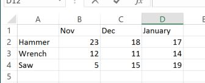

# <a name="call-built-in-excel-worksheet-functions"></a>Вызов встроенных функций листов Excel

В этой статье рассказывается, как вызывать встроенные функции листов Excel, такие как `VLOOKUP` и `SUM`, с помощью API JavaScript для Excel. В ней также представлен полный список встроенных функций листов Excel, которые можно вызывать с помощью API JavaScript для Excel.

> [!NOTE]
> Сведения о том, как создавать *пользовательские функции* в Excel с помощью API JavaScript для Excel, см. в статье [Создание пользовательских функций в Excel](custom-functions-overview.md).

## <a name="calling-a-worksheet-function"></a>Вызов функции листа

В приведенном ниже фрагменте кода показано, как вызвать функцию листа, где `sampleFunction()`— это заполнитель, который следует заменить на имя вызываемой функции и необходимые ей входные параметры. Свойство `value` объекта `FunctionResult` , возвращаемого функцией таблицы, содержит результат указанной функции. Как показано в этом примере `load` `value` `FunctionResult` , перед чтением необходимо свойство объекта. В этом примере результат выполнения функции просто записывается в консоль.

```js
await Excel.run(async (context) => {
    let functionResult = context.workbook.functions.sampleFunction();
    functionResult.load('value');

    await context.sync();
    console.log('Result of the function: ' + functionResult.value);
});
```

> [!TIP]
> В разделе [Поддерживаемые функции листов](#supported-worksheet-functions) в этой статье представлен список функций, которые можно вызывать с помощью API JavaScript для Excel.

## <a name="sample-data"></a>Образец данных

На приведенном ниже изображении показана таблица на листе Excel, содержащая данные о продажах различных инструментов в течение трех месяцев. Каждое число в таблице представляет количество единиц того или иного инструмента, проданных за определенный месяц. В последующих примерах показано, как применить к этим данным встроенные функции листов.



## <a name="example-1-single-function"></a>Пример 1. Одна функция

В приведенном ниже примере кода к вышеописанному примеру данных применяется функция `VLOOKUP`, чтобы определить количество гаечных ключей, проданных в ноябре.

```js
await Excel.run(async (context) => {
    let range = context.workbook.worksheets.getItem("Sheet1").getRange("A1:D4");
    let unitSoldInNov = context.workbook.functions.vlookup("Wrench", range, 2, false);
    unitSoldInNov.load('value');

    await context.sync();
    console.log(' Number of wrenches sold in November = ' + unitSoldInNov.value);
});
```

## <a name="example-2-nested-functions"></a>Пример 2. Вложенные функции

В приведенном ниже примере кода к вышеописанному примеру данных применяется функция `VLOOKUP`, чтобы определить количество гаечных ключей, проданных в ноябре и декабре, а затем применяется функция `SUM`, чтобы вычислить общее число гаечных ключей, проданных за эти два месяца.

Как показано в этом примере, если один или несколько вызовов функций вложены в вызов другой функции, то выполнять операцию `load` нужно только с окончательным результатом, который впоследствии потребуется прочитать (в этом примере — `sumOfTwoLookups`). Все промежуточные результаты (в этом примере — результат выполнения каждой функции `VLOOKUP`) будут вычислены и использованы для вычисления окончательного результата.

```js
await Excel.run(async (context) => {
    let range = context.workbook.worksheets.getItem("Sheet1").getRange("A1:D4");
    let sumOfTwoLookups = context.workbook.functions.sum(
        context.workbook.functions.vlookup("Wrench", range, 2, false),
        context.workbook.functions.vlookup("Wrench", range, 3, false)
    );
    sumOfTwoLookups.load('value');

    await context.sync();
    console.log(' Number of wrenches sold in November and December = ' + sumOfTwoLookups.value);
});
```

## <a name="supported-worksheet-functions"></a>Поддерживаемые функции листов

Ниже перечислены встроенные функции листов Excel, которые можно вызывать с помощью API JavaScript для Excel

| Функция | Описание |
|:---------------|:-----------|
| [Функция ABS](https://support.microsoft.com/office/3420200f-5628-4e8c-99da-c99d7c87713c) | Возвращает абсолютное значение числа |
| [Функция НАКОПДОХОД](https://support.microsoft.com/office/fe45d089-6722-4fb3-9379-e1f911d8dc74) | Возвращает накопленный процент по ценной бумаге с периодической выплатой процентов |
| [Функция НАКОПДОХОДПОГАШ](https://support.microsoft.com/office/f62f01f9-5754-4cc4-805b-0e70199328a7) | Возвращает накопленный процент по ценной бумаге, процент по которой выплачивается в срок погашения |
| [Функция ACOS](https://support.microsoft.com/office/cb73173f-d089-4582-afa1-76e5524b5d5b) | Возвращает арккосинус числа |
| [Функция ACOSH](https://support.microsoft.com/office/e3992cc1-103f-4e72-9f04-624b9ef5ebfe) | Возвращает обратный гиперболический косинус числа (ареакосинус) |
| [Функция ACOT](https://support.microsoft.com/office/dc7e5008-fe6b-402e-bdd6-2eea8383d905) | Возвращает арккотангенс числа |
| [Функция ACOTH](https://support.microsoft.com/office/cc49480f-f684-4171-9fc5-73e4e852300f) | Возвращает гиперболический арккотангенс числа |
| [Функция АМОРУМ](https://support.microsoft.com/office/a14d0ca1-64a4-42eb-9b3d-b0dededf9e51) | Возвращает величину амортизации для каждого учетного периода, используя коэффициент амортизации |
| [Функция АМОРУВ](https://support.microsoft.com/office/7d417b45-f7f5-4dba-a0a5-3451a81079a8) | Возвращает величину амортизации для каждого учетного периода |
| [Функция И](https://support.microsoft.com/office/5f19b2e8-e1df-4408-897a-ce285a19e9d9) | Возвращает значение `TRUE`, если все аргументы имеют значение ИСТИНА |
| [Функция АРАБСКОЕ](https://support.microsoft.com/office/9a8da418-c17b-4ef9-a657-9370a30a674f) | Преобразует римское число в арабское |
| [Функция ОБЛАСТИ](https://support.microsoft.com/office/8392ba32-7a41-43b3-96b0-3695d2ec6152) | Возвращает количество областей в ссылке |
| [Функция ASC](https://support.microsoft.com/office/0b6abf1c-c663-4004-a964-ebc00b723266) | Преобразует полноширинные (двухбайтовые) английские буквы или знаки катакана в строке символов в полуширинные (однобайтовые) символы |
| [Функция ASIN](https://support.microsoft.com/office/81fb95e5-6d6f-48c4-bc45-58f955c6d347) | Возвращает арксинус числа |
| [Функция ASINH](https://support.microsoft.com/office/4e00475a-067a-43cf-926a-765b0249717c) | Возвращает обратный гиперболический синус числа (ареасинус) |
| [Функция ATAN](https://support.microsoft.com/office/50746fa8-630a-406b-81d0-4a2aed395543) | Возвращает арктангенс числа |
| [Функция ATAN2](https://support.microsoft.com/office/c04592ab-b9e3-4908-b428-c96b3a565033) | Возвращает арктангенс для заданных координат x и y |
| [Функция ATANH](https://support.microsoft.com/office/3cd65768-0de7-4f1d-b312-d01c8c930d90) | Возвращает обратный гиперболический тангенс числа (ареатангенс) |
| [Функция СРОТКЛ](https://support.microsoft.com/office/58fe8d65-2a84-4dc7-8052-f3f87b5c6639) | Возвращает среднее арифметическое абсолютных отклонений значений от их среднего |
| [Функция СРЗНАЧ](https://support.microsoft.com/office/047bac88-d466-426c-a32b-8f33eb960cf6) | Возвращает среднее арифметическое аргументов |
| [Функция СРЗНАЧА](https://support.microsoft.com/office/f5f84098-d453-4f4c-bbba-3d2c66356091) | Возвращает среднее значение аргументов (включая числовые, текстовые и логические) |
| [Функция СРЗНАЧЕСЛИ](https://support.microsoft.com/office/faec8e2e-0dec-4308-af69-f5576d8ac642) | Возвращает среднее арифметическое всех ячеек в диапазоне, соответствующих определенному условию |
| [Функция СРЗНАЧЕСЛИМН](https://support.microsoft.com/office/48910c45-1fc0-4389-a028-f7c5c3001690) | Возвращает среднее арифметическое всех ячеек, соответствующих нескольким условиям |
| [Функция БАТТЕКСТ](https://support.microsoft.com/office/5ba4d0b4-abd3-4325-8d22-7a92d59aab9c) | Преобразует число в текст, используя денежный формат ß (бат) |
| [Функция ОСНОВАНИЕ](https://support.microsoft.com/office/2ef61411-aee9-4f29-a811-1c42456c6342) | Преобразует число в текстовое представление с указанным основанием системы счисления |
| [Функция БЕССЕЛЬ.I](https://support.microsoft.com/office/8d33855c-9a8d-444b-98e0-852267b1c0df) | Возвращает модифицированную функцию Бесселя In(x) |
| [Функция БЕССЕЛЬ.J](https://support.microsoft.com/office/839cb181-48de-408b-9d80-bd02982d94f7) | Возвращает функцию Бесселя Jn(x) |
| [Функция БЕССЕЛЬ.K](https://support.microsoft.com/office/606d11bc-06d3-4d53-9ecb-2803e2b90b70) | Возвращает модифицированную функцию Бесселя Kn(x) |
| [Функция БЕССЕЛЬ.Y](https://support.microsoft.com/office/f3a356b3-da89-42c3-8974-2da54d6353a2) | Возвращает функцию Бесселя Yn(x) |
| [Функция БЕТА.РАСП](https://support.microsoft.com/office/11188c9c-780a-42c7-ba43-9ecb5a878d31) | Возвращает функцию интегрального бета-распределения |
| [Функция БЕТА.ОБР](https://support.microsoft.com/office/e84cb8aa-8df0-4cf6-9892-83a341d252eb) | Возвращает обратную функцию к интегральной функции указанного бета-распределения |
| [Функция ДВ.В.ДЕС](https://support.microsoft.com/office/63905b57-b3a0-453d-99f4-647bb519cd6c) | Преобразует двоичное число в десятичное |
| [Функция ДВ.В.ШЕСТН](https://support.microsoft.com/office/0375e507-f5e5-4077-9af8-28d84f9f41cc) | Преобразует двоичное число в шестнадцатеричное |
| [Функция ДВ.В.ВОСЬМ](https://support.microsoft.com/office/0a4e01ba-ac8d-4158-9b29-16c25c4c23fd) | Преобразует двоичное число в восьмеричное |
| [Функция БИНОМ.РАСП](https://support.microsoft.com/office/c5ae37b6-f39c-4be2-94c2-509a1480770c) | Возвращает вероятность биномиального распределения отдельного условия |
| [Функция БИНОМ.РАСП.ДИАП](https://support.microsoft.com/office/17331329-74c7-4053-bb4c-6653a7421595) | Возвращает вероятность получения определенного результата испытания с помощью биномиального распределения |
| [Функция БИНОМ.ОБР](https://support.microsoft.com/office/80a0370c-ada6-49b4-83e7-05a91ba77ac9) | Возвращает наименьшее значение, при котором интегральное биномиальное распределение будет меньше заданного критерия или равно ему |
| [Функция БИТ.И](https://support.microsoft.com/office/8a2be3d7-91c3-4b48-9517-64548008563a) | Возвращает результат операции поразрядного И для двух чисел |
| [Функция БИТ.СДВИГЛ](https://support.microsoft.com/office/c55bb27e-cacd-4c7c-b258-d80861a03c9c) | Возвращает число со сдвигом влево на указанное число бит |
| [Функция БИТ.ИЛИ](https://support.microsoft.com/office/f6ead5c8-5b98-4c9e-9053-8ad5234919b2) | Возвращает результат операции поразрядного ИЛИ для двух чисел |
| [Функция БИТ.СДВИГП](https://support.microsoft.com/office/274d6996-f42c-4743-abdb-4ff95351222c) | Возвращает число со сдвигом вправо на указанное число бит |
| [Функция БИТ.ИСКЛИЛИ](https://support.microsoft.com/office/c81306a1-03f9-4e89-85ac-b86c3cba10e4) | Возвращает результат операции поразрядного исключающего ИЛИ для двух чисел |
| [ПОТОЛОК. MATH, ECMA_CEILING функции](https://support.microsoft.com/office/80f95d2f-b499-4eee-9f16-f795a8e306c8) | Округляет число к большему до ближайшего целого или до ближайшего кратного значения с указанной точностью |
| [Функция ОКРВВЕРХ.ТОЧН](https://support.microsoft.com/office/f366a774-527a-4c92-ba49-af0a196e66cb) | Округляет число до ближайшего целого или до ближайшего кратного значения с указанной точностью. Число округляется до большего значения вне зависимости от его знака. |
| [Функция СИМВОЛ](https://support.microsoft.com/office/bbd249c8-b36e-4a91-8017-1c133f9b837a) | Возвращает символ с указанным кодом |
| [Функция ХИ2.РАСП](https://support.microsoft.com/office/8486b05e-5c05-4942-a9ea-f6b341518732) | Возвращает интегральную функцию плотности бета-распределения |
| [Функция ХИ2.РАСП.ПХ](https://support.microsoft.com/office/dc4832e8-ed2b-49ae-8d7c-b28d5804c0f2) | Возвращает одностороннюю вероятность распределения хи-квадрат |
| [Функция ХИ2.ОБР](https://support.microsoft.com/office/400db556-62b3-472d-80b3-254723e7092f) | Возвращает интегральную функцию плотности бета-распределения |
| [Функция ХИ2.ОБР.ПХ](https://support.microsoft.com/office/435b5ed8-98d5-4da6-823f-293e2cbc94fe) | Возвращает значение, обратное односторонней вероятности распределения хи-квадрат |
| [Функция ВЫБОР](https://support.microsoft.com/office/fc5c184f-cb62-4ec7-a46e-38653b98f5bc) | Выбирает значение из списка значений |
| [Функция ПЕЧСИМВ](https://support.microsoft.com/office/26f3d7c5-475f-4a9c-90e5-4b8ba987ba41) | Удаляет из текста все непечатаемые символы |
| [Функция КОДСИМВ](https://support.microsoft.com/office/c32b692b-2ed0-4a04-bdd9-75640144b928) | Возвращает числовой код первого символа в текстовой строке |
| [Функция ЧИСЛСТОЛБ](https://support.microsoft.com/office/4e8e7b4e-e603-43e8-b177-956088fa48ca) | Возвращает количество столбцов в ссылке |
| [Функция ЧИСЛКОМБ](https://support.microsoft.com/office/12a3f276-0a21-423a-8de6-06990aaf638a) | Возвращает количество комбинаций, которые можно составить из заданного числа объектов |
| [Функция ЧИСЛКОМБА](https://support.microsoft.com/office/efb49eaa-4f4c-4cd2-8179-0ddfcf9d035d) | Возвращает количество комбинаций, которые можно составить из заданного числа элементов, с повторами |
| [Функция КОМПЛЕКСН](https://support.microsoft.com/office/f0b8f3a9-51cc-4d6d-86fb-3a9362fa4128) | Преобразует коэффициенты при вещественной и мнимой частях комплексного числа в комплексное число |
| [Функция СЦЕПИТЬ](https://support.microsoft.com/office/8f8ae884-2ca8-4f7a-b093-75d702bea31d) | Объединяет несколько текстовых элементов в один |
| [Функция ДОВЕРИТ.НОРМ](https://support.microsoft.com/office/7cec58a6-85bb-488d-91c3-63828d4fbfd4) | Возвращает доверительный интервал для среднего генеральной совокупности |
| [Функция ДОВЕРИТ.СТЬЮДЕНТ](https://support.microsoft.com/office/e8eca395-6c3a-4ba9-9003-79ccc61d3c53) | Возвращает доверительный интервал для среднего генеральной совокупности, используя распределение Стьюдента |
| [Функция ПРЕОБР](https://support.microsoft.com/office/d785bef1-808e-4aac-bdcd-666c810f9af2) | Преобразует значение из одной системы измерения в другую |
| [Функция COS](https://support.microsoft.com/office/0fb808a5-95d6-4553-8148-22aebdce5f05) | Возвращает косинус числа |
| [Функция COSH](https://support.microsoft.com/office/e460d426-c471-43e8-9540-a57ff3b70555) | Возвращает гиперболический косинус числа |
| [Функция COT](https://support.microsoft.com/office/c446f34d-6fe4-40dc-84f8-cf59e5f5e31a) | Возвращает котангенс угла |
| [Функция COTH](https://support.microsoft.com/office/2e0b4cb6-0ba0-403e-aed4-deaa71b49df5) | Возвращает гиперболический котангенс числа |
| [Функция СЧЁТ](https://support.microsoft.com/office/a59cd7fc-b623-4d93-87a4-d23bf411294c) | Подсчитывает количество чисел в списке аргументов |
| [Функция СЧЁТЗ](https://support.microsoft.com/office/7dc98875-d5c1-46f1-9a82-53f3219e2509) | Подсчитывает количество значений в списке аргументов |
| [Функция СЧИТАТЬПУСТОТЫ](https://support.microsoft.com/office/6a92d772-675c-4bee-b346-24af6bd3ac22) | Подсчитывает количество пустых ячеек в диапазоне |
| [Функция СЧЁТЕСЛИ](https://support.microsoft.com/office/e0de10c6-f885-4e71-abb4-1f464816df34) | Подсчитывает количество ячеек в диапазоне, соответствующих определенному условию |
| [Функция СЧЁТЕСЛИМН](https://support.microsoft.com/office/dda3dc6e-f74e-4aee-88bc-aa8c2a866842) | Подсчитывает количество ячеек в диапазоне, соответствующих нескольким условиям |
| [Функция ДНЕЙКУПОНДО](https://support.microsoft.com/office/eb9a8dfb-2fb2-4c61-8e5d-690b320cf872) | Возвращает количество дней с начала купонного периода до даты расчета |
| [Функция ДНЕЙКУПОН](https://support.microsoft.com/office/cc64380b-315b-4e7b-950c-b30b0a76f671) | Возвращает количество дней расчета в купонном периоде |
| [Функция ДНЕЙКУПОНПОСЛЕ](https://support.microsoft.com/office/5ab3f0b2-029f-4a8b-bb65-47d525eea547) | Возвращает количество дней между датой расчета и следующей датой выплаты процентов |
| [Функция ДАТАКУПОНПОСЛЕ](https://support.microsoft.com/office/fd962fef-506b-4d9d-8590-16df5393691f) | Возвращает дату выплаты процентов, следующую после даты расчета |
| [Функция ЧИСЛКУПОН](https://support.microsoft.com/office/a90af57b-de53-4969-9c99-dd6139db2522) | Возвращает количество процентных выплат между датой расчета и датой погашения |
| [Функция ДАТАКУПОНДО](https://support.microsoft.com/office/2eb50473-6ee9-4052-a206-77a9a385d5b3) | Возвращает дату выплаты процентов, которая предшествует дате расчета |
| [Функция CSC](https://support.microsoft.com/office/07379361-219a-4398-8675-07ddc4f135c1) | Возвращает косеканс угла |
| [Функция CSCH](https://support.microsoft.com/office/f58f2c22-eb75-4dd6-84f4-a503527f8eeb) | Возвращает гиперболический косеканс угла |
| [Функция ОБЩПЛАТ](https://support.microsoft.com/office/61067bb0-9016-427d-b95b-1a752af0e606) | Возвращает кумулятивную сумму процентов, выплачиваемую между двумя периодами |
| [Функция ОБЩДОХОД](https://support.microsoft.com/office/94a4516d-bd65-41a1-bc16-053a6af4c04d) | Возвращает кумулятивную сумму, выплачиваемую для погашения займа между двумя периодами |
| [Функция ДАТА](https://support.microsoft.com/office/e36c0c8c-4104-49da-ab83-82328b832349) | Возвращает порядковый номер определенной даты |
| [Функция ДАТАЗНАЧ](https://support.microsoft.com/office/df8b07d4-7761-4a93-bc33-b7471bbff252) | Преобразует дату из текстового формата в числовой |
| [Функция ДСРЗНАЧ](https://support.microsoft.com/office/a6a2d5ac-4b4b-48cd-a1d8-7b37834e5aee) | Возвращает среднее значение выбранных записей базы данных |
| [Функция ДЕНЬ](https://support.microsoft.com/office/8a7d1cbb-6c7d-4ba1-8aea-25c134d03101) | Преобразует порядковый номер в день месяца |
| [Функция ДНИ](https://support.microsoft.com/office/57740535-d549-4395-8728-0f07bff0b9df) | Возвращает количество дней между двумя датами |
| [Функция ДНЕЙ360](https://support.microsoft.com/office/b9a509fd-49ef-407e-94df-0cbda5718c2a) | Вычисляет количество дней между двумя датами на основании 360-дневного года |
| [Функция ФУО](https://support.microsoft.com/office/354e7d28-5f93-4ff1-8a52-eb4ee549d9d7) | Возвращает сумму амортизации актива за определенный период, начисляемую по методу фиксированного убывающего остатка |
| [Функция DBCS](https://support.microsoft.com/office/a4025e73-63d2-4958-9423-21a24794c9e5) | Преобразует полуширинные (однобайтовые) английские буквы или знаки катакана в пределах строки символов в полноширинные (двухбайтовые) символы |
| [Функция БСЧЁТ](https://support.microsoft.com/office/c1fc7b93-fb0d-4d8d-97db-8d5f076eaeb1) | Подсчитывает количество ячеек в базе данных, содержащих числа |
| [Функция БСЧЁТА](https://support.microsoft.com/office/00232a6d-5a66-4a01-a25b-c1653fda1244) | Подсчитывает количество непустых ячеек в базе данных |
| [Функция ДДОБ](https://support.microsoft.com/office/519a7a37-8772-4c96-85c0-ed2c209717a5) | Возвращает сумму амортизации актива за определенный период, начисляемую методом двойного убывающего остатка или иным указанным методом |
| [Функция ДЕС.В.ДВ](https://support.microsoft.com/office/0f63dd0e-5d1a-42d8-b511-5bf5c6d43838) | Преобразует десятичное число в двоичное |
| [Функция ДЕС.В.ШЕСТН](https://support.microsoft.com/office/6344ee8b-b6b5-4c6a-a672-f64666704619) | Преобразует десятичное число в шестнадцатеричное |
| [Функция ДЕС.В.ВОСЬМ](https://support.microsoft.com/office/c9d835ca-20b7-40c4-8a9e-d3be351ce00f) | Преобразует десятичное число в восьмеричное |
| [Функция ДЕС](https://support.microsoft.com/office/ee554665-6176-46ef-82de-0a283658da2e) | Преобразует текстовое представление числа c указанным основанием в десятичное |
| [Функция ГРАДУСЫ](https://support.microsoft.com/office/4d6ec4db-e694-4b94-ace0-1cc3f61f9ba1) | Преобразует радианы в градусы |
| [Функция ДЕЛЬТА](https://support.microsoft.com/office/2f763672-c959-4e07-ac33-fe03220ba432) | Проверяет равенство двух значений |
| [Функция КВАДРОТКЛ](https://support.microsoft.com/office/8b739616-8376-4df5-8bd0-cfe0a6caf444) | Возвращает сумму квадратов отклонений |
| [Функция БИЗВЛЕЧЬ](https://support.microsoft.com/office/455568bf-4eef-45f7-90f0-ec250d00892e) | Извлекает из базы данных одну запись, соответствующую заданному условию |
| [Функция СКИДКА](https://support.microsoft.com/office/71fce9f3-3f05-4acf-a5a3-eac6ef4daa53) | Возвращает ставку дисконтирования ценной бумаги |
| [Функция ДМАКС](https://support.microsoft.com/office/f4e8209d-8958-4c3d-a1ee-6351665d41c2) | Возвращает наибольшее значение из выбранных записей базы данных |
| [Функция ДМИН](https://support.microsoft.com/office/4ae6f1d9-1f26-40f1-a783-6dc3680192a3) | Возвращает наименьшее значение из выбранных записей базы данных |
| [Функции DOLLAR, USDOLLAR](https://support.microsoft.com/office/a6cd05d9-9740-4ad3-a469-8109d18ff611) | Преобразует число в текст, используя денежный формат |
| [Функция РУБЛЬ.ДЕС](https://support.microsoft.com/office/db85aab0-1677-428a-9dfd-a38476693427) | Преобразует цену в рублях, представленную в виде десятичной дроби, в десятичное число |
| [Функция РУБЛЬ.ДРОБЬ](https://support.microsoft.com/office/0835d163-3023-4a33-9824-3042c5d4f495) | Преобразует цену в рублях, представленную в виде десятичного числа, в десятичную дробь |
| [Функция БДПРОИЗВЕД](https://support.microsoft.com/office/4f96b13e-d49c-47a7-b769-22f6d017cb31) | Перемножает значения определенного поля записей, соответствующих условию, в базе данных |
| [Функция ДСТАНДОТКЛ](https://support.microsoft.com/office/026b8c73-616d-4b5e-b072-241871c4ab96) | Оценивает стандартное отклонение для выборки записей базы данных |
| [Функция ДСТАНДОТКЛП](https://support.microsoft.com/office/04b78995-da03-4813-bbd9-d74fd0f5d94b) | Вычисляет стандартное отклонение для генеральной совокупности выбранных записей базы данных |
| [Функция БДСУММ](https://support.microsoft.com/office/53181285-0c4b-4f5a-aaa3-529a322be41b) | Суммирует числа в поле (столбце) записей базы данных, соответствующих условию |
| [Функция ДЛИТ](https://support.microsoft.com/office/b254ea57-eadc-4602-a86a-c8e369334038) | Возвращает дюрацию ценной бумаги с периодической выплатой процентов в годовом исчислении |
| [Функция Dlet](https://support.microsoft.com/office/d6747ca9-99c7-48bb-996e-9d7af00f3ed1) | Оценивает дисперсию для выборки записей базы данных |
| [Функция БДДИСПП](https://support.microsoft.com/office/eb0ba387-9cb7-45c8-81e9-0394912502fc) | Вычисляет дисперсию для генеральной совокупности выбранных записей базы данных |
| [Функция ДАТАМЕС](https://support.microsoft.com/office/3c920eb2-6e66-44e7-a1f5-753ae47ee4f5) | Возвращает порядковый номер даты, отстоящей на заданное количество месяцев вперед или назад от начальной даты |
| [Функция ЭФФЕКТ](https://support.microsoft.com/office/910d4e4c-79e2-4009-95e6-507e04f11bc4) | Возвращает эффективную годовую процентную ставку |
| [Функция КОНМЕСЯЦА](https://support.microsoft.com/office/7314ffa1-2bc9-4005-9d66-f49db127d628) | Возвращает порядковый номер последнего дня месяца, отстоящего на заданное число месяцев вперед или назад от начальной даты |
| [Функция ФОШ](https://support.microsoft.com/office/c53c7e7b-5482-4b6c-883e-56df3c9af349) | Возвращает функцию ошибок |
| [Функция ФОШ.ТОЧН](https://support.microsoft.com/office/9a349593-705c-4278-9a98-e4122831a8e0) | Возвращает функцию ошибок |
| [Функция ДФОШ](https://support.microsoft.com/office/736e0318-70ba-4e8b-8d08-461fe68b71b3) | Возвращает дополнительную функцию ошибок |
| [Функция ДФОШ.ТОЧН](https://support.microsoft.com/office/e90e6bab-f45e-45df-b2ac-cd2eb4d4a273) | Возвращает дополнительную функцию ошибок, проинтегрированную от x до бесконечности |
| [Функция ТИП.ОШИБКИ](https://support.microsoft.com/office/10958677-7c8d-44f7-ae77-b9a9ee6eefaa) | Возвращает номер, соответствующий типу ошибки |
| [Функция ЧЁТН](https://support.microsoft.com/office/197b5f06-c795-4c1e-8696-3c3b8a646cf9) | Округляет число к большему до ближайшего четного целого |
| [Функция СОВПАД](https://support.microsoft.com/office/d3087698-fc15-4a15-9631-12575cf29926) | Проверяет идентичность двух текстовых значений |
| [Функция EXP](https://support.microsoft.com/office/c578f034-2c45-4c37-bc8c-329660a63abe) | Возвращает число e, возведенное в указанную степень |
| [Функция ЭКСП.РАСП](https://support.microsoft.com/office/4c12ae24-e563-4155-bf3e-8b78b6ae140e) | Возвращает экспоненциальное распределение |
| [Функция F.РАСП](https://support.microsoft.com/office/a887efdc-7c8e-46cb-a74a-f884cd29b25d) | Возвращает F-распределение вероятности |
| [Функция F.РАСП.ПХ](https://support.microsoft.com/office/d74cbb00-6017-4ac9-b7d7-6049badc0520) | Возвращает F-распределение вероятности |
| [Функция F.ОБР](https://support.microsoft.com/office/0dda0cf9-4ea0-42fd-8c3c-417a1ff30dbe) | Возвращает обратное F-распределение вероятности |
| [Функция F.ОБР.ПХ](https://support.microsoft.com/office/d371aa8f-b0b1-40ef-9cc2-496f0693ac00) | Возвращает обратное F-распределение вероятности |
| [Функция ФАКТР](https://support.microsoft.com/office/ca8588c2-15f2-41c0-8e8c-c11bd471a4f3) | Возвращает факториал числа |
| [Функция ДВФАКТР](https://support.microsoft.com/office/e67697ac-d214-48eb-b7b7-cce2589ecac8) | Возвращает двойной факториал числа |
| [Функция ЛОЖЬ](https://support.microsoft.com/office/2d58dfa5-9c03-4259-bf8f-f0ae14346904) | Возвращает логическое значение `FALSE` |
| [Функции НАЙТИ, НАЙТИБ](https://support.microsoft.com/office/c7912941-af2a-4bdf-a553-d0d89b0a0628) | Находит одно текстовое значение в другом (с учетом регистра) |
| [Функция ФИШЕР](https://support.microsoft.com/office/d656523c-5076-4f95-b87b-7741bf236c69) | Возвращает преобразование Фишера |
| [Функция ФИШЕРОБР](https://support.microsoft.com/office/62504b39-415a-4284-a285-19c8e82f86bb) | Возвращает обратное преобразование Фишера |
| [Функция ФИКСИРОВАННЫЙ](https://support.microsoft.com/office/ffd5723c-324c-45e9-8b96-e41be2a8274a) | Форматирует число, отображая определенное количество знаков после запятой |
| [Функция ОКРВНИЗ.МАТ](https://support.microsoft.com/office/c302b599-fbdb-4177-ba19-2c2b1249a2f5) | Округляет число к меньшему до ближайшего целого или до ближайшего кратного с указанной точностью |
| [Функция ОКРВНИЗ.ТОЧН](https://support.microsoft.com/office/f769b468-1452-4617-8dc3-02f842a0702e) | Округляет число к меньшему до ближайшего целого или до ближайшего кратного с указанной точностью. Число округляется до меньшего значения вне зависимости от его знака. |
| [Функция БС](https://support.microsoft.com/office/2eef9f44-a084-4c61-bdd8-4fe4bb1b71b3) | Возвращает будущую стоимость инвестиций |
| [Функция БЗРАСПИС](https://support.microsoft.com/office/bec29522-bd87-4082-bab9-a241f3fb251d) | Возвращает будущую стоимость первоначальной основной суммы после применения ряда ставок сложных процентов |
| [Функция ГАММА](https://support.microsoft.com/office/ce1702b1-cf55-471d-8307-f83be0fc5297) | Возвращает значение гамма-функции |
| [Функция ГАММА.РАСП](https://support.microsoft.com/office/9b6f1538-d11c-4d5f-8966-21f6a2201def) | Возвращает гамма-распределение |
| [Функция ГАММА.ОБР](https://support.microsoft.com/office/74991443-c2b0-4be5-aaab-1aa4d71fbb18) | Возвращает обратное интегральное гамма-распределение |
| [Функция ГАММАНЛОГ](https://support.microsoft.com/office/b838c48b-c65f-484f-9e1d-141c55470eb9) | Возвращает натуральный логарифм гамма-функции — Γ(x) |
| [Функция ГАММАНЛОГ.ТОЧН](https://support.microsoft.com/office/5cdfe601-4e1e-4189-9d74-241ef1caa599) | Возвращает натуральный логарифм гамма-функции — Γ(x) |
| [Функция ГАУСС](https://support.microsoft.com/office/069f1b4e-7dee-4d6a-a71f-4b69044a6b33) | Возвращает значение на 0,5 меньше стандартного нормального интегрального распределения |
| [Функция НОД](https://support.microsoft.com/office/d5107a51-69e3-461f-8e4c-ddfc21b5073a) | Возвращает наибольший общий делитель |
| [Функция СРГЕОМ](https://support.microsoft.com/office/db1ac48d-25a5-40a0-ab83-0b38980e40d5) | Возвращает среднее геометрическое значение |
| [Функция ПОРОГ](https://support.microsoft.com/office/f37e7d2a-41da-4129-be95-640883fca9df) | Проверяет, превышает ли число пороговое значение |
| [Функция СРГАРМ](https://support.microsoft.com/office/5efd9184-fab5-42f9-b1d3-57883a1d3bc6) | Возвращает среднее гармоническое значение |
| [Функция ШЕСТН.В.ДВ](https://support.microsoft.com/office/a13aafaa-5737-4920-8424-643e581828c1) | Преобразует шестнадцатеричное число в двоичное |
| [Функция ШЕСТН.В.ДЕС](https://support.microsoft.com/office/8c8c3155-9f37-45a5-a3ee-ee5379ef106e) | Преобразует шестнадцатеричное число в десятичное |
| [Функция ШЕСТН.В.ВОСЬМ](https://support.microsoft.com/office/54d52808-5d19-4bd0-8a63-1096a5d11912) | Преобразует шестнадцатеричное число в восьмеричное |
| [Функция ГПР](https://support.microsoft.com/office/a3034eec-b719-4ba3-bb65-e1ad662ed95f) | Выполняет поиск в первой строке массива и возвращает значение указанной ячейки |
| [Функция ЧАС](https://support.microsoft.com/office/a3afa879-86cb-4339-b1b5-2dd2d7310ac7) | Преобразует порядковый номер в час |
| [Функция ГИПЕРССЫЛКА](https://support.microsoft.com/office/333c7ce6-c5ae-4164-9c47-7de9b76f577f) | Создает гиперссылку на документ, расположенный на сетевом сервере, в интрасети или Интернете |
| [Функция ГИПЕРГЕОМ.РАСП](https://support.microsoft.com/office/6dbd547f-1d12-4b1f-8ae5-b0d9e3d22fbf) | Возвращает гипергеометрическое распределение |
| [Функция ЕСЛИ](https://support.microsoft.com/office/69aed7c9-4e8a-4755-a9bc-aa8bbff73be2) | Выполняет указанную логическую проверку |
| [Функция МНИМ.ABS](https://support.microsoft.com/office/b31e73c6-d90c-4062-90bc-8eb351d765a1) | Возвращает абсолютную величину (модуль) комплексного числа |
| [Функция МНИМ.ЧАСТЬ](https://support.microsoft.com/office/dd5952fd-473d-44d9-95a1-9a17b23e428a) | Возвращает коэффициент при мнимой части комплексного числа |
| [Функция МНИМ.АРГУМЕНТ](https://support.microsoft.com/office/eed37ec1-23b3-4f59-b9f3-d340358a034a) | Возвращает аргумент тета — угол, выраженный в радианах |
| [Функция МНИМ.СОПРЯЖ](https://support.microsoft.com/office/2e2fc1ea-f32b-4f9b-9de6-233853bafd42) | Возвращает комплексно-сопряженное число для комплексного числа |
| [Функция МНИМ.COS](https://support.microsoft.com/office/dad75277-f592-4a6b-ad6c-be93a808a53c) | Возвращает косинус комплексного числа |
| [Функция МНИМ.COSH](https://support.microsoft.com/office/053e4ddb-4122-458b-be9a-457c405e90ff) | Возвращает гиперболический косинус комплексного числа |
| [Функция МНИМ.COT](https://support.microsoft.com/office/dc6a3607-d26a-4d06-8b41-8931da36442c) | Возвращает котангенс комплексного числа |
| [Функция МНИМ.CSC](https://support.microsoft.com/office/9e158d8f-2ddf-46cd-9b1d-98e29904a323) | Возвращает косеканс комплексного числа |
| [Функция МНИМ.CSCH](https://support.microsoft.com/office/c0ae4f54-5f09-4fef-8da0-dc33ea2c5ca9) | Возвращает гиперболический косеканс комплексного числа |
| [Функция МНИМ.ДЕЛ](https://support.microsoft.com/office/a505aff7-af8a-4451-8142-77ec3d74d83f) | Возвращает частное от деления двух комплексных чисел |
| [Функция МНИМ.EXP](https://support.microsoft.com/office/c6f8da1f-e024-4c0c-b802-a60e7147a95f) | Возвращает экспоненту комплексного числа |
| [Функция МНИМ.LN](https://support.microsoft.com/office/32b98bcf-8b81-437c-a636-6fb3aad509d8) | Возвращает натуральный логарифм комплексного числа |
| [Функция МНИМ.LOG10](https://support.microsoft.com/office/58200fca-e2a2-4271-8a98-ccd4360213a5) | Возвращает десятичный логарифм комплексного числа |
| [Функция МНИМ.LOG2](https://support.microsoft.com/office/152e13b4-bc79-486c-a243-e6a676878c51) | Возвращает двоичный логарифм комплексного числа |
| [Функция МНИМ.СТЕПЕНЬ](https://support.microsoft.com/office/210fd2f5-f8ff-4c6a-9d60-30e34fbdef39) | Возвращает комплексное число, возведенное в степень с целочисленным показателем |
| [Функция МНИМ.ПРОИЗВЕД](https://support.microsoft.com/office/2fb8651a-a4f2-444f-975e-8ba7aab3a5ba) | Возвращает произведение от 2 до 255 комплексных чисел |
| [Функция МНИМ.ВЕЩ](https://support.microsoft.com/office/d12bc4c0-25d0-4bb3-a25f-ece1938bf366) | Возвращает коэффициент при вещественной части комплексного числа |
| [Функция МНИМ.SEC](https://support.microsoft.com/office/6df11132-4411-4df4-a3dc-1f17372459e0) | Возвращает секанс комплексного числа |
| [Функция МНИМ.SECH](https://support.microsoft.com/office/f250304f-788b-4505-954e-eb01fa50903b) | Возвращает гиперболический секанс комплексного числа |
| [Функция МНИМ.SIN](https://support.microsoft.com/office/1ab02a39-a721-48de-82ef-f52bf37859f6) | Возвращает синус комплексного числа |
| [Функция МНИМ.SINH](https://support.microsoft.com/office/dfb9ec9e-8783-4985-8c42-b028e9e8da3d) | Возвращает гиперболический синус комплексного числа |
| [Функция МНИМ.КОРЕНЬ](https://support.microsoft.com/office/e1753f80-ba11-4664-a10e-e17368396b70) | Возвращает значение квадратного корня из комплексного числа |
| [Функция МНИМ.РАЗН](https://support.microsoft.com/office/2e404b4d-4935-4e85-9f52-cb08b9a45054) | Возвращает разность двух комплексных чисел |
| [Функция МНИМ.СУММ](https://support.microsoft.com/office/81542999-5f1c-4da6-9ffe-f1d7aaa9457f) | Возвращает сумму комплексных чисел |
| [Функция МНИМ.TAN](https://support.microsoft.com/office/8478f45d-610a-43cf-8544-9fc0b553a132) | Возвращает тангенс комплексного числа |
| [Функция ЦЕЛОЕ](https://support.microsoft.com/office/a6c4af9e-356d-4369-ab6a-cb1fd9d343ef) | Округляет число к меньшему до ближайшего целого |
| [Функция ИНОРМА](https://support.microsoft.com/office/5cb34dde-a221-4cb6-b3eb-0b9e55e1316f) | Возвращает процентную ставку для полностью инвестированной ценной бумаги |
| [Функция ПРПЛТ](https://support.microsoft.com/office/5cce0ad6-8402-4a41-8d29-61a0b054cb6f) | Возвращает сумму процентных выплат по инвестиции за определенный период |
| [Функция ВСД](https://support.microsoft.com/office/64925eaa-9988-495b-b290-3ad0c163c1bc) | Возвращает внутреннюю норму доходности на основании ряда денежных потоков. |
| [Функция ЕОШ](https://support.microsoft.com/office/0f2d7971-6019-40a0-a171-f2d869135665) | Возвращает значение `TRUE`, если ячейка содержит ошибку (кроме #Н/Д) |
| [Функция ЕОШИБКА](https://support.microsoft.com/office/0f2d7971-6019-40a0-a171-f2d869135665) | Возвращает значение `TRUE`, если ячейка содержит ошибку |
| [Функция ЕЧЁТН](https://support.microsoft.com/office/aa15929a-d77b-4fbb-92f4-2f479af55356) | Возвращает значение `TRUE`, если ячейка содержит четное число |
| [Функция ЕФОРМУЛА](https://support.microsoft.com/office/e4d1355f-7121-4ef2-801e-3839bfd6b1e5) | Возвращает значение `TRUE`, если ячейка содержит формулу |
| [Функция ЕЛОГИЧ](https://support.microsoft.com/office/0f2d7971-6019-40a0-a171-f2d869135665) | Возвращает значение `TRUE`, если ячейка содержит логическое значение |
| [Функция ЕНД](https://support.microsoft.com/office/0f2d7971-6019-40a0-a171-f2d869135665) | Возвращает значение `TRUE`, если ячейка содержит ошибку #Н/Д |
| [Функция ЕНЕТЕКСТ](https://support.microsoft.com/office/0f2d7971-6019-40a0-a171-f2d869135665) | Возвращает значение `TRUE`, если ячейка содержит любое значение, кроме текстового |
| [Функция ЕЧИСЛО](https://support.microsoft.com/office/0f2d7971-6019-40a0-a171-f2d869135665) | Возвращает значение `TRUE`, если ячейка содержит число |
| [Функция ISO.ОКРВВЕРХ](https://support.microsoft.com/office/e587bb73-6cc2-4113-b664-ff5b09859a83) | Возвращает число, округленное к большему до ближайшего целого или до ближайшего кратного с указанной точностью |
| [Функция ЕНЕЧЁТ](https://support.microsoft.com/office/0f2d7971-6019-40a0-a171-f2d869135665) | Возвращает значение `TRUE`, если ячейка содержит нечетное число |
| [Функция НОМНЕДЕЛИ.ISO](https://support.microsoft.com/office/1c2d0afe-d25b-4ab1-8894-8d0520e90e0e) | Возвращает номер недели в году для определенной даты в соответствии со стандартами ISO |
| [Функция ПРОЦПЛАТ](https://support.microsoft.com/office/fa58adb6-9d39-4ce0-8f43-75399cea56cc) | Вычисляет сумму процентов, выплачиваемую в течение определенного инвестиционного периода |
| [Функция ЕССЫЛКА](https://support.microsoft.com/office/0f2d7971-6019-40a0-a171-f2d869135665) | Возвращает значение `TRUE`, если ячейка содержит ссылку |
| [Функция ЕТЕКСТ](https://support.microsoft.com/office/0f2d7971-6019-40a0-a171-f2d869135665) | Возвращает значение `TRUE`, если ячейка содержит текстовое значение |
| [Функция ЭКСЦЕСС](https://support.microsoft.com/office/bc3a265c-5da4-4dcb-b7fd-c237789095ab) | Возвращает эксцесс множества данных |
| [Функция НАИБОЛЬШИЙ](https://support.microsoft.com/office/3af0af19-1190-42bb-bb8b-01672ec00a64) | Возвращает k-е наибольшее значение в наборе данных |
| [Функция НОК](https://support.microsoft.com/office/7152b67a-8bb5-4075-ae5c-06ede5563c94) | Возвращает наименьшее общее кратное |
| [Функции ЛЕВСИМВ, ЛЕВБ](https://support.microsoft.com/office/9203d2d2-7960-479b-84c6-1ea52b99640c) | Возвращают первые символы в текстовой строке |
| [Функции ДЛСТР, ДЛИНБ](https://support.microsoft.com/office/29236f94-cedc-429d-affd-b5e33d2c67cb) | Возвращает количество символов в текстовой строке |
| [Функция LN](https://support.microsoft.com/office/81fe1ed7-dac9-4acd-ba1d-07a142c6118f) | Возвращает натуральный логарифм числа |
| [Функция LOG](https://support.microsoft.com/office/4e82f196-1ca9-4747-8fb0-6c4a3abb3280) | Возвращает логарифм числа по заданному основанию |
| [Функция LOG10](https://support.microsoft.com/office/c75b881b-49dd-44fb-b6f4-37e3486a0211) | Возвращает десятичный логарифм числа |
| [Функция ЛОГНОРМ.РАСП](https://support.microsoft.com/office/eb60d00b-48a9-4217-be2b-6074aee6b070) | Возвращает интегральное логнормальное распределение |
| [Функция ЛОГНОРМ.ОБР](https://support.microsoft.com/office/fe79751a-f1f2-4af8-a0a1-e151b2d4f600) | Возвращает обратное интегральное логнормальное распределение |
| [Функция ПРОСМОТР](https://support.microsoft.com/office/446d94af-663b-451d-8251-369d5e3864cb) | Ищет значения в строке, столбце или массиве |
| [Функция СТРОЧН](https://support.microsoft.com/office/3f21df02-a80c-44b2-afaf-81358f9fdeb4) | Преобразует текст в нижний регистр |
| [Функция ПОИСКПОЗ](https://support.microsoft.com/office/e8dffd45-c762-47d6-bf89-533f4a37673a) | Ищет значения в ссылке или массиве |
| [Функция МАКС](https://support.microsoft.com/office/e0012414-9ac8-4b34-9a47-73e662c08098) | Возвращает максимальное значение в списке аргументов |
| [Функция МАКСА](https://support.microsoft.com/office/814bda1e-3840-4bff-9365-2f59ac2ee62d) | Возвращает максимальное значение в списке аргументов (включая числовые, текстовые и логические) |
| [Функция МДЛИТ](https://support.microsoft.com/office/b3786a69-4f20-469a-94ad-33e5b90a763c) | Возвращает модифицированную дюрацию Маколея для ценной бумаги с предполагаемой номинальной стоимостью 100 р. |
| [Функция МЕДИАНА](https://support.microsoft.com/office/d0916313-4753-414c-8537-ce85bdd967d2) | Возвращает медиану заданных чисел |
| [Функции ПСТР, ПСТРБ](https://support.microsoft.com/office/d5f9e25c-d7d6-472e-b568-4ecb12433028) | Возвращают определенное количество знаков из текстовой строки, начиная с указанной позиции |
| [Функция МИН](https://support.microsoft.com/office/61635d12-920f-4ce2-a70f-96f202dcc152) | Возвращает минимальное значение в списке аргументов |
| [Функция МИНА](https://support.microsoft.com/office/245a6f46-7ca5-4dc7-ab49-805341bc31d3) | Возвращает минимальное значение в списке аргументов (включая числовые, текстовые и логические) |
| [Функция МИНУТЫ](https://support.microsoft.com/office/af728df0-05c4-4b07-9eed-a84801a60589) | Преобразует порядковый номер в минуты |
| [Функция МВСД](https://support.microsoft.com/office/b020f038-7492-4fb4-93c1-35c345b53524) | Возвращает внутреннюю норму доходности с учетом разных ставок финансирования для положительного и отрицательного денежных потоков |
| [Функция ОСТАТ](https://support.microsoft.com/office/9b6cd169-b6ee-406a-a97b-edf2a9dc24f3) | Возвращает остаток от деления |
| [Функция МЕСЯЦ](https://support.microsoft.com/office/579a2881-199b-48b2-ab90-ddba0eba86e8) | Преобразует порядковый номер в месяц |
| [Функция ОКРУГЛТ](https://support.microsoft.com/office/c299c3b0-15a5-426d-aa4b-d2d5b3baf427) | Возвращает число, округленное с заданной точностью |
| [Функция МУЛЬТИНОМ](https://support.microsoft.com/office/6fa6373c-6533-41a2-a45e-a56db1db1bf6) | Возвращает полиномиальный коэффициент набора чисел |
| [Функция Ч](https://support.microsoft.com/office/a624cad1-3635-4208-b54a-29733d1278c9) | Возвращает значение, преобразованное в число |
| [Функция НД](https://support.microsoft.com/office/5469c2d1-a90c-4fb5-9bbc-64bd9bb6b47c) | Возвращает ошибку #Н/Д |
| [Функция ОТРБИНОМ.РАСП](https://support.microsoft.com/office/c8239f89-c2d0-45bd-b6af-172e570f8599) | Возвращает отрицательное биномиальное распределение |
| [Функция ЧИСТРАБДНИ](https://support.microsoft.com/office/48e717bf-a7a3-495f-969e-5005e3eb18e7) | Возвращает количество полных рабочих дней между двумя датами |
| [Функция ЧИСТРАБДНИ.МЕЖД](https://support.microsoft.com/office/a9b26239-4f20-46a1-9ab8-4e925bfd5e28) | Возвращает количество полных рабочих дней между двумя датами с использованием параметров, определяющих, сколько в неделе выходных и какие дни являются выходными |
| [Функция НОМИНАЛ](https://support.microsoft.com/office/7f1ae29b-6b92-435e-b950-ad8b190ddd2b) | Возвращает номинальную годовую процентную ставку |
| [Функция НОРМ.РАСП](https://support.microsoft.com/office/edb1cc14-a21c-4e53-839d-8082074c9f8d) | Возвращает нормальное распределение |
| [Функция НОРМ.ОБР](https://support.microsoft.com/office/54b30935-fee7-493c-bedb-2278a9db7e13) | Возвращает обратное нормальное распределение |
| [Функция НОРМ.СТ.РАСП](https://support.microsoft.com/office/1e787282-3832-4520-a9ae-bd2a8d99ba88) | Возвращает стандартное нормальное распределение |
| [Функция НОРМ.СТ.ОБР](https://support.microsoft.com/office/d6d556b4-ab7f-49cd-b526-5a20918452b1) | Возвращает обратное стандартное нормальное распределение |
| [Функция НЕ](https://support.microsoft.com/office/9cfc6011-a054-40c7-a140-cd4ba2d87d77) | Меняет значение аргумента на противоположное |
| [Функция ТДАТА](https://support.microsoft.com/office/3337fd29-145a-4347-b2e6-20c904739c46) | Возвращает порядковый номер текущей даты и времени |
| [Функция КПЕР](https://support.microsoft.com/office/240535b5-6653-4d2d-bfcf-b6a38151d815) | Возвращает количество периодов для инвестиций |
| [Функция ЧПС](https://support.microsoft.com/office/8672cb67-2576-4d07-b67b-ac28acf2a568) | Возвращает чистую приведенную стоимость инвестиций. Вычисления основываются на ряде периодических денежных потоков и ставки дисконтирования |
| [Функция ЧЗНАЧ](https://support.microsoft.com/office/1b05c8cf-2bfa-4437-af70-596c7ea7d879) | Преобразует текст в число без учета языкового стандарта |
| [Функция ВОСЬМ.В.ДВ](https://support.microsoft.com/office/55383471-3c56-4d27-9522-1a8ec646c589) | Преобразует восьмеричное число в двоичное |
| [Функция ВОСЬМ.В.ДЕС](https://support.microsoft.com/office/87606014-cb98-44b2-8dbb-e48f8ced1554) | Преобразует восьмеричное число в десятичное |
| [Функция ВОСЬМ.В.ШЕСТН](https://support.microsoft.com/office/912175b4-d497-41b4-a029-221f051b858f) | Преобразует восьмеричное число в шестнадцатеричное |
| [Функция НЕЧЁТ](https://support.microsoft.com/office/deae64eb-e08a-4c88-8b40-6d0b42575c98) | Округляет число к большему до ближайшего нечетного целого |
| [Функция ЦЕНАПЕРВНЕРЕГ](https://support.microsoft.com/office/d7d664a8-34df-4233-8d2b-922bcf6a69e1) | Возвращает стоимость ценной бумаги номиналом 100 рублей с нерегулярным первым периодом |
| [Функция ДОХОДПЕРВНЕРЕГ](https://support.microsoft.com/office/66bc8b7b-6501-4c93-9ce3-2fd16220fe37) | Возвращает доходность ценной бумаги с нерегулярным первым периодом |
| [Функция ЦЕНАПОСЛНЕРЕГ](https://support.microsoft.com/office/fb657749-d200-4902-afaf-ed5445027fc4) | Возвращает стоимость ценной бумаги номиналом 100 рублей с нерегулярным последним периодом |
| [Функция ДОХОДПОСЛНЕРЕГ](https://support.microsoft.com/office/c873d088-cf40-435f-8d41-c8232fee9238) | Возвращает доходность ценной бумаги с нерегулярным последним периодом |
| [Функция ИЛИ](https://support.microsoft.com/office/7d17ad14-8700-4281-b308-00b131e22af0) | Возвращает значение `TRUE`, если по крайней мере один аргумент имеет значение ИСТИНА |
| [Функция ПДЛИТ](https://support.microsoft.com/office/44f33460-5be5-4c90-b857-22308892adaf) | Возвращает количество периодов, необходимых инвестициям для достижения определенной стоимости |
| [Функция ПРОЦЕНТИЛЬ.ИСКЛ](https://support.microsoft.com/office/bbaa7204-e9e1-4010-85bf-c31dc5dce4ba) | Возвращает k-ю процентиль для значений диапазона, где k — число от 0 до 1 (исключительно) |
| [Функция ПРОЦЕНТИЛЬ.ВКЛ](https://support.microsoft.com/office/680f9539-45eb-410b-9a5e-c1355e5fe2ed) | Возвращает k-ю процентиль для значений диапазона |
| [Функция ПРОЦЕНТРАНГ.ИСКЛ](https://support.microsoft.com/office/d8afee96-b7e2-4a2f-8c01-8fcdedaa6314) | Возвращает процентный ранг значения в наборе данных (от 0 до 1 исключительно) |
| [Функция ПРОЦЕНТРАНГ.ВКЛ](https://support.microsoft.com/office/149592c9-00c0-49ba-86c1-c1f45b80463a) | Возвращает процентный ранг значения в наборе данных |
| [Функция ПЕРЕСТ](https://support.microsoft.com/office/3bd1cb9a-2880-41ab-a197-f246a7a602d3) | Возвращает число перестановок для заданного количества объектов |
| [Функция ПЕРЕСТА](https://support.microsoft.com/office/6c7d7fdc-d657-44e6-aa19-2857b25cae4e) | Возвращает число перестановок для заданного количества объектов (с повторами), которые можно выбрать из общего количества объектов |
| [Функция ФИ](https://support.microsoft.com/office/23e49bc6-a8e8-402d-98d3-9ded87f6295c) | Возвращает значение функции плотности для стандартного нормального распределения |
| [Функция ПИ](https://support.microsoft.com/office/264199d0-a3ba-46b8-975a-c4a04608989b) | Возвращает значение числа "пи" |
| [Функция ПЛТ](https://support.microsoft.com/office/0214da64-9a63-4996-bc20-214433fa6441) | Возвращает сумму периодического платежа для аннуитета |
| [Функция ПУАССОН.РАСП](https://support.microsoft.com/office/8fe148ff-39a2-46cb-abf3-7772695d9636) | Возвращает распределение Пуассона |
| [Функция СТЕПЕНЬ](https://support.microsoft.com/office/d3f2908b-56f4-4c3f-895a-07fb519c362a) | Возвращает число, возведенное в степень |
| [Функция ОСПЛТ](https://support.microsoft.com/office/c370d9e3-7749-4ca4-beea-b06c6ac95e1b) | Возвращает размер платежа для погашения основной суммы инвестиции за определенный период |
| [Функция ЦЕНА](https://support.microsoft.com/office/3ea9deac-8dfa-436f-a7c8-17ea02c21b0a) | Возвращает стоимость ценной бумаги номиналом 100 рублей с периодической выплатой процентов |
| [Функция ЦЕНАСКИДКА](https://support.microsoft.com/office/d06ad7c1-380e-4be7-9fd9-75e3079acfd3) | Возвращает стоимость дисконтной ценной бумаги номиналом 100 рублей |
| [Функция ЦЕНАПОГАШ](https://support.microsoft.com/office/52c3b4da-bc7e-476a-989f-a95f675cae77) | Возвращает стоимость ценной бумаги номиналом 100 рублей с выплатой процентов в срок погашения |
| [Функция ПРОИЗВЕД](https://support.microsoft.com/office/8e6b5b24-90ee-4650-aeec-80982a0512ce) | Возвращает произведение аргументов |
| [Функция ПРОПНАЧ](https://support.microsoft.com/office/52a5a283-e8b2-49be-8506-b2887b889f94) | Преобразует первые буквы всех слов в заглавные |
| [Функция ПС](https://support.microsoft.com/office/23879d31-0e02-4321-be01-da16e8168cbd) | Возвращает текущую стоимость инвестиций |
| [Функция КВАРТИЛЬ.ИСКЛ](https://support.microsoft.com/office/5a355b7a-840b-4a01-b0f1-f538c2864cad) | Возвращает квартиль набора данных на основании значений процентили от 0 до 1 (исключительно) |
| [Функция КВАРТИЛЬ.ВКЛ](https://support.microsoft.com/office/1bbacc80-5075-42f1-aed6-47d735c4819d) | Возвращает квартиль набора данных |
| [Функция ЧАСТНОЕ](https://support.microsoft.com/office/9f7bf099-2a18-4282-8fa4-65290cc99dee) | Возвращает целую часть от деления |
| [Функция РАДИАНЫ](https://support.microsoft.com/office/ac409508-3d48-45f5-ac02-1497c92de5bf) | Преобразует градусы в радианы |
| [Функция СЛЧИС](https://support.microsoft.com/office/4cbfa695-8869-4788-8d90-021ea9f5be73) | Возвращает случайное число от 0 до 1 |
| [Функция СЛУЧМЕЖДУ](https://support.microsoft.com/office/4cc7f0d1-87dc-4eb7-987f-a469ab381685) | Возвращает случайное число между двумя заданными числами |
| [Функция РАНГ.СР](https://support.microsoft.com/office/bd406a6f-eb38-4d73-aa8e-6d1c3c72e83a) | Возвращает ранг числа в списке чисел |
| [Функция РАНГ.РВ](https://support.microsoft.com/office/284858ce-8ef6-450e-b662-26245be04a40) | Возвращает ранг числа в списке чисел |
| [Функция СТАВКА](https://support.microsoft.com/office/9f665657-4a7e-4bb7-a030-83fc59e748ce) | Возвращает процентную ставку по аннуитету за один период |
| [Функция ПОЛУЧЕНО](https://support.microsoft.com/office/7a3f8b93-6611-4f81-8576-828312c9b5e5) | Возвращает сумму, полученную в конце срока погашения по полностью инвестированной ценной бумаге |
| [Функции ЗАМЕНИТЬ, ЗАМЕНИТЬБ](https://support.microsoft.com/office/8d799074-2425-4a8a-84bc-82472868878a) | Заменяют знаки в тексте |
| [Функция ПОВТОР](https://support.microsoft.com/office/04c4d778-e712-43b4-9c15-d656582bb061) | Повторяет текст заданное число раз |
| [Функции ПРАВСИМВ, ПРАВБ](https://support.microsoft.com/office/240267ee-9afa-4639-a02b-f19e1786cf2f) | Возвращают последние символы в текстовой строке |
| [Функция РИМСКОЕ](https://support.microsoft.com/office/d6b0b99e-de46-4704-a518-b45a0f8b56f5) | Преобразует арабское число в римское в текстовом формате |
| [Функция ОКРУГЛ](https://support.microsoft.com/office/c018c5d8-40fb-4053-90b1-b3e7f61a213c) | Округляет число до указанного количества цифр |
| [Функция ОКРУГЛВНИЗ](https://support.microsoft.com/office/2ec94c73-241f-4b01-8c6f-17e6d7968f53) | Округляет число к меньшему до ближайшего по модулю |
| [Функция ОКРУГЛВВЕРХ](https://support.microsoft.com/office/f8bc9b23-e795-47db-8703-db171d0c42a7) | Округляет число к большему по модулю |
| [Функция ЧСТРОК](https://support.microsoft.com/office/b592593e-3fc2-47f2-bec1-bda493811597) | Возвращает количество строк в ссылке |
| [Функция ЭКВ.СТАВКА](https://support.microsoft.com/office/6f5822d8-7ef1-4233-944c-79e8172930f4) | Возвращает эквивалентную процентную ставку для роста инвестиций |
| [Функция SEC](https://support.microsoft.com/office/ff224717-9c87-4170-9b58-d069ced6d5f7) | Возвращает секанс угла |
| [Функция SECH](https://support.microsoft.com/office/e05a789f-5ff7-4d7f-984a-5edb9b09556f) | Возвращает гиперболический секанс угла |
| [Функция СЕКУНДЫ](https://support.microsoft.com/office/740d1cfc-553c-4099-b668-80eaa24e8af1) | Преобразует порядковый номер в секунды |
| [Функция РЯД.СУММ](https://support.microsoft.com/office/a3ab25b5-1093-4f5b-b084-96c49087f637) | Возвращает сумму степенного ряда, вычисленную по формуле |
| [Функция ЛИСТ](https://support.microsoft.com/office/44718b6f-8b87-47a1-a9d6-b701c06cff24) | Возвращает номер указанного листа |
| [Функция ЛИСТЫ](https://support.microsoft.com/office/770515eb-e1e8-45ce-8066-b557e5e4b80b) | Возвращает количество листов в ссылке |
| [Функция ЗНАК](https://support.microsoft.com/office/109c932d-fcdc-4023-91f1-2dd0e916a1d8) | Возвращает знак числа |
| [Функция SIN](https://support.microsoft.com/office/cf0e3432-8b9e-483c-bc55-a76651c95602) | Возвращает синус заданного угла |
| [Функция SINH](https://support.microsoft.com/office/1e4e8b9f-2b65-43fc-ab8a-0a37f4081fa7) | Возвращает гиперболический синус числа |
| [Функция СКОС](https://support.microsoft.com/office/bdf49d86-b1ef-4804-a046-28eaea69c9fa) | Возвращает асимметрию распределения |
| [Функция СКОС.Г](https://support.microsoft.com/office/76530a5c-99b9-48a1-8392-26632d542fcb) | Возвращает асимметрию распределения на основании совокупности: характеристика степени асимметрии распределения относительно среднего значения |
| [Функция АПЛ](https://support.microsoft.com/office/cdb666e5-c1c6-40a7-806a-e695edc2f1c8) | Возвращает сумму амортизации актива за один период, рассчитанную линейным методом |
| [Функция НАИМЕНЬШИЙ](https://support.microsoft.com/office/17da8222-7c82-42b2-961b-14c45384df07) | Возвращает k-е наименьшее значение в наборе данных |
| [Функция КОРЕНЬ](https://support.microsoft.com/office/654975c2-05c4-4831-9a24-2c65e4040fdf) | Возвращает положительный квадратный корень |
| [Функция КОРЕНЬПИ](https://support.microsoft.com/office/1fb4e63f-9b51-46d6-ad68-b3e7a8b519b4) | Возвращает квадратный корень произведения "пи" и числа) |
| [Функция НОРМАЛИЗАЦИЯ](https://support.microsoft.com/office/81d66554-2d54-40ec-ba83-6437108ee775) | Возвращает нормализованное значение |
| [Функция СТАНДОТКЛОН.Г](https://support.microsoft.com/office/6e917c05-31a0-496f-ade7-4f4e7462f285) | Вычисляет стандартное отклонение для генеральной совокупности |
| [Функция СТАНДОТКЛОН.В](https://support.microsoft.com/office/7d69cf97-0c1f-4acf-be27-f3e83904cc23) | Оценивает стандартное отклонение для выборки |
| [Функция СТАНДОТКЛОНА](https://support.microsoft.com/office/5ff38888-7ea5-48de-9a6d-11ed73b29e9d) | Оценивает стандартное отклонение для выборки, включая числовые, текстовые и логические значения |
| [Функция СТАНДОТКЛОНПА](https://support.microsoft.com/office/5578d4d6-455a-4308-9991-d405afe2c28c) | Вычисляет стандартное отклонение по генеральной совокупности, включая числовые, текстовые и логические значения |
| [Функция ПОДСТАВИТЬ](https://support.microsoft.com/office/6434944e-a904-4336-a9b0-1e58df3bc332) | Заменяет один текст на другой |
| [Функция ПРОМЕЖУТОЧНЫЕ.ИТОГИ](https://support.microsoft.com/office/7b027003-f060-4ade-9040-e478765b9939) | Возвращает промежуточный итог в список или базу данных |
| [Функция СУММ](https://support.microsoft.com/office/043e1c7d-7726-4e80-8f32-07b23e057f89) | Суммирует аргументы |
| [Функция СУММЕСЛИ](https://support.microsoft.com/office/169b8c99-c05c-4483-a712-1697a653039b) | Суммирует ячейки, соответствующие определенному условию |
| [Функция СУММЕСЛИМН](https://support.microsoft.com/office/c9e748f5-7ea7-455d-9406-611cebce642b) | Суммирует ячейки в диапазоне, соответствующие нескольким условиям |
| [Функция СУММКВ](https://support.microsoft.com/office/e3313c02-51cc-4963-aae6-31442d9ec307) | Возвращает сумму квадратов аргументов |
| [Функция АСЧ](https://support.microsoft.com/office/069f8106-b60b-4ca2-98e0-2a0f206bdb27) | Возвращает сумму амортизации актива за указанный период, рассчитанную методом суммы годовых цифр |
| [Функция Т](https://support.microsoft.com/office/fb83aeec-45e7-4924-af95-53e073541228) | Преобразует аргументы в текст |
| [Функция СТЬЮДЕНТ.РАСП](https://support.microsoft.com/office/4329459f-ae91-48c2-bba8-1ead1c6c21b2) | Возвращает процентные точки (вероятность) для t-распределения Стьюдента |
| [Функция СТЬЮДЕНТ.РАСП.2Х](https://support.microsoft.com/office/198e9340-e360-4230-bd21-f52f22ff5c28) | Возвращает процентные точки (вероятность) для t-распределения Стьюдента |
| [Функция СТЬЮДЕНТ.РАСП.ПХ](https://support.microsoft.com/office/20a30020-86f9-4b35-af1f-7ef6ae683eda) | Возвращает t-распределение Стьюдента |
| [Функция СТЬЮДЕНТ.ОБР](https://support.microsoft.com/office/2908272b-4e61-4942-9df9-a25fec9b0e2e) | Возвращает значение t для t-распределения Стьюдента как функцию вероятности и степеней свободы |
| [Функция СТЬЮДЕНТ.ОБР.2Х](https://support.microsoft.com/office/ce72ea19-ec6c-4be7-bed2-b9baf2264f17) | Возвращает обратное t-распределение Стьюдента |
| [Функция TAN](https://support.microsoft.com/office/08851a40-179f-4052-b789-d7f699447401) | Возвращает тангенс числа |
| [Функция TANH](https://support.microsoft.com/office/017222f0-a0c3-4f69-9787-b3202295dc6c) | Возвращает гиперболический тангенс числа |
| [Функция РАВНОКЧЕК](https://support.microsoft.com/office/2ab72d90-9b4d-4efe-9fc2-0f81f2c19c8c) | Возвращает облигационно-эквивалентную доходность для Казначейского векселя |
| [Функция ЦЕНАКЧЕК](https://support.microsoft.com/office/eacca992-c29d-425a-9eb8-0513fe6035a2) | Возвращает цену Казначейского векселя номиналом 100 рублей |
| [Функция ДОХОДКЧЕК](https://support.microsoft.com/office/6d381232-f4b0-4cd5-8e97-45b9c03468ba) | Возвращает доходность Казначейского векселя |
| [Функция ТЕКСТ](https://support.microsoft.com/office/20d5ac4d-7b94-49fd-bb38-93d29371225c) | Преобразует число в текст заданного формата |
| [Функция ВРЕМЯ](https://support.microsoft.com/office/9a5aff99-8f7d-4611-845e-747d0b8d5457) | Возвращает порядковый номер определенного времени |
| [Функция ВРЕМЗНАЧ](https://support.microsoft.com/office/0b615c12-33d8-4431-bf3d-f3eb6d186645) | Преобразует время из текстового формата в порядковый номер |
| [Функция СЕГОДНЯ](https://support.microsoft.com/office/5eb3078d-a82c-4736-8930-2f51a028fdd9) | Возвращает порядковый номер текущей даты |
| [Функция СЖПРОБЕЛЫ](https://support.microsoft.com/office/410388fa-c5df-49c6-b16c-9e5630b479f9) | Удаляет из текста пробелы |
| [Функция УРЕЗСРЕДНЕЕ](https://support.microsoft.com/office/d90c9878-a119-4746-88fa-63d988f511d3) | Возвращает среднее арифметическое внутренних значений набора данных |
| [Функция ИСТИНА](https://support.microsoft.com/office/7652c6e3-8987-48d0-97cd-ef223246b3fb) | Возвращает логическое значение `TRUE` |
| [Функция ОТБР](https://support.microsoft.com/office/8b86a64c-3127-43db-ba14-aa5ceb292721) | Усекает число до целого |
| [Функция ТИП](https://support.microsoft.com/office/45b4e688-4bc3-48b3-a105-ffa892995899) | Возвращает число, обозначающее тип данных значения |
| [Функция ЮНИСИМВ](https://support.microsoft.com/office/ffeb64f5-f131-44c6-b332-5cd72f0659b8) | Возвращает символ Юникод, который соответствует указанному числовому значению |
| [Функция UNICODE](https://support.microsoft.com/office/adb74aaa-a2a5-4dde-aff6-966e4e81f16f) | Возвращает числовой код, который соответствует первому символу в текстовой строке |
| [Функция ПРОПИСН](https://support.microsoft.com/office/c11f29b3-d1a3-4537-8df6-04d0049963d6) | Преобразует текст в верхний регистр |
| [Функция ЗНАЧЕН](https://support.microsoft.com/office/257d0108-07dc-437d-ae1c-bc2d3953d8c2) | Преобразует текстовый аргумент в число |
| [Функция ДИСП.Г](https://support.microsoft.com/office/73d1285c-108c-4843-ba5d-a51f90656f3a) | Вычисляет дисперсию для генеральной совокупности |
| [Функция ДИСП.В](https://support.microsoft.com/office/913633de-136b-449d-813e-65a00b2b990b) | Оценивает дисперсию для выборки |
| [Функция ДИСПА](https://support.microsoft.com/office/3de77469-fa3a-47b4-85fd-81758a1e1d07) | Оценивает дисперсию для выборки, включая числовые, текстовые и логические значения |
| [Функция ДИСПРА](https://support.microsoft.com/office/59a62635-4e89-4fad-88ac-ce4dc0513b96) | Вычисляет дисперсию для генеральной совокупности, включая числовые, текстовые и логические значения |
| [Функция ПУО](https://support.microsoft.com/office/dde4e207-f3fa-488d-91d2-66d55e861d73) | Возвращает сумму амортизации актива за указанный или неполный период, начисляемую по методу убывающего остатка |
| [Функция ВПР](https://support.microsoft.com/office/0bbc8083-26fe-4963-8ab8-93a18ad188a1) | Возвращает значение ячейки первого столбца и соответствующей строки массива |
| [Функция ДЕНЬНЕД](https://support.microsoft.com/office/60e44483-2ed1-439f-8bd0-e404c190949a) | Преобразует порядковый номер в день недели |
| [Функция НОМНЕДЕЛИ](https://support.microsoft.com/office/e5c43a03-b4ab-426c-b411-b18c13c75340) | Преобразует порядковый номер в число, обозначающее номер недели в году |
| [Функция ВЕЙБУЛЛ.РАСП](https://support.microsoft.com/office/4e783c39-9325-49be-bbc9-a83ef82b45db) | Возвращает распределение Вейбулла |
| [Функция РАБДЕНЬ](https://support.microsoft.com/office/f764a5b7-05fc-4494-9486-60d494efbf33) | Возвращает дату, отстоящую на указанное количество рабочих дней от начальной даты |
| [Функция РАБДЕНЬ.МЕЖД](https://support.microsoft.com/office/a378391c-9ba7-4678-8a39-39611a9bf81d) | Возвращает дату, отстоящую на указанное количество рабочих дней от начальной даты, с использованием параметров, определяющих, сколько в неделе выходных дней и какие дни являются выходными |
| [Функция ЧИСТВНДОХ](https://support.microsoft.com/office/de1242ec-6477-445b-b11b-a303ad9adc9d) | Возвращает внутреннюю норму доходности на основании ряда нерегулярных выплат |
| [Функция ЧИСТНЗ](https://support.microsoft.com/office/1b42bbf6-370f-4532-a0eb-d67c16b664b7) | Возвращает чистую приведенную стоимость на основании ряда нерегулярных выплат |
| [Функция ИСКЛИЛИ](https://support.microsoft.com/office/1548d4c2-5e47-4f77-9a92-0533bba14f37) | Возвращает логическое исключающее ИЛИ всех аргументов |
| [Функция ГОД](https://support.microsoft.com/office/c64f017a-1354-490d-981f-578e8ec8d3b9) | Преобразует порядковый номер в год |
| [Функция ДОЛЯГОДА](https://support.microsoft.com/office/3844141e-c76d-4143-82b6-208454ddc6a8) | Возвращает количество лет, в том числе неполных, между начальной и конечной датами. |
| [Функция ДОХОД](https://support.microsoft.com/office/f5f5ca43-c4bd-434f-8bd2-ed3c9727a4fe) | Возвращает доходность ценной бумаги с периодическими выплатами процентов |
| [Функция ДОХОДСКИДКА](https://support.microsoft.com/office/a9dbdbae-7dae-46de-b995-615faffaaed7) | Возвращает годовую доходность дисконтной ценной бумаги, например Казначейского векселя |
| [Функция ДОХОДПОГАШ](https://support.microsoft.com/office/ba7d1809-0d33-4bcb-96c7-6c56ec62ef6f) | Возвращает годовую доходность ценной бумаги с выплатой процентов в срок погашения |
| [Функция Z.ТЕСТ](https://support.microsoft.com/office/d633d5a3-2031-4614-a016-92180ad82bee) | Возвращает одностороннее вероятностное значение z-теста |

## <a name="see-also"></a>См. также

- [Объектная модель JavaScript для Excel в надстройках Office](excel-add-ins-core-concepts.md)
- [Класс functions (API JavaScript для Excel)](/javascript/api/excel/excel.functions)
- [Объект Функции книги (API JavaScript для Excel)](/javascript/api/excel/excel.workbook#excel-excel-workbook-functions-member)
