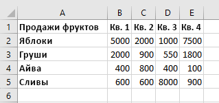
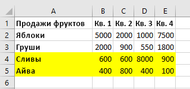
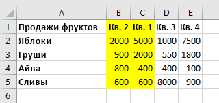

# <a name="work-with-worksheets-using-the-excel-javascript-api"></a>Работа с листами с использованием API JavaScript для Excel

В этой статье приведены примеры кода, в которых показано, как выполнять стандартные задачи для листов с использованием API JavaScript для Excel. Полный список свойств и методов, поддерживаемых объектами `Worksheet` и `WorksheetCollection`, см. в статьях [Объект Worksheet (API JavaScript для Excel)](/javascript/api/excel/excel.worksheet) и [Объект WorksheetCollection (API JavaScript для Excel)](/javascript/api/excel/excel.worksheetcollection).

> [!NOTE]
> Сведения в этой статье применимы только к обычным листам, а не к листам диаграмм или макросов.

## <a name="get-worksheets"></a>Получение листов

В примере кода ниже показано, как возвратить коллекцию листов, загрузить свойство `name` каждого листа и записать сообщение в консоль.

```js
Excel.run(function (context) {
    var sheets = context.workbook.worksheets;
    sheets.load("items/name");

    return context.sync()
        .then(function () {
            if (sheets.items.length > 1) {
                console.log(`There are ${sheets.items.length} worksheets in the workbook:`);
            } else {
                console.log(`There is one worksheet in the workbook:`);
            }
            sheets.items.forEach(function (sheet) {
              console.log(sheet.name);
            });
        });
}).catch(errorHandlerFunction);
```

> [!NOTE]
> Свойство `id` листа уникальным образом идентифицирует лист в конкретной книге, и его значение не изменяется даже при переименовании или перемещении листа. При удалении листа из книги в Excel для Mac `id` удаленного листа можно назначить новому листу (созданному после удаления).

## <a name="get-the-active-worksheet"></a>Получение активного листа

В примере кода ниже показано, как получить активный лист, загрузить его свойство `name` и записать сообщение в консоль.

```js
Excel.run(function (context) {
    var sheet = context.workbook.worksheets.getActiveWorksheet();
    sheet.load("name");

    return context.sync()
        .then(function () {
            console.log(`The active worksheet is "${sheet.name}"`);
        });
}).catch(errorHandlerFunction);
```

## <a name="set-the-active-worksheet"></a>Задание активного листа

В примере кода ниже показано, как задать лист **Sample** (Пример) в качестве активного, загрузить его свойство `name` и записать сообщение в консоль. Если нет листа с таким именем, метод `activate()` создаст ошибку `ItemNotFound`.

```js
Excel.run(function (context) {
    var sheet = context.workbook.worksheets.getItem("Sample");
    sheet.activate();
    sheet.load("name");

    return context.sync()
        .then(function () {
            console.log(`The active worksheet is "${sheet.name}"`);
        });
}).catch(errorHandlerFunction);
```

## <a name="reference-worksheets-by-relative-position"></a>Ссылка на листы по их относительным положениям

В примерах ниже показано, как ссылаться на лист по его относительному положению.

### <a name="get-the-first-worksheet"></a>Получение первого листа

В примере кода ниже показано, как получить первый лист в книге, загрузить его свойство `name` и записать сообщение в консоль.

```js
Excel.run(function (context) {
    var firstSheet = context.workbook.worksheets.getFirst();
    firstSheet.load("name");

    return context.sync()
        .then(function () {
            console.log(`The name of the first worksheet is "${firstSheet.name}"`);
        });
}).catch(errorHandlerFunction);
```

### <a name="get-the-last-worksheet"></a>Получение последнего листа

В примере кода ниже показано, как получить последний лист в книге, загрузить его свойство `name` и записать сообщение в консоль.

```js
Excel.run(function (context) {
    var lastSheet = context.workbook.worksheets.getLast();
    lastSheet.load("name");

    return context.sync()
        .then(function () {
            console.log(`The name of the last worksheet is "${lastSheet.name}"`);
        });
}).catch(errorHandlerFunction);
```

### <a name="get-the-next-worksheet"></a>Получение следующего листа

В примере кода ниже показано, как получить лист, следующий за активным листом, в книге, загрузить его свойство `name` и записать сообщение в консоль. Если нет листа после активного листа, метод `getNext()` создаст ошибку `ItemNotFound`.

```js
 Excel.run(function (context) {
    var currentSheet = context.workbook.worksheets.getActiveWorksheet();
    var nextSheet = currentSheet.getNext();
    nextSheet.load("name");

    return context.sync()
        .then(function () {
            console.log(`The name of the sheet that follows the active worksheet is "${nextSheet.name}"`);
        });
}).catch(errorHandlerFunction);
```

### <a name="get-the-previous-worksheet"></a>Получение предыдущего листа

В примере кода ниже показано, как получить лист, предшествующий активному листу, в книге, загрузить его свойство `name` и записать сообщение в консоль. Если нет листа перед активным листом, метод `getPrevious()` создаст ошибку `ItemNotFound`.

```js
Excel.run(function (context) {
    var currentSheet = context.workbook.worksheets.getActiveWorksheet();
    var previousSheet = currentSheet.getPrevious();
    previousSheet.load("name");

    return context.sync()
        .then(function () {
            console.log(`The name of the sheet that precedes the active worksheet is "${previousSheet.name}"`);
        });
}).catch(errorHandlerFunction);
```

## <a name="add-a-worksheet"></a>Добавление листа

В примере кода ниже показано, как добавить лист **Sample** (Пример) в рабочую книгу, загрузить его свойства `name` и `position` и записать сообщение в консоль. Новый лист будет следовать за всеми остальными.

```js
Excel.run(function (context) {
    var sheets = context.workbook.worksheets;

    var sheet = sheets.add("Sample");
    sheet.load("name, position");

    return context.sync()
        .then(function () {
            console.log(`Added worksheet named "${sheet.name}" in position ${sheet.position}`);
        });
}).catch(errorHandlerFunction);
```

### <a name="copy-an-existing-worksheet"></a>Копирование существующего листа

`Worksheet.copy` добавляет новый лист, являющийся копией существующего листа. Имя нового листа будет содержать номер в конце по аналогии с копированием листов в пользовательском интерфейсе Excel (например, **МойЛист (2)**). `Worksheet.copy` может принимать два необязательных параметра:

- `positionType` — перечисление [WorksheetPositionType](/javascript/api/excel/excel.worksheetpositiontype), указывающее, где в книге нужно добавить новый лист.
- `relativeTo` — если параметру `positionType` присвоено значение `Before` или `After`, требуется указать лист, относительно которого нужно добавить новый лист (этот параметр отвечает на вопрос "До или после чего?").

В примере кода ниже показано, как скопировать текущий лист и вставить новый лист непосредственно после текущего.

```js
Excel.run(function (context) {
    var myWorkbook = context.workbook;
    var sampleSheet = myWorkbook.worksheets.getActiveWorksheet();
    var copiedSheet = sampleSheet.copy(Excel.WorksheetPositionType.after, sampleSheet);
    return context.sync();
});
```

## <a name="delete-a-worksheet"></a>Удаление листа

В примере кода ниже показано, как удалить последний лист в книге (если это не единственный лист в книге) и записать сообщение в консоль.

```js
Excel.run(function (context) {
    var sheets = context.workbook.worksheets;
    sheets.load("items/name");

    return context.sync()
        .then(function () {
            if (sheets.items.length === 1) {
                console.log("Unable to delete the only worksheet in the workbook");
            } else {
                var lastSheet = sheets.items[sheets.items.length - 1];

                console.log(`Deleting worksheet named "${lastSheet.name}"`);
                lastSheet.delete();

                return context.sync();
            };
        });
}).catch(errorHandlerFunction);
```

> [!NOTE]
> Лист с уровнем скрытия "[надежно скрыт](/javascript/api/excel/excel.sheetvisibility)" невозможно удалить с помощью метода `delete`. Чтобы удалить лист, нужно сперва изменить его уровень скрытия.

## <a name="rename-a-worksheet"></a>Переименование листа

В примере ниже показано, как изменить имя активного листа на **New Name** (Новое имя).

```js
Excel.run(function (context) {
    var currentSheet = context.workbook.worksheets.getActiveWorksheet();
    currentSheet.name = "New Name";

    return context.sync();
}).catch(errorHandlerFunction);
```

## <a name="move-a-worksheet"></a>Перемещение листа

В примере ниже показано, как переместить лист из последней позиции в книге на первую.

```js
Excel.run(function (context) {
    var sheets = context.workbook.worksheets;
    sheets.load("items");

    return context.sync()
        .then(function () {
            var lastSheet = sheets.items[sheets.items.length - 1];
            lastSheet.position = 0;

            return context.sync();
        });
}).catch(errorHandlerFunction);
```

## <a name="set-worksheet-visibility"></a>Настройка видимости листа

В примерах ниже показано, как настроить видимость листа.

### <a name="hide-a-worksheet"></a>Скрытие листа

В примере кода ниже показано, как сделать лист **Sample** (Пример) скрытым, загрузить его свойство `name` и записать сообщение в консоль.

```js
Excel.run(function (context) {
    var sheet = context.workbook.worksheets.getItem("Sample");
    sheet.visibility = Excel.SheetVisibility.hidden;
    sheet.load("name");

    return context.sync()
        .then(function () {
            console.log(`Worksheet with name "${sheet.name}" is hidden`);
        });
}).catch(errorHandlerFunction);
```

### <a name="unhide-a-worksheet"></a>Отмена скрытия листа

В примере кода ниже показано, как сделать лист **Sample** (Пример) видимым, загрузить его свойство `name` и записать сообщение в консоль.

```js
Excel.run(function (context) {
    var sheet = context.workbook.worksheets.getItem("Sample");
    sheet.visibility = Excel.SheetVisibility.visible;
    sheet.load("name");

    return context.sync()
        .then(function () {
            console.log(`Worksheet with name "${sheet.name}" is visible`);
        });
}).catch(errorHandlerFunction);
```

## <a name="get-a-single-cell-within-a-worksheet"></a>Получение одной ячейки листа

В примере кода ниже показано, как получить ячейку, расположенную в строке 2 и столбце 5 листа **Sample** (Пример), загрузить его свойства `address` и `values` и записать сообщение в консоль. Значения, передаваемые в метод `getCell(row: number, column:number)`, представляют собой индексируемые с нуля номера строк и столбцов получаемой ячейки.

```js
Excel.run(function (context) {
    var sheet = context.workbook.worksheets.getItem("Sample");
    var cell = sheet.getCell(1, 4);
    cell.load("address, values");

    return context.sync()
        .then(function() {
            console.log(`The value of the cell in row 2, column 5 is "${cell.values[0][0]}" and the address of that cell is "${cell.address}"`);
        })
}).catch(errorHandlerFunction);
```

## <a name="detect-data-changes"></a>Обнаружение изменений данных

Возможно, надстройке потребуется реагировать на изменения пользователями данных в листе. Чтобы обнаружить эти изменения, можно [зарегистрировать обработчик событий](excel-add-ins-events.md#register-an-event-handler) для события `onChanged` листа. Обработчики события `onChanged` получают объект [WorksheetChangedEventArgs](/javascript/api/excel/excel.worksheetchangedeventargs) при возникновении события.

Объект `WorksheetChangedEventArgs` предоставляет сведения об изменениях и источнике. Так как событие `onChanged` возникает при изменении формата или значения данных, может быть полезно, чтобы надстройка проверяла, действительно ли значения изменились. Свойство `details` объединяет эти сведения в виде интерфейса [ChangedEventDetail](/javascript/api/excel/excel.changedeventdetail). В следующем примере кода показано, как отобразить значения и типы измененной ячейки до и после изменения.

```js
// This function would be used as an event handler for the Worksheet.onChanged event.
function onWorksheetChanged(eventArgs) {
    Excel.run(function (context) {
        var details = eventArgs.details;
        var address = eventArgs.address;

        // Print the before and after types and values to the console.
        console.log(`Change at ${address}: was ${details.valueBefore}(${details.valueTypeBefore}),`
            + ` now is ${details.valueAfter}(${details.valueTypeAfter})`);
        return context.sync();
    });
}
```

## <a name="detect-formula-changes"></a>Обнаружение изменений формулы

Надстройка может отслеживать изменения формул в таблице. Это полезно, если таблица подключена к внешней базе данных. Если формула изменяется в таблице, событие в этом сценарии вызывает соответствующие обновления во внешней базе данных.

Чтобы обнаружить изменения формул, [зарегистрируйте](excel-add-ins-events.md#register-an-event-handler) обработчителя событий для [события onFormulaChanged](/javascript/api/excel/excel.worksheet#onFormulaChanged) для таблицы. Обработчики событий `onFormulaChanged` для события получают объект [WorksheetFormulaChangedEventArgs](/javascript/api/excel/excel.worksheetformulachangedeventargs) при пожаре события.

> [!IMPORTANT]
> Событие определяет, когда изменяется сама формула, а не значение данных, которое приводит к вычислению `onFormulaChanged` формулы.

В следующем примере кода показано, как зарегистрировать обработник событий, использовать объект для получения массива formulaDetails измененной формулы, а затем распечатать сведения об измененной формуле с свойствами `onFormulaChanged` `WorksheetFormulaChangedEventArgs` [FormulaChangedEventDetail.](/javascript/api/excel/excel.formulachangedeventdetail) [](/javascript/api/excel/excel.worksheetformulachangedeventargs#formulaDetails)

> [!NOTE]
> Этот пример кода работает только при смене одной формулы.

```js
Excel.run(function (context) {
    // Retrieve the worksheet named "Sample".
    var sheet = context.workbook.worksheets.getItem("Sample");

    // Register the formula changed event handler for this worksheet.
    sheet.onFormulaChanged.add(formulaChangeHandler);

    return context.sync();
});

function formulaChangeHandler(event) {
    Excel.run(function (context) {
        // Retrieve details about the formula change event.
        // Note: This method assumes only a single formula is changed at a time. 
        var cellAddress = event.formulaDetails[0].cellAddress;
        var previousFormula = event.formulaDetails[0].previousFormula;
        var source = event.source;
    
        // Print out the change event details.
        console.log(
          `The formula in cell ${cellAddress} changed. 
          The previous formula was: ${previousFormula}. 
          The source of the change was: ${source}.`
        );         
    });
}
```

## <a name="handle-sorting-events"></a>Обработка событий сортировки

События `onColumnSorted` и `onRowSorted` указывают на сортировку любых данных на листе. Эти события связаны с индивидуальными объектами `Worksheet` и с `WorkbookCollection` книги. Они срабатывают при выполнении сортировки (программным образом или вручную с помощью пользовательского интерфейса Excel).

> [!NOTE]
> Событие `onColumnSorted` срабатывает при сортировке столбцов в результате операции сортировки слева направо. Событие `onRowSorted` срабатывает при сортировке строк в результате операции сортировки сверху вниз. Сортировка таблицы с помощью раскрывающегося меню в заголовке столбца приводит к срабатыванию события `onRowSorted`. Событие соответствует перемещаемым данным, а не критериям сортировки.

События `onColumnSorted` и `onRowSorted` реализуют функции обратного вызова соответственно с помощью объектов [WorksheetColumnSortedEventArgs](/javascript/api/excel/excel.worksheetcolumnsortedeventargs) и [WorksheetRowSortedEventArgs](/javascript/api/excel/excel.worksheetrowsortedeventargs). Эти объекты предоставляют более подробную информацию о событии. В частности, оба `EventArgs` обладают свойством `address`, которое представляет строки или столбцы, перемещенные в результате операции сортировки. Включаются все ячейки, содержимое которых было отсортировано, даже если значение ячейки не входит в состав критериев сортировки.

На приведенных ниже рисунках показаны диапазоны, возвращенные свойством `address` для событий сортировки. Вот образец данных до сортировки:



Если в **"Q1&quot;** выполняется сортировка сверху вниз (значения в **&quot;B"),** возвращаются следующие выделенные строки `WorksheetRowSortedEventArgs.address` .



Если выполняется сортировка слева направо на **"Quinces&quot;**(значения в **&quot;4")** на исходных данных, следующие столбцы с выделением возвращаются путем `WorksheetColumnsSortedEventArgs.address` .



В приведенном ниже примере кода показано, как зарегистрировать обработчик событий для события `Worksheet.onRowSorted`. Обратный вызов обработчика очищает цвет заливки для диапазона, затем применяет заливку к ячейкам перемещенных строк.

```js
Excel.run(function (context) {
    var sheet = context.workbook.worksheets.getActiveWorksheet();

    // This will fire whenever a row has been moved as the result of a sort action.
    sheet.onRowSorted.add(function (event) {
        return Excel.run(function (context) {
            console.log("Row sorted: " + event.address);
            var sheet = context.workbook.worksheets.getActiveWorksheet();

            // Clear formatting for section, then highlight the sorted area.
            sheet.getRange("A1:E5").format.fill.clear();
            if (event.address !== "") {
                sheet.getRanges(event.address).format.fill.color = "yellow";
            }

            return context.sync();
        });
    });

    return context.sync();
}).catch(errorHandlerFunction);
```

## <a name="find-all-cells-with-matching-text"></a>Поиск всех ячеек с соответствующим текстом

У объекта `Worksheet` есть метод `find` для поиска указанной строки в листе. Он возвращает объект `RangeAreas`, являющийся коллекцией объектов `Range`, которые можно отредактировать все сразу. Приведенный ниже пример кода находит все ячейки со значениями, соответствующими строке **Complete** (Завершено), и окрашивает их зеленым цветом. Обратите внимание, что метод `findAll` выдаст ошибку `ItemNotFound`, если указанной строки не существует в листе. Если ожидается, что указанная строка может отсутствовать в листе, используйте вместо этого метод [findAllOrNullObject](../develop/application-specific-api-model.md#ornullobject-methods-and-properties), чтобы ваш код корректно обработал этот сценарий.

```js
Excel.run(function (context) {
    var sheet = context.workbook.worksheets.getItem("Sample");
    var foundRanges = sheet.findAll("Complete", {
        completeMatch: true, // findAll will match the whole cell value
        matchCase: false // findAll will not match case
    });

    return context.sync()
        .then(function() {
            foundRanges.format.fill.color = "green"
    });
}).catch(errorHandlerFunction);
```

> [!NOTE]
> В этом разделе описано, как найти ячейки и диапазоны с помощью функций объекта `Worksheet`. Дополнительные сведения об извлечении диапазонов можно найти в статьях о конкретных объектах.
> - Примеры получения диапазона в пределах таблицы с помощью объекта см. в примере `Range` Get a range using the Excel [API JavaScript.](excel-add-ins-ranges-get.md)
> - Примеры, в которых показано, как получить диапазоны из объекта `Table`, см. в статье [Работа с таблицами с использованием API JavaScript для Excel](excel-add-ins-tables.md).
> - Примеры, в которых показано, как выполнять поиск большого диапазона для нескольких поддиапазонов с учетом характеристик ячеек, см. в статье [Работа с несколькими диапазонами одновременно в надстройках Excel](excel-add-ins-multiple-ranges.md).

## <a name="filter-data"></a>Фильтрация данных

Объект [AutoFilter](/javascript/api/excel/excel.autofilter) применяет фильтры данных в диапазоне на листе. Это создается с `Worksheet.autoFilter.apply` помощью следующих параметров.

- `range`: диапазон, к которому применяется фильтр, указанный в виде объекта `Range` или строки.
- `columnIndex`: отсчитываемый от нуля индекс столбца, по которому оценивается условие фильтра.
- `criteria`: объект [FilterCriteria](/javascript/api/excel/excel.filtercriteria), определяющий, какие строки следует фильтровать на основе ячейки столбца.

В первом примере кода показано, как добавить фильтр в используемый диапазон на листе. Этот фильтр скрывает записи, не входящие в верхние 25 %, на основе значений в столбце **3**.

```js
Excel.run(function (context) {
    var sheet = context.workbook.worksheets.getActiveWorksheet();
    var farmData = sheet.getUsedRange();

    // This filter will only show the rows with the top 25% of values in column 3.
    sheet.autoFilter.apply(farmData, 3, { criterion1: "25", filterOn: Excel.FilterOn.topPercent });
    return context.sync();
}).catch(errorHandlerFunction);
```

В следующем примере кода показано, как обновить автофильтр, используя метод `reapply`. Это следует выполнять при изменении данных в диапазоне.

```js
Excel.run(function (context) {
    var sheet = context.workbook.worksheets.getActiveWorksheet();
    sheet.autoFilter.reapply();
    return context.sync();
}).catch(errorHandlerFunction);
```

В последнем примере кода автофильтра показано, как удалить автофильтр с листа с помощью метода `remove`.

```js
Excel.run(function (context) {
    var sheet = context.workbook.worksheets.getActiveWorksheet();
    sheet.autoFilter.remove();
    return context.sync();
}).catch(errorHandlerFunction);
```

Объект `AutoFilter` также можно применять к отдельным таблицам. Дополнительные сведения см. в статье [Работа с таблицами с использованием API JavaScript для Excel](excel-add-ins-tables.md#autofilter).

## <a name="data-protection"></a>Защита данных

Надстройка может управлять возможностью пользователя по изменению данных на листе. Свойство `protection` листа является объектом [WorksheetProtection](/javascript/api/excel/excel.worksheetprotection) с методом `protect()`. В приведенном ниже примере показан основной сценарий переключения полной защиты активного листа.

```js
Excel.run(function (context) {
    var activeSheet = context.workbook.worksheets.getActiveWorksheet();
    activeSheet.load("protection/protected");

    return context.sync().then(function() {
        if (!activeSheet.protection.protected) {
            activeSheet.protection.protect();
        }
    })
}).catch(errorHandlerFunction);
```

Метод `protect` содержит два необязательных параметра:

- `options`: объект [WorksheetProtectionOptions](/javascript/api/excel/excel.worksheetprotectionoptions), определяющий конкретные ограничения на редактирование.
- `password`: строка, представляющая пароль, необходимый пользователю для обхода защиты и редактирования листа.

В статье [Защита листа](https://support.office.com/article/protect-a-worksheet-3179efdb-1285-4d49-a9c3-f4ca36276de6) содержатся дополнительные сведения о защите листа и ее изменении с помощью пользовательского интерфейса Excel.

## <a name="page-layout-and-print-settings"></a>Параметры разметки страницы и печати

Надстройкам доступны параметры разметки страницы на уровне листа. Они управляют печатью листа. У объекта `Worksheet` есть три связанных с разметкой свойства: `horizontalPageBreaks`, `verticalPageBreaks`, `pageLayout`.

`Worksheet.horizontalPageBreaks` и `Worksheet.verticalPageBreaks` относятся к [PageBreakCollections](/javascript/api/excel/excel.pagebreakcollection). Это коллекции объектов [PageBreak](/javascript/api/excel/excel.pagebreak), указывающих диапазоны вставки разрывов страниц, добавляемых вручную. В следующем примере кода добавляется горизонтальный разрыв страницы над строкой **21**.

```js
Excel.run(function (context) {
    var sheet = context.workbook.worksheets.getActiveWorksheet();
    sheet.horizontalPageBreaks.add("A21:E21"); // The page break is added above this range.
    return context.sync();
}).catch(errorHandlerFunction);
```

`Worksheet.pageLayout` является объектом [PageLayout](/javascript/api/excel/excel.pagelayout). Этот объект содержит параметры разметки и печати, не зависящие от применения конкретного принтера. Эти параметры включают поля, ориентацию, нумерацию страницы, строки заголовков и область печати.

В следующем примере кода страница выравнивается по центру (по вертикали и горизонтали), устанавливается строка заголовка, которая печатается в верхней части каждой страницы, и задается подраздел листа в качестве области печати.

```js
Excel.run(function (context) {
    var sheet = context.workbook.worksheets.getActiveWorksheet();

    // Center the page in both directions.
    sheet.pageLayout.centerHorizontally = true;
    sheet.pageLayout.centerVertically = true;

    // Set the first row as the title row for every page.
    sheet.pageLayout.setPrintTitleRows("$1:$1");

    // Limit the area to be printed to the range "A1:D100".
    sheet.pageLayout.setPrintArea("A1:D100");

    return context.sync();
}).catch(errorHandlerFunction);
```

## <a name="see-also"></a>См. также

- [Объектная модель JavaScript для Excel в надстройках Office](excel-add-ins-core-concepts.md)
