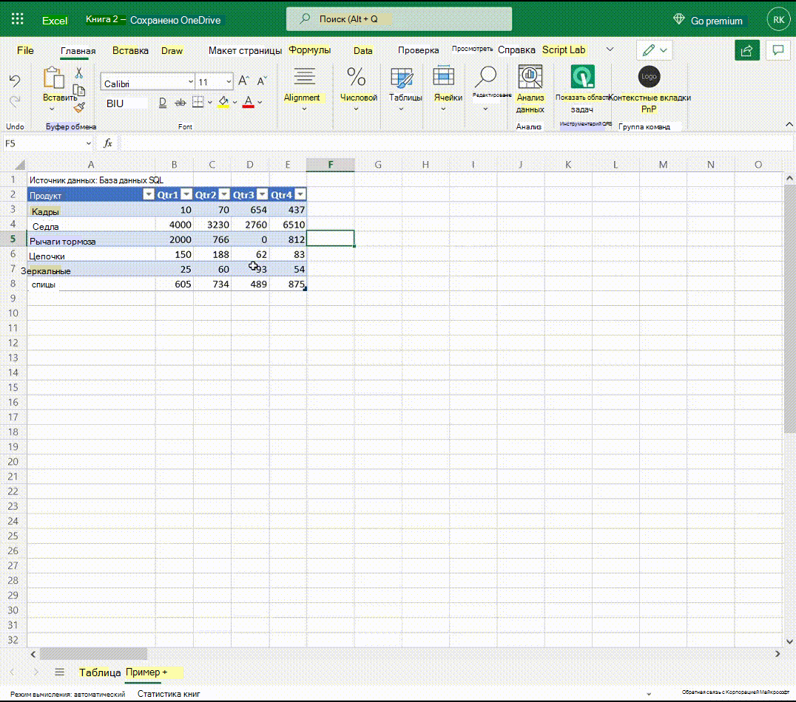

В следующей анимации показано, как события могут изменять видимость контекстных вкладок и изменять состояние включенных кнопок.

1. В начале фокус не на таблице.
1. На ленте щелкает ячейка таблицы, а на ленте появляется настраиваемая контекстная вкладка **Table Data** (в дополнение к встроенной контекстной вкладке **Table Design).**
1. Выбор **вкладки "Данные таблицы"** открывает ее. Отключены две кнопки на вкладке.
1. Изменение данных в ячейке позволяет использовать две кнопки.
1. Нажатие одной из кнопок снова отключает две кнопки.
1. Щелкнув ячейку за пределами таблицы, удаляет фокус из таблицы, а две контекстные вкладки удаляются из ленты.

