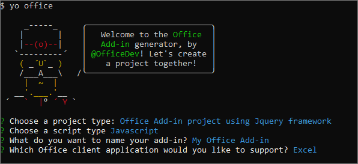
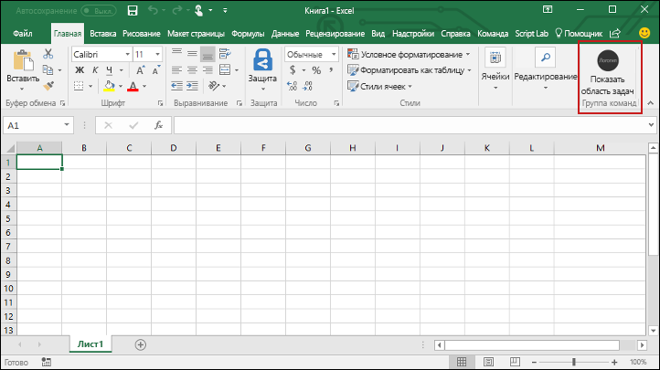

# <a name="build-an-excel-add-in-using-jquery"></a><span data-ttu-id="2d837-101">Создание надстройки Excel с помощью jQuery</span><span class="sxs-lookup"><span data-stu-id="2d837-101">Build an Excel add-in using jQuery</span></span>

<span data-ttu-id="2d837-102">В этой статье мы разберем, как создать надстройку Excel, используя jQuery и API JavaScript для Excel.</span><span class="sxs-lookup"><span data-stu-id="2d837-102">In this article, you'll walk through the process of building an Excel add-in by using jQuery and the Excel JavaScript API.</span></span> 

## <a name="create-the-add-in"></a><span data-ttu-id="2d837-103">Создание надстройки</span><span class="sxs-lookup"><span data-stu-id="2d837-103">Create the add-in</span></span> 

[!include[Choose your editor](../includes/quickstart-choose-editor.md)]

# <a name="visual-studiotabvisual-studio"></a>[<span data-ttu-id="2d837-104">Visual Studio</span><span class="sxs-lookup"><span data-stu-id="2d837-104">Visual Studio</span></span>](#tab/visual-studio)

### <a name="prerequisites"></a><span data-ttu-id="2d837-105">Необходимые компоненты</span><span class="sxs-lookup"><span data-stu-id="2d837-105">Prerequisites</span></span>

[!include[Quick Start prerequisites](../includes/quickstart-vs-prerequisites.md)]

### <a name="create-the-add-in-project"></a><span data-ttu-id="2d837-106">Создание проекта надстройки</span><span class="sxs-lookup"><span data-stu-id="2d837-106">Create the add-in project</span></span>

1. <span data-ttu-id="2d837-107">В строке меню Visual Studio выберите **Файл** > **Создать** > **Проект**.</span><span class="sxs-lookup"><span data-stu-id="2d837-107">On the Visual Studio menu bar, choose  **File** > **New** > **Project**.</span></span>
    
2. <span data-ttu-id="2d837-108">В списке типов проекта разверните узел **Visual C#** или **Visual Basic**, разверните **Office/SharePoint**, затем выберите **Надстройки** > **Веб-надстройка Excel** в качестве типа проекта.</span><span class="sxs-lookup"><span data-stu-id="2d837-108">In the list of project types under **Visual C#** or **Visual Basic**, expand  **Office/SharePoint**, choose **Add-ins**, and then choose **Excel Web Add-in** as the project type.</span></span> 

3. <span data-ttu-id="2d837-109">Укажите имя проекта и нажмите кнопку **ОК**.</span><span class="sxs-lookup"><span data-stu-id="2d837-109">Name the project, and then choose **OK**.</span></span>

4. <span data-ttu-id="2d837-110">В диалоговом окне **Создание надстройки Office** выберите **Добавить новые функции в Excel**, а затем нажмите кнопку **Готово**, чтобы создать проект.</span><span class="sxs-lookup"><span data-stu-id="2d837-110">In the **Create Office Add-in** dialog window, choose **Add new functionalities to Excel**, and then choose **Finish** to create the project.</span></span>

5. <span data-ttu-id="2d837-p101">Visual Studio создаст решение, и в **обозревателе решений** появятся два соответствующих проекта. В Visual Studio откроется файл **Home.html**.</span><span class="sxs-lookup"><span data-stu-id="2d837-p101">Visual Studio creates a solution and its two projects appear in **Solution Explorer**. The **Home.html** file opens in Visual Studio.</span></span>
    
### <a name="explore-the-visual-studio-solution"></a><span data-ttu-id="2d837-113">Обзор решения Visual Studio</span><span class="sxs-lookup"><span data-stu-id="2d837-113">Explore the Visual Studio solution</span></span>

[!include[Description of Visual Studio projects](../includes/quickstart-vs-solution.md)]

### <a name="update-the-code"></a><span data-ttu-id="2d837-114">Обновление кода</span><span class="sxs-lookup"><span data-stu-id="2d837-114">Update the code</span></span>

1. <span data-ttu-id="2d837-p102">Файл **Home.html** содержит HTML-содержимое, которое будет отображаться в области задач надстройки. В файле **Home.html** замените элемент `<body>` на приведенную ниже часть кода и сохраните файл.</span><span class="sxs-lookup"><span data-stu-id="2d837-p102">**Home.html** specifies the HTML that will be rendered in the add-in's task pane. In **Home.html**, replace the `<body>` element with the following markup and save the file.</span></span>
 
    ```html
    <body class="ms-font-m ms-welcome">
        <div id="content-header">
            <div class="padding">
                <h1>Welcome</h1>
            </div>
        </div>
        <div id="content-main">
            <div class="padding">
                <p>Choose the button below to set the color of the selected range to green.</p>
                <br />
                <h3>Try it out</h3>
                <button class="ms-Button" id="set-color">Set color</button>
            </div>
        </div>
    </body>
    ```

2. <span data-ttu-id="2d837-p103">Откройте файл **Home.js** в корневой папке проекта веб-приложения. Этот файл содержит скрипт надстройки. Замените все его содержимое указанным ниже кодом и сохраните файл.</span><span class="sxs-lookup"><span data-stu-id="2d837-p103">Open the file **Home.js** in the root of the web application project. This file specifies the script for the add-in. Replace the entire contents with the following code and save the file.</span></span> 

    ```js
    'use strict';

    (function () {
        Office.initialize = function (reason) {
            $(document).ready(function () {
                $('#set-color').click(setColor);
            });
        };

        function setColor() {
            Excel.run(function (context) {
                var range = context.workbook.getSelectedRange();
                range.format.fill.color = 'green';

                return context.sync();
            }).catch(function (error) {
                console.log("Error: " + error);
                if (error instanceof OfficeExtension.Error) {
                    console.log("Debug info: " + JSON.stringify(error.debugInfo));
                }
            });
        }
    })();
    ```

3. <span data-ttu-id="2d837-p104">Откройте файл **Home.css** в корневой папке проекта веб-приложения. Этот файл определяет специальные стили надстройки. Замените все его содержимое указанным ниже кодом и сохраните файл.</span><span class="sxs-lookup"><span data-stu-id="2d837-p104">Open the file **Home.css** in the root of the web application project. This file specifies the custom styles for the add-in. Replace the entire contents with the following code and save the file.</span></span> 

    ```css
    #content-header {
        background: #2a8dd4;
        color: #fff;
        position: absolute;
        top: 0;
        left: 0;
        width: 100%;
        height: 80px; 
        overflow: hidden;
    }

    #content-main {
        background: #fff;
        position: fixed;
        top: 80px;
        left: 0;
        right: 0;
        bottom: 0;
        overflow: auto; 
    }

    .padding {
        padding: 15px;
    }
    ```

### <a name="update-the-manifest"></a><span data-ttu-id="2d837-123">Обновление манифеста</span><span class="sxs-lookup"><span data-stu-id="2d837-123">Update the manifest</span></span>

1. <span data-ttu-id="2d837-p105">Откройте XML-файл манифеста в проекте надстройки. Этот файл определяет параметры и возможности надстройки.</span><span class="sxs-lookup"><span data-stu-id="2d837-p105">Open the XML manifest file in the add-in project. This file defines the add-in's settings and capabilities.</span></span>

2. <span data-ttu-id="2d837-p106">Элемент `ProviderName` содержит значение заполнителя. Замените его на свое имя.</span><span class="sxs-lookup"><span data-stu-id="2d837-p106">The `ProviderName` element has a placeholder value. Replace it with your name.</span></span>

3. <span data-ttu-id="2d837-p107">Атрибут `DefaultValue` элемента `DisplayName` содержит заполнитель. Замените его на строку **Моя надстройка Office**.</span><span class="sxs-lookup"><span data-stu-id="2d837-p107">The `DefaultValue` attribute of the `DisplayName` element has a placeholder. Replace it with **My Office Add-in**.</span></span>

4. <span data-ttu-id="2d837-p108">Атрибут `DefaultValue` элемента `Description` содержит заполнитель. Замените его на строку **Надстройка области задач для Excel**.</span><span class="sxs-lookup"><span data-stu-id="2d837-p108">The `DefaultValue` attribute of the `Description` element has a placeholder. Replace it with **A task pane add-in for Excel**.</span></span>

5. <span data-ttu-id="2d837-132">Сохраните файл.</span><span class="sxs-lookup"><span data-stu-id="2d837-132">Save the file.</span></span>

    ```xml
    ...
    <ProviderName>John Doe</ProviderName>
    <DefaultLocale>en-US</DefaultLocale>
    <!-- The display name of your add-in. Used on the store and various places of the Office UI such as the add-ins dialog. -->
    <DisplayName DefaultValue="My Office Add-in" />
    <Description DefaultValue="A task pane add-in for Excel"/>
    ...
    ```

### <a name="try-it-out"></a><span data-ttu-id="2d837-133">Проверка</span><span class="sxs-lookup"><span data-stu-id="2d837-133">Try it out</span></span>

1. <span data-ttu-id="2d837-p109">Протестируйте новую надстройку Excel в Visual Studio, нажав клавишу F5 или кнопку **Запустить**, чтобы запустить Excel с кнопкой надстройки **Показать область задач** на ленте. Надстройка будет размещена на локальном сервере IIS.</span><span class="sxs-lookup"><span data-stu-id="2d837-p109">Using Visual Studio, test the newly created Excel add-in by pressing F5 or choosing the **Start** button to launch Excel with the **Show Taskpane** add-in button displayed in the ribbon. The add-in will be hosted locally on IIS.</span></span>

2. <span data-ttu-id="2d837-136">В Excel перейдите на вкладку **Главная** и нажмите кнопку **Показать область задач** на ленте, чтобы открыть область задач надстройки.</span><span class="sxs-lookup"><span data-stu-id="2d837-136">In Excel, choose the **Home** tab, and then choose the **Show Taskpane** button in the ribbon to open the add-in task pane.</span></span>

    

3. <span data-ttu-id="2d837-138">Выберите любой диапазон ячеек на листе.</span><span class="sxs-lookup"><span data-stu-id="2d837-138">Select any range of cells in the worksheet.</span></span>

4. <span data-ttu-id="2d837-139">В области задач нажмите кнопку **Задать цвет**, чтобы сделать выбранный диапазон зеленым.</span><span class="sxs-lookup"><span data-stu-id="2d837-139">In the task pane, choose the **Set color** button to set the color of the selected range to green.</span></span>

    

# <a name="any-editortabvisual-studio-code"></a>[<span data-ttu-id="2d837-141">Любой редактор</span><span class="sxs-lookup"><span data-stu-id="2d837-141">Any editor</span></span>](#tab/visual-studio-code)

### <a name="prerequisites"></a><span data-ttu-id="2d837-142">Необходимые компоненты</span><span class="sxs-lookup"><span data-stu-id="2d837-142">Prerequisites</span></span>

- [<span data-ttu-id="2d837-143">Node.js</span><span class="sxs-lookup"><span data-stu-id="2d837-143">Node.js</span></span>](https://nodejs.org)

- <span data-ttu-id="2d837-144">Глобально установите последнюю версию [Yeoman](https://github.com/yeoman/yo) и [генератора Yeoman для надстроек Office](https://github.com/OfficeDev/generator-office).</span><span class="sxs-lookup"><span data-stu-id="2d837-144">Install the latest version of [Yeoman](https://github.com/yeoman/yo) and the [Yeoman generator for Office Add-ins](https://github.com/OfficeDev/generator-office) globally.</span></span>
    ```bash
    npm install -g yo generator-office
    ```

### <a name="create-the-web-app"></a><span data-ttu-id="2d837-145">Создание веб-приложения</span><span class="sxs-lookup"><span data-stu-id="2d837-145">Create the web app</span></span>

1. <span data-ttu-id="2d837-p110">Создайте на локальном диске папку и назовите ее **my-addin**. В ней вы будете создавать файлы для приложения.</span><span class="sxs-lookup"><span data-stu-id="2d837-p110">Create a folder on your local drive and name it **my-addin**. This is where you'll create the files for your app.</span></span>

2. <span data-ttu-id="2d837-148">Перейдите к папке приложения.</span><span class="sxs-lookup"><span data-stu-id="2d837-148">Navigate to your app folder.</span></span>

    ```bash
    cd my-addin
    ```

3. <span data-ttu-id="2d837-p111">С помощью генератора Yeoman создайте файл манифеста для надстройки. Выполните приведенную ниже команду и ответьте на вопросы, как показано на следующем снимке экрана.</span><span class="sxs-lookup"><span data-stu-id="2d837-p111">Use the Yeoman generator to generate the manifest file for your add-in. Run the following command and then answer the prompts as shown in the following screenshot:</span></span>

    ```bash
    yo office
    ```

    - <span data-ttu-id="2d837-151">**Выберите тип проекта:** `Office Add-in project using Jquery framework`</span><span class="sxs-lookup"><span data-stu-id="2d837-151">**Choose a project type:** `Office Add-in project using Jquery framework`</span></span>
    - <span data-ttu-id="2d837-152">**Выберите тип сценария:** `Javascript`</span><span class="sxs-lookup"><span data-stu-id="2d837-152">**Choose a script type:** `Javascript`</span></span>
    - <span data-ttu-id="2d837-153">**Как вы хотите назвать надстройку?:** `My Office Add-in`</span><span class="sxs-lookup"><span data-stu-id="2d837-153">**What do you want to name your add-in?:** `My Office Add-in`</span></span>
    - <span data-ttu-id="2d837-154">**Какое клиентское приложение Office должно поддерживаться?:** `Excel`</span><span class="sxs-lookup"><span data-stu-id="2d837-154">**Which Office client application would you like to support?:** `Excel`</span></span>

    
    
    <span data-ttu-id="2d837-156">После завершения работы мастера генератор создаст проект и установит поддерживающие компоненты узла.</span><span class="sxs-lookup"><span data-stu-id="2d837-156">After you complete the wizard, the generator will create the project and install supporting Node components.</span></span>

4. <span data-ttu-id="2d837-157">Перейдите в корневую папку проекта веб-приложения.</span><span class="sxs-lookup"><span data-stu-id="2d837-157">Navigate to the root folder of the web application project.</span></span>

    ```bash
    cd "My Office Add-in"
    ```

5. <span data-ttu-id="2d837-p112">В редакторе кода откройте **index.html** в корневой папке проекта. Этот файл содержит HTML-содержимое, которое будет отображаться в области задач надстройки.</span><span class="sxs-lookup"><span data-stu-id="2d837-p112">In your code editor, open **index.html** in the root of the project. This file specifies the HTML that will be rendered in the add-in's task pane.</span></span> 
 
6. <span data-ttu-id="2d837-160">Замените созданный тег `header` в файле **index.html** приведенной ниже разметкой.</span><span class="sxs-lookup"><span data-stu-id="2d837-160">Within **index.html**, replace the generated `header` tag with the following markup.</span></span>
 
    ```html
    <div id="content-header">
        <div class="padding">
            <h1>Welcome</h1>
        </div>
    </div>
    ```

7. <span data-ttu-id="2d837-161">Замените созданный тег `main` в файле **index.html** приведенной ниже разметкой и сохраните файл.</span><span class="sxs-lookup"><span data-stu-id="2d837-161">Within **index.html**, replace the generated `main` tag with the following markup, and save the file.</span></span>

    ```html
    <div id="content-main">
        <div class="padding">
            <p>Choose the button below to set the color of the selected range to green.</p>
            <br />
            <h3>Try it out</h3>
            <button class="ms-Button" id="set-color">Set color</button>
        </div>
    </div>
    ```

8. <span data-ttu-id="2d837-p113">Откройте файл **src\index.js** для указания скрипта надстройки. Замените все содержимое следующим кодом и сохраните файл.</span><span class="sxs-lookup"><span data-stu-id="2d837-p113">Open the file **src\index.js** to specify the script for the add-in. Replace the entire contents with the following code and save the file.</span></span>

    ```js
    'use strict';
    
    (function () {
        Office.initialize = function (reason) {
            $(document).ready(function () {
                $('#set-color').click(setColor);
            });
        };

        function setColor() {
            Excel.run(function (context) {
                var range = context.workbook.getSelectedRange();
                range.format.fill.color = 'green';

                return context.sync();
            }).catch(function (error) {
                console.log("Error: " + error);
                if (error instanceof OfficeExtension.Error) {
                    console.log("Debug info: " + JSON.stringify(error.debugInfo));
                }
            });
        }
    })();
    ```

9. <span data-ttu-id="2d837-p114">Откройте файл **app.css**, чтобы указать собственные стили для надстройки. Замените все его содержимое указанным ниже кодом и сохраните файл.</span><span class="sxs-lookup"><span data-stu-id="2d837-p114">Open the file **app.css** to specify the custom styles for the add-in. Replace the entire contents with the following code and save the file.</span></span>

    ```css
    #content-header {
        background: #2a8dd4;
        color: #fff;
        position: absolute;
        top: 0;
        left: 0;
        width: 100%;
        height: 80px; 
        overflow: hidden;
    }

    #content-main {
        background: #fff;
        position: fixed;
        top: 80px;
        left: 0;
        right: 0;
        bottom: 0;
        overflow: auto; 
    }

    .padding {
        padding: 15px;
    }
    ```

### <a name="update-the-manifest"></a><span data-ttu-id="2d837-166">Обновление манифеста</span><span class="sxs-lookup"><span data-stu-id="2d837-166">Update the manifest</span></span>

1. <span data-ttu-id="2d837-167">Откройте файл **my-office-add-in-manifest.xml**, чтобы определить параметры и возможности надстройки.</span><span class="sxs-lookup"><span data-stu-id="2d837-167">Open the file **my-office-add-in-manifest.xml** to define the add-in's settings and capabilities.</span></span> 

2. <span data-ttu-id="2d837-p115">Элемент `ProviderName` содержит значение заполнителя. Замените его на свое имя.</span><span class="sxs-lookup"><span data-stu-id="2d837-p115">The `ProviderName` element has a placeholder value. Replace it with your name.</span></span>

3. <span data-ttu-id="2d837-p116">Атрибут `DefaultValue` элемента `DisplayName` содержит заполнитель. Замените его на строку **Моя надстройка Office**.</span><span class="sxs-lookup"><span data-stu-id="2d837-p116">The `DefaultValue` attribute of the `DisplayName` element has a placeholder. Replace it with **My Office Add-in**.</span></span>

4. <span data-ttu-id="2d837-p117">Атрибут `DefaultValue` элемента `Description` содержит заполнитель. Замените его на строку **Надстройка области задач для Excel**.</span><span class="sxs-lookup"><span data-stu-id="2d837-p117">The `DefaultValue` attribute of the `Description` element has a placeholder. Replace it with **A task pane add-in for Excel**.</span></span>

5. <span data-ttu-id="2d837-174">Сохраните файл.</span><span class="sxs-lookup"><span data-stu-id="2d837-174">Save the file.</span></span>

    ```xml
    ...
    <ProviderName>John Doe</ProviderName>
    <DefaultLocale>en-US</DefaultLocale>
    <!-- The display name of your add-in. Used on the store and various places of the Office UI such as the add-ins dialog. -->
    <DisplayName DefaultValue="My Office Add-in" />
    <Description DefaultValue="A task pane add-in for Excel"/>
    ...
    ```

### <a name="start-the-dev-server"></a><span data-ttu-id="2d837-175">Запуск сервера разработки</span><span class="sxs-lookup"><span data-stu-id="2d837-175">Start the dev server</span></span>

[!include[Start server section](../includes/quickstart-yo-start-server.md)] 

### <a name="try-it-out"></a><span data-ttu-id="2d837-176">Проверка</span><span class="sxs-lookup"><span data-stu-id="2d837-176">Try it out</span></span>

1. <span data-ttu-id="2d837-177">Следуя указаниям для нужной платформы, загрузите неопубликованную надстройку в Excel.</span><span class="sxs-lookup"><span data-stu-id="2d837-177">Follow the instructions for the platform you'll use to run your add-in to sideload the add-in within Excel.</span></span>

    - <span data-ttu-id="2d837-178">Windows: [ загрузка неопубликованных надстроек Office в Windows](../testing/create-a-network-shared-folder-catalog-for-task-pane-and-content-add-ins.md)</span><span class="sxs-lookup"><span data-stu-id="2d837-178">Windows: [Sideload Office Add-ins on Windows](../testing/create-a-network-shared-folder-catalog-for-task-pane-and-content-add-ins.md)</span></span>
    - <span data-ttu-id="2d837-179">Excel Online: [загрузка неопубликованных надстроек Office в Office Online](../testing/sideload-office-add-ins-for-testing.md#sideload-an-office-add-in-on-office-online)</span><span class="sxs-lookup"><span data-stu-id="2d837-179">Excel Online: [Sideload Office Add-ins in Office Online](../testing/sideload-office-add-ins-for-testing.md#sideload-an-office-add-in-on-office-online)</span></span>
    - <span data-ttu-id="2d837-180">iPad и Mac: [загрузка неопубликованных надстроек Office на iPad и Mac](../testing/sideload-an-office-add-in-on-ipad-and-mac.md)</span><span class="sxs-lookup"><span data-stu-id="2d837-180">iPad and Mac: [Sideload Office Add-ins on iPad and Mac](../testing/sideload-an-office-add-in-on-ipad-and-mac.md)</span></span>

2. <span data-ttu-id="2d837-181">В Excel перейдите на вкладку **Главная** и нажмите кнопку **Показать область задач** на ленте, чтобы открыть область задач надстройки.</span><span class="sxs-lookup"><span data-stu-id="2d837-181">In Excel, choose the **Home** tab, and then choose the **Show Taskpane** button in the ribbon to open the add-in task pane.</span></span>

    

3. <span data-ttu-id="2d837-183">Выберите любой диапазон ячеек на листе.</span><span class="sxs-lookup"><span data-stu-id="2d837-183">Select any range of cells in the worksheet.</span></span>

4. <span data-ttu-id="2d837-184">В области задач нажмите кнопку **Задать цвет**, чтобы сделать выбранный диапазон зеленым.</span><span class="sxs-lookup"><span data-stu-id="2d837-184">In the task pane, choose the **Set color** button to set the color of the selected range to green.</span></span>

    

---

## <a name="next-steps"></a><span data-ttu-id="2d837-186">Дальнейшие действия</span><span class="sxs-lookup"><span data-stu-id="2d837-186">Next steps</span></span>

<span data-ttu-id="2d837-p118">Поздравляем, вы успешно создали надстройку Excel с помощью jQuery! Чтобы узнать больше о возможностях надстроек Excel и создать более сложную надстройку, воспользуйтесь руководством по надстройкам Excel.</span><span class="sxs-lookup"><span data-stu-id="2d837-p118">Congratulations, you've successfully created an Excel add-in using jQuery! Next, learn more about the capabilities of an Excel add-in and build a more complex add-in by following along with the Excel add-in tutorial.</span></span>

> [!div class="nextstepaction"]
> [<span data-ttu-id="2d837-189">Руководство по надстройкам Excel</span><span class="sxs-lookup"><span data-stu-id="2d837-189">Excel add-in tutorial</span></span>](../tutorials/excel-tutorial.yml)

## <a name="see-also"></a><span data-ttu-id="2d837-190">См. также</span><span class="sxs-lookup"><span data-stu-id="2d837-190">See also</span></span>

* [<span data-ttu-id="2d837-191">Руководство по надстройкам Excel</span><span class="sxs-lookup"><span data-stu-id="2d837-191">Excel add-in tutorial</span></span>](../tutorials/excel-tutorial-create-table.md)
* [<span data-ttu-id="2d837-192">Основные принципы программирования с помощью API JavaScript для Excel</span><span class="sxs-lookup"><span data-stu-id="2d837-192">Fundamental programming concepts with the Excel JavaScript API</span></span>](../excel/excel-add-ins-core-concepts.md)
* [<span data-ttu-id="2d837-193">Примеры кода надстроек Excel</span><span class="sxs-lookup"><span data-stu-id="2d837-193">Excel add-in code samples</span></span>](https://developer.microsoft.com/office/gallery/?filterBy=Samples,Excel)
* [<span data-ttu-id="2d837-194">Справочник по API JavaScript для Excel</span><span class="sxs-lookup"><span data-stu-id="2d837-194">Excel JavaScript API reference</span></span>](https://docs.microsoft.com/office/dev/add-ins/reference/overview/excel-add-ins-reference-overview?view=office-js)
