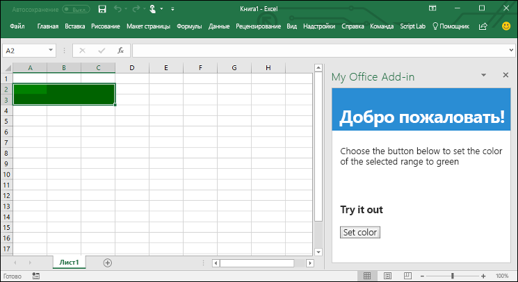

# <a name="build-an-excel-add-in-using-jquery"></a>???????? ?????????? Excel ? ??????? jQuery

? ???? ?????? ?? ????????, ??? ??????? ?????????? Excel, ????????? jQuery ? API JavaScript ??? Excel. 

## <a name="create-the-add-in"></a>???????? ?????????? 

[!include[Choose your editor](../includes/quickstart-choose-editor.md)]

# <a name="visual-studiotabvisual-studio"></a>[Visual Studio](#tab/visual-studio)

### <a name="prerequisites"></a>??????????? ??????????

[!include[Quick Start prerequisites](../includes/quickstart-vs-prerequisites.md)]

### <a name="create-the-add-in-project"></a>???????? ??????? ??????????

1. ? ?????? ???? Visual Studio ???????? **????** > **???????** > **??????**.
    
2. ? ?????? ????? ??????? ?????????? ???? **Visual C#** ??? **Visual Basic**, ?????????? **Office/SharePoint**, ????? ???????? **??????????** > **???-?????????? Excel**. 

3. ??????? ??? ??????? ? ??????? ?????? **??**.

4. ? ?????????? ???? **???????? ?????????? Office** ???????? **???????? ????? ??????? ? Excel**, ? ????? ??????? ?????? **??????**, ????? ??????? ??????.

5. Visual Studio ??????? ???????, ? ? **???????????? ???????** ???????? ??? ??????????????? ???????. ? Visual Studio ????????? ???? **Home.html**.
    
### <a name="explore-the-visual-studio-solution"></a>????? ??????? Visual Studio

[!include[Description of Visual Studio projects](../includes/quickstart-vs-solution.md)]

### <a name="update-the-code"></a>?????????? ????

1. ???? **Home.html** ???????? HTML-???????, ??????? ????? ???????????? ? ??????? ????? ??????????. ? ????? **Home.html** ???????? ??????? `<body>` ?? ??????????? ???? ????? ???? ? ????????? ????.
 
    ```html
    <body class="ms-font-m ms-welcome">
        <div id="content-header">
            <div class="padding">
                <h1>Welcome</h1>
            </div>
        </div>
        <div id="content-main">
            <div class="padding">
                <p>Choose the button below to set the color of the selected range to green.</p>
                <br />
                <h3>Try it out</h3>
                <button class="ms-Button" id="set-color">Set color</button>
            </div>
        </div>
    </body>
    ```

2. ???????? ???? **Home.js** ? ???????? ????? ??????? ???-??????????. ???? ???? ???????? ?????? ??????????. ???????? ??? ??? ?????????? ????????? ???? ????? ? ????????? ????. 

    ```js
    'use strict';

    (function () {
        Office.initialize = function (reason) {
            $(document).ready(function () {
                $('#set-color').click(setColor);
            });
        };

        function setColor() {
            Excel.run(function (context) {
                var range = context.workbook.getSelectedRange();
                range.format.fill.color = 'green';

                return context.sync();
            }).catch(function (error) {
                console.log("Error: " + error);
                if (error instanceof OfficeExtension.Error) {
                    console.log("Debug info: " + JSON.stringify(error.debugInfo));
                }
            });
        }
    })();
    ```

3. ???????? ???? **Home.css** ? ???????? ????? ??????? ???-??????????. ???? ???? ?????????? ??????????? ????? ??????????. ???????? ??? ??? ?????????? ????????? ???? ????? ? ????????? ????. 

    ```css
    #content-header {
        background: #2a8dd4;
        color: #fff;
        position: absolute;
        top: 0;
        left: 0;
        width: 100%;
        height: 80px; 
        overflow: hidden;
    }

    #content-main {
        background: #fff;
        position: fixed;
        top: 80px;
        left: 0;
        right: 0;
        bottom: 0;
        overflow: auto; 
    }

    .padding {
        padding: 15px;
    }
    ```

### <a name="update-the-manifest"></a>?????????? ?????????

1. ???????? XML-???? ????????? ? ??????? ??????????. ???? ???? ?????????? ????????? ? ??????????? ??????????.

2. ??????? `ProviderName` ???????? ???????????. ???????? ??? ?? ???? ???.

3. ??????? `DefaultValue` ???????? `DisplayName` ???????? ???????????. ???????? ??? ?? ?????? **??? ?????????? Office**.

4. ??????? `DefaultValue` ???????? `Description` ???????? ???????????. ???????? ??? ??????? **?????????? ??????? ????? ??? Excel**.

5. ????????? ????.

    ```xml
    ...
    <ProviderName>John Doe</ProviderName>
    <DefaultLocale>en-US</DefaultLocale>
    <!-- The display name of your add-in. Used on the store and various places of the Office UI such as the add-ins dialog. -->
    <DisplayName DefaultValue="My Office Add-in" />
    <Description DefaultValue="A task pane add-in for Excel"/>
    ...
    ```

### <a name="try-it-out"></a>????????

1. ????????????? ????? ?????????? Excel ? Visual Studio, ????? ??????? F5 ??? ?????? **?????????**, ????? ????????? Excel ? ??????? ?????????? **Show Taskpane** (???????? ??????? ?????) ?? ?????. ?????????? ????? ????????? ?? ????????? ??????? IIS.

2. ? Excel ???????? ??????? **???????** ? ??????? ?????? **???????? ??????? ?????** ?? ?????, ????? ??????? ??????? ????? ??????????.

    

3. ???????? ????? ???????? ????? ?? ?????.

4. ? ??????? ????? ??????? ?????? **Set color** (?????? ????), ????? ??????? ????????? ???????? ???????.

    

# <a name="any-editortabvisual-studio-code"></a>[????? ????????](#tab/visual-studio-code)

### <a name="prerequisites"></a>??????????? ??????????

- [Node.js](https://nodejs.org)

- ????????? ?????????? ????????? ?????? [Yeoman](https://github.com/yeoman/yo) ? [????????? Yeoman ??? ????????? Office](https://github.com/OfficeDev/generator-office).

    ```bash
    npm install -g yo generator-office
    ```

### <a name="create-the-web-app"></a>???????? ???-??????????

1. ???????? ?? ????????? ????? ????? ? ???????? ?? **my-addin**. ? ??? ?? ?????? ????????? ????? ??? ??????????.

2. ????????? ? ????? ??????????.

    ```bash
    cd my-addin
    ```

3. ? ??????? ?????????? Yeoman ???????? ???? ????????? ??? ??????????. ????????? ??????????? ???? ??????? ? ???????? ?? ???????, ??? ???????? ?? ????????? ?????? ??????:

    ```bash
    yo office
    ```

    - ****Would you like to create a new subfolder for your project?:** `No` (??????? ????? ????????? ????? ??? ????????)** `No`
    - **??? ?? ?????? ??????? ???????????:** `My Office Add-in`
    - **????? ?????????? ?????????? Office ?????? ???????????????:** `Excel`
    - **?? ?????? ??????? ????? ???????????:** `Yes`
    - **?? ?????? ???????????? TypeScript?:** `No`
    - **???????? ?????????:** `Jquery`

    ????? ????????? ????????? ??? ??????? ???? **resource.html**. ? ????? ?????? ????????? ??? ?? ???????????, ?? ?????? ?????????, ???? ??? ?????????! ???????? Yes (??) ??? No (???), ????? ????????? ?????? ???????, ? ?????????, ???? ????????? ???????? ??????.

    


4. ? ????????? ???? ???????? ???? **index.html** ?? ???????? ????? ???????. ???? ???? ???????? HTML-???????, ??????? ????? ???????????? ? ??????? ????? ??????????. 
 
5. ???????? ????????? ??? `header` ? ????? **index.html** ??????????? ???? ?????????.
 
    ```html
    <div id="content-header">
        <div class="padding">
            <h1>Welcome</h1>
        </div>
    </div>
    ```

6. ???????? ????????? ??? `main` ? ????? **index.html** ??????????? ???? ????????? ? ????????? ????.

    ```html
    <div id="content-main">
        <div class="padding">
            <p>Choose the button below to set the color of the selected range to green.</p>
            <br />
            <h3>Try it out</h3>
            <button class="ms-Button" id="set-color">Set color</button>
        </div>
    </div>
    ```

7. ???????? ???? **app.js**, ????? ??????? ?????? ??? ??????????. ???????? ??? ??? ?????????? ????????? ???? ????? ? ????????? ????.

    ```js
    'use strict';
    
    (function () {
        Office.initialize = function (reason) {
            $(document).ready(function () {
                $('#set-color').click(setColor);
            });
        };

        function setColor() {
            Excel.run(function (context) {
                var range = context.workbook.getSelectedRange();
                range.format.fill.color = 'green';

                return context.sync();
            }).catch(function (error) {
                console.log("Error: " + error);
                if (error instanceof OfficeExtension.Error) {
                    console.log("Debug info: " + JSON.stringify(error.debugInfo));
                }
            });
        }
    })();
    ```

8. ???????? ???? **app.css**, ????? ??????? ??????????? ????? ??? ??????????. ???????? ??? ??? ?????????? ????????? ???? ????? ? ????????? ????.

    ```css
    #content-header {
        background: #2a8dd4;
        color: #fff;
        position: absolute;
        top: 0;
        left: 0;
        width: 100%;
        height: 80px; 
        overflow: hidden;
    }

    #content-main {
        background: #fff;
        position: fixed;
        top: 80px;
        left: 0;
        right: 0;
        bottom: 0;
        overflow: auto; 
    }

    .padding {
        padding: 15px;
    }
    ```

### <a name="update-the-manifest"></a>?????????? ?????????

1. ???????? ???? **my-office-add-in-manifest.xml**, ????? ?????????? ????????? ? ??????????? ??????????. 

2. ??????? `ProviderName` ???????? ???????????. ???????? ??? ?? ???? ???.

3. ??????? `DefaultValue` ???????? `DisplayName` ???????? ???????????. ???????? ??? ?? ?????? **??? ?????????? Office**.

4. ??????? `DefaultValue` ???????? `Description` ???????? ???????????. ???????? ??? ??????? **?????????? ??????? ????? ??? Excel**.

5. ????????? ????.

    ```xml
    ...
    <ProviderName>John Doe</ProviderName>
    <DefaultLocale>en-US</DefaultLocale>
    <!-- The display name of your add-in. Used on the store and various places of the Office UI such as the add-ins dialog. -->
    <DisplayName DefaultValue="My Office Add-in" />
    <Description DefaultValue="A task pane add-in for Excel"/>
    ...
    ```

### <a name="start-the-dev-server"></a>?????? ??????? ??????????

[!include[Start server section](../includes/quickstart-yo-start-server.md)] 

### <a name="try-it-out"></a>????????

1. ?????? ????????? ??? ?????? ?????????, ????????? ???????????????? ?????????? ? Excel.

    - Windows[](../testing/create-a-network-shared-folder-catalog-for-task-pane-and-content-add-ins.md)
    - Office Online[](../testing/sideload-office-add-ins-for-testing.md#sideload-an-office-add-in-on-office-online)
    - iPad ? Mac[](../testing/sideload-an-office-add-in-on-ipad-and-mac.md)

2. ? Excel ???????? ??????? **???????** ? ??????? ?????? **???????? ??????? ?????** ?? ?????, ????? ??????? ??????? ????? ??????????.

    

3. ???????? ????? ???????? ????? ?? ?????.

4. ? ??????? ????? ??????? ?????? **Set color** (?????? ????), ????? ??????? ????????? ???????? ???????.

    

---

## <a name="next-steps"></a>?????????? ????????

???????????, ?? ??????? ??????? ?????????? Excel ? ??????? jQuery! ????? ?????? ?????? ? ???????????? ????????? Excel ? ??????? ????? ??????? ??????????, ?????????????? ???????????? ?? ??????????? Excel.

> [!div class="nextstepaction"]
> [??????????? ?? ??????????? Excel](../tutorials/excel-tutorial.yml)

## <a name="see-also"></a>??. ?????

* [??????????? ?? ??????????? Excel](../tutorials/excel-tutorial-create-table.md)
* [???????? ??????? API JavaScript ??? Excel](../excel/excel-add-ins-core-concepts.md)
* [??????? ???? ????????? Excel](http://dev.office.com/code-samples#?filters=excel,office%20add-ins)
* [?????????? ?? API JavaScript ??? Excel](https://dev.office.com/reference/add-ins/excel/excel-add-ins-reference-overview)
