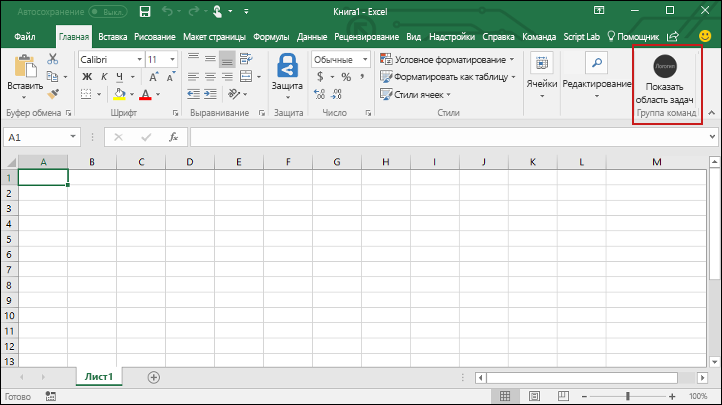

# <a name="build-an-excel-add-in-using-react"></a><span data-ttu-id="f18c9-101">Создание надстройки Excel с помощью React</span><span class="sxs-lookup"><span data-stu-id="f18c9-101">Build an Excel add-in using React</span></span>

<span data-ttu-id="f18c9-102">В этой статье описывается процесс создания надстройки Excel с помощью React и API JavaScript для Excel.</span><span class="sxs-lookup"><span data-stu-id="f18c9-102">In this article, you'll walk through the process of building an Excel add-in using React and the Excel JavaScript API.</span></span>

## <a name="environment"></a><span data-ttu-id="f18c9-103">Среда</span><span class="sxs-lookup"><span data-stu-id="f18c9-103">Environment</span></span>

- <span data-ttu-id="f18c9-104">**Классическое приложение Office.** Убедитесь, что у вас установлена ​​последняя версия Office.</span><span class="sxs-lookup"><span data-stu-id="f18c9-104">**Office Desktop**: Ensure that you have the latest version of Office installed.</span></span> <span data-ttu-id="f18c9-105">Команды надстроек требуют сборку 16.0.6769.0000 или более позднюю (рекомендуется сборка **16.0.6868.0000**).</span><span class="sxs-lookup"><span data-stu-id="f18c9-105">Add-in commands require build 16.0.6769.0000 or higher (**16.0.6868.0000** recommended).</span></span> <span data-ttu-id="f18c9-106">Узнайте, как [установить последнюю версию приложений Office](http://aka.ms/latestoffice).</span><span class="sxs-lookup"><span data-stu-id="f18c9-106">Learn how to [Install the latest version of Office applications](http://aka.ms/latestoffice).</span></span> 
 
- <span data-ttu-id="f18c9-107">**Office Online.** Не требуется выполнять дополнительную настройку.</span><span class="sxs-lookup"><span data-stu-id="f18c9-107">**Office Online**: There is no additional setup.</span></span> <span data-ttu-id="f18c9-108">Обратите внимание, что поддержка команд в Office Online для рабочих и учебных учетных записей предоставляется в тестовом режиме.</span><span class="sxs-lookup"><span data-stu-id="f18c9-108">Please note that support for commands in Office Online for work/school accounts is in preview.</span></span>

## <a name="prerequisites"></a><span data-ttu-id="f18c9-109">Необходимые компоненты</span><span class="sxs-lookup"><span data-stu-id="f18c9-109">Prerequisites</span></span>

- [<span data-ttu-id="f18c9-110">Node.js</span><span class="sxs-lookup"><span data-stu-id="f18c9-110">Node.js</span></span>](https://nodejs.org)

- <span data-ttu-id="f18c9-111">Глобально установите последнюю версию [Yeoman](https://github.com/yeoman/yo) и [генератор Yeoman для надстроек Office](https://github.com/OfficeDev/generator-office).</span><span class="sxs-lookup"><span data-stu-id="f18c9-111">Install the latest version of [Yeoman](https://github.com/yeoman/yo) and the [Yeoman generator for Office Add-ins](https://github.com/OfficeDev/generator-office) globally.</span></span>
    ```bash
    npm install -g yo generator-office
    ```

### <a name="create-the-web-app"></a><span data-ttu-id="f18c9-112">Создание веб-приложения</span><span class="sxs-lookup"><span data-stu-id="f18c9-112">Create the web app</span></span>

1. <span data-ttu-id="f18c9-113">Создайте на локальном диске папку и назовите ее **my-addin**.</span><span class="sxs-lookup"><span data-stu-id="f18c9-113">Create a folder on your local drive and name it **my-addin**.</span></span> <span data-ttu-id="f18c9-114">В ней вы будете создавать файлы для приложения.</span><span class="sxs-lookup"><span data-stu-id="f18c9-114">This is where you'll create the files for your app.</span></span>

2. <span data-ttu-id="f18c9-115">Перейдите к папке приложения.</span><span class="sxs-lookup"><span data-stu-id="f18c9-115">Navigate to your app folder.</span></span>

    ```bash
    cd my-addin
    ```

3. <span data-ttu-id="f18c9-116">Используя генератор Yeoman, создайте файл манифеста для надстройки.</span><span class="sxs-lookup"><span data-stu-id="f18c9-116">Use the Yeoman generator to generate the manifest file for your add-in.</span></span> <span data-ttu-id="f18c9-117">Выполните приведенную ниже команду и ответьте на вопросы, как показано на следующем снимке экрана.</span><span class="sxs-lookup"><span data-stu-id="f18c9-117">Run the following command and then answer the prompts as shown in the following screenshot:</span></span>

    ```bash
    yo office
    ```

    - <span data-ttu-id="f18c9-118">**Выберите тип проекта:** `Office Add-in project using React framework`</span><span class="sxs-lookup"><span data-stu-id="f18c9-118">**Choose a project type:** `Office Add-in project using React framework`</span></span>
    - <span data-ttu-id="f18c9-119">**Как вы хотите назвать надстройку?:** `My Office Add-in`</span><span class="sxs-lookup"><span data-stu-id="f18c9-119">**What do you want to name your add-in?:** `My Office Add-in`</span></span>
    - <span data-ttu-id="f18c9-120">**Какое клиентское приложение Office должно поддерживаться?:** `Excel`</span><span class="sxs-lookup"><span data-stu-id="f18c9-120">**Which Office client application would you like to support?:** `Excel`</span></span>

    
    
    <span data-ttu-id="f18c9-122">После завершения работы мастера генератор создаст проект и установит поддерживающие компоненты узла.</span><span class="sxs-lookup"><span data-stu-id="f18c9-122">After you complete the wizard, the generator will create the project and install supporting Node components.</span></span>

4.  <span data-ttu-id="f18c9-123">Откройте **src/components/App.tsx**, найдите комментарий "Обновить цвет заливки", а затем измените цвет заливки с 'желтого' на 'синий' и сохраните файл.</span><span class="sxs-lookup"><span data-stu-id="f18c9-123">Open **src/components/App.tsx**, search for the comment "Update the fill color," then change the fill color from 'yellow' to 'blue', and save the file.</span></span> 

    ```js
    range.format.fill.color = 'blue'

    ```

5. <span data-ttu-id="f18c9-124">В блоке `return` функции `render` внутри **src/components/App.tsx** обновите `<Herolist>` в соответствии с приведенным ниже кодом и сохраните файл.</span><span class="sxs-lookup"><span data-stu-id="f18c9-124">In the `return` block of the `render` function within **src/components/App.tsx**, update the `<Herolist>` to the code below, and save the file.</span></span> 

    ```js
      <HeroList message='Discover what My Office Add-in can do for you today!' items={this.state.listItems}>
        <p className='ms-font-l'>Choose the button below to set the color of the selected range to blue. <b>Set color</b>.</p>
        <Button className='ms-welcome__action' buttonType={ButtonType.hero} iconProps={{ iconName: 'ChevronRight' }} onClick={this.click}>Run</Button>
    </HeroList>
    ```

6. <span data-ttu-id="f18c9-125">Сделайте так, чтобы операционная система компьютера разработки доверяла сертификату. Для этого выполните действия, описанные в статье [Добавление самозаверяющих сертификатов в качестве доверенного корневого сертифтката](https://github.com/OfficeDev/generator-office/blob/master/src/docs/ssl.md).</span><span class="sxs-lookup"><span data-stu-id="f18c9-125">Carry out the steps in [Adding Self-Signed Certificates as Trusted Root Certificate](https://github.com/OfficeDev/generator-office/blob/master/src/docs/ssl.md) to trust the certificate for your development computer's operating system.</span></span>

7. <span data-ttu-id="f18c9-126">Загрузите неопубликованную надстройку, чтобы она отобразилась в Excel.</span><span class="sxs-lookup"><span data-stu-id="f18c9-126">Sideload your add-in so it will appear in Excel.</span></span> <span data-ttu-id="f18c9-127">В терминале выполните следующую команду:</span><span class="sxs-lookup"><span data-stu-id="f18c9-127">In the terminal run the following command:</span></span> 
    
    ```bash
    npm run sideload
    ```

## <a name="try-it-out"></a><span data-ttu-id="f18c9-128">Проверка</span><span class="sxs-lookup"><span data-stu-id="f18c9-128">Try it out</span></span>

1. <span data-ttu-id="f18c9-129">Выполните в терминале приведенную ниже команду, чтобы запустить сервер разработки.</span><span class="sxs-lookup"><span data-stu-id="f18c9-129">From the terminal, run the following command to start the dev server.</span></span>

    <span data-ttu-id="f18c9-130">Windows:</span><span class="sxs-lookup"><span data-stu-id="f18c9-130">Windows:</span></span>
    ```bash
    npm start
    ```

2. <span data-ttu-id="f18c9-131">В Excel выберите вкладку **Главная** и нажмите кнопку **Показать область задач** на ленте, чтобы открыть область задач надстройки.</span><span class="sxs-lookup"><span data-stu-id="f18c9-131">In Excel, choose the **Home** tab, and then choose the **Show Taskpane** button in the ribbon to open the add-in task pane.</span></span>

    

3. <span data-ttu-id="f18c9-133">Выберите любой диапазон ячеек на листе.</span><span class="sxs-lookup"><span data-stu-id="f18c9-133">Select any range of cells in the worksheet.</span></span>

4. <span data-ttu-id="f18c9-134">В области задач нажмите кнопку **Выбрать цвет**, чтобы сделать выбранный диапазон синим.</span><span class="sxs-lookup"><span data-stu-id="f18c9-134">In the task pane, choose the **Set color** button to set the color of the selected range to green.</span></span>

    

## <a name="next-steps"></a><span data-ttu-id="f18c9-136">Дальнейшие действия</span><span class="sxs-lookup"><span data-stu-id="f18c9-136">Next steps</span></span>

<span data-ttu-id="f18c9-p106">Поздравляем, вы успешно создали надстройку Excel с помощью React! Чтобы узнать больше о возможностях надстроек Excel и создать более сложную надстройку, воспользуйтесь руководством по надстройкам Excel.</span><span class="sxs-lookup"><span data-stu-id="f18c9-p106">Congratulations, you've successfully created an Excel add-in using React! Next, learn more about the capabilities of an Excel add-in and build a more complex add-in by following along with the Excel add-in tutorial.</span></span>

> [!div class="nextstepaction"]
> [<span data-ttu-id="f18c9-139">Руководство по надстройкам Excel</span><span class="sxs-lookup"><span data-stu-id="f18c9-139">Excel add-in tutorial</span></span>](../tutorials/excel-tutorial.yml)

## <a name="see-also"></a><span data-ttu-id="f18c9-140">См. также</span><span class="sxs-lookup"><span data-stu-id="f18c9-140">See also</span></span>

* [<span data-ttu-id="f18c9-141">Руководство по надстройкам Excel</span><span class="sxs-lookup"><span data-stu-id="f18c9-141">Excel add-in tutorial</span></span>](../tutorials/excel-tutorial-create-table.md)
* [<span data-ttu-id="f18c9-142">Основные понятия API JavaScript для Excel</span><span class="sxs-lookup"><span data-stu-id="f18c9-142">Excel JavaScript API core concepts</span></span>](../excel/excel-add-ins-core-concepts.md)
* [<span data-ttu-id="f18c9-143">Примеры кода надстроек Excel</span><span class="sxs-lookup"><span data-stu-id="f18c9-143">Excel add-in code samples</span></span>](http://dev.office.com/code-samples#?filters=excel,office%20add-ins)
* [<span data-ttu-id="f18c9-144">Справочник по API JavaScript для Excel</span><span class="sxs-lookup"><span data-stu-id="f18c9-144">Excel JavaScript API reference</span></span>](https://dev.office.com/reference/add-ins/excel/excel-add-ins-reference-overview)
