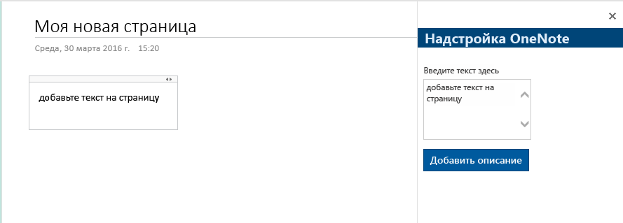

# <a name="build-your-first-onenote-add-in"></a><span data-ttu-id="19133-101">Создание первой надстройки OneNote</span><span class="sxs-lookup"><span data-stu-id="19133-101">Build your first OneNote add-in</span></span>

<span data-ttu-id="19133-102">В этой статье мы разберем, как создать надстройку OneNote, используя jQuery и API JavaScript для Office.</span><span class="sxs-lookup"><span data-stu-id="19133-102">In this article, you'll walk through the process of building a OneNote add-in by using jQuery and the Office JavaScript API.</span></span>

## <a name="prerequisites"></a><span data-ttu-id="19133-103">Необходимые компоненты</span><span class="sxs-lookup"><span data-stu-id="19133-103">Prerequisites</span></span>

- [<span data-ttu-id="19133-104">Node.js</span><span class="sxs-lookup"><span data-stu-id="19133-104">Node.js</span></span>](https://nodejs.org)

- <span data-ttu-id="19133-105">Глобально установите последнюю версию [Yeoman](https://github.com/yeoman/yo) и [генератор Yeoman для надстроек Office](https://github.com/OfficeDev/generator-office).</span><span class="sxs-lookup"><span data-stu-id="19133-105">Install the latest version of [Yeoman](https://github.com/yeoman/yo) and the [Yeoman generator for Office Add-ins](https://github.com/OfficeDev/generator-office) globally.</span></span>

    ```bash
    npm install -g yo generator-office
    ```

## <a name="create-the-add-in-project"></a><span data-ttu-id="19133-106">Создание проекта надстройки</span><span class="sxs-lookup"><span data-stu-id="19133-106">Create the add-in project</span></span>

1. <span data-ttu-id="19133-107">Создайте на локальном диске папку и назовите ее `my-onenote-addin`.</span><span class="sxs-lookup"><span data-stu-id="19133-107">Create a folder on your local drive and name it `my-onenote-addin`.</span></span> <span data-ttu-id="19133-108">В ней вы будете создавать файлы для надстройки.</span><span class="sxs-lookup"><span data-stu-id="19133-108">This is where you'll create the files for your add-in.</span></span>

2. <span data-ttu-id="19133-109">Перейдите к новой папке.</span><span class="sxs-lookup"><span data-stu-id="19133-109">Navigate to your new folder.</span></span>

    ```bash
    cd my-onenote-addin
    ```

3. <span data-ttu-id="19133-110">С помощью генератора Yeoman создайте проект надстройки OneNote.</span><span class="sxs-lookup"><span data-stu-id="19133-110">Use the Yeoman generator to create a OneNote add-in project.</span></span> <span data-ttu-id="19133-111">Выполните приведенную ниже команду и ответьте на вопросы, как показано ниже.</span><span class="sxs-lookup"><span data-stu-id="19133-111">Run the following command and then answer the prompts as follows:</span></span>

    ```bash
    yo office
    ```

    - <span data-ttu-id="19133-112">**Выберите тип проекта:** `Jquery`</span><span class="sxs-lookup"><span data-stu-id="19133-112">**Choose a project type:** `Jquery`</span></span>
    - <span data-ttu-id="19133-113">**Выберите тип сценария:** `Javascript`</span><span class="sxs-lookup"><span data-stu-id="19133-113">**Choose a script type:** `Javascript`</span></span>
    - <span data-ttu-id="19133-114">**Как вы хотите назвать надстройку?** `My Office Add-in`</span><span class="sxs-lookup"><span data-stu-id="19133-114">**What do you want to name your add-in?:** `My Office Add-in`</span></span>
    - <span data-ttu-id="19133-115">**Какое клиентское приложение Office должно поддерживаться?** `Onenote`</span><span class="sxs-lookup"><span data-stu-id="19133-115">**Which Office client application would you like to support?:** `Onenote`</span></span>

    
    
    <span data-ttu-id="19133-117">После завершения работы мастера, генератор создаст проект и установит поддерживающие компоненты узла.</span><span class="sxs-lookup"><span data-stu-id="19133-117">After you complete the wizard, the generator will create the project and install supporting Node components.</span></span>


## <a name="update-the-code"></a><span data-ttu-id="19133-118">Обновление кода</span><span class="sxs-lookup"><span data-stu-id="19133-118">Update the code</span></span>

1. <span data-ttu-id="19133-119">В редакторе кода откройте файл **index.html** из корневой папки проекта.</span><span class="sxs-lookup"><span data-stu-id="19133-119">In your code editor, open **index.html** in the root of the project.</span></span> <span data-ttu-id="19133-120">Этот файл содержит HTML-контент, который будет отображаться в области задач надстройки.</span><span class="sxs-lookup"><span data-stu-id="19133-120">This file contains the HTML that will be rendered in the add-in's task pane.</span></span>

2. <span data-ttu-id="19133-121">Замените элемент `<main>` внутри элемента `<body>` приведенной ниже разметкой и сохраните файл.</span><span class="sxs-lookup"><span data-stu-id="19133-121">Replace the `<main>` element inside the `<body>` element with the following markup and save the file.</span></span> <span data-ttu-id="19133-122">Эта разметка добавляет текстовую область и кнопку, используя [компоненты Office UI Fabric](http://dev.office.com/fabric/components).</span><span class="sxs-lookup"><span data-stu-id="19133-122">This adds a text area and a button using [Office UI Fabric components](http://dev.office.com/fabric/components).</span></span>

    ```html
    <main class="ms-welcome__main">
        <br />
        <p class="ms-font-l">Enter content below</p>
        <div class="ms-TextField ms-TextField--placeholder">
            <textarea id="textBox" rows="5"></textarea>
        </div>
        <button id="addOutline" class="ms-welcome__action ms-Button ms-Button--hero ms-u-slideUpIn20">
            <span class="ms-Button-label">Add Outline</span>
            <span class="ms-Button-icon"><i class="ms-Icon"></i></span>
            <span class="ms-Button-description">Adds the content above to the current page.</span>
        </button>
    </main>
    ```

3. <span data-ttu-id="19133-123">Откройте файл **src\index.js**, чтобы указать скрипт для надстройки.</span><span class="sxs-lookup"><span data-stu-id="19133-123">Open the file **app.js** to specify the script for the add-in.</span></span> <span data-ttu-id="19133-124">Замените все его содержимое указанным ниже кодом и сохраните файл.</span><span class="sxs-lookup"><span data-stu-id="19133-124">Replace the entire contents with the following code and save the file.</span></span>

    ```js
    'use strict';

    (function () {

        Office.initialize = function (reason) {
            $(document).ready(function () {
                // Set up event handler for the UI.
                $('#addOutline').click(addOutlineToPage);
            });
        };

        // Add the contents of the text area to the page.
        function addOutlineToPage() {        
            OneNote.run(function (context) {
                var html = '<p>' + $('#textBox').val() + '</p>';

                // Get the current page.
                var page = context.application.getActivePage();

                // Queue a command to load the page with the title property.             
                page.load('title'); 

                // Add an outline with the specified HTML to the page.
                var outline = page.addOutline(40, 90, html);

                // Run the queued commands, and return a promise to indicate task completion.
                return context.sync()
                    .then(function() {
                        console.log('Added outline to page ' + page.title);
                    })
                    .catch(function(error) {
                        app.showNotification("Error: " + error); 
                        console.log("Error: " + error); 
                        if (error instanceof OfficeExtension.Error) { 
                            console.log("Debug info: " + JSON.stringify(error.debugInfo)); 
                        } 
                    }); 
            });
        }
    })();
    ```

## <a name="update-the-manifest"></a><span data-ttu-id="19133-125">Обновление манифеста</span><span class="sxs-lookup"><span data-stu-id="19133-125">Update the manifest</span></span>

1. <span data-ttu-id="19133-126">Откройте файл **one-note-add-in-manifest.xml**, чтобы определить параметры и возможности надстройки.</span><span class="sxs-lookup"><span data-stu-id="19133-126">Open the file **one-note-add-in-manifest.xml** to define the add-in's settings and capabilities.</span></span>

2. <span data-ttu-id="19133-127">Элемент `ProviderName` содержит заполнитель.</span><span class="sxs-lookup"><span data-stu-id="19133-127">The `ProviderName` element has a placeholder value.</span></span> <span data-ttu-id="19133-128">Замените его на свое имя.</span><span class="sxs-lookup"><span data-stu-id="19133-128">Replace it with your name.</span></span>

3. <span data-ttu-id="19133-129">Атрибут `DefaultValue` элемента `Description` содержит заполнитель.</span><span class="sxs-lookup"><span data-stu-id="19133-129">The `DefaultValue` attribute of the `Description` element has a placeholder.</span></span> <span data-ttu-id="19133-130">Замените его строкой **Надстройка области задач для OneNote**.</span><span class="sxs-lookup"><span data-stu-id="19133-130">Replace it with **A task pane add-in for OneNote**.</span></span>

4. <span data-ttu-id="19133-131">Сохраните файл.</span><span class="sxs-lookup"><span data-stu-id="19133-131">Save the file.</span></span>

    ```xml
    ...
    <ProviderName>John Doe</ProviderName>
    <DefaultLocale>en-US</DefaultLocale>
    <!-- The display name of your add-in. Used on the store and various places of the Office UI such as the add-ins dialog. -->
    <DisplayName DefaultValue="OneNote Add-in" />
    <Description DefaultValue="A task pane add-in for OneNote"/>
    ...
    ```

## <a name="start-the-dev-server"></a><span data-ttu-id="19133-132">Запуск сервера разработки</span><span class="sxs-lookup"><span data-stu-id="19133-132">Start the dev server</span></span>

[!include[Start server section](../includes/quickstart-yo-start-server.md)]

## <a name="try-it-out"></a><span data-ttu-id="19133-133">Проверка</span><span class="sxs-lookup"><span data-stu-id="19133-133">Try it out</span></span>

1. <span data-ttu-id="19133-134">Откройте записную книжку в [OneNote Online](https://www.onenote.com/notebooks).</span><span class="sxs-lookup"><span data-stu-id="19133-134">In [OneNote Online](https://www.onenote.com/notebooks), open a notebook.</span></span>

2. <span data-ttu-id="19133-135">Выберите **Вставка > Надстройки Office**. Откроется диалоговое окно "Надстройки Office".</span><span class="sxs-lookup"><span data-stu-id="19133-135">Choose **Insert > Office Add-ins** to open the Office Add-ins dialog.</span></span>

    - <span data-ttu-id="19133-136">Если вы вошли с помощью обычной учетной записи, выберите **Отправить надстройку** на вкладке **МОИ НАДСТРОЙКИ**.</span><span class="sxs-lookup"><span data-stu-id="19133-136">If you're signed in with your consumer account, select the **MY ADD-INS** tab, and then choose **Upload My Add-in**.</span></span>

    - <span data-ttu-id="19133-137">Если вы вошли с помощью рабочей или учебной учетной записи, выберите **Отправить надстройку** на вкладке **МОЯ ОРГАНИЗАЦИЯ**.</span><span class="sxs-lookup"><span data-stu-id="19133-137">If you're signed in with your work or school account, select the **MY ORGANIZATION** tab, and then select **Upload My Add-in**.</span></span> 

    <span data-ttu-id="19133-138">На следующем изображении показана вкладка **МОИ НАДСТРОЙКИ** для обычных записных книжек.</span><span class="sxs-lookup"><span data-stu-id="19133-138">The following image shows the **MY ADD-INS** tab for consumer notebooks.</span></span>

    

3. <span data-ttu-id="19133-139">В диалоговом окне "Отправить надстройку" выберите файл **one-note-add-in-manifest.xml** в папке проекта и нажмите **Отправить**.</span><span class="sxs-lookup"><span data-stu-id="19133-139">In the Upload Add-in dialog, browse to **one-note-add-in-manifest.xml** in your project folder, and then choose **Upload**.</span></span> 

4. <span data-ttu-id="19133-140">На вкладке **Главная** нажмите кнопку **Показать область задач** на ленте.</span><span class="sxs-lookup"><span data-stu-id="19133-140">In Excel, choose the **Home** tab, and then choose the **Show Taskpane** button in the ribbon to open the add-in task pane.</span></span> <span data-ttu-id="19133-141">Надстройка откроется в iFrame рядом со страницей OneNote.</span><span class="sxs-lookup"><span data-stu-id="19133-141">6- The add-in opens in an iFrame next to the OneNote page.</span></span>

5. <span data-ttu-id="19133-142">Введите текст в текстовой области и нажмите кнопку **Добавить структуру**.</span><span class="sxs-lookup"><span data-stu-id="19133-142">Enter some text in the text area and then choose **Add outline**.</span></span> <span data-ttu-id="19133-143">Введенный текст будет добавлен на страницу.</span><span class="sxs-lookup"><span data-stu-id="19133-143">The text you entered is added to the page.</span></span> 

    

## <a name="troubleshooting-and-tips"></a><span data-ttu-id="19133-145">Устранение неполадок и советы</span><span class="sxs-lookup"><span data-stu-id="19133-145">Troubleshooting and tips</span></span>

- <span data-ttu-id="19133-p110">Для отладки надстройки можно использовать имеющиеся в браузере средства разработчика. При использовании веб-сервера Gulp и отладке в Internet Explorer или Chrome вы можете сохранить внесенные изменения в локальном расположении, а затем просто обновить iFrame надстройки.</span><span class="sxs-lookup"><span data-stu-id="19133-p110">You can debug the add-in using your browser's developer tools. When you're using the Gulp web server and debugging in Internet Explorer or Chrome, you can save your changes locally and then just refresh the add-in's iFrame.</span></span>

- <span data-ttu-id="19133-p111">Просматривая объект OneNote, вы увидите, что доступные для использования свойства имеют действительные значения. Свойства, которые необходимо загрузить, имеют значение *undefined*. Разверните узел `_proto_`, чтобы увидеть свойства, которые определены для объекта, но еще не загружены.</span><span class="sxs-lookup"><span data-stu-id="19133-p111">When you inspect a OneNote object, the properties that are currently available for use display actual values. Properties that need to be loaded display *undefined*. Expand the `_proto_` node to see properties that are defined on the object but are not yet loaded.</span></span>

   

- <span data-ttu-id="19133-p112">Если надстройка использует какие-либо HTTP-ресурсы, то вам потребуется включить смешанное содержимое в браузере. Надстройки, которые применяются в рабочей среде, должны использовать только безопасные HTTPS-ресурсы.</span><span class="sxs-lookup"><span data-stu-id="19133-p112">You need to enable mixed content in the browser if your add-in uses any HTTP resources. Production add-ins should use only secure HTTPS resources.</span></span>

- <span data-ttu-id="19133-154">Надстройки области задач можно открыть откуда угодно, но контентные надстройки вставляются только в содержимое стандартной страницы (не в заголовки, изображения, iFrames и т. д.).</span><span class="sxs-lookup"><span data-stu-id="19133-154">Task pane add-ins can be opened from anywhere, but content add-ins can only be inserted inside regular page content (i.e. not in titles, images, iFrames, etc.).</span></span> 

## <a name="next-steps"></a><span data-ttu-id="19133-155">Дальнейшие действия</span><span class="sxs-lookup"><span data-stu-id="19133-155">Next steps</span></span>

<span data-ttu-id="19133-156">Поздравляем, вы успешно создали надстройку OneNote!</span><span class="sxs-lookup"><span data-stu-id="19133-156">Congratulations, you've successfully created a OneNote add-in!</span></span> <span data-ttu-id="19133-157">Следующим шагом узнайте больше об основных понятиях, связанных с созданием надстроек OneNote.</span><span class="sxs-lookup"><span data-stu-id="19133-157">Next, learn more about the core concepts of building OneNote add-ins.</span></span>

> [!div class="nextstepaction"]
> [<span data-ttu-id="19133-158">Обзор API JavaScript для OneNote</span><span class="sxs-lookup"><span data-stu-id="19133-158">OneNote JavaScript API programming overview</span></span>](../onenote/onenote-add-ins-programming-overview.md)

## <a name="see-also"></a><span data-ttu-id="19133-159">См. также</span><span class="sxs-lookup"><span data-stu-id="19133-159">See also</span></span>

- [<span data-ttu-id="19133-160">Обзор создания кода с помощью API JavaScript для OneNote</span><span class="sxs-lookup"><span data-stu-id="19133-160">OneNote JavaScript API programming overview</span></span>](../onenote/onenote-add-ins-programming-overview.md)
- [<span data-ttu-id="19133-161">Справочник по API JavaScript для OneNote</span><span class="sxs-lookup"><span data-stu-id="19133-161">OneNote JavaScript API reference</span></span>](https://dev.office.com/reference/add-ins/onenote/onenote-add-ins-javascript-reference)
- [<span data-ttu-id="19133-162">Пример надстройки Rubric Grader</span><span class="sxs-lookup"><span data-stu-id="19133-162">Rubric Grader sample</span></span>](https://github.com/OfficeDev/OneNote-Add-in-Rubric-Grader)
- [<span data-ttu-id="19133-163">Обзор платформы надстроек Office</span><span class="sxs-lookup"><span data-stu-id="19133-163">Office Add-ins platform overview</span></span>](../overview/office-add-ins.md)
