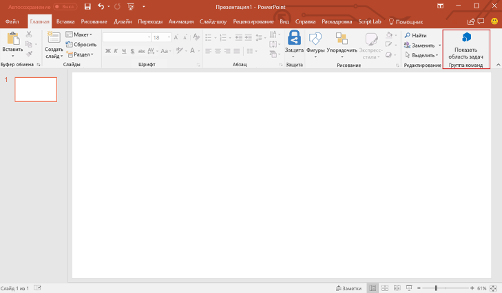
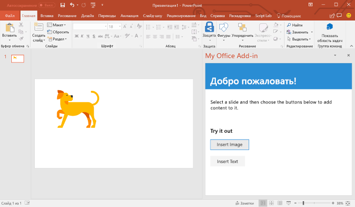
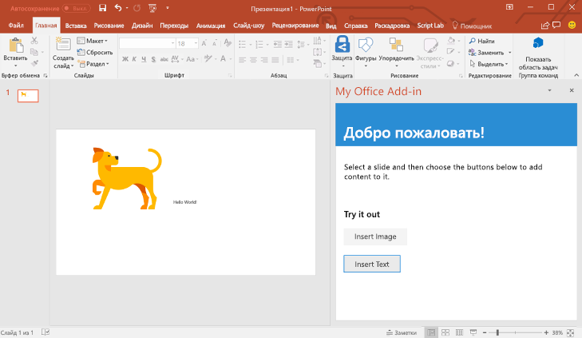

# <a name="build-your-first-powerpoint-add-in"></a><span data-ttu-id="bf49a-101">Создание первой надстройки PowerPoint</span><span class="sxs-lookup"><span data-stu-id="bf49a-101">Build your first PowerPoint add-in</span></span>

<span data-ttu-id="bf49a-102">В этой статье описывается процесс создания надстройки PowerPoint с помощью jQuery и API JavaScript для Office.</span><span class="sxs-lookup"><span data-stu-id="bf49a-102">In this article, you'll walk through the process of building a PowerPoint add-in by using jQuery and the Office JavaScript API.</span></span>

## <a name="create-the-add-in"></a><span data-ttu-id="bf49a-103">Создание надстройки</span><span class="sxs-lookup"><span data-stu-id="bf49a-103">Create the add-in</span></span> 

[!include[Choose your editor](../includes/quickstart-choose-editor.md)]

# <a name="visual-studiotabvisual-studio"></a>[<span data-ttu-id="bf49a-104">Visual Studio</span><span class="sxs-lookup"><span data-stu-id="bf49a-104">Visual Studio</span></span>](#tab/visual-studio)

### <a name="prerequisites"></a><span data-ttu-id="bf49a-105">Необходимые компоненты</span><span class="sxs-lookup"><span data-stu-id="bf49a-105">Prerequisites</span></span>

[!include[Quick Start prerequisites](../includes/quickstart-vs-prerequisites.md)]

### <a name="create-the-add-in-project"></a><span data-ttu-id="bf49a-106">Создание проекта надстройки</span><span class="sxs-lookup"><span data-stu-id="bf49a-106">Create the add-in project</span></span>

1. <span data-ttu-id="bf49a-107">В строке меню Visual Studio выберите **Файл** > **Создать** > **Проект**.</span><span class="sxs-lookup"><span data-stu-id="bf49a-107">On the Visual Studio menu bar, choose  **File** > **New** > **Project**.</span></span>
    
2. <span data-ttu-id="bf49a-108">В списке типов проекта разверните узел **Visual C#** или **Visual Basic**, разверните **Office/SharePoint**, затем выберите **Надстройки** > **Веб-надстройка PowerPoint**.</span><span class="sxs-lookup"><span data-stu-id="bf49a-108">In the list of project types under **Visual C#** or **Visual Basic**, expand  **Office/SharePoint**, choose **Add-ins**, and then choose **PowerPoint Web Add-in** as the project type.</span></span> 

3. <span data-ttu-id="bf49a-109">Укажите имя проекта и нажмите кнопку **OK**.</span><span class="sxs-lookup"><span data-stu-id="bf49a-109">Name the project, and then choose **OK**.</span></span>

4. <span data-ttu-id="bf49a-110">В диалоговом окне **Создание надстройки Office** выберите **Добавить новые функции в PowerPoint**, а затем нажмите кнопку **Готово**, чтобы создать проект.</span><span class="sxs-lookup"><span data-stu-id="bf49a-110">In the **Create Office Add-in** dialog window, choose **Add new functionalities to PowerPoint**, and then choose **Finish** to create the project.</span></span>

5. <span data-ttu-id="bf49a-p101">Visual Studio создаст решение, и в **обозревателе решений** появятся два соответствующих проекта. В Visual Studio откроется файл **Home.html**.</span><span class="sxs-lookup"><span data-stu-id="bf49a-p101">Visual Studio creates a solution and its two projects appear in **Solution Explorer**. The **Home.html** file opens in Visual Studio.</span></span>
    
### <a name="explore-the-visual-studio-solution"></a><span data-ttu-id="bf49a-113">Обзор решения Visual Studio</span><span class="sxs-lookup"><span data-stu-id="bf49a-113">Explore the Visual Studio solution</span></span>

[!include[Description of Visual Studio projects](../includes/quickstart-vs-solution.md)]

### <a name="update-the-code"></a><span data-ttu-id="bf49a-114">Обновление кода</span><span class="sxs-lookup"><span data-stu-id="bf49a-114">Update the code</span></span>

1. <span data-ttu-id="bf49a-115">Файл **Home.html** содержит HTML-контент, который будет отображаться в области задач надстройки.</span><span class="sxs-lookup"><span data-stu-id="bf49a-115">**Home.html** specifies the HTML that will be rendered in the add-in's task pane.</span></span> <span data-ttu-id="bf49a-116">В файле **Home.html** замените элемент `<body>` на приведенную ниже часть кода и сохраните файл.</span><span class="sxs-lookup"><span data-stu-id="bf49a-116">In **Home.html**, replace the `<body>` element with the following markup and save the file.</span></span>
 
    ```html
    <body class="ms-font-m ms-welcome">
        <div id="content-header">
            <div class="padding">
                <h1>Welcome</h1>
            </div>
        </div>
        <div id="content-main">
            <div class="padding">
                <p>Select a slide and then choose the buttons to below to add content to it.</p>
                <br />
                <h3>Try it out</h3>
                <button class="ms-Button" id="insert-image">Insert Image</button>
                <br/><br/>
                <button class="ms-Button" id="insert-text">Insert Text</button>
            </div>
        </div>
    </body>
    ```

2. <span data-ttu-id="bf49a-117">Откройте файл **Home.js** в корневой папке проекта веб-приложения.</span><span class="sxs-lookup"><span data-stu-id="bf49a-117">Open the file **Home.js** in the root of the web application project.</span></span> <span data-ttu-id="bf49a-118">Этот файл содержит скрипт надстройки.</span><span class="sxs-lookup"><span data-stu-id="bf49a-118">This file specifies the script for the add-in.</span></span> <span data-ttu-id="bf49a-119">Замените все его содержимое указанным ниже кодом и сохраните файл.</span><span class="sxs-lookup"><span data-stu-id="bf49a-119">Replace the entire contents with the following code and save the file.</span></span>

    ```js
    'use strict';

    (function () {

        // The initialize function must be run each time a new page is loaded
        Office.initialize = function (reason) {
            $(document).ready(function () {
                $('#insert-image').click(insertImage);
                $('#insert-text').click(insertText);
            });
        };
    
        function insertImage() {
            Office.context.document.setSelectedDataAsync(getImageAsBase64String(), {
                coercionType: Office.CoercionType.Image,
                imageLeft: 50,
                imageTop: 50,
                imageWidth: 400
            },
                function (asyncResult) {
                    if (asyncResult.status === Office.AsyncResultStatus.Failed) {
                        console.log(asyncResult.error.message);
                    }
                });
        }  

        function insertText() {
            Office.context.document.setSelectedDataAsync("Hello World!",
                function (asyncResult) {
                    if (asyncResult.status === Office.AsyncResultStatus.Failed) {
                        console.log(asyncResult.error.message);
                    }
                });
        }

        function getImageAsBase64String() {
            return 'iVBORw0KGgoAAAANSUhEUgAAAZAAAAEFCAIAAABCdiZrAAAACXBIWXMAAAsSAAALEgHS3X78AAAbX0lEQVR42u2da2xb53nH/xIpmpRMkZQs2mZkkb7UV3lifFnmNYnorO3SLYUVpFjQYoloYA3SoZjVZRi2AVtptF+GNTUzbGiwDQu9deg2pCg9FE3aYQ3lDssw2zGNKc5lUUr6ItuULZKiJUoyJe2DFFsXXs6VOpf/D/kS6/Ac6T2Hv/M8z3nf5zTMz8+DEEL0QCOHgBBCYRFCCIVFCKGwCCGEwiKEEAqLEEJhEUIIhUUIIRQWIYTCIoQQCosQQigsQgiFRQghFBYhhFBYhBAKixBC1hArh2CBwtlYaTRV6ac2f7Cx2Q3AsTfEsSKEwlprYQ3Gpt4bFLixfU+vpdltCwTte0JNHQFrR4ADSEgdaGCL5AVGvhkSLqyV1t/gd+wN2feGHHtClBchFJbq3Hq5b+LCGfn7sfl7nI+HWw710VyEUFhqkf1BJPuDkwrusOXgsfW94ZZDfRxb8oBCEpn4yn90BmF1ozUIq5sjVCOb4RCoxMSFMxMXzlg3+D1fjDgfD3NAzE4ph6EwMlWjeKsLziDaQvCE0BbimDHCquyX8/Fb33lapZ3b9/RueD5q8wc5zuYl2VfDVqvx9MLbB28fHCwvUFjLmUknr/3xw6oewvPMNzzPRDjUZmQsgfNHpX/cewzePvgYp1NYS/j4yw1qH8K+p3fTS/GFKV3ERLw/gCuvyN2Jww9fGP4BM5e6ONP9ATZ/j9qHmHpvcOSbobnJHEfbXBSSCuykmMbwSZwNYDiCkkkvIQpryQ1sT6guueclOotIp5Rf1NZIjMIyNfZ6LbuZSV8a/W6YA05kaWvoOM6FlIndKCxdRlh1XCc4ceFM/o0ox9wsqDRHITuItx9G2kQXEoW1ZCya3S0Hj9XtcNkfRJgYmgVfGFaXWjv/4Os4FzJJVYvCWkbz4fpNTJ+bzDPIMk30HsDuqIrOyg7i7aAZ0kNOa1ghkVzqdzx1jOlcgb9jkGUaiimkow+0UkiilFdy/1YXdkeNPV2LwlrJ6KvhwtnT5f1iQYsbdifWNcPmkH2k/SK3X5j37B/gOTIaYwlMpTCeRDaBwiW5e+t+zcDOorBWUnbKu9UGjw/OdkWPtF/SpzY9C18YG57kmTImpRwycWTiotfxmMNZFFYZlvbGarTA44PLq8Jh9sv4rMOPfTGujzW4ua7HcCWKYprOorCqlhouJ2586ygAWzO8ASWyP8WFtUDXCexm2d7w988YhiNStGVEZ1FYFYOsufSgbycaLeocwA58Son9eHrxcJx9lIzPcATpqOgi/ZGLcBqqRwiFVZ7ZD37ccOY31bIVgBZgm0K7cvbgSJKnzASRfwpDYWTFNPK2uvB4ykj3M87DKsd0znL2d1W0FQAF08zCJQyFedKMjyOAwwnsOiXiI6U8zoWMNAYUVjnifRhPq3uIJmUz2NNlGu8SQ+IfwJGLIuagFi5hOEJhGZcLUVwbVP0oihfyh8KmbTliOpxBHEnCKbgb0vBJjCUoLGMmg3i7LrejFqV3WMqbahEs00McTohw1rsGKRpQWKvCq+m86kdpUWe3FJapsLpFOKuYNkZiSGGtCK9O1uNArerstpRnJcuMzhJYz0pHUUxRWMYKr+qDDGEVpiwXPnZe+NhZ/scUFp1V5X6m/yCL87CW8FfueuSDMqaMJi67I68H7k5ZAGx2z7z83PDOzZPLtuCcLHMyEsPQcUFbPvYLXb80jBHWJ7wbq4etAMjoXnPfVgBu5Gwv/eP2VQHYJZ5JM+ILwyus96TOgywK6xM+qlcyJVVYH95ovm+r+87ieSOLdMcEJYYjp3U9/YWvqgcATOfw0Zl6HMgDSJ1AvzL7A9bbZ8ts9/OAkIWyh/7kYJWfbt68+eWXX965cycvDf18ld3YHRWUGKaj2K7XOIsRFgDgaqJOB5LXpuapA3eW/u+XP50ps5GwZf3lZXc/drtx44UXXvjwww95aegsMfT0CgiyYkwJmQ8KC6/k5XAvPXX1qQN3DmwtHNha+MYXUy/82ojkXa2O11Zw9+7db3/727w0dIaQ0KmY1u/TZKaEdYywZHcBdNpnI19MKfK7HNp2951fOKtv88477/DS0BltIXh6a3d0yMTh7dPj38cICxhPqb7UGcAGueGVshzcWuCZNyZCuv7rNsKisICM+hOXLAqEVwoLa1uhehmL6BVvHxz+GtuU8jp9JxiFVRdhdUp/OKiqs3jyjYmQzsj6DLIoLPULWK2qLR6UR2gv29GYWFj6bDhDYQHjKRV33gR0avTv/sKBO8wKjYkjUDsrZEqoW2GpVnG3AAEtJoP3KT+TixiAjloPAUt5PTZvML2wVC1gbQbsmv7rv/TpWwyyjImQd1bqMMgyvbCmVavjdMpa51wfnPZZBlnGRMjbvSgsRlgPYiuPPgaAQZYxEdJD5p7+nrqYfqa7GhFWp25stRBkJf6MLbSMSM0p74ywiL5sRQiFpSsUnIRlAfy0FdEMQuruTAlNih3YovVngoToPSWksJRgA+DV9HwrQspQyuvuV6aw5NEEbFHtPYOEEApLGda54MpjIweC6BbhL47WDHxKKIl9/fhKirYimqbmNCurmxGW0aOqAwM4OIB1bg4G0ToFA06vo7CEseMY9oWxo48jQQiFpUk6erAlhC0heorokpqd3XU4Ucv0wvIuWSNqd6MjiHVueIPYEuIFX7unEtEsQlrHsIalP45GeW1XxENr6ze8StTeRkhHB43Bp4SkMkI67RJtIqQDciuFRYwTXvUacjEaI6wH+b4OU0IKi1RAyDuEiTYpJFGs1fhbh/kghUUq0HWC4ZWOuR4TEEHr8vxSWGQVvn7s5rMIPTMq4J2DfFU9MYitumMcBh2TiQvIB3sE9VDWHpw4Sj7B4ceuqE5vvOQBaQHRsW4nrFBYpsfqQlsI3j5OYjACY4naE9wB+AcoLCKD/1ViJ/uBz81zLE3NcKT2NrrNB8EallZgb2Uin5GYscMrCksz2DgERB6lHN4XYCKrS9e5P4WlDdhkmchkKCyoR7uewysKSzOs5xAQeclg5oyg8IrCIgpgB5o4CkQShSSGjgva0j+gx/WDFJYmcXEIiHiKKZwLCdrS4TfA+lBOa9AMHuC27J38tIEDWSccftgDcAbhCMAZXJull6Uckn1CXy+4ywjLrSgsLWWFdmCKA6GX0CaNYnrZNALvMXhC8PbVaZZTKYdzIRQuCdrYe8wYaxga5uc51VAz4UwWuCbj4/t5SjQSLPfiobC6swcKSZwLCY2trC48ntJ79WoB1rA0lhWy9G4AsoMYOo6fuTEcQSmn/P4zcRG2AtAdM4atKCzt4eMQGIVSHsMncTagsLbeH0DyaRG26jphpAXtTAm1lBIu8DEwwZTQWCjSCWMsgQ8GhBatFnD24IihXqfKCEt7dAIWjoKxKKaRfBrJPomhVjGFoTDOHxVtq8MJgw0kIyztRVgAxoG0+E8xwtI+VheCcRFzIIopjMSQjorIAe8f6HBCp43bKSy9CQvALSBDYRmUXadqL5HJxJGJY+S0RC0a0VbgPCztshG4B2Q5EEbkg6+jkCzTirqUw1gCmTiyidptjs1nKwpL23QCduAGB8KIjJzG9E1s/SOUcigkUUyhkBRXojKfrZgSajglvM84cA2YZUpIarFQZTfKlKuy8Cmh5mkFdgEeDgSpiq/f8LaisGSH3/XBAnRSW6Qyu04ZaTo7haVSBF7fSoEN6AT2Ap1AK+dqkU/SwCMX9d6WT0SQwDOuMyyA55NQaxaYAmaBIsfFlAG+f8AALa4orDpGWEJeUqKqvBaawbfyZJgMXz+2R/T7ti4Kay1ocnMMSL3x9GJ7ZG36BVJYuo+wCGFURWHpA3NfOqRe98Ue+MJ4KGyGh4AUFiMsok/q3HCZwjLL3U/+cgpCltL+6zj4JoehLJyHxSCLaIw7P1GlsTKFRSgsogrXYxwDCovCIjrhSpRjQGGpgFmnwxB1KaZRSHIYKCwV8PRyDIjyZOIcAwpLBQz0DiVCYVFYzAoJEU/hEp8VUlgq4AzC4ecwEOUZZxmLwlIDD4MsogLZBMeAwlIBlrGIKlkhIywKSyVh1a1dMjEP91jDorBUwhfmGBClU8JBjgGFpQ4PUViEUFh6wRmEs4fDQAiFpRNM8+YSQigs/cPSOyEUlm6wull6J4TCYlZICKGwFMcRgK+fw0AIhaUTTPYmXkIoLAZZhBAKi0EWIRQWWRlkdZ3gMBBCYemEHRHOySJEcfgiVcFM5/BRHFcTyCQxKuDlqRuAzRw1QiisOnM1gXei+OiMuE/dBjyAncNHCIVVHzJJvDWAa1K7fIwA2ziIhFBYdeC/Inj7pKw9TAC3gQ0cSkIoLPWYzuFfQoIKVbVjNMAFNHFMCVEAPiUslwYqZSsAs0CKY0oIIyw1GE/hX0OYziu5zykgA3g5uIQwwlI2E4z3KWyrBW4BExxfQigsBXkzrFgmuJo0MMshJoTCUoQL4mdaiWIW+JijTAiFpUgy+HZE9aNMAdc41oRQWDJ5a0CV0tVqssBtDjchFJZkxlN493T9DncDyHLQCaGwpDEUq/cRr/GhISFS4Dws4N3YGhw0DWzj0mgVmZvBzBhmZzAzVuFebcO6NljXw7qeo0Vh6YVMEuPpNTjuwkNDOktRpm6ieBMzYyjexNyMiA86NsHWBvsmODah0caBpLA0y0fxNTs0naUQE1cweQUTV8RJainFmyjeRP7yoryau9DSxchLi5i+hnU1sZZHX3AW61nSaN6J7tfwRLbpsxfh65dsq9XyuvM/uPI6bv0ME1c4ytqiYX5+3tQD8LeBtUkJV9AJeHg1CsayHr/0fXQ8tfTf5iZz+Tei+Teic5NKzlCxrocnCOeONfpLPzfPs01hLeHlBq38JpvZOUsYzh4cTsDqLvtDo2mLwmJKKCMO6lVx5zeAIoe4Fr5+HElWshWAxma355lI11+mnI8r+XbI0l2M/ieu/RumbvIcMMLSS4T10jwAZJIYTSKTRCYpvXtymTQH2MsLsirdr8EXFr558XJi9NVw6bbCKb9rLzzBej1MZIRFYckV1gqU8pcH6OQFWQGHH8E4nEGxn5ubzGVfj+TffEXZX8e6Ht5HYd9EYVFYuhOWUv7yA628IMvhPYbuWJU0sCYT5+Ojr4aVrWoB8AThCar8t1NYFJa6wpLsr72AhRfkikjGhd1RUWlgJUqjqZvf6ZtJK9zvrKULHY+qmR5SWBRWXYUl0F+tgJ9X44oAphfdMTgCSu1vbjI3+t3wxAWFu57Z2rDpCdVmmVJYFNZaCquSvyb+GbZbvBwfBFbdMXj71Nj36KvhwlmFm3M02uB7ErY2Ckt1OK1hTfEGsS+Mo1E0T3EwFuk6gcdTKtkKQMeLMWVnPACYm8HIm4Czh2ePwjIBhSRKeQ4DPL147BfYHZVTX19DZ+Fwgs6isEzA9RhVhUNv4XBCwYpV/Z0Fq5vOorBMwGjcvH/7fVW1hep8ZBWd5eADFArLwPlgMW3GP9zXjyMX10RV92l/PmrzKx0QWd0IxmF18dKmsIzIWEKZ/ez8C30kIw4/dp3CE1l0xyTMXFf46m92+/400distFycQQTjvLQpLCMyElNgJ95jCPwBjiRx5CK6TmgxJbG64OvHobfwWAr+AbXL6mKdpciuZtLJB//TFsL2bygTgBMKSysUUygoMfe6a+DBvX13FI+ltGIuhx++fgR/iCdy6I6tYfZXBZs/2P7cKfn7mZ3ILfv/7RF4j8nd6b0cvyXLbnwcgrUkE1dGCqtFsGCu3VEUU8jEkU1gLFGnyRNWF9pC8ITQFlrzpE8grs8PTF1OKD4JHt0xnA1wzgqFRWEtv5NX01kA/gH4BxYDumwC40kUkgpP/vL0whlEaxDOoF4ktYKOr8aKvxdQeIH0QgH+/FFe6RSW/inlkJXdTsvqEjEp3BGAIwzfkl9gPIlSbrFQcr/8X8qVSVQdftgDD8K3JjccAdgDaA1qpyAlqzjS7O54MXbrO08rvN+2ELpO4MorvN4pLIZXkFXAtroXc8kF5W03+wlpOdTXcvCY5MSwdDtV/gc7IhiNS5y8MpXiF2XZfYVDoG9hKdF6hSxNDCXPciiNpireGHZFJf5CRQqLwtKKsGSXeH39dVvLYpbvQ7Pb80xEYWEtxLAeSS8EoLAoLIZXpAquzw9YN0iZDnJvtKpcumMUFoVlYmF5erU5rckIieGLUuSybOLoahwBdJ0QvVNOHF2RXnMIRCDhJYb7+rFveRzkDWKdWwFhPcTwSi0ce0P2Pb1T74l7hjs3mZ+bzDU2V34GsiOCkZi42SSlPIopJv6MsOp2sw5iS2jZfwu2kjkHyuFnPqgq0ipZxcuJquGBe3FCHIMsCksi61ReVe8tN4tS/oJn2qouQZbCWSEWpqGIvOSUWh5PYRmBr6Rw4ISK+y8rLJkNsKwuKTdqon6QVSPCkhZkZSksCutBhOXG0Sieu4gOFXqzdPRgnbtMhC+zAZa3zxiTy40XZE29Nzg3WWu5stggq3CJzwoprFVx0LMJ7FO6/+TBcvfS6zG5u90e4RmrD5u2lnw74fHB2Q5bs3JBltiMPsPuWhTW6lDryRhCpxTbYat/5fNBRSJ8Ty+fGdXv67HtM3YnPJvREUDnHgSC2LgdznZYK785dfK8ALmIzQoVaZpGYRmQgwN48jVldnW03GoM+Q2wGF7V+XpY+m2xoMWNjgC69qNzL1xeNK56WffE+XjtrNARENcqi1khhVWRfWEF4qx9/djRp3xsX7b1FVEz7p7f9aWyP7E50L5lMeZqWVJRnJvMTwgJssRmhQyyKKxq91U59ayOnvLhlfzLjuFV3Wn45T+svkGLGxu3o2s/nO2LAVdhUMBZ9vaJ6webjvJcUFhVEzppzw07evBsoszDQfn5oKjWV0QpvMF5187aJ8e2mCp6fJj5cLD2hCyxQVYpzyCLwqqWC+BJ8dfHgRN4PlneVpBdbtfSuxvMFWQ9/FWhXycLPJuxaTvybwgIiMRmhcOMrymsqrdWEXNKO3vxW29VzAQXkFnA4uz2taJb3MjbnShdPF2q3rwBgCMgrudMMc3EkMKqyq9Gaqzd6ezFgRN47iKeTWBLqGpIn5PVAIutr9Y03J7f8llRn2jfgsyrAjQndgX7cAQlU79Hh90aaiWGX1Po+mB4peuscN+XcfXfhW9vc6ApNVi8nHDsrXob8/YBx0X8HqU8Popgt3njLEZY9ULOEla2vlpzdoh+3NG+BXf+5vkac7KsbtHvLrzyipmXQ1NY9UJOhMXWVzrMChst8DivZl+P1NhOwpPfd8OmTQwprHrZSnIDLLa+0k5WKJIWN+bOvVJjdaFHfOxcTGPIpJcEhaX58Iq20m1WuJAYZv/6C9WeGDoCcIqf8Zc5Y85ZDhSWtoXF1ldaygrnOg6K/oJZsMl/93b0N6oVs6TNBx4+acKppBSW+sh5KTxbX2nq27Lvt6V8yoI2x3s3v/VYRWdJXsAwdNxszqKw1Oe6jEuKiwc1RfWpdpWxObCheejOqc+Ud5YzKLpvslmdRWGpj+SGyGx9pTW8wXmLXbKz2psuZP/84fLOkjNtZei4eWrwFJb6+aDkhsgMr7TH/MZfkf5ls8A+lypfgJfwrHApI6cpLKIEkuf4sfWVNr8wO4/J+fhMETZ/UOEIa+FqobCIAkiuLzC80iZSy1gLzLZVmMEgp4y18HEKi8hFcgMstr7SLDLKWAAaHzqiinQoLKIAkqdfsfWVhpl37ZL2wdIMmrY+UvHHcrJCmSUwCovIEhZnt2v5O7NLYvBbmsY6f1CVKKmVERaRSSmH7KAkW7H1ldazQokVgrsVKu4yIyyH3zzxOIXF8IrUSVhzLVXvQ1a3xId9pilgUVjaE5azh7MZtE5rQGLdfWOtpYh2SZE1hUWUEJakhshc6qwHJNTd52Zh3fpojY2k3atMU3GnsDQWXrH1lU5o2Pak2I/MTFYtYMmJlVoZYZE1ERZtpRdhbdgt9iPFu6jR3x2Q8rDFTBV3CktjwmI+qBdaRZulRsVdcoRlpgIWhaUOYwkpDbB8/ZwsqhvEL9Bp3LhfaMREYVFYOgivuHhQV8w3rBP3gY0HBG0m9kGhmSruFJY6SGiAxdZXuhOWR0QZa6oA+x5hZhEbMbUywiJykNYAi9Ur3eHsEr7tdBHrAsLM0iSmLGCyijuFpQLXY6I/4vCzN4P+vjm+A8I3LlnaG5uFmUVUiidtoimFRR6QTYj+CKtXekTUAp32/ar8DuZbFEFhKYqEBlhsfaVT1onIxRoDvao4yGSPCCkspZHwfNAX5mwGXeISmo6JqLiLhcIispDQEJnldp0ieO7ovRnBFfdFDQl7EbTVZcInyxSWcpRyovNBtr4yAffu2YVW3BdNJGxj84VXFJYG8kGiW+Zc+wRt5hHZ2kHgzAZTtiGisNZOWGx9pXcsVkFbiW2pLDB0YoRFZOWDYhtgsXqld5rW19yk4osI5UNhkfqFV2x9pX/mW2svVJ6erPriiTK3vThy/117S1NW3AFYedkpg9g3PNNWumXuys9LP33JmnvH0jBbc+N79+zOjoCg6+dKVESQbsrwisJauwiL+aAeQ6r/+9HsT79mnUrbADQIs1vNinshifcHRL9gyazVTwpLIVuJaoDF1le6Yzp374fPNV3/kdgvjPVTVZspD0cwfFLK78MIi1QL1zNxZBMS3zu/Gi4e1BfjqdLfH26avS32c6UZWDZW6EJTyuFin8Q3V1JYpKKqPhhQzFMLsPWVzsLn5Pz3HrHOz0gJyypV3Es5nAtJv67MWnGnsKrcHHMYCkt8VVd1WL3SVWw1/71HGiTZCsBMES1lhTUUlnUXNGt4RWFVtpWcG2AV2PpKR0znZv/h0xaptgIw21ZuVeBwRO6N0MTzjTkPq462AqtXemLuP37fMj0i69v10JGV/1RISqyyL7vtmbekQGGtQj1bsfWVrpLBxvdek3Xjm0HT1kdW/uv7ShQETJwSUlirwnWVbAW2vtITsz9+UW6kPr2q4j6WkP5YkMKisMokg+moivtnuV0/4ZXl+k9k7qN4d9UqQgnt0lbj6TXzmaGwlpCOSnkBqtDwiq2vdMP85e/L30mZVz1Le2ElwysKqzyK3ACr5INEL8Ia+icF9rLx4Mp8UJHbYSuFRSD1fYJC74psfaWrb0X+Xbnh1SysWx9d9k8SXqfECIvCqshYQsWds3qlI8ZT8vcxM7mqgFVIUlgUlnKUcmrtma2v9EVeAWEV78Kxd3lMfU+JC8zcFXcKqy7QVuajTMWd4ZUSNMzPz/PyIoQwwiKEEAqLEEJhEUIIhUUIIRQWIYTCIoQQCosQQigsQgiFRQghFBYhhFBYhBAKixBCKCxCCKGwCCGG4/8BAjn5LoppTCkAAAAASUVORK5CYII=';
        }

    })();
    ```

3. <span data-ttu-id="bf49a-120">Откройте файл **Home.css** в корневой папке проекта веб-приложения.</span><span class="sxs-lookup"><span data-stu-id="bf49a-120">Open the file **Home.css** in the root of the web application project.</span></span> <span data-ttu-id="bf49a-121">Этот файл определяет специальные стили надстройки.</span><span class="sxs-lookup"><span data-stu-id="bf49a-121">This file specifies the custom styles for the add-in.</span></span> <span data-ttu-id="bf49a-122">Замените все его содержимое указанным ниже кодом и сохраните файл.</span><span class="sxs-lookup"><span data-stu-id="bf49a-122">Replace the entire contents with the following code and save the file.</span></span>

    ```css
    #content-header {
        background: #2a8dd4;
        color: #fff;
        position: absolute;
        top: 0;
        left: 0;
        width: 100%;
        height: 80px; 
        overflow: hidden;
    }

    #content-main {
        background: #fff;
        position: fixed;
        top: 80px;
        left: 0;
        right: 0;
        bottom: 0;
        overflow: auto; 
    }

    .padding {
        padding: 15px;
    }
    ```

### <a name="update-the-manifest"></a><span data-ttu-id="bf49a-123">Обновление манифеста</span><span class="sxs-lookup"><span data-stu-id="bf49a-123">Update the manifest</span></span>

1. <span data-ttu-id="bf49a-124">Откройте XML-файл манифеста в проекте надстройки.</span><span class="sxs-lookup"><span data-stu-id="bf49a-124">Open the XML manifest file in the Add-in project.</span></span> <span data-ttu-id="bf49a-125">Этот файл определяет параметры и возможности надстройки.</span><span class="sxs-lookup"><span data-stu-id="bf49a-125">This file defines the add-in's settings and capabilities.</span></span>

2. <span data-ttu-id="bf49a-126">Элемент `ProviderName` содержит заполнитель.</span><span class="sxs-lookup"><span data-stu-id="bf49a-126">The `ProviderName` element has a placeholder value.</span></span> <span data-ttu-id="bf49a-127">Замените его на свое имя.</span><span class="sxs-lookup"><span data-stu-id="bf49a-127">Replace it with your name.</span></span>

3. <span data-ttu-id="bf49a-128">Атрибут `DefaultValue` элемента `DisplayName` содержит заполнитель.</span><span class="sxs-lookup"><span data-stu-id="bf49a-128">The `DefaultValue` attribute of the `DisplayName` element has a placeholder.</span></span> <span data-ttu-id="bf49a-129">Замените его на строку **Моя надстройка Office**.</span><span class="sxs-lookup"><span data-stu-id="bf49a-129">Replace it with **My Office Add-in**.</span></span>

4. <span data-ttu-id="bf49a-130">Атрибут `DefaultValue` элемента `Description` содержит заполнитель.</span><span class="sxs-lookup"><span data-stu-id="bf49a-130">The `DefaultValue` attribute of the `Description` element has a placeholder.</span></span> <span data-ttu-id="bf49a-131">Замените его на строку **Надстройка области задач для PowerPoint**.</span><span class="sxs-lookup"><span data-stu-id="bf49a-131">Replace it with **A task pane add-in for PowerPoint**.</span></span>

5. <span data-ttu-id="bf49a-132">Сохраните файл.</span><span class="sxs-lookup"><span data-stu-id="bf49a-132">Save the file.</span></span>

    ```xml
    ...
    <ProviderName>John Doe</ProviderName>
    <DefaultLocale>en-US</DefaultLocale>
    <!-- The display name of your add-in. Used on the store and various places of the Office UI such as the add-ins dialog. -->
    <DisplayName DefaultValue="My Office Add-in" />
    <Description DefaultValue="A task pane add-in for PowerPoint"/>
    ...
    ```

### <a name="try-it-out"></a><span data-ttu-id="bf49a-133">Проверка</span><span class="sxs-lookup"><span data-stu-id="bf49a-133">Try it out</span></span>

1. <span data-ttu-id="bf49a-p109">Протестируйте новую надстройку PowerPoint с помощью Visual Studio, нажав клавишу F5 или кнопку **Запустить**, чтобы запустить PowerPoint с кнопкой надстройки **Show Taskpane** (Показать область задач) на ленте. Надстройка будет размещена на локальном сервере IIS.</span><span class="sxs-lookup"><span data-stu-id="bf49a-p109">Using Visual Studio, test the newly created PowerPoint add-in by pressing F5 or choosing the **Start** button to launch PowerPoint with the **Show Taskpane** add-in button displayed in the ribbon. The add-in will be hosted locally on IIS.</span></span>

2. <span data-ttu-id="bf49a-136">В PowerPoint вставьте новый пустой слайд, выберите вкладку **Главная** и нажмите кнопку **Показать область задач** на ленте, чтобы открыть область задач надстройки.</span><span class="sxs-lookup"><span data-stu-id="bf49a-136">In PowerPoint, insert a new blank slide, choose the **Home** tab, and then choose the **Show Taskpane** button in the ribbon to open the add-in task pane.</span></span>

    

3. <span data-ttu-id="bf49a-138">В области задач нажмите кнопку **Вставить изображение**, чтобы добавить изображение на выбранный слайд.</span><span class="sxs-lookup"><span data-stu-id="bf49a-138">In the task pane, choose the **Insert Image** button to add an image to the selected slide.</span></span>

    

4. <span data-ttu-id="bf49a-140">В области задач нажмите кнопку **Вставить текст**, чтобы добавить текст к выбранному слайду.</span><span class="sxs-lookup"><span data-stu-id="bf49a-140">In the task pane, choose the **Insert Text** button to add text to the selected slide.</span></span>

    

# <a name="any-editortabvisual-studio-code"></a>[<span data-ttu-id="bf49a-142">Любой редактор</span><span class="sxs-lookup"><span data-stu-id="bf49a-142">Any editor</span></span>](#tab/visual-studio-code)

### <a name="prerequisites"></a><span data-ttu-id="bf49a-143">Необходимые компоненты</span><span class="sxs-lookup"><span data-stu-id="bf49a-143">Prerequisites</span></span>

- [<span data-ttu-id="bf49a-144">Node.js</span><span class="sxs-lookup"><span data-stu-id="bf49a-144">Node.js</span></span>](https://nodejs.org)

- <span data-ttu-id="bf49a-145">Глобально установите последнюю версию [Yeoman](https://github.com/yeoman/yo) и [генератор Yeoman для надстроек Office](https://github.com/OfficeDev/generator-office).</span><span class="sxs-lookup"><span data-stu-id="bf49a-145">Install the latest version of [Yeoman](https://github.com/yeoman/yo) and the [Yeoman generator for Office Add-ins](https://github.com/OfficeDev/generator-office) globally.</span></span>

    ```bash
    npm install -g yo generator-office
    ```

### <a name="create-the-add-in-project"></a><span data-ttu-id="bf49a-146">Создание проекта надстройки</span><span class="sxs-lookup"><span data-stu-id="bf49a-146">Create the add-in project</span></span>

1. <span data-ttu-id="bf49a-147">Создайте на локальном диске папку и назовите ее `my-powerpoint-addin`.</span><span class="sxs-lookup"><span data-stu-id="bf49a-147">Create a folder on your local drive and name it `my-powerpoint-addin`.</span></span> <span data-ttu-id="bf49a-148">В ней вы будете создавать файлы для надстройки.</span><span class="sxs-lookup"><span data-stu-id="bf49a-148">This is where you'll create the files for your add-in.</span></span>

2. <span data-ttu-id="bf49a-149">Перейдите к новой папке.</span><span class="sxs-lookup"><span data-stu-id="bf49a-149">Navigate to your new folder.</span></span>

    ```bash
    cd my-powerpoint-addin
    ```

3. <span data-ttu-id="bf49a-150">С помощью генератора Yeoman создайте проект надстройки PowerPoint.</span><span class="sxs-lookup"><span data-stu-id="bf49a-150">Use the Yeoman generator to create a PowerPoint add-in project.</span></span> <span data-ttu-id="bf49a-151">Выполните приведенную ниже команду, а затем укажите представленные ниже ответы на вопросы.</span><span class="sxs-lookup"><span data-stu-id="bf49a-151">Run the following command and then answer the prompts as follows:</span></span>

    ```bash
    yo office
    ```

    - <span data-ttu-id="bf49a-152">**Выберите тип проекта:** `Jquery`</span><span class="sxs-lookup"><span data-stu-id="bf49a-152">**Choose a project type:** `Jquery`</span></span>
    - <span data-ttu-id="bf49a-153">**Выберите тип сценария:** `Javascript`</span><span class="sxs-lookup"><span data-stu-id="bf49a-153">**Choose a script type:** `Javascript`</span></span>
    - <span data-ttu-id="bf49a-154">**Как вы хотите назвать надстройку?** `My Office Add-in`</span><span class="sxs-lookup"><span data-stu-id="bf49a-154">**What do you want to name your add-in?:** `My Office Add-in`</span></span>
    - <span data-ttu-id="bf49a-155">**Какое клиентское приложение Office должно поддерживаться?** `Powerpoint`</span><span class="sxs-lookup"><span data-stu-id="bf49a-155">**Which Office client application would you like to support?:** `Powerpoint`</span></span>

    
    
    <span data-ttu-id="bf49a-157">После завершения работы мастера генератор создаст проект и установит поддерживающие компоненты узла.</span><span class="sxs-lookup"><span data-stu-id="bf49a-157">After you complete the wizard, the generator will create the project and install supporting Node components.</span></span>

### <a name="update-the-code"></a><span data-ttu-id="bf49a-158">Обновление кода</span><span class="sxs-lookup"><span data-stu-id="bf49a-158">Update the code</span></span>

1. <span data-ttu-id="bf49a-159">В редакторе кода откройте файл **index.html** из корневой папки проекта.</span><span class="sxs-lookup"><span data-stu-id="bf49a-159">In your code editor, open **index.html** in the root of the project.</span></span> <span data-ttu-id="bf49a-160">Этот файл содержит HTML-контент, который будет отображаться в области задач надстройки.</span><span class="sxs-lookup"><span data-stu-id="bf49a-160">This file contains the HTML that will be rendered in the add-in's task pane.</span></span>

2. <span data-ttu-id="bf49a-161">Замените элемент `<header>` внутри элемента `<body>` на приведенную ниже разметку.</span><span class="sxs-lookup"><span data-stu-id="bf49a-161">Replace the `<header>` element inside the `<body>` element with the following markup.</span></span>

    ```html
    <div id="content-header">
        <div class="padding">
            <h1>Welcome</h1>
        </div>
    </div>
    ```

3. <span data-ttu-id="bf49a-162">Замените элемент `<main>` внутри элемента `<body>` на приведенную ниже разметку и сохраните файл.</span><span class="sxs-lookup"><span data-stu-id="bf49a-162">Replace the `<main>` element inside the `<body>` element with the following markup and save the file.</span></span>

    ```html
    <div id="content-main">
        <div class="padding">
            <p>Select a slide and then choose the buttons below to add content to it.</p>
            <br />
            <h3>Try it out</h3>
            <button class="ms-Button" id="insert-image">Insert Image</button>
            <br/><br/>
            <button class="ms-Button" id="insert-text">Insert Text</button>
        </div>
    </div>
    ```

4. <span data-ttu-id="bf49a-163">Откройте файл **app.js** в корневой папке проекта, чтобы указать скрипт для надстройки.</span><span class="sxs-lookup"><span data-stu-id="bf49a-163">Open the file **app.js** in the root of the project to specify the script for the add-in.</span></span> <span data-ttu-id="bf49a-164">Замените все его содержимое на приведенный ниже код и сохраните файл.</span><span class="sxs-lookup"><span data-stu-id="bf49a-164">Replace the entire contents with the following code and save the file.</span></span>

    ```js
    'use strict';

    (function () {

        // The initialize function must be run each time a new page is loaded
        Office.initialize = function (reason) {
            $(document).ready(function () {
                $('#insert-image').click(insertImage);
                $('#insert-text').click(insertText);
            });
        };
    
        function insertImage() {
            Office.context.document.setSelectedDataAsync(getImageAsBase64String(), {
                coercionType: Office.CoercionType.Image,
                imageLeft: 50,
                imageTop: 50,
                imageWidth: 400
            },
                function (asyncResult) {
                    if (asyncResult.status === Office.AsyncResultStatus.Failed) {
                        console.log(asyncResult.error.message);
                    }
                });
        }  

        function insertText() {
            Office.context.document.setSelectedDataAsync("Hello World!",
                function (asyncResult) {
                    if (asyncResult.status === Office.AsyncResultStatus.Failed) {
                        console.log(asyncResult.error.message);
                    }
                });
        }

        function getImageAsBase64String() {
            return 'iVBORw0KGgoAAAANSUhEUgAAAZAAAAEFCAIAAABCdiZrAAAACXBIWXMAAAsSAAALEgHS3X78AAAbX0lEQVR42u2da2xb53nH/xIpmpRMkZQs2mZkkb7UV3lifFnmNYnorO3SLYUVpFjQYoloYA3SoZjVZRi2AVtptF+GNTUzbGiwDQu9deg2pCg9FE3aYQ3lDssw2zGNKc5lUUr6ItuULZKiJUoyJe2DFFsXXs6VOpf/D/kS6/Ac6T2Hv/M8z3nf5zTMz8+DEEL0QCOHgBBCYRFCCIVFCKGwCCGEwiKEEAqLEEJhEUIIhUUIIRQWIYTCIoQQCosQQigsQgiFRQghFBYhhFBYhBAKixBC1hArh2CBwtlYaTRV6ac2f7Cx2Q3AsTfEsSKEwlprYQ3Gpt4bFLixfU+vpdltCwTte0JNHQFrR4ADSEgdaGCL5AVGvhkSLqyV1t/gd+wN2feGHHtClBchFJbq3Hq5b+LCGfn7sfl7nI+HWw710VyEUFhqkf1BJPuDkwrusOXgsfW94ZZDfRxb8oBCEpn4yn90BmF1ozUIq5sjVCOb4RCoxMSFMxMXzlg3+D1fjDgfD3NAzE4ph6EwMlWjeKsLziDaQvCE0BbimDHCquyX8/Fb33lapZ3b9/RueD5q8wc5zuYl2VfDVqvx9MLbB28fHCwvUFjLmUknr/3xw6oewvPMNzzPRDjUZmQsgfNHpX/cewzePvgYp1NYS/j4yw1qH8K+p3fTS/GFKV3ERLw/gCuvyN2Jww9fGP4BM5e6ONP9ATZ/j9qHmHpvcOSbobnJHEfbXBSSCuykmMbwSZwNYDiCkkkvIQpryQ1sT6guueclOotIp5Rf1NZIjMIyNfZ6LbuZSV8a/W6YA05kaWvoOM6FlIndKCxdRlh1XCc4ceFM/o0ox9wsqDRHITuItx9G2kQXEoW1ZCya3S0Hj9XtcNkfRJgYmgVfGFaXWjv/4Os4FzJJVYvCWkbz4fpNTJ+bzDPIMk30HsDuqIrOyg7i7aAZ0kNOa1ghkVzqdzx1jOlcgb9jkGUaiimkow+0UkiilFdy/1YXdkeNPV2LwlrJ6KvhwtnT5f1iQYsbdifWNcPmkH2k/SK3X5j37B/gOTIaYwlMpTCeRDaBwiW5e+t+zcDOorBWUnbKu9UGjw/OdkWPtF/SpzY9C18YG57kmTImpRwycWTiotfxmMNZFFYZlvbGarTA44PLq8Jh9sv4rMOPfTGujzW4ua7HcCWKYprOorCqlhouJ2586ygAWzO8ASWyP8WFtUDXCexm2d7w988YhiNStGVEZ1FYFYOsufSgbycaLeocwA58Son9eHrxcJx9lIzPcATpqOgi/ZGLcBqqRwiFVZ7ZD37ccOY31bIVgBZgm0K7cvbgSJKnzASRfwpDYWTFNPK2uvB4ykj3M87DKsd0znL2d1W0FQAF08zCJQyFedKMjyOAwwnsOiXiI6U8zoWMNAYUVjnifRhPq3uIJmUz2NNlGu8SQ+IfwJGLIuagFi5hOEJhGZcLUVwbVP0oihfyh8KmbTliOpxBHEnCKbgb0vBJjCUoLGMmg3i7LrejFqV3WMqbahEs00McTohw1rsGKRpQWKvCq+m86kdpUWe3FJapsLpFOKuYNkZiSGGtCK9O1uNArerstpRnJcuMzhJYz0pHUUxRWMYKr+qDDGEVpiwXPnZe+NhZ/scUFp1V5X6m/yCL87CW8FfueuSDMqaMJi67I68H7k5ZAGx2z7z83PDOzZPLtuCcLHMyEsPQcUFbPvYLXb80jBHWJ7wbq4etAMjoXnPfVgBu5Gwv/eP2VQHYJZ5JM+ILwyus96TOgywK6xM+qlcyJVVYH95ovm+r+87ieSOLdMcEJYYjp3U9/YWvqgcATOfw0Zl6HMgDSJ1AvzL7A9bbZ8ts9/OAkIWyh/7kYJWfbt68+eWXX965cycvDf18ld3YHRWUGKaj2K7XOIsRFgDgaqJOB5LXpuapA3eW/u+XP50ps5GwZf3lZXc/drtx44UXXvjwww95aegsMfT0CgiyYkwJmQ8KC6/k5XAvPXX1qQN3DmwtHNha+MYXUy/82ojkXa2O11Zw9+7db3/727w0dIaQ0KmY1u/TZKaEdYywZHcBdNpnI19MKfK7HNp2951fOKtv88477/DS0BltIXh6a3d0yMTh7dPj38cICxhPqb7UGcAGueGVshzcWuCZNyZCuv7rNsKisICM+hOXLAqEVwoLa1uhehmL6BVvHxz+GtuU8jp9JxiFVRdhdUp/OKiqs3jyjYmQzsj6DLIoLPULWK2qLR6UR2gv29GYWFj6bDhDYQHjKRV33gR0avTv/sKBO8wKjYkjUDsrZEqoW2GpVnG3AAEtJoP3KT+TixiAjloPAUt5PTZvML2wVC1gbQbsmv7rv/TpWwyyjImQd1bqMMgyvbCmVavjdMpa51wfnPZZBlnGRMjbvSgsRlgPYiuPPgaAQZYxEdJD5p7+nrqYfqa7GhFWp25stRBkJf6MLbSMSM0p74ywiL5sRQiFpSsUnIRlAfy0FdEMQuruTAlNih3YovVngoToPSWksJRgA+DV9HwrQspQyuvuV6aw5NEEbFHtPYOEEApLGda54MpjIweC6BbhL47WDHxKKIl9/fhKirYimqbmNCurmxGW0aOqAwM4OIB1bg4G0ToFA06vo7CEseMY9oWxo48jQQiFpUk6erAlhC0heorokpqd3XU4Ucv0wvIuWSNqd6MjiHVueIPYEuIFX7unEtEsQlrHsIalP45GeW1XxENr6ze8StTeRkhHB43Bp4SkMkI67RJtIqQDciuFRYwTXvUacjEaI6wH+b4OU0IKi1RAyDuEiTYpJFGs1fhbh/kghUUq0HWC4ZWOuR4TEEHr8vxSWGQVvn7s5rMIPTMq4J2DfFU9MYitumMcBh2TiQvIB3sE9VDWHpw4Sj7B4ceuqE5vvOQBaQHRsW4nrFBYpsfqQlsI3j5OYjACY4naE9wB+AcoLCKD/1ViJ/uBz81zLE3NcKT2NrrNB8EallZgb2Uin5GYscMrCksz2DgERB6lHN4XYCKrS9e5P4WlDdhkmchkKCyoR7uewysKSzOs5xAQeclg5oyg8IrCIgpgB5o4CkQShSSGjgva0j+gx/WDFJYmcXEIiHiKKZwLCdrS4TfA+lBOa9AMHuC27J38tIEDWSccftgDcAbhCMAZXJull6Uckn1CXy+4ywjLrSgsLWWFdmCKA6GX0CaNYnrZNALvMXhC8PbVaZZTKYdzIRQuCdrYe8wYaxga5uc51VAz4UwWuCbj4/t5SjQSLPfiobC6swcKSZwLCY2trC48ntJ79WoB1rA0lhWy9G4AsoMYOo6fuTEcQSmn/P4zcRG2AtAdM4atKCzt4eMQGIVSHsMncTagsLbeH0DyaRG26jphpAXtTAm1lBIu8DEwwZTQWCjSCWMsgQ8GhBatFnD24IihXqfKCEt7dAIWjoKxKKaRfBrJPomhVjGFoTDOHxVtq8MJgw0kIyztRVgAxoG0+E8xwtI+VheCcRFzIIopjMSQjorIAe8f6HBCp43bKSy9CQvALSBDYRmUXadqL5HJxJGJY+S0RC0a0VbgPCztshG4B2Q5EEbkg6+jkCzTirqUw1gCmTiyidptjs1nKwpL23QCduAGB8KIjJzG9E1s/SOUcigkUUyhkBRXojKfrZgSajglvM84cA2YZUpIarFQZTfKlKuy8Cmh5mkFdgEeDgSpiq/f8LaisGSH3/XBAnRSW6Qyu04ZaTo7haVSBF7fSoEN6AT2Ap1AK+dqkU/SwCMX9d6WT0SQwDOuMyyA55NQaxaYAmaBIsfFlAG+f8AALa4orDpGWEJeUqKqvBaawbfyZJgMXz+2R/T7ti4Kay1ocnMMSL3x9GJ7ZG36BVJYuo+wCGFURWHpA3NfOqRe98Ue+MJ4KGyGh4AUFiMsok/q3HCZwjLL3U/+cgpCltL+6zj4JoehLJyHxSCLaIw7P1GlsTKFRSgsogrXYxwDCovCIjrhSpRjQGGpgFmnwxB1KaZRSHIYKCwV8PRyDIjyZOIcAwpLBQz0DiVCYVFYzAoJEU/hEp8VUlgq4AzC4ecwEOUZZxmLwlIDD4MsogLZBMeAwlIBlrGIKlkhIywKSyVh1a1dMjEP91jDorBUwhfmGBClU8JBjgGFpQ4PUViEUFh6wRmEs4fDQAiFpRNM8+YSQigs/cPSOyEUlm6wull6J4TCYlZICKGwFMcRgK+fw0AIhaUTTPYmXkIoLAZZhBAKi0EWIRQWWRlkdZ3gMBBCYemEHRHOySJEcfgiVcFM5/BRHFcTyCQxKuDlqRuAzRw1QiisOnM1gXei+OiMuE/dBjyAncNHCIVVHzJJvDWAa1K7fIwA2ziIhFBYdeC/Inj7pKw9TAC3gQ0cSkIoLPWYzuFfQoIKVbVjNMAFNHFMCVEAPiUslwYqZSsAs0CKY0oIIyw1GE/hX0OYziu5zykgA3g5uIQwwlI2E4z3KWyrBW4BExxfQigsBXkzrFgmuJo0MMshJoTCUoQL4mdaiWIW+JijTAiFpUgy+HZE9aNMAdc41oRQWDJ5a0CV0tVqssBtDjchFJZkxlN493T9DncDyHLQCaGwpDEUq/cRr/GhISFS4Dws4N3YGhw0DWzj0mgVmZvBzBhmZzAzVuFebcO6NljXw7qeo0Vh6YVMEuPpNTjuwkNDOktRpm6ieBMzYyjexNyMiA86NsHWBvsmODah0caBpLA0y0fxNTs0naUQE1cweQUTV8RJainFmyjeRP7yoryau9DSxchLi5i+hnU1sZZHX3AW61nSaN6J7tfwRLbpsxfh65dsq9XyuvM/uPI6bv0ME1c4ytqiYX5+3tQD8LeBtUkJV9AJeHg1CsayHr/0fXQ8tfTf5iZz+Tei+Teic5NKzlCxrocnCOeONfpLPzfPs01hLeHlBq38JpvZOUsYzh4cTsDqLvtDo2mLwmJKKCMO6lVx5zeAIoe4Fr5+HElWshWAxma355lI11+mnI8r+XbI0l2M/ieu/RumbvIcMMLSS4T10jwAZJIYTSKTRCYpvXtymTQH2MsLsirdr8EXFr558XJi9NVw6bbCKb9rLzzBej1MZIRFYckV1gqU8pcH6OQFWQGHH8E4nEGxn5ubzGVfj+TffEXZX8e6Ht5HYd9EYVFYuhOWUv7yA628IMvhPYbuWJU0sCYT5+Ojr4aVrWoB8AThCar8t1NYFJa6wpLsr72AhRfkikjGhd1RUWlgJUqjqZvf6ZtJK9zvrKULHY+qmR5SWBRWXYUl0F+tgJ9X44oAphfdMTgCSu1vbjI3+t3wxAWFu57Z2rDpCdVmmVJYFNZaCquSvyb+GbZbvBwfBFbdMXj71Nj36KvhwlmFm3M02uB7ErY2Ckt1OK1hTfEGsS+Mo1E0T3EwFuk6gcdTKtkKQMeLMWVnPACYm8HIm4Czh2ePwjIBhSRKeQ4DPL147BfYHZVTX19DZ+Fwgs6isEzA9RhVhUNv4XBCwYpV/Z0Fq5vOorBMwGjcvH/7fVW1hep8ZBWd5eADFArLwPlgMW3GP9zXjyMX10RV92l/PmrzKx0QWd0IxmF18dKmsIzIWEKZ/ez8C30kIw4/dp3CE1l0xyTMXFf46m92+/400distFycQQTjvLQpLCMyElNgJ95jCPwBjiRx5CK6TmgxJbG64OvHobfwWAr+AbXL6mKdpciuZtLJB//TFsL2bygTgBMKSysUUygoMfe6a+DBvX13FI+ltGIuhx++fgR/iCdy6I6tYfZXBZs/2P7cKfn7mZ3ILfv/7RF4j8nd6b0cvyXLbnwcgrUkE1dGCqtFsGCu3VEUU8jEkU1gLFGnyRNWF9pC8ITQFlrzpE8grs8PTF1OKD4JHt0xnA1wzgqFRWEtv5NX01kA/gH4BxYDumwC40kUkgpP/vL0whlEaxDOoF4ktYKOr8aKvxdQeIH0QgH+/FFe6RSW/inlkJXdTsvqEjEp3BGAIwzfkl9gPIlSbrFQcr/8X8qVSVQdftgDD8K3JjccAdgDaA1qpyAlqzjS7O54MXbrO08rvN+2ELpO4MorvN4pLIZXkFXAtroXc8kF5W03+wlpOdTXcvCY5MSwdDtV/gc7IhiNS5y8MpXiF2XZfYVDoG9hKdF6hSxNDCXPciiNpireGHZFJf5CRQqLwtKKsGSXeH39dVvLYpbvQ7Pb80xEYWEtxLAeSS8EoLAoLIZXpAquzw9YN0iZDnJvtKpcumMUFoVlYmF5erU5rckIieGLUuSybOLoahwBdJ0QvVNOHF2RXnMIRCDhJYb7+rFveRzkDWKdWwFhPcTwSi0ce0P2Pb1T74l7hjs3mZ+bzDU2V34GsiOCkZi42SSlPIopJv6MsOp2sw5iS2jZfwu2kjkHyuFnPqgq0ipZxcuJquGBe3FCHIMsCksi61ReVe8tN4tS/oJn2qouQZbCWSEWpqGIvOSUWh5PYRmBr6Rw4ISK+y8rLJkNsKwuKTdqon6QVSPCkhZkZSksCutBhOXG0Sieu4gOFXqzdPRgnbtMhC+zAZa3zxiTy40XZE29Nzg3WWu5stggq3CJzwoprFVx0LMJ7FO6/+TBcvfS6zG5u90e4RmrD5u2lnw74fHB2Q5bs3JBltiMPsPuWhTW6lDryRhCpxTbYat/5fNBRSJ8Ty+fGdXv67HtM3YnPJvREUDnHgSC2LgdznZYK785dfK8ALmIzQoVaZpGYRmQgwN48jVldnW03GoM+Q2wGF7V+XpY+m2xoMWNjgC69qNzL1xeNK56WffE+XjtrNARENcqi1khhVWRfWEF4qx9/djRp3xsX7b1FVEz7p7f9aWyP7E50L5lMeZqWVJRnJvMTwgJssRmhQyyKKxq91U59ayOnvLhlfzLjuFV3Wn45T+svkGLGxu3o2s/nO2LAVdhUMBZ9vaJ6webjvJcUFhVEzppzw07evBsoszDQfn5oKjWV0QpvMF5187aJ8e2mCp6fJj5cLD2hCyxQVYpzyCLwqqWC+BJ8dfHgRN4PlneVpBdbtfSuxvMFWQ9/FWhXycLPJuxaTvybwgIiMRmhcOMrymsqrdWEXNKO3vxW29VzAQXkFnA4uz2taJb3MjbnShdPF2q3rwBgCMgrudMMc3EkMKqyq9Gaqzd6ezFgRN47iKeTWBLqGpIn5PVAIutr9Y03J7f8llRn2jfgsyrAjQndgX7cAQlU79Hh90aaiWGX1Po+mB4peuscN+XcfXfhW9vc6ApNVi8nHDsrXob8/YBx0X8HqU8Popgt3njLEZY9ULOEla2vlpzdoh+3NG+BXf+5vkac7KsbtHvLrzyipmXQ1NY9UJOhMXWVzrMChst8DivZl+P1NhOwpPfd8OmTQwprHrZSnIDLLa+0k5WKJIWN+bOvVJjdaFHfOxcTGPIpJcEhaX58Iq20m1WuJAYZv/6C9WeGDoCcIqf8Zc5Y85ZDhSWtoXF1ldaygrnOg6K/oJZsMl/93b0N6oVs6TNBx4+acKppBSW+sh5KTxbX2nq27Lvt6V8yoI2x3s3v/VYRWdJXsAwdNxszqKw1Oe6jEuKiwc1RfWpdpWxObCheejOqc+Ud5YzKLpvslmdRWGpj+SGyGx9pTW8wXmLXbKz2psuZP/84fLOkjNtZei4eWrwFJb6+aDkhsgMr7TH/MZfkf5ls8A+lypfgJfwrHApI6cpLKIEkuf4sfWVNr8wO4/J+fhMETZ/UOEIa+FqobCIAkiuLzC80iZSy1gLzLZVmMEgp4y18HEKi8hFcgMstr7SLDLKWAAaHzqiinQoLKIAkqdfsfWVhpl37ZL2wdIMmrY+UvHHcrJCmSUwCovIEhZnt2v5O7NLYvBbmsY6f1CVKKmVERaRSSmH7KAkW7H1ldazQokVgrsVKu4yIyyH3zzxOIXF8IrUSVhzLVXvQ1a3xId9pilgUVjaE5azh7MZtE5rQGLdfWOtpYh2SZE1hUWUEJakhshc6qwHJNTd52Zh3fpojY2k3atMU3GnsDQWXrH1lU5o2Pak2I/MTFYtYMmJlVoZYZE1ERZtpRdhbdgt9iPFu6jR3x2Q8rDFTBV3CktjwmI+qBdaRZulRsVdcoRlpgIWhaUOYwkpDbB8/ZwsqhvEL9Bp3LhfaMREYVFYOgivuHhQV8w3rBP3gY0HBG0m9kGhmSruFJY6SGiAxdZXuhOWR0QZa6oA+x5hZhEbMbUywiJykNYAi9Ur3eHsEr7tdBHrAsLM0iSmLGCyijuFpQLXY6I/4vCzN4P+vjm+A8I3LlnaG5uFmUVUiidtoimFRR6QTYj+CKtXekTUAp32/ar8DuZbFEFhKYqEBlhsfaVT1onIxRoDvao4yGSPCCkspZHwfNAX5mwGXeISmo6JqLiLhcIispDQEJnldp0ieO7ovRnBFfdFDQl7EbTVZcInyxSWcpRyovNBtr4yAffu2YVW3BdNJGxj84VXFJYG8kGiW+Zc+wRt5hHZ2kHgzAZTtiGisNZOWGx9pXcsVkFbiW2pLDB0YoRFZOWDYhtgsXqld5rW19yk4osI5UNhkfqFV2x9pX/mW2svVJ6erPriiTK3vThy/117S1NW3AFYedkpg9g3PNNWumXuys9LP33JmnvH0jBbc+N79+zOjoCg6+dKVESQbsrwisJauwiL+aAeQ6r/+9HsT79mnUrbADQIs1vNinshifcHRL9gyazVTwpLIVuJaoDF1le6Yzp374fPNV3/kdgvjPVTVZspD0cwfFLK78MIi1QL1zNxZBMS3zu/Gi4e1BfjqdLfH26avS32c6UZWDZW6EJTyuFin8Q3V1JYpKKqPhhQzFMLsPWVzsLn5Pz3HrHOz0gJyypV3Es5nAtJv67MWnGnsKrcHHMYCkt8VVd1WL3SVWw1/71HGiTZCsBMES1lhTUUlnUXNGt4RWFVtpWcG2AV2PpKR0znZv/h0xaptgIw21ZuVeBwRO6N0MTzjTkPq462AqtXemLuP37fMj0i69v10JGV/1RISqyyL7vtmbekQGGtQj1bsfWVrpLBxvdek3Xjm0HT1kdW/uv7ShQETJwSUlirwnWVbAW2vtITsz9+UW6kPr2q4j6WkP5YkMKisMokg+moivtnuV0/4ZXl+k9k7qN4d9UqQgnt0lbj6TXzmaGwlpCOSnkBqtDwiq2vdMP85e/L30mZVz1Le2ElwysKqzyK3ACr5INEL8Ia+icF9rLx4Mp8UJHbYSuFRSD1fYJC74psfaWrb0X+Xbnh1SysWx9d9k8SXqfECIvCqshYQsWds3qlI8ZT8vcxM7mqgFVIUlgUlnKUcmrtma2v9EVeAWEV78Kxd3lMfU+JC8zcFXcKqy7QVuajTMWd4ZUSNMzPz/PyIoQwwiKEEAqLEEJhEUIIhUUIIRQWIYTCIoQQCosQQigsQgiFRQghFBYhhFBYhBAKixBCKCxCCKGwCCGG4/8BAjn5LoppTCkAAAAASUVORK5CYII=';
        }

    })();
    ```

5. <span data-ttu-id="bf49a-165">Откройте файл **app.css** в корневой папке проекта, чтобы указать специальные стили для надстройки.</span><span class="sxs-lookup"><span data-stu-id="bf49a-165">Open the file **app.css** in the root of the project to specify the custom styles for the add-in.</span></span> <span data-ttu-id="bf49a-166">Замените все его содержимое следующим кодом и сохраните файл.</span><span class="sxs-lookup"><span data-stu-id="bf49a-166">Replace the entire contents with the following and save the file.</span></span>

    ```css
    #content-header {
        background: #2a8dd4;
        color: #fff;
        position: absolute;
        top: 0;
        left: 0;
        width: 100%;
        height: 80px; 
        overflow: hidden;
    }

    #content-main {
        background: #fff;
        position: fixed;
        top: 80px;
        left: 0;
        right: 0;
        bottom: 0;
        overflow: auto; 
    }

    .padding {
        padding: 15px;
    }
    ```

### <a name="update-the-manifest"></a><span data-ttu-id="bf49a-167">Обновление манифеста</span><span class="sxs-lookup"><span data-stu-id="bf49a-167">Update the manifest</span></span>

1. <span data-ttu-id="bf49a-168">Откройте файл **my-office-add-in-manifest.xml**, чтобы определить параметры и возможности надстройки.</span><span class="sxs-lookup"><span data-stu-id="bf49a-168">Open the file **my-office-add-in-manifest.xml** to define the add-in's settings and capabilities.</span></span>

2. <span data-ttu-id="bf49a-169">Элемент `ProviderName` содержит заполнитель.</span><span class="sxs-lookup"><span data-stu-id="bf49a-169">The `ProviderName` element has a placeholder value.</span></span> <span data-ttu-id="bf49a-170">Замените его на свое имя.</span><span class="sxs-lookup"><span data-stu-id="bf49a-170">Replace it with your name.</span></span>

3. <span data-ttu-id="bf49a-171">Атрибут `DefaultValue` элемента `Description` содержит заполнитель.</span><span class="sxs-lookup"><span data-stu-id="bf49a-171">The `DefaultValue` attribute of the `Description` element has a placeholder.</span></span> <span data-ttu-id="bf49a-172">Замените его на строку **Надстройка области задач для PowerPoint**.</span><span class="sxs-lookup"><span data-stu-id="bf49a-172">Replace it with **A task pane add-in for PowerPoint**.</span></span>

4. <span data-ttu-id="bf49a-173">Сохраните файл.</span><span class="sxs-lookup"><span data-stu-id="bf49a-173">Save the file.</span></span>

    ```xml
    ...
    <ProviderName>John Doe</ProviderName>
    <DefaultLocale>en-US</DefaultLocale>
    <!-- The display name of your add-in. Used on the store and various places of the Office UI such as the add-ins dialog. -->
    <DisplayName DefaultValue="My Office Add-in" />
    <Description DefaultValue="A task pane add-in for PowerPoint"/>
    ...
    ```

### <a name="start-the-dev-server"></a><span data-ttu-id="bf49a-174">Запуск сервера разработки</span><span class="sxs-lookup"><span data-stu-id="bf49a-174">Start the dev server</span></span>

[!include[Start server section](../includes/quickstart-yo-start-server.md)] 

### <a name="try-it-out"></a><span data-ttu-id="bf49a-175">Проверка</span><span class="sxs-lookup"><span data-stu-id="bf49a-175">Try it out</span></span>

1. <span data-ttu-id="bf49a-176">Следуя указаниям для нужной платформы, загрузите неопубликованную надстройку в PowerPoint.</span><span class="sxs-lookup"><span data-stu-id="bf49a-176">Follow the instructions for the platform you'll use to run your add-in to sideload the add-in within PowerPoint.</span></span>

    - <span data-ttu-id="bf49a-177">Windows: [загрузка неопубликованных надстроек Office в Windows](../testing/create-a-network-shared-folder-catalog-for-task-pane-and-content-add-ins.md)</span><span class="sxs-lookup"><span data-stu-id="bf49a-177">Windows: [Sideload Office Add-ins on Windows](../testing/create-a-network-shared-folder-catalog-for-task-pane-and-content-add-ins.md)</span></span>
    - <span data-ttu-id="bf49a-178">PowerPoint Online: [загрузка неопубликованных надстроек Office в Office Online](../testing/sideload-office-add-ins-for-testing.md#sideload-an-office-add-in-on-office-online)</span><span class="sxs-lookup"><span data-stu-id="bf49a-178">PowerPoint Online: [Sideload Office Add-ins in Office Online](../testing/sideload-office-add-ins-for-testing.md#sideload-an-office-add-in-on-office-online)</span></span>
    - <span data-ttu-id="bf49a-179">iPad и Mac: [загрузка неопубликованных надстроек Office на iPad и Mac](../testing/sideload-an-office-add-in-on-ipad-and-mac.md)</span><span class="sxs-lookup"><span data-stu-id="bf49a-179">iPad and Mac: [Sideload Office Add-ins on iPad and Mac](../testing/sideload-an-office-add-in-on-ipad-and-mac.md)</span></span>

2. <span data-ttu-id="bf49a-180">В PowerPoint создайте новый файл, выберите вкладку **Главная** и нажмите кнопку **Показать область задач** на ленте, чтобы открыть область задач надстройки.</span><span class="sxs-lookup"><span data-stu-id="bf49a-180">In PowerPoint, create a new file, choose the **Home** tab, and then choose the **Show Taskpane** button in the ribbon to open the add-in task pane.</span></span>

    

3. <span data-ttu-id="bf49a-182">В области задач нажмите кнопку **Вставить изображение**, чтобы добавить изображение на выбранный слайд.</span><span class="sxs-lookup"><span data-stu-id="bf49a-182">In the task pane, choose the **Insert Image** button to add an image to the selected slide.</span></span>

    

4. <span data-ttu-id="bf49a-184">В области задач нажмите кнопку **Вставить текст**, чтобы добавить текст к выбранному слайду.</span><span class="sxs-lookup"><span data-stu-id="bf49a-184">In the task pane, choose the **Insert Text** button to add text to the selected slide.</span></span>

    

---

## <a name="next-steps"></a><span data-ttu-id="bf49a-186">Дальнейшие действия</span><span class="sxs-lookup"><span data-stu-id="bf49a-186">Next steps</span></span>

<span data-ttu-id="bf49a-187">Поздравляем, вы успешно создали надстройку PowerPoint!</span><span class="sxs-lookup"><span data-stu-id="bf49a-187">Congratulations, you've successfully created a PowerPoint add-in!</span></span> <span data-ttu-id="bf49a-188">Чтобы получить дополнительные сведения о возможностях надстройки PowerPoint и о создании более сложной надстройки, ознакомьтесь с пособием по надстройкам PowerPoint.</span><span class="sxs-lookup"><span data-stu-id="bf49a-188">Next, learn more about the capabilities of an Excel add-in and build a more complex add-in by following along with the Excel add-in tutorial.</span></span>

> [!div class="nextstepaction"]
> [<span data-ttu-id="bf49a-189">Пособие по использованию настроек PowerPoint</span><span class="sxs-lookup"><span data-stu-id="bf49a-189">PowerPoint add-in tutorial</span></span>](../tutorials/powerpoint-tutorial.yml)
