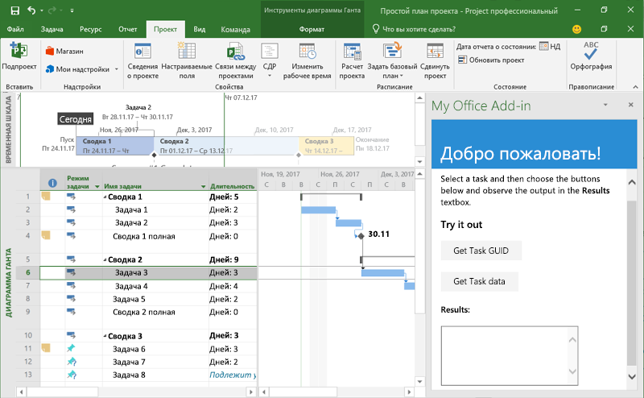
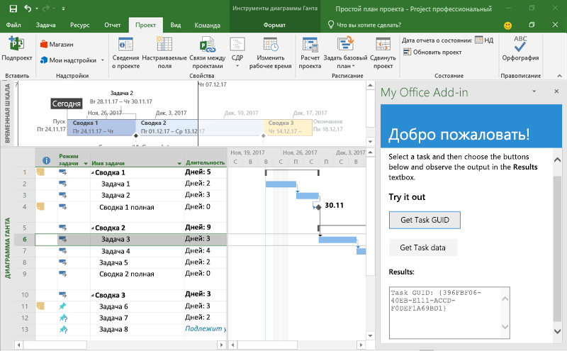

# <a name="build-your-first-project-add-in"></a>Создание первой надстройки Project

В этой статье мы разберем, как создать надстройку Project, используя jQuery и API JavaScript для Office.

## <a name="prerequisites"></a>Необходимые компоненты

- [Node.js](https://nodejs.org)

- Глобально установите последнюю версию [Yeoman](https://github.com/yeoman/yo) и [генератор Yeoman для надстроек Office](https://github.com/OfficeDev/generator-office).

    ```bash
    npm install -g yo generator-office
    ```

## <a name="create-the-add-in"></a>Создание надстройки

1. С помощью генератора Yeoman создайте проект надстройки Project. Выполните приведенную ниже команду и ответьте на вопросы, как показано ниже.

    ```bash
    yo office
    ```

    - **Выберите тип проекта:** `Office Add-in project using Jquery framework`
    - **Выберите тип сценария:** `Javascript`
    - **Как вы хотите назвать надстройку?** `My Office Add-in`
    - **Какое клиентское приложение Office должно поддерживаться?** `Project`

    
    
    После завершения работы мастера генератор создаст проект и установит вспомогательные компоненты Node.
    
2. Перейдите к корневой папке проекта.

    ```bash
    cd "My Office Add-in"
    ```

## <a name="update-the-code"></a>Обновление кода

1. В редакторе кода откройте файл **index.html** из корневой папки проекта. Этот файл содержит HTML-контент, который будет отображаться в области задач надстройки.

2. Замените элемент `<body>` приведенным ниже исправлением.

    ```html
    <body class="ms-font-m ms-welcome">
        <div id="content-header">
            <div class="padding">
                <h1>Welcome</h1>
            </div>
        </div>
        <div id="content-main">
            <div class="padding">
                <p>Select a task and then choose the buttons below and observe the output in the <b>Results</b> textbox.</p>
                <h3>Try it out</h3>
                <button class="ms-Button" id="get-task-guid">Get Task GUID</button>
                <br/><br/>
                <button class="ms-Button" id="get-task">Get Task data</button>
                <br/>
                <h4>Results:</h4>
                <textarea id="result" rows="6" cols="25"></textarea>
            </div>
        </div>
        <script type="text/javascript" src="node_modules/jquery/dist/jquery.js"></script>
        <script type="text/javascript" src="node_modules/office-ui-fabric-js/dist/js/fabric.js"></script>
    </body>
    ```

3. Откройте файл **src/index.js**, чтобы указать скрипт для надстройки. Замените все его содержимое приведенным ниже кодом и сохраните файл.

    ```js
    'use strict';

    (function () {

        var taskGuid;

        // The initialize function must be run each time a new page is loaded
        Office.initialize = function (reason) {
            $(document).ready(function () {
                $('#get-task-guid').click(getTaskGUID);
                $('#get-task').click(getTask);
            });
        };

        function getTaskGUID() {
            Office.context.document.getSelectedTaskAsync(function (asyncResult) {
                if (asyncResult.status == Office.AsyncResultStatus.Succeeded) {
                    result.value = "Task GUID: " + asyncResult.value;
                    taskGuid = asyncResult.value;
                }
                else {
                    console.log(asyncResult.error.message);
                }
            });
        }

        function getTask() {
            if (taskGuid != undefined) {
                Office.context.document.getTaskAsync(
                    taskGuid,
                    function (asyncResult) {
                        if (asyncResult.status === Office.AsyncResultStatus.Succeeded) {
                            var taskInfo = asyncResult.value;
                            var taskOutput = "Task name: " + taskInfo.taskName +
                                            "\nGUID: " + taskGuid +
                                            "\nWSS Id: " + taskInfo.wssTaskId +
                                            "\nResource names: " + taskInfo.resourceNames;
                            result.value = taskOutput;
                        } else {
                            console.log(asyncResult.error.message);
                        }
                    }
                );
            } else {
                result.value = 'Task GUID not valid:\n' + taskGuid;
            } 
        }
    })();
    ```

4. Откройте файл **app.css** в корневой папке проекта, чтобы указать специальные стили для надстройки. Замените все его содержимое на приведенный ниже код и сохраните файл.

    ```css
    #content-header {
        background: #2a8dd4;
        color: #fff;
        position: absolute;
        top: 0;
        left: 0;
        width: 100%;
        height: 80px; 
        overflow: hidden;
    }

    #content-main {
        background: #fff;
        position: fixed;
        top: 80px;
        left: 0;
        right: 0;
        bottom: 0;
        overflow: auto; 
    }

    .padding {
        padding: 15px;
    }
    ```

## <a name="update-the-manifest"></a>Обновление манифеста

1. Откройте файл **manifest.xml**, чтобы определить параметры и возможности надстройки.

2. Элемент `ProviderName` содержит заполнитель. Замените его на свое имя.

3. Атрибут `DefaultValue` элемента `Description` содержит заполнитель. Замените его строкой **Надстройка области задач для Project**.

4. Сохраните файл.

    ```xml
    ...
    <ProviderName>John Doe</ProviderName>
    <DefaultLocale>en-US</DefaultLocale>
    <!-- The display name of your add-in. Used on the store and various places of the Office UI such as the add-ins dialog. -->
    <DisplayName DefaultValue="My Office Add-in" />
    <Description DefaultValue="A task pane add-in for Project"/>
    ...
    ```

## <a name="start-the-dev-server"></a>Запуск сервера разработки

[!include[Start server section](../includes/quickstart-yo-start-server.md)] 

## <a name="try-it-out"></a>Проверка

1. Создайте простой проект Project, содержащий по крайней мере одну задачу.

2. Следуя указаниям для нужной платформы, загрузите неопубликованную надстройку в Project.

    - [Windows](../testing/create-a-network-shared-folder-catalog-for-task-pane-and-content-add-ins.md)
    - [Office Online](../testing/sideload-office-add-ins-for-testing.md#sideload-an-office-add-in-in-office-online)
    - [iPad и Mac](../testing/sideload-an-office-add-in-on-ipad-and-mac.md)

3. Выберите задачу в Project.

    

4. В области задач нажмите кнопку **Get Task GUID**, чтобы записать GUID задачи в поле **Results**.

    

5. В области задач нажмите кнопку **Get Task data**, чтобы записать несколько свойств выбранной задачи в поле **Results**.

    

## <a name="next-steps"></a>Дальнейшие действия

Поздравляем, вы успешно создали надстройку Project! Следующим шагом узнайте больше о возможностях надстроек Project и изучите распространенные сценарии.

> [!div class="nextstepaction"]
> [Надстройки Project](../project/project-add-ins.md)
