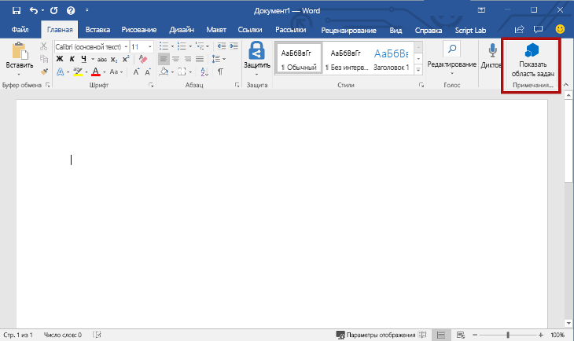
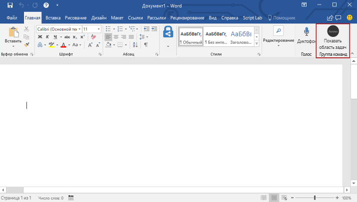
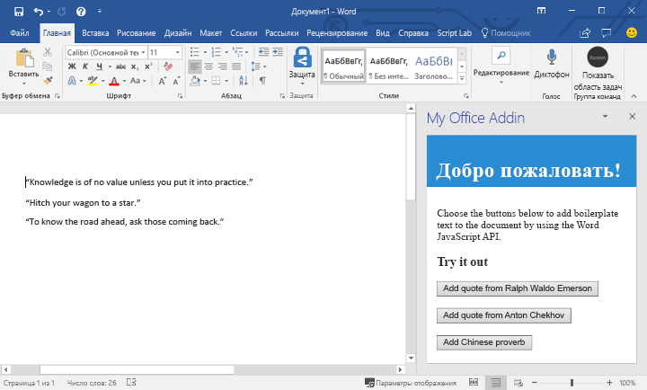

# <a name="build-your-first-word-add-in"></a><span data-ttu-id="40e1e-101">Создание первой надстройки Word</span><span class="sxs-lookup"><span data-stu-id="40e1e-101">Build your first Word add-in</span></span>

<span data-ttu-id="40e1e-102">_Относится к: Word 2016, Word для iPad, Word для Mac_</span><span class="sxs-lookup"><span data-stu-id="40e1e-102">_Applies to: Word 2016, Word for iPad, Word for Mac_</span></span>

<span data-ttu-id="40e1e-103">В этой статье мы разберем, как создать надстройку Word, используя jQuery и API JavaScript для Word.</span><span class="sxs-lookup"><span data-stu-id="40e1e-103">In this article, you'll walk through the process of building a Word add-in by using jQuery and the Word JavaScript API.</span></span> 

## <a name="create-the-add-in"></a><span data-ttu-id="40e1e-104">Создание надстройки</span><span class="sxs-lookup"><span data-stu-id="40e1e-104">Create the add-in</span></span> 

[!include[Choose your editor](../includes/quickstart-choose-editor.md)]

# <a name="visual-studiotabvisual-studio"></a>[<span data-ttu-id="40e1e-105">Visual Studio</span><span class="sxs-lookup"><span data-stu-id="40e1e-105">Visual Studio</span></span>](#tab/visual-studio)

### <a name="prerequisites"></a><span data-ttu-id="40e1e-106">Необходимые компоненты</span><span class="sxs-lookup"><span data-stu-id="40e1e-106">Prerequisites</span></span>

[!include[Quick Start prerequisites](../includes/quickstart-vs-prerequisites.md)]

### <a name="create-the-add-in-project"></a><span data-ttu-id="40e1e-107">Создание проекта надстройки</span><span class="sxs-lookup"><span data-stu-id="40e1e-107">Create the add-in project</span></span>

1. <span data-ttu-id="40e1e-108">В строке меню Visual Studio выберите **Файл** > **Создать** > **Проект**.</span><span class="sxs-lookup"><span data-stu-id="40e1e-108">On the Visual Studio menu bar, choose  **File** > **New** > **Project**.</span></span>
    
2. <span data-ttu-id="40e1e-109">В списке типов проекта разверните узел **Visual C#** или **Visual Basic**, разверните **Office/SharePoint**, а затем выберите **Надстройки** > **Веб-надстройка Word**.</span><span class="sxs-lookup"><span data-stu-id="40e1e-109">In the list of project types under **Visual C#** or **Visual Basic**, expand  **Office/SharePoint**, choose **Add-ins**, and then choose **Word Web Add-in** as the project type.</span></span> 

3. <span data-ttu-id="40e1e-110">Укажите имя проекта и нажмите кнопку **ОК**.</span><span class="sxs-lookup"><span data-stu-id="40e1e-110">Name the project, and then choose **OK**.</span></span>

4. <span data-ttu-id="40e1e-p101">Visual Studio создаст решение, и в **обозревателе решений** появятся два соответствующих проекта. В Visual Studio откроется файл **Home.html**.</span><span class="sxs-lookup"><span data-stu-id="40e1e-p101">Visual Studio creates a solution and its two projects appear in **Solution Explorer**. The **Home.html** file opens in Visual Studio.</span></span>
    
### <a name="explore-the-visual-studio-solution"></a><span data-ttu-id="40e1e-113">Обзор решения Visual Studio</span><span class="sxs-lookup"><span data-stu-id="40e1e-113">Explore the Visual Studio solution</span></span>

[!include[Description of Visual Studio projects](../includes/quickstart-vs-solution.md)]

### <a name="update-the-code"></a><span data-ttu-id="40e1e-114">Обновление кода</span><span class="sxs-lookup"><span data-stu-id="40e1e-114">Update the code</span></span>

1. <span data-ttu-id="40e1e-p102">Файл **Home.html** содержит HTML-содержимое, которое будет отображаться в области задач надстройки. В файле **Home.html** замените элемент `<body>` на приведенную ниже часть кода и сохраните файл.</span><span class="sxs-lookup"><span data-stu-id="40e1e-p102">**Home.html** specifies the HTML that will be rendered in the add-in's task pane. In **Home.html**, replace the `<body>` element with the following markup and save the file.</span></span>
 
    ```html
    <body>
        <div id="content-header">
            <div class="padding">
                <h1>Welcome</h1>
            </div>
        </div>    
        <div id="content-main">
            <div class="padding">
                <p>Choose the buttons below to add boilerplate text to the document by using the Word JavaScript API.</p>
                <br />
                <h3>Try it out</h3>
                <button id="emerson">Add quote from Ralph Waldo Emerson</button>
                <br /><br />
                <button id="checkhov">Add quote from Anton Chekhov</button>
                <br /><br />
                <button id="proverb">Add Chinese proverb</button>
            </div>
        </div>
        <br />
        <div id="supportedVersion"/>
    </body>
    ```

2. <span data-ttu-id="40e1e-p103">Откройте файл **Home.js** в корневой папке проекта веб-приложения. Этот файл содержит скрипт надстройки. Замените все его содержимое указанным ниже кодом и сохраните файл.</span><span class="sxs-lookup"><span data-stu-id="40e1e-p103">Open the file **Home.js** in the root of the web application project. This file specifies the script for the add-in. Replace the entire contents with the following code and save the file.</span></span>

    ```js
    'use strict';
    
    (function () {

        // The initialize function is run each time the page is loaded.
        Office.initialize = function (reason) {
            $(document).ready(function () {

                // Use this to check whether the API is supported in the Word client.
                if (Office.context.requirements.isSetSupported('WordApi', 1.1)) {
                    // Do something that is only available via the new APIs
                    $('#emerson').click(insertEmersonQuoteAtSelection);
                    $('#checkhov').click(insertChekhovQuoteAtTheBeginning);
                    $('#proverb').click(insertChineseProverbAtTheEnd);
                    $('#supportedVersion').html('This code is using Word 2016 or later.');
                }
                else {
                    // Just letting you know that this code will not work with your version of Word.
                    $('#supportedVersion').html('This code requires Word 2016 or later.');
                }
            });
        };

        function insertEmersonQuoteAtSelection() {
            Word.run(function (context) {

                // Create a proxy object for the document.
                var thisDocument = context.document;

                // Queue a command to get the current selection.
                // Create a proxy range object for the selection.
                var range = thisDocument.getSelection();

                // Queue a command to replace the selected text.
                range.insertText('"Hitch your wagon to a star."\n', Word.InsertLocation.replace);

                // Synchronize the document state by executing the queued commands,
                // and return a promise to indicate task completion.
                return context.sync().then(function () {
                    console.log('Added a quote from Ralph Waldo Emerson.');
                });
            })
            .catch(function (error) {
                console.log('Error: ' + JSON.stringify(error));
                if (error instanceof OfficeExtension.Error) {
                    console.log('Debug info: ' + JSON.stringify(error.debugInfo));
                }
            });
        }

        function insertChekhovQuoteAtTheBeginning() {
            Word.run(function (context) {

                // Create a proxy object for the document body.
                var body = context.document.body;

                // Queue a command to insert text at the start of the document body.
                body.insertText('"Knowledge is of no value unless you put it into practice."\n', Word.InsertLocation.start);

                // Synchronize the document state by executing the queued commands,
                // and return a promise to indicate task completion.
                return context.sync().then(function () {
                    console.log('Added a quote from Anton Chekhov.');
                });
            })
            .catch(function (error) {
                console.log('Error: ' + JSON.stringify(error));
                if (error instanceof OfficeExtension.Error) {
                    console.log('Debug info: ' + JSON.stringify(error.debugInfo));
                }
            });
        }

        function insertChineseProverbAtTheEnd() {
            Word.run(function (context) {

                // Create a proxy object for the document body.
                var body = context.document.body;

                // Queue a command to insert text at the end of the document body.
                body.insertText('"To know the road ahead, ask those coming back."\n', Word.InsertLocation.end);

                // Synchronize the document state by executing the queued commands,
                // and return a promise to indicate task completion.
                return context.sync().then(function () {
                    console.log('Added a quote from a Chinese proverb.');
                });
            })
            .catch(function (error) {
                console.log('Error: ' + JSON.stringify(error));
                if (error instanceof OfficeExtension.Error) {
                    console.log('Debug info: ' + JSON.stringify(error.debugInfo));
                }
            });
        }
    })();
    ```

3. <span data-ttu-id="40e1e-p104">Откройте файл **Home.css** в корневой папке проекта веб-приложения. Этот файл определяет специальные стили надстройки. Замените все его содержимое указанным ниже кодом и сохраните файл.</span><span class="sxs-lookup"><span data-stu-id="40e1e-p104">Open the file **Home.css** in the root of the web application project. This file specifies the custom styles for the add-in. Replace the entire contents with the following code and save the file.</span></span>

    ```css
    #content-header {
        background: #2a8dd4;
        color: #fff;
        position: absolute;
        top: 0;
        left: 0;
        width: 100%;
        height: 80px; 
        overflow: hidden;
    }

    #content-main {
        background: #fff;
        position: fixed;
        top: 80px;
        left: 0;
        right: 0;
        bottom: 0;
        overflow: auto; 
    }

    .padding {
        padding: 15px;
    }
    ```

### <a name="update-the-manifest"></a><span data-ttu-id="40e1e-123">Обновление манифеста</span><span class="sxs-lookup"><span data-stu-id="40e1e-123">Update the manifest</span></span>

1. <span data-ttu-id="40e1e-p105">Откройте XML-файл манифеста в проекте надстройки. Этот файл определяет параметры и возможности надстройки.</span><span class="sxs-lookup"><span data-stu-id="40e1e-p105">Open the XML manifest file in the add-in project. This file defines the add-in's settings and capabilities.</span></span>

2. <span data-ttu-id="40e1e-p106">Элемент `ProviderName` содержит значение заполнителя. Замените его на свое имя.</span><span class="sxs-lookup"><span data-stu-id="40e1e-p106">The `ProviderName` element has a placeholder value. Replace it with your name.</span></span>

3. <span data-ttu-id="40e1e-p107">Атрибут `DefaultValue` элемента `DisplayName` содержит заполнитель. Замените его на строку **Моя надстройка Office**.</span><span class="sxs-lookup"><span data-stu-id="40e1e-p107">The `DefaultValue` attribute of the `DisplayName` element has a placeholder. Replace it with **My Office Add-in**.</span></span>

4. <span data-ttu-id="40e1e-p108">Атрибут `DefaultValue` элемента `Description` содержит заполнитель. Замените его на строку **Надстройка области задач для Excel**.</span><span class="sxs-lookup"><span data-stu-id="40e1e-p108">The `DefaultValue` attribute of the `Description` element has a placeholder. Replace it with **A task pane add-in for Word**.</span></span>

5. <span data-ttu-id="40e1e-132">Сохраните файл.</span><span class="sxs-lookup"><span data-stu-id="40e1e-132">Save the file.</span></span>

    ```xml
    ...
    <ProviderName>John Doe</ProviderName>
    <DefaultLocale>en-US</DefaultLocale>
    <!-- The display name of your add-in. Used on the store and various places of the Office UI such as the add-ins dialog. -->
    <DisplayName DefaultValue="My Office Add-in" />
    <Description DefaultValue="A task pane add-in for Word"/>
    ...
    ```

### <a name="try-it-out"></a><span data-ttu-id="40e1e-133">Проверка</span><span class="sxs-lookup"><span data-stu-id="40e1e-133">Try it out</span></span>

1. <span data-ttu-id="40e1e-p109">Протестируйте новую надстройку Word в Visual Studio, нажав на клавишу F5 или кнопку **Пуск**, чтобы запустить Word с отображаемой в ленте кнопкой надстройки **Показать область задач**. Надстройка будет размещена на локальном сервере IIS.</span><span class="sxs-lookup"><span data-stu-id="40e1e-p109">Using Visual Studio, test the newly created Word add-in by pressing F5 or choosing the **Start** button to launch Word with the **Show Taskpane** add-in button displayed in the ribbon. The add-in will be hosted locally on IIS.</span></span>

2. <span data-ttu-id="40e1e-p110">В Word перейдите на вкладку **Главная**, а затем нажмите на имеющуюся в лене кнопку **Показать область задач**, чтобы открыть область задач надстройки. (При использовании версии Office 2016 без подписки вместо версии Office 365 настраиваемые кнопки не поддерживаются. Вместо этого в ней происходит незамедлительное отображение области задач).</span><span class="sxs-lookup"><span data-stu-id="40e1e-p110">In Word, choose the **Home** tab, and then choose the **Show Taskpane** button in the ribbon to open the add-in task pane. (If you are using the non-subscription version of Office 2016, instead of the Office 365 version, then custom buttons are not supported. Instead, the task pane will open immediately.)</span></span>

    

3. <span data-ttu-id="40e1e-140">В области задач нажмите любую кнопку, чтобы добавить стандартный текст в документ.</span><span class="sxs-lookup"><span data-stu-id="40e1e-140">In the task pane, choose any of the buttons to add boilerplate text to the document.</span></span>

    

# <a name="any-editortabvisual-studio-code"></a>[<span data-ttu-id="40e1e-142">Любой редактор</span><span class="sxs-lookup"><span data-stu-id="40e1e-142">Any editor</span></span>](#tab/visual-studio-code)

### <a name="prerequisites"></a><span data-ttu-id="40e1e-143">Необходимые компоненты</span><span class="sxs-lookup"><span data-stu-id="40e1e-143">Prerequisites</span></span>

- [<span data-ttu-id="40e1e-144">Node.js</span><span class="sxs-lookup"><span data-stu-id="40e1e-144">Node.js</span></span>](https://nodejs.org)

- <span data-ttu-id="40e1e-145">Глобально установите последнюю версию [Yeoman](https://github.com/yeoman/yo) и [генератор Yeoman для надстроек Office](https://github.com/OfficeDev/generator-office).</span><span class="sxs-lookup"><span data-stu-id="40e1e-145">Install the latest version of [Yeoman](https://github.com/yeoman/yo) and the [Yeoman generator for Office Add-ins](https://github.com/OfficeDev/generator-office) globally.</span></span>

    ```bash
    npm install -g yo generator-office
    ```

### <a name="create-the-add-in-project"></a><span data-ttu-id="40e1e-146">Создание проекта надстройки</span><span class="sxs-lookup"><span data-stu-id="40e1e-146">Create the add-in project</span></span>

1. <span data-ttu-id="40e1e-p111">Используйте генератор Yeoman для создания проекта надстройки Word. Запустите указанную ниже команду, после чего ответьте на предлагаемые вопросы следующим образом:</span><span class="sxs-lookup"><span data-stu-id="40e1e-p111">Use the Yeoman generator to create a Word add-in project. Run the following command and then answer the prompts as follows:</span></span>

    ```bash
    yo office
    ```

    - <span data-ttu-id="40e1e-149">**Выберите тип проекта:** `Office Add-in project using Jquery framework`</span><span class="sxs-lookup"><span data-stu-id="40e1e-149">**Choose a project type:** `Office Add-in project using Jquery framework`</span></span>
    - <span data-ttu-id="40e1e-150">**Выберите тип сценария:** `Javascript`</span><span class="sxs-lookup"><span data-stu-id="40e1e-150">**Choose a script type:** `Javascript`</span></span>
    - <span data-ttu-id="40e1e-151">**Как вы хотите назвать надстройку?:** `My Office Add-in`</span><span class="sxs-lookup"><span data-stu-id="40e1e-151">**What do you want to name your add-in?:** `My Office Add-in`</span></span>
    - <span data-ttu-id="40e1e-152">**Какое клиентское приложение Office должно поддерживаться?** `Word`</span><span class="sxs-lookup"><span data-stu-id="40e1e-152">**Which Office client application would you like to support?:** `Word`</span></span>

    
    
    <span data-ttu-id="40e1e-154">После завершения работы мастера генератор создаст проект и установит поддерживающие компоненты узла.</span><span class="sxs-lookup"><span data-stu-id="40e1e-154">After you complete the wizard, the generator will create the project and install supporting Node components.</span></span>
    
2. <span data-ttu-id="40e1e-155">Перейдите в корневую папку проекта.</span><span class="sxs-lookup"><span data-stu-id="40e1e-155">Navigate to the root folder of the web application project.</span></span>

    ```bash
    cd "My Office Add-in"
    ```

### <a name="update-the-code"></a><span data-ttu-id="40e1e-156">Обновление кода</span><span class="sxs-lookup"><span data-stu-id="40e1e-156">Update the code</span></span>

1. <span data-ttu-id="40e1e-p112">В редакторе кода откройте файл **index.html**, имеющийся в корневой папке проекта. Этот файл содержит HTML-содержимое, которое будет отображаться в области задач надстройки.</span><span class="sxs-lookup"><span data-stu-id="40e1e-p112">In your code editor, open **index.html** in the root of the project. This file contains the HTML that will be rendered in the add-in's task pane.</span></span> 

2. <span data-ttu-id="40e1e-159">Замените элемент `<body>` следующей разметкой и сохраните файл.</span><span class="sxs-lookup"><span data-stu-id="40e1e-159">Replace the `<body>` element inside the  element with the following markup and save the file.</span></span>

    ```html
    <body>
        <div id="content-header">
            <div class="padding">
                <h1>Welcome</h1>
            </div>
        </div>
        <div id="content-main">
            <div class="padding">
                <p>Choose the buttons below to add boilerplate text to the document by using the Word JavaScript API.</p>
                <br />
                <h3>Try it out</h3>
                <button id="emerson">Add quote from Ralph Waldo Emerson</button>
                <br /><br />
                <button id="checkhov">Add quote from Anton Chekhov</button>
                <br /><br />
                <button id="proverb">Add Chinese proverb</button>
            </div>
        </div>
        <br />
        <div id="supportedVersion" />
        <script type="text/javascript" src="node_modules/jquery/dist/jquery.js"></script>
        <script type="text/javascript" src="node_modules/office-ui-fabric-js/dist/js/fabric.js"></script>
    </body>
    ```

2. <span data-ttu-id="40e1e-p113">Откройте файл **src/index.js**, чтобы указать сценарий надстройки. Замените все содержимое следующим кодом и сохраните файл. Этот сценарий содержит код инициализации, а также код, который вносит изменения в документ Word, путем вставки текста в документ при выборе кнопки.</span><span class="sxs-lookup"><span data-stu-id="40e1e-p113">Open the file **src/index.js** to specify the script for the add-in. Replace the entire contents with the following code and save the file. This script contains initialization code as well as the code that makes changes to the Word document, by inserting text into the document when a button is chosen.</span></span> 

    ```js
    'use strict';
    
    (function () {

        // The initialize function is run each time the page is loaded.
        Office.initialize = function (reason) {
            $(document).ready(function () {

                // Use this to check whether the API is supported in the Word client.
                if (Office.context.requirements.isSetSupported('WordApi', 1.1)) {
                    // Do something that is only available via the new APIs
                    $('#emerson').click(insertEmersonQuoteAtSelection);
                    $('#checkhov').click(insertChekhovQuoteAtTheBeginning);
                    $('#proverb').click(insertChineseProverbAtTheEnd);
                    $('#supportedVersion').html('This code is using Word 2016 or later.');
                }
                else {
                    // Just letting you know that this code will not work with your version of Word.
                    $('#supportedVersion').html('This code requires Word 2016 or later.');
                }
            });
        };

        function insertEmersonQuoteAtSelection() {
            Word.run(function (context) {

                // Create a proxy object for the document.
                var thisDocument = context.document;

                // Queue a command to get the current selection.
                // Create a proxy range object for the selection.
                var range = thisDocument.getSelection();

                // Queue a command to replace the selected text.
                range.insertText('"Hitch your wagon to a star."\n', Word.InsertLocation.replace);

                // Synchronize the document state by executing the queued commands,
                // and return a promise to indicate task completion.
                return context.sync().then(function () {
                    console.log('Added a quote from Ralph Waldo Emerson.');
                });
            })
            .catch(function (error) {
                console.log('Error: ' + JSON.stringify(error));
                if (error instanceof OfficeExtension.Error) {
                    console.log('Debug info: ' + JSON.stringify(error.debugInfo));
                }
            });
        }

        function insertChekhovQuoteAtTheBeginning() {
            Word.run(function (context) {

                // Create a proxy object for the document body.
                var body = context.document.body;

                // Queue a command to insert text at the start of the document body.
                body.insertText('"Knowledge is of no value unless you put it into practice."\n', Word.InsertLocation.start);

                // Synchronize the document state by executing the queued commands,
                // and return a promise to indicate task completion.
                return context.sync().then(function () {
                    console.log('Added a quote from Anton Chekhov.');
                });
            })
            .catch(function (error) {
                console.log('Error: ' + JSON.stringify(error));
                if (error instanceof OfficeExtension.Error) {
                    console.log('Debug info: ' + JSON.stringify(error.debugInfo));
                }
            });
        }

        function insertChineseProverbAtTheEnd() {
            Word.run(function (context) {

                // Create a proxy object for the document body.
                var body = context.document.body;

                // Queue a command to insert text at the end of the document body.
                body.insertText('"To know the road ahead, ask those coming back."\n', Word.InsertLocation.end);

                // Synchronize the document state by executing the queued commands,
                // and return a promise to indicate task completion.
                return context.sync().then(function () {
                    console.log('Added a quote from a Chinese proverb.');
                });
            })
            .catch(function (error) {
                console.log('Error: ' + JSON.stringify(error));
                if (error instanceof OfficeExtension.Error) {
                    console.log('Debug info: ' + JSON.stringify(error.debugInfo));
                }
            });
        }
    })();
    ```

3. <span data-ttu-id="40e1e-p114">Откройте файл **app.css** в корневой папке проекта, чтобы указать настраиваемые стили для надстройки. Замените все его содержимое указанным ниже кодом и сохраните файл.</span><span class="sxs-lookup"><span data-stu-id="40e1e-p114">Open the file **app.css** in the root of the project to specify the custom styles for the add-in. Replace the entire contents with the following and save the file.</span></span>

    ```css
    #content-header {
        background: #2a8dd4;
        color: #fff;
        position: absolute;
        top: 0;
        left: 0;
        width: 100%;
        height: 80px; 
        overflow: hidden;
    }

    #content-main {
        background: #fff;
        position: fixed;
        top: 80px;
        left: 0;
        right: 0;
        bottom: 0;
        overflow: auto; 
    }

    .padding {
        padding: 15px;
    }
    ```

### <a name="update-the-manifest"></a><span data-ttu-id="40e1e-165">Обновление манифеста</span><span class="sxs-lookup"><span data-stu-id="40e1e-165">Update the manifest</span></span>

1. <span data-ttu-id="40e1e-166">Откройте файл **manifest.xml**, чтобы определить параметры и возможности надстройки.</span><span class="sxs-lookup"><span data-stu-id="40e1e-166">Open the file **my-office-add-in-manifest.xml** to define the add-in's settings and capabilities.</span></span>

2. <span data-ttu-id="40e1e-p115">Элемент `ProviderName` содержит значение заполнителя. Замените его своим именем.</span><span class="sxs-lookup"><span data-stu-id="40e1e-p115">The `ProviderName` element has a placeholder value. Replace it with your name.</span></span>

3. <span data-ttu-id="40e1e-p116">Атрибут `DefaultValue` элемента `Description` содержит заполнитель. Замените его на строку **Надстройка области задач для Word**.</span><span class="sxs-lookup"><span data-stu-id="40e1e-p116">The `DefaultValue` attribute of the `Description` element has a placeholder. Replace it with **A task pane add-in for Word**.</span></span>

4. <span data-ttu-id="40e1e-171">Сохраните файл.</span><span class="sxs-lookup"><span data-stu-id="40e1e-171">Save the file.</span></span>

    ```xml
    ...
    <ProviderName>John Doe</ProviderName>
    <DefaultLocale>en-US</DefaultLocale>
    <!-- The display name of your add-in. Used on the store and various places of the Office UI such as the add-ins dialog. -->
    <DisplayName DefaultValue="My Office Add-in" />
    <Description DefaultValue="A task pane add-in for Word"/>
    ...
    ```

### <a name="start-the-dev-server"></a><span data-ttu-id="40e1e-172">Запуск сервера разработки</span><span class="sxs-lookup"><span data-stu-id="40e1e-172">Start the dev server</span></span>

[!include[Start server section](../includes/quickstart-yo-start-server.md)] 

### <a name="try-it-out"></a><span data-ttu-id="40e1e-173">Проверка</span><span class="sxs-lookup"><span data-stu-id="40e1e-173">Try it out</span></span>

1. <span data-ttu-id="40e1e-174">Следуйте инструкциям для нужной платформы, чтобы загрузить неопубликованную надстройку в Word.</span><span class="sxs-lookup"><span data-stu-id="40e1e-174">To sideload the add-in within Word, follow the instructions for the platform you'll use to run your add-in.</span></span>

    - <span data-ttu-id="40e1e-175">Windows: [загрузка неопубликованных надстроек Office в Windows](../testing/create-a-network-shared-folder-catalog-for-task-pane-and-content-add-ins.md)</span><span class="sxs-lookup"><span data-stu-id="40e1e-175">Windows: [Sideload Office Add-ins on Windows](../testing/create-a-network-shared-folder-catalog-for-task-pane-and-content-add-ins.md)</span></span>
    - <span data-ttu-id="40e1e-176">Word Online: [Загрузка неопубликованных надстроек Office в Office Online](../testing/sideload-office-add-ins-for-testing.md#sideload-an-office-add-in-on-office-online)</span><span class="sxs-lookup"><span data-stu-id="40e1e-176">Word Online: [Sideload Office Add-ins in Office Online](../testing/sideload-office-add-ins-for-testing.md#sideload-an-office-add-in-on-office-online)</span></span>
    - <span data-ttu-id="40e1e-177">iPad and Mac: [Загрузка неопубликованных надстроек Office на iPad и Mac](../testing/sideload-an-office-add-in-on-ipad-and-mac.md)</span><span class="sxs-lookup"><span data-stu-id="40e1e-177">iPad and Mac: [Sideload Office Add-ins on iPad and Mac](../testing/sideload-an-office-add-in-on-ipad-and-mac.md)</span></span>

2. <span data-ttu-id="40e1e-178">В Word выберите вкладку **Главная** и нажмите кнопку **Показать область задач** на ленте, чтобы открыть область задач надстройки.</span><span class="sxs-lookup"><span data-stu-id="40e1e-178">In Word, choose the **Home** tab, and then choose the **Show Taskpane** button in the ribbon to open the add-in task pane.</span></span>

    

3. <span data-ttu-id="40e1e-180">В области задач нажмите любую кнопку, чтобы добавить стандартный текст в документ.</span><span class="sxs-lookup"><span data-stu-id="40e1e-180">In the task pane, choose any of the buttons to add boilerplate text to the document.</span></span>

    

---

## <a name="next-steps"></a><span data-ttu-id="40e1e-182">Дальнейшие действия</span><span class="sxs-lookup"><span data-stu-id="40e1e-182">Next steps</span></span>

<span data-ttu-id="40e1e-p117">Поздравляем, вы успешно создали надстройку Excel с помощью jQuery! Чтобы узнать больше о возможностях надстроек Excel и создать более сложную надстройку, воспользуйтесь руководством по надстройкам Excel.</span><span class="sxs-lookup"><span data-stu-id="40e1e-p117">Congratulations, you've successfully created a Word add-in using jQuery! Next, learn more about the capabilities of a Word add-in and build a more complex add-in by following along with the Word add-in tutorial.</span></span>

> [!div class="nextstepaction"]
> [<span data-ttu-id="40e1e-185">Руководство по надстройкам Word</span><span class="sxs-lookup"><span data-stu-id="40e1e-185">Word add-in tutorial</span></span>](../tutorials/word-tutorial.yml)

## <a name="see-also"></a><span data-ttu-id="40e1e-186">См. также</span><span class="sxs-lookup"><span data-stu-id="40e1e-186">See also</span></span>

* [<span data-ttu-id="40e1e-187">Обзор надстроек Word</span><span class="sxs-lookup"><span data-stu-id="40e1e-187">Word add-ins overview</span></span>](../word/word-add-ins-programming-overview.md)
* [<span data-ttu-id="40e1e-188">Примеры кода надстроек Word</span><span class="sxs-lookup"><span data-stu-id="40e1e-188">Word add-in code samples</span></span>](https://developer.microsoft.com/en-us/office/gallery/?filterBy=Samples,Word)
* [<span data-ttu-id="40e1e-189">Справочник по API JavaScript для Word</span><span class="sxs-lookup"><span data-stu-id="40e1e-189">Word JavaScript API reference</span></span>](https://docs.microsoft.com/office/dev/add-ins/reference/overview/word-add-ins-reference-overview?view=office-js)
