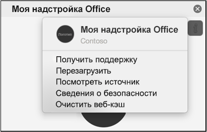

Как правило, надстройки кэшируются в Office для Mac по соображениям производительности. Как правило, для очистки кэша необходимо перезагрузить надстройку. Если в одном документе есть несколько надстроек, процесс автоматической очистки кэша при перезагрузке может быть ненадежным.

Вы можете очистить кэш с помощью меню "личные" любой надстройки области задач.
- Выберите меню личные данные. Затем выберите **очистить веб-кэш**.
    > [!NOTE]
    > Для просмотра меню "личные" необходимо запустить macOS версии 10.13.6 или более поздней версии.
    
    

Кроме того, можно очистить кэш вручную, удалив содержимое `~/Library/Containers/com.Microsoft.OsfWebHost/Data/` папки.

> [!NOTE]
> Если эта папка не существует, проверьте наличие следующих папок и, если она найдена, удалите содержимое папки:
>    - `~/Library/Containers/com.microsoft.{host}/Data/Library/Caches/`где `{host}` находится ведущее приложение Office (например, `Excel`);
>    - `com.microsoft.Office365ServiceV2/Data/Caches/com.microsoft.Office365ServiceV2/`
