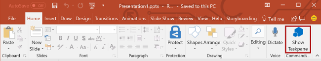

В этом разделе руководства описывается, как настроить пользовательский интерфейс области задач.

> [!NOTE]
> Это один из разделов руководства по надстройкам PowerPoint. Если вы перешли на эту страницу со страницы результатов поисковой системы или по другой прямой ссылке, перейдите на вводную страницу [руководства по надстройкам PowerPoint](../tutorials/powerpoint-tutorial.yml), чтобы начать обучение с самого начала.

## <a name="customize-the-task-pane-ui"></a>Настройка пользовательского интерфейса области задач 

1. В файле **Home.html** замените `TODO2` приведенным ниже кодом, чтобы добавить раздел верхнего колонтитула и заголовок в область задач. Примечание.

    - Стили, которые начинаются с `ms-`, относятся к стилям [Office UI Fabric](../design/office-ui-fabric.md), интерфейсной платформы JavaScript для создания функциональных возможностей Office и Office 365. Файл **Home.html** включает ссылку на таблицу стилей Fabric.

    ```html
    <div id="content-header">
        <div class="ms-Grid ms-bgColor-neutralPrimary">
            <div class="ms-Grid-row">
                <div class="padding ms-Grid-col ms-u-sm12 ms-u-md12 ms-u-lg12"> <div class="ms-font-xl ms-fontColor-white ms-fontWeight-semibold">My PowerPoint add-in</div></div>
            </div>
        </div>
    </div>
    ```

2. В файле **Home.html** найдите раздел **div** с `class="footer"` и удалите весь раздел **div**, чтобы удалить раздел нижнего колонтитула из области задач.

## <a name="test-the-add-in"></a>Тестирование надстройки

1. Протестируйте надстройку PowerPoint с помощью Visual Studio, нажав клавишу `F5` или кнопку **Запустить**, чтобы запустить PowerPoint с кнопкой надстройки **Show Taskpane** (Показать область задач) на ленте. Надстройка будет размещена на локальном сервере IIS.

    

2. В PowerPoint нажмите кнопку **Show Taskpane** (Показать область задач) на ленте, чтобы открыть надстройку области задач.

    

3. Обратите внимание на то, что область задач теперь содержит раздел верхнего колонтитула и заголовок и больше не содержит раздел нижнего колонтитула.

    

4. В Visual Studio остановите работу надстройки, нажав клавиши `Shift + F5` или кнопку **Остановить**. PowerPoint автоматически закроется.

    

