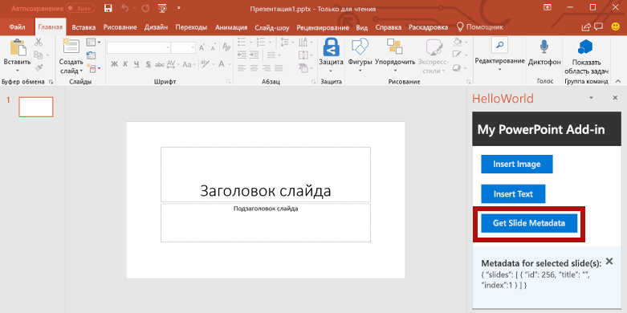

<span data-ttu-id="fe9e9-101">Из этого раздела руководства вы узнаете, как получить метаданные выбранного слайда.</span><span class="sxs-lookup"><span data-stu-id="fe9e9-101">In this step of the tutorial, you'll retrieve metadata for the selected slide.</span></span>

> [!NOTE]
> <span data-ttu-id="fe9e9-102">Это один из разделов руководства по надстройкам PowerPoint.</span><span class="sxs-lookup"><span data-stu-id="fe9e9-102">This page describes an individual step of the PowerPoint add-in tutorial.</span></span> <span data-ttu-id="fe9e9-103">Если вы перешли на эту страницу со страницы результатов поисковой системы или по другой прямой ссылке, перейдите на вводную страницу [руководства по надстройкам PowerPoint](../tutorials/powerpoint-tutorial.yml), чтобы начать обучение с самого начала.</span><span class="sxs-lookup"><span data-stu-id="fe9e9-103">If you’ve arrived at this page via search engine results or other direct link, please go to the [PowerPoint add-in tutorial](../tutorials/powerpoint-tutorial.yml) introduction page to start the tutorial from the beginning.</span></span>

## <a name="get-slide-metadata"></a><span data-ttu-id="fe9e9-104">Получение метаданных слайда</span><span class="sxs-lookup"><span data-stu-id="fe9e9-104">Get slide metadata</span></span>

1. <span data-ttu-id="fe9e9-105">В файле **Home.html** замените `TODO4` приведенным ниже кодом.</span><span class="sxs-lookup"><span data-stu-id="fe9e9-105">In the **Home.html** file, replace `TODO4` with the following markup.</span></span> <span data-ttu-id="fe9e9-106">Этот код определяет кнопку **Get Slide Metadata** (Получить метаданные слайда), которая появится в области задач надстройки.</span><span class="sxs-lookup"><span data-stu-id="fe9e9-106">This markup defines the **Get Slide Metadata** button that will appear within the add-in's task pane.</span></span>

    ```html
    <br /><br />
    <button class="ms-Button ms-Button--primary" id="get-slide-metadata">
        <span class="ms-Button-icon"><i class="ms-Icon ms-Icon--plus"></i></span>
        <span class="ms-Button-label">Get Slide Metadata</span>
        <span class="ms-Button-description">Gets metadata for the selected slide(s).</span>
    </button>
    ```

2. <span data-ttu-id="fe9e9-107">В файле **Home.js** замените `TODO6` приведенным ниже кодом, чтобы назначить обработчик событий для кнопки **Get Slide Metadata** (Получить метаданные слайда).</span><span class="sxs-lookup"><span data-stu-id="fe9e9-107">In the **Home.js** file, replace `TODO6` with the following code to assign the event handler for the **Get Slide Metadata** button.</span></span>

    ```js
    $('#get-slide-metadata').click(getSlideMetadata);
    ```

3. <span data-ttu-id="fe9e9-108">В файле **Home.js** замените `TODO7` приведенным ниже кодом, чтобы определить функцию **getSlideMetadata**.</span><span class="sxs-lookup"><span data-stu-id="fe9e9-108">In the **Home.js** file, replace `TODO7` with the following code to define the **getSlideMetadata** function.</span></span> <span data-ttu-id="fe9e9-109">Эта функция извлекает метаданные выбранных слайдов и записывает их во всплывающее диалоговое окно в области задач надстройки.</span><span class="sxs-lookup"><span data-stu-id="fe9e9-109">This function retrieves metadata for the selected slide(s) and writes it to a popup dialog window within the add-in task pane.</span></span>

    ```js
    function getSlideMetadata() {
        Office.context.document.getSelectedDataAsync(Office.CoercionType.SlideRange,
            function (asyncResult) {
                if (asyncResult.status === Office.AsyncResultStatus.Failed) {
                    showNotification("Error", asyncResult.error.message);
                } else {
                    showNotification("Metadata for selected slide(s):", JSON.stringify(asyncResult.value), null, 2);
                }
            }
        );
    }
    ```

## <a name="test-the-add-in"></a><span data-ttu-id="fe9e9-110">Тестирование надстройки</span><span class="sxs-lookup"><span data-stu-id="fe9e9-110">Test the add-in</span></span>

1. <span data-ttu-id="fe9e9-p104">Протестируйте надстройку с помощью Visual Studio, нажав клавишу `F5` или кнопку **Запустить**, чтобы запустить PowerPoint с кнопкой надстройки **Show Taskpane** (Показать область задач) на ленте. Надстройка будет размещена на локальном сервере IIS.</span><span class="sxs-lookup"><span data-stu-id="fe9e9-p104">Using Visual Studio, test the add-in by pressing `F5` or choosing the **Start** button to launch PowerPoint with the **Show Taskpane** add-in button displayed in the ribbon. The add-in will be hosted locally on IIS.</span></span>

    

2. <span data-ttu-id="fe9e9-114">В PowerPoint нажмите кнопку **Show Taskpane** (Показать область задач) на ленте, чтобы открыть надстройку области задач.</span><span class="sxs-lookup"><span data-stu-id="fe9e9-114">In PowerPoint, select the **Show Taskpane** button in the ribbon to open the add-in task pane.</span></span>

    

3. <span data-ttu-id="fe9e9-116">В области задач нажмите кнопку **Get Slide Metadata** (Получить метаданные слайда), чтобы получить метаданные выбранного слайда.</span><span class="sxs-lookup"><span data-stu-id="fe9e9-116">In the task pane, choose the **Get Slide Metadata** button to get the metadata for the selected slide.</span></span> <span data-ttu-id="fe9e9-117">Метаданные слайда записываются во всплывающее диалоговое окно в нижней части области задач.</span><span class="sxs-lookup"><span data-stu-id="fe9e9-117">The slide metadata is written to the popup dialog window at the bottom of the task pane.</span></span> <span data-ttu-id="fe9e9-118">В этом случае массив `slides` в метаданных JSON содержит один объект, в котором указаны свойства `id`, `title` и `index` выбранного слайда.</span><span class="sxs-lookup"><span data-stu-id="fe9e9-118">In this case, the `slides` array within the JSON metadata contains one object that specifies the `id`, `title`, and `index` of the selected slide.</span></span> <span data-ttu-id="fe9e9-119">Если при извлечении метаданных будет выбрано несколько слайдов, массив `slides` в метаданных JSON будет содержать один объект для каждого выбранного слайда.</span><span class="sxs-lookup"><span data-stu-id="fe9e9-119">If multiple slides had been selected when you retrieved slide metadata, the `slides` array within the JSON metadata would contain one object for each selected slide.</span></span>

    

4. <span data-ttu-id="fe9e9-121">В Visual Studio остановите работу надстройки, нажав клавиши `Shift + F5` или кнопку **Остановить**.</span><span class="sxs-lookup"><span data-stu-id="fe9e9-121">In Visual Studio, stop the add-in by pressing `Shift + F5` or choosing the **Stop** button.</span></span> <span data-ttu-id="fe9e9-122">PowerPoint автоматически закроется.</span><span class="sxs-lookup"><span data-stu-id="fe9e9-122">PowerPoint will automatically close when the add-in is stopped.</span></span>

    
