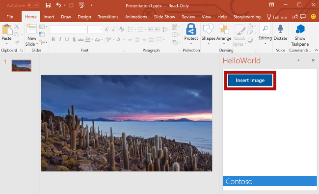

<span data-ttu-id="2e9d0-101">Из этого раздела руководства вы узнаете, как получить фотографию дня [Bing](https://www.bing.com) и вставить ее в слайд.</span><span class="sxs-lookup"><span data-stu-id="2e9d0-101">In this step of the tutorial, you'll retrieve the [Bing](https://www.bing.com) photo of the day and insert that image into a slide.</span></span>

> [!NOTE]
> <span data-ttu-id="2e9d0-102">Это один из разделов руководства по надстройкам PowerPoint.</span><span class="sxs-lookup"><span data-stu-id="2e9d0-102">This page describes an individual step of the PowerPoint add-in tutorial.</span></span> <span data-ttu-id="2e9d0-103">Если вы перешли на эту страницу со страницы результатов поисковой системы или по другой прямой ссылке, перейдите на вводную страницу [руководства по надстройкам PowerPoint](../tutorials/powerpoint-tutorial.yml), чтобы начать обучение с самого начала.</span><span class="sxs-lookup"><span data-stu-id="2e9d0-103">If you’ve arrived at this page via search engine results or other direct link, please go to the [PowerPoint add-in tutorial](../tutorials/powerpoint-tutorial.yml) introduction page to start the tutorial from the beginning.</span></span>

## <a name="add-the-bing-photo-of-the-day-to-a-slide"></a><span data-ttu-id="2e9d0-104">Добавление фотографии дня Bing на слайд</span><span class="sxs-lookup"><span data-stu-id="2e9d0-104">Add the Bing photo of the day to a slide</span></span>

1. <span data-ttu-id="2e9d0-105">Используя обозреватель решений, добавьте новую папку **Controllers** в проект **HelloWorldWeb**.</span><span class="sxs-lookup"><span data-stu-id="2e9d0-105">Using Solution Explorer, add a new folder named **Controllers** to the **HelloWorldWeb** project.</span></span>

    

2. <span data-ttu-id="2e9d0-107">Щелкните правой кнопкой мыши папку **Controllers** и выберите **Добавить > Создать шаблонный элемент**.</span><span class="sxs-lookup"><span data-stu-id="2e9d0-107">Right-click the **Controllers** folder and select **Add > New Scaffolded Item...**.</span></span>

3. <span data-ttu-id="2e9d0-108">В диалоговом окне **Добавление шаблона** выберите **Контроллер Web API 2 — пустой** и нажмите кнопку **Добавить**.</span><span class="sxs-lookup"><span data-stu-id="2e9d0-108">In the **Add Scaffold** dialog window, select **Web API 2 Controller - Empty** and choose the **Add** button.</span></span> 

4. <span data-ttu-id="2e9d0-109">В диалоговом окне **Добавление контроллера** введите имя **PhotoController** и нажмите кнопку **Добавить**.</span><span class="sxs-lookup"><span data-stu-id="2e9d0-109">In the **Add Controller** dialog window, enter **PhotoController** as the controller name and choose the **Add** button.</span></span> <span data-ttu-id="2e9d0-110">Visual Studio создаст и откроет файл **PhotoController.cs**.</span><span class="sxs-lookup"><span data-stu-id="2e9d0-110">Visual Studio creates and opens the **PhotoController.cs** file.</span></span>

5. <span data-ttu-id="2e9d0-111">Замените все содержимое файла **PhotoController.cs** приведенным ниже кодом, который вызывает службу Bing для получения фотографии дня в виде строки в кодировке Base64.</span><span class="sxs-lookup"><span data-stu-id="2e9d0-111">Replace the entire contents of the **PhotoController.cs** file with the following code that calls the Bing service to retrieve the photo of the day as a Base64 encoded string.</span></span> <span data-ttu-id="2e9d0-112">Когда для вставки изображения в документ используется API JavaScript для Office, данные изображения должны быть закодированы в формате Base64.</span><span class="sxs-lookup"><span data-stu-id="2e9d0-112">When you use the Office JavaScript API to insert an image into a document, the image data must be specified as a Base64 encoded string.</span></span>

    ```csharp
    using System;
    using System.IO;
    using System.Net;
    using System.Text;
    using System.Web.Http;
    using System.Xml;

    namespace HelloWorldWeb.Controllers
    {
        public class PhotoController : ApiController
        {
            public string Get()
            {
                string url = "http://www.bing.com/HPImageArchive.aspx?format=xml&idx=0&n=1";

                // Create the request.
                HttpWebRequest request = (HttpWebRequest)WebRequest.Create(url);
                WebResponse response = request.GetResponse();

                using (Stream responseStream = response.GetResponseStream())
                {
                    // Process the result.
                    StreamReader reader = new StreamReader(responseStream, Encoding.UTF8);
                    string result = reader.ReadToEnd();

                    // Parse the xml response and to get the URL.
                    XmlDocument doc = new XmlDocument();
                    doc.LoadXml(result);
                    string photoURL = "http://bing.com" + doc.SelectSingleNode("/images/image/url").InnerText;

                    // Fetch the photo and return it as a Base64 encoded string.
                    return getPhotoFromURL(photoURL);
                }
            }

            private string getPhotoFromURL(string imageURL)
            {
                var webClient = new WebClient();
                byte[] imageBytes = webClient.DownloadData(imageURL);
                return Convert.ToBase64String(imageBytes);
            }
        }
    }
    ```

6. <span data-ttu-id="2e9d0-113">В файле **Home.html** замените `TODO1` приведенным ниже кодом.</span><span class="sxs-lookup"><span data-stu-id="2e9d0-113">In the **Home.html** file, replace `TODO1` with the following markup.</span></span> <span data-ttu-id="2e9d0-114">Этот код определяет кнопку **Insert Image** (Вставить изображение), которая появится в области задач надстройки.</span><span class="sxs-lookup"><span data-stu-id="2e9d0-114">This markup defines the **Insert Image** button that will appear within the add-in's task pane.</span></span>

    ```html
    <button class="ms-Button ms-Button--primary" id="insert-image">
        <span class="ms-Button-icon"><i class="ms-Icon ms-Icon--plus"></i></span>
        <span class="ms-Button-label">Insert Image</span>
        <span class="ms-Button-description">Gets the photo of the day that shows on the Bing home page and adds it to the slide.</span>
    </button>
    ```

7. <span data-ttu-id="2e9d0-115">В файле **Home.js** замените `TODO1` приведенным ниже кодом, чтобы назначить обработчик событий для кнопки **Insert Image** (Вставить изображение).</span><span class="sxs-lookup"><span data-stu-id="2e9d0-115">In the **Home.js** file, replace `TODO1` with the following code to assign the event handler for the **Insert Image** button.</span></span>

    ```js
    $('#insert-image').click(insertImage);
    ```

8. <span data-ttu-id="2e9d0-116">В файле **Home.js** замените `TODO2` приведенным ниже кодом, чтобы определить функцию **insertImage**.</span><span class="sxs-lookup"><span data-stu-id="2e9d0-116">In the **Home.js** file, replace `TODO2` with the following code to define the **insertImage** function.</span></span> <span data-ttu-id="2e9d0-117">Эта функция извлекает изображение из веб-службы Bing, а затем вызывает функцию `insertImageFromBase64String`, чтобы вставить его в документ.</span><span class="sxs-lookup"><span data-stu-id="2e9d0-117">This function fetches the image from the Bing web service and then calls the `insertImageFromBase64String` function to insert that image into the document.</span></span>

    ```js
    function insertImage() {
        // Get image from from web service (as a Base64 encoded string).
        $.ajax({
            url: "/api/Photo/", success: function (result) {
                insertImageFromBase64String(result);
            }, error: function (xhr, status, error) {
                showNotification("Error", "Oops, something went wrong.");
            }
        });
    }
    ```

9. <span data-ttu-id="2e9d0-118">В файле **Home.js** замените `TODO3` приведенным ниже кодом, чтобы определить функцию `insertImageFromBase64String`.</span><span class="sxs-lookup"><span data-stu-id="2e9d0-118">In the **Home.js** file, replace `TODO3` with the following code to define the `insertImageFromBase64String` function.</span></span> <span data-ttu-id="2e9d0-119">Эта функция использует API JavaScript для Office, чтобы вставить изображение в документ.</span><span class="sxs-lookup"><span data-stu-id="2e9d0-119">This function uses the Office JavaScript API to insert the image into the document.</span></span> <span data-ttu-id="2e9d0-120">Примечание.</span><span class="sxs-lookup"><span data-stu-id="2e9d0-120">Note:</span></span> 

    - <span data-ttu-id="2e9d0-121">`coercionType`, второй параметр запроса `setSelectedDataAsyc`, определяет тип вставляемых данных.</span><span class="sxs-lookup"><span data-stu-id="2e9d0-121">The `coercionType` option that's specified as the second parameter of the `setSelectedDataAsyc` request indicates the type of data being inserted.</span></span> 

    - <span data-ttu-id="2e9d0-122">Объект `asyncResult` инкапсулирует результат запроса `setSelectedDataAsync`, включая сведения о состоянии и ошибке, если запрос завершился ошибкой.</span><span class="sxs-lookup"><span data-stu-id="2e9d0-122">The `asyncResult` object encapsulates the result of the `setSelectedDataAsync` request, including status and error information if the request failed.</span></span>

    ```js
    function insertImageFromBase64String(image) {
        // Call Office.js to insert the image into the document.
        Office.context.document.setSelectedDataAsync(image, {
            coercionType: Office.CoercionType.Image
        },
            function (asyncResult) {
                if (asyncResult.status === Office.AsyncResultStatus.Failed) {
                    showNotification("Error", asyncResult.error.message);
                }
            });
    }
    ```

## <a name="test-the-add-in"></a><span data-ttu-id="2e9d0-123">Тестирование надстройки</span><span class="sxs-lookup"><span data-stu-id="2e9d0-123">Test the add-in</span></span>

1. <span data-ttu-id="2e9d0-p107">Протестируйте новую надстройку PowerPoint с помощью Visual Studio, нажав клавишу `F5` или кнопку **Запустить**, чтобы запустить PowerPoint с кнопкой надстройки **Show Taskpane** (Показать область задач) на ленте. Надстройка будет размещена на локальном сервере IIS.</span><span class="sxs-lookup"><span data-stu-id="2e9d0-p107">Using Visual Studio, test the newly created PowerPoint add-in by pressing `F5` or choosing the **Start** button to launch PowerPoint with the **Show Taskpane** add-in button displayed in the ribbon. The add-in will be hosted locally on IIS.</span></span>

    

2. <span data-ttu-id="2e9d0-127">В PowerPoint нажмите кнопку **Show Taskpane** (Показать область задач) на ленте, чтобы открыть надстройку области задач.</span><span class="sxs-lookup"><span data-stu-id="2e9d0-127">In PowerPoint, select the **Show Taskpane** button in the ribbon to open the add-in task pane.</span></span>

    

3. <span data-ttu-id="2e9d0-129">В области задач нажмите кнопку **Insert Image** (Вставить изображение), чтобы добавить фотографию дня Bing на текущий слайд.</span><span class="sxs-lookup"><span data-stu-id="2e9d0-129">In the task pane, choose the **Insert Image** button to add the Bing photo of the day to the current slide.</span></span>

    

4. <span data-ttu-id="2e9d0-131">В Visual Studio остановите работу надстройки, нажав клавиши `Shift + F5` или кнопку **Остановить**.</span><span class="sxs-lookup"><span data-stu-id="2e9d0-131">In Visual Studio, stop the add-in by pressing `Shift + F5` or choosing the **Stop** button.</span></span> <span data-ttu-id="2e9d0-132">PowerPoint автоматически закроется.</span><span class="sxs-lookup"><span data-stu-id="2e9d0-132">PowerPoint will automatically close when the add-in is stopped.</span></span>

    