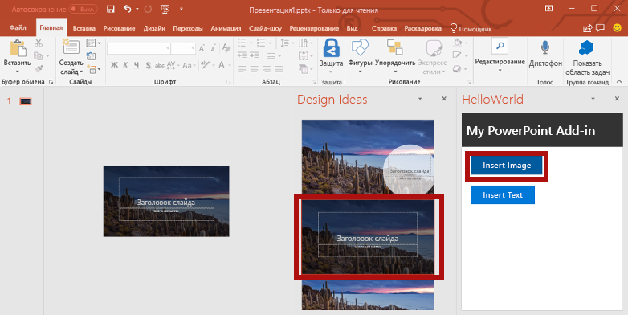
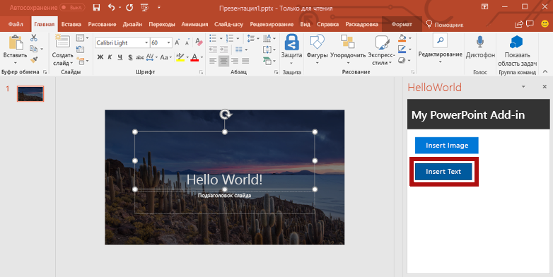

<span data-ttu-id="7d210-101">Из этого раздела руководства вы узнаете, как добавить текст на заглавный слайд, содержащий фотографию дня [Bing](https://www.bing.com).</span><span class="sxs-lookup"><span data-stu-id="7d210-101">In this step of the tutorial, you'll add text to the title slide that contains the [Bing](https://www.bing.com) photo of the day.</span></span>

> [!NOTE]
> <span data-ttu-id="7d210-102">Это один из разделов руководства по надстройкам PowerPoint.</span><span class="sxs-lookup"><span data-stu-id="7d210-102">This page describes an individual step of the PowerPoint add-in tutorial.</span></span> <span data-ttu-id="7d210-103">Если вы перешли на эту страницу со страницы результатов поисковой системы или по другой прямой ссылке, перейдите на вводную страницу [руководства по надстройкам PowerPoint](../tutorials/powerpoint-tutorial.yml), чтобы начать обучение с самого начала.</span><span class="sxs-lookup"><span data-stu-id="7d210-103">If you’ve arrived at this page via search engine results or other direct link, please go to the [PowerPoint add-in tutorial](../tutorials/powerpoint-tutorial.yml) introduction page to start the tutorial from the beginning.</span></span>

## <a name="add-text-to-a-slide"></a><span data-ttu-id="7d210-104">Добавление текста на слайд</span><span class="sxs-lookup"><span data-stu-id="7d210-104">Add text to a slide</span></span> 

1. <span data-ttu-id="7d210-105">В файле **Home.html** замените `TODO3` приведенным ниже кодом.</span><span class="sxs-lookup"><span data-stu-id="7d210-105">In the **Home.html** file, replace `TODO3` with the following markup.</span></span> <span data-ttu-id="7d210-106">Этот код определяет кнопку **Insert Text** (Вставить текст), которая появится в области задач надстройки.</span><span class="sxs-lookup"><span data-stu-id="7d210-106">This markup defines the **Insert Text** button that will appear within the add-in's task pane.</span></span>

    ```html
        <br /><br />
        <button class="ms-Button ms-Button--primary" id="insert-text">
            <span class="ms-Button-icon"><i class="ms-Icon ms-Icon--plus"></i></span>
            <span class="ms-Button-label">Insert Text</span>
            <span class="ms-Button-description">Inserts text into the slide.</span>
        </button>
    ```

2. <span data-ttu-id="7d210-107">В файле **Home.js** замените `TODO4` приведенным ниже кодом, чтобы назначить обработчик событий для кнопки **Insert Text** (Вставить текст).</span><span class="sxs-lookup"><span data-stu-id="7d210-107">In the **Home.js** file, replace `TODO4` with the following code to assign the event handler for the **Insert Text** button.</span></span>

    ```js
    $('#insert-text').click(insertText);
    ```

3. <span data-ttu-id="7d210-108">В файле **Home.js** замените `TODO5` приведенным ниже кодом, чтобы определить функцию **insertText**.</span><span class="sxs-lookup"><span data-stu-id="7d210-108">In the **Home.js** file, replace `TODO5` with the following code to define the **insertText** function.</span></span> <span data-ttu-id="7d210-109">Эта функция вставляет текст в текущий слайд.</span><span class="sxs-lookup"><span data-stu-id="7d210-109">This function inserts text into the current slide.</span></span>

    ```js
    function insertText() {
        Office.context.document.setSelectedDataAsync('Hello World!',
            function (asyncResult) {
                if (asyncResult.status === Office.AsyncResultStatus.Failed) {
                    showNotification("Error", asyncResult.error.message);
                }
            });
    }
    ```

## <a name="test-the-add-in"></a><span data-ttu-id="7d210-110">Тестирование надстройки</span><span class="sxs-lookup"><span data-stu-id="7d210-110">Test the add-in</span></span>

1. <span data-ttu-id="7d210-p104">Протестируйте надстройку с помощью Visual Studio, нажав клавишу `F5` или кнопку **Запустить**, чтобы запустить PowerPoint с кнопкой надстройки **Show Taskpane** (Показать область задач) на ленте. Надстройка будет размещена на локальном сервере IIS.</span><span class="sxs-lookup"><span data-stu-id="7d210-p104">Using Visual Studio, test the add-in by pressing `F5` or choosing the **Start** button to launch PowerPoint with the **Show Taskpane** add-in button displayed in the ribbon. The add-in will be hosted locally on IIS.</span></span>

    

2. <span data-ttu-id="7d210-114">В PowerPoint нажмите кнопку **Show Taskpane** (Показать область задач) на ленте, чтобы открыть надстройку области задач.</span><span class="sxs-lookup"><span data-stu-id="7d210-114">In PowerPoint, select the **Show Taskpane** button in the ribbon to open the add-in task pane.</span></span>

    

3. <span data-ttu-id="7d210-116">В области задач нажмите кнопку **Insert Image** (Вставить изображение), чтобы добавить фотографию дня Bing на текущий слайд, и выберите макет слайда с текстовым полем для заголовка.</span><span class="sxs-lookup"><span data-stu-id="7d210-116">In the task pane, choose the **Insert Image** button to add the Bing photo of the day to the current slide and choose a design for the slide that contains a text box for the title.</span></span>

    

4. <span data-ttu-id="7d210-118">Установите курсор в текстовом поле на заглавном слайде и нажмите кнопку **Insert Text** (Вставить текст) в области задач, чтобы добавить текст.</span><span class="sxs-lookup"><span data-stu-id="7d210-118">Put your cursor in the text box on the title slide and then in the task pane, choose the **Insert Text** button to add text to the slide.</span></span>

    


5. <span data-ttu-id="7d210-120">В Visual Studio остановите работу надстройки, нажав клавиши `Shift + F5` или кнопку **Остановить**.</span><span class="sxs-lookup"><span data-stu-id="7d210-120">In Visual Studio, stop the add-in by pressing `Shift + F5` or choosing the **Stop** button.</span></span> <span data-ttu-id="7d210-121">PowerPoint автоматически закроется.</span><span class="sxs-lookup"><span data-stu-id="7d210-121">PowerPoint will automatically close when the add-in is stopped.</span></span>

    