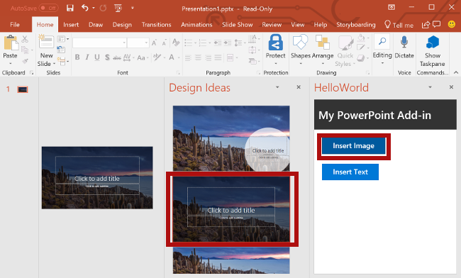

Из этого раздела руководства вы узнаете, как добавить текст на заглавный слайд, содержащий фотографию дня [Bing](https://www.bing.com).

> [!NOTE]
> Это один из разделов руководства по надстройкам PowerPoint. Если вы перешли на эту страницу со страницы результатов поисковой системы или по другой прямой ссылке, перейдите на вводную страницу [руководства по надстройкам PowerPoint](../tutorials/powerpoint-tutorial.yml), чтобы начать обучение с самого начала.

## <a name="add-text-to-a-slide"></a>Добавление текста на слайд 

1. В файле **Home.html** замените `TODO3` приведенным ниже кодом. Этот код определяет кнопку **Insert Text** (Вставить текст), которая появится в области задач надстройки.

    ```html
        <br /><br />
        <button class="ms-Button ms-Button--primary" id="insert-text">
            <span class="ms-Button-icon"><i class="ms-Icon ms-Icon--plus"></i></span>
            <span class="ms-Button-label">Insert Text</span>
            <span class="ms-Button-description">Inserts text into the slide.</span>
        </button>
    ```

2. В файле **Home.js** замените `TODO4` приведенным ниже кодом, чтобы назначить обработчик событий для кнопки **Insert Text** (Вставить текст).

    ```js
    $('#insert-text').click(insertText);
    ```

3. В файле **Home.js** замените `TODO5` приведенным ниже кодом, чтобы определить функцию **insertText**. Эта функция вставляет текст в текущий слайд.

    ```js
    function insertText() {
        Office.context.document.setSelectedDataAsync('Hello World!',
            function (asyncResult) {
                if (asyncResult.status === Office.AsyncResultStatus.Failed) {
                    showNotification("Error", asyncResult.error.message);
                }
            });
    }
    ```

## <a name="test-the-add-in"></a>Тестирование надстройки

1. Протестируйте надстройку с помощью Visual Studio, нажав клавишу `F5` или кнопку **Запустить**, чтобы запустить PowerPoint с кнопкой надстройки **Show Taskpane** (Показать область задач) на ленте. Надстройка будет размещена на локальном сервере IIS.

    

2. В PowerPoint нажмите кнопку **Show Taskpane** (Показать область задач) на ленте, чтобы открыть надстройку области задач.

    

3. В области задач нажмите кнопку **Insert Image** (Вставить изображение), чтобы добавить фотографию дня Bing на текущий слайд, и выберите макет слайда с текстовым полем для заголовка.

    

4. Установите курсор в текстовом поле на заглавном слайде и нажмите кнопку **Insert Text** (Вставить текст) в области задач, чтобы добавить текст.

    


5. В Visual Studio остановите работу надстройки, нажав клавиши `Shift + F5` или кнопку **Остановить**. PowerPoint автоматически закроется.

    