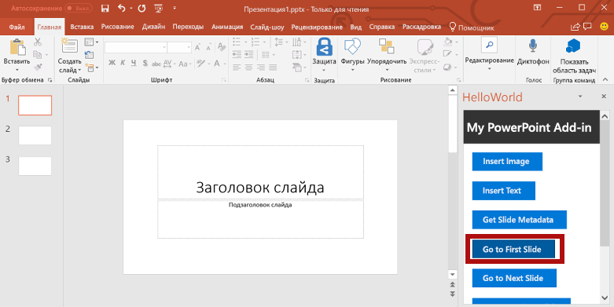
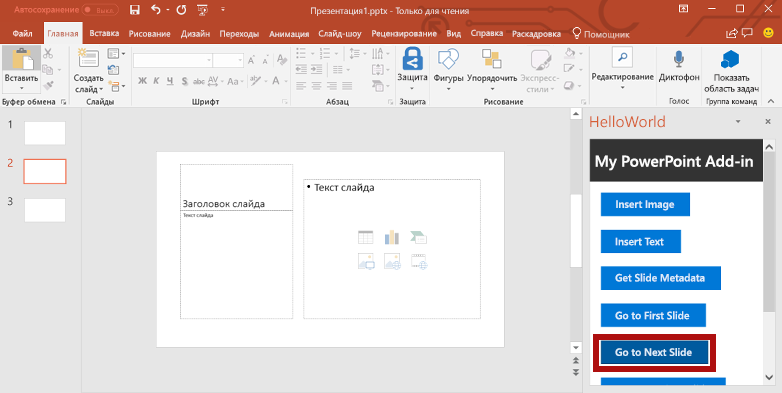
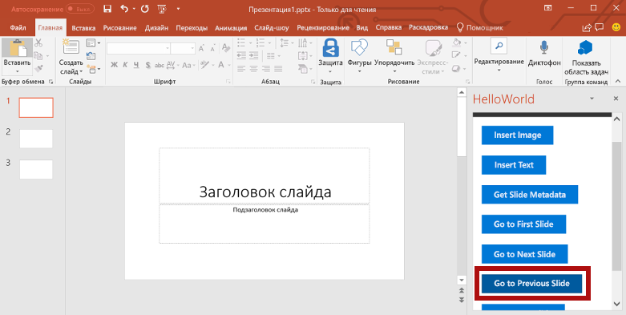
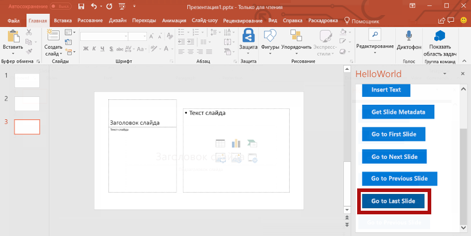

<span data-ttu-id="da9d6-101">Из этого раздела руководства вы узнаете, как переходить между слайдами документа.</span><span class="sxs-lookup"><span data-stu-id="da9d6-101">In this step of the tutorial, you'll navigate between the slides of a document.</span></span>

> [!NOTE]
> <span data-ttu-id="da9d6-102">Это один из разделов руководства по надстройкам PowerPoint.</span><span class="sxs-lookup"><span data-stu-id="da9d6-102">This page describes an individual step of the PowerPoint add-in tutorial.</span></span> <span data-ttu-id="da9d6-103">Если вы перешли на эту страницу со страницы результатов поисковой системы или по другой прямой ссылке, перейдите на вводную страницу [руководства по надстройкам PowerPoint](../tutorials/powerpoint-tutorial.yml), чтобы начать обучение с самого начала.</span><span class="sxs-lookup"><span data-stu-id="da9d6-103">If you’ve arrived at this page via search engine results or other direct link, please go to the [PowerPoint add-in tutorial](../tutorials/powerpoint-tutorial.yml) introduction page to start the tutorial from the beginning.</span></span>

## <a name="navigate-between-slides-of-the-document"></a><span data-ttu-id="da9d6-104">Переход между слайдами документа</span><span class="sxs-lookup"><span data-stu-id="da9d6-104">Navigate between slides of the document</span></span>

1. <span data-ttu-id="da9d6-105">В файле **Home.html** замените `TODO5` приведенным ниже кодом.</span><span class="sxs-lookup"><span data-stu-id="da9d6-105">In the **Home.html** file, replace `TODO5` with the following markup.</span></span> <span data-ttu-id="da9d6-106">Этот код определяет четыре кнопки навигации, которые появятся в области задач надстройки.</span><span class="sxs-lookup"><span data-stu-id="da9d6-106">This markup defines the four navigation buttons that will appear within the add-in's task pane.</span></span>

    ```html
    <br /><br />
    <button class="ms-Button ms-Button--primary" id="go-to-first-slide">
        <span class="ms-Button-icon"><i class="ms-Icon ms-Icon--plus"></i></span>
        <span class="ms-Button-label">Go to First Slide</span>
        <span class="ms-Button-description">Go to the first slide.</span>
    </button>
    <br /><br />
    <button class="ms-Button ms-Button--primary" id="go-to-next-slide">
        <span class="ms-Button-icon"><i class="ms-Icon ms-Icon--plus"></i></span>
        <span class="ms-Button-label">Go to Next Slide</span>
        <span class="ms-Button-description">Go to the next slide.</span>
    </button>
    <br /><br />
    <button class="ms-Button ms-Button--primary" id="go-to-previous-slide">
        <span class="ms-Button-icon"><i class="ms-Icon ms-Icon--plus"></i></span>
        <span class="ms-Button-label">Go to Previous Slide</span>
        <span class="ms-Button-description">Go to the previous slide.</span>
    </button>
    <br /><br />
    <button class="ms-Button ms-Button--primary" id="go-to-last-slide">
        <span class="ms-Button-icon"><i class="ms-Icon ms-Icon--plus"></i></span>
        <span class="ms-Button-label">Go to Last Slide</span>
        <span class="ms-Button-description">Go to the last slide.</span>
    </button>
    ```

2. <span data-ttu-id="da9d6-107">В файле **Home.js** замените `TODO8` приведенным ниже кодом, чтобы назначить обработчик событий для четырех кнопок навигации.</span><span class="sxs-lookup"><span data-stu-id="da9d6-107">In the **Home.js** file, replace `TODO8` with the following code to assign the event handlers for the four navigation buttons.</span></span>

    ```js
    $('#go-to-first-slide').click(goToFirstSlide);
    $('#go-to-next-slide').click(goToNextSlide);
    $('#go-to-previous-slide').click(goToPreviousSlide);
    $('#go-to-last-slide').click(goToLastSlide);
    ```

3. <span data-ttu-id="da9d6-108">В файле **Home.js** замените `TODO9` приведенным ниже кодом, чтобы определить функции навигации.</span><span class="sxs-lookup"><span data-stu-id="da9d6-108">In the **Home.js** file, replace `TODO9` with the following code to define the navigation functions.</span></span> <span data-ttu-id="da9d6-109">Каждая из этих функций использует функцию `goToByIdAsync` для выбора слайда с учетом его позиции в документе (первый, последний, предыдущий, следующий).</span><span class="sxs-lookup"><span data-stu-id="da9d6-109">Each of these functions uses the `goToByIdAsync` function to select a slide based upon its position in the document (first, last, previous, next).</span></span>

    ```js
    function goToFirstSlide() {
        Office.context.document.goToByIdAsync(Office.Index.First, Office.GoToType.Index,
            function (asyncResult) {
                if (asyncResult.status == "failed") {
                    showNotification("Error", asyncResult.error.message);
                }
            });
    }

    function goToLastSlide() {
        Office.context.document.goToByIdAsync(Office.Index.Last, Office.GoToType.Index,
            function (asyncResult) {
                if (asyncResult.status == "failed") {
                    showNotification("Error", asyncResult.error.message);
                }
            });
    }

    function goToPreviousSlide() {
        Office.context.document.goToByIdAsync(Office.Index.Previous, Office.GoToType.Index,
            function (asyncResult) {
                if (asyncResult.status == "failed") {
                    showNotification("Error", asyncResult.error.message);
                }
            });
    }

    function goToNextSlide() {
        Office.context.document.goToByIdAsync(Office.Index.Next, Office.GoToType.Index,
            function (asyncResult) {
                if (asyncResult.status == "failed") {
                    showNotification("Error", asyncResult.error.message);
                }
            });
    }
    ```

## <a name="test-the-add-in"></a><span data-ttu-id="da9d6-110">Тестирование надстройки</span><span class="sxs-lookup"><span data-stu-id="da9d6-110">Test the add-in</span></span>

1. <span data-ttu-id="da9d6-p104">Протестируйте надстройку с помощью Visual Studio, нажав клавишу `F5` или кнопку **Запустить**, чтобы запустить PowerPoint с кнопкой надстройки **Show Taskpane** (Показать область задач) на ленте. Надстройка будет размещена на локальном сервере IIS.</span><span class="sxs-lookup"><span data-stu-id="da9d6-p104">Using Visual Studio, test the add-in by pressing `F5` or choosing the **Start** button to launch PowerPoint with the **Show Taskpane** add-in button displayed in the ribbon. The add-in will be hosted locally on IIS.</span></span>

    

2. <span data-ttu-id="da9d6-114">В PowerPoint нажмите кнопку **Show Taskpane** (Показать область задач) на ленте, чтобы открыть надстройку области задач.</span><span class="sxs-lookup"><span data-stu-id="da9d6-114">In PowerPoint, select the **Show Taskpane** button in the ribbon to open the add-in task pane.</span></span>

    


3. <span data-ttu-id="da9d6-116">Нажмите кнопку **Создать слайд** на ленте вкладки **Главная**, чтобы добавить в документ два новых слайда.</span><span class="sxs-lookup"><span data-stu-id="da9d6-116">Use the **New Slide** button in the ribbon of the **Home** tab to add two new slides to the document.</span></span> 

4. <span data-ttu-id="da9d6-117">В области задач нажмите кнопку **Go to First Slide** (Перейти к первому слайду).</span><span class="sxs-lookup"><span data-stu-id="da9d6-117">In the task pane, choose the **Go to First Slide** button.</span></span> <span data-ttu-id="da9d6-118">Будет выбран и показан первый слайд в документе.</span><span class="sxs-lookup"><span data-stu-id="da9d6-118">The first slide in the document is selected and displayed.</span></span>

    

5. <span data-ttu-id="da9d6-120">В области задач нажмите кнопку **Go to Next Slide** (Перейти к следующему слайду).</span><span class="sxs-lookup"><span data-stu-id="da9d6-120">In the task pane, choose the **Go to Next Slide** button.</span></span> <span data-ttu-id="da9d6-121">Будет выбран и показан следующий слайд в документе.</span><span class="sxs-lookup"><span data-stu-id="da9d6-121">The next slide in the document is selected and displayed.</span></span>

    

6. <span data-ttu-id="da9d6-123">В области задач нажмите кнопку **Go to Previous Slide** (Перейти к предыдущему слайду).</span><span class="sxs-lookup"><span data-stu-id="da9d6-123">In the task pane, choose the **Go to Previous Slide** button.</span></span> <span data-ttu-id="da9d6-124">Будет выбран и показан предыдущий слайд в документе.</span><span class="sxs-lookup"><span data-stu-id="da9d6-124">The previous slide in the document is selected and displayed.</span></span>

    

7. <span data-ttu-id="da9d6-126">В области задач нажмите кнопку **Go to Last Slide** (Перейти к последнему слайду).</span><span class="sxs-lookup"><span data-stu-id="da9d6-126">In the task pane, choose the **Go to Last Slide** button.</span></span> <span data-ttu-id="da9d6-127">Будет выбран и показан последний слайд в документе.</span><span class="sxs-lookup"><span data-stu-id="da9d6-127">The last slide in the document is selected and displayed.</span></span>

    

8. <span data-ttu-id="da9d6-129">В Visual Studio остановите работу надстройки, нажав клавиши `Shift + F5` или кнопку **Остановить**.</span><span class="sxs-lookup"><span data-stu-id="da9d6-129">In Visual Studio, stop the add-in by pressing `Shift + F5` or choosing the **Stop** button.</span></span> <span data-ttu-id="da9d6-130">PowerPoint автоматически закроется.</span><span class="sxs-lookup"><span data-stu-id="da9d6-130">PowerPoint will automatically close when the add-in is stopped.</span></span>

    
