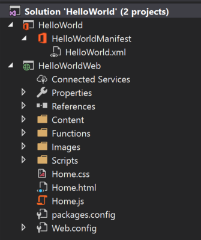

Сначала необходимо настроить проект разработки. 

> [!NOTE]
> Это один из разделов руководства по надстройкам PowerPoint. Если вы перешли на эту страницу со страницы результатов поисковой системы или по другой прямой ссылке, перейдите на вводную страницу [руководства по надстройкам PowerPoint](../tutorials/powerpoint-tutorial.yml), чтобы начать обучение с самого начала.

## <a name="prerequisites"></a>Необходимые компоненты

[!include[Quick Start prerequisites](../includes/quickstart-vs-prerequisites.md)]

## <a name="setup"></a>Установка

Из этого руководства вы узнаете, как создать надстройку, используя Visual Studio.

### <a name="create-the-add-in-project"></a>Создание проекта надстройки

1. В строке меню Visual Studio выберите **Файл** > **Создать** > **Проект**.
    
2. В списке типов проекта разверните узел **Visual C#** или **Visual Basic**, разверните **Office/SharePoint**, затем выберите **Надстройки** > **Веб-надстройка PowerPoint**. 

3. Назовите проект **HelloWorld** и нажмите кнопку **ОК**.

4. В диалоговом окне **Создание надстройки Office** выберите **Добавить новые функции в PowerPoint** и нажмите кнопку **Готово**, чтобы создать проект.

5. Visual Studio создаст решение, и в **обозревателе решений** появятся два соответствующих проекта. В Visual Studio откроется файл **Home.html**.

     

### <a name="explore-the-visual-studio-solution"></a>Обзор решения Visual Studio

[!include[Description of Visual Studio projects](../includes/quickstart-vs-solution.md)]

### <a name="update-code"></a>Обновление кода 

Измените код надстройки, как указано ниже, чтобы создать платформу для реализации функций надстройки, следуя инструкциям в следующих разделах этого руководства.

1. Файл **Home.html** содержит HTML-контент, который будет отрисовываться в области задач надстройки. В файле **Home.html** найдите раздел **div** с `id="content-main"`, замените весь этот раздел приведенным ниже кодом и сохраните файл.

    ```html
    <!-- TODO2: Create the content-header div. -->
    <div id="content-main">
        <div class="padding">
            <!-- TODO1: Create the insert-image button. -->
            <!-- TODO3: Create the insert-text button. -->
            <!-- TODO4: Create the get-slide-metadata button. -->
            <!-- TODO5: Create the go-to-slide buttons. -->
        </div>
    </div>
    ```

2. Откройте файл **Home.js** в корневой папке проекта веб-приложения. Этот файл содержит скрипт надстройки. Замените все его содержимое указанным ниже кодом и сохраните файл.

    ```javascript
    (function () {
        "use strict";

        var messageBanner;

        Office.initialize = function (reason) {
            $(document).ready(function () {
                // Initialize the FabricUI notification mechanism and hide it
                var element = document.querySelector('.ms-MessageBanner');
                messageBanner = new fabric.MessageBanner(element);
                messageBanner.hideBanner();

                // TODO1: Assign event handler for insert-image button.
                // TODO4: Assign event handler for insert-text button.
                // TODO6: Assign event handler for get-slide-metadata button.
                // TODO8: Assign event handlers for the four navigation buttons.
            });
        };

        // TODO2: Define the insertImage function. 

        // TODO3: Define the insertImageFromBase64String function.

        // TODO5: Define the insertText function.

        // TODO7: Define the getSlideMetadata function.

        // TODO9: Define the navigation functions.

        // Helper function for displaying notifications
        function showNotification(header, content) {
            $("#notification-header").text(header);
            $("#notification-body").text(content);
            messageBanner.showBanner();
            messageBanner.toggleExpansion();
        }
    })();
    ```
