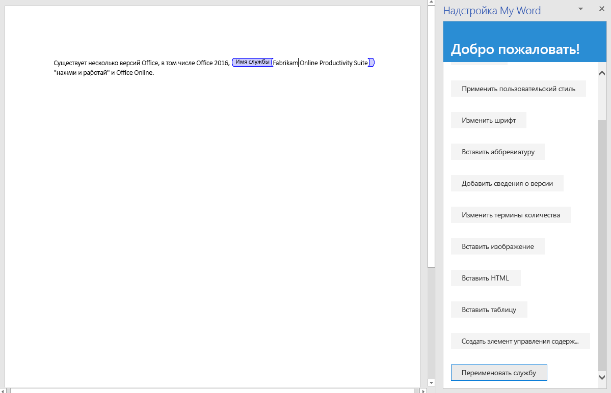

На этом этапе руководства мы рассмотрим создание элементов управления форматированным текстом в документе, а также вставку и замену содержимого этих элементов. 

> [!NOTE]
> На этой странице описывается отдельный этап из руководства по надстройкам Word. Если вы перешли на эту страницу со страницы результатов поисковой системы или по другой прямой ссылке, перейдите на вводную страницу [руководства по надстройкам Word](../tutorials/word-tutorial.yml), чтобы начать обучение с самого начала.

Прежде чем приступать к этому этапу руководства, рекомендуем создать элементы управления форматированным текстом и управлять ими через пользовательский интерфейс Word, чтобы получить представление об этих элементах и их свойствах. Дополнительные сведения см. в статье [Создание форм, предназначенных для заполнения или печати в приложении Word](https://support.office.com/article/create-forms-that-users-complete-or-print-in-word-040c5cc1-e309-445b-94ac-542f732c8c8b).

> [!NOTE]
> Существует несколько типов элементов управления содержимым, которые можно добавить в документ Word через пользовательский интерфейс. Однако в настоящее время Word.js поддерживает только элементы управления форматированным текстом.


## <a name="create-a-content-control"></a>Создание элемента управления содержимым

1. Откройте проект в редакторе кода.
2. Откройте файл index.html.
3. Под элементом `div`, содержащим кнопку `replace-text`, добавьте следующую разметку:

    ```html
    <div class="padding">
        <button class="ms-Button" id="create-content-control">Create Content Control</button>
    </div>
    ```

4. Откройте файл app.js.

5. Под строкой, назначающей обработчик нажатия кнопки `insert-table`, добавьте следующий код:

    ```js
    $('#create-content-control').click(createContentControl);
    ```

6. Добавьте приведенную ниже функцию под функцией `insertTable`.

    ```js
    function createContentControl() {
        Word.run(function (context) {

            // TODO1: Queue commands to create a content control.

            return context.sync();
        })
        .catch(function (error) {
            console.log("Error: " + error);
            if (error instanceof OfficeExtension.Error) {
                console.log("Debug info: " + JSON.stringify(error.debugInfo));
            }
        });
    }
    ```

7. Замените `TODO1` на приведенный ниже код. Обратите внимание:
   - Этот код заключает фразу "Office 365" в элемент управления содержимым. Для простоты предполагается, что такая строка существует и пользователь выделил ее.
   - Свойство `ContentControl.title` задает видимый заголовок элемента управления содержимым.
   - Свойство `ContentControl.tag` задает тег, с помощью которого можно получить ссылку на элемент управления содержимым путем вызова метода `ContentControlCollection.getByTag`, который будет использоваться в последующей функции.
   - Свойство `ContentControl.appearance` задает внешний вид элемента управления. Значение Tags указывает, что элемент управления будет заключен в открывающие и закрывающие теги, а открывающий тег будет содержать заголовок элемента управления содержимым. Другие возможные значения: BoundingBox и None.
   - Свойство `ContentControl.color` задает цвет тегов или рамки ограничивающего прямоугольника.

    ```js
    const serviceNameRange = context.document.getSelection();
    const serviceNameContentControl = serviceNameRange.insertContentControl();
    serviceNameContentControl.title = "Service Name";
    serviceNameContentControl.tag = "serviceName";
    serviceNameContentControl.appearance = "Tags";
    serviceNameContentControl.color = "blue";
    ```

## <a name="replace-the-content-of-the-content-control"></a>Замена содержимого элемента управления

1. Откройте файл index.html.
2. Под элементом `div`, содержащим кнопку `create-content-control`, добавьте следующую разметку:

    ```html
    <div class="padding">
        <button class="ms-Button" id="replace-content-in-control">Rename Service</button>
    </div>
    ```

3. Откройте файл app.js.

4. Под строкой, назначающей обработчик нажатия кнопки `create-content-control`, добавьте следующий код:

    ```js
    $('#replace-content-in-control').click(replaceContentInControl);
    ```

5. Добавьте приведенную ниже функцию под функцией `createContentControl`.

    ```js
    function replaceContentInControl() {
        Word.run(function (context) {

            // TODO1: Queue commands to replace the text in the Service Name
            //        content control.

            return context.sync();
        })
        .catch(function (error) {
            console.log("Error: " + error);
            if (error instanceof OfficeExtension.Error) {
                console.log("Debug info: " + JSON.stringify(error.debugInfo));
            }
        });
    }
    ```

7. Замените `TODO1` на приведенный ниже код.
    > [!NOTE]
    > Метод `ContentControlCollection.getByTag` возвращает значение `ContentControlCollection` для всех элементов управления контентом указанного тега. Чтобы получить ссылку на нужный элемент управления, используйте `getFirst`.

    ```js
    const serviceNameContentControl = context.document.contentControls.getByTag("serviceName").getFirst();
    serviceNameContentControl.insertText("Fabrikam Online Productivity Suite", "Replace");
    ```

## <a name="test-the-add-in"></a>Тестирование надстройки

1. Если окно Git Bash или системная командная строка с поддержкой Node.JS, открытые на предыдущем этапе руководства, все еще открыты, дважды нажмите клавиши CTRL+C, чтобы остановить работу веб-сервера. Если они закрыты, откройте окно Git Bash или системную командную строку с поддержкой Node.JS и перейдите к папке **Start** проекта.
     > [!NOTE]
     > Хотя сервер синхронизации браузера будет повторно загружать надстройку в области задач при каждом изменении любого файла (в том числе app.js), он не передает повторно код JavaScript, поэтому нужно будет снова выполнить команду сборки, чтобы изменения, внесенные в файл app.js, вступили в силу. Для этого необходимо завершить процесс сервера, чтобы появился запрос и вы могли ввести команду сборки. После сборки перезапустите сервер. Для этого выполните указанные ниже действия.
2. Выполните команду `npm run build`, чтобы преобразовать исходный код ES6 в более раннюю версию JavaScript, поддерживаемую всеми ведущими приложениями, в которых могут работать надстройки Office.
3. Выполните команду `npm start`, чтобы запустить веб-сервер, работающий на localhost.
4. Перезагрузите область задач. Для этого закройте ее, а затем выберите в меню **Главная** пункт **Показать область задач**, чтобы заново открыть надстройку.
5. В области задач нажмите кнопку **Insert Paragraph** (Вставить абзац), чтобы убедиться, что в начале документа есть абзац с фразой "Office 365".
6. Выделите фразу "Office 365" в добавленном абзаце, а затем нажмите кнопку **Create Content Control** (Создать элемент управления содержимым). Обратите внимание, что фраза заключена в теги с меткой Service Name.
7. Нажмите кнопку **Rename Service** (Переименовать службу) и обратите внимание, что текст элемента управления содержимым меняется на "Fabrikam Online Productivity Suite".

    
