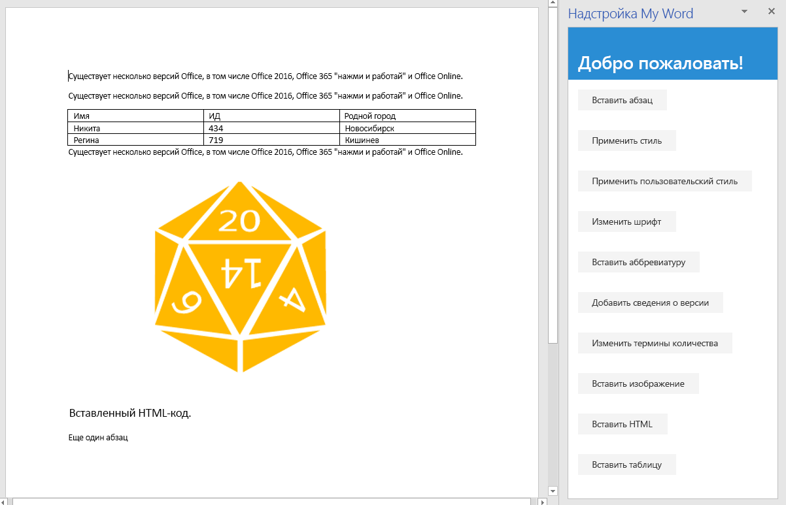

На этом этапе руководства мы рассмотрим вставку изображений, HTML-кода и таблиц в документ.

> [!NOTE]
> На этой странице описывается отдельный этап из руководства по надстройкам Word. Если вы перешли на эту страницу со страницы результатов поисковой системы или по другой прямой ссылке, перейдите на вводную страницу [руководства по надстройкам Word](../tutorials/word-tutorial.yml), чтобы начать обучение с самого начала.

## <a name="insert-an-image"></a>Вставка изображения

1. Откройте проект в редакторе кода.
2. Откройте файл index.html.
3. Под элементом `div`, содержащим кнопку `replace-text`, добавьте следующую разметку:

    ```html
    <div class="padding">
        <button class="ms-Button" id="insert-image">Insert Image</button>
    </div>
    ```

4. Откройте файл app.js.

5. Добавьте приведенную ниже строку сразу под строкой use-strict в верхней части файла. Эта строка импортирует переменную из другого файла. Переменная представляет собой строку с кодировкой Base 64, кодирующую изображение. Чтобы просмотреть закодированную строку, откройте файл base64Image.js в корневой папке проекта.

    ```js
    import { base64Image } from "./base64Image";
    ```

6. Под строкой, назначающей обработчик нажатия кнопки `replace-text`, добавьте следующий код:

    ```js
    $('#insert-image').click(insertImage);
    ```

7. Добавьте приведенную ниже функцию под функцией `replaceText`.

    ```js
    function insertImage() {
        Word.run(function (context) {

            // TODO1: Queue commands to insert an image.

            return context.sync();
        })
        .catch(function (error) {
            console.log("Error: " + error);
            if (error instanceof OfficeExtension.Error) {
                console.log("Debug info: " + JSON.stringify(error.debugInfo));
            }
        });
    }
    ```

8. Замените `TODO1` на приведенный ниже код. Обратите внимание, что эта строка вставляет изображение с кодировкой Base 64 в конце документа. У объекта `Paragraph` также есть метод `insertInlinePictureFromBase64` и другие методы `insert*`. Пример представлен в следующем разделе, посвященном вставке HTML.

    ```js
    context.document.body.insertInlinePictureFromBase64(base64Image, "End");
    ```

## <a name="insert-html"></a>Вставка HTML

1. Откройте файл index.html.
2. Под элементом `div`, содержащим кнопку `insert-image`, добавьте следующую разметку:

    ```html
    <div class="padding">
        <button class="ms-Button" id="insert-html">Insert HTML</button>
    </div>
    ```

3. Откройте файл app.js.

4. Под строкой, назначающей обработчик нажатия кнопки `insert-image`, добавьте следующий код:

    ```js
    $('#insert-html').click(insertHTML);
    ```

5. Добавьте приведенную ниже функцию под функцией `insertImage`.

    ```js
    function insertHTML() {
        Word.run(function (context) {

            // TODO1: Queue commands to insert a string of HTML.

            return context.sync();
        })
        .catch(function (error) {
            console.log("Error: " + error);
            if (error instanceof OfficeExtension.Error) {
                console.log("Debug info: " + JSON.stringify(error.debugInfo));
            }
        });
    }
    ```

6. Замените `TODO1` на приведенный ниже код. Обратите внимание:
   - Первая строка добавляет пустой абзац в конце документа. 
   - Вторая команда вставляет строку HTML-кода в конце абзаца. В частности, вставляются два абзаца, в одном из которых используется шрифт Verdana, а в другом — стандартный стиль документа Word. Как видно по вышеописанному методу `insertImage`, у объекта `context.document.body` также есть методы `insert*`.

    ```js
    const blankParagraph = context.document.body.paragraphs.getLast().insertParagraph("", "After");
    blankParagraph.insertHtml('<p style="font-family: verdana;">Inserted HTML.</p><p>Another paragraph</p>', "End");
    ```

## <a name="insert-table"></a>Вставка таблицы

1. Откройте файл index.html.
2. Под элементом `div`, содержащим кнопку `insert-html`, добавьте следующую разметку:

    ```html
    <div class="padding">
        <button class="ms-Button" id="insert-table">Insert Table</button>
    </div>
    ```

3. Откройте файл app.js.

4. Под строкой, назначающей обработчик нажатия кнопки `insert-html`, добавьте следующий код:

    ```js
    $('#insert-table').click(insertTable);
    ```

5. Добавьте приведенную ниже функцию под функцией `insertHTML`.

    ```js
    function insertTable() {
        Word.run(function (context) {

            // TODO1: Queue commands to get a reference to the paragraph
            //        that will proceed the table.

            // TODO2: Queue commands to create a table and populate it with data.

            return context.sync();
        })
        .catch(function (error) {
            console.log("Error: " + error);
            if (error instanceof OfficeExtension.Error) {
                console.log("Debug info: " + JSON.stringify(error.debugInfo));
            }
        });
    }
    ```

6. Замените `TODO1` на приведенный ниже код. Обратите внимание, что в этой строке используется метод `ParagraphCollection.getFirst`, чтобы получить ссылку на первый абзац, а затем — метод `Paragraph.getNext`, чтобы получить ссылку на второй абзац.

    ```js
    const secondParagraph = context.document.body.paragraphs.getFirst().getNext();
    ```

7. Замените `TODO2` на приведенный ниже код. Обратите внимание:
   - Первые два параметра метода `insertTable` задают количество строк и столбцов.
   - Третий параметр указывает, где вставить таблицу (в данном случае — после абзаца).
   - Четвертый параметр представляет собой двумерный массив, задающий значения ячеек таблицы.
   - К таблице применяется простой стиль по умолчанию, но метод `insertTable` возвращает объект `Table` со множеством элементов, некоторые из которых используются для настройки стиля таблицы.

    ```js
    const tableData = [
            ["Name", "ID", "Birth City"],
            ["Bob", "434", "Chicago"],
            ["Sue", "719", "Havana"],
        ];
    secondParagraph.insertTable(3, 3, "After", tableData);
    ```

## <a name="test-the-add-in"></a>Тестирование надстройки


1. Если окно Git Bash или системная командная строка с поддержкой Node.JS, открытые на предыдущем этапе руководства, все еще открыты, дважды нажмите клавиши CTRL+C, чтобы остановить работу веб-сервера. Если они закрыты, откройте окно Git Bash или системную командную строку с поддержкой Node.JS и перейдите к папке **Start** проекта.

     > [!NOTE]
     > Хотя сервер синхронизации браузера будет повторно загружать надстройку в области задач при каждом изменении любого файла (в том числе app.js), он не передает повторно код JavaScript, поэтому нужно будет снова выполнить команду сборки, чтобы изменения, внесенные в файл app.js, вступили в силу. Для этого необходимо завершить процесс сервера, чтобы появился запрос и вы могли ввести команду сборки. После сборки перезапустите сервер. Для этого выполните указанные ниже действия.

2. Выполните команду `npm run build`, чтобы преобразовать исходный код ES6 в более раннюю версию JavaScript, поддерживаемую всеми ведущими приложениями, в которых могут работать надстройки Office.
3. Выполните команду `npm start`, чтобы запустить веб-сервер, работающий на localhost.
4. Перезагрузите область задач. Для этого закройте ее, а затем выберите в меню **Главная** пункт **Показать область задач**, чтобы заново открыть надстройку.
5. В области задач нажмите кнопку **Insert Paragraph** (Вставить абзац) не менее трех раз, чтобы убедиться, что в документе есть несколько абзацев.
6. Нажмите кнопку **Insert Image** (Вставить изображение) и обратите внимание, что изображение вставляется в конце документа.
7. Нажмите кнопку **Insert HTML** (Вставить HTML) и обратите внимание, что в конце документа вставляются два абзаца, в первом из которых используется шрифт Verdana.
8. Нажмите кнопку **Insert Table** (Вставить таблицу) и обратите внимание, что после второго абзаца вставляется таблица.

    
