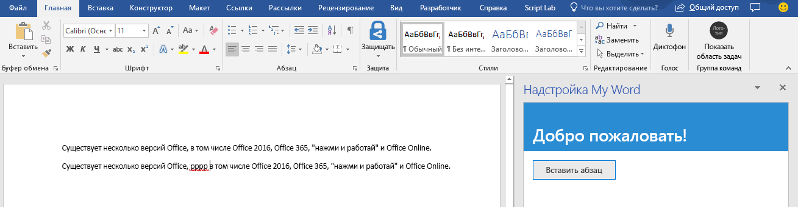

<span data-ttu-id="1ae7e-101">На этом этапе руководства мы программным способом проверим, поддерживает ли надстройка текущую версию Word, установленную у пользователя, а затем вставим абзац в документ.</span><span class="sxs-lookup"><span data-stu-id="1ae7e-101">In this step of the tutorial, you'll programmatically test that your add-in supports the user's current version of Word, and then insert a paragraph in the document.</span></span>

> [!NOTE]
> <span data-ttu-id="1ae7e-p101">На этой странице описывается отдельный этап из руководства по надстройкам Word. Если вы перешли на эту страницу со страницы результатов поисковой системы или по другой прямой ссылке, перейдите на вводную страницу [руководства по надстройкам Word](../tutorials/word-tutorial.yml), чтобы начать обучение с самого начала.</span><span class="sxs-lookup"><span data-stu-id="1ae7e-p101">This page describes an individual step of a Word add-in tutorial. If you’ve arrived at this page via search engine results or other direct link, please go to the [Word add-in tutorial](../tutorials/word-tutorial.yml) introduction page to start the tutorial from the beginning.</span></span>

## <a name="code-the-add-in"></a><span data-ttu-id="1ae7e-104">Написание кода надстройки</span><span class="sxs-lookup"><span data-stu-id="1ae7e-104">Code the add-in</span></span>

1. <span data-ttu-id="1ae7e-105">Откройте проект в редакторе кода.</span><span class="sxs-lookup"><span data-stu-id="1ae7e-105">Open the project in your code editor.</span></span>
2. <span data-ttu-id="1ae7e-106">Откройте файл index.html.</span><span class="sxs-lookup"><span data-stu-id="1ae7e-106">Open the file index.html.</span></span>
3. <span data-ttu-id="1ae7e-107">Замените `TODO1` на следующую разметку:</span><span class="sxs-lookup"><span data-stu-id="1ae7e-107">Replace the `TODO1` with the following markup:</span></span>

    ```html
    <button class="ms-Button" id="insert-paragraph">Insert Paragraph</button>
    ```

4. <span data-ttu-id="1ae7e-108">Откройте файл app.js.</span><span class="sxs-lookup"><span data-stu-id="1ae7e-108">Open the app.js file.</span></span>
5. <span data-ttu-id="1ae7e-109">Замените `TODO1` на приведенный ниже код.</span><span class="sxs-lookup"><span data-stu-id="1ae7e-109">Replace the `TODO1` with the following code.</span></span> <span data-ttu-id="1ae7e-110">Этот код определяет, поддерживает ли установленная у пользователя версия Word ту версию файла Word.js, которая включает все API, используемые на всех этапах данного руководства.</span><span class="sxs-lookup"><span data-stu-id="1ae7e-110">This code determines whether the user's version of Word supports a version of Word.js that includes all the APIs that are used in all the stages of this tutorial.</span></span> <span data-ttu-id="1ae7e-111">В рабочей надстройке можно использовать текст условного блока, чтобы скрыть или отключить пользовательский интерфейс, где вызываются неподдерживаемые API.</span><span class="sxs-lookup"><span data-stu-id="1ae7e-111">In a production add-in, use the body of the conditional block to hide or disable the UI that would call unsupported APIs.</span></span> <span data-ttu-id="1ae7e-112">При этом пользователь по-прежнему сможет использовать те части надстройки, которые поддерживаются в его версии Word.</span><span class="sxs-lookup"><span data-stu-id="1ae7e-112">This will enable the user to still use the parts of the add-in that are supported by their version of Word.</span></span>

    ```js
    if (!Office.context.requirements.isSetSupported('WordApi', 1.3)) {
        console.log('Sorry. The tutorial add-in uses Word.js APIs that are not available in your version of Office.');
    }
    ```

6. <span data-ttu-id="1ae7e-113">Замените `TODO2` на следующий код:</span><span class="sxs-lookup"><span data-stu-id="1ae7e-113">Replace the `TODO2` with the following code:</span></span>

    ```js
    $('#insert-paragraph').click(insertParagraph);
    ```

7. <span data-ttu-id="1ae7e-114">Замените `TODO3` на приведенный ниже код.</span><span class="sxs-lookup"><span data-stu-id="1ae7e-114">Replace the `TODO3` with the following code.</span></span> <span data-ttu-id="1ae7e-115">Обратите внимание на следующее:</span><span class="sxs-lookup"><span data-stu-id="1ae7e-115">Note the following:</span></span>
   - <span data-ttu-id="1ae7e-116">Бизнес-логика Word.js будет добавлена в функцию, передаваемую методу `Word.run`.</span><span class="sxs-lookup"><span data-stu-id="1ae7e-116">Your Word.js business logic will be added to the function that is passed to `Word.run`.</span></span> <span data-ttu-id="1ae7e-117">Эта логика выполняется не сразу.</span><span class="sxs-lookup"><span data-stu-id="1ae7e-117">This logic does not execute immediately.</span></span> <span data-ttu-id="1ae7e-118">Вместо этого она добавляется в очередь ожидания команд.</span><span class="sxs-lookup"><span data-stu-id="1ae7e-118">Instead, it is added to a queue of pending commands.</span></span>
   - <span data-ttu-id="1ae7e-119">Метод `context.sync` отправляет все команды из очереди в Word для выполнения.</span><span class="sxs-lookup"><span data-stu-id="1ae7e-119">The `context.sync` method sends all queued commands to Word for execution.</span></span>
   - <span data-ttu-id="1ae7e-120">За методом `Word.run` следует блок `catch`.</span><span class="sxs-lookup"><span data-stu-id="1ae7e-120">The `Word.run` is followed by a `catch` block.</span></span> <span data-ttu-id="1ae7e-121">Рекомендуется всегда следовать этой методике.</span><span class="sxs-lookup"><span data-stu-id="1ae7e-121">This is a best practice that you should always follow.</span></span> 

    ```js
    function insertParagraph() {
        Word.run(function (context) {

            // TODO4: Queue commands to insert a paragraph into the document.

            return context.sync();
        })
        .catch(function (error) {
            console.log("Error: " + error);
            if (error instanceof OfficeExtension.Error) {
                console.log("Debug info: " + JSON.stringify(error.debugInfo));
            }
        });
    }
    ```

8. <span data-ttu-id="1ae7e-p106">Замените `TODO4` на приведенный ниже код. Обратите внимание:</span><span class="sxs-lookup"><span data-stu-id="1ae7e-p106">Replace `TODO4` with the following code. Note:</span></span>
   - <span data-ttu-id="1ae7e-124">Первый параметр метода `insertParagraph` — это текст нового абзаца.</span><span class="sxs-lookup"><span data-stu-id="1ae7e-124">The first parameter to the `insertParagraph` method is the text for the new paragraph.</span></span>
   - <span data-ttu-id="1ae7e-125">Второй параметр — расположение в основном тексте, где будет вставлен абзац.</span><span class="sxs-lookup"><span data-stu-id="1ae7e-125">The second parameter is the location within the body where the paragraph will be inserted.</span></span> <span data-ttu-id="1ae7e-126">Другие варианты вставки абзаца, родительским объектом которого является основной текст, — End и Replace.</span><span class="sxs-lookup"><span data-stu-id="1ae7e-126">Other options for insert paragraph, when the parent object is the body, are "End" and "Replace".</span></span>

    ```js
    const docBody = context.document.body;
    docBody.insertParagraph("Office has several versions, including Office 2016, Office 365 Click-to-Run, and Office Online.",
                            "Start");
    ```

## <a name="test-the-add-in"></a><span data-ttu-id="1ae7e-127">Тестирование надстройки</span><span class="sxs-lookup"><span data-stu-id="1ae7e-127">Test the add-in</span></span>

1. <span data-ttu-id="1ae7e-128">Откройте окно Git Bash или системную командную строку с поддержкой Node.JS и перейдите к папке **Start** проекта.</span><span class="sxs-lookup"><span data-stu-id="1ae7e-128">Open a Git bash window, or Node.JS-enabled system prompt, and navigate to the **Start** folder of the project.</span></span>
2. <span data-ttu-id="1ae7e-129">Выполните команду `npm run build`, чтобы преобразовать исходный код ES6 в более раннюю версию JavaScript, поддерживаемую всеми ведущими приложениями, в которых могут работать надстройки Office.</span><span class="sxs-lookup"><span data-stu-id="1ae7e-129">Run the command `npm run build` to transpile your ES6 source code to an earlier version of JavaScript that is supported by all the hosts where Office Add-ins can run.</span></span>
3. <span data-ttu-id="1ae7e-130">Выполните команду `npm start`, чтобы запустить веб-сервер, работающий на localhost.</span><span class="sxs-lookup"><span data-stu-id="1ae7e-130">Run the command `npm start` to start a web server running on localhost.</span></span>
4. <span data-ttu-id="1ae7e-131">Загрузите неопубликованную надстройку одним из следующих способов:</span><span class="sxs-lookup"><span data-stu-id="1ae7e-131">Sideload the add-in by using one of the following methods:</span></span>
    - <span data-ttu-id="1ae7e-132">[Windows](../testing/create-a-network-shared-folder-catalog-for-task-pane-and-content-add-ins.md)</span><span class="sxs-lookup"><span data-stu-id="1ae7e-132">Windows: [Sideload Office Add-ins on Windows](../testing/create-a-network-shared-folder-catalog-for-task-pane-and-content-add-ins.md)</span></span>
    - <span data-ttu-id="1ae7e-133">[Office Online](../testing/sideload-office-add-ins-for-testing.md#sideload-an-office-add-in-in-office-online)</span><span class="sxs-lookup"><span data-stu-id="1ae7e-133">Word Online: [Sideload Office Add-ins in Office Online](../testing/sideload-office-add-ins-for-testing.md#sideload-an-office-add-in-in-office-online)</span></span>
    - <span data-ttu-id="1ae7e-134">[iPad и Mac](../testing/sideload-an-office-add-in-on-ipad-and-mac.md)</span><span class="sxs-lookup"><span data-stu-id="1ae7e-134">iPad and Mac: [Sideload Office Add-ins on iPad and Mac](../testing/sideload-an-office-add-in-on-ipad-and-mac.md)</span></span>
5. <span data-ttu-id="1ae7e-135">В меню **Главная** в Word выберите пункт **Показать область задач**.</span><span class="sxs-lookup"><span data-stu-id="1ae7e-135">On the **Home** menu of Word, select **Show Taskpane**.</span></span>
6. <span data-ttu-id="1ae7e-136">В области задач нажмите кнопку **Insert Paragraph** (Вставить абзац).</span><span class="sxs-lookup"><span data-stu-id="1ae7e-136">In the taskpane, choose **Insert Paragraph**.</span></span>
7. <span data-ttu-id="1ae7e-137">Внесите изменение в абзац.</span><span class="sxs-lookup"><span data-stu-id="1ae7e-137">Make a change in the paragraph.</span></span>
8. <span data-ttu-id="1ae7e-138">Снова нажмите кнопку **Insert Paragraph**.</span><span class="sxs-lookup"><span data-stu-id="1ae7e-138">Choose **Insert Paragraph** again.</span></span> <span data-ttu-id="1ae7e-139">Обратите внимание, что новый абзац находится над предыдущим, так как метод `insertParagraph` вставляет текст в начале основного текста документа.</span><span class="sxs-lookup"><span data-stu-id="1ae7e-139">Note that the new paragraph is above the previous one because the `insertParagraph` method is inserting at the "start" of the document's body.</span></span>

    
