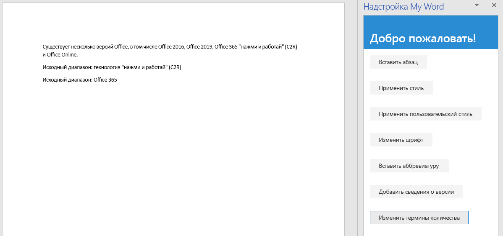

<span data-ttu-id="bcf8f-101">На этом этапе руководства мы добавим текст в выбранные диапазоны текста и за их пределами, а также заменим текст выбранного диапазона.</span><span class="sxs-lookup"><span data-stu-id="bcf8f-101">In this step of the tutorial, you'll add text inside and outside of selected ranges of text, and replace the text of a selected range.</span></span>

> [!NOTE]
> <span data-ttu-id="bcf8f-p101">На этой странице описывается отдельный этап из руководства по надстройкам Word. Если вы перешли на эту страницу со страницы результатов поисковой системы или по другой прямой ссылке, перейдите на вводную страницу [руководства по надстройкам Word](../tutorials/word-tutorial.yml), чтобы начать обучение с самого начала.</span><span class="sxs-lookup"><span data-stu-id="bcf8f-p101">This page describes an individual step of a Word add-in tutorial. If you’ve arrived at this page via search engine results or other direct link, please go to the [Word add-in tutorial](../tutorials/word-tutorial.yml) introduction page to start the tutorial from the beginning.</span></span>

## <a name="add-text-inside-a-range"></a><span data-ttu-id="bcf8f-104">Добавление текста в диапазон</span><span class="sxs-lookup"><span data-stu-id="bcf8f-104">Add text inside a range</span></span>

1. <span data-ttu-id="bcf8f-105">Откройте проект в редакторе кода.</span><span class="sxs-lookup"><span data-stu-id="bcf8f-105">Open the project in your code editor.</span></span>
2. <span data-ttu-id="bcf8f-106">Откройте файл index.html.</span><span class="sxs-lookup"><span data-stu-id="bcf8f-106">Open the file index.html.</span></span>
3. <span data-ttu-id="bcf8f-107">Под элементом `div`, содержащим кнопку `change-font`, добавьте следующую разметку:</span><span class="sxs-lookup"><span data-stu-id="bcf8f-107">Below the `div` that contains the `change-font` button, add the following markup:</span></span>

    ```html
    <div class="padding">
        <button class="ms-Button" id="insert-text-into-range">Insert Abbreviation</button>
    </div>
    ```

4. <span data-ttu-id="bcf8f-108">Откройте файл app.js.</span><span class="sxs-lookup"><span data-stu-id="bcf8f-108">Open the app.js file.</span></span>

5. <span data-ttu-id="bcf8f-109">Под строкой, назначающей обработчик нажатия кнопки `change-font`, добавьте следующий код:</span><span class="sxs-lookup"><span data-stu-id="bcf8f-109">Below the line that assigns a click handler to the `change-font` button, add the following code:</span></span>

    ```js
    $('#insert-text-into-range').click(insertTextIntoRange);
    ```

6. <span data-ttu-id="bcf8f-110">Добавьте приведенную ниже функцию под функцией `changeFont`.</span><span class="sxs-lookup"><span data-stu-id="bcf8f-110">Below the `changeFont` function, add the following function:</span></span>

    ```js
    function insertTextIntoRange() {
        Word.run(function (context) {

            // TODO1: Queue commands to insert text into a selected range.

            // TODO2: Load the text of the range and sync so that the
            //        current range text can be read.

            // TODO3: Queue commands to repeat the text of the original
            //        range at the end of the document.

            return context.sync();
        })
        .catch(function (error) {
            console.log("Error: " + error);
            if (error instanceof OfficeExtension.Error) {
                console.log("Debug info: " + JSON.stringify(error.debugInfo));
            }
        });
    }
    ``` 

7. <span data-ttu-id="bcf8f-p102">Замените `TODO1` на приведенный ниже код. Обратите внимание:</span><span class="sxs-lookup"><span data-stu-id="bcf8f-p102">Replace `TODO1` with the following code. Note:</span></span>
   - <span data-ttu-id="bcf8f-113">Этот метод призван вставить аббревиатуру ["(C2R)"] в конце диапазона с текстом "Click-to-Run".</span><span class="sxs-lookup"><span data-stu-id="bcf8f-113">The method is intended to insert the abbreviation ["(C2R)"] into the end of the Range whose text is "Click-to-Run".</span></span> <span data-ttu-id="bcf8f-114">Для простоты предполагается, что такая строка существует и пользователь выделил ее.</span><span class="sxs-lookup"><span data-stu-id="bcf8f-114">It makes a simplifying assumption that the string is present and the user has selected it.</span></span>
   - <span data-ttu-id="bcf8f-115">Первый параметр метода `Range.insertText` — это строка, вставляемая в объект `Range`.</span><span class="sxs-lookup"><span data-stu-id="bcf8f-115">The first parameter of the `Range.insertText` method is the string to insert into the `Range` object.</span></span>
   - <span data-ttu-id="bcf8f-116">Второй параметр указывает, в каком месте диапазона требуется вставить дополнительный текст.</span><span class="sxs-lookup"><span data-stu-id="bcf8f-116">The second parameter specifies where in the range the additional text should be inserted.</span></span> <span data-ttu-id="bcf8f-117">Помимо значения End, можно использовать значения Start, Before, After и Replace.</span><span class="sxs-lookup"><span data-stu-id="bcf8f-117">Besides "End", the other possible options are "Start", "Before", "After", and "Replace".</span></span> 
   - <span data-ttu-id="bcf8f-118">Разница между значениями End и After состоит в том, что End вставляет новый текст в конце имеющегося диапазона, а After создает новый диапазон со строкой и вставляет его после имеющегося.</span><span class="sxs-lookup"><span data-stu-id="bcf8f-118">The difference between "End" and "After" is that "End" inserts the new text inside the end of the existing range, but "After" creates a new range with the string and inserts the new range after the existing range.</span></span> <span data-ttu-id="bcf8f-119">Аналогично, Start вставляет текст в начале имеющегося диапазона, а Before вставляет новый диапазон.</span><span class="sxs-lookup"><span data-stu-id="bcf8f-119">Similarly, "Start" inserts text inside the beginning of the existing range and "Before" inserts a new range.</span></span> <span data-ttu-id="bcf8f-120">Replace заменяет текст существующего диапазона на строку из первого параметра.</span><span class="sxs-lookup"><span data-stu-id="bcf8f-120">"Replace" replaces the text of the existing range with the string in the first parameter.</span></span>
   - <span data-ttu-id="bcf8f-121">На одном из предыдущих этапов руководства вы могли заметить, что в методах insert\* объекта body нет параметров Before и After.</span><span class="sxs-lookup"><span data-stu-id="bcf8f-121">You saw in an earlier stage of the tutorial that the insert\* methods of the body object do not have the "Before" and "After" options.</span></span> <span data-ttu-id="bcf8f-122">Это связано с тем, что содержимое невозможно добавлять за пределами основного текста документа.</span><span class="sxs-lookup"><span data-stu-id="bcf8f-122">This is because you can't put content outside of the document's body.</span></span>

    ```js
    const doc = context.document;
    const originalRange = doc.getSelection();
    originalRange.insertText(" (C2R)", "End");
    ```

8. <span data-ttu-id="bcf8f-123">Пропустим заполнитель `TODO2` до следующего этапа.</span><span class="sxs-lookup"><span data-stu-id="bcf8f-123">We'll skip over `TODO2` until the next section.</span></span> <span data-ttu-id="bcf8f-124">Замените `TODO3` на приведенный ниже код.</span><span class="sxs-lookup"><span data-stu-id="bcf8f-124">Replace `TODO3` with the following code.</span></span> <span data-ttu-id="bcf8f-125">Он похож на код, созданный на первом этапе руководства, но теперь мы вставляем новый абзац в конце, а не в начале документа.</span><span class="sxs-lookup"><span data-stu-id="bcf8f-125">This code is similar to the code you created in the first stage of the tutorial, except that now you are inserting a new paragraph at the end of the document instead of at the start.</span></span> <span data-ttu-id="bcf8f-126">Новый абзац покажет, что новый текст теперь входит в исходный диапазон.</span><span class="sxs-lookup"><span data-stu-id="bcf8f-126">This new paragraph will demonstrate that the new text is now part of the original range.</span></span>

    ```js
    doc.body.insertParagraph("Original range: " + originalRange.text,
                             "End");
    ```

## <a name="add-code-to-fetch-document-properties-into-the-task-panes-script-objects"></a><span data-ttu-id="bcf8f-127">Добавление кода для получения свойств документа в объекты скриптов области задач</span><span class="sxs-lookup"><span data-stu-id="bcf8f-127">Add code to fetch document properties into the task pane's script objects</span></span>

<span data-ttu-id="bcf8f-128">В случае всех предыдущих функций из этой серии руководств вы ставили в очередь команды для *записи* данных в документ Office.</span><span class="sxs-lookup"><span data-stu-id="bcf8f-128">In all the previous functions in this series of tutorials, you queued commands to *write* to the Office document.</span></span> <span data-ttu-id="bcf8f-129">Каждая функция заканчивалась вызовом метода `context.sync()`, который отправляет поставленные в очередь команды документу для выполнения.</span><span class="sxs-lookup"><span data-stu-id="bcf8f-129">Each function ended with a call to the `context.sync()` method which sends the queued commands to the document to be executed.</span></span> <span data-ttu-id="bcf8f-130">Но код, который вы добавили на последнем этапе, вызывает свойство `originalRange.text`, и в этом заключается существенное отличие от ранее написанных функций, так как `originalRange` является лишь объектом прокси, существующим в скрипте вашей области задач.</span><span class="sxs-lookup"><span data-stu-id="bcf8f-130">But the code you added in the last step calls the `originalRange.text` property, and this is a significant difference from the earlier functions you wrote, because the `originalRange` object is only a proxy object that exists in your task pane's script.</span></span> <span data-ttu-id="bcf8f-131">В нем нет сведений о фактическом тексте диапазона в документе, поэтому его свойство `text` может не содержать настоящего значения.</span><span class="sxs-lookup"><span data-stu-id="bcf8f-131">It doesn't know what the actual text of the range in the document is, so its `text` property can't have a real value.</span></span> <span data-ttu-id="bcf8f-132">Необходимо сначала получить из документа текстовое значение диапазона, а затем задать с его помощью значение для свойства `originalRange.text`.</span><span class="sxs-lookup"><span data-stu-id="bcf8f-132">It is necessary to first fetch the text value of the range from the document and use it to set the value of `originalRange.text`.</span></span> <span data-ttu-id="bcf8f-133">Только после этого можно будет вызвать метод `originalRange.text` без исключения.</span><span class="sxs-lookup"><span data-stu-id="bcf8f-133">Only then can `originalRange.text` be called without causing an exception to be thrown.</span></span> <span data-ttu-id="bcf8f-134">Процесс получения делится на три этапа:</span><span class="sxs-lookup"><span data-stu-id="bcf8f-134">This fetching process has three steps:</span></span>

   1. <span data-ttu-id="bcf8f-135">Добавление в очередь команды для загрузки (т. е. получения) свойств, которые должен прочесть ваш код.</span><span class="sxs-lookup"><span data-stu-id="bcf8f-135">Queue a command to load (that is; fetch) the properties that your code needs to read.</span></span>
   2. <span data-ttu-id="bcf8f-136">Вызов метода `sync` объекта контекста, чтобы можно было отправить документу находящуюся в очереди команду для выполнения, а также для возврата запрошенных данных.</span><span class="sxs-lookup"><span data-stu-id="bcf8f-136">Call the context object's `sync` method to send the queued command to the document for execution and return the requested information.</span></span>
   3. <span data-ttu-id="bcf8f-137">Метод `sync` асинхронный, поэтому его выполнение должно быть завершено до того, как код вызовет полученные свойства.</span><span class="sxs-lookup"><span data-stu-id="bcf8f-137">Because the `sync` method is asynchronous, ensure that it has completed before your code calls the properties that were fetched.</span></span>

<span data-ttu-id="bcf8f-138">Эти три действия должны выполняться каждый раз, когда коду нужно *считывать* данные из документа Office.</span><span class="sxs-lookup"><span data-stu-id="bcf8f-138">These steps must be completed whenever your code needs to *read* information from the Office document.</span></span>

1. <span data-ttu-id="bcf8f-139">Замените `TODO2` на приведенный ниже код.</span><span class="sxs-lookup"><span data-stu-id="bcf8f-139">Replace `TODO2` with the following code.</span></span>
  
    ```js
    originalRange.load("text");
    return context.sync()
        .then(function() {

                // TODO4: Move the doc.body.insertParagraph line here.

            }
        )
            // TODO5: Move the final call of context.sync here and ensure
            //        that it does not run until the insertParagraph has
            //        been queued.
    ```

2. <span data-ttu-id="bcf8f-p109">Для двух операторов `return` не может использоваться один путь кода, который не разветвляется, поэтому удалите последнюю строку `return context.sync();` в конце метода `Word.run`. Последний метод `context.sync` будет добавлен позже в этом руководстве.</span><span class="sxs-lookup"><span data-stu-id="bcf8f-p109">You can't have two `return` statements in the same unbranching code path, so delete the final line `return context.sync();` at the end of the `Word.run`. You'll add a new final `context.sync` later in this tutorial.</span></span>
3. <span data-ttu-id="bcf8f-142">Вырежьте строку `doc.body.insertParagraph` и вставьте ее вместо заполнителя `TODO4`.</span><span class="sxs-lookup"><span data-stu-id="bcf8f-142">Cut the `doc.body.insertParagraph` line and paste in place of `TODO4`.</span></span>
4. <span data-ttu-id="bcf8f-p110">Замените `TODO5` на приведенный ниже код. Обратите внимание:</span><span class="sxs-lookup"><span data-stu-id="bcf8f-p110">Replace `TODO5` with the following code. Note:</span></span>
   - <span data-ttu-id="bcf8f-145">Передача метода `sync` в функцию `then` гарантирует, что он не будет выполняться, пока логика `insertParagraph` не будет поставлена в очередь.</span><span class="sxs-lookup"><span data-stu-id="bcf8f-145">Passing the `sync` method to a `then` function ensures that it does not run until the `insertParagraph` logic has been queued.</span></span>
   - <span data-ttu-id="bcf8f-146">Метод `then` вызывает любую функцию, которая ему передана. Не нужно вызывать `sync` дважды, поэтому уберите "()" в конце вызова context.sync.</span><span class="sxs-lookup"><span data-stu-id="bcf8f-146">The `then` method invokes whatever function is passed to it, and you don't want `sync` to be invoked twice, so leave off the "()" from the end of context.sync.</span></span>

    ```js
    .then(context.sync);
    ```

<span data-ttu-id="bcf8f-147">Когда все будет готово, функция должна выглядеть так:</span><span class="sxs-lookup"><span data-stu-id="bcf8f-147">When you are done, the entire function should look like the following:</span></span>


```js
function insertTextIntoRange() {
    Word.run(function (context) {

        const doc = context.document;
        const originalRange = doc.getSelection();
        originalRange.insertText(" (C2R)", "End");

        originalRange.load("text");
        return context.sync()
            .then(function() {
                        doc.body.insertParagraph("Current text of original range: " + originalRange.text,
                                                "End");
                }
            )
            .then(context.sync);
    })
    .catch(function (error) {
        console.log("Error: " + error);
        if (error instanceof OfficeExtension.Error) {
            console.log("Debug info: " + JSON.stringify(error.debugInfo));
        }
    });
}
```

## <a name="add-text-between-ranges"></a><span data-ttu-id="bcf8f-148">Добавление текста между диапазонами</span><span class="sxs-lookup"><span data-stu-id="bcf8f-148">Add text between ranges</span></span>

1. <span data-ttu-id="bcf8f-149">Откройте файл index.html.</span><span class="sxs-lookup"><span data-stu-id="bcf8f-149">Open the file index.html.</span></span>
2. <span data-ttu-id="bcf8f-150">Под элементом `div`, содержащим кнопку `insert-text-into-range`, добавьте следующую разметку:</span><span class="sxs-lookup"><span data-stu-id="bcf8f-150">Below the `div` that contains the `insert-text-into-range` button, add the following markup:</span></span>

    ```html
    <div class="padding">
        <button class="ms-Button" id="insert-text-outside-range">Add Version Info</button>
    </div>
    ```

3. <span data-ttu-id="bcf8f-151">Откройте файл app.js.</span><span class="sxs-lookup"><span data-stu-id="bcf8f-151">Open the app.js file.</span></span>

4. <span data-ttu-id="bcf8f-152">Под строкой, назначающей обработчик нажатия кнопки `insert-text-into-range`, добавьте следующий код:</span><span class="sxs-lookup"><span data-stu-id="bcf8f-152">Below the line that assigns a click handler to the `insert-text-into-range` button, add the following code:</span></span>

    ```js
    $('#insert-text-outside-range').click(insertTextBeforeRange);
    ```

5. <span data-ttu-id="bcf8f-153">Добавьте приведенную ниже функцию под функцией `insertTextIntoRange`.</span><span class="sxs-lookup"><span data-stu-id="bcf8f-153">Below the `insertTextIntoRange` function, add the following function:</span></span>

    ```js
    function insertTextBeforeRange() {
        Word.run(function (context) {

            // TODO1: Queue commands to insert a new range before the
            //        selected range.

            // TODO2: Load the text of the original range and sync so that the
            //        range text can be read and inserted.

        })
        .catch(function (error) {
            console.log("Error: " + error);
            if (error instanceof OfficeExtension.Error) {
                console.log("Debug info: " + JSON.stringify(error.debugInfo));
            }
        });
    }
    ```

6. <span data-ttu-id="bcf8f-p111">Замените `TODO1` на приведенный ниже код. Обратите внимание:</span><span class="sxs-lookup"><span data-stu-id="bcf8f-p111">Replace `TODO1` with the following code. Note:</span></span>
   - <span data-ttu-id="bcf8f-156">Этот метод предназначен для добавления диапазона с текстом "Office 2019, " перед диапазоном с текстом "Office 365".</span><span class="sxs-lookup"><span data-stu-id="bcf8f-156">The method is intended to add a range whose text is "Office 2019, " before the range with text "Office 365".</span></span> <span data-ttu-id="bcf8f-157">Для простоты предполагается, что такая строка существует и пользователь выделил ее.</span><span class="sxs-lookup"><span data-stu-id="bcf8f-157">It makes a simplifying assumption that the string is present and the user has selected it.</span></span>
   - <span data-ttu-id="bcf8f-158">Первый параметр метода `Range.insertText` — это добавляемая строка.</span><span class="sxs-lookup"><span data-stu-id="bcf8f-158">The first parameter of the `Range.insertText` method is the string to add.</span></span>
   - <span data-ttu-id="bcf8f-159">Второй параметр указывает, в каком месте диапазона требуется вставить дополнительный текст.</span><span class="sxs-lookup"><span data-stu-id="bcf8f-159">The second parameter specifies where in the range the additional text should be inserted.</span></span> <span data-ttu-id="bcf8f-160">Дополнительные сведения о вариантах расположения см. выше в описании функции `insertTextIntoRange`.</span><span class="sxs-lookup"><span data-stu-id="bcf8f-160">For more details about the location options, see the previous discussion of the `insertTextIntoRange` function.</span></span>

    ```js
    const doc = context.document;
    const originalRange = doc.getSelection();
    originalRange.insertText("Office 2019, ", "Before");
    ```

7. <span data-ttu-id="bcf8f-161">Замените `TODO2` на приведенный ниже код.</span><span class="sxs-lookup"><span data-stu-id="bcf8f-161">Replace `TODO2` with the following code.</span></span>

     ```js
    originalRange.load("text");
    return context.sync()
        .then(function() {

                // TODO3: Queue commands to insert the original range as a
                //        paragraph at the end of the document.

                }
            )

            // TODO4: Make a final call of context.sync here and ensure
            //        that it does not run until the insertParagraph has
            //        been queued.
    ```

8. <span data-ttu-id="bcf8f-162">Замените `TODO3` на приведенный ниже код.</span><span class="sxs-lookup"><span data-stu-id="bcf8f-162">Replace `TODO3` with the following code.</span></span> <span data-ttu-id="bcf8f-163">Этот абзац покажет, что новый текст ***не*** входит в исходный выделенный диапазон.</span><span class="sxs-lookup"><span data-stu-id="bcf8f-163">This new paragraph will demonstrate the fact that the new text is ***not*** part of the original selected range.</span></span> <span data-ttu-id="bcf8f-164">Исходный диапазон по-прежнему содержит такой же текст, как и когда он был выделен.</span><span class="sxs-lookup"><span data-stu-id="bcf8f-164">The original range still has only the text it had when it was selected.</span></span>

    ```js
    doc.body.insertParagraph("Current text of original range: " + originalRange.text,
                             "End");
    ```

9. <span data-ttu-id="bcf8f-165">Замените `TODO4` на приведенный ниже код.</span><span class="sxs-lookup"><span data-stu-id="bcf8f-165">Replace `TODO4` with the following code:</span></span>

    ```js
    .then(context.sync);
    ```


## <a name="replace-the-text-of-a-range"></a><span data-ttu-id="bcf8f-166">Замена текста диапазона</span><span class="sxs-lookup"><span data-stu-id="bcf8f-166">Replace the text of a range</span></span>

1. <span data-ttu-id="bcf8f-167">Откройте файл index.html.</span><span class="sxs-lookup"><span data-stu-id="bcf8f-167">Open the file index.html.</span></span>
2. <span data-ttu-id="bcf8f-168">Под элементом `div`, содержащим кнопку `insert-text-outside-range`, добавьте следующую разметку:</span><span class="sxs-lookup"><span data-stu-id="bcf8f-168">Below the `div` that contains the `insert-text-outside-range` button, add the following markup:</span></span>

    ```html
    <div class="padding">
        <button class="ms-Button" id="replace-text">Change Quantity Term</button>
    </div>
    ```

3. <span data-ttu-id="bcf8f-169">Откройте файл app.js.</span><span class="sxs-lookup"><span data-stu-id="bcf8f-169">Open the app.js file.</span></span>

4. <span data-ttu-id="bcf8f-170">Под строкой, назначающей обработчик нажатия кнопки `insert-text-outside-range`, добавьте следующий код:</span><span class="sxs-lookup"><span data-stu-id="bcf8f-170">Below the line that assigns a click handler to the `insert-text-outside-range` button, add the following code:</span></span>

    ```js
    $('#replace-text').click(replaceText);
    ```

5. <span data-ttu-id="bcf8f-171">Добавьте приведенную ниже функцию под функцией `insertTextBeforeRange`.</span><span class="sxs-lookup"><span data-stu-id="bcf8f-171">Below the `insertTextBeforeRange` function, add the following function:</span></span>

    ```js
    function replaceText() {
        Word.run(function (context) {

            // TODO1: Queue commands to replace the text.

            return context.sync();
        })
        .catch(function (error) {
            console.log("Error: " + error);
            if (error instanceof OfficeExtension.Error) {
                console.log("Debug info: " + JSON.stringify(error.debugInfo));
            }
        });
    }
    ```

6. <span data-ttu-id="bcf8f-172">Замените `TODO1` на приведенный ниже код.</span><span class="sxs-lookup"><span data-stu-id="bcf8f-172">Replace `TODO1` with the following code.</span></span> <span data-ttu-id="bcf8f-173">Обратите внимание, что этот метод предназначен для замены строки "several" на строку "many".</span><span class="sxs-lookup"><span data-stu-id="bcf8f-173">Note that the method is intended to replace the string "several" with the string "many".</span></span> <span data-ttu-id="bcf8f-174">Для простоты предполагается, что такая строка существует и пользователь выделил ее.</span><span class="sxs-lookup"><span data-stu-id="bcf8f-174">It makes a simplifying assumption that the string is present and the user has selected it.</span></span>

    ```js
    const doc = context.document;
    const originalRange = doc.getSelection();
    originalRange.insertText("many", "Replace");
    ```

## <a name="test-the-add-in"></a><span data-ttu-id="bcf8f-175">Тестирование надстройки</span><span class="sxs-lookup"><span data-stu-id="bcf8f-175">Test the add-in</span></span>

1. <span data-ttu-id="bcf8f-176">Если окно Git Bash или системная командная строка с поддержкой Node.JS, открытые на предыдущем этапе руководства, все еще открыты, дважды нажмите клавиши CTRL+C, чтобы остановить работу веб-сервера.</span><span class="sxs-lookup"><span data-stu-id="bcf8f-176">If the Git bash window, or Node.JS-enabled system prompt, from the previous stage tutorial is still open, enter Ctrl-C twice to stop the running web server.</span></span> <span data-ttu-id="bcf8f-177">Если они закрыты, откройте окно Git Bash или системную командную строку с поддержкой Node.JS и перейдите к папке **Start** проекта.</span><span class="sxs-lookup"><span data-stu-id="bcf8f-177">Otherwise, open a Git bash window, or Node.JS-enabled system prompt, and navigate to the **Start** folder of the project.</span></span>

     > [!NOTE]
     > <span data-ttu-id="bcf8f-178">Хотя сервер синхронизации браузера будет повторно загружать надстройку в области задач при каждом изменении любого файла (в том числе app.js), он не передает повторно код JavaScript, поэтому нужно будет снова выполнить команду сборки, чтобы изменения, внесенные в файл app.js, вступили в силу.</span><span class="sxs-lookup"><span data-stu-id="bcf8f-178">Although the browser-sync server reloads your add-in in the task pane every time you make a change to any file, including the app.js file, it does not retranspile the JavaScript, so you must repeat the build command in order for your changes to app.js to take effect.</span></span> <span data-ttu-id="bcf8f-179">Для этого необходимо завершить процесс сервера, чтобы появился запрос и вы могли ввести команду сборки.</span><span class="sxs-lookup"><span data-stu-id="bcf8f-179">In order to do this, you need to kill the server process so that the prompt appears and you can enter the build command.</span></span> <span data-ttu-id="bcf8f-180">После сборки перезапустите сервер.</span><span class="sxs-lookup"><span data-stu-id="bcf8f-180">After the build, restart the server.</span></span> <span data-ttu-id="bcf8f-181">Для этого выполните указанные ниже действия.</span><span class="sxs-lookup"><span data-stu-id="bcf8f-181">The next few steps carry out this process.</span></span>

2. <span data-ttu-id="bcf8f-182">Выполните команду `npm run build`, чтобы преобразовать исходный код ES6 в более раннюю версию JavaScript, поддерживаемую всеми ведущими приложениями, в которых могут работать надстройки Office.</span><span class="sxs-lookup"><span data-stu-id="bcf8f-182">Run the command `npm run build` to transpile your ES6 source code to an earlier version of JavaScript that is supported by all the hosts where Office Add-ins can run.</span></span>
3. <span data-ttu-id="bcf8f-183">Выполните команду `npm start`, чтобы запустить веб-сервер, работающий на localhost.</span><span class="sxs-lookup"><span data-stu-id="bcf8f-183">Run the command `npm start` to start a web server running on localhost.</span></span>
4. <span data-ttu-id="bcf8f-184">Перезагрузите область задач. Для этого закройте ее, а затем выберите в меню **Главная** пункт **Показать область задач**, чтобы заново открыть надстройку.</span><span class="sxs-lookup"><span data-stu-id="bcf8f-184">Reload the task pane by closing it, and then on the **Home** menu, select **Show Taskpane** to reopen the add-in.</span></span>
5. <span data-ttu-id="bcf8f-185">В области задач нажмите кнопку **Insert Paragraph** (Вставить абзац), чтобы убедиться, что в начале документа есть абзац.</span><span class="sxs-lookup"><span data-stu-id="bcf8f-185">In the taskpane, choose **Insert Paragraph** to ensure that there is a paragraph at the start of the document.</span></span>
6. <span data-ttu-id="bcf8f-186">Выделите какой-нибудь текст.</span><span class="sxs-lookup"><span data-stu-id="bcf8f-186">Select some text.</span></span> <span data-ttu-id="bcf8f-187">Лучше всего выбрать фразу "Click-to-Run".</span><span class="sxs-lookup"><span data-stu-id="bcf8f-187">Selecting the phrase "Click-to-Run" will make the most sense.</span></span> <span data-ttu-id="bcf8f-188">*Будьте осторожны, чтобы не выделить пробел в начале или конце фразы.*</span><span class="sxs-lookup"><span data-stu-id="bcf8f-188">*Be careful not to include the preceding or following space in the selection.*</span></span>
7. <span data-ttu-id="bcf8f-189">Нажмите кнопку **Insert Abbreviation** (Вставить аббревиатуру).</span><span class="sxs-lookup"><span data-stu-id="bcf8f-189">Choose the **Insert Abbreviation** button.</span></span> <span data-ttu-id="bcf8f-190">Обратите внимание на добавленную строку " (C2R)".</span><span class="sxs-lookup"><span data-stu-id="bcf8f-190">Note that " (C2R)" is added.</span></span> <span data-ttu-id="bcf8f-191">Кроме того, обратите внимание, что в конце документа добавлен новый абзац со всем развернутым текстом, так как новая строка была добавлена к имеющемуся диапазону.</span><span class="sxs-lookup"><span data-stu-id="bcf8f-191">Note also that at the bottom of the document a new paragraph is added with the entire expanded text because the new string was added to the existing range.</span></span>
8. <span data-ttu-id="bcf8f-192">Выделите какой-нибудь текст.</span><span class="sxs-lookup"><span data-stu-id="bcf8f-192">Select some text.</span></span> <span data-ttu-id="bcf8f-193">Лучше всего выбрать фразу "Office 365".</span><span class="sxs-lookup"><span data-stu-id="bcf8f-193">Selecting the phrase "Office 365" will make the most sense.</span></span> <span data-ttu-id="bcf8f-194">*Будьте осторожны, чтобы не выделить пробел в начале или конце фразы.*</span><span class="sxs-lookup"><span data-stu-id="bcf8f-194">*Be careful not to include the preceding or following space in the selection.*</span></span>
9. <span data-ttu-id="bcf8f-195">Нажмите кнопку **Add Version Info** (Добавить сведения о версии).</span><span class="sxs-lookup"><span data-stu-id="bcf8f-195">Choose the **Add Version Info** button.</span></span> <span data-ttu-id="bcf8f-196">Обратите внимание, что между строками "Office 2016" и "Office 365" вставлена строка "Office 2019, ".</span><span class="sxs-lookup"><span data-stu-id="bcf8f-196">Note that "Office 2019, " is inserted between "Office 2016" and "Office 365".</span></span> <span data-ttu-id="bcf8f-197">Кроме того, обратите внимание, что в конце документа появился новый абзац, содержащий только изначально выделенный текст, так как новая строка стала новым диапазоном, а не была добавлена к существующему.</span><span class="sxs-lookup"><span data-stu-id="bcf8f-197">Note also that at the bottom of the document a new paragraph is added but it contains only the originally selected text because the new string became a new range rather than being added to the original range.</span></span>
10. <span data-ttu-id="bcf8f-198">Выделите какой-нибудь текст.</span><span class="sxs-lookup"><span data-stu-id="bcf8f-198">Select some text.</span></span> <span data-ttu-id="bcf8f-199">Лучше всего выделить слово "several".</span><span class="sxs-lookup"><span data-stu-id="bcf8f-199">Selecting the word "several" will make the most sense.</span></span> <span data-ttu-id="bcf8f-200">*Будьте осторожны, чтобы не выделить пробел в начале или конце фразы.*</span><span class="sxs-lookup"><span data-stu-id="bcf8f-200">*Be careful not to include the preceding or following space in the selection.*</span></span>
11. <span data-ttu-id="bcf8f-201">Нажмите кнопку **Change Quantity Term** (Изменить числительное).</span><span class="sxs-lookup"><span data-stu-id="bcf8f-201">Choose the **Change Quantity Term** button.</span></span> <span data-ttu-id="bcf8f-202">Обратите внимание, что слово "many" заменило выделенный текст.</span><span class="sxs-lookup"><span data-stu-id="bcf8f-202">Note that "many" replaces the selected text.</span></span>

    
