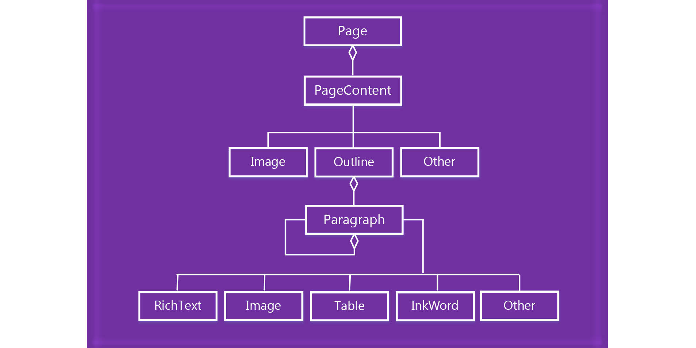

# Работа с содержимым страницы в OneNote 

В API JavaScript для надстроек OneNote содержимое страницы представлено указанной ниже объектной моделью.

  

- Объект Page содержит коллекцию объектов PageContent.
- Объект PageContent содержит контент типов Outline, Image или Other.
- Объект Outline содержит коллекцию объектов Paragraph.
- Объект Paragraph содержит контент типов RichText, Image, Table или Other.

Чтобы создать пустую страницу OneNote, воспользуйтесь одним из указанных ниже методов.

- [Section.addPage](../../reference/onenote/section.md#addpagetitle-string)
- [Page.insertPageAsSibling](../../reference/onenote/page.md#insertpageassiblinglocation-string-title-string)

Затем используйте методы в указанных ниже объектах для работы с содержимым страницы, например Page.addOutline и Outline.appendHtml. 

- [Page](../../reference/onenote/page.md)
- [Outline](../../reference/onenote/outline.md)
- [Paragraph](../../reference/onenote/paragraph.md)

Для представления содержимого и структуры страницы OneNote используется HTML. Для создания или обновления содержимого страницы поддерживается только подмножество HTML, как описано ниже.

## Поддерживаемые элементы HTML

Для создания и обновления содержимого страницы в API JavaScript для надстроек OneNote используются указанные ниже элементы HTML.

- `<html>`, `<body>`, `
`, ``, ` ` 
- `
`
- ``
- `<a>`
- `<ul>`, `<ol>`, `<li>` 
- `<table>`, `<tr>`, `<td>`
- `<h1>` ... `<h6>`
- `<b>`, `<em>`, `<strong>`, `<i>`, `<u>`, `<del>`, ``, ``, `<cite>`

## Доступ к содержимому страницы

Через `Page#load` доступ можно получить только к *содержимому активной страницы*. Чтобы изменить активную страницу, вызовите команду `navigateToPage($page)`.

Метаданные, например "Название", можно запросить для любой страницы.

## Дополнительные ресурсы

- [Обзор создания кода с помощью API JavaScript для OneNote](onenote-add-ins-programming-overview.md)
- [Справочник по API JavaScript для OneNote](../../reference/onenote/onenote-add-ins-javascript-reference.md)
- [Пример надстройки Rubric Grader](https://github.com/OfficeDev/OneNote-Add-in-Rubric-Grader)
- [Обзор платформы надстроек Office](https://dev.office.com/docs/add-ins/overview/office-add-ins)
