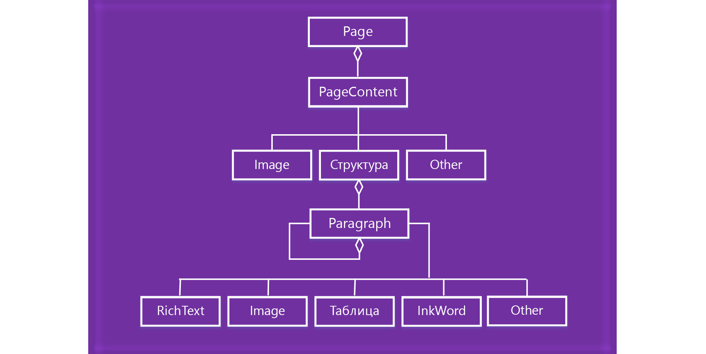

# Работа с содержимым страницы в OneNoteWork with OneNote page content 

В API JavaScript для надстроек OneNote содержимое страницы представлено указанной ниже объектной моделью.In the OneNote add-ins JavaScript API, page content is represented by the following object model.

  

- Объект Page содержит коллекцию объектов PageContent.A Page object contains a collection of PageContent objects.
- Объект PageContent включает типы содержимого Outline, Image или Other.A PageContent object contains a content type of Outline, Image, or Other.
- Объект Outline содержит коллекцию объектов Paragraph.An Outline object contains a collection of Paragraph objects.
- Объект Paragraph включает типы содержимого  RichText, Image, Table или Other.A Paragraph object contains a content type of RichText, Image, Table, or Other.

Чтобы создать пустую страницу OneNote, воспользуйтесь одним из указанных ниже методов.To create an empty OneNote page, use one of the following methods:

- [Section.addPageSection.addPage](https://docs.microsoft.com/javascript/api/onenote/onenote.section?view=office-js#addpage-title-)
- [Page.insertPageAsSiblingPage.insertPageAsSibling](https://docs.microsoft.com/javascript/api/onenote/onenote.section?view=office-js#insertsectionassibling-location--title-)

Затем используйте методы в указанных ниже объектах для работы с содержимым страницы, например Page.addOutline и Outline.appendHtml.Then use methods in the following objects to work with the page content, such as Page.addOutline and Outline.appendHtml. 

- [СтраницаPage](https://docs.microsoft.com/javascript/api/onenote/onenote.page?view=office-js)
- [СтруктураOutline](https://docs.microsoft.com/javascript/api/onenote/onenote.outline?view=office-js)
- [АбзацParagraph](https://docs.microsoft.com/javascript/api/onenote/onenote.paragraph?view=office-js)

Для представления содержимого и структуры страницы OneNote используется HTML. Для создания или обновления содержимого страницы поддерживается только подмножество HTML, как описано ниже.The content and structure of a OneNote page are represented by HTML. Only a subset of HTML is supported for creating or updating page content, as described below.

## Поддерживаемые элементы HTMLSupported HTML

Для создания и обновления содержимого страницы в API JavaScript для надстроек OneNote используются указанные ниже элементы HTML.The OneNote add-in JavaScript API supports the following HTML for creating and updating page content:

- `<html>`, `<body>`, `
`, ``, ` ``<html>`, `<body>`, `
`, ``, ` ` 
- `
`
- ``
- `<a>`
- `<ul>`, `<ol>`, `<li>``<ul>`, `<ol>`, `<li>` 
- `<table>`, `<tr>`, `<td>``<table>`, `<tr>`, `<td>`
- `<h1>` ... `<h6>``<h1>` ... `<h6>`
- `<b>`, `<em>`, `<strong>`, `<i>`, `<u>`, `<del>`, ``, ``, `<cite>``<b>`, `<em>`, `<strong>`, `<i>`, `<u>`, `<del>`, ``, ``, `<cite>`

## Доступ к содержимому страницыAccessing page contents

Через `Page#load` доступ можно получить только к *содержимому активной страницы*. Чтобы изменить активную страницу, вызовите команду `navigateToPage($page)`.You are only able to access *Page Content* via `Page#load` for the currently active page. To change the active  page, invoke `navigateToPage($page)`.

Метаданные, например "Название", можно запросить для любой страницы.Metadata such as title can still be queried for any page.

## См. такжеSee also

- [Обзор создания кода с помощью API JavaScript для OneNoteOneNote JavaScript API programming overview](onenote-add-ins-programming-overview.md)
- [Ссылка на API JavaScript для OneNoteOneNote JavaScript API reference](https://docs.microsoft.com/office/dev/add-ins/reference/overview/onenote-add-ins-javascript-reference?view=office-js)
- [Пример надстройки Rubric GraderRubric Grader sample](https://github.com/OfficeDev/OneNote-Add-in-Rubric-Grader)
- [Обзор платформы надстроек OfficeOffice Add-ins platform overview](../overview/office-add-ins.md)
