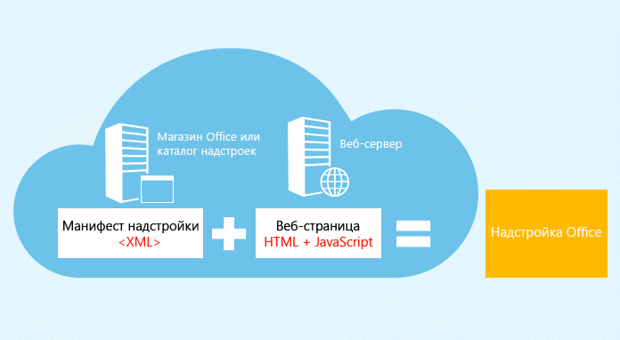
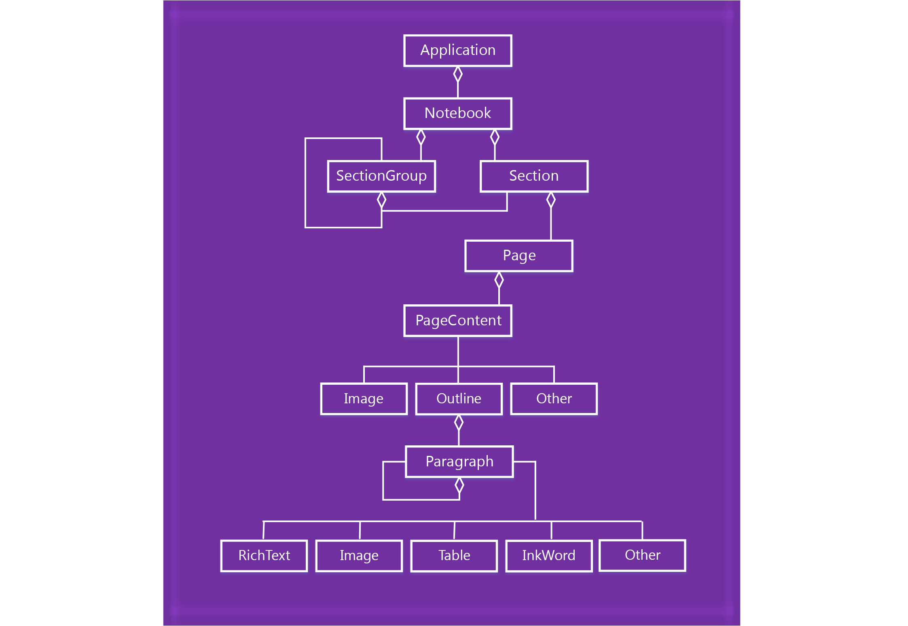

# <a name="onenote-javascript-api-programming-overview"></a>Обзор создания кода с помощью API JavaScript для OneNote

В OneNote представлен API JavaScript для надстроек OneNote в Интернете. Вы можете создавать надстройки области задач, контентные надстройки и команды надстроек, которые взаимодействуют с объектами OneNote и подключаются к веб-службам или другим веб-ресурсам.

> [!NOTE]
> Если вы планируете [опубликовать](../publish/publish.md) надстройку в AppSource и сделать ее доступной в интерфейсе Office, убедитесь, что она соответствует [политикам проверки AppSource](/office/dev/store/validation-policies). Например, чтобы пройти проверку, надстройка должна работать на всех платформах, поддерживающих определенные вами методы. Дополнительные сведения см. в [разделе 4.12](/office/dev/store/validation-policies#4-apps-and-add-ins-behave-predictably) и на [странице со сведениями о доступности и ведущих приложениях для надстроек Office](../overview/office-add-in-availability.md).

## <a name="components-of-an-office-add-in"></a>Компоненты надстройки Office

Надстройки состоят из двух указанных ниже основных компонентов.

- **Веб-приложение**, состоящее из веб-страницы и необходимых JavaScript-, CSS- или других файлов. Эти файлы можно разместить на веб-сервере или в службе веб-хостинга, например в Microsoft Azure. В OneNote в Интернете веб-приложение отображается в элементе управления браузера или в iFrame.

- **Манифест в формате XML**, в котором указан URL-адрес веб-страницы надстройки и все требования, необходимые для получения доступа, параметры и возможности для надстройки. Этот файл хранится на клиентском компьютере. Для надстроек OneNote используется такой же формат [манифеста](../develop/add-in-manifests.md), что и для других надстроек Office.

**Надстройка Office = манифест + веб-страница**



## <a name="using-the-javascript-api"></a>Использование API JavaScript

Для доступа к API JavaScript надстройки используют контекст среды выполнения ведущего приложения. API состоит из двух указанных ниже уровней.

- **API для определенных ведущих приложений** для связанных с OneNote операций, доступ к которому осуществляется с помощью объекта `Application`.
- **Общий API**, используемый приложениями Office, доступ к которому осуществляется с помощью объекта `Document`.

### <a name="accessing-the-host-specific-api-through-the-application-object"></a>Доступ к API для определенных ведущих приложений с помощью объекта *Application*

Для доступа к объектам OneNote, например к объектам **Notebook**, **Section** и **Page**, используйте объект `Application`. С помощью API для определенных ведущих приложений вы можете запустить пакетные операции на прокси-объектах. Основной процесс выглядит примерно так, как указано ниже.

1. Получение экземпляра приложения из контекста.

2. Создание прокси-объекта, представляющего объект OneNote, с которым вам необходимо работать. Для синхронного взаимодействия с прокси-объектами можно считывать и записывать их свойства и вызывать имеющиеся в них методы.

3. Вызовите метод `load` прокси-объекта, чтобы указать для него значения свойств, указанные в параметре. Этот вызов будет добавлен в очередь команд.

   > [!NOTE]
   > Вызовы, которые методы совершают к API (например, `context.application.getActiveSection().pages;`), также добавляются в очередь.

4. Чтобы запустить все поставленные в очередь команды в том порядке, в котором они находятся в очереди, вызовите метод `context.sync`. Этот метод синхронизирует состояния выполняющихся сценариев и реальных объектов, а также получает свойства загруженных объектов OneNote, которые необходимо использовать в сценарии. Вы можете использовать возвращенный объект обещания для связывания дополнительных действий в цепочку.

Например:

```js
function getPagesInSection() {
    OneNote.run(function (context) {

        // Get the pages in the current section.
        var pages = context.application.getActiveSection().pages;

        // Queue a command to load the id and title for each page.
        pages.load('id,title');

        // Run the queued commands, and return a promise to indicate task completion.
        return context.sync()
            .then(function () {

                // Read the id and title of each page.
                $.each(pages.items, function(index, page) {
                    var pageId = page.id;
                    var pageTitle = page.title;
                    console.log(pageTitle + ': ' + pageId);
                });
            })
            .catch(function (error) {
                app.showNotification("Error: " + error);
                console.log("Error: " + error);
                if (error instanceof OfficeExtension.Error) {
                    console.log("Debug info: " + JSON.stringify(error.debugInfo));
                }
            });
    });
}
```

Сведения о поддерживаемых объектах и операциях OneNote см. в [справочнике по API](../reference/overview/onenote-add-ins-javascript-reference.md).

#### <a name="onenote-javascript-api-requirement-sets"></a>Наборы обязательных элементов API JavaScript для OneNote

Наборы обязательных элементов — именованные группы элементов API. Надстройки Office с помощью наборов обязательных элементов, указанных в манифесте, или проверки в среде выполнения определяют, поддерживает ли ведущее приложение Office необходимые API. Дополнительные сведения о наборах обязательных элементов API JavaScript для OneNote см. в статье [Наборы обязательных элементов API JavaScript для OneNote](../reference/requirement-sets/onenote-api-requirement-sets.md).

### <a name="accessing-the-common-api-through-the-document-object"></a>Получение доступа к общему API с помощью объекта *Document*

Для доступа к общему API, например к методам [getSelectedDataAsync](/javascript/api/office/office.document#getselecteddataasync-coerciontype--options--callback-) и [setSelectedDataAsync](/javascript/api/office/office.document#setselecteddataasync-data--options--callback-), используйте объект `Document`.


Например:  

```js
function getSelectionFromPage() {
    Office.context.document.getSelectedDataAsync(
        Office.CoercionType.Text,
        { valueFormat: "unformatted" },
        function (asyncResult) {
            var error = asyncResult.error;
            if (asyncResult.status === Office.AsyncResultStatus.Failed) {
                console.log(error.message);
            }
            else $('#input').val(asyncResult.value);
        });
}
```

Надстройки OneNote поддерживают только указанные ниже общие API.

| API | Примечания |
|:------|:------|
| [Office.context.document.getSelectedDataAsync](/javascript/api/office/office.document#getselecteddataasync-coerciontype--options--callback-) | Только `Office.CoercionType.Text` и `Office.CoercionType.Matrix` |
| [Office.context.document.setSelectedDataAsync](/javascript/api/office/office.document#setselecteddataasync-data--options--callback-) | Только `Office.CoercionType.Text`, `Office.CoercionType.Image` и `Office.CoercionType.Html` | 
| [var mySetting = Office.context.document.settings.get(имя);](/javascript/api/office/office.settings#get-name-) | Параметры поддерживаются только контентными надстройками | 
| [Office.context.document.settings.set(имя, значение);](/javascript/api/office/office.settings#set-name--value-) | Параметры поддерживаются только контентными надстройками | 
| [Office.EventType.DocumentSelectionChanged](/javascript/api/office/office.documentselectionchangedeventargs) ||

Обычно общий API следует использовать, когда необходимые возможности не поддерживаются в API для определенных ведущих приложений. Дополнительные сведения об использовании общего API см. в статье [Общая объектная модель API JavaScript](../develop/office-javascript-api-object-model.md).


<a name="om-diagram"></a>
## <a name="onenote-object-model-diagram"></a>Схема объектной модели OneNote 
На схеме ниже показаны возможности, которые на данный момент доступны в API JavaScript для OneNote .

  


## <a name="see-also"></a>См. также

- [Создание надстроек Office](../overview/office-add-ins-fundamentals.md)
- [Создание первой надстройки OneNote](../quickstarts/onenote-quickstart.md)
- [Справочник по API JavaScript для OneNote](../reference/overview/onenote-add-ins-javascript-reference.md)
- [Пример надстройки Rubric Grader](https://github.com/OfficeDev/OneNote-Add-in-Rubric-Grader)
- [Обзор платформы надстроек Office](../overview/office-add-ins.md)
