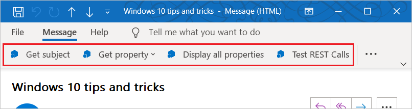
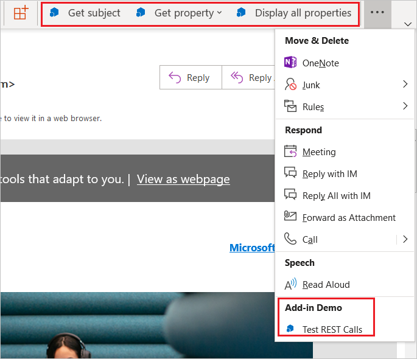

# Команды надстроек OutlookAdd-in commands for Outlook

Команды надстроек Outlook позволяют вызывать определенные действия надстроек с ленты путем добавления кнопок или раскрывающихся меню. Благодаря этому пользователи могут легко получать доступ к надстройкам простым и интуитивно понятным способом. Так как команды надстроек предлагают удобные расширенные функции, с их помощью вы можете создавать более интересные решения.Outlook add-in commands provide ways to initiate specific add-in actions from the ribbon by adding buttons or drop-down menus. This lets users access add-ins in a simple, intuitive, and unobtrusive way. Because they offer increased functionality in a seamless manner, you can use add-in commands to create more engaging solutions.

> [!NOTE]
> Команды надстроек доступны только в Outlook 2013 или более поздней версии для Windows, Outlook 2016 для Mac, Outlook для iPhone, Outlook для Android, Outlook в Интернете для Exchange 2016 или более поздней версии, Outlook в Интернете для Office 365 и Outlook.com.Add-in commands are available only in Outlook 2013 or later on Windows, Outlook 2016 or later on Mac, Outlook on iPhone, Outlook on Android, Outlook on the web for Exchange 2016 or later, and Outlook on the web for Office 365 and Outlook.com.
>
> Для поддержки команд надстроек в Outlook 2013 необходимы три обновления:Support for add-in commands in Outlook 2013 requires three updates:
> - [Обновление для системы безопасности для Outlook от 8 марта 2016 г.March 8, 2016 security update for Outlook](https://support.microsoft.com/kb/3114829)
> - [Обновление для системы безопасности для Office (KB3114816) от 8 марта 2016 г.March 8, 2016 security update for Office (KB3114816)](https://support.microsoft.com/help/3114816/march-8,-2016,-update-for-office-2013-kb3114816)
> - [Обновление для системы безопасности для Office (KB3114828) от 8 марта 2016 г.March 8, 2016 security update for Office (KB3114828)](https://support.microsoft.com/help/3114828/march-8,-2016,-update-for-office-2013-kb3114828)
>
> Для поддержки команд надстроек в Exchange 2016 требуется [накопительный пакет обновления 5](https://support.microsoft.com/help/4012106/cumulative-update-5-for-exchange-server-2016).Support for add-in commands in Exchange 2016 requires [Cumulative Update 5](https://support.microsoft.com/help/4012106/cumulative-update-5-for-exchange-server-2016).

Команды надстроек доступны в тех надстройках, где не используются [правила ItemHasAttachment, ItemHasKnownEntity и ItemHasRegularExpressionMatch](activation-rules.md), для ограничения типов элементов, активирующих надстройки. В [контекстных надстройках](contextual-outlook-add-ins.md) могут отображаться разные команды в зависимости от того, какой элемент выбран (сообщение или встреча), и они могут работать в режимах просмотра и создания. [Рекомендуем](../concepts/add-in-development-best-practices.md) использовать команды надстроек по мере возможности.Add-in commands are only available for add-ins that do not use [ItemHasAttachment, ItemHasKnownEntity, or ItemHasRegularExpressionMatch rules](activation-rules.md) to limit the types of items they activate on. However, [contextual add-ins](contextual-outlook-add-ins.md) can present different commands depending on whether the currently selected item is a message or appointment, and can choose to appear in read or compose scenarios. Using add-in commands if possible is a [best practice](../concepts/add-in-development-best-practices.md).

## Создание команды надстройкиCreating the add-in command

Команды надстроек объявляются в манифесте в элементе [VersionOverrides](../reference/manifest/versionoverrides.md). Этот элемент является дополнением к схеме манифестов версии 1.1, которая обеспечивает обратную совместимость. В клиенте, который не поддерживает узел `VersionOverrides`, имеющиеся надстройки продолжат работать так же, как и без команд надстроек.Add-in commands are declared in the add-in manifest in the [VersionOverrides element](../reference/manifest/versionoverrides.md). This element is an addition to the manifest schema v1.1 that ensures backward compatibility. In a client that doesn't support `VersionOverrides`, existing add-ins will continue to function as they did without add-in commands.

В записях манифеста `VersionOverrides` указывается множество свойств надстройки, например ведущее приложение, типы элементов управления, добавляемых на ленту, текст, значки и соответствующие функции.The `VersionOverrides` manifest entries specify many things for the add-in, such as the host, types of controls to add to the ribbon, the text, the icons, and any associated functions.

Если надстройка должна показывать индикаторы хода выполнения или сообщения об ошибках, она должна делать это через [API уведомления](/javascript/api/outlook/office.notificationmessages). Обработка уведомлений также должна быть определена в отдельном HTML-файле, указанном в узле `FunctionFile` манифеста.When an add-in needs to provide status updates, such as progress indicators or error messages, it must do so through the [notification APIs](/javascript/api/outlook/office.notificationmessages). The processing for the notifications must also be defined in a separate HTML file that is specified in the `FunctionFile` node of the manifest.

Разработчикам следует определить значки всех требуемых размеров, чтобы команды надстройки плавно изменялись при изменении размера ленты. Количество пикселей, составляющее требуемый размер значков: 80 x 80, 32 x 32 и 16 x 16 для компьютера, а также 48 x 48, 32 x 32 и 25 x 25 для мобильного устройства.Developers should define icons for all required sizes so that the add-in commands will adjust smoothly along with the ribbon. The required icon sizes are 80 x 80 pixels, 32 x 32 pixels, and 16 x 16 pixels for desktop, and 48 x 48 pixels, 32 x 32 pixels, and 25 x 25 pixels for mobile.

Дополнительные сведения о создании команд надстроек см. в статье [Создание команд надстроек в манифесте](../develop/create-addin-commands.md).For more information about creating add-in commands, see [Create add-in commands in your manifest](../develop/create-addin-commands.md).

## Отображение команд надстройкиHow do add-in commands appear?

Команда надстройки отображается на ленте в виде кнопки. Когда пользователь устанавливает надстройку, ее команды отображаются в пользовательском интерфейсе как группа кнопок. Они могут отображаться либо на вкладке ленты по умолчанию, либо на пользовательской вкладке. Для сообщений по умолчанию используется вкладка **Главная** или **Сообщение**. Для календаря стандартной является вкладка **Сообщение**, **Экземпляр собрания**, **Ряд собраний** или **Встреча**. Для расширений модуля стандартной является пользовательская вкладка. На вкладке по умолчанию у каждой надстройки может быть одна группа ленты, включающая до 6 команд. Пользовательские вкладки могут включать до 10 групп, по 6 команд в каждой. У надстройки может быть только одна пользовательская вкладка.An add-in command appears on the ribbon as a button. When a user installs an add-in, its commands appear in the UI as a group of buttons. This can either be on the ribbon's default tab or on a custom tab. For messages, the default is either the **Home** or **Message** tab. For the calendar, the default is the **Meeting**, **Meeting Occurrence**, **Meeting Series**, or **Appointment** tab. For module extensions, the default is a custom tab. On the default tab, each add-in can have one ribbon group with up to 6 commands. On custom tabs, the add-in can have up to 10 groups, each with 6 commands. Add-ins are limited to only one custom tab.

Команды надстройки отображаются в меню переполнения по мере заполнения ленты элементами.As the ribbon gets more crowded, add-in commands will be displayed in the overflow menu. Команды надстройки обычно группируются вместе.The add-in commands for an add-in are usually grouped together.

При добавлении команды в надстройку имя надстройки удаляется с панели приложения. На ленте остается только кнопка надстройки.When an add-in command is added to an add-in, the add-in name is removed from the app bar. Only the add-in command button on the ribbon remains.

### Современная версия Outlook в ИнтернетеModern Outlook on the web

В Outlook в Интернете имя надстройки отображается в меню переполнения.In Outlook on the web, the add-in name is displayed in an overflow menu. Если у надстройки есть несколько команд, вы можете развернуть меню надстройки, чтобы просмотреть группу кнопок с именем надстройки.If the add-in has multiple add-in commands, you can expand the add-in menu to see the group of buttons labeled with the add-in name.

## Оформление команд надстройки в пользовательском интерфейсеWhat UX shapes exist for add-in commands?

Оформление пользовательского интерфейса для команды надстройки представляет собой вкладку ленты с кнопками, которые могут выполнять различные функции. В настоящий момент поддерживаются три варианта оформления пользовательского интерфейса:The UX shape for an add-in command consists of a ribbon tab in the host application that contains buttons that can perform various functions. Currently, three UI shapes are supported:

- кнопка, выполняющая функцию JavaScript;A button that executes a JavaScript function
- кнопка, запускающая область задач.A button that launches a task pane
- кнопка, которая выводит раскрывающееся меню с одной или несколькими кнопками остальных двух типов;A button that shows a drop-down menu with one or more buttons of the other two types

### Выполнение функции JavaScriptExecuting a JavaScript function

Командные кнопки, выполняющие функцию JavaScript, используются для тех случаев, когда пользователю не требуется выбирать дополнительные параметры действия. Это могут быть такие действия, как отслеживание, напоминание или печать. Их также можно использовать для получения более подробных сведений от службы.Use an add-in command button that executes a JavaScript function for scenarios where the user doesn't need to make any additional selections to initiate the action. This can be for actions such as track, remind me, or print, or scenarios when the user wants more in-depth information from a service.

В расширениях модуля кнопка команды надстройки может выполнять функции JavaScript, взаимодействующие с содержимым в основном пользовательском интерфейсе.In module extensions, the add-in command button can execute JavaScript functions that interact with the content in the main user interface.

### Запуск области задачLaunching a task pane

Командные кнопки надстроек, запускающие область задач, используются в тех случаях, когда пользователю нужно работать с надстройкой длительное время. Например, надстройке может потребоваться изменить параметры или заполнить множество полей.Use an add-in command button to launch a task pane for scenarios where a user needs to interact with an add-in for a longer period of time. For example, the add-in requires changes to settings or the completion of many fields.

По умолчанию ширина вертикальной области задач составляет 320 точек. Размер области задач можно изменить как в проводнике Outlook, так и в инспекторе. Изменить размеры области можно будет точно так же, как и размеры панели списка дел и представления списка.The default width of the vertical task pane is 320 px. The vertical task pane can be resized in both the Outlook Explorer and inspector. The pane can be resized in the same way the to-do pane and list view resize.

 

На этом снимке экрана показан пример вертикальной области задач. В левом верхнем углу области указано имя команды надстройки. Пользователи могут нажать кнопку **X** в правом верхнем углу области, чтобы закрыть надстройку после завершения работы с ней. По умолчанию эта область не сохраняется в сообщениях. Надстройки могут [поддерживать закрепление](pinnable-taskpane.md) в области задач и получать события при выборе нового сообщения. Все элементы пользовательского интерфейса в области задач, кроме имени надстройки и кнопки "Закрыть", предоставляются надстройкой.This screenshot shows an example of a vertical task pane. The pane opens with the name of the add-in command in the top left corner. Users can use the **X** button in the upper-right corner of the pane to close the add-in when they are finished using it. By default, this pane will not persist across messages. Add-ins can [support pinning](pinnable-taskpane.md) for the task pane and receive events when a new message is selected. All UI elements rendered in the task pane, aside from the add-in name and the close button, are provided by the add-in.

Если пользователь выбирает другую команду надстройки, которая открывает область задач, то область задач заменяется выбранной командой. Когда пользователь нажимает командную кнопку, которая выполняет функцию, или раскрывающееся меню при открытой области задач, действие будет выполнено, а область задач останется открытой.If a user chooses another add-in command that opens a task pane, the task pane is replaced with the recently used command. If a user chooses an add-in command button that executes a function, or drop-down menu while the task pane is open, the action will be completed and the task pane will remain open.

### Раскрывающееся менюDrop-down menu

Команда надстройки с раскрывающимся меню определяет статический список кнопок. Меню может содержать любой набор кнопок, которые выполняют функцию или открывают область задач. Подменю не поддерживаются.A drop-down menu add-in command defines a static list of buttons. The buttons within the menu can be any mix of buttons that execute a function or buttons that open a task pane. Submenus are not supported.

## Отображение команд надстройки в пользовательском интерфейсеWhere do add-in commands appear in the UI?

Команды надстроек поддерживаются для четырех сценариев:Add-in commands are supported for four scenarios:

### Просмотр сообщенияReading a message

Когда пользователь просматривает сообщение в области чтения или на вкладке **Сообщение** для всплывающей формы чтения, команды надстройки, добавленные на вкладку по умолчанию, отображаются на вкладке **Главная**.When the user is reading a message in the reading pane or in the **Message** tab for a pop-out read form, add-in commands added to the default tab appear on the **Home** tab.

### Создание сообщенияComposing a message

Когда пользователь создает сообщение, команды надстройки, добавленные на вкладку по умолчанию, отображаются на вкладке **Сообщение**.When the user is composing a message, add-in commands added to the default tab appear on the **Message** tab.

### Создание или просмотр встречи или собрания организаторомCreating or viewing an appointment or meeting as the organizer

Когда организатор создает или просматривает встречу или собрание, команды надстройки, добавленные на вкладку по умолчанию, отображаются на вкладках **Собрание**, **Экземпляр собрания**, **Ряд собраний** или **Встреча** во всплывающих формах. Тем не менее, если пользователь выберет элемент календаря, но не откроет всплывающее окно, группа надстройки не будет отображаться на ленте.When creating or viewing an appointment or meeting as the organizer, add-in commands added to the default tab appear on the **Meeting**, **Meeting Occurrence**, **Meeting Series**, or **Appointment** tabs on pop-out forms. However, if the user selects an item in the calendar but doesn't open the pop-out, the add-in's ribbon group won't be visible in the ribbon.

### Просмотр собрания участникомViewing a meeting as an attendee

Когда участник просматривает собрание, команды надстройки, добавленные на вкладку по умолчанию, отображаются на вкладках **Собрание**, **Экземпляр собрания** или **Ряд собраний** всплывающих форм. Тем не менее, если пользователь выберет элемент календаря, не открывая всплывающее окно, группа надстройки не будет отображаться на ленте.When viewing a meeting as an attendee, add-in commands added to the default tab appear on the **Meeting**, **Meeting Occurrence**, or **Meeting Series** tabs on pop-out forms. However, if a user selects an item in the calendar but doesn't open the pop-out, the add-in's ribbon group won't be visible in the ribbon

### Использование расширения модуляUsing a module extension

Если используется расширение модуля, команды надстройки отображаются на пользовательской вкладке расширения.When using a module extension, add-in commands appear on the extension's custom tab.

## См. такжеSee also

- [Определение команд надстройки в манифестеDefine add-in commands in your manifest](../develop/create-addin-commands.md)
- [Надстройка Outlook "Add-in Command Demo"Add-in command demo Outlook add-in](https://github.com/officedev/outlook-add-in-command-demo)
