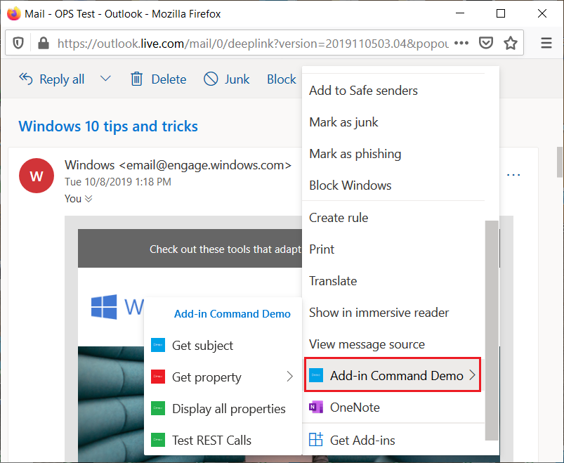
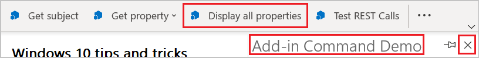

# Команды надстроек Outlook

Outlook add-in commands provide ways to initiate specific add-in actions from the ribbon by adding buttons or drop-down menus. This lets users access add-ins in a simple, intuitive, and unobtrusive way. Because they offer increased functionality in a seamless manner, you can use add-in commands to create more engaging solutions.

> [!NOTE]
> Команды надстроек доступны только в Outlook 2013 или более поздней версии для Windows, Outlook 2016 или более поздней версии для Mac, Outlook для iOS, Outlook для Android, Outlook в Интернете для Exchange 2016 или более поздней версии, Outlook в Интернете для Microsoft 365 и Outlook.com.
>
> Для поддержки команд надстроек в Outlook 2013 необходимы три обновления:
> - [Обновление для системы безопасности для Outlook от 8 марта 2016 г.](https://support.microsoft.com/kb/3114829)
> - [Обновление для системы безопасности для Office (KB3114816) от 8 марта 2016 г.](https://support.microsoft.com/help/3114816/march-8,-2016,-update-for-office-2013-kb3114816)
> - [Обновление для системы безопасности для Office (KB3114828) от 8 марта 2016 г.](https://support.microsoft.com/help/3114828/march-8,-2016,-update-for-office-2013-kb3114828)
>
> Для поддержки команд надстроек в Exchange 2016 требуется [накопительный пакет обновления 5](https://support.microsoft.com/help/4012106/cumulative-update-5-for-exchange-server-2016).

Add-in commands are only available for add-ins that do not use [ItemHasAttachment, ItemHasKnownEntity, or ItemHasRegularExpressionMatch rules](activation-rules.md) to limit the types of items they activate on. However, [contextual add-ins](contextual-outlook-add-ins.md) can present different commands depending on whether the currently selected item is a message or appointment, and can choose to appear in read or compose scenarios. Using add-in commands if possible is a [best practice](../concepts/add-in-development-best-practices.md).

## Создание команды надстройки

Add-in commands are declared in the add-in manifest in the [VersionOverrides element](../reference/manifest/versionoverrides.md). This element is an addition to the manifest schema v1.1 that ensures backward compatibility. In a client that doesn't support `VersionOverrides`, existing add-ins will continue to function as they did without add-in commands.

В записях манифеста `VersionOverrides` указывается множество свойств надстройки, например ведущее приложение, типы элементов управления, добавляемых на ленту, текст, значки и соответствующие функции.

When an add-in needs to provide status updates, such as progress indicators or error messages, it must do so through the [notification APIs](/javascript/api/outlook/office.notificationmessages). The processing for the notifications must also be defined in a separate HTML file that is specified in the `FunctionFile` node of the manifest.

Developers should define icons for all required sizes so that the add-in commands will adjust smoothly along with the ribbon. The required icon sizes are 80 x 80 pixels, 32 x 32 pixels, and 16 x 16 pixels for desktop, and 48 x 48 pixels, 32 x 32 pixels, and 25 x 25 pixels for mobile.

## Отображение команд надстройки

An add-in command appears on the ribbon as a button. When a user installs an add-in, its commands appear in the UI as a group of buttons. This can either be on the ribbon's default tab or on a custom tab. For messages, the default is either the **Home** or **Message** tab. For the calendar, the default is the **Meeting**, **Meeting Occurrence**, **Meeting Series**, or **Appointment** tab. For module extensions, the default is a custom tab. On the default tab, each add-in can have one ribbon group with up to 6 commands. On custom tabs, the add-in can have up to 10 groups, each with 6 commands. Add-ins are limited to only one custom tab.

Команды надстройки отображаются в меню переполнения по мере заполнения ленты элементами. Команды надстройки обычно группируются вместе.

When an add-in command is added to an add-in, the add-in name is removed from the app bar. Only the add-in command button on the ribbon remains.

### Современная версия Outlook в Интернете

В Outlook в Интернете имя надстройки отображается в меню переполнения. Если у надстройки есть несколько команд, вы можете развернуть меню надстройки, чтобы просмотреть группу кнопок с именем надстройки.

## Оформление команд надстройки в пользовательском интерфейсе

The UX shape for an add-in command consists of a ribbon tab in the host application that contains buttons that can perform various functions. Currently, three UI shapes are supported:

- кнопка, выполняющая функцию JavaScript;
- кнопка, запускающая область задач.
- кнопка, которая выводит раскрывающееся меню с одной или несколькими кнопками остальных двух типов;

### Выполнение функции JavaScript

Use an add-in command button that executes a JavaScript function for scenarios where the user doesn't need to make any additional selections to initiate the action. This can be for actions such as track, remind me, or print, or scenarios when the user wants more in-depth information from a service.

В расширениях модуля кнопка команды надстройки может выполнять функции JavaScript, взаимодействующие с содержимым в основном пользовательском интерфейсе.

### Запуск области задач

Use an add-in command button to launch a task pane for scenarios where a user needs to interact with an add-in for a longer period of time. For example, the add-in requires changes to settings or the completion of many fields.

The default width of the vertical task pane is 320 px. The vertical task pane can be resized in both the Outlook Explorer and inspector. The pane can be resized in the same way the to-do pane and list view resize.

 

This screenshot shows an example of a vertical task pane. The pane opens with the name of the add-in command in the top left corner. Users can use the **X** button in the upper-right corner of the pane to close the add-in when they are finished using it. By default, this pane will not persist across messages. Add-ins can [support pinning](pinnable-taskpane.md) for the task pane and receive events when a new message is selected. All UI elements rendered in the task pane, aside from the add-in name and the close button, are provided by the add-in.

If a user chooses another add-in command that opens a task pane, the task pane is replaced with the recently used command. If a user chooses an add-in command button that executes a function, or drop-down menu while the task pane is open, the action will be completed and the task pane will remain open.

### Раскрывающееся меню

A drop-down menu add-in command defines a static list of buttons. The buttons within the menu can be any mix of buttons that execute a function or buttons that open a task pane. Submenus are not supported.

## Отображение команд надстройки в пользовательском интерфейсе

Команды надстроек поддерживаются для четырех сценариев:

### Просмотр сообщения

Когда пользователь просматривает сообщение в области чтения или на вкладке **Сообщение** для всплывающей формы чтения, команды надстройки, добавленные на вкладку по умолчанию, отображаются на вкладке **Главная**.

### Создание сообщения

Когда пользователь создает сообщение, команды надстройки, добавленные на вкладку по умолчанию, отображаются на вкладке **Сообщение**.

### Создание или просмотр встречи или собрания организатором

When creating or viewing an appointment or meeting as the organizer, add-in commands added to the default tab appear on the **Meeting**, **Meeting Occurrence**, **Meeting Series**, or **Appointment** tabs on pop-out forms. However, if the user selects an item in the calendar but doesn't open the pop-out, the add-in's ribbon group won't be visible in the ribbon.

### Просмотр собрания участником

When viewing a meeting as an attendee, add-in commands added to the default tab appear on the **Meeting**, **Meeting Occurrence**, or **Meeting Series** tabs on pop-out forms. However, if a user selects an item in the calendar but doesn't open the pop-out, the add-in's ribbon group won't be visible in the ribbon

### Использование расширения модуля

Если используется расширение модуля, команды надстройки отображаются на пользовательской вкладке расширения.

## См. также

- [Надстройка Outlook "Демонстрация команд надстройки"](https://github.com/officedev/outlook-add-in-command-demo)
- [Создание команд надстроек в манифесте для Excel, PowerPoint и Word](../develop/create-addin-commands.md)
