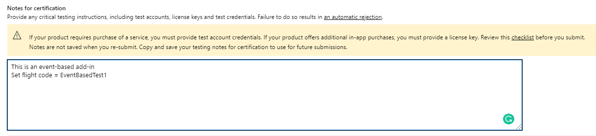
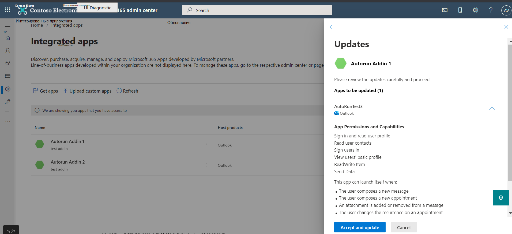

# <a name="appsource-listing-options-for-your-event-based-outlook-add-in"></a>Параметры списка AppSource для надстройки на Outlook событий

В настоящее время надстройки должны быть развернуты администраторами организации для конечных пользователей, чтобы получить доступ к функциональным возможностям функций на основе событий. Мы ограничим активацию на основе событий, если конечный пользователь приобрел надстройку непосредственно в AppSource. Например, если надстройка Contoso включает точку расширения с по крайней мере одной, определенной под узлом, автоматическое вызов надстройки происходит только в том случае, если надстройка была установлена для конечного пользователя администратором организации. В противном случае автоматическое вызов надстройки `LaunchEvent` `LaunchEvent Type` `LaunchEvents` блокируется. См. следующий отрывок из манифеста надстройки в примере.

```xml
...
<ExtensionPoint xsi:type="LaunchEvent">
  <LaunchEvents>
    <LaunchEvent Type="OnNewMessageCompose" FunctionName="onMessageComposeHandler"/>
    ...
```

Конечный пользователь или администратор могут приобретать надстройки через AppSource или в Office Store. Если основной сценарий или рабочий процесс надстройки требует активации на основе событий, возможно, вам потребуется ограничить свои надстройки, доступные для развертывания администратора. Чтобы включить это ограничение, мы можем предоставить URL-адреса кода полета. Благодаря кодам полетов доступ к списку могут получить только конечные пользователи с этими специальными URL-адресами. Ниже приводится пример URL-адреса.

`https://appsource.microsoft.com/product/office/WA200002862?flightCodes=EventBasedTest1`

Пользователи и администраторы не могут явно искать надстройку по ее имени в AppSource или в магазине Office, когда для нее включен код полета. Как создатель надстройки, вы можете в частном порядке обмениваться этими кодами полетов с администраторами организации для развертывания надстройки.

> [!NOTE]
> Хотя конечные пользователи могут установить надстройки с помощью кода полета, надстройка не будет включать активацию на основе событий.

## <a name="specify-a-flight-code"></a>Указание кода полета

Чтобы указать код полета, который необходимо для надстройки, поделитесь этой информацией в заметках для сертификации при публикации надстройки.  _**Важно:**_ Коды полетов являются конфиденциальными.



## <a name="deploy-add-in-with-flight-code"></a>Развертывание надстройки с кодом полета

После задав коды полетов, вы получите URL-адрес из группы сертификации приложений. Затем вы можете поделиться URL-адресом с администраторами в частном порядке.

Для развертывания надстройки администратор может использовать следующие действия.

- Во входе admin.microsoft.com или AppSource.com учетную запись Microsoft 365 администратора. Если надстройка имеет один вход (SSO) включена, необходимы глобальные учетные данные администратора.
- Откройте URL-адрес кода полета в веб-браузере.
- На странице списка надстройки выберите **Get it now**. Вы должны быть перенаправлены на портал интегрированных приложений.

## <a name="unrestricted-appsource-listing"></a>Неограниченное перечисление AppSource

Если надстройка не использует активацию на основе событий для критических сценариев (то есть надстройка работает хорошо без автоматического вызовов), рассмотрите возможность включения надстройки в AppSource без специальных кодов полетов. Если конечный пользователь получает надстройки из AppSource, автоматическая активация не произойдет для пользователя. Однако они могут использовать другие компоненты надстройки, такие как области задач или команды без пользовательского интерфейса.

> [!IMPORTANT]
> Это временное ограничение. В будущем мы планируем включить активацию надстройки на основе событий для конечных пользователей, непосредственно приобретавших надстройки.

## <a name="update-existing-add-ins-to-include-event-based-activation"></a>Обновление существующих надстройок, чтобы включить активацию на основе событий

Вы можете обновить существующую надстройка, чтобы включить активацию на основе событий, а затем повторно переподключить ее для проверки и решить, хотите ли вы иметь ограниченный или неограниченный список AppSource.

После утверждения обновленной надстройки администраторы организации, которые ранее развернули надстройки, получат сообщение об обновлении в разделе **Интегрированные** приложения центра администрирования. Сообщение сообщает администратору об изменениях активации на основе событий. После того как администратор примет изменения, обновление будет развернуто для конечных пользователей.


Для конечных пользователей, которые самостоятельно установили надстройки, функция активации на основе событий не будет работать даже после обновления надстройки.

## <a name="admin-consent-for-installing-event-based-add-ins"></a>Согласие администратора на установку надстройок на основе событий

Всякий раз, когда надстройка  на основе событий развертывается с экрана интегрированных приложений, администратор получает сведения о возможностях активации на основе событий надстройки в мастере развертывания. Сведения отображаются в **разделе Разрешения и возможности приложения.** Администратор должен видеть все события, в которых надстройка может автоматически активироваться.


Аналогичным образом, когда существующая надстройка обновляется до функции на основе событий, администратор видит в надстройки состояние "Обновление в ожидании". Обновленная надстройка развертывается только в том случае, если  администратор соглашается на изменения, отмеченные в разделе Разрешения и возможности приложения, включая набор событий, в которых надстройка может автоматически активироваться.

Каждый раз, когда вы добавляете какие-либо новые в надстройку, администраторы будут видеть поток обновления на портале администрирования и должны предоставить согласие `LaunchEvent Type` на дополнительные события.



## <a name="see-also"></a>См. также

- [Настройка надстройки Outlook для активации на основе событий](autolaunch.md)
