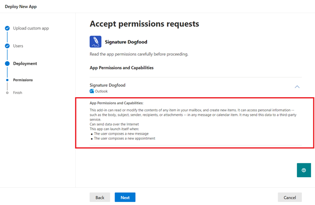

# Параметры описания AppSource для надстройки Outlook на основе событий

Чтобы пользователи могли получить доступ к функции активации на основе событий, администраторы организации должны развернуть [надстройки](autolaunch.md) . Активация на основе событий ограничена, если конечный пользователь приобрел надстройку непосредственно из [AppSource](https://appsource.microsoft.com). Например, если надстройка Contoso включает функцию на основе событий, автоматический вызов надстройки происходит только в том случае, если надстройка была установлена для конечного пользователя администратором организации. В противном случае автоматический вызов надстройки блокируется.

Конечный пользователь или администратор может приобрести надстройки через AppSource или Магазин Office в приложении. Если основной сценарий или рабочий процесс надстройки требует активации на основе событий, вы можете ограничить надстройку только развертыванием администратора. Чтобы включить это ограничение, мы можем предоставить URL-адреса кода тестового пакета для надстроек в AppSource. Благодаря кодам рейсов только конечные пользователи с этими специальными URL-адресами могут получить доступ к списку. Ниже приведен пример URL-адреса.

`https://appsource.microsoft.com/product/office/WA200002862?flightCodes=EventBasedTest1`

Пользователи и администраторы не могут явно искать надстройку по ее имени в AppSource или в Магазине Office в приложении, если для нее включен тестовый код. Как создатель надстройки вы можете предоставлять администраторам организации частный доступ к этим кодам тестов для развертывания надстроек.

> [!NOTE]
> Хотя конечные пользователи могут установить надстройку с помощью тестового кода, она не будет включать активацию на основе событий.

[!INCLUDE [outlook-smart-alerts-deployment](../includes/outlook-smart-alerts-deployment.md)]

## Указание кода тестового пакета

Чтобы указать код тестового выпуска для надстройки, поделитесь кодом в примечаниях для сертификации при публикации надстройки. **Важно**! Коды рейсов чувствительны к регистру.

## Развертывание надстройки с помощью тестового кода

После установки кодов тестового пакета вы получите URL-адрес от группы сертификации приложений. Затем вы можете поделиться URL-адресом с администраторами в частном режиме.

Чтобы развернуть надстройку, администратор может выполнить следующие действия.

- Войдите в admin.microsoft.com или AppSource.com учетную запись администратора Microsoft 365. Если для надстройки включен единый вход, требуются учетные данные глобального администратора.
- Откройте URL-адрес тестового кода в веб-браузере.
- На странице описания надстройки нажмите кнопку **"Получить сейчас"**. Вы должны быть перенаправлены на портал интегрированного приложения.

## Неограниченный список AppSource

Если надстройка не использует активацию на основе событий для критически важных сценариев (то есть надстройка хорошо работает без автоматического вызова), рассмотрите возможность перечисления надстройки в AppSource без специальных кодов тестов. Если пользователь получает надстройку из AppSource, автоматическая активация для пользователя не выполняется. Однако они могут использовать другие компоненты надстройки, такие как область задач или команда функции.

> [!IMPORTANT]
> Это временное ограничение. В будущем мы планируем включить активацию надстройки на основе событий для конечных пользователей, которые получают надстройку напрямую.

## Обновление существующих надстроек для активации на основе событий

Вы можете обновить существующую надстройку, чтобы включить активацию на основе событий, а затем повторно отправить ее для проверки и решить, хотите ли вы использовать ограниченный или неограниченный список AppSource.

После утверждения обновленной надстройки администраторы организации, которые ранее развернули надстройку, получат сообщение об обновлении в разделе "Интегрированные приложения" Центра администрирования. Это сообщение рекомендует администратору об изменениях активации на основе событий. После того как администратор примет изменения, обновление будет развернуто для конечных пользователей.

Для конечных пользователей, которые установили надстройку самостоятельно, функция активации на основе событий не будет работать даже после обновления надстройки.

## Администратор согласия на установку надстроек на основе событий

Каждый раз, когда надстройка на основе событий развертывается с экрана "Интегрированные приложения", администратор получает сведения о возможностях активации на основе событий надстройки в мастере развертывания. Подробные сведения отображаются **в разделе "Разрешения и возможности приложения** ". Администратор должен просмотреть все события, в которых надстройка может автоматически активироваться.

Аналогичным образом, когда существующая надстройка обновляется до функции на основе событий, администратор видит в надстройке состояние "Ожидание обновления". Обновленная надстройка развертывается только в том случае, если администратор дает согласие на изменения, указанные в разделе "Разрешения и возможности приложения", включая набор событий, в которых надстройка может автоматически активироваться.

Каждый раз, когда вы добавляете в надстройку новую функцию активации на основе событий, администраторы будут видеть поток обновления на портале администрирования и должны предоставить согласие на дополнительные события.

## См. также

- [Настройка надстройки Outlook для активации на основе событий](autolaunch.md)
