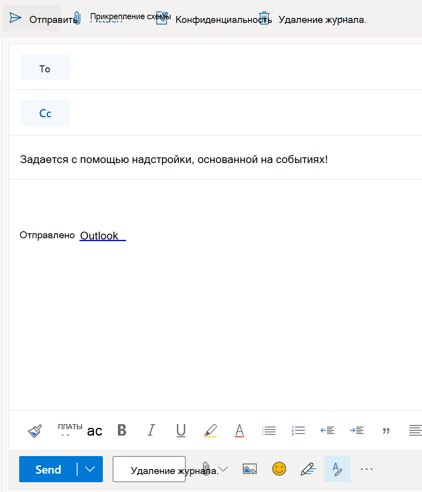

# <a name="configure-your-outlook-add-in-for-event-based-activation-preview"></a>Настройка надстройки Outlook для активации на основе событий (Предварительная версия)

Без функции активации на основе событий пользователю необходимо явным образом запустить надстройку для выполнения своих задач. Эта функция позволяет надстройке запускать задачи на основе определенных событий, особенно для операций, которые применяются к каждому элементу. Также можно выполнить интеграцию с областью задач и функциональностью без пользовательского интерфейса. В настоящее время поддерживаются следующие события.

- `OnNewMessageCompose`: На составление нового сообщения (включая ответ, ответить всем и пересылать)
- `OnNewAppointmentOrganizer`: При создании новой встречи

  > [!IMPORTANT]
  > Эта функция **не** активируется при редактировании элемента, например черновика или существующей встречи.

По завершении этого пошагового руководства у вас будет надстройка, которая запускается при создании нового сообщения.

> [!IMPORTANT]
> Эта функция поддерживается только для [предварительного просмотра](../reference/objectmodel/preview-requirement-set/outlook-requirement-set-preview.md) в Outlook в Интернете с подпиской на Microsoft 365. Узнайте [, как просмотреть функцию активации на основе событий,](#how-to-preview-the-event-based-activation-feature) приведенную в этой статье, для получения дополнительных сведений.
>
> Так как функции предварительного просмотра могут быть изменены без предварительного уведомления, они не должны использоваться в производственных надстройках.

## <a name="how-to-preview-the-event-based-activation-feature"></a>Предварительный просмотр функции активации на основе событий

Мы приглашаем вас испытать функцию активации на основе событий! Сообщите нам о своих сценариях и способах их усовершенствования, предоставив отзыв на сайте GitHub (обратитесь к разделу **Отзывы** в конце этой страницы).

Чтобы просмотреть эту функцию, выполните указанные ниже действия.

- Ссылка на **бета-** библиотеку в сети CDN ( https://appsforoffice.microsoft.com/lib/beta/hosted/office.js) . [Файл определения типа](https://appsforoffice.microsoft.com/lib/beta/hosted/office.d.ts) для компиляции TypeScript и IntelliSense находится в сети CDN и [DefinitelyTyped](https://raw.githubusercontent.com/DefinitelyTyped/DefinitelyTyped/master/types/office-js-preview/index.d.ts). Вы можете установить эти типы с помощью `npm install --save-dev @types/office-js-preview` .
- [Настройте целевой выпуск на клиенте Microsoft 365](/microsoft-365/admin/manage/release-options-in-office-365?view=o365-worldwide&preserve-view=true#set-up-the-release-option-in-the-admin-center).

## <a name="set-up-your-environment"></a>Настройка среды

Завершите работу с [быстрым запуском Outlook](../quickstarts/outlook-quickstart.md?tabs=yeomangenerator) , который создает проект надстройки с помощью генератора Yeoman для надстроек Office.

## <a name="configure-the-manifest"></a>Настройка манифеста

Чтобы включить активацию надстройки на основе событий, необходимо настроить элемент [среды выполнения](../reference/manifest/runtimes.md) и точку расширения [лаунчевент](../reference/manifest/extensionpoint.md#launchevent-preview) в манифесте. Пока `DesktopFormFactor` это единственный поддерживаемый конструктивный параметр.

1. В редакторе кода откройте Быстрый запуск проекта.

1. Откройте файл **manifest.xml** , расположенный в корневом каталоге проекта.

1. Выберите весь `<VersionOverrides>` узел (включая открывающие и закрывающие теги) и замените его следующим XML-документом.

```XML
<VersionOverrides xmlns="http://schemas.microsoft.com/office/mailappversionoverrides" xsi:type="VersionOverridesV1_0">
  <VersionOverrides xmlns="http://schemas.microsoft.com/office/mailappversionoverrides/1.1" xsi:type="VersionOverridesV1_1">
    <Requirements>
      <bt:Sets DefaultMinVersion="1.3">
        <bt:Set Name="Mailbox" />
      </bt:Sets>
    </Requirements>
    <Hosts>
      <Host xsi:type="MailHost">
        <!-- Event-based activation happens in a lightweight runtime.-->
        <Runtimes>
          <!-- HTML file including reference to or inline JavaScript event handlers.
               This is used by Outlook on the web. -->
          <Runtime resid="WebViewRuntime.Url">
            <!-- JavaScript file containing event handlers. This is used by Outlook Desktop. -->
            <Override type="javascript" resid="JSRuntime.Url"/>
          </Runtime>
        </Runtimes>
        <DesktopFormFactor>
          <FunctionFile resid="Commands.Url" />
          <ExtensionPoint xsi:type="MessageReadCommandSurface">
            <OfficeTab id="TabDefault">
              <Group id="msgReadGroup">
                <Label resid="GroupLabel" />
                <Control xsi:type="Button" id="msgReadOpenPaneButton">
                  <Label resid="TaskpaneButton.Label" />
                  <Supertip>
                    <Title resid="TaskpaneButton.Label" />
                    <Description resid="TaskpaneButton.Tooltip" />
                  </Supertip>
                  <Icon>
                    <bt:Image size="16" resid="Icon.16x16" />
                    <bt:Image size="32" resid="Icon.32x32" />
                    <bt:Image size="80" resid="Icon.80x80" />
                  </Icon>
                  <Action xsi:type="ShowTaskpane">
                    <SourceLocation resid="Taskpane.Url" />
                  </Action>
                </Control>
                <Control xsi:type="Button" id="ActionButton">
                  <Label resid="ActionButton.Label"/>
                  <Supertip>
                    <Title resid="ActionButton.Label"/>
                    <Description resid="ActionButton.Tooltip"/>
                  </Supertip>
                  <Icon>
                    <bt:Image size="16" resid="Icon.16x16"/>
                    <bt:Image size="32" resid="Icon.32x32"/>
                    <bt:Image size="80" resid="Icon.80x80"/>
                  </Icon>
                  <Action xsi:type="ExecuteFunction">
                    <FunctionName>action</FunctionName>
                  </Action>
                </Control>
              </Group>
            </OfficeTab>
          </ExtensionPoint>

          <!-- Can configure other command surface extension points for add-in command support. -->

          <!-- Enable launching the add-in on the included events. -->
          <ExtensionPoint xsi:type="LaunchEvent">
            <LaunchEvents>
              <LaunchEvent Type="OnNewMessageCompose" FunctionName="onMessageComposeHandler"/>
              <LaunchEvent Type="OnNewAppointmentOrganizer" FunctionName="onAppointmentComposeHandler"/>
            </LaunchEvents>
            <!-- Identifies the runtime to be used (also referenced by the Runtime element). -->
            <SourceLocation resid="WebViewRuntime.Url"/>
          </ExtensionPoint>
        </DesktopFormFactor>
      </Host>
    </Hosts>
    <Resources>
      <bt:Images>
        <bt:Image id="Icon.16x16" DefaultValue="https://localhost:3000/assets/icon-16.png"/>
        <bt:Image id="Icon.32x32" DefaultValue="https://localhost:3000/assets/icon-32.png"/>
        <bt:Image id="Icon.80x80" DefaultValue="https://localhost:3000/assets/icon-80.png"/>
      </bt:Images>
      <bt:Urls>
        <bt:Url id="Commands.Url" DefaultValue="https://localhost:3000/commands.html" />
        <bt:Url id="Taskpane.Url" DefaultValue="https://localhost:3000/taskpane.html" />
        <bt:Url id="WebViewRuntime.Url" DefaultValue="https://localhost:3000/commands.html" />
        <bt:Url id="JSRuntime.Url" DefaultValue="https://localhost:3000/runtime.js" />
      </bt:Urls>
      <bt:ShortStrings>
        <bt:String id="GroupLabel" DefaultValue="Contoso Add-in"/>
        <bt:String id="TaskpaneButton.Label" DefaultValue="Show Taskpane"/>
        <bt:String id="ActionButton.Label" DefaultValue="Perform an action"/>
      </bt:ShortStrings>
      <bt:LongStrings>
        <bt:String id="TaskpaneButton.Tooltip" DefaultValue="Opens a pane displaying all available properties."/>
        <bt:String id="ActionButton.Tooltip" DefaultValue="Perform an action when clicked."/>
      </bt:LongStrings>
    </Resources>
  </VersionOverrides>
</VersionOverrides>
```

Outlook в Windows использует файл JavaScript, в то время как Outlook в Интернете использует HTML-файл, который ссылается на тот же файл JavaScript. Необходимо предоставить ссылки на эти файлы в манифесте, так как платформа Outlook в конечном итоге определяет, следует ли использовать HTML или JavaScript на основе клиента Outlook. Таким образом, чтобы настроить обработку событий, укажите расположение HTML-кода в `Runtime` элементе, а затем в `Override` дочернем элементе укажите расположение файла JavaScript, встроенного или ссылающегося на HTML.

> [!TIP]
> Чтобы узнать больше о манифестах для надстроек Outlook, ознакомьтесь с разделом [манифесты надстроек Outlook](manifests.md).

## <a name="implement-event-handling"></a>Реализация обработки событий

Необходимо реализовать обработку выбранных событий.

В этом сценарии вы добавите обработку для создания новых элементов.

1. В проекте быстрого запуска откройте **commands.jsфайл./СРК/коммандс/ ** в редакторе кода.

1. После `action` функции вставьте следующие функции JavaScript.

    ```js
    function onMessageComposeHandler(event) {
      setSubject();
      event.completed();
    }
    function onAppointmentComposeHandler(event) {
      setSubject();
      event.completed();
    }
    function setSubject() {
      Office.context.mailbox.item.subject.setAsync("Set by an event-based add-in!");
    }
    ```

1. В конце файла добавьте указанные ниже операторы.

    ```js
    g.onMessageComposeHandler = onMessageComposeHandler;
    g.onAppointmentComposeHandler = onAppointmentComposeHandler;
    ```

## <a name="try-it-out"></a>Проверка

1. Выполните следующую команду в корневом каталоге своего проекта. После выполнения этой команды запустится локальный веб-сервер (если он еще не запущен).

    ```command&nbsp;line
    npm run dev-server
    ```

1. Чтобы загрузить неопубликованную надстройку в Outlook, следуйте инструкциями из статьи [Загрузка неопубликованных надстроек Outlook для тестирования](sideload-outlook-add-ins-for-testing.md).

1. Создайте новое сообщение в веб-версии Outlook.

    

## <a name="event-based-activation-behavior-and-limitations"></a>Поведение и ограничения активации на основе событий

Надстройки, активируемые на основе событий, ориентированы на короткий запуск и только до 330 секунд. Мы рекомендуем, чтобы ваша надстройка вызывала `event.completed` метод, чтобы сообщить, что обработка события запуска завершена. Кроме того, надстройка завершает работу, когда пользователь закрывает окно создания.

Если у пользователя есть несколько надстроек, подписанных на одно и то же событие, платформа Outlook запускает надстройку в неопределенном порядке. В настоящее время только пять надстроек на основе событий могут быть запущены в активном состоянии. Все дополнительные надстройки помещаются в очередь, а затем выполняются, как только ранее активные надстройки завершаются или отключаются.

Пользователь может переключить или покинуть текущий почтовый элемент, где запущена надстройка. Запущенная надстройка завершит свою работу в фоновом режиме.

Некоторые API Office.js, которые изменяют или изменяют пользовательский интерфейс, не поддерживаются в надстройках, основанных на событиях. Ниже приведены заблокированные API.

- В разделе `Office.context.mailbox` :
  - `displayAppointmentForm`
  - `displayMessageForm`
  - `displayNewAppointmentForm`
  - `displayNewMessageForm`
- В разделе `Office.context.ui` :
  - `displayDialogAsync`
  - `messageParent`
- В разделе `Office.context.auth` :
  - `getAccessTokenAsync`

## <a name="see-also"></a>См. также

[Манифесты надстроек Outlook](manifests.md)
