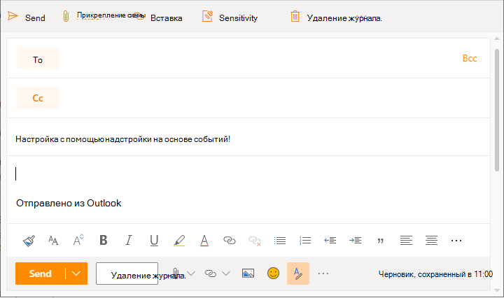
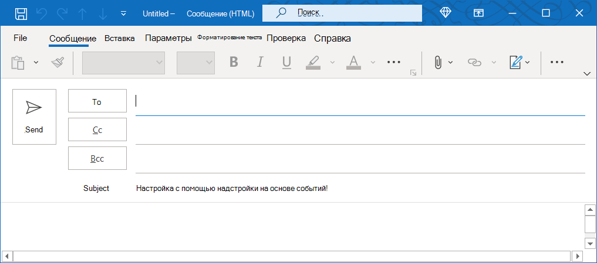

# <a name="configure-your-outlook-add-in-for-event-based-activation-preview"></a>Настройка надстройки Outlook для активации на основе событий (предварительная версия)

Без функции активации на основе событий пользователю необходимо явным образом запустить надстройки для выполнения своих задач. Эта функция позволяет надстройка выполнять задачи на основе определенных событий, особенно для операций, которые применяются к каждому элементу. Вы также можете интегрироваться с функциональностью области задач и без пользовательского интерфейса. В настоящее время поддерживаются следующие события.

- `OnNewMessageCompose`: при составления нового сообщения (включает ответ, ответ всем и переад. );
- `OnNewAppointmentOrganizer`: При создании новой встречи

  > [!IMPORTANT]
  > Эта функция не **активируется** при редактировании элемента, например черновика или существующей встречи.

К концу этого побока у вас будет надстройка, которая запускается при всех создания нового сообщения.

> [!IMPORTANT]
> Эта функция поддерживается только для [предварительного](../reference/objectmodel/preview-requirement-set/outlook-requirement-set-preview.md) просмотра в Outlook в Интернете и Windows с подпиской на Microsoft 365. Дополнительные [сведения см.](#how-to-preview-the-event-based-activation-feature) в этой статье, чтобы просмотреть функцию активации на основе событий.
>
> Поскольку функции предварительного просмотра могут быть без предварительного уведомления, их не следует использовать в производственных надстройки.

## <a name="how-to-preview-the-event-based-activation-feature"></a>Просмотр функции активации на основе событий

Мы предлагаем вам попробовать функцию активации на основе событий! Let us know your scenarios and how we can improve by giving us feedback through GitHub (see the **Feedback** section at the end of this page).

Чтобы просмотреть эту функцию:

- Для Outlook в Интернете:
  - [Настройка целевого выпуска в клиенте Microsoft 365.](/microsoft-365/admin/manage/release-options-in-office-365?view=o365-worldwide&preserve-view=true#set-up-the-release-option-in-the-admin-center)
  - Ссылка на **бета-версию** библиотеки в CDN ( https://appsforoffice.microsoft.com/lib/beta/hosted/office.js) . Файл [определения типа для](https://appsforoffice.microsoft.com/lib/beta/hosted/office.d.ts) компиляции и IntelliSense TypeScript находится в CDN и [DefinitelyTyped.](https://raw.githubusercontent.com/DefinitelyTyped/DefinitelyTyped/master/types/office-js-preview/index.d.ts) Эти типы можно установить с помощью `npm install --save-dev @types/office-js-preview` .
- Для Outlook для Windows: минимальная требуемая сборка — 16.0.13729.20000. Присоединяйтесь к [программе программы insider Office](https://insider.office.com) для доступа к бета-сборкам Office.

## <a name="set-up-your-environment"></a>Настройка среды

Завершите [краткое начало работы с Outlook,](../quickstarts/outlook-quickstart.md?tabs=yeomangenerator) в котором создается проект надстройки с помощью генератора Yeoman для надстройки Office.

## <a name="configure-the-manifest"></a>Настройка манифеста

Чтобы включить активацию надстройки на основе событий, необходимо настроить элемент [Runtimes](../reference/manifest/runtimes.md) и точку расширения [LaunchEvent](../reference/manifest/extensionpoint.md#launchevent-preview) в узле `VersionOverridesV1_1` манифеста. На данный момент `DesktopFormFactor` это единственный поддерживаемый форм-фактор.

1. В редакторе кода откройте проект быстрого запуска.

1. Откройте файл **manifest.xml,** расположенный в корневой папке проекта.

1. Выберите весь узел (включая открытые и закрываемые `<VersionOverrides>` теги) и замените его на следующий XML-

```XML
<VersionOverrides xmlns="http://schemas.microsoft.com/office/mailappversionoverrides" xsi:type="VersionOverridesV1_0">
  <VersionOverrides xmlns="http://schemas.microsoft.com/office/mailappversionoverrides/1.1" xsi:type="VersionOverridesV1_1">
    <Requirements>
      <bt:Sets DefaultMinVersion="1.3">
        <bt:Set Name="Mailbox" />
      </bt:Sets>
    </Requirements>
    <Hosts>
      <Host xsi:type="MailHost">
        <!-- Event-based activation happens in a lightweight runtime.-->
        <Runtimes>
          <!-- HTML file including reference to or inline JavaScript event handlers.
               This is used by Outlook on the web. -->
          <Runtime resid="WebViewRuntime.Url">
            <!-- JavaScript file containing event handlers. This is used by Outlook Desktop. -->
            <Override type="javascript" resid="JSRuntime.Url"/>
          </Runtime>
        </Runtimes>
        <DesktopFormFactor>
          <FunctionFile resid="Commands.Url" />
          <ExtensionPoint xsi:type="MessageReadCommandSurface">
            <OfficeTab id="TabDefault">
              <Group id="msgReadGroup">
                <Label resid="GroupLabel" />
                <Control xsi:type="Button" id="msgReadOpenPaneButton">
                  <Label resid="TaskpaneButton.Label" />
                  <Supertip>
                    <Title resid="TaskpaneButton.Label" />
                    <Description resid="TaskpaneButton.Tooltip" />
                  </Supertip>
                  <Icon>
                    <bt:Image size="16" resid="Icon.16x16" />
                    <bt:Image size="32" resid="Icon.32x32" />
                    <bt:Image size="80" resid="Icon.80x80" />
                  </Icon>
                  <Action xsi:type="ShowTaskpane">
                    <SourceLocation resid="Taskpane.Url" />
                  </Action>
                </Control>
                <Control xsi:type="Button" id="ActionButton">
                  <Label resid="ActionButton.Label"/>
                  <Supertip>
                    <Title resid="ActionButton.Label"/>
                    <Description resid="ActionButton.Tooltip"/>
                  </Supertip>
                  <Icon>
                    <bt:Image size="16" resid="Icon.16x16"/>
                    <bt:Image size="32" resid="Icon.32x32"/>
                    <bt:Image size="80" resid="Icon.80x80"/>
                  </Icon>
                  <Action xsi:type="ExecuteFunction">
                    <FunctionName>action</FunctionName>
                  </Action>
                </Control>
              </Group>
            </OfficeTab>
          </ExtensionPoint>

          <!-- Can configure other command surface extension points for add-in command support. -->

          <!-- Enable launching the add-in on the included events. -->
          <ExtensionPoint xsi:type="LaunchEvent">
            <LaunchEvents>
              <LaunchEvent Type="OnNewMessageCompose" FunctionName="onMessageComposeHandler"/>
              <LaunchEvent Type="OnNewAppointmentOrganizer" FunctionName="onAppointmentComposeHandler"/>
            </LaunchEvents>
            <!-- Identifies the runtime to be used (also referenced by the Runtime element). -->
            <SourceLocation resid="WebViewRuntime.Url"/>
          </ExtensionPoint>
        </DesktopFormFactor>
      </Host>
    </Hosts>
    <Resources>
      <bt:Images>
        <bt:Image id="Icon.16x16" DefaultValue="https://localhost:3000/assets/icon-16.png"/>
        <bt:Image id="Icon.32x32" DefaultValue="https://localhost:3000/assets/icon-32.png"/>
        <bt:Image id="Icon.80x80" DefaultValue="https://localhost:3000/assets/icon-80.png"/>
      </bt:Images>
      <bt:Urls>
        <bt:Url id="Commands.Url" DefaultValue="https://localhost:3000/commands.html" />
        <bt:Url id="Taskpane.Url" DefaultValue="https://localhost:3000/taskpane.html" />
        <bt:Url id="WebViewRuntime.Url" DefaultValue="https://localhost:3000/commands.html" />
        <!-- Entry needed for Outlook Desktop. -->
        <bt:Url id="JSRuntime.Url" DefaultValue="https://localhost:3000/src/commands/commands.js" />
      </bt:Urls>
      <bt:ShortStrings>
        <bt:String id="GroupLabel" DefaultValue="Contoso Add-in"/>
        <bt:String id="TaskpaneButton.Label" DefaultValue="Show Taskpane"/>
        <bt:String id="ActionButton.Label" DefaultValue="Perform an action"/>
      </bt:ShortStrings>
      <bt:LongStrings>
        <bt:String id="TaskpaneButton.Tooltip" DefaultValue="Opens a pane displaying all available properties."/>
        <bt:String id="ActionButton.Tooltip" DefaultValue="Perform an action when clicked."/>
      </bt:LongStrings>
    </Resources>
  </VersionOverrides>
</VersionOverrides>
```

Outlook для Windows использует файл JavaScript, а Outlook в Интернете использует HTML-файл, который может ссылаться на тот же файл JavaScript. Необходимо предоставить ссылки на оба этих файла в узле манифеста, так как платформа Outlook в конечном итоге определяет, следует ли использовать HTML или JavaScript на основе `Resources` клиента Outlook. Таким образом, чтобы настроить обработку событий, указите расположение HTML-кода в элементе, а затем в его потомке указите расположение файла JavaScript, на который ссылается `Runtime` `Override` HTML-код.

> [!TIP]
> Подробнее о манифестах надстройки Outlook см. в манифестах [надстройки Outlook.](manifests.md)

## <a name="implement-event-handling"></a>Реализация обработки событий

Необходимо реализовать обработку выбранных событий.

В этом сценарии вы добавим обработку для составления новых элементов.

1. В том же проекте быстрого запуска откройте файл **./src/commands/commands.js** в редакторе кода.

1. После `action` функции вставьте следующие функции JavaScript.

    ```js
    function onMessageComposeHandler(event) {
      setSubject(event);
    }
    function onAppointmentComposeHandler(event) {
      setSubject(event);
    }
    function setSubject(event) {
      Office.context.mailbox.item.subject.setAsync(
        "Set by an event-based add-in!",
        {
          "asyncContext" : event
        },
        function (asyncResult) {
          // Handle success or error.
          if (asyncResult.status !== Office.AsyncResultStatus.Succeeded) {
            console.error("Failed to set subject: " + JSON.stringify(asyncResult.error));
          }
    
          // Call event.completed() after all work is done.
          asyncResult.asyncContext.completed();
        });
    }
    ```

1. Чтобы функции работали в **Outlook в Интернете** с этим проектом, созданным генератором Yeoman для надстройки Office, добавьте следующие утверждения в конце файла.

    ```js
    g.onMessageComposeHandler = onMessageComposeHandler;
    g.onAppointmentComposeHandler = onAppointmentComposeHandler;
    ```

1. Чтобы функции работали в **Outlook для Windows,** добавьте следующий код JavaScript в конце файла.

    ```js
    if (Office.actions) {
      // 1st parameter: FunctionName of LaunchEvent in the manifest; 2nd parameter: Its implementation in this .js file.
      Office.actions.associate("onMessageComposeHandler", onMessageComposeHandler);
      Office.actions.associate("onAppointmentComposeHandler", onAppointmentComposeHandler);
    }
    ```

    **Примечание.** Проверка на то, что Outlook в Интернете игнорирует `Office.actions` эти утверждения.

## <a name="try-it-out"></a>Проверка

1. Выполните следующую команду в корневом каталоге своего проекта. При запуске этой команды запустится локальный веб-сервер (если он еще не запущен), а надстройка будет загружена.

    ```command&nbsp;line
    npm start
    ```

1. Создайте новое сообщение в веб-версии Outlook.

    

1. В Outlook для Windows создайте новое сообщение.

    

## <a name="event-based-activation-behavior-and-limitations"></a>Поведение и ограничения активации на основе событий

Надстройки, которые активируются на основе событий, должны быть краткими, облегченными и неимежными, насколько это возможно. Чтобы у сигнализировать о том, что надстройка завершила обработку события запуска, рекомендуем вызвать метод `event.completed` надстройки. Если этот вызов не выполнен, время работы надстройки составляет примерно 300 секунд , то есть максимальный период времени, допустимый для запуска надстроек на основе событий. Надстройка также заканчивается, когда пользователь закрывает окно составить.

Если у пользователя есть несколько надстройок, которые подписаны на одно и то же событие, платформа Outlook запускает надстройки в определенном порядке. В настоящее время можно активно запускать только пять надстройок, основанных на событиях. Все дополнительные надстройки добавляются в очередь, а затем запускаются по мере завершения или отключения ранее активных надстроек.

Пользователь может переключиться или перейти от текущего почтового элемента, в котором запущена надстройка. Запущенная надстройка завершит свою работу в фоновом режиме.

Некоторые Office.js API, которые изменяют или изменяют пользовательский интерфейс, не разрешены из надстройки на основе событий. Следующие заблокированные API:

- Under `Office.context.mailbox` :
  - `displayAppointmentForm`
  - `displayMessageForm`
  - `displayNewAppointmentForm`
  - `displayNewMessageForm`
- Under `Office.context.ui` :
  - `displayDialogAsync`
  - `messageParent`
- Under `Office.context.auth` :
  - `getAccessToken`
  - `getAccessTokenAsync`

## <a name="see-also"></a>См. также

[Манифесты надстроек Outlook](manifests.md)