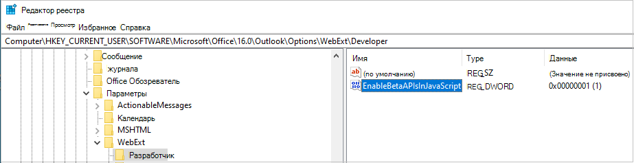
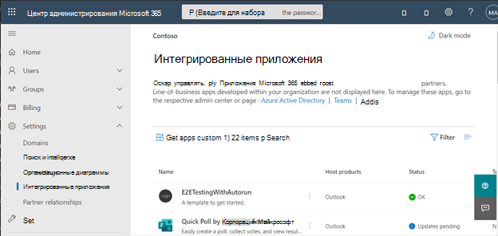

# <a name="configure-your-outlook-add-in-for-event-based-activation"></a>Настройка надстройки Outlook для активации на основе событий

Без функции активации на основе событий пользователю необходимо явно запустить надстройки для выполнения задач. Эта функция позволяет надстройки выполнять задачи на основе определенных событий, особенно для операций, применимых к каждому элементу. Вы также можете интегрироваться с области задач и функциональными возможностями без пользовательского интерфейса.

К концу этого погона у вас будет надстройка, которая запускается всякий раз, когда создается новый элемент и задает объект.

> [!NOTE]
> Поддержка этой функции была представлена в [наборе требований 1.10](../reference/objectmodel/requirement-set-1.10/outlook-requirement-set-1.10.md). См [клиенты и платформы](../reference/requirement-sets/outlook-api-requirement-sets.md#requirement-sets-supported-by-exchange-servers-and-outlook-clients), поддерживающие этот набор обязательных требований.

## <a name="supported-events"></a>Поддерживаемые события

В следующей таблице перечислены события, доступные в настоящее время, и поддерживаемые клиенты для каждого события. При поднятии события обработник `event` получает объект, который может включать сведения, определенные типу события. **Столбец Description** содержит ссылку на соответствующий объект, где это применимо.

> [!IMPORTANT]
> События, которые еще находятся в предварительном просмотре, могут быть доступны только с Microsoft 365 подпиской и в ограниченном наборе поддерживаемых клиентов, как отмечено в следующей таблице. Сведения о конфигурации клиента см. [в статье How to preview](#how-to-preview) in this article. События предварительного просмотра не следует использовать в производственных надстройках.

|Событие|Описание|Минимальный набор требований и поддерживаемые клиенты|
|---|---|---|
|`OnNewMessageCompose`|При составлении нового сообщения (включает ответ, ответ все и вперед), но не при редактировании, например, черновика.|[1.10](../reference/objectmodel/requirement-set-1.10/outlook-requirement-set-1.10.md)<br><br>- Windows<br>- Веб-браузер<br>- Предварительный просмотр пользовательского интерфейса Mac|
|`OnNewAppointmentOrganizer`|О создании новой встречи, но не о редактировании существующего.|[1.10](../reference/objectmodel/requirement-set-1.10/outlook-requirement-set-1.10.md)<br><br>- Windows<br>- Веб-браузер<br>- Предварительный просмотр пользовательского интерфейса Mac|
|`OnMessageAttachmentsChanged`|При добавлении или удалении вложений при сочинении сообщения.<br><br>Объект данных, определенный для событий: [AttachmentsChangedEventArgs](/javascript/api/outlook/office.attachmentschangedeventargs?view=outlook-js-1.11&preserve-view=true)|[1.11](../reference/objectmodel/requirement-set-1.11/outlook-requirement-set-1.11.md)<br><br>- Windows<br>- Веб-браузер|
|`OnAppointmentAttachmentsChanged`|При добавлении или удалении вложений при записи на прием.<br><br>Объект данных, определенный для событий: [AttachmentsChangedEventArgs](/javascript/api/outlook/office.attachmentschangedeventargs?view=outlook-js-1.11&preserve-view=true)|[1.11](../reference/objectmodel/requirement-set-1.11/outlook-requirement-set-1.11.md)<br><br>- Windows<br>- Веб-браузер|
|`OnMessageRecipientsChanged`|При добавлении или удалении получателей при сочинении сообщения.<br><br>Объект данных для конкретных событий: [RecipientsChangedEventArgs](/javascript/api/outlook/office.recipientschangedeventargs?view=outlook-js-1.11&preserve-view=true)|[1.11](../reference/objectmodel/requirement-set-1.11/outlook-requirement-set-1.11.md)<br><br>- Windows<br>- Веб-браузер|
|`OnAppointmentAttendeesChanged`|При добавлении или удалении участников при записи на прием.<br><br>Объект данных для конкретных событий: [RecipientsChangedEventArgs](/javascript/api/outlook/office.recipientschangedeventargs?view=outlook-js-1.11&preserve-view=true)|[1.11](../reference/objectmodel/requirement-set-1.11/outlook-requirement-set-1.11.md)<br><br>- Windows<br>- Веб-браузер|
|`OnAppointmentTimeChanged`|При изменении даты и времени при записи на прием.<br><br>Объект данных для конкретных событий: [AppointmentTimeChangedEventArgs](/javascript/api/outlook/office.appointmenttimechangedeventargs?view=outlook-js-1.11&preserve-view=true)|[1.11](../reference/objectmodel/requirement-set-1.11/outlook-requirement-set-1.11.md)<br><br>- Windows<br>- Веб-браузер|
|`OnAppointmentRecurrenceChanged`|При добавлении, изменении или удалении сведений о повторении при записи на прием. Если дата и время изменены, `OnAppointmentTimeChanged` событие также будет уволено.<br><br>Объект данных, определенный для событий: [RecurrenceChangedEventArgs](/javascript/api/outlook/office.recurrencechangedeventargs?view=outlook-js-1.11&preserve-view=true)|[1.11](../reference/objectmodel/requirement-set-1.11/outlook-requirement-set-1.11.md)<br><br>- Windows<br>- Веб-браузер|
|`OnInfoBarDismissClicked`|При отклонении уведомления при записи сообщения или элемента встречи. Уведомления будут получать только надстройка, которая добавила уведомление.<br><br>Объект данных для конкретных событий: [InfobarClickedEventArgs](/javascript/api/outlook/office.infobarclickedeventargs?view=outlook-js-1.11&preserve-view=true)|[1.11](../reference/objectmodel/requirement-set-1.11/outlook-requirement-set-1.11.md)<br><br>- Windows<br>- Веб-браузер|
|`OnMessageSend`|При отправке элемента сообщения. Чтобы узнать больше, обратитесь к [погонам Smart Alerts](smart-alerts-onmessagesend-walkthrough.md).|[Предварительная версия](../reference/objectmodel/preview-requirement-set/outlook-requirement-set-preview.md)<br><br>- Windows|
|`OnAppointmentSend`|При отправке элемента встречи. Чтобы узнать больше, обратитесь к [погонам Smart Alerts](smart-alerts-onmessagesend-walkthrough.md).|[Предварительная версия](../reference/objectmodel/preview-requirement-set/outlook-requirement-set-preview.md)<br><br>- Windows|

### <a name="how-to-preview"></a>Предварительный просмотр

Мы приглашаем вас попробовать события в предварительном просмотре! Дайте нам знать о ваших сценариях и о том, как мы можем улучшить ситуацию, GitHub с помощью GitHub (см. раздел **Обратная** связь в конце этой страницы).

Чтобы просмотреть эти события, где это доступно:

- Для Outlook в Интернете:
  - [Настройка целевого выпуска для Microsoft 365 клиента](/microsoft-365/admin/manage/release-options-in-office-365?view=o365-worldwide&preserve-view=true#set-up-the-release-option-in-the-admin-center).
  - Ссылка на **бета-библиотеку** на CDN (https://appsforoffice.microsoft.com/lib/beta/hosted/office.js). [Файл определения типа](https://appsforoffice.microsoft.com/lib/beta/hosted/office.d.ts) для компиляции TypeScript и IntelliSense находится в сети CDN и имеет тип [DefinitelyTyped](https://raw.githubusercontent.com/DefinitelyTyped/DefinitelyTyped/master/types/office-js-preview/index.d.ts). Эти типы можно установить с помощью `npm install --save-dev @types/office-js-preview`.
- Для Outlook просмотра нового пользовательского интерфейса Mac:
  - Минимальная требуемая сборка — 16,54 (21101001). Присоединитесь [к Office и](https://insider.office.com/join/Mac) выберите бета-канал для доступа к  Office бета-сборки.
- Для Outlook на Windows:
  - Минимальная требуемая сборка — 16.0.14511.10000. Присоединитесь [к Office и](https://insider.office.com/join/windows) выберите бета-канал для доступа к  Office бета-сборки.
  - Настройка реестра. Outlook включает локализованную копию выпуска и бета-версии Office.js вместо загрузки из сети доставки контента (CDN). По умолчанию ссылается локализованная производственная копия API. Чтобы перейти на локализованную бета-версию API Outlook JavaScript, необходимо добавить эту запись реестра, в противном случае бета-API не могут быть найдены.
    1. Создание ключа реестра `HKEY_CURRENT_USER\SOFTWARE\Microsoft\Office\16.0\Outlook\Options\WebExt\Developer`.
    1. Добавьте запись с именем `EnableBetaAPIsInJavaScript` и установите значение `1`. На приведенном ниже изображении показано, как должен выглядеть реестр.

        

## <a name="set-up-your-environment"></a>Настройка среды

Выполните [Outlook](../quickstarts/outlook-quickstart.md?tabs=yeomangenerator), который создает проект надстройки с генератором Yeoman для Office надстройки.

## <a name="configure-the-manifest"></a>Настройка манифеста

Чтобы включить активацию надстройки на основе событий, необходимо настроить элемент [Runtimes](../reference/manifest/runtimes.md) и точку расширения [LaunchEvent](../reference/manifest/extensionpoint.md#launchevent) `VersionOverridesV1_1` в узле манифеста. Пока это `DesktopFormFactor` единственный поддерживаемый форм-фактор.

1. В редакторе кода откройте проект быстрого запуска.

1. Откройте файл **manifest.xml** , расположенный в корне проекта.

1. Выберите весь узел `<VersionOverrides>` (включая открытые и закрываемые теги) и замените его на следующий XML, а затем сохраните изменения.

```XML
<VersionOverrides xmlns="http://schemas.microsoft.com/office/mailappversionoverrides" xsi:type="VersionOverridesV1_0">
  <VersionOverrides xmlns="http://schemas.microsoft.com/office/mailappversionoverrides/1.1" xsi:type="VersionOverridesV1_1">
    <Requirements>
      <bt:Sets DefaultMinVersion="1.3">
        <bt:Set Name="Mailbox" />
      </bt:Sets>
    </Requirements>
    <Hosts>
      <Host xsi:type="MailHost">
        <!-- Event-based activation happens in a lightweight runtime.-->
        <Runtimes>
          <!-- HTML file including reference to or inline JavaScript event handlers.
               This is used by Outlook on the web and Outlook on the new Mac UI preview. -->
          <Runtime resid="WebViewRuntime.Url">
            <!-- JavaScript file containing event handlers. This is used by Outlook Desktop. -->
            <Override type="javascript" resid="JSRuntime.Url"/>
          </Runtime>
        </Runtimes>
        <DesktopFormFactor>
          <FunctionFile resid="Commands.Url" />
          <ExtensionPoint xsi:type="MessageReadCommandSurface">
            <OfficeTab id="TabDefault">
              <Group id="msgReadGroup">
                <Label resid="GroupLabel" />
                <Control xsi:type="Button" id="msgReadOpenPaneButton">
                  <Label resid="TaskpaneButton.Label" />
                  <Supertip>
                    <Title resid="TaskpaneButton.Label" />
                    <Description resid="TaskpaneButton.Tooltip" />
                  </Supertip>
                  <Icon>
                    <bt:Image size="16" resid="Icon.16x16" />
                    <bt:Image size="32" resid="Icon.32x32" />
                    <bt:Image size="80" resid="Icon.80x80" />
                  </Icon>
                  <Action xsi:type="ShowTaskpane">
                    <SourceLocation resid="Taskpane.Url" />
                  </Action>
                </Control>
                <Control xsi:type="Button" id="ActionButton">
                  <Label resid="ActionButton.Label"/>
                  <Supertip>
                    <Title resid="ActionButton.Label"/>
                    <Description resid="ActionButton.Tooltip"/>
                  </Supertip>
                  <Icon>
                    <bt:Image size="16" resid="Icon.16x16"/>
                    <bt:Image size="32" resid="Icon.32x32"/>
                    <bt:Image size="80" resid="Icon.80x80"/>
                  </Icon>
                  <Action xsi:type="ExecuteFunction">
                    <FunctionName>action</FunctionName>
                  </Action>
                </Control>
              </Group>
            </OfficeTab>
          </ExtensionPoint>

          <!-- Can configure other command surface extension points for add-in command support. -->

          <!-- Enable launching the add-in on the included events. -->
          <ExtensionPoint xsi:type="LaunchEvent">
            <LaunchEvents>
              <LaunchEvent Type="OnNewMessageCompose" FunctionName="onMessageComposeHandler"/>
              <LaunchEvent Type="OnNewAppointmentOrganizer" FunctionName="onAppointmentComposeHandler"/>
              
              <!-- Other available events (currently released) -->
              <!--
              <LaunchEvent Type="OnMessageAttachmentsChanged" FunctionName="onMessageAttachmentsChangedHandler" />
              <LaunchEvent Type="OnAppointmentAttachmentsChanged" FunctionName="onAppointmentAttachmentsChangedHandler" />
              <LaunchEvent Type="OnMessageRecipientsChanged" FunctionName="onMessageRecipientsChangedHandler" />
              <LaunchEvent Type="OnAppointmentAttendeesChanged" FunctionName="onAppointmentAttendeesChangedHandler" />
              <LaunchEvent Type="OnAppointmentTimeChanged" FunctionName="onAppointmentTimeChangedHandler" />
              <LaunchEvent Type="OnAppointmentRecurrenceChanged" FunctionName="onAppointmentRecurrenceChangedHandler" />
              <LaunchEvent Type="OnInfoBarDismissClicked" FunctionName="onInfobarDismissClickedHandler" />
              -->

              <!-- Other available events (currently in preview) -->
              <!--
              <LaunchEvent Type="OnMessageSend" FunctionName="onMessageSendHandler" SendMode="PromptUser" />
              <LaunchEvent Type="OnAppointmentSend" FunctionName="onAppointmentSendHandler" SendMode="PromptUser" />
              -->
            </LaunchEvents>
            <!-- Identifies the runtime to be used (also referenced by the Runtime element). -->
            <SourceLocation resid="WebViewRuntime.Url"/>
          </ExtensionPoint>
        </DesktopFormFactor>
      </Host>
    </Hosts>
    <Resources>
      <bt:Images>
        <bt:Image id="Icon.16x16" DefaultValue="https://localhost:3000/assets/icon-16.png"/>
        <bt:Image id="Icon.32x32" DefaultValue="https://localhost:3000/assets/icon-32.png"/>
        <bt:Image id="Icon.80x80" DefaultValue="https://localhost:3000/assets/icon-80.png"/>
      </bt:Images>
      <bt:Urls>
        <bt:Url id="Commands.Url" DefaultValue="https://localhost:3000/commands.html" />
        <bt:Url id="Taskpane.Url" DefaultValue="https://localhost:3000/taskpane.html" />
        <bt:Url id="WebViewRuntime.Url" DefaultValue="https://localhost:3000/commands.html" />
        <!-- Entry needed for Outlook Desktop. -->
        <bt:Url id="JSRuntime.Url" DefaultValue="https://localhost:3000/launchevent.js" />
      </bt:Urls>
      <bt:ShortStrings>
        <bt:String id="GroupLabel" DefaultValue="Contoso Add-in"/>
        <bt:String id="TaskpaneButton.Label" DefaultValue="Show Taskpane"/>
        <bt:String id="ActionButton.Label" DefaultValue="Perform an action"/>
      </bt:ShortStrings>
      <bt:LongStrings>
        <bt:String id="TaskpaneButton.Tooltip" DefaultValue="Opens a pane displaying all available properties."/>
        <bt:String id="ActionButton.Tooltip" DefaultValue="Perform an action when clicked."/>
      </bt:LongStrings>
    </Resources>
  </VersionOverrides>
</VersionOverrides>
```

Outlook на Windows использует файл JavaScript, а Outlook в Интернете и в новом предварительном просмотре пользовательского интерфейса Mac используйте HTML-файл, который может ссылаться на тот же файл JavaScript. Необходимо предоставить ссылки `Resources` на оба этих файла в узле манифеста, так как платформа Outlook в конечном счете определяет, следует ли использовать HTML или JavaScript на основе Outlook клиента. Таким образом, чтобы настроить обработку событий, укадь расположение HTML `Runtime` в элементе, `Override` а затем в его детском элементе укаймляй расположение файла JavaScript, вписаного или ссылаемого HTML.

> [!TIP]
> Дополнительные новости об манифестах для Outlook надстройки см. в Outlook [манифестах надстройки](manifests.md).

## <a name="implement-event-handling"></a>Реализация обработки событий

Для выбранных событий необходимо реализовать обработку.

В этом сценарии вы добавим обработку для составления новых элементов.

1. В этом же проекте быстрого запуска создайте новую папку с именем **launchevent** в **каталоге /src/** .

1. В **папке ./src/launchevent** создайте новый файл с **именемlaunchevent.js**.

1. Откройте файл **./src/launchevent/launchevent.js** в редакторе кода и добавьте следующий код JavaScript.

    ```js
    /*
    * Copyright (c) Microsoft Corporation. All rights reserved. Licensed under the MIT license.
    * See LICENSE in the project root for license information.
    */

    function onMessageComposeHandler(event) {
      setSubject(event);
    }
    function onAppointmentComposeHandler(event) {
      setSubject(event);
    }
    function setSubject(event) {
      Office.context.mailbox.item.subject.setAsync(
        "Set by an event-based add-in!",
        {
          "asyncContext": event
        },
        function (asyncResult) {
          // Handle success or error.
          if (asyncResult.status !== Office.AsyncResultStatus.Succeeded) {
            console.error("Failed to set subject: " + JSON.stringify(asyncResult.error));
          }

          // Call event.completed() after all work is done.
          asyncResult.asyncContext.completed();
        });
    }

    // 1st parameter: FunctionName of LaunchEvent in the manifest; 2nd parameter: Its implementation in this .js file.
    Office.actions.associate("onMessageComposeHandler", onMessageComposeHandler);
    Office.actions.associate("onAppointmentComposeHandler", onAppointmentComposeHandler);
    ```

1. Сохраните изменения.

> [!IMPORTANT]
> Windows. В настоящее время импорт не поддерживается в файле JavaScript, где выполняется обработка активации на основе событий.

## <a name="update-webpack-config-settings"></a>Обновление настроек конфигурации webpack

Откройте файл **webpack.config.js** , найденный в корневом каталоге проекта, и выполните следующие действия.

1. Найдите `plugins` массив в объекте `config` и добавьте этот новый объект в начале массива.

    ```js
    new CopyWebpackPlugin({
      patterns: [
        {
          from: "./src/launchevent/launchevent.js",
          to: "launchevent.js",
        },
      ],
    }),
    ```

1. Сохраните изменения.

## <a name="try-it-out"></a>Проверка

1. Запустите следующие команды в корневом каталоге проекта. При запуске `npm start`запустится локальный веб-сервер (если он еще не запущен) и надстройка будет перегружена.

    ```command&nbsp;line
    npm run build
    ```
    ```command&nbsp;line
    npm start
    ```

    > [!NOTE]
    > Если надстройка не была автоматически перегружена, следуйте инструкциям в [Sideload Outlook](../outlook/sideload-outlook-add-ins-for-testing.md#sideload-manually) надстройки для тестирования, чтобы вручную разгрузить надстройку в Outlook.

1. Создайте новое сообщение в веб-версии Outlook.

    

1. В Outlook предварительного просмотра пользовательского интерфейса Mac создайте новое сообщение.

    

1. В Outlook Windows создайте новое сообщение.

    

    [!INCLUDE [Loopback exemption note](../includes/outlook-loopback-exemption.md)]

## <a name="debug"></a>Отладка

При внесении изменений в обработку событий запуска в надстройку следует помнить, что:

- Если вы обновили манифест, [удалите надстройку](sideload-outlook-add-ins-for-testing.md#remove-a-sideloaded-add-in), а затем снова разгрузите ее. Если вы используете Outlook на Windows, закрой и снова.
- Если вы внося изменения в файлы, помимо манифеста, закрой и Outlook на Windows или обновите вкладку браузера, запущенную Outlook в Интернете.

При реализации собственных функций может потребоваться отламывка кода. Инструкции по отлагожить активацию надстройки на основе событий см. в инструкции по отламывить надстройки [на Outlook событий](debug-autolaunch.md).

Для этой функции также доступна ведение журнала в Windows. Дополнительные сведения см. в [перенастройке надстройки с ведением журнала во время работы](../testing/runtime-logging.md#runtime-logging-on-windows).

## <a name="deploy-to-users"></a>Развертывание для пользователей

Вы можете развернуть надстройки на основе событий, загрузив манифест через Центр администрирования Microsoft 365. На портале администрирования расширим **раздел Параметры** области навигации и выберите **интегрированные приложения**. На странице **Интегрированные приложения** выберите действие **Upload приложений**.



AppSource и in-app Office Store: возможность развертывания надстройок на основе событий или обновления существующих надстройок для включения функции активации на основе событий должна быть доступна в ближайшее время.

> [!IMPORTANT]
> Надстройки на основе событий ограничиваются только развертыванием, управляемым администратором. В настоящее время пользователи не могут получать надстройки на основе событий из AppSource или в Office Store. Дополнительные данные можно найти в [параметрах списка AppSource](autolaunch-store-options.md) для надстройки на Outlook событий.

## <a name="event-based-activation-behavior-and-limitations"></a>Поведение и ограничения активации на основе событий

Обработчики событий запуска надстройки должны быть короткими, легкими и максимально неинвазативными. После активации надстройка будет отрабатывания в течение примерно 300 секунд— максимального времени, разрешенного для запуска надстроек на основе событий. Чтобы сигнализировать, что ваша надстройка завершила обработку события запуска, `event.completed` рекомендуется вызвать этот метод с помощью связанного обработера. (Обратите внимание, что код, включенный после `event.completed` запуска заявления, не гарантируется.) Каждый раз, когда запускается событие, запускаемое ручками надстройки, надстройка активируется и запускает связанный обработок событий, а окно времени сброшено. Надстройка заканчивается после того, как она разовая, или пользователь закрывает окно составить или отправляет элемент.

Если у пользователя есть несколько надстройок, которые подписаны на одно и то же событие, Outlook платформа запускает надстройки без определенного порядка. В настоящее время можно активно запускать только пять надстройок на основе событий.

Пользователь может переключаться или перемещаться от текущего элемента почты, где надстройка начала работать. Запущенная надстройка завершит свою работу в фоновом режиме.

Импорт не поддерживается в файле JavaScript, где выполняется обработка активации на основе событий в Windows клиенте.

Некоторые Office.js API, которые изменяют или изменяют пользовательский интерфейс, не допускаются из надстройок на основе событий. Ниже заблокировали API.

- В статье `Office.context.auth`:
  - `getAccessToken`
  - `getAccessTokenAsync`
    > [!NOTE]
    > `OfficeRuntime.auth` поддерживается. Дополнительные сведения см. в добавлении [Enable single sign-on (SSO)](use-sso-in-event-based-activation.md) Outlook надстройки, которые используют активацию на основе событий.
- В статье `Office.context.mailbox`:
  - `displayAppointmentForm`
  - `displayMessageForm`
  - `displayNewAppointmentForm`
  - `displayNewMessageForm`
- В статье `Office.context.mailbox.item`:
  - `close`
- В статье `Office.context.ui`:
  - `displayDialogAsync`
  - `messageParent`

### <a name="requesting-external-data"></a>Запрос внешних данных

Вы можете запрашивать внешние данные с помощью API типа [Fetch](https://developer.mozilla.org/docs/Web/API/Fetch_API) или с помощью [XmlHttpRequest (XHR)](https://developer.mozilla.org/docs/Web/API/XMLHttpRequest), стандартного веб-API, который выдает http-запросы для взаимодействия с серверами.

Следует помнить, что при создании XmlHttpRequests необходимо использовать дополнительные меры безопасности, [](https://developer.mozilla.org/docs/Web/Security/Same-origin_policy) требующие одинаковой политики происхождения и [простой CORS](https://www.w3.org/TR/cors/).

Простая реализация CORS не может использовать файлы cookie и поддерживает только простые методы (GET, HEAD, POST). Простые запросы CORS принимают простые заголовки с именами полей `Accept`, `Accept-Language`, `Content-Language`. Вы также можете использовать заготку `Content-Type` в простой CORS, при условии, что тип контента `application/x-www-form-urlencoded`, или `text/plain``multipart/form-data`.

Полная поддержка CORS скоро.

## <a name="see-also"></a>См. также

- [Манифесты надстроек Outlook](manifests.md)
- [Отламывка надстроек на основе событий](debug-autolaunch.md)
- [Параметры списка AppSource для надстройки на Outlook событий](autolaunch-store-options.md)
- [Smart Alerts and OnMessageSend walkthrough](smart-alerts-onmessagesend-walkthrough.md)
- Примеры PnP:
  - [Использование Outlook активации на основе событий для шифрования вложений, обработки запросов на собрания и реагирования на изменения даты и времени встречи](https://github.com/OfficeDev/Office-Add-in-samples/tree/main/Samples/outlook-encrypt-attachments)
  - [Использование активации Outlook на основе событий для задания подписи](https://github.com/OfficeDev/Office-Add-in-samples/tree/main/Samples/outlook-set-signature)
  - [Использование активации Outlook на основе событий для пометки внешних получателей](https://github.com/OfficeDev/Office-Add-in-samples/tree/main/Samples/outlook-tag-external)
