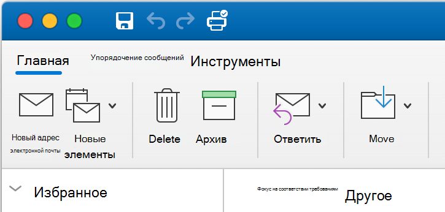
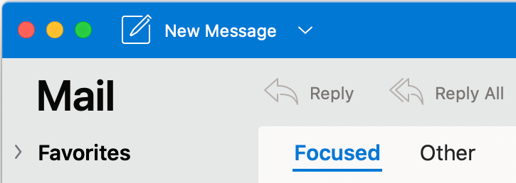

# Сравните Outlook поддержки надстройки в Outlook Mac с другими Outlook клиентами

Вы можете создать и запустить надстройку Outlook в Outlook Mac так же, как и в других клиентах, включая Outlook в Интернете, Windows, iOS и Android, не настраивая JavaScript для каждого клиента. Такие же вызовы из надстройки в API JavaScript Office обычно работают одинаково, за исключением областей, описанных в следующей таблице.

Дополнительные сведения см. в статье [Развертывание и установка надстроек Outlook для тестирования](testing-and-tips.md).

Сведения о новой поддержке пользовательского интерфейса см. в Outlook в [новом пользовательском интерфейсе Mac](#add-in-support-in-outlook-on-new-mac-ui-preview).

| Область | Outlook в Интернете, Windows и мобильных устройств | Outlook для Mac |
|:-----|:-----|:-----|
| Поддерживаемые версии файла office.js и схемы манифеста Надстройки Office | Все API в файле office.js и схема версии 1.1. | Все API в файле office.js и схема версии 1.1.  **ПРИМЕЧАНИЕ**. В Outlook Mac только сборка 16.35.308 или более поздней сборки поддерживает сохранение собрания. В противном случае `saveAsync` метод не удается при призыве с собрания в режиме составить. Временное решение представлено в статье [Не удается сохранить встречу как черновик в Outlook для Mac с помощью API JS для Office](https://support.microsoft.com/help/4505745). |
| Экземпляры серии повторяющихся встреч | <ul><li>Можно получить идентификатор элемента и другие свойства основной встречи или экземпляра встречи из серии повторяющихся встреч.</li><li>Можно использовать [mailbox.displayAppointmentForm](../reference/objectmodel/preview-requirement-set/office.context.mailbox.md#methods), чтобы вывести на экран экземпляр или основную встречу их серии.</li></ul> | <ul><li>Можно получить идентификатор элемента и другие свойства основной встречи, но не экземпляра серии повторяющихся встреч.</li><li>Можно отобразить основную встречу из серии повторяющихся встреч. Без идентификатора элемента экземпляр серии повторяющихся встреч отобразить невозможно.</li></ul> |
| Тип получателя участника встречи | С помощью [EmailAddressDetails.recipientType](/javascript/api/outlook/office.emailaddressdetails#outlook-office-emailaddressdetails-recipienttype-member) можно определить тип получателя участника. | `EmailAddressDetails.recipientType` возвращает `undefined` для участников встречи. |
| Строка версии клиентского приложения | Формат строки версии, возвращаемой [diagnostics.hostVersion](/javascript/api/outlook/office.diagnostics#outlook-office-diagnostics-hostversion-member) , зависит от фактического типа клиента. Например:<ul><li>Outlook на Windows:`15.0.4454.1002`</li><li>Outlook в Интернете:`15.0.918.2`</li></ul> |Пример строки версии, возвращаемой Outlook `Diagnostics.hostVersion` на Mac:`15.0 (140325)` |
| Настраиваемые свойства элемента | Если сеть выходит из строя, надстройка все еще может получить доступ к кэшированным настраиваемым свойствам. | Поскольку Outlook Mac не кэшет настраиваемые свойства, если сеть сойтется, надстройки не смогут получить к ним доступ. |
| Сведения о вложениях | Тип контента и имена вложений в [объекте AttachmentDetails](/javascript/api/outlook/office.attachmentdetails) зависят от типа клиента:<ul><li>Пример `AttachmentDetails.contentType` в формате JSON: `"contentType": "image/x-png"`. </li><li>`AttachmentDetails.name` не содержит расширение файла. Например, если вложение является сообщением с темой "RE: Планы на лето", то объект JSON, представляющий имя этого вложения, будет иметь вид `"name": "RE: Summer activity"`.</li></ul> | <ul><li>Пример `AttachmentDetails.contentType` в формате JSON: `"contentType" "image/png"`</li><li>`AttachmentDetails.name` всегда включает расширение имени файла. Вложения, являющиеся почтовыми элементами, имеют расширение EML, а встречи — расширение ICS. Например, если вложение — сообщение с темой "RE: Планы на лето", имя вложения будет представлено следующим объектом JSON: `"name": "RE: Summer activity.eml"`.
**Примечание.** Если файл вложен программным образом (например, с помощью надстройки) без расширения, то имя файла в свойстве `AttachmentDetails.name` не будет включать расширение.
</li></ul> |
| Строка, представляющая часовой пояс в свойствах `dateTimeCreated` и `dateTimeModified` |Пример: `Thu Mar 13 2014 14:09:11 GMT+0800 (China Standard Time)` | Пример: `Thu Mar 13 2014 14:09:11 GMT+0800 (CST)` |
| Точность времени в свойствах `dateTimeCreated` и `dateTimeModified` | Если надстройка использует приведенный ниже код, то обеспечивается точность до миллисекунд. `JSON.stringify(Office.context.mailbox.item, null, 4);`| Точность только до секунд. |

## Поддержка надстройки в Outlook в новом пользовательском интерфейсе Mac (предварительный просмотр)

Outlook надстройки теперь поддерживаются в новом пользовательском интерфейсе Mac (предварительная версия), в зависимости от набора требований 1.10. Однако следующие наборы требований и функции **пока не** поддерживаются.

- Набор API 1.11

Рекомендуется просмотреть Outlook пользовательского интерфейса Mac, доступного в версии 16.38.506. Дополнительные новости о том, как ее попробовать, см. в [Outlook для Mac - Заметки о выпуске для сборки insider Fast](https://support.microsoft.com/office/d6347358-5613-433e-a49e-a9a0e8e0462a).

Вы можете определить, в какой версии пользовательского интерфейса вы на, следующим образом:

**Текущий пользовательский интерфейс**

**Новый пользовательский интерфейс (предварительный просмотр)**

