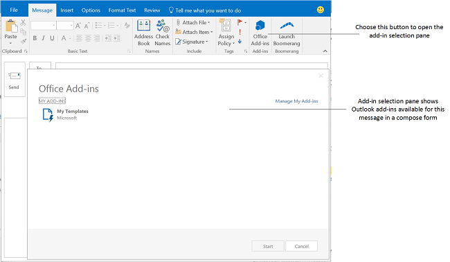

# Разработка надстроек Outlook для форм созданияCreate Outlook add-ins for compose forms

Начиная со схемы манифестов 1.1 для надстроек Office и файла Office.js 1.1, вы можете разрабатывать надстройки создания — надстройки Outlook, которые активируются в формах создания. В отличие от надстроек чтения (надстроек Outlook, которые активируются в режиме чтения, когда пользователь просматривает сообщение или сведения о встрече), надстройки создания доступны в следующих сценариях:Starting with version 1.1 of the schema for Office Add-ins manifests and v1.1 of Office.js, you can create compose add-ins, which are Outlook add-ins activated in compose forms. In contrast with read add-ins (Outlook add-ins that are activated in read mode when a user is viewing a message or appointment), compose add-ins are available in the following user scenarios:

- Создание сообщения, приглашения на собрание или встречи в отдельной форме.Composing a new message, meeting request, or appointment in a compose form.

- Просмотр или редактирование существующих встречи или собрания, организованных пользователем.Viewing or editing an existing appointment, or meeting item in which the user is the organizer.
    
   > [!NOTE]
   > При просмотре организованной пользователем встречи в Outlook 2013 RTM или Exchange 2013 RTM доступны надстройки чтения.If the user is on the RTM release of Outlook 2013 and Exchange 2013 and is viewing a meeting item organized by the user, the user can find read add-ins available. Начиная с выпуска Office 2013 с пакетом обновления 1 (SP1), только надстройки создания могут активироваться и быть доступными.Starting in the Office 2013 SP1 release, there's a change such that in the same scenario, only compose add-ins can activate and be available.

- Создание ответа на сообщение (встроенного или в отдельной форме).Composing an inline response message or replying to a message in a separate compose form.

- Изменение ответа (**Принять**, **Под вопросом** или **Отклонить**) на приглашение на собрание или элемент собрания.Editing a response (**Accept**, **Tentative**, or **Decline**) to a meeting request or meeting item.

- Предложение нового времени для элемента собрания.Proposing a new time for a meeting item.

- Пересылка или ответ на приглашение на собрание или элемент собрания.Forwarding or replying to a meeting request or meeting item.

В каждом из этих сценариев отображаются все определенные кнопки команд надстройки. В старых надстройках, в которых не реализованы команды, пользователи могут выбрать элемент **Надстройки Office** на ленте, чтобы открыть область выбора надстроек, а затем выбрать и запустить надстройку создания. На рисунке ниже показаны команды надстройки в форме создания.In each of these compose scenarios, any add-in command buttons defined by the add-in are shown. For older add-ins that do not implement add-in commands, users can choose **Office Add-ins** in the ribbon to open the add-in selection pane, and then choose and start a compose add-in. The following figure shows add-in commands in a compose form.

На рисунке ниже показана область выбора надстроек, включающая две надстройки создания, в которых не реализованы команды. Она активируется при создании встроенного ответа в Outlook.The following figure shows the add-in selection pane consisting of two compose add-ins that do not implement add-in commands, activated when the user is composing an inline reply in Outlook.

## Типы надстроек, доступные в режиме созданияTypes of add-ins available in compose mode

Надстройки создания реализуются в виде [команд надстроек Outlook](add-in-commands-for-outlook.md).Compose add-ins are implemented as [Add-in commands for Outlook](add-in-commands-for-outlook.md). Чтобы надстройки активировались при создании писем или ответов на приглашения на собрания, в манифест включается [точка расширения MessageComposeCommandSurface](../reference/manifest/extensionpoint.md#messagecomposecommandsurface).To activate add-ins for composing email or meeting responses, add-ins include a [MessageComposeCommandSurface extension point element](../reference/manifest/extensionpoint.md#messagecomposecommandsurface) in the manifest. Чтобы надстройки активировались при создании или редактировании встреч или собраний, организованных пользователем, добавляется [точка расширения AppointmentOrganizerCommandSurface](../reference/manifest/extensionpoint.md#appointmentorganizercommandsurface).To activate add-ins for composing or editing appointments or meetings where the user is the organizer, add-ins include a [AppointmentOrganizerCommandSurface extension point element](../reference/manifest/extensionpoint.md#appointmentorganizercommandsurface).

> [!NOTE]
> На серверах или клиентах, не поддерживающих команды надстроек, используются [правила активации](activation-rules.md), указанные в элементе [Rule](../reference/manifest/rule.md), содержащемся в элементе [OfficeApp](../reference/manifest/officeapp.md).Add-ins developed for servers or clients that do not support add-in commands use [activation rules](activation-rules.md) in a [Rule](../reference/manifest/rule.md) element contained in the [OfficeApp](../reference/manifest/officeapp.md) element. Если надстройка не разрабатывается специально для устаревших клиентов и серверов, в ней следует использовать команды надстроек.Unless the add-in is being specifically developed for older clients and servers, new add-ins should use add-in commands.

## Функции API, доступные надстройкам созданияAPI features available to compose add-ins

- [Добавление и удаление вложений в форме создания OutlookAdd and remove attachments to an item in a compose form in Outlook](add-and-remove-attachments-to-an-item-in-a-compose-form.md)
- [Просмотр и изменение данных элемента в форме создания элементов OutlookGet and set item data in a compose form in Outlook](get-and-set-item-data-in-a-compose-form.md)
- [Просмотр, изменение или добавление получателей при создании встречи или сообщения в OutlookGet, set, or add recipients when composing an appointment or message in Outlook](get-set-or-add-recipients.md)
- [Просмотр или изменение темы при создании встречи или сообщения в OutlookGet or set the subject when composing an appointment or message in Outlook](get-or-set-the-subject.md)
- [Вставка данных в текст при создании встречи или сообщения в OutlookInsert data in the body when composing an appointment or message in Outlook](insert-data-in-the-body.md)
- [Просмотр или изменение расположения при создании встречи в OutlookGet or set the location when composing an appointment in Outlook](get-or-set-the-location-of-an-appointment.md)
- [Просмотр или изменение времени при создании встречи в OutlookGet or set the time when composing an appointment in Outlook](get-or-set-the-time-of-an-appointment.md)

## См. такжеSee also

- [Начало работы с надстройками Outlook для OfficeGet Started with Outlook add-ins for Office](../quickstarts/outlook-quickstart.md)
