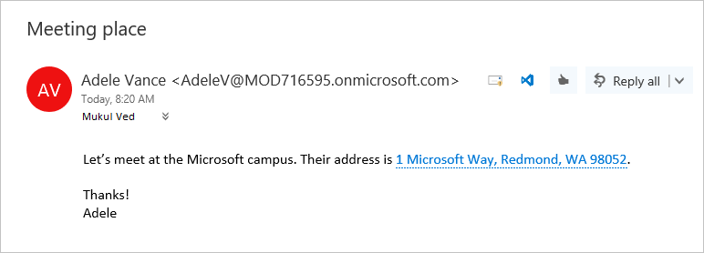

# <a name="contextual-outlook-add-ins"></a><span data-ttu-id="4b75d-103">Контекстные надстройки Outlook</span><span class="sxs-lookup"><span data-stu-id="4b75d-103">Contextual Outlook add-ins</span></span>

<span data-ttu-id="4b75d-p101">Контекстные надстройки — это надстройки Outlook, которые активируются при наличии определенного текста в сообщении или сведениях о встрече. С помощью контекстных надстроек пользователь может выполнять связанные с сообщением действия, не закрывая окно сообщения, что упрощает работу и расширяет возможности пользователя.</span><span class="sxs-lookup"><span data-stu-id="4b75d-p101">Contextual add-ins are Outlook add-ins that activate based on text in a message or appointment. By using contextual add-ins, a user can initiate tasks related to a message without leaving the message itself, which results in an easier and richer user experience.</span></span>

<span data-ttu-id="4b75d-106">Ниже представлены примеры контекстных надстроек.</span><span class="sxs-lookup"><span data-stu-id="4b75d-106">The following are examples of contextual add-ins:</span></span>

- <span data-ttu-id="4b75d-107">Чтобы открыть карту расположения, нужно выбрать адрес.</span><span class="sxs-lookup"><span data-stu-id="4b75d-107">Choosing an address to open a map of the location.</span></span>
- <span data-ttu-id="4b75d-108">Чтобы открыть надстройку с предложенными собраниями, нужно щелкнуть соответствующую строку.</span><span class="sxs-lookup"><span data-stu-id="4b75d-108">Choosing a string that opens a meeting suggestion add-in.</span></span>
- <span data-ttu-id="4b75d-109">Чтобы добавить номер телефона в контакты, нужно его выбрать.</span><span class="sxs-lookup"><span data-stu-id="4b75d-109">Choosing a phone number to add to your contacts.</span></span>


> [!NOTE]
> <span data-ttu-id="4b75d-110">Контекстные надстройки в настоящее время недоступны в Outlook для Android и iOS,</span><span class="sxs-lookup"><span data-stu-id="4b75d-110">Contextual add-ins are not currently available in Outlook on Android and iOS.</span></span> <span data-ttu-id="4b75d-111">но в будущем мы добавим эту функцию.</span><span class="sxs-lookup"><span data-stu-id="4b75d-111">This functionality will be made available in the future.</span></span>
>
> <span data-ttu-id="4b75d-112">Поддержка этой функции была реализована в наборе обязательных элементов 1.6</span><span class="sxs-lookup"><span data-stu-id="4b75d-112">Support for this feature was introduced in requirement set 1.6.</span></span> <span data-ttu-id="4b75d-113">См [клиенты и платформы](../reference/requirement-sets/outlook-api-requirement-sets.md#requirement-sets-supported-by-exchange-servers-and-outlook-clients), поддерживающие этот набор обязательных требований.</span><span class="sxs-lookup"><span data-stu-id="4b75d-113">See [clients and platforms](../reference/requirement-sets/outlook-api-requirement-sets.md#requirement-sets-supported-by-exchange-servers-and-outlook-clients) that support this requirement set.</span></span>

## <a name="how-to-make-a-contextual-add-in"></a><span data-ttu-id="4b75d-114">Создание контекстной надстройки</span><span class="sxs-lookup"><span data-stu-id="4b75d-114">How to make a contextual add-in</span></span>

<span data-ttu-id="4b75d-115">Манифест контекстной надстройки должен содержать элемент [ExtensionPoint](../reference/manifest/extensionpoint.md), для атрибута `xsi:type` которого задано значение `DetectedEntity`.</span><span class="sxs-lookup"><span data-stu-id="4b75d-115">A contextual add-in's manifest must include an [ExtensionPoint](../reference/manifest/extensionpoint.md) element with an `xsi:type` attribute set to `DetectedEntity`.</span></span> <span data-ttu-id="4b75d-116">В элементе **ExtensionPoint** надстройка задает сущности или регулярное выражение, которые могут активировать ее.</span><span class="sxs-lookup"><span data-stu-id="4b75d-116">Within the **ExtensionPoint** element, the add-in specifies the entities or regular expression that can activate it.</span></span> <span data-ttu-id="4b75d-117">Если указывается сущность, это может быть любое из свойств объекта [Entities](/javascript/api/outlook/office.entities).</span><span class="sxs-lookup"><span data-stu-id="4b75d-117">If an entity is specified, the entity can be any of the properties in the [Entities](/javascript/api/outlook/office.entities) object.</span></span>

<span data-ttu-id="4b75d-118">Следовательно, манифест надстройки должен содержать правило типа **ItemHasKnownEntity** или **ItemHasRegularExpressionMatch**.</span><span class="sxs-lookup"><span data-stu-id="4b75d-118">Thus, the add-in manifest must contain a rule of type **ItemHasKnownEntity** or **ItemHasRegularExpressionMatch**.</span></span> <span data-ttu-id="4b75d-119">В примере ниже показано, как указать, что надстройка активируется с помощью сообщений, содержащих обнаруженный объект (т. е. номер телефона):</span><span class="sxs-lookup"><span data-stu-id="4b75d-119">The following example shows how to specify that an add-in should activate on messages with a detected entity that is a phone number:</span></span>

```XML
<ExtensionPoint xsi:type="DetectedEntity">
  <Label resid="contextLabel" />
  <SourceLocation resid="detectedEntityURL" />
  <Rule xsi:type="RuleCollection" Mode="And">
    <Rule xsi:type="ItemIs" ItemType="Message" />
    <Rule xsi:type="ItemHasKnownEntity" EntityType="PhoneNumber" Highlight="all" />
  </Rule>
</ExtensionPoint>
```

<span data-ttu-id="4b75d-120">После того как контекстная надстройка будет связана с учетной записью, она будет автоматически запускаться, когда пользователь щелкает выделенный объект или регулярное выражение.</span><span class="sxs-lookup"><span data-stu-id="4b75d-120">After a contextual add-in is associated with an account, it will automatically start when the user clicks a highlighted entity or regular expression.</span></span> <span data-ttu-id="4b75d-121">Дополнительные сведения о регулярных выражениях для надстроек Outlook см. в статье [Использование правил активации на основе регулярных выражений для отображения надстройки Outlook](use-regular-expressions-to-show-an-outlook-add-in.md).</span><span class="sxs-lookup"><span data-stu-id="4b75d-121">For more information about regular expressions for Outlook add-ins, see [Use regular expression activation rules to show an Outlook add-in](use-regular-expressions-to-show-an-outlook-add-in.md).</span></span>

<span data-ttu-id="4b75d-122">Контекстные надстройки имеют несколько ограничений:</span><span class="sxs-lookup"><span data-stu-id="4b75d-122">There are several restrictions on contextual add-ins:</span></span>

- <span data-ttu-id="4b75d-123">Контекстная надстройка может существовать только в надстройках чтения (не надстройках создания).</span><span class="sxs-lookup"><span data-stu-id="4b75d-123">A contextual add-in can only exist in read add-ins (not compose add-ins).</span></span>
- <span data-ttu-id="4b75d-124">Указывать цвет выделенной сущности невозможно.</span><span class="sxs-lookup"><span data-stu-id="4b75d-124">You cannot specify the color of the highlighted entity.</span></span>
- <span data-ttu-id="4b75d-125">Невыделенная сущность не запускает контекстную надстройку на карточке.</span><span class="sxs-lookup"><span data-stu-id="4b75d-125">An entity that is not highlighted will not launch a contextual add-in in a card.</span></span>

<span data-ttu-id="4b75d-126">Так как невыделенные сущности и регулярные выражения не запускают контекстную надстройку, такие надстройки должны включать по крайней мере один элемент `Rule`, для атрибута `Highlight` которого задано значение `all`.</span><span class="sxs-lookup"><span data-stu-id="4b75d-126">Because an entity or regular expression that is not highlighted will not launch a contextual add-in, add-ins must include at least one `Rule` element with the `Highlight` attribute set to `all`.</span></span>

> [!NOTE]
> <span data-ttu-id="4b75d-p107">Сущности `EmailAddress` и `Url` не поддерживают выделение, поэтому их нельзя использовать для запуска контекстной надстройки. Однако их можно объединить в правило `RuleCollection` и использовать в качестве дополнительного условия активации.</span><span class="sxs-lookup"><span data-stu-id="4b75d-p107">The `EmailAddress` and `Url` entity types do not support highlighting, so they cannot be used to launch a contextual add-in. They can however be combined in a `RuleCollection` rule type as an additional activation criteria.</span></span>

## <a name="how-to-launch-a-contextual-add-in"></a><span data-ttu-id="4b75d-129">Запуск контекстной надстройки</span><span class="sxs-lookup"><span data-stu-id="4b75d-129">How to launch a contextual add-in</span></span>

<span data-ttu-id="4b75d-p108">Пользователь запускает контекстную надстройку через текст — известную сущность или регулярное выражение разработчика. Как правило, пользователь определяет контекстную надстройку по выделенной сущности. В приведенном ниже примере показано, как выделение отображается в сообщении. Здесь сущность (адрес) окрашена в синий цвет и подчеркнута синим пунктиром. Пользователь запускает контекстную надстройку, щелкнув выделенную сущность.</span><span class="sxs-lookup"><span data-stu-id="4b75d-p108">A user launches a contextual add-in through text, either a known entity or a developer's regular expression. Typically, a user identifies a contextual add-in because the entity is highlighted. The following example shows how highlighting appears in a message. Here the entity (an address) is colored blue and underlined with a dotted blue line. A user launches the contextual add-in by clicking the highlighted entity.</span></span> 

<span data-ttu-id="4b75d-135">**Пример текста с выделенной сущностью (адресом)**</span><span class="sxs-lookup"><span data-stu-id="4b75d-135">**Example of text with highlighted entity (an address)**</span></span>


    
<span data-ttu-id="4b75d-137">Если сообщение содержит несколько сущностей или контекстных надстроек, действует несколько правил взаимодействия:</span><span class="sxs-lookup"><span data-stu-id="4b75d-137">When there are multiple entities or contextual add-ins in a message, there are a few user interaction rules:</span></span>

- <span data-ttu-id="4b75d-138">Если имеется несколько сущностей, нужно щелкнуть другую сущность, чтобы запустить связанную с ней надстройку.</span><span class="sxs-lookup"><span data-stu-id="4b75d-138">If there are multiple entities, the user has to click a different entity to launch the add-in for it.</span></span>
- <span data-ttu-id="4b75d-139">Если сущность активирует несколько надстроек, каждая из них открывается в новой вкладке. Пользователь может переключаться между надстройками, переходя между вкладками. Например, имя и адрес могут запускать надстройку для звонков и карту.</span><span class="sxs-lookup"><span data-stu-id="4b75d-139">If an entity activates multiple add-ins, each add-in opens a new tab. The user switches between tabs to change between add-ins. For example, a name and address might trigger a phone add-in and a map.</span></span>
- <span data-ttu-id="4b75d-p109">Если строка содержит несколько сущностей, которые активируют несколько надстроек, выделяется вся строка. Щелкнув строку, пользователь увидит все соответствующие надстройки на отдельных вкладках. Например, строка с описанием встречи в ресторане может активировать надстройку с предложениями, касающимися собраний, и надстройку с оценкой ресторана.</span><span class="sxs-lookup"><span data-stu-id="4b75d-p109">If a single string contains multiple entities that activate multiple add-ins, the entire string is highlighted, and clicking the string shows all add-ins relevant to the string on separate tabs. For example, a string that describes a proposed meeting at a restaurant might activate the Suggested Meeting add-in and a restaurant rating add-in.</span></span>

## <a name="how-a-contextual-add-in-displays"></a><span data-ttu-id="4b75d-142">Отображение контекстной надстройки</span><span class="sxs-lookup"><span data-stu-id="4b75d-142">How a contextual add-in displays</span></span>

<span data-ttu-id="4b75d-p110">Активированная контекстная надстройка отображается на карточке — отдельном окне рядом с сущностью. Как правило, карточка отображается под сущностью и, насколько это возможно, выравнивается по центру относительно нее. Если под сущностью недостаточно места, карточка отображается над ней. На приведенном ниже снимке экрана показана выделенная сущность, а под ней — активированная надстройка (Карты Bing) на карточке.</span><span class="sxs-lookup"><span data-stu-id="4b75d-p110">An activated contextual add-in appears in a card, which is a separate window near the entity. The card will normally appear below the entity and centered with respect to the entity as much as possible. If there is not enough room below the entity, the card is placed above it. The following screenshot shows the highlighted entity, and below it, an activated add-in (Bing Maps) in a card.</span></span>

<span data-ttu-id="4b75d-147">**Пример надстройки, отображаемой на карточке**</span><span class="sxs-lookup"><span data-stu-id="4b75d-147">**Example of an add-in displayed in a card**</span></span>


<span data-ttu-id="4b75d-149">Чтобы закрыть карточку и завершить работу надстройки, щелкните в любом месте за пределами карточки.</span><span class="sxs-lookup"><span data-stu-id="4b75d-149">To close the card and the add-in, a user clicks anywhere outside of the card.</span></span>

## <a name="current-contextual-add-ins"></a><span data-ttu-id="4b75d-150">Текущие контекстные надстройки</span><span class="sxs-lookup"><span data-stu-id="4b75d-150">Current contextual add-ins</span></span>

<span data-ttu-id="4b75d-151">Для пользователей надстроек Outlook по умолчанию устанавливаются следующие контекстные надстройки:</span><span class="sxs-lookup"><span data-stu-id="4b75d-151">The following contextual add-ins are installed by default for users with Outlook add-ins:</span></span>

- <span data-ttu-id="4b75d-152">Карты Bing</span><span class="sxs-lookup"><span data-stu-id="4b75d-152">Bing Maps</span></span> 
- <span data-ttu-id="4b75d-153">Рекомендуемые собрания</span><span class="sxs-lookup"><span data-stu-id="4b75d-153">Suggested Meetings</span></span>

## <a name="see-also"></a><span data-ttu-id="4b75d-154">См. также</span><span class="sxs-lookup"><span data-stu-id="4b75d-154">See also</span></span>

- <span data-ttu-id="4b75d-155">[Надстройка Outlook: номер заказа Contoso](https://github.com/OfficeDev/Outlook-Add-In-Contextual-Regex) (пример контекстной надстройки, которая активируется на основе соответствия регулярному выражению)</span><span class="sxs-lookup"><span data-stu-id="4b75d-155">[Outlook add-in: Contoso Order Number](https://github.com/OfficeDev/Outlook-Add-In-Contextual-Regex) (sample contextual add-in that activates based on a regular expression match)</span></span>
- [<span data-ttu-id="4b75d-156">Написание вашей первой надстройки Outlook</span><span class="sxs-lookup"><span data-stu-id="4b75d-156">Write your first Outlook add-in</span></span>](../quickstarts/outlook-quickstart.md)
- [<span data-ttu-id="4b75d-157">Использование правил активации на основе регулярных выражений для отображения надстройки Outlook</span><span class="sxs-lookup"><span data-stu-id="4b75d-157">Use regular expression activation rules to show an Outlook add-in</span></span>](use-regular-expressions-to-show-an-outlook-add-in.md)
- [<span data-ttu-id="4b75d-158">Объект Entities</span><span class="sxs-lookup"><span data-stu-id="4b75d-158">Entities object</span></span>](/javascript/api/outlook/office.entities)
