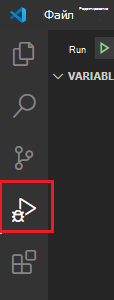
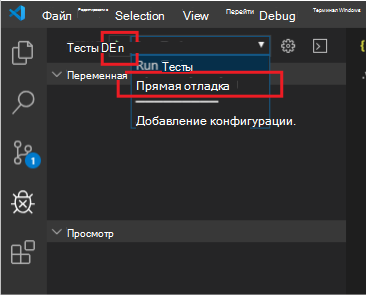

# <a name="debug-your-event-based-outlook-add-in-preview"></a>Отладить данные на основе Outlook (предварительный просмотр)

В этой статье содержатся рекомендации по отладке [при реализации активации событий](autolaunch.md) в надстройке. Функция активации на основе событий в настоящее время находится в предварительном просмотре.

> [!IMPORTANT]
> Эта возможность отладки поддерживается только для предварительного просмотра Outlook в Windows с Microsoft 365 подпиской. Для получения дополнительной информации в [этой статье можно увидеть отладку Preview для раздела функции активации](#preview-debugging-for-the-event-based-activation-feature) на основе событий.

В этой статье мы обсуждаем ключевые этапы, позволяющие отладку.

- [Отметь надстройку для отладки](#mark-your-add-in-for-debugging)
- [Настройка Visual Studio Code](#configure-visual-studio-code)
- [Прикрепите Visual Studio Code](#attach-visual-studio-code)
- [Debug](#debug)

У вас есть несколько вариантов создания надстройного проекта. В зависимости от используемого варианта шаги могут отличаться. В этом случае, если вы использовали генератор Yeoman для Office дополнительных виленок для создания надстройки проекта (например, делая [пошаговое руководство активации на основе событий),](autolaunch.md)то следуйте **шагам офиса yo,** в противном случае **следуйте другим** шагам. Visual Studio Code должна быть по крайней мере версия 1.56.1.

## <a name="preview-debugging-for-the-event-based-activation-feature"></a>Предварительная отладка функции активации на основе событий

Мы приглашаем Вас опробовать возможности отладки для функции активации на основе событий! Сообщите нам о ваших сценариях и о том, как мы можем улучшить их, дав нам обратную связь GitHub **(см.** раздел Обратная связь в конце этой страницы).

Для просмотра этой возможности Outlook на Windows, минимальная требуемая сборка составляет 16.0.13729.20000. Для доступа к Office бета-сборки, присоединяйтесь [к Office Insider](https://insider.office.com).

## <a name="mark-your-add-in-for-debugging"></a>Отметите надстройку для отладки

1. Установите ключ реестра `HKEY_CURRENT_USER\SOFTWARE\Microsoft\Office\16.0\Wef\Developer\[Add-in ID]\UseDirectDebugger` . `[Add-in ID]` является **идентификатором** в надстройной манифесте.

    **yo office**: В окне командной строки перейдите к корню папки с надстройки, а затем запустите следующую команду.

    ```command&nbsp;line
    npm start
    ```

    В дополнение к созданию кода и запуску локального сервера, эта команда должна `UseDirectDebugger` установить ключ реестра для этого дополнения к `1` .

    **Другие**: Добавить `UseDirectDebugger` ключ реестра под `HKEY_CURRENT_USER\SOFTWARE\Microsoft\Office\16.0\WEF\Developer\[Add-in ID]\` . `[Add-in ID]`Замените **id** из надстройного манифеста. Установите ключ реестра к `1` .

    [!include[Developer registry key](../includes/developer-registry-key.md)]

1. Начните Outlook (или перезапустите Outlook, если он уже открыт).
1. Составьте новое сообщение или встречу. Вы должны увидеть следующий диалог. Пока *не* взаимодействуйте с диалогом.

    

## <a name="configure-visual-studio-code"></a>Настройка Visual Studio Code

### <a name="yo-office"></a>йо-офис

1. Вернуться в окно командной строки, открыть Visual Studio Code.

    ```command&nbsp;line
    code .
    ```

1. В Visual Studio Code откройте файл **./.vscode/launch.jsи добавьте** следующий отрывок в список конфигураций. Сохраните изменения.

    ```json
    {
      "name": "Direct Debugging",
      "type": "node",
      "request": "attach",
      "port": 9229,
      "protocol": "inspector",
      "timeout": 600000,
      "trace": true
    }
    ```

### <a name="other"></a>Другое

1. Создайте новую папку под **названием Debugging** (возможно, в **папке Desktop).**
1. Открытая Visual Studio Code.
1. Перейдите в **File**  >  **Open Folder,** перейдите к папке, которую вы только что создали, а затем **выберите Select Folder**.
1. В баре активности выберите **элемент отладки** (Ctrl-Shift-D).

    

1. Выберите **создать launch.jsссылке файла.**

    

1. В **выберите среду** падения, выберите **Край: Запуск для** создания launch.jsв файле.
1. Добавьте следующий отрывок в список конфигураций. Сохраните изменения.

    ```json
    {
      "name": "Direct Debugging",
      "type": "node",
      "request": "attach",
      "port": 9229,
      "protocol": "inspector",
      "timeout": 600000,
      "trace": true
    }
    ```

## <a name="attach-visual-studio-code"></a>Прикрепите Visual Studio Code

1. Чтобы найти дополнительные данные **bundle.js,** откройте следующую папку в Windows Explorer и ищите **идентификатор надстройки** (найдено в манифесте).

    ```text
    %LOCALAPPDATA%\Microsoft\Office\16.0\Wef
    ```

    Откройте папку, наклееную на этот идентификатор, и скопировать ее полный путь. В Visual Studio Code, откройте **bundle.jsиз** этой папки. Шаблон пути файла должен быть следующим:

    `%LOCALAPPDATA%\Microsoft\Office\16.0\Wef\{[Outlook profile GUID]}\[encoding]\Javascript\[Add-in ID]_[Add-in Version]_[locale]\bundle.js`

1. Поместите точки разрыва в bundle.js где вы хотите, чтобы отбегер, чтобы остановить.
1. В **отключке DEBUG** выберите имя **Прямая отладка,** а затем выберите **Run.**

    

## <a name="debug"></a>Debug

1. После подтверждения того, что отладка прилагается, вернитесь к Outlook, и в **диалоге обработчика на основе события отладки** выберите **OK** .

1. Теперь вы можете поразить точки разрыва в Visual Studio Code, что позволит вам отладить код активации на основе событий.

## <a name="stop-debugging"></a>Остановить отладку

Чтобы остановить отладку для остальной части текущего сеанса Outlook рабочего стола, в **диалоге обработчиков на основе события отладки,** выберите **Отменить**. Чтобы повторно включить отладку, перезапустите Outlook столе.

Чтобы предотвратить **выскакивание диалога обработчика на основе событий Отладки** и прекратить отладку для последующих сеансов Outlook, удалите связанный ключ реестра или установите его `0` значение: `HKEY_CURRENT_USER\SOFTWARE\Microsoft\Office\16.0\Wef\Developer\[Add-in ID]\UseDirectDebugger` .

## <a name="see-also"></a>См. также

- [Настройте Outlook для активации на основе событий](autolaunch.md)
- [Отладка надстройки с помощью журнала среды выполнения](../testing/runtime-logging.md#runtime-logging-on-windows)
