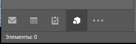
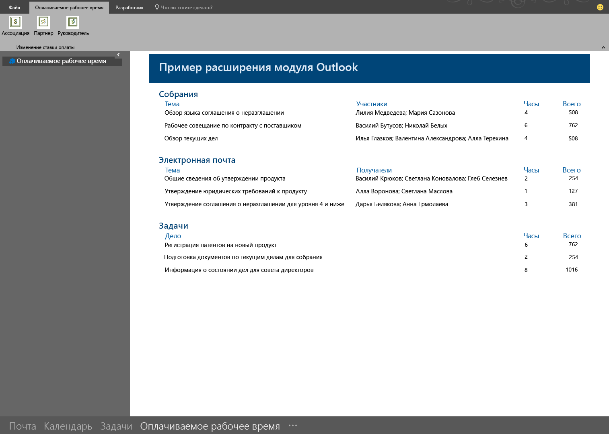

# <a name="module-extension-outlook-add-ins"></a><span data-ttu-id="c2f75-103">Надстройки Outlook с расширением модуля</span><span class="sxs-lookup"><span data-stu-id="c2f75-103">Module extension Outlook add-ins</span></span>

<span data-ttu-id="c2f75-104">Надстройки с расширением модуля отображаются на панели навигации Outlook рядом с почтой, задачами и календарями.</span><span class="sxs-lookup"><span data-stu-id="c2f75-104">Module extension add-ins appear in the Outlook navigation bar, right alongside mail, tasks, and calendars.</span></span> <span data-ttu-id="c2f75-105">Расширение модуля может использовать не только сведения о почте и встречах.</span><span class="sxs-lookup"><span data-stu-id="c2f75-105">A module extension is not limited to using mail and appointment information.</span></span> <span data-ttu-id="c2f75-106">Вы можете создать приложения, с помощью которых пользователи могут получать доступ к бизнес-информации и средствам повышения производительности, не выходя из Outlook.</span><span class="sxs-lookup"><span data-stu-id="c2f75-106">You can create applications that run inside Outlook to make it easy for your users to access business information and productivity tools without ever leaving Outlook.</span></span>

> [!NOTE]
> <span data-ttu-id="c2f75-107">Расширения модуля поддерживаются только в Outlook 2016 или более поздних версиях для Windows.</span><span class="sxs-lookup"><span data-stu-id="c2f75-107">Module extensions are only supported by Outlook 2016 or later on Windows.</span></span>  

## <a name="open-a-module-extension"></a><span data-ttu-id="c2f75-108">Открытие расширения модуля</span><span class="sxs-lookup"><span data-stu-id="c2f75-108">Open a module extension</span></span>

<span data-ttu-id="c2f75-p102">Чтобы открыть расширение модуля, пользователю необходимо щелкнуть имя или значок модуля на панели навигации Outlook. Если пользователь выбрал компактный режим панели навигации, то на ней будет отображаться значок, показывающий, что расширение загружено.</span><span class="sxs-lookup"><span data-stu-id="c2f75-p102">To open a module extension, users click on the module's name or icon in the Outlook navigation bar. If the user has compact navigation selected, the navigation bar has an icon that shows an extension is loaded.</span></span>



<span data-ttu-id="c2f75-112">Если пользователь не используют компактную навигацию, то для панели навигации доступно два представления.</span><span class="sxs-lookup"><span data-stu-id="c2f75-112">If the user is not using compact navigation, the navigation bar has two looks.</span></span> <span data-ttu-id="c2f75-113">Если загружено одно расширение, отображается название надстройки.</span><span class="sxs-lookup"><span data-stu-id="c2f75-113">With one extension loaded, it shows the name of the add-in.</span></span>


<span data-ttu-id="c2f75-115">Если загружено несколько надстроек, отображается слово **Надстройки**. В обоих вариантах при нажатии откроется пользовательский интерфейс расширения.</span><span class="sxs-lookup"><span data-stu-id="c2f75-115">When more than one add-in is loaded, it shows the word **Add-ins**. Clicking either will open the extension's user interface.</span></span>


<span data-ttu-id="c2f75-117">Когда вы щелкаете расширение, Outlook заменяет встроенный модуль на специальный, чтобы пользователи могли взаимодействовать с надстройкой.</span><span class="sxs-lookup"><span data-stu-id="c2f75-117">When you click on an extension, Outlook replaces the built-in module with your custom module so that your users can interact with the add-in.</span></span> <span data-ttu-id="c2f75-118">Вы можете использовать все функции API JavaScript для Outlook в надстройке и создавать кнопки на ленте Outlook, которые будут взаимодействовать с содержимым надстройки.</span><span class="sxs-lookup"><span data-stu-id="c2f75-118">You can use all of the features of the Outlook JavaScript API in your add-in, and can create command buttons in the Outlook ribbon that will interact with the add-in content.</span></span> <span data-ttu-id="c2f75-119">Ниже показана интегрированная в панель навигации Outlook надстройка с кнопками на ленте, которые обновляют ее содержимое.</span><span class="sxs-lookup"><span data-stu-id="c2f75-119">The following screenshot shows an add-in that is integrated in the Outlook navigation bar and has ribbon commands that will update the content of the add-in.</span></span>



## <a name="example"></a><span data-ttu-id="c2f75-121">Пример</span><span class="sxs-lookup"><span data-stu-id="c2f75-121">Example</span></span>

<span data-ttu-id="c2f75-122">Ниже показан раздел файла манифеста, который определяет расширение модуля.</span><span class="sxs-lookup"><span data-stu-id="c2f75-122">The following is a section of a manifest file that defines a module extension.</span></span>

```xml
<!-- Add Outlook module extension point -->
<VersionOverrides xmlns="http://schemas.microsoft.com/office/mailappversionoverrides"
                  xsi:type="VersionOverridesV1_0">
  <VersionOverrides xmlns="http://schemas.microsoft.com/office/mailappversionoverrides/1.1"
                    xsi:type="VersionOverridesV1_1">

    <!-- Begin override of existing elements -->
    <Description resid="residVersionOverrideDesc" />

    <Requirements>
      <bt:Sets DefaultMinVersion="1.3">
        <bt:Set Name="Mailbox" />
      </bt:Sets>
    </Requirements>
    <!-- End override of existing elements -->

    <Hosts>
      <Host xsi:type="MailHost">
        <DesktopFormFactor>
          <!-- Set the URL of the file that contains the
                JavaScript function that controls the extension -->
          <FunctionFile resid="residFunctionFileUrl" />

          <!--New Extension Point - Module for a ModuleApp -->
          <ExtensionPoint xsi:type="Module">
            <SourceLocation resid="residExtensionPointUrl" />
            <Label resid="residExtensionPointLabel" />

            <CommandSurface>
              <CustomTab id="idTab">
                <Group id="idGroup">
                  <Label resid="residGroupLabel" />

                  <Control xsi:type="Button" id="group.changeToAssociate">
                    <Label resid="residChangeToAssociateLabel" />
                    <Supertip>
                      <Title resid="residChangeToAssociateLabel" />
                      <Description resid="residChangeToAssociateDesc" />
                    </Supertip>
                    <Icon>
                      <bt:Image size="16" resid="residAssociateIcon16" />
                      <bt:Image size="32" resid="residAssociateIcon32" />
                      <bt:Image size="80" resid="residAssociateIcon80" />
                    </Icon>
                    <Action xsi:type="ExecuteFunction">
                      <FunctionName>changeToAssociateRate</FunctionName>
                    </Action>
                  </Control>
                  
              </Group>
                <Label resid="residCustomTabLabel" />
              </CustomTab>
            </CommandSurface>
          </ExtensionPoint>
        </DesktopFormFactor>
      </Host>
    </Hosts>

    <Resources>
      <bt:Images>
        <bt:Image id="residAddinIcon16" 
                  DefaultValue="https://localhost:8080/Executive-16.png" />
        <bt:Image id="residAddinIcon32" 
                  DefaultValue="https://localhost:8080/Executive-32.png" />
        <bt:Image id="residAddinIcon80" 
                  DefaultValue="https://localhost:8080/Executive-80.png" />
      
        <bt:Image id="residAssociateIcon16" 
                  DefaultValue="https://localhost:8080/Associate-16.png" />
        <bt:Image id="residAssociateIcon32" 
                  DefaultValue="https://localhost:8080/Associate-32.png" />
        <bt:Image id="residAssociateIcon80" 
                  DefaultValue="https://localhost:8080/Associate-80.png" />
      </bt:Images>

      <bt:Urls>
        <bt:Url id="residFunctionFileUrl" 
                DefaultValue="https://localhost:8080/" />
        <bt:Url id="residExtensionPointUrl" 
                DefaultValue="https://localhost:8080/" />
      </bt:Urls>

      <!--Short strings must be less than 30 characters long -->
      <bt:ShortStrings>
        <bt:String id="residExtensionPointLabel" 
                    DefaultValue="Billable Hours" />
        <bt:String id="residGroupLabel" 
                    DefaultValue="Change billing rate" />
        <bt:String id="residCustomTabLabel" 
                    DefaultValue="Billable hours" />

        <bt:String id="residChangeToAssociateLabel" 
                    DefaultValue="Associate" />
      </bt:ShortStrings>

      <bt:LongStrings>
        <bt:String id="residVersionOverrideDesc" 
                    DefaultValue="Version override description" />

        <bt:String id="residChangeToAssociateDesc" 
                    DefaultValue="Change to the associate billing rate: $127/hr" />
      </bt:LongStrings>
    </Resources>
  </VersionOverrides>
</VersionOverrides>
```

## <a name="see-also"></a><span data-ttu-id="c2f75-123">См. также</span><span class="sxs-lookup"><span data-stu-id="c2f75-123">See also</span></span>

- [<span data-ttu-id="c2f75-124">Манифесты надстроек Outlook</span><span class="sxs-lookup"><span data-stu-id="c2f75-124">Outlook add-in manifests</span></span>](manifests.md)
- [<span data-ttu-id="c2f75-125">Команды надстроек Outlook</span><span class="sxs-lookup"><span data-stu-id="c2f75-125">Add-in commands for Outlook</span></span>](add-in-commands-for-outlook.md)
- [<span data-ttu-id="c2f75-126">Пример расширений модуля Outlook для расчета оплачиваемых часов</span><span class="sxs-lookup"><span data-stu-id="c2f75-126">Outlook module extensions Billable hours sample</span></span>](https://github.com/OfficeDev/Outlook-Add-in-JavaScript-ModuleExtension)
