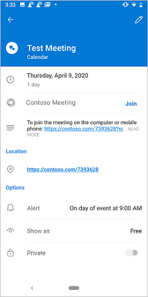

# <a name="create-an-outlook-mobile-add-in-for-an-online-meeting-provider-preview"></a><span data-ttu-id="a563b-103">Создание надстройки Outlook Mobile для поставщика собраний в Интернете (Предварительная версия)</span><span class="sxs-lookup"><span data-stu-id="a563b-103">Create an Outlook mobile add-in for an online-meeting provider (preview)</span></span>

<span data-ttu-id="a563b-104">Настройка собрания по сети — это основной интерфейс для пользователя Outlook, который позволяет легко [создать собрание Teams с помощью Outlook](/microsoftteams/teams-add-in-for-outlook) Mobile.</span><span class="sxs-lookup"><span data-stu-id="a563b-104">Setting up an online meeting is a core experience for an Outlook user, and it's easy to [create a Teams meeting with Outlook](/microsoftteams/teams-add-in-for-outlook) mobile.</span></span> <span data-ttu-id="a563b-105">Однако создание собрания по сети в Outlook со службой, отличной от Майкрософт, может быть утомительным.</span><span class="sxs-lookup"><span data-stu-id="a563b-105">However, creating an online meeting in Outlook with a non-Microsoft service can be cumbersome.</span></span> <span data-ttu-id="a563b-106">Реализуя эту функцию, поставщики услуг могут упростить процесс создания собраний по сети для пользователей надстроек Outlook.</span><span class="sxs-lookup"><span data-stu-id="a563b-106">By implementing this feature, service providers can streamline the online meeting creation experience for their Outlook add-in users.</span></span>

> [!NOTE]
> <span data-ttu-id="a563b-107">Эта функция поддерживается только в [предварительной версии](../reference/objectmodel/preview-requirement-set/outlook-requirement-set-preview.md) на Android с подпиской на Office 365.</span><span class="sxs-lookup"><span data-stu-id="a563b-107">This feature is only supported in [preview](../reference/objectmodel/preview-requirement-set/outlook-requirement-set-preview.md) on Android with an Office 365 subscription.</span></span>

<span data-ttu-id="a563b-108">В этой статье вы узнаете, как настроить надстройку Outlook Mobile, чтобы позволить пользователям упорядочивать и присоединяться к собранию с помощью службы собраний по сети.</span><span class="sxs-lookup"><span data-stu-id="a563b-108">In this article, you'll learn how to set up your Outlook mobile add-in to enable users to organize and join a meeting using your online-meeting service.</span></span> <span data-ttu-id="a563b-109">В этой статье мы будем использовать фиктивный поставщик услуг по подключению к собраниям, "contoso".</span><span class="sxs-lookup"><span data-stu-id="a563b-109">Throughout this article, we'll be using a fictional online-meeting service provider, "Contoso".</span></span>

## <a name="configure-the-manifest"></a><span data-ttu-id="a563b-110">Настройка манифеста</span><span class="sxs-lookup"><span data-stu-id="a563b-110">Configure the manifest</span></span>

<span data-ttu-id="a563b-111">Чтобы позволить пользователям создавать собрания по сети с надстройкой, необходимо настроить точку `MobileOnlineMeetingCommandSurface` расширения в манифесте под родительским элементом. `MobileFormFactor`</span><span class="sxs-lookup"><span data-stu-id="a563b-111">To enable users to create online meetings with your add-in, you must configure the `MobileOnlineMeetingCommandSurface` extension point in the manifest under the parent element `MobileFormFactor`.</span></span> <span data-ttu-id="a563b-112">Другие конструктивные параметры не поддерживаются.</span><span class="sxs-lookup"><span data-stu-id="a563b-112">Other form factors are not supported.</span></span>

<span data-ttu-id="a563b-113">В приведенном ниже примере показан пример манифеста, включающего `MobileFormFactor` элемент и `MobileOnlineMeetingCommandSurface` точку расширения.</span><span class="sxs-lookup"><span data-stu-id="a563b-113">The following example shows a sample of the manifest that includes the `MobileFormFactor` element and `MobileOnlineMeetingCommandSurface` extension point.</span></span>

```xml
...
<VersionOverrides xmlns="http://schemas.microsoft.com/office/mailappversionoverrides" xsi:type="VersionOverridesV1_0">
  <VersionOverrides xmlns="http://schemas.microsoft.com/office/mailappversionoverrides/1.1" xsi:type="VersionOverridesV1_1">
    ...
    <Hosts>
      <Host xsi:type="MailHost">
        <MobileFormFactor>
          <FunctionFile resid="residMobileFuncUrl" />
          <ExtensionPoint xsi:type="MobileOnlineMeetingCommandSurface">
            <!-- Configure selected extension point. -->
            <Control xsi:type="MobileButton" id="onlineMeetingFunctionButton">
              <Label resid="residUILessButton0Name" />
              <Icon>
                <bt:Image resid="UiLessIcon" size="25" scale="1" />
                <bt:Image resid="UiLessIcon" size="25" scale="2" />
                <bt:Image resid="UiLessIcon" size="25" scale="3" />
                <bt:Image resid="UiLessIcon" size="32" scale="1" />
                <bt:Image resid="UiLessIcon" size="32" scale="2" />
                <bt:Image resid="UiLessIcon" size="32" scale="2" />
                <bt:Image resid="UiLessIcon" size="48" scale="1" />
                <bt:Image resid="UiLessIcon" size="48" scale="2" />
                <bt:Image resid="UiLessIcon" size="48" scale="3" />
              </Icon>
              <Action xsi:type="ExecuteFunction">
                <FunctionName>insertContosoMeeting</FunctionName>
              </Action>
            </Control>
          </ExtensionPoint>
        </MobileFormFactor>
      </Host>
    </Hosts>
    ...
  </VersionOverrides>
</VersionOverrides>
...
```

## <a name="implement-adding-online-meeting-details"></a><span data-ttu-id="a563b-114">Реализация добавления сведений о собрании по сети</span><span class="sxs-lookup"><span data-stu-id="a563b-114">Implement adding online meeting details</span></span>

<span data-ttu-id="a563b-115">В этом разделе описывается, как сценарий надстройки может обновить собрание пользователя, включив сведения о собрании по сети.</span><span class="sxs-lookup"><span data-stu-id="a563b-115">In this section, learn how your add-in script can update a user's meeting to include online meeting details.</span></span>

<span data-ttu-id="a563b-116">В приведенном ниже примере показано, как создать сведения о собрании по сети.</span><span class="sxs-lookup"><span data-stu-id="a563b-116">The following example shows how you construct online meeting details.</span></span> <span data-ttu-id="a563b-117">Не отображается — как получить идентификатор организатора собрания и другие сведения из службы.</span><span class="sxs-lookup"><span data-stu-id="a563b-117">Not shown is how to get the meeting organizer's ID and other details from your service.</span></span>

```js
const newBody = '<br>' +
    '<a href="https://contoso.com/meeting?id=123456789" target="_blank">Join Contoso meeting</a>' +
    '<br><br>' +
    'Phone Dial-in: +1(123)456-7890' +
    '<br><br>' +
    'Meeting ID: 123 456 789' +
    '<br><br>' +
    'Want to test your video connection?' +
    '<br><br>' +
    '<a href="https://contoso.com/testmeeting" target="_blank">Join test meeting</a>' +
    '<br><br>';
```

<span data-ttu-id="a563b-118">В приведенном ниже примере показано, как определить функцию без пользовательского интерфейса `insertContosoMeeting` , именуемую ссылкой в манифесте, чтобы обновить текст собрания, используя сведения о собрании по сети.</span><span class="sxs-lookup"><span data-stu-id="a563b-118">The following example shows how to define a UI-less function named `insertContosoMeeting` referenced in the manifest to update the meeting body with the online meeting details.</span></span>

```js
var mailboxItem;

// Office is ready.
Office.onReady(function () {
        mailboxItem = Office.context.mailbox.item;
    }
);

function insertContosoMeeting(event) {
    // Get HTML body from the client.
    mailboxItem.body.getAsync("html",
        { asyncContext: event },
        function (getBodyResult) {
            if (getBodyResult.status === Office.AsyncResultStatus.Succeeded) {
                updateBody(getBodyResult.asyncContext, getBodyResult.value);
            } else {
                console.error("Failed to get HTML body.");
                getBodyResult.asyncContext.completed({ allowEvent: false });
            }
        }
    );
}
```

<span data-ttu-id="a563b-119">В следующем примере показана реализация вспомогательной функции `updateBody` , используемой в предыдущем примере, которая добавляет сведения о собрании по сети в текущий текст собрания.</span><span class="sxs-lookup"><span data-stu-id="a563b-119">The following example shows an implementation of the supporting function `updateBody` used in the previous example that appends the online meeting details to the current body of the meeting.</span></span>

```js
function updateBody(event, existingBody) {
    // Append new body to the existing body.
    mailboxItem.body.setAsync(existingBody + newBody,
        { asyncContext: event, coercionType: "html" },
        function (setBodyResult) {
            if (setBodyResult.status === Office.AsyncResultStatus.Succeeded) {
                setBodyResult.asyncContext.completed({ allowEvent: true });
            } else {
                console.error("Failed to set HTML body.");
                setBodyResult.asyncContext.completed({ allowEvent: false });
            }
        }
    );
}
```

## <a name="testing-and-validation"></a><span data-ttu-id="a563b-120">Тестирование и проверка</span><span class="sxs-lookup"><span data-stu-id="a563b-120">Testing and validation</span></span>

<span data-ttu-id="a563b-121">Следуйте обычным рекомендациям по [тестированию и проверке надстройки](testing-and-tips.md).</span><span class="sxs-lookup"><span data-stu-id="a563b-121">Follow the usual guidance to [test and validate your add-in](testing-and-tips.md).</span></span> <span data-ttu-id="a563b-122">После [загрузки неопубликованных приложений](sideload-outlook-add-ins-for-testing.md) в Outlook в Интернете, Windows или Mac перезапустите Outlook на мобильном устройстве с Android (Android — единственный поддерживаемый клиент).</span><span class="sxs-lookup"><span data-stu-id="a563b-122">After [sideloading](sideload-outlook-add-ins-for-testing.md) in Outlook on the web, Windows, or Mac, restart Outlook on your Android mobile device (Android is the only supported client for now).</span></span> <span data-ttu-id="a563b-123">Затем на новом экране собрания убедитесь, что переключатель Microsoft Teams или Skype заменяется вашим собственным.</span><span class="sxs-lookup"><span data-stu-id="a563b-123">Then, on a new meeting screen, verify that the Microsoft Teams or Skype toggle is replaced with your own.</span></span>

### <a name="create-meeting-ui"></a><span data-ttu-id="a563b-124">Создание пользовательского интерфейса собрания</span><span class="sxs-lookup"><span data-stu-id="a563b-124">Create meeting UI</span></span>

<span data-ttu-id="a563b-125">Как организатор собрания, при создании собрания должны отображаться растры, аналогичные следующим трем изображениям.</span><span class="sxs-lookup"><span data-stu-id="a563b-125">As a meeting organizer, you should see screens similar to the following three images when you create a meeting.</span></span>

<span data-ttu-id="a563b-126">снимок экрана: " [Создание экрана собрания" на странице "переключить снимок экрана" на странице "Создание собрания" на странице "Создание собрания" на странице "Создание собрания" на странице "Создание собрания" на панели Android/Contoso ](../images/outlook-android-create-online-meeting-off-expanded.png#lightbox) [ ](../images/outlook-android-create-online-meeting-load-expanded.png#lightbox) [ ](../images/outlook-android-create-online-meeting-on-expanded.png#lightbox)</span><span class="sxs-lookup"><span data-stu-id="a563b-126">[](../images/outlook-android-create-online-meeting-off-expanded.png#lightbox) [](../images/outlook-android-create-online-meeting-load-expanded.png#lightbox) [](../images/outlook-android-create-online-meeting-on-expanded.png#lightbox)</span></span>

### <a name="join-meeting-ui"></a><span data-ttu-id="a563b-127">Пользовательский интерфейс присоединения к собранию</span><span class="sxs-lookup"><span data-stu-id="a563b-127">Join meeting UI</span></span>

<span data-ttu-id="a563b-128">При просмотре собрания в качестве участника собрания должен отображаться экран, аналогичный следующему изображению.</span><span class="sxs-lookup"><span data-stu-id="a563b-128">As a meeting attendee, you should see a screen similar to the following image when you view the meeting.</span></span>

<span data-ttu-id="a563b-129">[](../images/outlook-android-join-online-meeting-view-expanded.png#lightbox)</span><span class="sxs-lookup"><span data-stu-id="a563b-129">[](../images/outlook-android-join-online-meeting-view-expanded.png#lightbox)</span></span>

## <a name="available-apis"></a><span data-ttu-id="a563b-130">Доступные API</span><span class="sxs-lookup"><span data-stu-id="a563b-130">Available APIs</span></span>

<span data-ttu-id="a563b-131">Для этой функции доступны следующие API.</span><span class="sxs-lookup"><span data-stu-id="a563b-131">The following APIs are available for this feature.</span></span>

- <span data-ttu-id="a563b-132">API организатора встречи</span><span class="sxs-lookup"><span data-stu-id="a563b-132">Appointment Organizer APIs</span></span>
  - <span data-ttu-id="a563b-133">[Office. Context. Mailbox. Item. subject](/javascript/api/outlook/office.appointmentcompose?view=outlook-js-preview#subject) ([subject](/javascript/api/outlook/office.subject?view=outlook-js-preview))</span><span class="sxs-lookup"><span data-stu-id="a563b-133">[Office.context.mailbox.item.subject](/javascript/api/outlook/office.appointmentcompose?view=outlook-js-preview#subject) ([Subject](/javascript/api/outlook/office.subject?view=outlook-js-preview))</span></span>
  - <span data-ttu-id="a563b-134">[Office. Context. Mailbox. Item. Start](/javascript/api/outlook/office.appointmentcompose?view=outlook-js-preview#start) ([время](/javascript/api/outlook/office.time?view=outlook-js-preview))</span><span class="sxs-lookup"><span data-stu-id="a563b-134">[Office.context.mailbox.item.start](/javascript/api/outlook/office.appointmentcompose?view=outlook-js-preview#start) ([Time](/javascript/api/outlook/office.time?view=outlook-js-preview))</span></span>
  - <span data-ttu-id="a563b-135">[Office. Context. Mailbox. Item. end](/javascript/api/outlook/office.appointmentcompose?view=outlook-js-preview#end) ([время](/javascript/api/outlook/office.time?view=outlook-js-preview))</span><span class="sxs-lookup"><span data-stu-id="a563b-135">[Office.context.mailbox.item.end](/javascript/api/outlook/office.appointmentcompose?view=outlook-js-preview#end) ([Time](/javascript/api/outlook/office.time?view=outlook-js-preview))</span></span>
  - <span data-ttu-id="a563b-136">[Office. Context. Mailbox. Item. Location](/javascript/api/outlook/office.appointmentcompose?view=outlook-js-preview#location) ([Location](/javascript/api/outlook/office.location?view=outlook-js-preview))</span><span class="sxs-lookup"><span data-stu-id="a563b-136">[Office.context.mailbox.item.location](/javascript/api/outlook/office.appointmentcompose?view=outlook-js-preview#location) ([Location](/javascript/api/outlook/office.location?view=outlook-js-preview))</span></span>
  - <span data-ttu-id="a563b-137">[Office. Context. Mailbox. Item. optionalAttendees](/javascript/api/outlook/office.appointmentcompose?view=outlook-js-preview#optionalattendees) ([Recipients](/javascript/api/outlook/office.recipients?view=outlook-js-preview))</span><span class="sxs-lookup"><span data-stu-id="a563b-137">[Office.context.mailbox.item.optionalAttendees](/javascript/api/outlook/office.appointmentcompose?view=outlook-js-preview#optionalattendees) ([Recipients](/javascript/api/outlook/office.recipients?view=outlook-js-preview))</span></span>
  - <span data-ttu-id="a563b-138">[Office. Context. Mailbox. Item. requiredAttendees](/javascript/api/outlook/office.appointmentcompose?view=outlook-js-preview#requiredattendees) ([Recipients](/javascript/api/outlook/office.recipients?view=outlook-js-preview))</span><span class="sxs-lookup"><span data-stu-id="a563b-138">[Office.context.mailbox.item.requiredAttendees](/javascript/api/outlook/office.appointmentcompose?view=outlook-js-preview#requiredattendees) ([Recipients](/javascript/api/outlook/office.recipients?view=outlook-js-preview))</span></span>
  - <span data-ttu-id="a563b-139">[Office. Context. Mailbox. Item. Body](/javascript/api/outlook/office.appointmentcompose?view=outlook-js-preview#body) ([Body. onasync](/javascript/api/outlook/office.body?view=outlook-js-preview#getasync-coerciontype--options--callback-), [Body. setAsync](/javascript/api/outlook/office.body?view=outlook-js-preview#setasync-data--options--callback-))</span><span class="sxs-lookup"><span data-stu-id="a563b-139">[Office.context.mailbox.item.body](/javascript/api/outlook/office.appointmentcompose?view=outlook-js-preview#body) ([Body.getAsync](/javascript/api/outlook/office.body?view=outlook-js-preview#getasync-coerciontype--options--callback-), [Body.setAsync](/javascript/api/outlook/office.body?view=outlook-js-preview#setasync-data--options--callback-))</span></span>
  - <span data-ttu-id="a563b-140">[Office. Context. Mailbox. Item. loadCustomPropertiesAsync](/javascript/api/outlook/office.appointmentcompose?view=outlook-js-preview#loadcustompropertiesasync-callback--usercontext-) ([CustomProperties](/javascript/api/outlook/office.customproperties?view=outlook-js-preview))</span><span class="sxs-lookup"><span data-stu-id="a563b-140">[Office.context.mailbox.item.loadCustomPropertiesAsync](/javascript/api/outlook/office.appointmentcompose?view=outlook-js-preview#loadcustompropertiesasync-callback--usercontext-) ([CustomProperties](/javascript/api/outlook/office.customproperties?view=outlook-js-preview))</span></span>
  - <span data-ttu-id="a563b-141">[Office. Context. roamingSettings](../reference/objectmodel/preview-requirement-set/office.context.md?view=outlook-js-preview#roamingsettings-roamingsettings) ([roamingSettings](/javascript/api/outlook/office.roamingsettings?view=outlook-js-preview))</span><span class="sxs-lookup"><span data-stu-id="a563b-141">[Office.context.roamingSettings](../reference/objectmodel/preview-requirement-set/office.context.md?view=outlook-js-preview#roamingsettings-roamingsettings) ([RoamingSettings](/javascript/api/outlook/office.roamingsettings?view=outlook-js-preview))</span></span>
- <span data-ttu-id="a563b-142">Обработка процесса проверки подлинности</span><span class="sxs-lookup"><span data-stu-id="a563b-142">Handle auth flow</span></span>
  - [<span data-ttu-id="a563b-143">API диалоговых окон</span><span class="sxs-lookup"><span data-stu-id="a563b-143">Dialog APIs</span></span>](../develop/dialog-api-in-office-add-ins.md)

## <a name="restrictions"></a><span data-ttu-id="a563b-144">Наложен</span><span class="sxs-lookup"><span data-stu-id="a563b-144">Restrictions</span></span>

<span data-ttu-id="a563b-145">Применяются некоторые ограничения.</span><span class="sxs-lookup"><span data-stu-id="a563b-145">Several restrictions apply.</span></span>

- <span data-ttu-id="a563b-146">Применяется только к поставщикам услуг для собраний по сети.</span><span class="sxs-lookup"><span data-stu-id="a563b-146">Applicable only to online-meeting service providers.</span></span>
- <span data-ttu-id="a563b-147">В настоящее время эта функция не должна использоваться в производственных надстройках.</span><span class="sxs-lookup"><span data-stu-id="a563b-147">Currently in preview so this feature shouldn't be used in production add-ins.</span></span>
- <span data-ttu-id="a563b-148">В настоящее время Android является единственным поддерживаемым клиентом.</span><span class="sxs-lookup"><span data-stu-id="a563b-148">At present, Android is the only supported client.</span></span> <span data-ttu-id="a563b-149">Поддержка iOS скоро будет доступна.</span><span class="sxs-lookup"><span data-stu-id="a563b-149">Support on iOS is coming soon.</span></span>
- <span data-ttu-id="a563b-150">Только надстройки, установленные администратором, будут отображаться на экране создания собрания, заменив параметры группы по умолчанию или Skype.</span><span class="sxs-lookup"><span data-stu-id="a563b-150">Only admin-installed add-ins will appear on the meeting compose screen, replacing the default Teams or Skype option.</span></span> <span data-ttu-id="a563b-151">Надстройки, установленные пользователем, не будут активированы.</span><span class="sxs-lookup"><span data-stu-id="a563b-151">User-installed add-ins won't activate.</span></span>
- <span data-ttu-id="a563b-152">Значок надстройки должен быть в оттенках серого с использованием `#919191` шестнадцатеричного кода или его эквивалента в [других цветовых форматах](https://convertingcolors.com/hex-color-919191.html).</span><span class="sxs-lookup"><span data-stu-id="a563b-152">The add-in icon should be in grayscale using hex code `#919191` or its equivalent in [other color formats](https://convertingcolors.com/hex-color-919191.html).</span></span>
- <span data-ttu-id="a563b-153">В режиме организатора встречи (создания) поддерживается только одна команда без пользовательского интерфейса.</span><span class="sxs-lookup"><span data-stu-id="a563b-153">Only one UI-less command is supported in Appointment Organizer (compose) mode.</span></span>

## <a name="see-also"></a><span data-ttu-id="a563b-154">См. также</span><span class="sxs-lookup"><span data-stu-id="a563b-154">See also</span></span>

- [<span data-ttu-id="a563b-155">Надстройки для Outlook Mobile</span><span class="sxs-lookup"><span data-stu-id="a563b-155">Add-ins for Outlook Mobile</span></span>](outlook-mobile-addins.md)
- [<span data-ttu-id="a563b-156">Добавление поддержки команд надстроек для Outlook Mobile</span><span class="sxs-lookup"><span data-stu-id="a563b-156">Add support for add-in commands for Outlook Mobile</span></span>](add-mobile-support.md)
