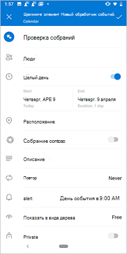
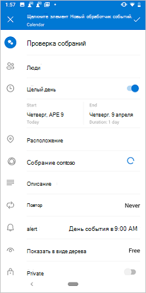
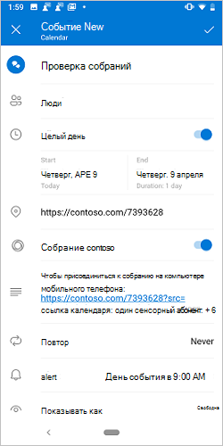
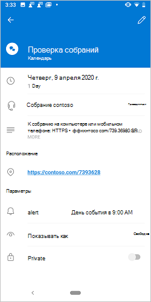
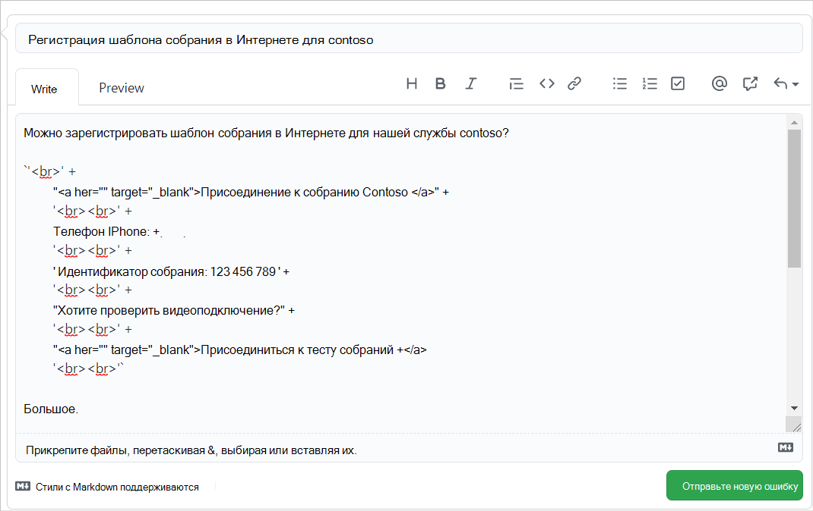

# <a name="create-an-outlook-mobile-add-in-for-an-online-meeting-provider"></a>Создание надстройки Outlook для поставщика онлайн-собраний

Настройка собрания в Интернете — это основной опыт для Outlook, и легко создать Teams с [Outlook мобильным](/microsoftteams/teams-add-in-for-outlook) телефоном. Однако создание онлайн-собрания в Outlook с помощью службы, не в microsoft, может быть громоздкой задачей. Реализуя эту функцию, поставщики услуг могут оптимизировать работу по созданию собраний в Интернете для Outlook пользователей надстройки.

> [!IMPORTANT]
> Эта функция поддерживается только на Android и iOS с Microsoft 365 подпиской.

В этой статье вы узнаете, как настроить Outlook надстройки, чтобы пользователи могли организовывать собрания и присоединяться к ним с помощью службы онлайн-собраний. В этой статье мы будем использовать вымышленного поставщика онлайн-собраний "Contoso".

## <a name="set-up-your-environment"></a>Настройка среды

Выполните [Outlook](../quickstarts/outlook-quickstart.md?tabs=yeomangenerator), который создает проект надстройки с генератором Yeoman для Office надстройки.

## <a name="configure-the-manifest"></a>Настройка манифеста

Чтобы пользователи могли создавать онлайн-собрания с помощью надстройки, необходимо настроить точку расширения [MobileOnlineMeetingCommandSurface](/javascript/api/manifest/extensionpoint#mobileonlinemeetingcommandsurface) в манифесте под родительским элементом `MobileFormFactor`. Другие форм-факторы не поддерживаются.

1. В редакторе кода откройте проект быстрого запуска.

1. Откройте файл **manifest.xml** , расположенный в корне проекта.

1. Выберите весь узел `<VersionOverrides>` (включая открытые и закрываемые теги) и замените его на следующий XML.

```xml
<VersionOverrides xmlns="http://schemas.microsoft.com/office/mailappversionoverrides" xsi:type="VersionOverridesV1_0">
  <VersionOverrides xmlns="http://schemas.microsoft.com/office/mailappversionoverrides/1.1" xsi:type="VersionOverridesV1_1">
    <Description resid="residDescription"></Description>
    <Requirements>
      <bt:Sets>
        <bt:Set Name="Mailbox" MinVersion="1.3"/>
      </bt:Sets>
    </Requirements>
    <Hosts>
      <Host xsi:type="MailHost">
        <DesktopFormFactor>
          <FunctionFile resid="residFunctionFile"/>
          <ExtensionPoint xsi:type="AppointmentOrganizerCommandSurface">
            <OfficeTab id="TabDefault">
              <Group id="apptComposeGroup">
                <Label resid="residDescription"/>
                <Control xsi:type="Button" id="insertMeetingButton">
                  <Label resid="residLabel"/>
                  <Supertip>
                    <Title resid="residLabel"/>
                    <Description resid="residTooltip"/>
                  </Supertip>
                  <Icon>
                    <bt:Image size="16" resid="icon-16"/>
                    <bt:Image size="32" resid="icon-32"/>
                    <bt:Image size="64" resid="icon-64"/>
                    <bt:Image size="80" resid="icon-80"/>
                  </Icon>
                  <Action xsi:type="ExecuteFunction">
                    <FunctionName>insertContosoMeeting</FunctionName>
                  </Action>
                </Control>
              </Group>
            </OfficeTab>
          </ExtensionPoint>
        </DesktopFormFactor>

        <MobileFormFactor>
          <FunctionFile resid="residFunctionFile"/>
          <ExtensionPoint xsi:type="MobileOnlineMeetingCommandSurface">
            <Control xsi:type="MobileButton" id="insertMeetingButton">
              <Label resid="residLabel"/>
              <Icon>
                <bt:Image size="25" scale="1" resid="icon-16"/>
                <bt:Image size="25" scale="2" resid="icon-16"/>
                <bt:Image size="25" scale="3" resid="icon-16"/>

                <bt:Image size="32" scale="1" resid="icon-32"/>
                <bt:Image size="32" scale="2" resid="icon-32"/>
                <bt:Image size="32" scale="3" resid="icon-32"/>

                <bt:Image size="48" scale="1" resid="icon-48"/>
                <bt:Image size="48" scale="2" resid="icon-48"/>
                <bt:Image size="48" scale="3" resid="icon-48"/>
              </Icon>
              <Action xsi:type="ExecuteFunction">
                <FunctionName>insertContosoMeeting</FunctionName>
              </Action>
            </Control>
          </ExtensionPoint>
        </MobileFormFactor>
      </Host>
    </Hosts>
    <Resources>
      <bt:Images>
        <bt:Image id="icon-16" DefaultValue="https://contoso.com/assets/icon-16.png"/>
        <bt:Image id="icon-32" DefaultValue="https://contoso.com/assets/icon-32.png"/>
        <bt:Image id="icon-48" DefaultValue="https://contoso.com/assets/icon-48.png"/>
        <bt:Image id="icon-64" DefaultValue="https://contoso.com/assets/icon-64.png"/>
        <bt:Image id="icon-80" DefaultValue="https://contoso.com/assets/icon-80.png"/>
      </bt:Images>
      <bt:Urls>
        <bt:Url id="residFunctionFile" DefaultValue="https://contoso.com/commands.html"/>
      </bt:Urls>
      <bt:ShortStrings>
        <bt:String id="residDescription" DefaultValue="Contoso meeting"/>
        <bt:String id="residLabel" DefaultValue="Add a contoso meeting"/>
      </bt:ShortStrings>
      <bt:LongStrings>
        <bt:String id="residTooltip" DefaultValue="Add a contoso meeting to this appointment."/>
      </bt:LongStrings>
    </Resources>
  </VersionOverrides>
</VersionOverrides>
```

> [!TIP]
> Дополнительные информацию о манифестах для Outlook надстройки см. в Outlook манифестах надстройки и добавлении поддержки команд надстройки [для Outlook Mobile](add-mobile-support.md).[](manifests.md)

## <a name="implement-adding-online-meeting-details"></a>Реализация добавления сведений о собраниях в Интернете

В этом разделе узнайте, как скрипт надстройки может обновлять собрание пользователя, чтобы включить сведения о собраниях в Интернете.

1. В том же проекте быстрого запуска откройте **файл ./src/commands/commands.js** в редакторе кода.

1. Замените все содержимое файла **commands.js** следующим JavaScript.

    ```js
    // 1. How to construct online meeting details.
    // Not shown: How to get the meeting organizer's ID and other details from your service.
    const newBody = '<br>' +
        '<a href="https://contoso.com/meeting?id=123456789" target="_blank">Join Contoso meeting</a>' +
        '<br><br>' +
        'Phone Dial-in: +1(123)456-7890' +
        '<br><br>' +
        'Meeting ID: 123 456 789' +
        '<br><br>' +
        'Want to test your video connection?' +
        '<br><br>' +
        '<a href="https://contoso.com/testmeeting" target="_blank">Join test meeting</a>' +
        '<br><br>';

    var mailboxItem;

    // Office is ready.
    Office.onReady(function () {
            mailboxItem = Office.context.mailbox.item;
        }
    );

    // 2. How to define a UI-less function named `insertContosoMeeting` (referenced in the manifest)
    //    to update the meeting body with the online meeting details.
    function insertContosoMeeting(event) {
        // Get HTML body from the client.
        mailboxItem.body.getAsync("html",
            { asyncContext: event },
            function (getBodyResult) {
                if (getBodyResult.status === Office.AsyncResultStatus.Succeeded) {
                    updateBody(getBodyResult.asyncContext, getBodyResult.value);
                } else {
                    console.error("Failed to get HTML body.");
                    getBodyResult.asyncContext.completed({ allowEvent: false });
                }
            }
        );
    }

    // 3. How to implement a supporting function `updateBody`
    //    that appends the online meeting details to the current body of the meeting.
    function updateBody(event, existingBody) {
        // Append new body to the existing body.
        mailboxItem.body.setAsync(existingBody + newBody,
            { asyncContext: event, coercionType: "html" },
            function (setBodyResult) {
                if (setBodyResult.status === Office.AsyncResultStatus.Succeeded) {
                    setBodyResult.asyncContext.completed({ allowEvent: true });
                } else {
                    console.error("Failed to set HTML body.");
                    setBodyResult.asyncContext.completed({ allowEvent: false });
                }
            }
        );
    }

    function getGlobal() {
      return typeof self !== "undefined"
        ? self
        : typeof window !== "undefined"
        ? window
        : typeof global !== "undefined"
        ? global
        : undefined;
    }

    const g = getGlobal();

    // The add-in command functions need to be available in global scope.
    g.insertContosoMeeting = insertContosoMeeting;
    ```

## <a name="testing-and-validation"></a>Тестирование и проверка

Следуйте обычным рекомендациям [по проверке и проверке надстройки](testing-and-tips.md). Перезагрузив Outlook в Интернете, Windows Mac, перезапустите Outlook на мобильном устройстве Android или iOS.[](sideload-outlook-add-ins-for-testing.md) Затем на новом экране собрания убедитесь, что Microsoft Teams или Skype будет заменена на собственную.

### <a name="create-meeting-ui"></a>Создание пользовательского интерфейса собрания

В качестве организатора собрания при создании собрания необходимо видеть экраны, похожие на следующие три изображения.

[](../images/outlook-android-create-online-meeting-off-expanded.png#lightbox) [](../images/outlook-android-create-online-meeting-load-expanded.png#lightbox) [](../images/outlook-android-create-online-meeting-on-expanded.png#lightbox)

### <a name="join-meeting-ui"></a>Регистрация пользовательского интерфейса собрания

В качестве участника собрания при просмотре собрания необходимо увидеть экран, аналогичный следующему изображению.

[](../images/outlook-android-join-online-meeting-view-1-expanded.png#lightbox)

> [!IMPORTANT]
> Если вы не видите ссылку **Join** , возможно, шаблон онлайн-собраний для вашей службы не зарегистрирован на наших серверах. Подробные [сведения см. в разделе Регистрация шаблона онлайн-собраний](#register-your-online-meeting-template) .

## <a name="register-your-online-meeting-template"></a>Регистрация шаблона собраний в Интернете

Если вы хотите зарегистрировать шаблон онлайн-собраний для службы, вы можете создать GitHub проблемы с деталями. После этого мы свяемся с вами, чтобы согласовать сроки регистрации.

1. Перейдите в **раздел Отзыв** в конце этой статьи.
1. Нажмите **ссылку На эту страницу** .
1. **Задайте заголовок** новой проблемы "Зарегистрируйте шаблон онлайн-собраний для моей службы", `my-service` заменив его именем службы.
1. В тексте проблемы замените строку "[Введите обратную связь здесь]" `newBody` строкой, заданной в или аналогичной переменной из раздела [Implement adding online meeting details](#implement-adding-online-meeting-details) earlier in this article.
1. Нажмите **кнопку Отправка новой проблемы**.



## <a name="available-apis"></a>Доступные API

Для этой функции доступны следующие API.

- API-API организатора встреч
  - [Office.context.mailbox.item.body](/javascript/api/outlook/office.appointmentcompose?view=outlook-js-preview&preserve-view=true#outlook-office-appointmentcompose-body-member) ([Body.getAsync](/javascript/api/outlook/office.body?view=outlook-js-preview&preserve-view=true#outlook-office-body-getasync-member(1)), [Body.setAsync](/javascript/api/outlook/office.body?view=outlook-js-preview&preserve-view=true#outlook-office-body-setasync-member(1)))
  - [Office.context.mailbox.item.end](/javascript/api/outlook/office.appointmentcompose?view=outlook-js-preview&preserve-view=true#outlook-office-appointmentcompose-end-member) ([Время](/javascript/api/outlook/office.time?view=outlook-js-preview&preserve-view=true))
  - [Office.context.mailbox.item.loadCustomPropertiesAsync](/javascript/api/outlook/office.appointmentcompose?view=outlook-js-preview&preserve-view=true#outlook-office-appointmentcompose-loadcustompropertiesasync-member(1)) ([CustomProperties](/javascript/api/outlook/office.customproperties?view=outlook-js-preview&preserve-view=true))
  - [Office.context.mailbox.item.location](/javascript/api/outlook/office.appointmentcompose?view=outlook-js-preview&preserve-view=true#outlook-office-appointmentcompose-location-member) ([Location](/javascript/api/outlook/office.location?view=outlook-js-preview&preserve-view=true))
  - [Office.context.mailbox.item.optionalAttendees](/javascript/api/outlook/office.appointmentcompose?view=outlook-js-preview&preserve-view=true#outlook-office-appointmentcompose-optionalattendees-member) ([Recipients](/javascript/api/outlook/office.recipients?view=outlook-js-preview&preserve-view=true))
  - [Office.context.mailbox.item.requiredAttendees](/javascript/api/outlook/office.appointmentcompose?view=outlook-js-preview&preserve-view=true#outlook-office-appointmentcompose-requiredattendees-member) ([Recipients](/javascript/api/outlook/office.recipients?view=outlook-js-preview&preserve-view=true))
  - [Office.context.mailbox.item.start](/javascript/api/outlook/office.appointmentcompose?view=outlook-js-preview&preserve-view=true#outlook-office-appointmentcompose-start-member) ([Время](/javascript/api/outlook/office.time?view=outlook-js-preview&preserve-view=true))
  - [Office.context.mailbox.item.subject](/javascript/api/outlook/office.appointmentcompose?view=outlook-js-preview&preserve-view=true#outlook-office-appointmentcompose-subject-member) ([Subject](/javascript/api/outlook/office.subject?view=outlook-js-preview&preserve-view=true))
  - [Office.context.roamingSettings](/javascript/api/requirement-sets/outlook/preview-requirement-set/office.context?view=outlook-js-preview&preserve-view=true#roamingsettings-roamingsettings) ([RoamingSettings](/javascript/api/outlook/office.roamingsettings?view=outlook-js-preview&preserve-view=true))
- Обработка потока auth
  - [API диалоговых окон](../develop/dialog-api-in-office-add-ins.md)

## <a name="restrictions"></a>Ограничения

Применяется несколько ограничений.

- Применимо только к поставщикам онлайн-собраний.
- Только надстройки, установленные администратором, появятся на экране композитной встречи, заменив по умолчанию Teams или Skype. Установленные пользователем надстройки не активируются.
- Значок надстройки должен быть в серой шкале с использованием кода hex или `#919191` эквивалента в [других цветовых форматах](https://convertingcolors.com/hex-color-919191.html).
- Только одна команда без пользовательского интерфейса поддерживается в режиме Организатор встречи (составить).
- Надстройка должна обновить сведения о собрании в форме встречи в течение одного минутного периода рас растор между встречами. Однако любое время, проведенное в диалоговом окне, надстройка, открытая для проверки подлинности и т. д., исключается из периода ожидания.

## <a name="see-also"></a>См. также

- [Надстройки для Outlook Mobile](outlook-mobile-addins.md)
- [Добавление поддержки команд надстройки для Outlook Mobile](add-mobile-support.md)
