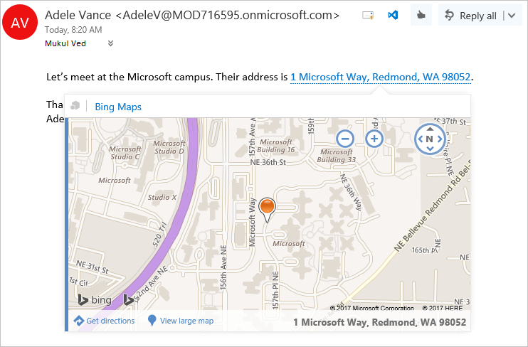

# Обзор надстроек Outlook

Надстройки Outlook — это встраиваемые в Outlook решения от сторонних разработчиков, использующие нашу веб-платформу. Три ключевых аспекта надстроек Outlook:

- В классических приложениях (Outlook для Windows и Mac), веб-приложениях (Microsoft 365 и Outlook.com) и мобильных решениях используются одинаковые логика надстроек и бизнес-логика.
- Надстройка Outlook состоит из манифеста, в котором описан способ интеграции надстройки с Outlook (например, при помощи кнопки или области задач), и кода JavaScript или HTML, который составляет пользовательский интерфейс и бизнес-логику надстройки.
- Пользователи и администраторы могут получать надстройки Outlook из [AppSource](https://appsource.microsoft.com) или [загружать их в неопубликованном виде](sideload-outlook-add-ins-for-testing.md).

Надстройки Outlook отличаются от надстроек COM или VSTO, которые являются более ранними интеграциями, относящимися к Outlook под управлением Windows. В отличие от надстроек COM надстройки Outlook не имеют какого-либо кода, физически установленного на устройстве пользователя или в клиентах Outlook. В случае надстройки Outlook программа Outlook считывает манифест и подключает указанные элементы управления в пользовательском интерфейсе, а затем загружает JavaScript и HTML. Все веб-компоненты выполняется в "песочнице" в контексте браузера.

К элементам Outlook, поддерживающим надстройки, относятся письма, приглашения на собрание, ответы и данные об отменах, а также сведения о встречах. Каждая надстройка Outlook определяет контекст, в котором она доступна, в том числе типы элементов и то, просматривает пользователь элемент или создает его.

[!INCLUDE [publish policies note](../includes/note-publish-policies.md)]

## Точки расширения

Extension points are the ways that add-ins integrate with Outlook. The following are the ways this can be done:

- Add-ins can declare buttons that appear in command surfaces across messages and appointments. For more information, see [Add-in commands for Outlook](add-in-commands-for-outlook.md).

    **Надстройка с кнопками на ленте**

    

- Add-ins can link off regular expression matches or detected entities in messages and appointments. For more information, see [Contextual Outlook add-ins](contextual-outlook-add-ins.md).

    **Контекстная надстройка для выделенной сущности (адреса)**

    

> [!NOTE]
> Поскольку [настраиваемые области устарели](https://developer.microsoft.com/outlook/blogs/make-your-add-ins-available-in-the-office-ribbon/), следует убедиться, что вы используете поддерживаемую точку расширения.

## Элементы почтовых ящиков, доступные надстройкам

Outlook add-ins are available on messages or appointments while composing or reading, but not other item types. Outlook does not activate add-ins if the current message item, in a compose or read form, is one of the following:

- Protected by Information Rights Management (IRM) or encrypted in other ways for protection. A digitally signed message is an example since digital signing relies on one of these mechanisms.

- Отчет или уведомление о доставке имеет класс сообщения IPM.Report.*, включая отчеты о доставке, о недоставке, а также уведомления о прочтении, о непрочтении и о задержке.

- Элемент является черновиком (не имеет назначенного отправителя) или находится в папке черновиков Outlook.

- MSG- или EML-файл, представляющий собой вложение в другое сообщение.

- MSG- или EML-файл, открытый из файловой системы.

- В общем почтовом ящике, почтовом ящике другого пользователя, архивном почтовом ящике или общедоступной папке.

- Использование настраиваемой формы.

В общем случае Outlook может активировать надстройки в формах просмотра для элементов в папке "Отправленные", за исключением надстроек, активируемых на основании совпадений строк для известных сущностей. Дополнительные сведения о причинах этого см. "Поддержка известных сущностей" в статье [Сопоставление строк в элементе Outlook как известных сущностей](match-strings-in-an-item-as-well-known-entities.md).

## Поддерживаемые ведущие приложения

Надстройки Outlook поддерживают Outlook 2013 или более поздней версии для Windows, Outlook 2016 или более поздней версии для Mac, Outlook в Интернете для локальной версии Exchange 2013 и более поздних версий, Outlook для iOS, Outlook для Android, Outlook в Интернете и Outlook.com. Не все новые функции поддерживаются сразу всеми [клиентами](../reference/requirement-sets/outlook-api-requirement-sets.md#requirement-sets-supported-by-exchange-servers-and-outlook-clients). Просмотрите статьи и справочные материалы по API для этих функций, чтобы узнать, в каких ведущих приложениях они поддерживаются.

## Знакомство с разработкой надстроек Outlook

Чтобы приступить к разработке надстроек Outlook, попробуйте приведенные ниже ресурсы.

- [Краткое руководство](../quickstarts/outlook-quickstart.md) — создание простой надстройки области задач.
- [Учебник](../tutorials/outlook-tutorial.md) — узнайте, как создать надстройку, которая вставляет элементы gist с сайта GitHub в новое сообщение.

## См. также

- [Рекомендации по разработке надстроек Office](../concepts/add-in-development-best-practices.md)
- [Рекомендации по проектированию надстроек Office](../design/add-in-design.md)
- [Лицензирование надстроек Office и SharePoint](/office/dev/store/license-your-add-ins)
- [Публикация надстройки Office](../publish/publish.md)
- [Публикация решений в AppSource и в Office](/office/dev/store/submit-to-the-office-store)
