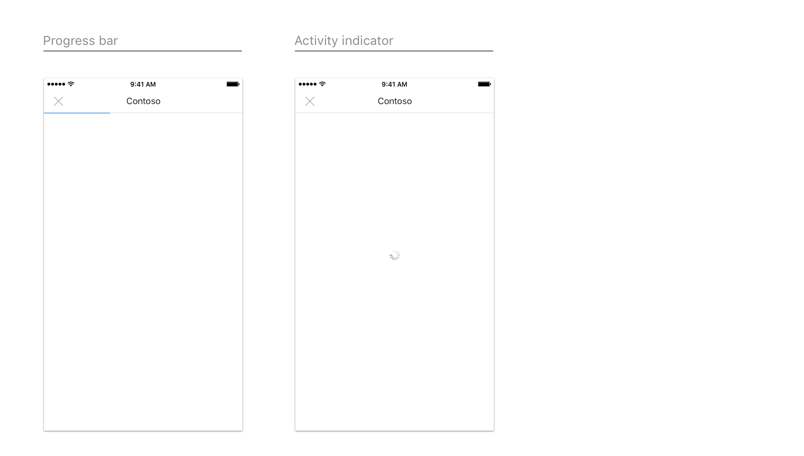
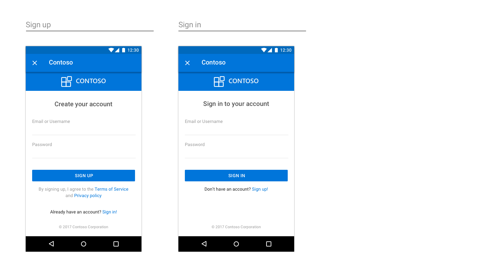
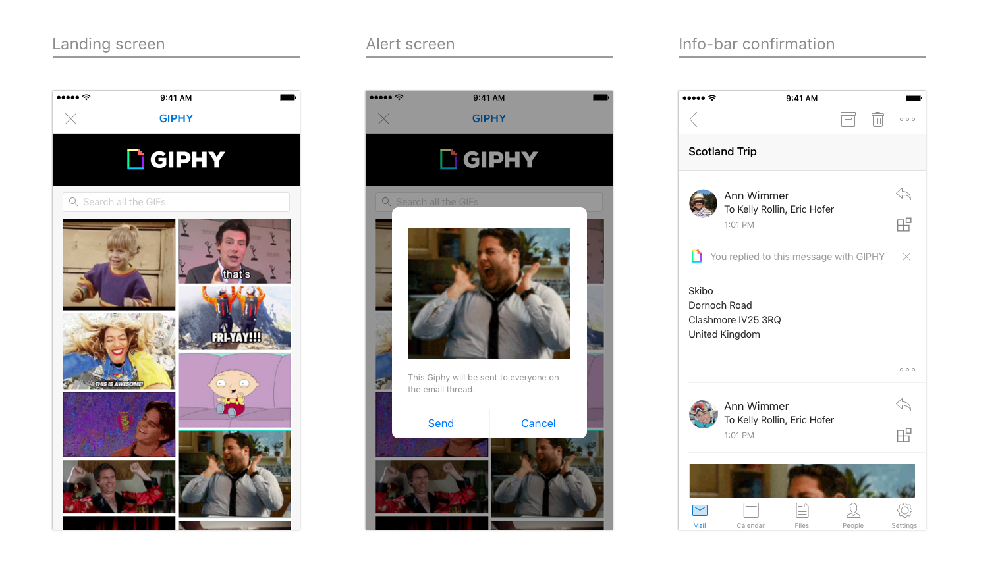
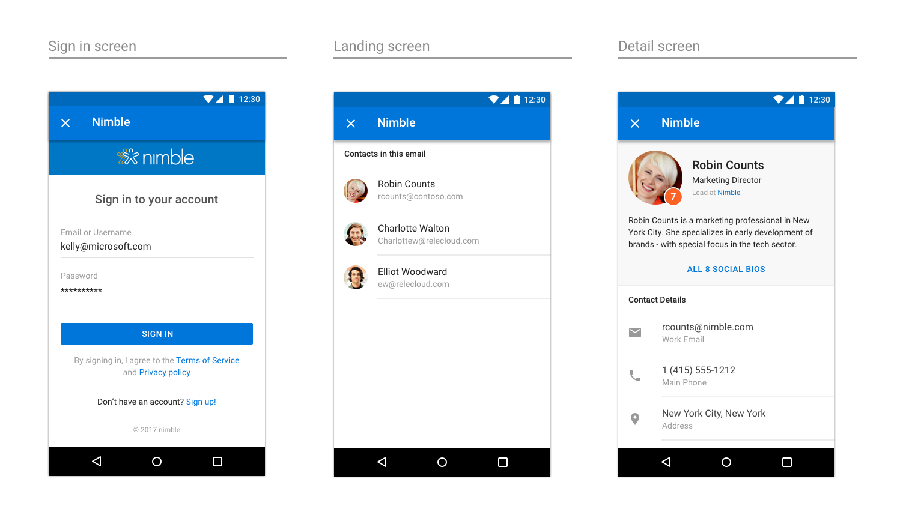
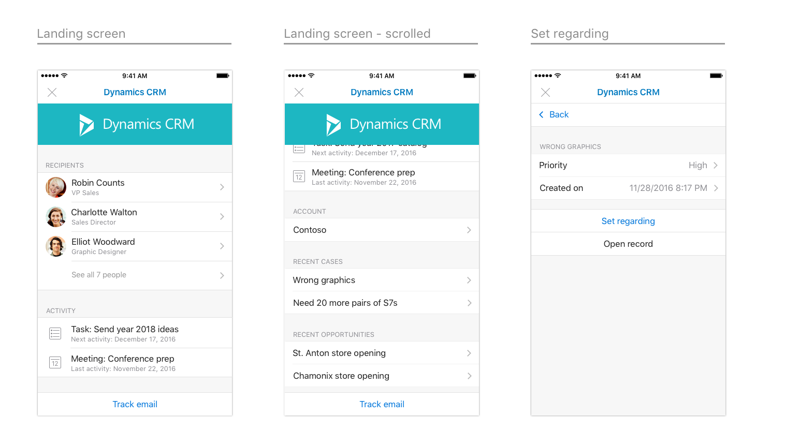

# Рекомендации по разработке надстроек Outlook

Надстройки — отличный способ дополнения базового набора функций Outlook. С помощью надстроек пользователи могут получать доступ к интерфейсам, задачам и содержимому от сторонних разработчиков, не покидая папку "Входящие". После установки надстройки Outlook становятся доступны на всех платформах и устройствах.  

Представленные ниже общие рекомендации помогут вам спроектировать и создать привлекательную надстройку, переносящую лучшие аспекты вашего приложения непосредственно в Outlook&mdash;в Windows, Интернете, iOS, Mac и Android.

## Принципы

1. **Сосредоточьтесь на нескольких ключевых задачах, выполняйте их хорошо**

   Лучшие надстройки просты в использовании, спроектированы с учетом определенных целей и имеют ценность для пользователей. Так как надстройка будет работать в Outlook, этому принципу следует уделить особое внимание. Outlook&mdash;приложение для эффективной работы. Открывая его, пользователи хотят добиться результатов.

   Ваша надстройка будет расширением нашего интерфейса, поэтому важно убедиться, что предоставляемые ею возможности органично вписываются в Outlook. Задумайтесь, какие из распространенных вариантов использования будет полезнее всего связать с интерфейсами электронной почты и календарей.

   Не обязательно включать в надстройку все возможности вашего приложения. Следует сосредоточиться на наиболее часто используемых и уместных действиях в контексте содержимого Outlook. Продумайте призыв к действию и убедитесь, что пользователь четко понимает, что ему делать, когда откроется область задач.

2. **Согласуйте надстройку с платформой**

   В надстройке должны использоваться шаблоны, характерные для той платформы, на которой работает Outlook. Для этого следует соблюдать рекомендации по взаимодействию и внешнему виду для каждой платформы. Для приложения Outlook также есть свои рекомендации, которые важно учитывать. Хорошо спроектированная надстройка органично вписывается в интерфейс, платформу и Outlook.

   Это означает, что ваша надстройка будет визуально отличаться при запуске в Outlook для iOS и в Outlook для Android. Рекомендуем ознакомиться с [Framework7](https://framework7.io/) как с одним из решений для оформления надстройки.

3. **Сделайте работу приятной и проявите внимание к мелочам**

   Людям нравится пользоваться функциональными и красивыми продуктами. Вы можете гарантировать успех своей надстройке, уделив пристальное внимание каждому аспекту работы и визуального оформления. Действия, необходимые для выполнения задачи, должны быть понятными и логичными. В идеале каждое действие должно вызываться не более чем за два щелчка. 
   
   Старайтесь, чтобы пользователь не покидал контекст для выполнения действия. Пользователю должно быть легко заходить в надстройку и покидать ее, чтобы продолжить работу. Надстройка не предназначена для того, чтобы проводить в ней много времени,&mdash;это лишь расширение базовых функций. Правильно разработанная надстройка поможет повысить эффективность работы пользователей.

4. **Будьте осторожны с фирменной символикой**

   Мы ценим хороший фирменный стиль и понимаем, что важно обеспечить для пользователей уникальный процесс работы. Но мы считаем, что лучший способ гарантировать успех своей надстройки — создать интуитивно понятный интерфейс, включающий ненавязчивые элементы фирменного стиля, а не нагружать его бросающейся в глаза фирменной символикой, которая только отвлекает пользователя и мешает навигации по системе. 
    
   Чтобы удачно внедрить свой фирменный стиль, можно использовать фирменные цвета, значки и голос&mdash;при условии, что они не противоречат предпочитаемым шаблонам для платформы и требованиям к специальным возможностям. Стремитесь, чтобы основное внимание уделялось содержимому и выполнению задач, а не символике. 
    
   > [!NOTE]
   >  Объявления нельзя показывать в надстройках на iOS или Android.

## Шаблоны проектирования

> [!NOTE]
> Вышеперечисленные принципы применимы ко всем конечным точкам и платформам, но представленные ниже шаблоны и примеры относятся к мобильным надстройкам на платформе iOS.

Создать профессиональную надстройку вам помогут [шаблоны](../design/ux-design-pattern-templates.md), содержащие элементы мобильных приложений для iOS, которые работают в среде Outlook Mobile. Используя эти шаблоны, вы гарантируете, что надстройка органично впишется как в платформу iOS, так и в Outlook Mobile. Ниже представлены подробные описания этих шаблонов. Хотя этот список не является исчерпывающим, он положит начало библиотеке, которую мы продолжим развивать по мере обнаружения новых парадигм, которые партнеры пожелают добавлять в свои надстройки.  

### Обзор

Типичная надстройка состоит из следующих компонентов:

### Загрузка

Когда пользователь выбирает надстройку, ее пользовательский интерфейс должен отображаться как можно скорее. При наличии задержки используйте индикатор выполнения или индикатор работы. Индикатор выполнения следует использовать, если время загрузки можно определить, а индикатор работы — если оно непредсказуемо.

**Пример загрузки страниц на iOS**

**Пример загрузки страниц на Android**

### Вход и регистрация

Сделайте вход и регистрацию понятными и простыми.

**Пример страницы входа и регистрации на iOS**

**Пример страницы входа на Android**

### Панель с фирменной символикой

На первом экране надстройки должен отображаться элемент фирменной символики. Панель с фирменной символикой не только делает надстройку узнаваемой, но и создает контекст для пользователя. Так как панель навигации содержит название компании или торговой марки, их необязательно повторять на последующих страницах.

**Пример фирменной символики на iOS**

**Пример фирменной символики на Android**

### Поля

Размер полей на мобильных устройствах должен составлять 15 пикселей (8 % экрана) с каждой стороны на iOS и 16 пикселей с каждой стороны на Android.

### Шрифтовое оформление

Оформление согласуется с оформлением Outlook на iOS и оптимизировано для беглого просмотра.

**Шрифтовое оформление на iOS**

**Шрифтовое оформление на Android**

### Цветовая палитра

В Outlook iOS используется ненавязчивая цветовая схема.  Для согласованности рекомендуем использовать цвета только для действий и ошибок, а уникальные цвета использовать только на панели с фирменной символикой.

### Ячейки

Так как помечать страницы с помощью панели навигации невозможно, для этого следует использовать заголовки разделов.

**Примеры ячеек на iOS**

* * *

* * *

* * *

**Примеры ячеек на Android**

* * *

* * *

* * *

### Действия

Даже если ваше приложение выполняет множество задач, выберите самые важные действия для надстройки и сосредоточьтесь на них.

**Примеры действий на iOS**

* * *

**Примеры действий на Android**

* * *

### Кнопки

Кнопки используются в тех случаях, когда под ними есть другие элементы пользовательского интерфейса (в отличие от действий, которые должны быть последним элементом на экране).

**Примеры кнопок на iOS**

**Примеры кнопок на Android**

### Вкладки

Вкладки помогают упорядочивать содержимое.

**Примеры вкладок на iOS**

**Примеры вкладок на Android**

### Значки

По мере возможности значки должны соответствовать текущему оформлению Outlook для iOS. Используйте стандартные размер и цвет.

**Примеры значков на iOS**

**Примеры значков на Android**

## Полные примеры

Для выпуска первой версии надстроек Outlook Mobile мы тесно сотрудничали с нашими партнерами, занимающимися разработкой надстроек. Чтобы продемонстрировать потенциал надстроек для Outlook Mobile, наш дизайнер создал полноценные интерфейсы для каждой надстройки, используя наши рекомендации и шаблоны.

> [!IMPORTANT]
> Эти примеры призваны показать идеальный подход к интерфейсу и визуальному оформлению надстройки и могут не полностью соответствовать функциям опубликованных версий надстроек. 

### GIPHY

**Пример GIPHY на iOS**

**Пример GIPHY на Android**

### Nimble

**Пример Nimble на iOS**

**Пример Nimble на Android**

### Trello

**Пример Trello на iOS**

* * *

* * *

**Пример Trello на Android**

* * *

### Dynamics CRM

**Пример Dynamics CRM на iOS**

**Пример Dynamics CRM на Android**

