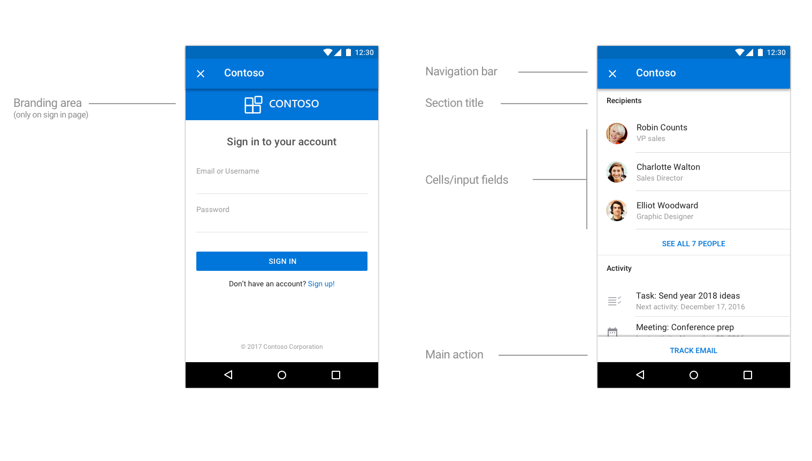
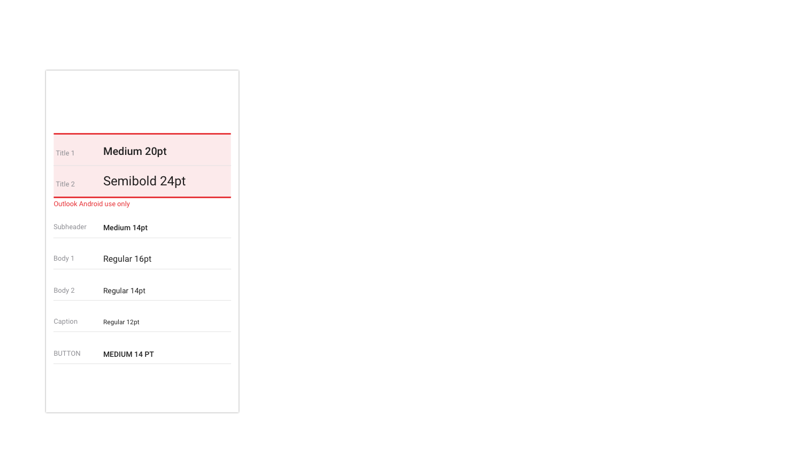
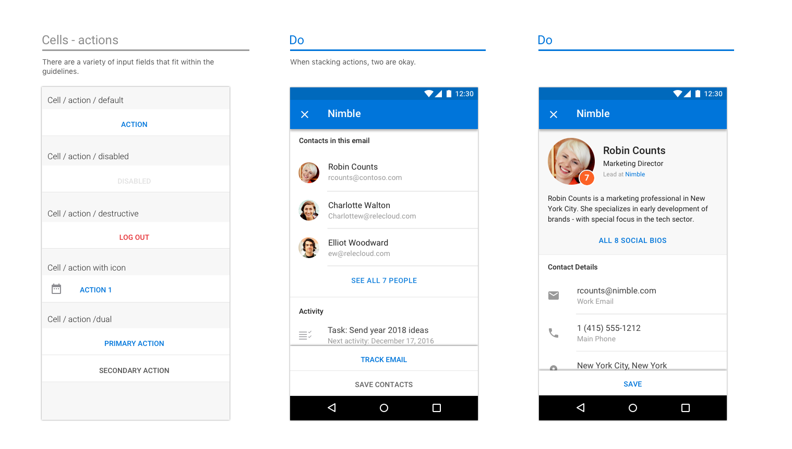
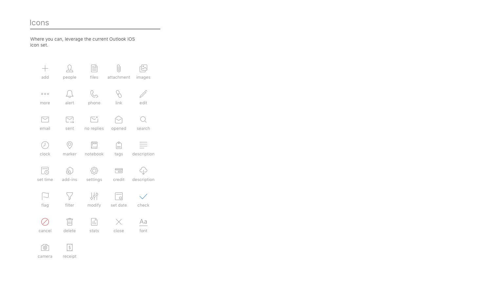

# Рекомендации по разработке надстроек OutlookOutlook add-in design guidelines

Надстройки — отличный способ дополнения базового набора функций Outlook. С помощью надстроек пользователи могут получать доступ к интерфейсам, задачам и содержимому от сторонних разработчиков, не покидая папку "Входящие". После установки надстройки Outlook становятся доступны на всех платформах и устройствах.Add-ins are a great way for partners to extend the functionality of Outlook beyond our core feature set. Add-ins enable users to access third-party experiences, tasks, and content without needing to leave their inbox. Once installed, Outlook add-ins are available on every platform and device.  

Представленные ниже общие рекомендации помогут вам спроектировать и создать привлекательную надстройку, переносящую лучшие аспекты вашего приложения непосредственно в Outlook&mdash;в Windows, Интернете, iOS, Mac и Android.The following high-level guidelines will help you design and build a compelling add-in, which brings the best of your app right into Outlook&mdash;on Windows, Web, iOS, Mac, and Android.

## ПринципыPrinciples

1. **Сосредоточьтесь на нескольких ключевых задачах, выполняйте их хорошо****Focus on a few key tasks; do them well**

   Лучшие надстройки просты в использовании, спроектированы с учетом определенных целей и имеют ценность для пользователей. Так как надстройка будет работать в Outlook, этому принципу следует уделить особое внимание. Outlook&mdash;приложение для эффективной работы. Открывая его, пользователи хотят добиться результатов.The best designed add-ins are simple to use, focused, and provide real value to users. Because your add-in will run inside of Outlook, there is additional emphasis placed on this principle. Outlook is a productivity app&mdash;it's where people go to get things done.

   Ваша надстройка будет расширением нашего интерфейса, поэтому важно убедиться, что предоставляемые ею возможности органично вписываются в Outlook. Задумайтесь, какие из распространенных вариантов использования будет полезнее всего связать с интерфейсами электронной почты и календарей.You will be an extension of our experience and it is important to make sure the scenarios you enable feel like a natural fit inside of Outlook. Think carefully about which of your common use cases will benefit the most from having hooks to them from within our email and calendaring experiences.

   Не обязательно включать в надстройку все возможности вашего приложения. Следует сосредоточиться на наиболее часто используемых и уместных действиях в контексте содержимого Outlook. Продумайте призыв к действию и убедитесь, что пользователь четко понимает, что ему делать, когда откроется область задач.An add-in should not attempt to do everything your app does. The focus should be on the most frequently used, and appropriate, actions in the context of Outlook content. Think about your call to action and make it clear what the user should do when your task pane opens.

2. **Согласуйте надстройку с платформой****Make it feel as native as possible**

   В надстройке должны использоваться шаблоны, характерные для той платформы, на которой работает Outlook. Для этого следует соблюдать рекомендации по взаимодействию и внешнему виду для каждой платформы. Для приложения Outlook также есть свои рекомендации, которые важно учитывать. Хорошо спроектированная надстройка органично вписывается в интерфейс, платформу и Outlook.Your add-in should be designed using patterns native to the platform that Outlook is running on. To achieve this, be sure to respect and implement the interaction and visual guidelines set forth by each platform. Outlook has its own guidelines and those are also important to consider. A well-designed add-in will be an appropriate blend of your experience, the platform, and Outlook.

   Это означает, что ваша надстройка будет визуально отличаться при запуске в Outlook для iOS и в Outlook для Android. Рекомендуем ознакомиться с [Framework7](https://framework7.io/) как с одним из решений для оформления надстройки.This does mean that your add-in will have to visually be different when it runs in Outlook on iOS versus Android. We recommend taking a look at [Framework7](https://framework7.io/) as one option to help you with styling.

3. **Сделайте работу приятной и проявите внимание к мелочам****Make it enjoyable to use and get the details right**

   Людям нравится пользоваться функциональными и красивыми продуктами. Вы можете гарантировать успех своей надстройке, уделив пристальное внимание каждому аспекту работы и визуального оформления. Действия, необходимые для выполнения задачи, должны быть понятными и логичными. В идеале каждое действие должно вызываться не более чем за два щелчка.People enjoy using products that are both functionally and visually appealing. You can help ensure the success of your add-in by crafting an experience where you've carefully considered every interaction and visual detail. The necessary steps to complete a task must be clear and relevant. Ideally, no action should be further than a click or two away. 
   
   Старайтесь, чтобы пользователь не покидал контекст для выполнения действия.Try not to take a user out of context to complete an action. Пользователю должно быть легко заходить в надстройку и покидать ее, чтобы продолжить работу.A user should easily be able to get in and out of your add-in and back to whatever she was doing before. Надстройка не предназначена для того, чтобы проводить в ней много времени,&mdash;это лишь расширение базовых функций.An add-in is not meant to be a destination to spend a lot of time in&mdash;it is an enhancement to our core functionality. Правильно разработанная надстройка поможет повысить эффективность работы пользователей.If done properly, your add-in will help us deliver on the goal of making people more productive.

4. **Будьте осторожны с фирменной символикой****Brand wisely**

   Мы ценим хороший фирменный стиль и понимаем, что важно обеспечить для пользователей уникальный процесс работы.We value great branding, and we know it is important to provide users with your unique experience. Но мы считаем, что лучший способ гарантировать успех своей надстройки — создать интуитивно понятный интерфейс, включающий ненавязчивые элементы фирменного стиля, а не нагружать его бросающейся в глаза фирменной символикой, которая только отвлекает пользователя и мешает навигации по системе.But we feel the best way to ensure your add-in's success is to build an intuitive experience that subtly incorporates elements of your brand versus displaying persistent or obtrusive brand elements that only distract a user from moving through your system in an unencumbered manner. 
    
   Чтобы удачно внедрить свой фирменный стиль, можно использовать фирменные цвета, значки и голос&mdash;при условии, что они не противоречат предпочитаемым шаблонам для платформы и требованиям к специальным возможностям.A good way to incorporate your brand in a meaningful way is through the use of your brand colors, icons, and voice&mdash;assuming these don't conflict with the preferred platform patterns or accessibility requirements. Стремитесь, чтобы основное внимание уделялось содержимому и выполнению задач, а не символике.Strive to keep the focus on content and task completion, not brand attention. 
    
   > [!NOTE]
   >  Объявления нельзя показывать в надстройках на iOS или Android.Ads should not be shown within add-ins on iOS or Android.

## Шаблоны проектированияDesign patterns

> [!NOTE]
> Вышеперечисленные принципы применимы ко всем конечным точкам и платформам, но представленные ниже шаблоны и примеры относятся к мобильным надстройкам на платформе iOS.While the above principles apply to all endpoints/platforms, the following patterns and examples are specific to mobile add-ins on the iOS platform.

Создать профессиональную надстройку вам помогут [шаблоны](../design/ux-design-pattern-templates.md), содержащие элементы мобильных приложений для iOS, которые работают в среде Outlook Mobile. Используя эти шаблоны, вы гарантируете, что надстройка органично впишется как в платформу iOS, так и в Outlook Mobile. Ниже представлены подробные описания этих шаблонов. Хотя этот список не является исчерпывающим, он положит начало библиотеке, которую мы продолжим развивать по мере обнаружения новых парадигм, которые партнеры пожелают добавлять в свои надстройки.To help you create a well-designed add-in, we have [templates](../design/ux-design-pattern-templates.md) that contain iOS mobile patterns that work within the Outlook Mobile environment. Leveraging these specific patterns will help ensure your add-in feels native to both the iOS platform and Outlook Mobile. These patterns are also detailed below. While not exhaustive, this is the start of a library that we will continue to build upon as we uncover additional paradigms partners wish to include in their add-ins.  

### ОбзорOverview

Типичная надстройка состоит из следующих компонентов:A typical add-in is made up of the following components.

### ЗагрузкаLoading

Когда пользователь выбирает надстройку, ее пользовательский интерфейс должен отображаться как можно скорее. При наличии задержки используйте индикатор выполнения или индикатор работы. Индикатор выполнения следует использовать, если время загрузки можно определить, а индикатор работы — если оно непредсказуемо.When a user taps on your add-in, the UX should display as quickly as possible. If there is any delay, use a progress bar or activity indicator. A progress bar should be used when the amount of time is determinable and an activity indicator should be used when the amount of time is indeterminable.

**Пример загрузки страниц на iOS****An example of loading pages on iOS**

**Пример загрузки страниц на Android****An example of loading pages on Android**

### Вход и регистрацияSign in/Sign up

Сделайте вход и регистрацию понятными и простыми.Make your sign in (and sign up) flow straightforward and simple to use.

**Пример страницы входа и регистрации на iOS****An example sign in and sign up page on iOS**

**Пример страницы входа на Android****An example sign in page on Android**

### Панель с фирменной символикойBrand bar

На первом экране надстройки должен отображаться элемент фирменной символики. Панель с фирменной символикой не только делает надстройку узнаваемой, но и создает контекст для пользователя. Так как панель навигации содержит название компании или торговой марки, их необязательно повторять на последующих страницах.The first screen of your add-in should include your branding element. Designed for recognition, the brand bar also helps set context for the user. Because the navigation bar contains the name of your company/brand, it's unnecessary to repeat the brand bar on subsequent pages.

**Пример фирменной символики на iOS****An example of branding on iOS**

**Пример фирменной символики на Android****An example of branding on Android**

### ПоляMargins

Размер полей на мобильных устройствах должен составлять 15 пикселей (8 % экрана) с каждой стороны на iOS и 16 пикселей с каждой стороны на Android.Mobile margins should be set to 15px (8% of screen) for each side, to align with Outlook iOS and 16px for each side to align with Outlook Android.

### Шрифтовое оформлениеTypography

Оформление согласуется с оформлением Outlook на iOS и оптимизировано для беглого просмотра.Typography usage is aligned to Outlook iOS and is kept simple for scannability.

**Шрифтовое оформление на iOS****Typography on iOS**

**Шрифтовое оформление на Android****Typography on Android**

### Цветовая палитраColor palette

В Outlook iOS используется ненавязчивая цветовая схема.  Для согласованности рекомендуем использовать цвета только для действий и ошибок, а уникальные цвета использовать только на панели с фирменной символикой.Color usage is subtle in Outlook iOS.  To align, we ask that usage of color is localized to actions and error states, with only the brand bar using a unique color.

### ЯчейкиCells

Так как помечать страницы с помощью панели навигации невозможно, для этого следует использовать заголовки разделов.Since the navigation bar cannot be used to label a page, use section titles to label pages.

**Примеры ячеек на iOS****Examples of cells on iOS**

* * *

* * *

* * *

**Примеры ячеек на Android****Examples of cells on Android**

* * *

* * *

* * *

### ДействияActions

Даже если ваше приложение выполняет множество задач, выберите самые важные действия для надстройки и сосредоточьтесь на них.Even if your app handles a multitude of actions, think about the most important ones you want your add-in to perform, and concentrate on those.

**Примеры действий на iOS****Examples of actions on iOS**

* * *

**Примеры действий на Android****Examples of actions on Android**

* * *

### КнопкиButtons

Кнопки используются в тех случаях, когда под ними есть другие элементы пользовательского интерфейса (в отличие от действий, которые должны быть последним элементом на экране).Buttons are used when there are other UX elements below (vs. actions, where the action is the last element on the screen).

**Примеры кнопок на iOS****Examples of buttons on iOS**

**Примеры кнопок на Android****Examples of buttons on Android**

### ВкладкиTabs

Вкладки помогают упорядочивать содержимое.Tabs can aid in content organization.

**Примеры вкладок на iOS****Examples of tabs on iOS**

**Примеры вкладок на Android****Examples of tabs on Android**

### ЗначкиIcons

По мере возможности значки должны соответствовать текущему оформлению Outlook для iOS. Используйте стандартные размер и цвет.Icons should follow the current Outlook iOS design when possible. Use our standard size and color.

**Примеры значков на iOS****Examples of icons on iOS**

**Примеры значков на Android****Examples of icons on Android**

## Полные примерыEnd-to-end examples

Для выпуска первой версии надстроек Outlook Mobile мы тесно сотрудничали с нашими партнерами, занимающимися разработкой надстроек. Чтобы продемонстрировать потенциал надстроек для Outlook Mobile, наш дизайнер создал полноценные интерфейсы для каждой надстройки, используя наши рекомендации и шаблоны.For our v1 Outlook Mobile Add-ins launch, we worked closely with our partners who were building add-ins. As a way to showcase the potential of their add-ins on Outlook Mobile, our designer put together end-to-end flows for each add-in, leveraging our guidelines and patterns.

> [!IMPORTANT]
> Эти примеры призваны показать идеальный подход к интерфейсу и визуальному оформлению надстройки и могут не полностью соответствовать функциям опубликованных версий надстроек.These examples are meant to highlight the ideal way to approach both the interaction and visual design of an add-in and may not match the exact feature sets in the shipped versions of the add-ins. 

### GIPHYGIPHY

**Пример GIPHY на iOS****An example of GIPHY on iOS**

**Пример GIPHY на Android****An example of GIPHY on Android**

### NimbleNimble

**Пример Nimble на iOS****An example of Nimble on iOS**

**Пример Nimble на Android****An example of Nimble on Android**

### TrelloTrello

**Пример Trello на iOS****An example of Trello on iOS**

* * *

* * *

**Пример Trello на Android****An example of Trello on Android**

* * *

### Dynamics CRMDynamics CRM

**Пример Dynamics CRM на iOS****An example of Dynamics CRM on iOS**

**Пример Dynamics CRM на Android****An example of Dynamics CRM on Android**

