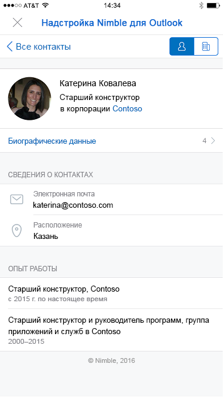

# Надстройки для Outlook Mobile

Add-ins now work on Outlook Mobile, using the same APIs available for other Outlook endpoints. If you've built an add-in for Outlook already, it's easy to get it working on Outlook Mobile.

Надстройки Outlook Mobile поддерживаются во всех Microsoft 365 бизнес-учетных записях, учетных записях Outlook.com и поддержке скоро появятся учетные записи Gmail.

**Пример области задач в Outlook для iOS**

 

**Пример области задач в Outlook для Android**

> [!IMPORTANT]
> Надстройки не работают в современной версии Outlook в браузере мобильного устройства. Дополнительные сведения см. [в статье Outlook в браузере мобильного устройства](https://techcommunity.microsoft.com/t5/outlook-blog/outlook-on-your-mobile-browser-is-being-upgraded/ba-p/1125816).

## Чем отличаются надстройки для мобильных устройств?

- The small size and quick interactions make designing for mobile a challenge. To ensure quality experiences for our customers, we are setting strict validation criteria that must be met by an add-in declaring mobile support, in order to be approved in AppSource.
    - В надстройке **ДОЛЖНЫ** соблюдаться [рекомендации по пользовательскому интерфейсу](outlook-addin-design.md).
    - Сценарий для использования надстройки **ДОЛЖЕН** [быть уместным на мобильных устройствах](#what-makes-a-good-scenario-for-mobile-add-ins).

- Как правило, в настоящее время поддерживается только режим чтения сообщений. Это означает `MobileMessageReadCommandSurface` единственный [ExtensionPoint](../reference/manifest/extensionpoint.md#mobilemessagereadcommandsurface) , который следует объявить в разделе мобильного устройства манифеста. Однако режим организатора встречи поддерживается для встроенных надстроек поставщика собраний по сети, которые вместо этого объявляют [точку расширения мобилеонлинемитингкоммандсурфаце](../reference/manifest/extensionpoint.md#mobileonlinemeetingcommandsurface-preview). Для получения дополнительных сведений об этом сценарии обратитесь к статье [Создание надстройки Outlook для мобильных устройств](online-meeting.md) .

- The [makeEwsRequestAsync](../reference/objectmodel/preview-requirement-set/office.context.mailbox.md#methods) API is not supported on mobile since the mobile app uses REST APIs to communicate with the server. If your app backend needs to connect to the Exchange server, you can use the callback token to make REST API calls. For details, see [Use the Outlook REST APIs from an Outlook add-in](use-rest-api.md).

- Отправляя надстройку в магазин с элементом [MobileFormFactor](../reference/manifest/mobileformfactor.md) в манифесте, необходимо принять условия приложения для разработчиков надстроек на iOS, а также указать свой идентификатор разработчика Apple для проверки.

- Кроме того, в манифесте необходимо объявить элемент `MobileFormFactor`, а также указать правильные [элементы управления](../reference/manifest/control.md) и [размеры значков](../reference/manifest/icon.md).

## Для каких сценариев хорошо подходят мобильные надстройки?

Remember that the average Outlook session length on a phone is much shorter than on a PC. That means your add-in must be fast, and the scenario must allow the user to get in, get out, and get on with their email workflow.

Ниже приведены примеры сценариев, для которых подходит Outlook Mobile.

- The add-in brings valuable information into Outlook, helping users triage their email and respond appropriately. Example: a CRM add-in that lets the user see customer information and share appropriate information.

- The add-in adds value to the user's email content by saving the information to a tracking, collaboration, or similar system. Example: an add-in that lets users turn emails into task items for project tracking, or help tickets for a support team.

**Пример действий пользователя для создания карточки Trello из электронного сообщения на iOS**

 

**Пример действий пользователя для создания карточки Trello из электронного сообщения на Android**

## Тестирование надстроек на мобильных устройствах

To test an add-in on Outlook Mobile, you can sideload an add-in to an O365 or Outlook.com account. In Outlook on the web, go to the settings gear, and choose **Manage Integrations** or **Manage Add-ins**. Near the top, click where it says **Click here to add a custom add-in** and upload your manifest. Make sure your manifest is properly formatted to contain `MobileFormFactor` or it won't load.

After your add-in is working, make sure to test it on different screen sizes, including phones and tablets. You should make sure it meets accessibility guidelines for contrast, font size, and color, as well as being usable with a screen reader such as VoiceOver on iOS or TalkBack on Android.

Устранение неполадок на мобильных устройствах может быть очень сложно, так как у вас могут отсутствовать средства, которые вы используете. Тем не менее, одним из вариантов устранения неполадок в iOS является использование Fiddler (изучите [это руководство по использованию устройства с iOS](https://www.telerik.com/blogs/using-fiddler-with-apple-ios-devices)).

## Дальнейшие действия

Узнайте, как:

- [Добавить поддержку мобильных устройств в манифест надстройки](add-mobile-support.md).
- [Разработать отличный мобильный интерфейс для надстройки](outlook-addin-design.md).
- [Получить маркер доступа и вызвать REST API Outlook](use-rest-api.md) из надстройки.
