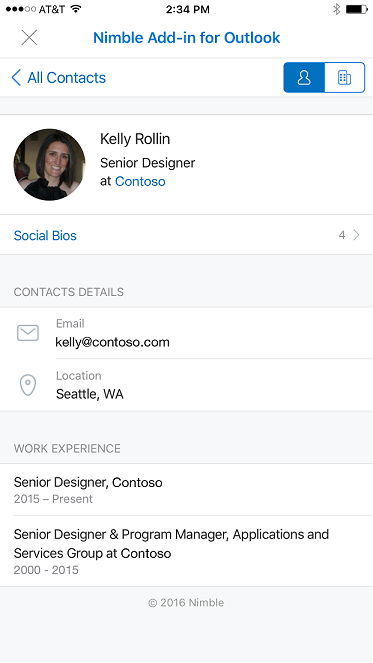

# Надстройки для Outlook MobileAdd-ins for Outlook Mobile

В Outlook Mobile теперь работают надстройки, использующие те же API, что и в других конечных точках Outlook. Если вы уже создали надстройку для Outlook, вам будет легко запустить ее в Outlook Mobile.Add-ins now work on Outlook Mobile, using the same APIs available for other Outlook endpoints. If you've built an add-in for Outlook already, it's easy to get it working on Outlook Mobile.

Надстройки Outlook Mobile поддерживаются во всех коммерческих учетных записях Office 365, Outlook.com. Скоро их можно будет использовать и в учетных записях Gmail.Outlook mobile add-ins are supported on all Office 365 Commercial accounts, Outlook.com accounts, and support is coming soon to Gmail accounts.

**Пример области задач в Outlook для iOS****An example task pane in Outlook on iOS**

 

**Пример области задач в Outlook для Android****An example task pane in Outlook on Android**

> [!IMPORTANT]
> Надстройки не работают в современной версии Outlook в браузере мобильного устройства.Add-ins don't work in the modern version of Outlook in a mobile browser. Дополнительные сведения см. [в статье Outlook в браузере мобильного устройства](https://techcommunity.microsoft.com/t5/outlook-blog/outlook-on-your-mobile-browser-is-being-upgraded/ba-p/1125816).For more information, see [Outlook on your mobile browser is being upgraded](https://techcommunity.microsoft.com/t5/outlook-blog/outlook-on-your-mobile-browser-is-being-upgraded/ba-p/1125816).

## Чем отличаются надстройки для мобильных устройств?What's different on mobile?

- Небольшой размер и скорость взаимодействия усложняют разработку для мобильных устройств. Чтобы пользователи получали только качественные приложения, мы устанавливаем строгие требования, которым должна соответствовать надстройка с заявленной поддержкой мобильных устройств для утверждения в AppSource.The small size and quick interactions make designing for mobile a challenge. To ensure quality experiences for our customers, we are setting strict validation criteria that must be met by an add-in declaring mobile support, in order to be approved in AppSource.
    - В надстройке **ДОЛЖНЫ** соблюдаться [рекомендации по пользовательскому интерфейсу](outlook-addin-design.md).The add-in **MUST** adhere to the [UI guidelines](outlook-addin-design.md).
    - Сценарий для использования надстройки **ДОЛЖЕН** [быть уместным на мобильных устройствах](#what-makes-a-good-scenario-for-mobile-add-ins).The scenario for the add-in **MUST** [make sense on mobile](#what-makes-a-good-scenario-for-mobile-add-ins).

- Как правило, в настоящее время поддерживается только режим чтения сообщений.In general, only Message Read mode is supported at this time. Это означает `MobileMessageReadCommandSurface` единственный [ExtensionPoint](../reference/manifest/extensionpoint.md#mobilemessagereadcommandsurface) , который следует объявить в разделе мобильного устройства манифеста.That means `MobileMessageReadCommandSurface` is the only [ExtensionPoint](../reference/manifest/extensionpoint.md#mobilemessagereadcommandsurface) you should declare in the mobile section of your manifest. Однако режим организатора встречи поддерживается для встроенных надстроек поставщика собраний по сети, которые вместо этого объявляют [точку расширения мобилеонлинемитингкоммандсурфаце](../reference/manifest/extensionpoint.md#mobileonlinemeetingcommandsurface-preview).However, Appointment Organizer mode is supported for online meeting provider integrated add-ins which instead declare the [MobileOnlineMeetingCommandSurface extension point](../reference/manifest/extensionpoint.md#mobileonlinemeetingcommandsurface-preview). Для получения дополнительных сведений об этом сценарии обратитесь к статье [Создание надстройки Outlook для мобильных устройств](online-meeting.md) .See the [Create an Outlook mobile add-in for an online-meeting provider](online-meeting.md) article for more about this scenario.

- API [makeEwsRequestAsync](../reference/objectmodel/preview-requirement-set/office.context.mailbox.md#methods) не поддерживается на мобильных устройствах, так как мобильное приложение использует интерфейсы REST API для связи с сервером. Если внутреннему серверу приложения требуется подключиться к серверу Exchange, вы можете совершать вызовы REST API с помощью маркера обратного вызова. Дополнительные сведения см. в статье [Использование интерфейсов REST API Outlook из надстройки Outlook](use-rest-api.md).The [makeEwsRequestAsync](../reference/objectmodel/preview-requirement-set/office.context.mailbox.md#methods) API is not supported on mobile since the mobile app uses REST APIs to communicate with the server. If your app backend needs to connect to the Exchange server, you can use the callback token to make REST API calls. For details, see [Use the Outlook REST APIs from an Outlook add-in](use-rest-api.md).

- Отправляя надстройку в магазин с элементом [MobileFormFactor](../reference/manifest/mobileformfactor.md) в манифесте, необходимо принять условия приложения для разработчиков надстроек на iOS, а также указать свой идентификатор разработчика Apple для проверки.When you submit your add-in to the store with [MobileFormFactor](../reference/manifest/mobileformfactor.md) in the manifest, you'll need to agree to our developer addendum for add-ins on iOS, and you must submit your Apple Developer ID for verification.

- Кроме того, в манифесте необходимо объявить элемент `MobileFormFactor`, а также указать правильные [элементы управления](../reference/manifest/control.md) и [размеры значков](../reference/manifest/icon.md).Finally, your manifest will need to declare `MobileFormFactor`, and have the correct types of [controls](../reference/manifest/control.md) and [icon sizes](../reference/manifest/icon.md) included.

## Для каких сценариев хорошо подходят мобильные надстройки?What makes a good scenario for mobile add-ins?

Помните, что средняя продолжительность сеанса Outlook на телефоне значительно ниже, чем на компьютере. Это означает, что надстройка должна работать быстро, позволяя пользователю зайти, выйти и вернуться к работе с электронной почтой.Remember that the average Outlook session length on a phone is much shorter than on a PC. That means your add-in must be fast, and the scenario must allow the user to get in, get out, and get on with their email workflow.

Ниже приведены примеры сценариев, для которых подходит Outlook Mobile.Here are examples of scenarios that make sense in Outlook Mobile.

- Надстройка передает ценные сведения в Outlook, помогая пользователям сортировать свою почту и отвечать надлежащим образом. Пример: надстройка CRM, позволяющая пользователю просматривать сведения о клиентах и делиться соответствующей информацией.The add-in brings valuable information into Outlook, helping users triage their email and respond appropriately. Example: a CRM add-in that lets the user see customer information and share appropriate information.

- Надстройка повышает ценность содержимого электронной почты пользователя, сохраняя сведения в системе отслеживания, совместной работы или другой подобной системе. Пример: надстройка, позволяющая пользователям преобразовывать электронные сообщения в элементы задач для отслеживания проектов или заявки в службу поддержки.The add-in adds value to the user's email content by saving the information to a tracking, collaboration, or similar system. Example: an add-in that lets users turn emails into task items for project tracking, or help tickets for a support team.

**Пример действий пользователя для создания карточки Trello из электронного сообщения на iOS****An example user interaction to create a Trello card from an email message on iOS**

 

**Пример действий пользователя для создания карточки Trello из электронного сообщения на Android****An example user interaction to create a Trello card from an email message on Android**

## Тестирование надстроек на мобильных устройствахTesting your add-ins on mobile

Чтобы протестировать надстройку в Outlook Mobile, вы можете загрузить неопубликованную надстройку в учетную запись Office 365 или Outlook.com. В Outlook в Интернете нажмите значок шестеренки и выберите пункт **Управление интеграцией** или **Управление надстройками**. В верхней части экрана нажмите надпись **Щелкните здесь, чтобы добавить пользовательскую надстройку** и отправьте манифест. Убедитесь, что манифест отформатирован надлежащим образом и включает `MobileFormFactor`. В противном случае он не загрузится.To test an add-in on Outlook Mobile, you can sideload an add-in to an O365 or Outlook.com account. In Outlook on the web, go to the settings gear, and choose **Manage Integrations** or **Manage Add-ins**. Near the top, click where it says **Click here to add a custom add-in** and upload your manifest. Make sure your manifest is properly formatted to contain `MobileFormFactor` or it won't load.

Подготовив надстройку к работе, протестируйте ее на экранах различных размеров, в том числе на телефонах и планшетах. Убедитесь, что она соответствует требованиям к специальным возможностям: контрастности, размеру шрифта, а также возможности работы со средствами чтения с экрана, такими как VoiceOver в iOS и TalkBack в Android.After your add-in is working, make sure to test it on different screen sizes, including phones and tablets. You should make sure it meets accessibility guidelines for contrast, font size, and color, as well as being usable with a screen reader such as VoiceOver on iOS or TalkBack on Android.

Устранять неполадки на мобильных устройствах может быть сложно, так как в вашем распоряжении может не оказаться привычных инструментов. Один из вариантов устранения неполадок — [использование Vorlon.js](../testing/debug-office-add-ins-on-ipad-and-mac.md). А если вы уже использовали Fiddler, ознакомьтесь с [этим руководством по его использованию с устройствами iOS](https://www.telerik.com/blogs/using-fiddler-with-apple-ios-devices).Troubleshooting on mobile can be hard since you may not have the tools you're used to. One option for troubleshooting is to [use Vorlon.js](../testing/debug-office-add-ins-on-ipad-and-mac.md). Or, if you've used Fiddler before, check out [this tutorial on using it with an iOS device](https://www.telerik.com/blogs/using-fiddler-with-apple-ios-devices).

## Дальнейшие действияNext steps

Узнайте, как:Learn how to:

- [Добавить поддержку мобильных устройств в манифест надстройки](add-mobile-support.md).[Add mobile support to your add-in's manifest](add-mobile-support.md).
- [Разработать отличный мобильный интерфейс для надстройки](outlook-addin-design.md).[Design a great mobile experience for your add-in](outlook-addin-design.md).
- [Получить маркер доступа и вызвать REST API Outlook](use-rest-api.md) из надстройки.[Get an access token and call Outlook REST APIs](use-rest-api.md) from your add-in.
