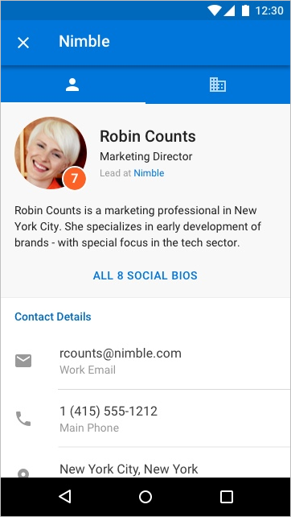

# Надстройки для Outlook Mobile

Add-ins now work on Outlook Mobile, using the same APIs available for other Outlook endpoints. If you've built an add-in for Outlook already, it's easy to get it working on Outlook Mobile.

Мобильные надстройки Outlook поддерживаются во всех бизнес-учетных записях Microsoft 365 и Outlook.com учетных записях. Однако в настоящее время поддержка для учетных записей Gmail недоступна.

**Пример области задач в Outlook для iOS**

 

**Пример области задач в Outlook для Android**

## Чем отличаются надстройки для мобильных устройств?

- The small size and quick interactions make designing for mobile a challenge. To ensure quality experiences for our customers, we are setting strict validation criteria that must be met by an add-in declaring mobile support, in order to be approved in AppSource.
  - В надстройке **ДОЛЖНЫ** соблюдаться [рекомендации по пользовательскому интерфейсу](outlook-addin-design.md).
  - Сценарий для использования надстройки **ДОЛЖЕН** [быть уместным на мобильных устройствах](#what-makes-a-good-scenario-for-mobile-add-ins).

[!INCLUDE [Teams manifest not supported on mobile devices](../includes/no-mobile-with-json-note.md)]

- Как правило, в настоящее время поддерживается только режим чтения сообщений. Это означает `MobileMessageReadCommandSurface` , что [в мобильном разделе манифеста следует объявить только ExtensionPoint](/javascript/api/manifest/extensionpoint#mobilemessagereadcommandsurface) . Однако существует несколько исключений:
  1. Режим организатора встреч поддерживается для интегрированных надстроек поставщика собраний по сети, которые объявляют точку расширения [MobileOnlineMeetingCommandSurface](/javascript/api/manifest/extensionpoint#mobileonlinemeetingcommandsurface). Дополнительные [сведения об этом](online-meeting.md) сценарии см. в статье о создании мобильной надстройки Outlook для поставщика собраний по сети.
  1. Режим участника встречи поддерживается для интегрированных надстроек, созданных поставщиками приложений для создания заметок и управления отношениями с клиентами (CRM). Такие надстройки должны объявлять точку расширения [MobileLogEventAppointmentAttendee](/javascript/api/manifest/extensionpoint#mobilelogeventappointmentattendee). Дополнительные [сведения об этом сценарии](mobile-log-appointments.md) см. в заметках о встрече журнала для внешнего приложения в мобильных надстройки Outlook.

- The [makeEwsRequestAsync](/javascript/api/requirement-sets/outlook/preview-requirement-set/office.context.mailbox#methods) API is not supported on mobile since the mobile app uses REST APIs to communicate with the server. If your app backend needs to connect to the Exchange server, you can use the callback token to make REST API calls. For details, see [Use the Outlook REST APIs from an Outlook add-in](use-rest-api.md).

- Отправляя надстройку в магазин с элементом [MobileFormFactor](/javascript/api/manifest/mobileformfactor) в манифесте, необходимо принять условия приложения для разработчиков надстроек на iOS, а также указать свой идентификатор разработчика Apple для проверки.

- Кроме того, в манифесте необходимо объявить элемент `MobileFormFactor`, а также указать правильные [элементы управления](/javascript/api/manifest/control) и [размеры значков](/javascript/api/manifest/icon).

## Для каких сценариев хорошо подходят мобильные надстройки?

Remember that the average Outlook session length on a phone is much shorter than on a PC. That means your add-in must be fast, and the scenario must allow the user to get in, get out, and get on with their email workflow.

Ниже приведены примеры сценариев, для которых подходит Outlook Mobile.

- The add-in brings valuable information into Outlook, helping users triage their email and respond appropriately. Example: a CRM add-in that lets the user see customer information and share appropriate information.

- The add-in adds value to the user's email content by saving the information to a tracking, collaboration, or similar system. Example: an add-in that lets users turn emails into task items for project tracking, or help tickets for a support team.

**Пример действий пользователя для создания карточки Trello из электронного сообщения на iOS**

 

**Пример действий пользователя для создания карточки Trello из электронного сообщения на Android**

## Тестирование надстроек на мобильных устройствах

Чтобы протестировать надстройку в Outlook Mobile,  сначала перезагрузите неопубликованную надстройку в учетную запись Microsoft 365 или Outlook.com в Интернете, Windows или Mac. Убедитесь, что манифест правильно отформатирован для хранения `MobileFormFactor` или не будет загружаться в клиент Outlook на мобильных устройствах.

After your add-in is working, make sure to test it on different screen sizes, including phones and tablets. You should make sure it meets accessibility guidelines for contrast, font size, and color, as well as being usable with a screen reader such as VoiceOver on iOS or TalkBack on Android.

Устранение неполадок на мобильных устройствах может оказаться сложной проблемой, так как у вас нет средств, к которые вы уже использовались. Однако одним из вариантов устранения неполадок в iOS является использование Fiddler (ознакомьтесь с этим руководством по его использованию на [устройстве iOS](https://www.telerik.com/blogs/using-fiddler-with-apple-ios-devices)).

> [!NOTE]
> Современные Outlook в Интернете на смартфонах iPhone и Android больше не требуются и не доступны для тестирования надстроек Outlook. Кроме того, надстройки не поддерживаются в Outlook для Android, iOS и современном мобильном веб-сайте с локальными учетными записями Exchange. Некоторые устройства iOS по-прежнему поддерживают надстройки при использовании локальных учетных записей Exchange с классическими Outlook в Интернете. Сведения о поддерживаемых устройствах см. в разделе [Требования к запуску надстроек для Office](../concepts/requirements-for-running-office-add-ins.md#client-requirements-non-windows-smartphone-and-tablet).

## Дальнейшие действия

Узнайте, как:

- [Добавить поддержку мобильных устройств в манифест надстройки](add-mobile-support.md).
- [Разработать отличный мобильный интерфейс для надстройки](outlook-addin-design.md).
- [Получить маркер доступа и вызвать REST API Outlook](use-rest-api.md) из надстройки.
