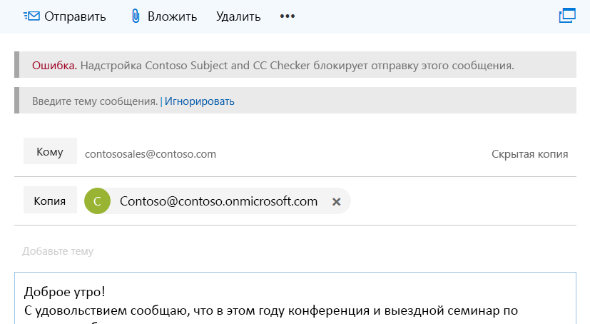
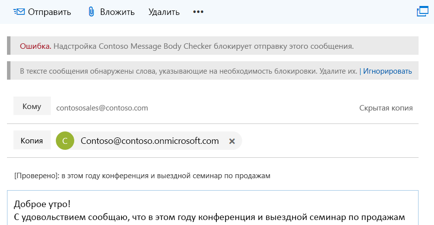

# <a name="on-send-feature-for-outlook-add-ins"></a>Функция проверки при отправке для надстроек Outlook

Функция проверки при отправке позволяет надстройкам Outlook настраивать те или иные параметры при отправке, а также обрабатывать сообщение или элемент собрания и запрещать пользователям выполнять определенные действия. Например, с помощью функции проверки при отправке можно сделать следующее:

- запретить пользователю отправлять конфиденциальную информацию или оставлять строку темы пустой;  
- добавить определенного получателя в строку "Копия" в сообщениях или в строку "Необязательные получатели" в собраниях.

Функция проверки при отправке не использует пользовательский интерфейс и активируется событием типа `ItemSend`.

Сведения об ограничениях, связанных с функцией проверки при отправке, см. в разделе [Ограничения](#limitations) далее в этой статье.

## <a name="supported-clients-and-platforms"></a>Поддерживаемые клиенты и платформы

В следующей таблице показаны поддерживаемые клиенто-серверные комбинации для функции отправки, включая минимально необходимое накопительное обновление, если это применимо. Исключенные комбинации не поддерживаются.

| Клиент | Exchange Online | Exchange 2016<br>(Накопительное обновление 6 или более позднее) | Exchange 2019 на месте<br>(Накопительное обновление 1 или более позднее) |
|---|:---:|:---:|:---:|
|Windows:<br>версия 1910 (сборка 12130.20272) или более поздней версии|Да|Да|Да|
|Mac:<br>сборка 16.47 или более поздней|Да|Да|Да|
|Веб-браузер:<br>современный Outlook пользовательского интерфейса|Да|Неприменимо|Неприменимо|
|Веб-браузер:<br>классический Outlook пользовательского интерфейса|Неприменимо|Да|Да|

> [!NOTE]
> Функция отправки была официально выпущена в наборе требований 1.8 (см. сведения о текущем сервере [и клиентской](../reference/requirement-sets/outlook-api-requirement-sets.md#requirement-sets-supported-by-exchange-servers-and-outlook-clients) поддержке). Однако обратите внимание, что матрица поддержки функции является суперсетью набора требований.

> [!IMPORTANT]
> Надстройки, которые используют функцию отправки, не допускаются в [AppSource.](https://appsource.microsoft.com)

## <a name="how-does-the-on-send-feature-work"></a>Как работает функция проверки при отправке?

С помощью функции проверки при отправке вы можете создать надстройку Outlook, задействующую синхронное событие `ItemSend`. Это событие возникает, когда пользователь нажимает кнопку **Отправить** (или **Отправить обновление** для существующих собраний). С его помощью можно блокировать отправку элемента, не прошедшего проверку. Например, когда пользователь вызывает событие отправки сообщения, надстройка Outlook благодаря функции проверки при отправке может следующее:

- Чтение и проверка содержимого сообщения электронной почты.
- Убедитесь, что сообщение содержит строку субъекта.
- Установите заранее установленного получателя.

Проверка проводится на стороне клиента Outlook при запуске события отправки, а надстройка имеет до 5 минут, прежде чем она разовьется. Если проверка не удается, отправка элемента блокируется, а сообщение об ошибке отображается в информационной панели, которая побуждает пользователя к действию.

> [!NOTE]
> В Outlook в Интернете, когда функция отправки запускается в сообщении, сочиняемом в вкладке Outlook браузера, элемент выскочил в собственное окно браузера или вкладку, чтобы завершить проверку и другую обработку.

На приведенном ниже снимке экрана показана панель информации, в которой пользователю предлагается добавить тему.



На приведенном ниже снимке экрана показана панель информации, уведомляющая отправителя о том, что обнаружены слова, подлежащие блокировке.



## <a name="limitations"></a>Ограничения

В настоящее время на функцию проверки при отправке действуют перечисленные ниже ограничения.

- **Функция append-on-send** При вызове &ndash; [item.body.AppendOnSendAsync](/javascript/api/outlook/office.body?view=outlook-js-1.9&preserve-view=true#appendOnSendAsync_data__options__callback_) в обработнике отправки возвращается ошибка.
- **AppSource**. Надстройки Outlook, в которых используется функция проверки при отправке, невозможно публиковать в [AppSource](https://appsource.microsoft.com), так как они не проходят проверку AppSource. Надстройки, использующие функцию проверки при отправке, должны разворачиваться администраторами.
- **Манифест**. Для каждой надстройки поддерживается только одно событие `ItemSend`. Если манифест содержит несколько событий `ItemSend`, он не пройдет проверку.
- **Производительность**. &ndash;Многочисленные случаи приема-передачи пакетов на веб-сервере, где размещается надстройка, могут повлиять на ее производительность. Учитывайте влияние на производительность при создании надстроек, требующих выполнения нескольких операций с сообщениями или собраниями.
- **Отправить позже** (только для Mac). Если имеются надстройки, использующие проверку при отправке, функция **Отправить позже** будет недоступна.

Кроме того, не рекомендуется вызывать обработитель событий при отправке, так как закрытие элемента должно происходить автоматически после `item.close()` завершения события.

### <a name="mailbox-typemode-limitations"></a>Ограничения на типы и режимы почтовых ящиков

Функция проверки при отправке поддерживается только для почтовых ящиков пользователей в Outlook в Интернете, Windows или Mac. Помимо ситуаций, когда надстройки не активируются, [](outlook-add-ins-overview.md#mailbox-items-available-to-add-ins) как отмечено в разделах почтовых ящиков, доступных для раздела надстройки на странице обзора надстройки Outlook, функциональность в настоящее время не поддерживается для автономного режима, где этот режим доступен.

Если надстройки Outlook не активируются, надстройка не будет работать и сообщение будет отправлено.

Однако, если функция отправки включена и доступна, но сценарий почтовых ящиков неподтверден, Outlook не разрешает отправку.

## <a name="multiple-on-send-add-ins"></a>Несколько надстроек, поддерживающих проверку сообщений при отправке

Если установлено несколько надстроек, поддерживающих проверку сообщений при отправке, они будут запускаться в том порядке, в котором были получены из API `getAppManifestCall` или `getExtensibilityContext`. Если первая надстройка разрешает отправку сообщения, то вторая может внести изменения, на которые первая отреагировала бы запретом отправки. Однако первая надстройка не будет запускаться снова, если все установленные надстройки разрешат отправку.

Допустим, надстройка 1 и надстройка 2 используют функцию проверки при отправке. Сначала устанавливается надстройка 1, а затем — надстройка 2. Надстройка 1 находит в сообщении слово Fabrikam, что является условием для разрешения отправки.  Однако надстройка 2 удаляет все вхождения слова Fabrikam. Сообщение будет отправлено без единого слова Fabrikam (в связи с порядком установки надстроек 1 и 2).

## <a name="deploy-outlook-add-ins-that-use-on-send"></a>Развертывание надстроек Outlook, использующих функцию проверки при отправке

Рекомендуем, чтобы развертывание надстроек Outlook, использующих функцию проверки при отправке, выполняли администраторы. Администратор должен убедиться, что такая надстройка:

- всегда присутствует при открытии создаваемого элемента (для электронной почты: создание сообщений, ответ и пересылка);
- не может быть закрыта или отключена пользователем.

## <a name="install-outlook-add-ins-that-use-on-send"></a>Установка надстроек Outlook, использующих функцию проверки при отправке

Чтобы использовать функцию проверки при отправке в Outlook, надстройки должны быть настроены для типов событий отправки. Выберите платформу, которую нужно настроить.

### <a name="web-browser---classic-outlook"></a>[Веб-браузер — классическая версия Outlook](#tab/classic)

Надстройки для Outlook в Интернете (классическая версия), использующие функцию проверки при отправке, будут запускаться у пользователей, которым назначена политика почтовых ящиков Outlook в Интернете, для флага *OnSendAddinsEnabled* которой задано значение **true**.

Чтобы установить новую надстройку, выполните приведенные ниже командлеты Exchange Online PowerShell.

```powershell
$Data=Get-Content -Path '.\Contoso Message Body Checker.xml' -Encoding Byte –ReadCount 0
```

```powershell
New-App -OrganizationApp -FileData $Data -DefaultStateForUser Enabled
```

> [!NOTE]
> Сведения о том, как подключиться к Exchange Online с помощью удаленного сеанса PowerShell, см. в статье [Подключение к Exchange Online PowerShell](/powershell/exchange/exchange-online/connect-to-exchange-online-powershell/connect-to-exchange-online-powershell).

#### <a name="enable-the-on-send-feature"></a>Включение функции проверки при отправке

По умолчанию функция проверки при отправке отключена. Администраторы могут включать эту функцию с помощью командлетов Exchange Online PowerShell.

Чтобы для всех пользователей включить надстройки, поддерживающие проверку сообщений при отправке, сделайте следующее:

1. Создайте политику почтовых ящиков Outlook в Интернете.

   ```powershell
    New-OWAMailboxPolicy OWAOnSendAddinAllUserPolicy
   ```

    > [!NOTE]
    > Администраторы могут использовать существующую политику, но функция проверки при отправке поддерживается только для определенных типов почтовых ящиков. По умолчанию в Outlook в Интернете блокируется отправка сообщений из неподдерживаемых почтовых ящиков.

2. Включите функцию проверки при отправке.

   ```powershell
    Get-OWAMailboxPolicy OWAOnSendAddinAllUserPolicy | Set-OWAMailboxPolicy –OnSendAddinsEnabled:$true
   ```

3. Назначьте политику пользователям.

   ```powershell
    Get-User -Filter {RecipientTypeDetails -eq 'UserMailbox'}|Set-CASMailbox -OwaMailboxPolicy OWAOnSendAddinAllUserPolicy
   ```

#### <a name="enable-the-on-send-feature-for-a-group-of-users"></a>Включение функции проверки при отправке для группы пользователей

Чтобы включить функцию проверки при отправке для определенной группы пользователей, выполните указанные ниже действия.  В этом примере администратор включает функцию проверки при отправке для надстроек Outlook в Интернете только в среде финансового отдела (Finance).

1. Создайте политику почтовых ящиков Outlook в Интернете для группы.

   ```powershell
    New-OWAMailboxPolicy FinanceOWAPolicy
   ```

   > [!NOTE]
   > Администраторы могут использовать существующую политику, но функция проверки при отправке поддерживается только для определенных типов почтовых ящиков (дополнительные сведения см. в разделе [Ограничения на типы почтовых ящиков](#multiple-on-send-add-ins) выше в этой статье). По умолчанию в Outlook в Интернете блокируется отправка сообщений из неподдерживаемых почтовых ящиков.

2. Включите функцию проверки при отправке.

   ```powershell
    Get-OWAMailboxPolicy FinanceOWAPolicy | Set-OWAMailboxPolicy –OnSendAddinsEnabled:$true
   ```

3. Назначьте политику пользователям.

   ```powershell
    $targetUsers = Get-Group 'Finance'|select -ExpandProperty members
    $targetUsers | Get-User -Filter {RecipientTypeDetails -eq 'UserMailbox'}|Set-CASMailbox -OwaMailboxPolicy FinanceOWAPolicy
   ```

> [!NOTE]
> Дождитесь вступления политики в силу (это может занять до 60 минут) или перезапустите службы IIS. Когда политика вступит в силу, для группы будет включена функция проверки при отправке.

#### <a name="disable-the-on-send-feature"></a>Отключение функции проверки при отправке

Чтобы отключить функцию проверки при отправке для пользователя или назначить политику почтовых ящиков Outlook в Интернете, в которой не включен соответствующий флаг, выполните приведенные ниже командлеты. В этом примере используется политика почтовых ящиков *ContosoCorpOWAPolicy*.

```powershell
Get-CASMailbox joe@contoso.com | Set-CASMailbox –OWAMailboxPolicy "ContosoCorpOWAPolicy"
```

> [!NOTE]
> Дополнительные сведения о том, как настроить существующие политики почтовых ящиков Outlook в Интернете с помощью командлета **Set-OwaMailboxPolicy**, см. в статье [Set-OwaMailboxPolicy](/powershell/module/exchange/client-access/Set-OwaMailboxPolicy).

Чтобы отключить функцию проверки при отправке для всех пользователей, которым назначена определенная политика почтовых ящиков Outlook в Интернете, выполните приведенные ниже командлеты.

```powershell
Get-OWAMailboxPolicy OWAOnSendAddinAllUserPolicy | Set-OWAMailboxPolicy –OnSendAddinsEnabled:$false
```

### <a name="web-browser---modern-outlook"></a>[Веб-браузер — современная версия Outlook](#tab/modern)

Надстройки для Outlook в Интернете (современная версия), использующие функцию проверки при отправке, должны запускаться для всех пользователей, установивших их. Однако если пользователям необходимо запускать надстройки по отправке в соответствии со стандартами соответствия требованиям, политика почтовых ящиков должна иметь флаг *OnSendAddinsEnabled,* чтобы редактирование элемента не было разрешено во время обработки надстройок при `true` отправке.

Чтобы установить новую надстройку, выполните приведенные ниже командлеты Exchange Online PowerShell.

```powershell
$Data=Get-Content -Path '.\Contoso Message Body Checker.xml' -Encoding Byte –ReadCount 0
```

```powershell
New-App -OrganizationApp -FileData $Data -DefaultStateForUser Enabled
```

> [!NOTE]
> Сведения о том, как подключиться к Exchange Online с помощью удаленного сеанса PowerShell, см. в статье [Подключение к Exchange Online PowerShell](/powershell/exchange/exchange-online/connect-to-exchange-online-powershell/connect-to-exchange-online-powershell).

#### <a name="enable-the-on-send-flag"></a>Включить флаг отправки

Администраторы могут применять соответствие требованиям при отправке, запуская Exchange Online PowerShell.

Чтобы отослать редактирование во время обработки надстройок при отправке, для всех пользователей необходимо отослать:

1. Создайте политику почтовых ящиков Outlook в Интернете.

   ```powershell
    New-OWAMailboxPolicy OWAOnSendAddinAllUserPolicy
   ```

    > [!NOTE]
    > Администраторы могут использовать существующую политику, но функция проверки при отправке поддерживается только для определенных типов почтовых ящиков. По умолчанию в Outlook в Интернете блокируется отправка сообщений из неподдерживаемых почтовых ящиков.

2. Обеспечение соответствия требованиям при отправке.

   ```powershell
    Get-OWAMailboxPolicy OWAOnSendAddinAllUserPolicy | Set-OWAMailboxPolicy –OnSendAddinsEnabled:$true
   ```

3. Назначьте политику пользователям.

   ```powershell
    Get-User -Filter {RecipientTypeDetails -eq 'UserMailbox'}|Set-CASMailbox -OwaMailboxPolicy OWAOnSendAddinAllUserPolicy
   ```

#### <a name="turn-on-the-on-send-flag-for-a-group-of-users"></a>Включив флаг отправки для группы пользователей

Чтобы обеспечить соблюдение при отправке для определенной группы пользователей, выполните следующие действия. В этом примере администратор включает политику проверки при отправке для надстроек Outlook в Интернете только в среде финансового отдела (Finance).

1. Создайте политику почтовых ящиков Outlook в Интернете для группы.

   ```powershell
    New-OWAMailboxPolicy FinanceOWAPolicy
   ```

   > [!NOTE]
   > Администраторы могут использовать существующую политику, но функция проверки при отправке поддерживается только для определенных типов почтовых ящиков (дополнительные сведения см. в разделе [Ограничения на типы почтовых ящиков](#multiple-on-send-add-ins) выше в этой статье). По умолчанию в Outlook в Интернете блокируется отправка сообщений из неподдерживаемых почтовых ящиков.

2. Обеспечение соответствия требованиям при отправке.

   ```powershell
    Get-OWAMailboxPolicy FinanceOWAPolicy | Set-OWAMailboxPolicy –OnSendAddinsEnabled:$true
   ```

3. Назначьте политику пользователям.

   ```powershell
    $targetUsers = Get-Group 'Finance'|select -ExpandProperty members
    $targetUsers | Get-User -Filter {RecipientTypeDetails -eq 'UserMailbox'}|Set-CASMailbox -OwaMailboxPolicy FinanceOWAPolicy
   ```

> [!NOTE]
> Дождитесь вступления политики в силу (это может занять до 60 минут) или перезапустите службы IIS. Когда политика вступает в силу, для группы будет применено соответствие требованиям по отправке.

#### <a name="turn-off-the-on-send-flag"></a>Выключите флаг отправки

Чтобы отключить для пользователя правоприменительных правил соответствия при отправке, назначьте политику Outlook в Интернете почтовых ящиков, которая не имеет флага, запуская следующие cmdlets. В этом примере используется политика почтовых ящиков *ContosoCorpOWAPolicy*.

```powershell
Get-CASMailbox joe@contoso.com | Set-CASMailbox –OWAMailboxPolicy "ContosoCorpOWAPolicy"
```

> [!NOTE]
> Дополнительные сведения о том, как настроить существующие политики почтовых ящиков Outlook в Интернете с помощью командлета **Set-OwaMailboxPolicy**, см. в статье [Set-OwaMailboxPolicy](/powershell/module/exchange/client-access/Set-OwaMailboxPolicy).

Чтобы отключить правоприменители соответствия требованиям для всех пользователей, Outlook в Интернете назначена политика почтовых ящиков, запустите следующие cmdlets.

```powershell
Get-OWAMailboxPolicy OWAOnSendAddinAllUserPolicy | Set-OWAMailboxPolicy –OnSendAddinsEnabled:$false
```

### <a name="windows"></a>[Windows](#tab/windows)

Надстройки Outlook для Windows, использующие функцию проверки при отправке, должны запускаться для всех пользователей, установивших их. Однако если пользователям требуется запустить надстройку в соответствии со стандартами соответствия требованиям, блок групповой политики отправляется, когда **веб-надстройки** не могут загрузиться, необходимо установить для включения на каждой применимой машине. 

Чтобы установить политики почтовых ящиков, [](https://www.microsoft.com/download/details.aspx?id=49030) администраторы могут скачать средство административных шаблонов, а затем получить доступ к последним шаблонам администрирования, заведя редактор локальной групповой политики **gpedit.msc**.

> [!NOTE]
> В более старых версиях средства административных шаблонов имя политики было Отключение отправки, когда веб-расширения не **могут загружаться.** Замените это имя в последующих действиях, если это необходимо.

#### <a name="what-the-policy-does"></a>Действия политики

Для соответствия требованиям администраторам может потребоваться отключить возможность отправки сообщения или элементов собрания пользователями, пока не станет доступна для запуска последняя версия надстройки с функцией проверки при отправке. Администраторы должны включить  отправку блока групповой политики, если веб-надстройки не могут загружаться, чтобы все надстройки обновлялись из Exchange и могли проверять, соответствует ли каждое сообщение или элемент собрания ожидаемым правилам и правилам при отправке.

|Состояние политики|Результат|
|---|---|
|Отключено|Загруженные в настоящее время манифесты надстройок (не обязательно последних версий) запускаются при отправке сообщений или элементов собраний. Это состояние или поведение по умолчанию.|
|Включено|После загрузки последних манифестов надстройки по отправке из Exchange надстройки запускаются при отправке элементов сообщений или собраний. В противном случае отправка блокируется.|

#### <a name="manage-the-on-send-policy"></a>Управление политикой проверки при отправке

По умолчанию политика проверки при отправке отключена. Администраторы могут включить политику отправки, обеспечив отправку блок-параметра групповой политики пользователя при неуправляемой загрузке **веб-надстройок.**  Чтобы отключить политику для пользователя, администратору следует присвоить ей значение **Отключено**. Чтобы управлять этим параметром политики, можно сделать следующее:

1. Скачайте последнее [средство административных шаблонов](https://www.microsoft.com/download/details.aspx?id=49030).
1. Откройте редактор локальной групповой политики **(gpedit.msc).**
1. Перейдите **к административным** шаблонам конфигурации  >     >  **пользователей Microsoft Outlook 2016** центр  >  **доверия**  >  **безопасности**.
1. Выберите **отправку блока, если веб-надстройки не могут загрузить** параметр.
1. Откройте ссылку для изменения параметра политики.
1. В блоке отправки, когда **веб-надстройки** не  могут  загрузить диалоговое окно, выберите Включено или Отключено по мере необходимости, а затем выберите **ОК** или **Применить,** чтобы ввести обновление в действие.

### <a name="mac"></a>[Mac](#tab/unix)

Надстройки Outlook для Mac, использующие функцию проверки при отправке, должны запускаться у всех пользователей, установивших их. Однако если пользователям требуется запустить надстройку для выполнения стандартов соответствия требованиям, необходимо применить следующий параметр почтовых ящиков на компьютере каждого пользователя. Этот параметр или ключ совместим с CFPreference, то есть его можно установить, используя программное обеспечение для управления предприятием для Mac, например Jamf Pro.

||Значение|
|:---|:---|
|**Домен**|com.microsoft.outlook|
|**Ключ**|OnSendAddinsWaitForLoad|
|**Тип данных**|Логический|
|**Возможные значения**|false (по умолчанию)<br>true|
|**Доступность**|16.27|
|**Примечания**|Этот ключ создает политику onSendMailbox.|

#### <a name="what-the-setting-does"></a>Для чего служит параметр

Для соответствия требованиям администраторам может потребоваться отключить возможность отправки сообщения или элементов собрания пользователями, пока не станет доступна для запуска последняя версия надстроек с функцией проверки при отправке. Администраторы должны включить ключ **OnSendAddinsWaitForLoad**, чтобы все надстройки обновлялись из службы Exchange и были доступны для проверки того, что каждое сообщение или элемент собрания соответствует ожидаемым правилам и нормативным требованиям при отправке.

|Состояние ключа|Результат|
|---|---|
|false|Загруженные в настоящее время манифесты надстройок (не обязательно последних версий) запускаются при отправке сообщений или элементов собраний. Это состояние по умолчанию/поведение.|
|true|После загрузки последних манифестов надстройки по отправке из Exchange надстройки запускаются при отправке элементов сообщений или собраний. В противном случае отправка блокируется, а кнопка **Отправка** отключена.|

---

## <a name="on-send-feature-scenarios"></a>Сценарии проверки при отправке

Ниже представлены поддерживаемые и неподдерживаемые сценарии для надстроек, использующих функцию проверки при отправке.

### <a name="user-mailbox-has-the-on-send-add-in-feature-enabled-but-no-add-ins-are-installed"></a>В почтовом ящике пользователя включена функция проверки при отправке, но не установлено ни одной надстройки

В этом сценарии пользователь сможет отправлять сообщения и элементы собраний без выполнения надстройок.

### <a name="user-mailbox-has-the-on-send-add-in-feature-enabled-and-add-ins-that-supports-on-send-are-installed-and-enabled"></a>В почтовом ящике пользователя включена функция проверки при отправке, а также установлены и включены надстройки, поддерживающие эту функцию

При отправке будут запускаться надстройки, которые разрешат или заблокируют отправку.

### <a name="mailbox-delegation-where-mailbox-1-has-full-access-permissions-to-mailbox-2"></a>Делегирование для почтовых ящиков, при котором у почтового ящика 1 есть разрешения на полный доступ к почтовому ящику 2

#### <a name="web-browser-classic-outlook"></a>Веб-браузер (классическая версия Outlook)

|Сценарий|Функция проверки при отправке для почтового ящика 1|Функция проверки при отправке для почтового ящика 2|Веб-сеанс Outlook (классическая версия)|Результат|Поддержка|
|:------------|:------------|:--------------------------|:---------|:-------------|:-------------|
|1|Включена|Включена|Новый сеанс|Почтовый ящик 1 не может отправлять сообщение или элементы собраний из почтового ящика 2.|В настоящее время не поддерживается. В качестве обходного решения используйте сценарий 3.|
|2|Отключена|Включена|Новый сеанс|Почтовый ящик 1 не может отправлять сообщение или элементы собраний из почтового ящика 2.|В настоящее время не поддерживается. В качестве обходного решения используйте сценарий 3.|
|3|Включена|Включена|Тот же сеанс|Проверка при отправке выполняется для почтового ящика 1, которому назначены надстройки, поддерживающие эту функцию.|Поддерживается.|
|4 |Включена|Отключена|Новый сеанс|Надстройки с функцией проверки при отправке не запускаются; отправка сообщения или элемента собрания.|Поддерживается.|

#### <a name="web-browser-modern-outlook-windows-mac"></a>Веб-браузер (современная версия Outlook), Windows, Mac

Чтобы внедрить функцию проверки при отправке, администраторы должны включить политику для обоих почтовых ящиков. Подробнее о поддержке делегирования доступа в надстройке см. в раздел Включить общие папки и сценарии общих [почтовых ящиков.](delegate-access.md)

### <a name="user-mailbox-with-on-send-add-in-featurepolicy-enabled-add-ins-that-support-on-send-are-installed-and-enabled-and-offline-mode-is-enabled"></a>Включен почтовый ящик пользователя с функцией или политикой проверки при отправке, установлены и включены надстройки, поддерживающие эту функцию, а также включен автономный режим

Надстройки, поддерживающие проверку при отправке, запускаются в соответствии с сетевым состоянием пользователя, внутреннего сервера надстройки и Exchange.

#### <a name="users-state"></a>Состояние пользователя

Надстройки, поддерживающие проверку сообщений при отправке, будут запускаться при отправке, если пользователь в сети. В автономном режиме такие надстройки не будут запускаться при отправке, а сообщение или элемент собрания не будет отправлен.

#### <a name="add-in-backends-state"></a>Состояние внутреннего сервера надстройки

Надстройка, поддерживающая проверку при отправке, будет запускаться, если ее внутренний сервер подключен к сети и доступен. Если внутренний сервер находится в автономном режиме, отправка отключена.

#### <a name="exchanges-state"></a>Состояние Exchange

Надстройки, поддерживающие проверку сообщений при отправке, будут запускаться при отправке, если сервер Exchange подключен к сети и доступен. Если надстройке с функцией проверки при отправке недоступна служба Exchange и включена соответствующая политика или командлет, отправка отключена.

> [!NOTE]
> На компьютерах Mac в любом автономном состоянии кнопка **Отправить** (или **Отправить обновление** для существующих собраний) отключена, и отображается уведомление, что в организации не разрешено отправлять сообщения, если пользователь не подключен к сети.

### <a name="user-can-edit-item-while-on-send-add-ins-are-working-on-it"></a>Пользователь может изменять элемент во время работы надстройки при отправке

В то время как надстройки при отправке обрабатывают элемент, пользователь может изменить элемент, добавив, например, неправильный текст или вложения. Если вы хотите запретить пользователю изменять элемент во время обработки надстройки при отправке, вы можете реализовать обходное решение с помощью диалоговое окно. Это обходное решение можно использовать в Outlook в Интернете (классический), Windows и Mac.

> [!IMPORTANT]
> Современные Outlook в Интернете. Чтобы пользователь не редактировал элемент во время обработки надстройки при отправке, необходимо установить флаг *OnSendAddinsEnabled,* как описано в разделе `true` [Install Outlook,](outlook-on-send-addins.md?tabs=modern#install-outlook-add-ins-that-use-on-send) которые используются в разделе отправки в начале этой статьи.

В обработнике отправки:

1. Вызов [displayDialogAsync,](/javascript/api/office/office.ui?view=outlook-js-preview&preserve-view=true#displayDialogAsync_startAddress__options__callback_) чтобы открыть диалоговое окно, чтобы щелчки мыши и клавиши были отключены.

    > [!IMPORTANT]
    > Чтобы получить это поведение в классическом Outlook в Интернете, необходимо задан параметр [displayInIframe](/javascript/api/office/office.dialogoptions?view=outlook-js-preview&preserve-view=true#displayInIframe) в `true` `options` параметре `displayDialogAsync` вызова.

1. Реализация обработки элемента.
1. Закройте диалоговое окно. Кроме того, обработать, что произойдет, если пользователь закрывает диалоговое окно.

## <a name="code-examples"></a>Примеры кода

В приведенных ниже примерах кода показано, как создать простую надстройку, поддерживающую проверку сообщений при отправке. Скачать код, на котором основаны эти примеры, можно на странице [Outlook-Add-in-On-Send](https://github.com/OfficeDev/Outlook-Add-in-On-Send).

> [!TIP]
> Если вы используете диалоговое окно с событием отправки, не забудьте закрыть диалоговое окно перед завершением события.

### <a name="manifest-version-override-and-event"></a>Манифест, переопределение версии и событие

Пример кода [Outlook-Add-in-On-Send](https://github.com/OfficeDev/Outlook-Add-in-On-Send) включает два манифеста:

- `Contoso Message Body Checker.xml` показывает, как проверить текст сообщения на наличие запрещенных слов или конфиденциальной информации при отправке.  

- `Contoso Subject and CC Checker.xml` показывает, как при отправке добавить получателя в строку "Копия" и проверить, включает ли сообщение строку темы.  

В файле манифеста `Contoso Message Body Checker.xml` указываются файл и имя функции, которую следует вызывать при возникновении события `ItemSend`. Операция выполняется синхронно.

```xml
<Hosts>
    <Host xsi:type="MailHost">
        <DesktopFormFactor>
            <!-- The functionfile and function name to call on message send.  -->
            <!-- In this case, the function validateBody will be called within the JavaScript code referenced in residUILessFunctionFileUrl. -->
            <FunctionFile resid="residUILessFunctionFileUrl" />
            <ExtensionPoint xsi:type="Events">
                <Event Type="ItemSend" FunctionExecution="synchronous" FunctionName="validateBody" />
            </ExtensionPoint>
        </DesktopFormFactor>
    </Host>
</Hosts>
```

> [!IMPORTANT]
> Если вы используете Visual Studio 2019 для разработки надстройки по отправке, вы можете получить предупреждение о проверке, как следующее: "Это недействительный xsi:type http://schemas.microsoft.com/office/mailappversionoverrides/1.1:Events '". Чтобы обойти это, вам потребуется более новая версия MailAppVersionOverridesV1_1.xsd, которая была предоставлена в качестве GitHub в блоге об этом [предупреждении](https://theofficecontext.com/2018/11/29/visual-studio-2017-this-is-an-invalid-xsitype-mailappversionoverrides-1-1event/).

Для файла манифеста `Contoso Subject and CC Checker.xml` в приведенном ниже примере показаны файл и имя функции, вызываемой при возникновении события отправки.

```xml
<Hosts>
    <Host xsi:type="MailHost">
        <DesktopFormFactor>
            <!-- The functionfile and function name to call on message send.  -->
            <!-- In this case the function validateSubjectAndCC will be called within the JavaScript code referenced in residUILessFunctionFileUrl. -->
            <FunctionFile resid="residUILessFunctionFileUrl" />
            <ExtensionPoint xsi:type="Events">
                <Event Type="ItemSend" FunctionExecution="synchronous" FunctionName="validateSubjectAndCC" />
            </ExtensionPoint>
        </DesktopFormFactor>
    </Host>
</Hosts>
```

Для API проверки при отправке требуется узел `VersionOverrides v1_1`. Ниже показано, как добавить узел `VersionOverrides` в манифест.

```xml
 <VersionOverrides xmlns="http://schemas.microsoft.com/office/mailappversionoverrides" xsi:type="VersionOverridesV1_0">
     <!-- On-send requires VersionOverridesV1_1 -->
     <VersionOverrides xmlns="http://schemas.microsoft.com/office/mailappversionoverrides/1.1" xsi:type="VersionOverridesV1_1">
         ...
     </VersionOverrides>
</VersionOverrides>
```

> [!NOTE]
> Дополнительные сведения см. в указанных ниже статьях.
>
> - [Манифесты надстроек Outlook](manifests.md)
> - [XML-манифест надстроек Office](../develop/add-in-manifests.md)


### <a name="event-and-item-objects-and-bodygetasync-and-bodysetasync-methods"></a>Объекты `Event` и `item`, методы `body.getAsync` и `body.setAsync`

Чтобы получить доступ к выбранному в данный момент сообщению или элементу собрания (в этом примере — к новому сообщению), используйте пространство имен `Office.context.mailbox.item`. Функция проверки при отправке автоматически передает событие `ItemSend` функции, указанной в манифесте (в данном случае это функция `validateBody`).

```js
var mailboxItem;

Office.initialize = function (reason) {
    mailboxItem = Office.context.mailbox.item;
}

// Entry point for Contoso Message Body Checker add-in before send is allowed.
// <param name="event">ItemSend event is automatically passed by on-send code to the function specified in the manifest.</param>
function validateBody(event) {
    mailboxItem.body.getAsync("html", { asyncContext: event }, checkBodyOnlyOnSendCallBack);
}
```

Функция `validateBody` возвращает текущий текст в заданном формате (HTML) и передает нужный объект события `ItemSend` в метод обратного вызова. Помимо метода `getAsync`, объект `Body` также предоставляет метод `setAsync`, с помощью которого вы можете заменить текст сообщения на указанный.

> [!NOTE]
> Дополнительные сведения см. в статьях [Объект Event](/javascript/api/office/office.addincommands.event) и [Body.getAsync](/javascript/api/outlook/office.body#getAsync_coercionType__options__callback_).
  

### <a name="notificationmessages-object-and-eventcompleted-method"></a>Объект `NotificationMessages` и метод `event.completed`

Функция `checkBodyOnlyOnSendCallBack` использует регулярное выражение, чтобы определить, содержит ли текст сообщения слова, подлежащие блокировке. Если она обнаруживает слово, совпадающие с каким-либо элементом из массива запрещенных слов, отправка сообщения блокируется, а отправитель получает уведомление на панели информации. Для этого в ней используется свойство `notificationMessages` объекта `Item` для возврата объекта `NotificationMessages`. После этого она добавляет уведомление к элементу, вызывая метод `addAsync`, как показано в следующем примере.

```js
// Determine whether the body contains a specific set of blocked words. If it contains the blocked words, block email from being sent. Otherwise allow sending.
// <param name="asyncResult">ItemSend event passed from the calling function.</param>
function checkBodyOnlyOnSendCallBack(asyncResult) {
    var listOfBlockedWords = new Array("blockedword", "blockedword1", "blockedword2");
    var wordExpression = listOfBlockedWords.join('|');

    // \b to perform a "whole words only" search using a regular expression in the form of \bword\b.
    // i to perform case-insensitive search.
    var regexCheck = new RegExp('\\b(' + wordExpression + ')\\b', 'i');
    var checkBody = regexCheck.test(asyncResult.value);

    if (checkBody) {
        mailboxItem.notificationMessages.addAsync('NoSend', { type: 'errorMessage', message: 'Blocked words have been found in the body of this email. Please remove them.' });
        // Block send.
        asyncResult.asyncContext.completed({ allowEvent: false });
    }

    // Allow send.
    asyncResult.asyncContext.completed({ allowEvent: true });
}
```

Ниже параметров `addAsync` метода.

- `NoSend`. Строка, представляющая собой заданный разработчиком ключ для ссылки на сообщение уведомления. С его помощью вы сможете изменить это сообщение позже. Клавиша не может быть длиннее 32 символов.
- `type`. Одно из свойств параметра объекта JSON. Представляет тип сообщения. Типы соответствуют значениям перечисления [Office.MailboxEnums.ItemNotificationMessageType](/javascript/api/outlook/office.mailboxenums.itemnotificationmessagetype). Допустимые значения: индикатор хода выполнения, информационное сообщение и сообщение об ошибке. В этом примере в свойстве `type` указано сообщение об ошибке.  
- `message`. Одно из свойств параметра объекта JSON. В этом примере `message` — это текст сообщения уведомления.

Чтобы сообщить о завершении надстройкой обработки события `ItemSend`, активированного операцией отправки, вызовите метод `event.completed({allowEvent:Boolean})`. Свойство `allowEvent` является логическим. Если задано значение `true`, отправка разрешается. Если задано значение `false`, отправка письма блокируется.

> [!NOTE]
> Дополнительные сведения см. в статьях [notificationMessages](../reference/objectmodel/preview-requirement-set/office.context.mailbox.item.md#properties) и [completed](/javascript/api/office/office.addincommands.event).

### <a name="replaceasync-removeasync-and-getallasync-methods"></a>Методы `replaceAsync`, `removeAsync` и `getAllAsync`

Помимо метода `addAsync`, объект `NotificationMessages` также включает методы `replaceAsync`, `removeAsync` и `getAllAsync`.  Эти методы не используются в данном примере кода.  Дополнительные сведения см. в статье [NotificationMessages](/javascript/api/outlook/office.NotificationMessages).


### <a name="subject-and-cc-checker-code"></a>Код проверки строк "Тема" и "Копия"

В приведенном ниже примере кода показано, как при отправке сообщения добавить получателя в строку "Копия" и проверить, включает ли сообщение тему. В этом примере функция проверки при отправке используется, чтобы разрешить или запретить отправку сообщения.  

```js
// Invoke by Contoso Subject and CC Checker add-in before send is allowed.
// <param name="event">ItemSend event is automatically passed by on-send code to the function specified in the manifest.</param>
function validateSubjectAndCC(event) {
    shouldChangeSubjectOnSend(event);
}

// Determine whether the subject should be changed. If it is already changed, allow send. Otherwise change it.
// <param name="event">ItemSend event passed from the calling function.</param>
function shouldChangeSubjectOnSend(event) {
    mailboxItem.subject.getAsync(
        { asyncContext: event },
        function (asyncResult) {
            addCCOnSend(asyncResult.asyncContext);
            //console.log(asyncResult.value);
            // Match string.
            var checkSubject = (new RegExp(/\[Checked\]/)).test(asyncResult.value)
            // Add [Checked]: to subject line.
            subject = '[Checked]: ' + asyncResult.value;

            // Determine whether a string is blank, null, or undefined.
            // If yes, block send and display information bar to notify sender to add a subject.
            if (asyncResult.value === null || (/^\s*$/).test(asyncResult.value)) {
                mailboxItem.notificationMessages.addAsync('NoSend', { type: 'errorMessage', message: 'Please enter a subject for this email.' });
                asyncResult.asyncContext.completed({ allowEvent: false });
            }
            else {
                // If can't find a [Checked]: string match in subject, call subjectOnSendChange function.
                if (!checkSubject) {
                    subjectOnSendChange(subject, asyncResult.asyncContext);
                    //console.log(checkSubject);
                }
                else {
                    // Allow send.
                    asyncResult.asyncContext.completed({ allowEvent: true });
                }
            }
        });
}

// Add a CC to the email. In this example, CC contoso@contoso.onmicrosoft.com
// <param name="event">ItemSend event passed from calling function</param>
function addCCOnSend(event) {
    mailboxItem.cc.setAsync(['Contoso@contoso.onmicrosoft.com'], { asyncContext: event });
}

// Determine whether the subject should be changed. If it is already changed, allow send, otherwise change it.
// <param name="subject">Subject to set.</param>
// <param name="event">ItemSend event passed from the calling function.</param>
function subjectOnSendChange(subject, event) {
    mailboxItem.subject.setAsync(
        subject,
        { asyncContext: event },
        function (asyncResult) {
            if (asyncResult.status == Office.AsyncResultStatus.Failed) {
                mailboxItem.notificationMessages.addAsync('NoSend', { type: 'errorMessage', message: 'Unable to set the subject.' });

                // Block send.
                asyncResult.asyncContext.completed({ allowEvent: false });
            }
            else {
                // Allow send.
                asyncResult.asyncContext.completed({ allowEvent: true });
            }
        });
}
```

Дополнительные сведения о том, как при отправке сообщения добавить получателя в строку "Копия" и проверить, указана ли тема сообщения, а также просмотреть доступные API, см. в [примере Outlook-Add-in-On-Send](https://github.com/OfficeDev/Outlook-Add-in-On-Send). Код сопровождается подробными комментариями.

## <a name="see-also"></a>См. также

- [Обзор архитектуры и функций надстроек Outlook](outlook-add-ins-overview.md)
- [Надстройка Outlook "Демонстрация команд надстройки"](https://github.com/OfficeDev/outlook-add-in-command-demo)