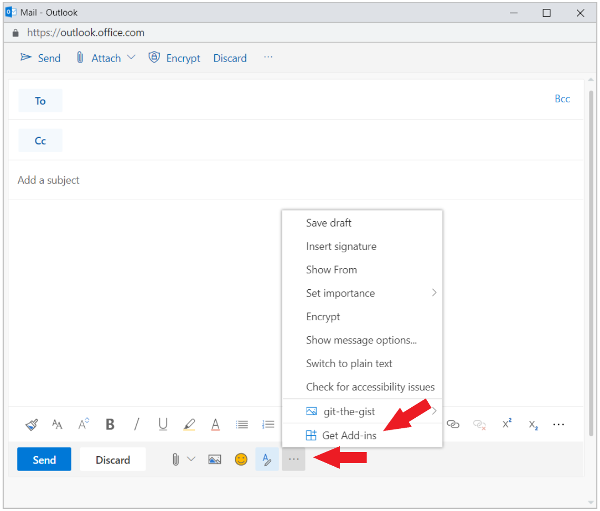

# Загрузка неопубликованных надстроек Outlook для тестирования

Вы можете использовать загрузку неопубликованных надстроек, чтобы установить надстройку Outlook для тестирования, не размещая ее в каталоге надстроек.

## Загрузка неогрузки автоматически

Если вы создали надстройку Outlook с помощью генератора [Yeoman](https://github.com/OfficeDev/generator-office)для надстройки Office, загрузка нео боков лучше всего сделать с помощью командной строки. Это позволит использовать наши инструменты и загрузку неогрузки на всех поддерживаемых устройствах в одной команде.

1. С помощью командной строки перейдите в корневой каталог проекта надстройки, сгенерированного Yeoman. Выполните команду `npm start`.

2. Надстройка Outlook автоматически перезагрузит неогружаемую версию Outlook на настольном компьютере. Появится диалоговое окно с описанием попытки загрузки неогрузки надстройки с указанием имени и расположения файла манифеста. Выберите **"ОК",** чтобы зарегистрировать манифест.

> [!IMPORTANT]
> Если манифест содержит ошибку или путь к манифесту недействителен, вы получите сообщение об ошибке.

3. Если манифест не содержит ошибок и путь действителен, ваша надстройка будет загружена нео разгруженной и доступна как на рабочем столе, так и в Outlook в Интернете. Он также будет установлен на всех поддерживаемых устройствах.

## Загрузка неогрузки вручную

Несмотря на то, что мы настоятельно рекомендуем автоматически перезагружать неогрузку через командную строку, как полось в предыдущем разделе, вы также можете вручную загрузку неогрузки надстройки Outlook на основе клиента Outlook.

### Outlook в Интернете

Процесс загрузки неостройки надстройки в Outlook в Интернете зависит от того, используете ли вы новую или классическую версию.

- Если ваша панель инструментов почтового ящика выглядит так, как показано на изображении ниже, см. статью [Загрузка неопубликованных надстроек в новой веб-версии Outlook](#new-outlook-on-the-web).

    

- Если ваша панель инструментов почтового ящика выглядит так, как показано на изображении ниже, см. статью [Загрузка неопубликованных надстроек в классической веб-версии Outlook](#classic-outlook-on-the-web).

    

> [!NOTE]
> Если ваша организация добавили свой логотип на панель инструментов почтового ящика, вы можете увидеть изображение, которое будет немного отличаться от показанных ранее изображений.

### Новый Outlook в Интернете

1. Откройте [Outlook в Интернете](https://outlook.office.com).

1. Создайте новое сообщение.

1. Выберите **...** в нижней части нового сообщения, а затем выберите **Получить надстройки** в появившемся меню.

    

1. В диалоговом окне **Надстройки для Outlook** выберите **Мои надстройки**.

    

1. Найдите раздел **Пользовательские надстройки** в нижней части диалогового окна. Выберите **Добавить пользовательскую надстройку** > **Добавить из файла**.

    

1. Найдите файл манифеста для своей надстройки и установите его, подтверждая все запросы.

### Классический Outlook в Интернете

1. Откройте [Outlook в Интернете](https://outlook.office.com).

1. Нажмите значок шестеренки в верхнем правом углу панели инструментов и выберите пункт **Управление надстройками**.

    

1. На странице **Управление надстройками** выберите **Надстройки** > **Мои надстройки**.

    

1. Найдите раздел **Пользовательские надстройки** в нижней части диалогового окна. Выберите **Добавить пользовательскую надстройку** > **Добавить из файла**.

    

1. Найдите файл манифеста для своей надстройки и установите его, подтверждая все запросы.

### Outlook на рабочем столе

#### Outlook 2016 или более поздней

1. Откройте Outlook 2016 или более поздней версии для Windows или Mac.

1. Нажмите кнопку **Получить надстройки** на ленте.

    

    > [!IMPORTANT]
    > Если вы не видите кнопку **"Получить надстройки"** в своей версии Outlook, выберите:
    >
    > - **Кнопка** "Сохранить" на ленте, если она доступна.
    >
    >   ИЛИ
    >
    > - **Меню** "Файл" выберите кнопку "Управление  надстройками"  на вкладке "Сведения", чтобы открыть диалоговое окно "Надстройки" в Outlook в Интернете.  Подробнее о веб-браузере см. в предыдущем разделе "Загрузка нео приостановки загрузки надстройки [в Outlook в Интернете".](#outlook-on-the-web)

1. Если в верхней части диалоговых окно есть  вкладки, убедитесь, что выбрана вкладка "Надстройки". Выберите **Мои надстройки**.

    

1. Найдите раздел **Пользовательские надстройки** в нижней части диалогового окна. Выберите **Добавить пользовательскую надстройку** > **Добавить из файла**.

    

1. Найдите файл манифеста для своей надстройки и установите его, подтверждая все запросы.

#### Outlook 2013

1. Откройте Outlook 2013 в Windows.

1. Выберите меню **"Файл",** а затем кнопку "Управление надстройками" на вкладке **"Сведения".**  Outlook откроет веб-версию в браузере.

1. Выполните действия, необходимые для загрузки неогрузки надстройки в [разделе Outlook в](#outlook-on-the-web) Интернете в соответствии с вашей версией Outlook в Интернете.

## Удаление неогруженной надстройки

Во всех версиях Outlook ключом к удаляемой неогруженной надстройке является диалоговое окно "Мои надстройки", в котором перечислены установленные надстройки.  Выберите многоязык `...` () для надстройки, а затем выберите **"Удалить".**

Чтобы перейти  к диалоговому окну "Мои надстройки"  для клиента Outlook, воспользуйтесь последними действиями, перечисленными для загрузки неогрузки вручную в предыдущих разделах этой статьи.

Чтобы удалить неогруженную надстройку из Outlook, воспользуйтесь действиями, описанными  выше в этой статье, чтобы найти надстройку в разделе "Пользовательские надстройки" диалоговых окна с списком установленных надстроек. Выберите многоязык () для надстройки, а затем выберите "Удалить", чтобы удалить эту `...` надстройка. 

